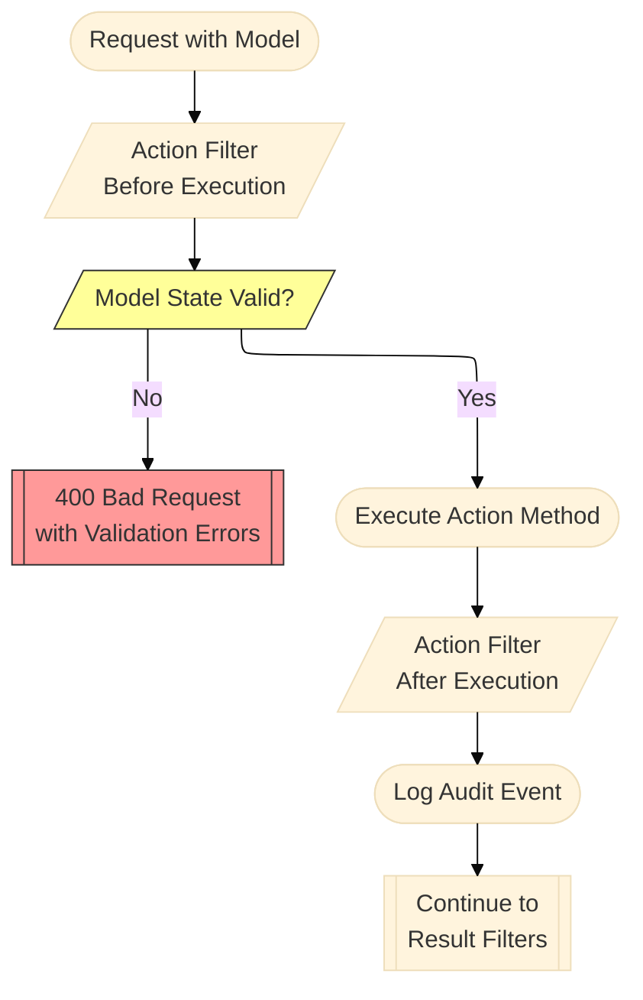

# diagram_05_action-filter-flow-with-validation-2b07

```mermaid
---
config:
  theme: base
  layout: elk
---
flowchart TD
    A([Request with Model]) --> B[/Action Filter<br/>Before Execution/]
    B --> C[/Model State Valid?/]
    C -->|No| D[[400 Bad Request<br/>with Validation Errors]]
    C -->|Yes| E([Execute Action Method])
    E --> F[/Action Filter<br/>After Execution/]
    F --> G([Log Audit Event])
    G --> H[[Continue to<br/>Result Filters]]
    
    style C fill:#ff9,stroke:#333
    style D fill:#f99,stroke:#333
```
