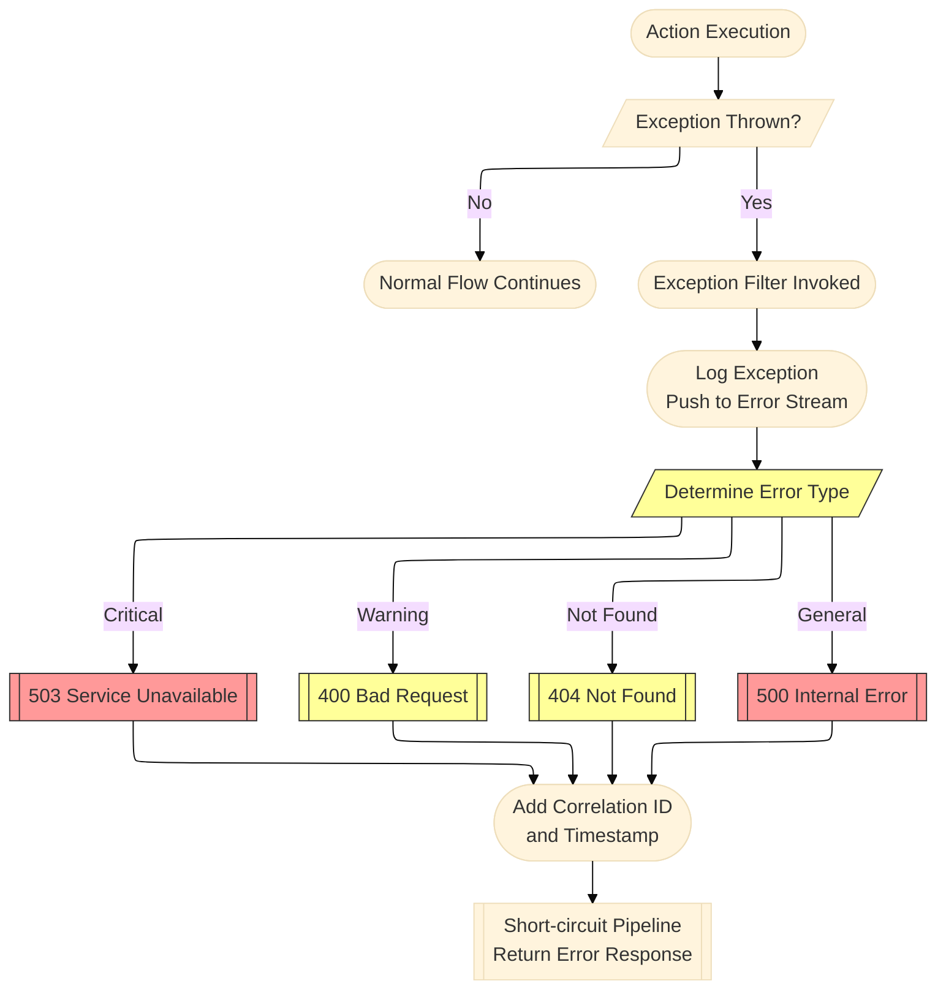

# diagram_06_exception-handling-flow

```mermaid
---
config:
  theme: base
  layout: elk
---
flowchart TB
    A(["Action Execution"]) --> B[/"Exception Thrown?"/]
    B -- No --> C(["Normal Flow Continues"])
    B -- Yes --> D(["Exception Filter Invoked"])
    D --> E(["Log Exception<br>Push to Error Stream"])
    E --> F[/"Determine Error Type"/]
    F -- Critical --> G[["503 Service Unavailable"]]
    F -- Warning --> H[["400 Bad Request"]]
    F -- Not Found --> I[["404 Not Found"]]
    F -- General --> J[["500 Internal Error"]]
    G --> K(["Add Correlation ID<br>and Timestamp"])
    H --> K
    I --> K
    J --> K
    K --> L[["Short-circuit Pipeline<br>Return Error Response"]]

    style F fill:#ff9,stroke:#333
    style G fill:#f99,stroke:#333
    style H fill:#ff9,stroke:#333
    style I fill:#ff9,stroke:#333
    style J fill:#f99,stroke:#333
```
