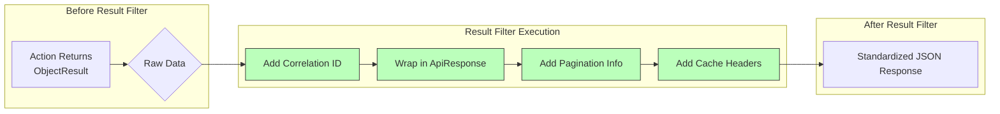

# diagram_07_response-transformation-flow

```mermaid
---
config:
  theme: default
  layout: elk
---
flowchart LR
    subgraph "Before Result Filter"
        A[Action Returns<br/>ObjectResult] --> B{Raw Data}
    end
    
    subgraph "Result Filter Execution"
        B --> C[Add Correlation ID]
        C --> D[Wrap in ApiResponse<T>]
        D --> E[Add Pagination Info]
        E --> F[Add Cache Headers]
    end
    
    subgraph "After Result Filter"
        F --> G[Standardized JSON Response]
    end
    
    style C fill:#bfb,stroke:#333
    style D fill:#bfb,stroke:#333
    style E fill:#bfb,stroke:#333
    style F fill:#bfb,stroke:#333
```
