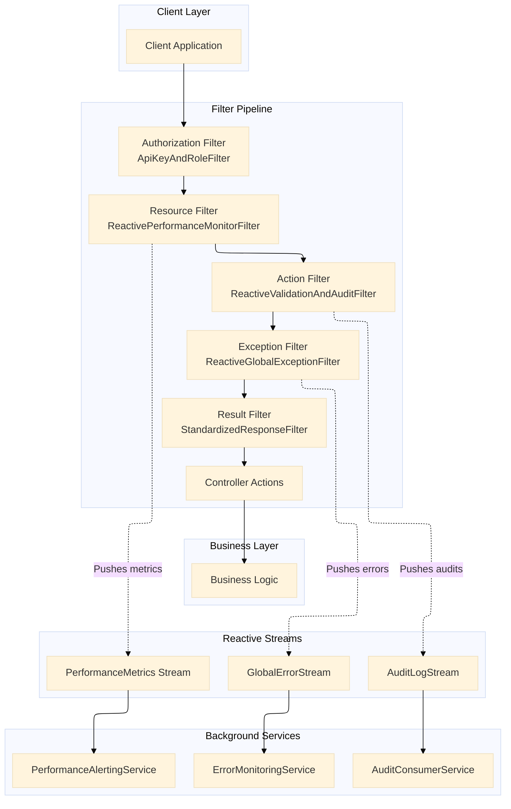

# diagram_08_complete-filter-pipeline-architecture-2441

```mermaid
---
config:
  theme: base
  layout: elk
---
flowchart TB
 subgraph subGraph0["Client Layer"]
        Client["Client Application"]
  end
 subgraph subGraph1["Filter Pipeline"]
    direction TB
        F1["Authorization Filter<br>ApiKeyAndRoleFilter"]
        F2["Resource Filter<br>ReactivePerformanceMonitorFilter"]
        F3["Action Filter<br>ReactiveValidationAndAuditFilter"]
        F4["Exception Filter<br>ReactiveGlobalExceptionFilter"]
        F5["Result Filter<br>StandardizedResponseFilter"]
        Controller["Controller Actions"]
  end
 subgraph subGraph2["Business Layer"]
        Business["Business Logic"]
  end
 subgraph subGraph3["Reactive Streams"]
        Stream1["PerformanceMetrics Stream"]
        Stream2["AuditLogStream"]
        Stream3["GlobalErrorStream"]
  end
 subgraph subGraph4["Background Services"]
        Service1["PerformanceAlertingService"]
        Service2["AuditConsumerService"]
        Service3["ErrorMonitoringService"]
  end
    Client --> F1
    F1 --> F2
    F2 --> F3
    F3 --> F4
    F4 --> F5
    F5 --> Controller
    Controller --> Business
    F2 -. Pushes metrics .-> Stream1
    F3 -. Pushes audits .-> Stream2
    F4 -. Pushes errors .-> Stream3
    Stream1 --> Service1
    Stream2 --> Service2
    Stream3 --> Service3
```
