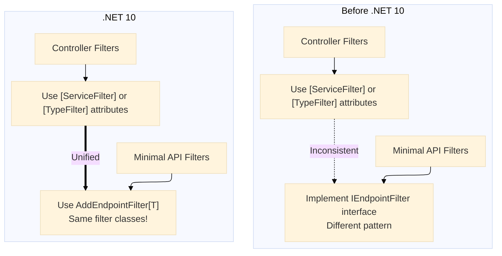

# diagram_09_filter-registration-comparison-net-10-vs-prev-d333

```mermaid
---
config:
  theme: base
  layout: elk
---
flowchart TB
 subgraph subGraph0["Before .NET 10"]
        B1["Use [ServiceFilter] or [TypeFilter] attributes"]
        A1["Controller Filters"]
        D1["Implement IEndpointFilter interface\nDifferent pattern"]
        C1["Minimal API Filters"]
  end
 subgraph subGraph1[".NET 10"]
        B2["Use [ServiceFilter] or [TypeFilter] attributes"]
        A2["Controller Filters"]
        D2["Use AddEndpointFilter[T]\nSame filter classes!"]
        C2["Minimal API Filters"]
  end
    A1 --> B1
    C1 --> D1
    B1 -. Inconsistent .-> D1
    A2 --> B2
    C2 --> D2
    B2 == Unified ==> D2
```
