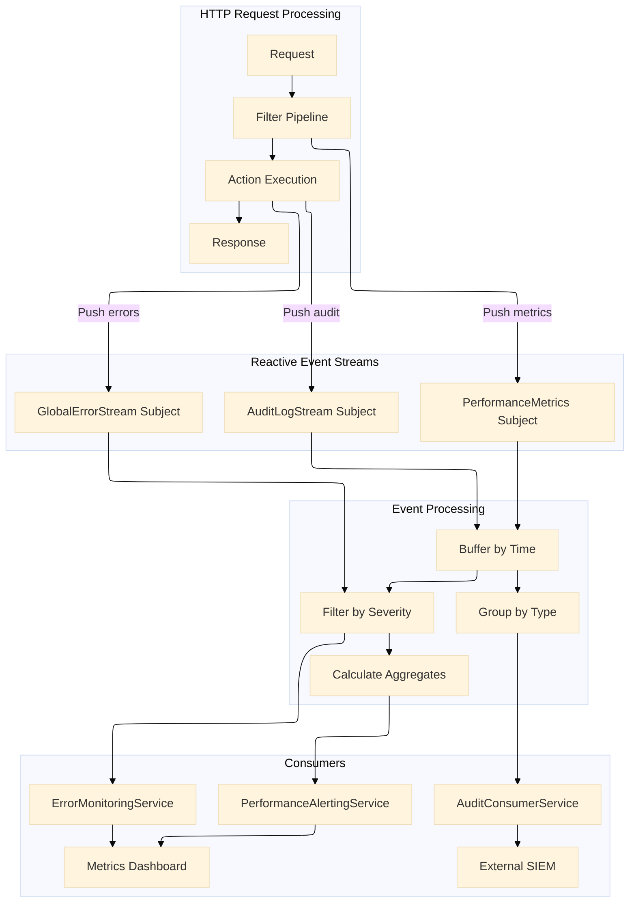

# diagram_10_reactive-streams-architecture

```mermaid
---
config:
  theme: base
  layout: elk
---
flowchart TB
 subgraph subGraph0["HTTP Request Processing"]
        B["Filter Pipeline"]
        A["Request"]
        C["Action Execution"]
        D["Response"]
  end
 subgraph subGraph1["Reactive Event Streams"]
        E["PerformanceMetrics Subject"]
        F["AuditLogStream Subject"]
        G["GlobalErrorStream Subject"]
  end
 subgraph subGraph2["Event Processing"]
        H["Buffer by Time"]
        I["Filter by Severity"]
        J["Group by Type"]
        K["Calculate Aggregates"]
  end
 subgraph Consumers["Consumers"]
        L["PerformanceAlertingService"]
        M["AuditConsumerService"]
        N["ErrorMonitoringService"]
        O["External SIEM"]
        P["Metrics Dashboard"]
  end
    A --> B
    B --> C
    C --> D
    B -- Push metrics --> E
    C -- Push audit --> F
    C -- Push errors --> G
    E --> H
    H --> I & J
    I --> K & N
    K --> L
    F --> H
    J --> M
    G --> I
    L --> P
    M --> O
    N --> P
```
