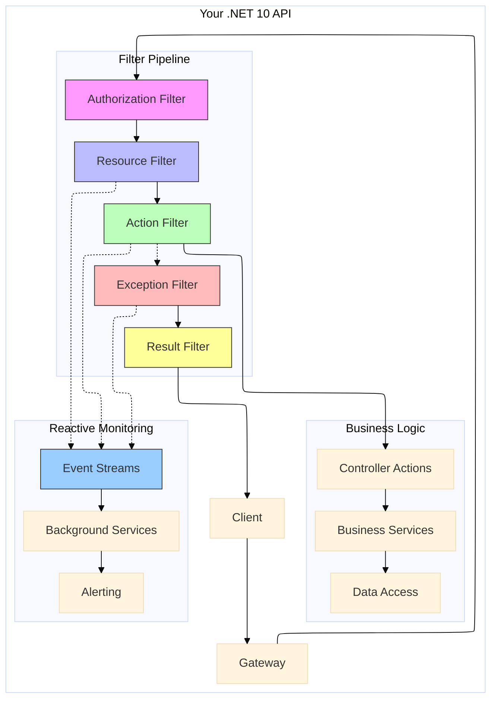

# diagram_11_final-architecture-overview

```mermaid
---
config:
  theme: base
  layout: elk
---
flowchart TB
 subgraph subGraph0["Filter Pipeline"]
        Auth["Authorization Filter"]
        Resource["Resource Filter"]
        Action["Action Filter"]
        Exception["Exception Filter"]
        Result["Result Filter"]
  end
 subgraph subGraph1["Business Logic"]
        Controller["Controller Actions"]
        Service["Business Services"]
        Repository["Data Access"]
  end
 subgraph subGraph2["Reactive Monitoring"]
        Streams["Event Streams"]
        Services["Background Services"]
        Alerts["Alerting"]
  end
 subgraph subGraph3["Your .NET 10 API"]
    direction TB
        Gateway["Gateway"]
        Client["Client"]
        subGraph0
        subGraph1
        subGraph2
  end
    Client --> Gateway
    Gateway --> Auth
    Auth --> Resource
    Resource --> Action
    Action --> Controller
    Controller --> Service
    Service --> Repository
    Action -.-> Exception & Streams
    Exception --> Result
    Result --> Client
    Resource -.-> Streams
    Exception -.-> Streams
    Streams --> Services
    Services --> Alerts

    style Auth fill:#f9f,stroke:#333
    style Resource fill:#bbf,stroke:#333
    style Action fill:#bfb,stroke:#333
    style Exception fill:#fbb,stroke:#333
    style Result fill:#ff9,stroke:#333
    style Streams fill:#9cf,stroke:#333
    style subGraph3 fill:transparent
```
