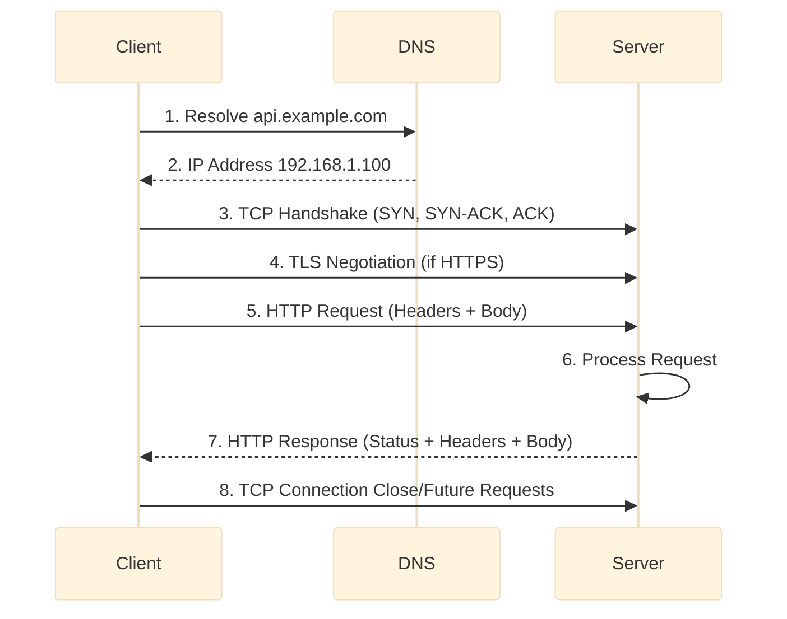

# ```


```mermaid
---
config:
  theme: base
  layout: elk
---
sequenceDiagram
    participant Client
    participant DNS
    participant Server
    
    Client->>DNS: 1. Resolve api.example.com
    DNS-->>Client: 2. IP Address 192.168.1.100
    Client->>Server: 3. TCP Handshake (SYN, SYN-ACK, ACK)
    Client->>Server: 4. TLS Negotiation (if HTTPS)
    Client->>Server: 5. HTTP Request (Headers + Body)
    Server->>Server: 6. Process Request
    Server-->>Client: 7. HTTP Response (Status + Headers + Body)
    Client->>Server: 8. TCP Connection Close/Future Requests
```
