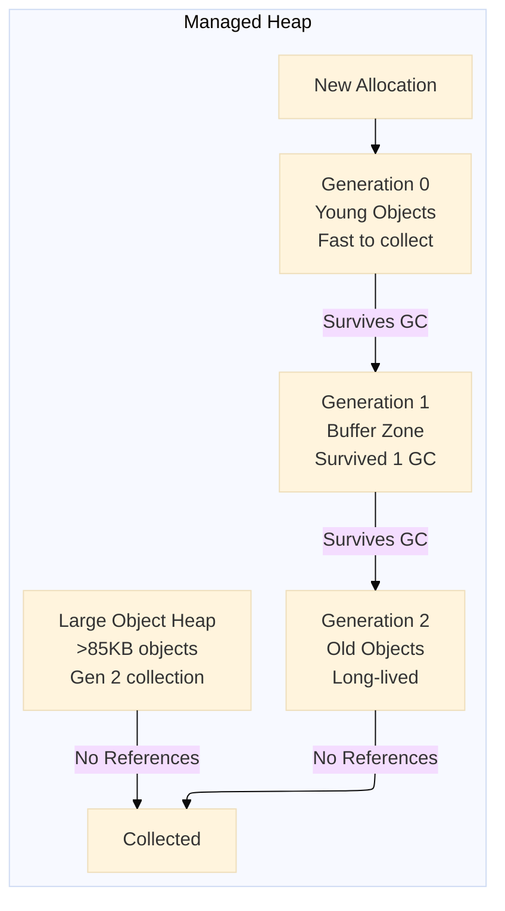

# *Testing with 10,000 iterations of adding 1,000 in

```mermaid
---
config:
  theme: base
  layout: elk
---
graph TD
    subgraph "Managed Heap"
        Gen0["Generation 0<br/>Young Objects<br/>Fast to collect"]
        Gen1["Generation 1<br/>Buffer Zone<br/>Survived 1 GC"]
        Gen2["Generation 2<br/>Old Objects<br/>Long-lived"]
        LOH["Large Object Heap<br/>>85KB objects<br/>Gen 2 collection"]
        
        New["New Allocation"] --> Gen0
        Gen0 -- "Survives GC" --> Gen1
        Gen1 -- "Survives GC" --> Gen2
        Gen2 -- "No References" --> Collected
        LOH -- "No References" --> Collected
    end
```
