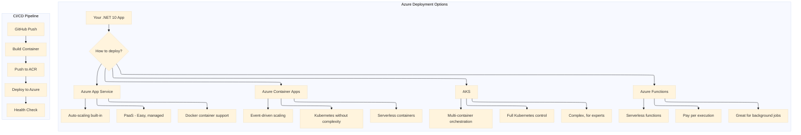

# ```


```mermaid
---
config:
  theme: base
  layout: elk
---
graph TD
    subgraph "Azure Deployment Options"
        A[Your .NET 10 App] --> B{How to deploy?}
        
        B --> C[Azure App Service]
        B --> D[Azure Container Apps]
        B --> E[Azure Functions]
        B --> F[AKS]
        
        C --> C1[PaaS - Easy, managed]
        C --> C2[Docker container support]
        C --> C3[Auto-scaling built-in]
        
        D --> D1[Kubernetes without complexity]
        D --> D2[Serverless containers]
        D --> D3[Event-driven scaling]
        
        E --> E1[Serverless functions]
        E --> E2[Pay per execution]
        E --> E3[Great for background jobs]
        
        F --> F1[Full Kubernetes control]
        F --> F2[Complex, for experts]
        F --> F3[Multi-container orchestration]
    end
    
    subgraph "CI/CD Pipeline"
        G[GitHub Push] --> H[Build Container]
        H --> I[Push to ACR]
        I --> J[Deploy to Azure]
        J --> K[Health Check]
    end
```
