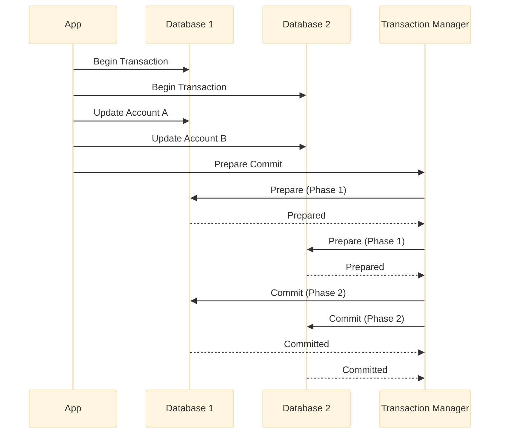

# ```


```mermaid
---
config:
  theme: base
  layout: elk
---
sequenceDiagram
    participant App
    participant DB1 as Database 1
    participant DB2 as Database 2
    participant TM as Transaction Manager
    
    App->>DB1: Begin Transaction
    App->>DB2: Begin Transaction
    App->>DB1: Update Account A
    App->>DB2: Update Account B
    App->>TM: Prepare Commit
    TM->>DB1: Prepare (Phase 1)
    DB1-->>TM: Prepared
    TM->>DB2: Prepare (Phase 1)
    DB2-->>TM: Prepared
    TM->>DB1: Commit (Phase 2)
    TM->>DB2: Commit (Phase 2)
    DB1-->>TM: Committed
    DB2-->>TM: Committed
```
