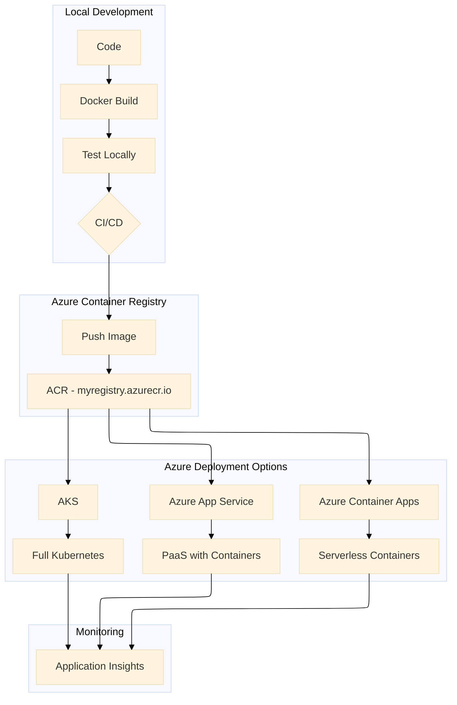

# ```


```mermaid
---
config:
  theme: base
  layout: elk
---
graph TD
    subgraph "Local Development"
        A[Code] --> B[Docker Build]
        B --> C[Test Locally]
        C --> D{CI/CD}
    end
    
    subgraph "Azure Container Registry"
        D --> E[Push Image]
        E --> F[ACR - myregistry.azurecr.io]
    end
    
    subgraph "Azure Deployment Options"
        F --> G[Azure Container Apps]
        F --> H[Azure App Service]
        F --> I[AKS]
        
        G --> J[Serverless Containers]
        H --> K[PaaS with Containers]
        I --> L[Full Kubernetes]
    end
    
    subgraph "Monitoring"
        J --> M[Application Insights]
        K --> M
        L --> M
    end
```
