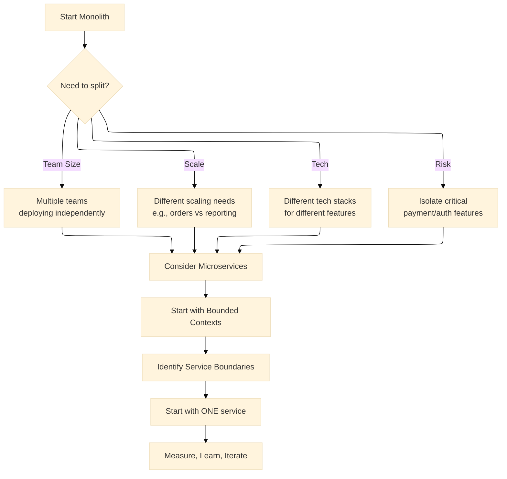

# **When to Consider Splitting:**

```mermaid
---
config:
  theme: base
  layout: elk
---
graph TD
    A[Start Monolith] --> B{Need to split?}
    
    B -->|Team Size| C[Multiple teams<br/>deploying independently]
    B -->|Scale| D[Different scaling needs<br/>e.g., orders vs reporting]
    B -->|Tech| E[Different tech stacks<br/>for different features]
    B -->|Risk| F[Isolate critical<br/>payment/auth features]
    
    C --> G[Consider Microservices]
    D --> G
    E --> G
    F --> G
    
    G --> H[Start with Bounded Contexts]
    H --> I[Identify Service Boundaries]
    I --> J[Start with ONE service]
    J --> K[Measure, Learn, Iterate]
```
