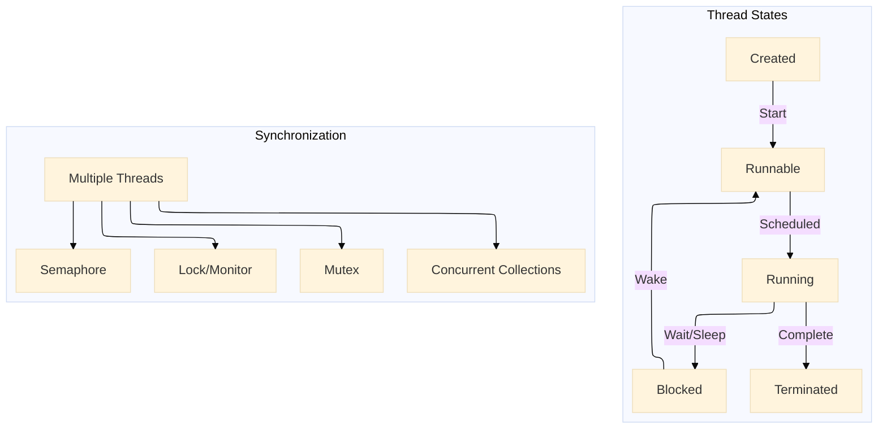

# | Complex state | Concurrent collections | Built f

```mermaid
---
config:
  theme: base
  layout: elk
---
graph TD
    subgraph "Thread States"
        A[Created] -->|Start| B[Runnable]
        B -->|Scheduled| C[Running]
        C -->|Wait/Sleep| D[Blocked]
        D -->|Wake| B
        C -->|Complete| E[Terminated]
    end
    
    subgraph "Synchronization"
        F[Multiple Threads] --> G[Lock/Monitor]
        F --> H[Mutex]
        F --> I[Semaphore]
        F --> J[Concurrent Collections]
    end
```
