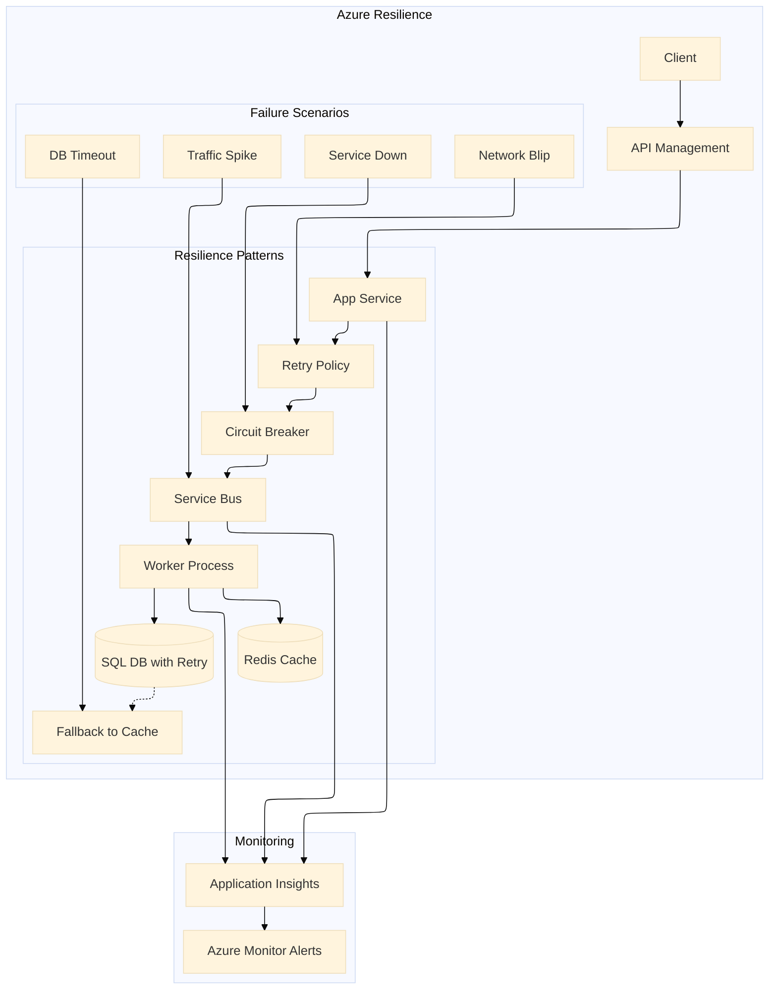

# | Fallback | Redis Cache | Return cached data |

```mermaid
---
config:
  theme: base
  layout: elk
---
graph TD
    subgraph "Azure Resilience"
        Client[Client] --> APIM[API Management]
        APIM --> App[App Service]
        
        subgraph "Resilience Patterns"
            App --> Retry[Retry Policy]
            Retry --> CB[Circuit Breaker]
            CB --> SB[Service Bus]
            SB --> Worker[Worker Process]
            
            Worker --> DB[(SQL DB with Retry)]
            Worker --> Cache[(Redis Cache)]
            
            DB -.-> Fallback[Fallback to Cache]
        end
        
        subgraph "Failure Scenarios"
            F1[Network Blip] --> Retry
            F2[Service Down] --> CB
            F3[Traffic Spike] --> SB
            F4[DB Timeout] --> Fallback
        end
    end
    
    subgraph "Monitoring"
        App --> AI[Application Insights]
        SB --> AI
        Worker --> AI
        AI --> Alerts[Azure Monitor Alerts]
    end
```
