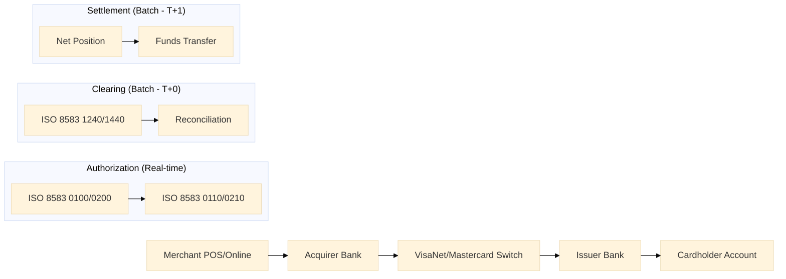

# diagram_01_transaction-flow

```mermaid
---
config:
  theme: base
  layout: elk
---
graph LR
    Merchant[Merchant POS/Online] --> Acquirer[Acquirer Bank]
    Acquirer --> Switch[VisaNet/Mastercard Switch]
    Switch --> Issuer[Issuer Bank]
    Issuer --> Account[Cardholder Account]
    
    subgraph Authorization["Authorization (Real-time)"]
        direction LR
        A1[ISO 8583 0100/0200] --> A2[ISO 8583 0110/0210]
    end
    
    subgraph Clearing["Clearing (Batch - T+0)"]
        direction LR
        C1[ISO 8583 1240/1440] --> C2[Reconciliation]
    end
    
    subgraph Settlement["Settlement (Batch - T+1)"]
        direction LR
        S1[Net Position] --> S2[Funds Transfer]
    end
```
