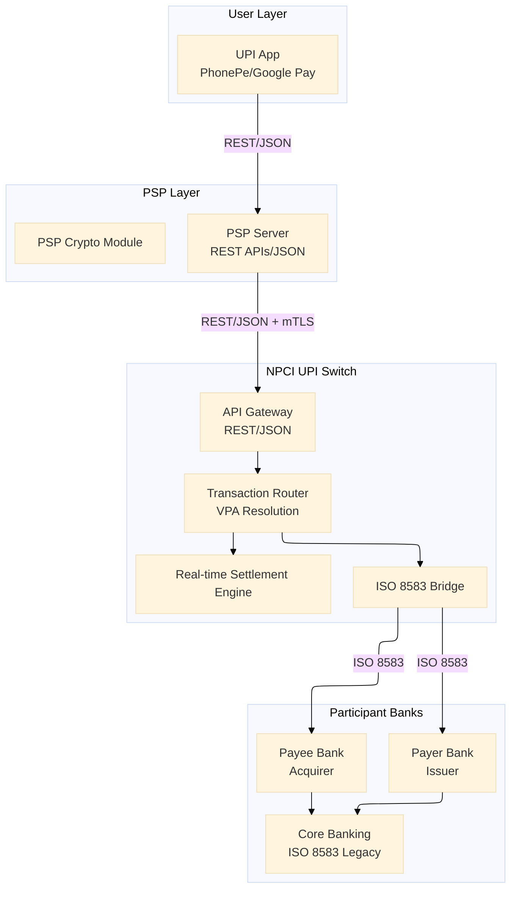

# diagram_02_architectural-principles

```mermaid
---
config:
  theme: base
  layout: elk
---
graph TB
    subgraph User["User Layer"]
        UPI_App[UPI App<br/>PhonePe/Google Pay]
    end
    
    subgraph PSP["PSP Layer"]
        PSP_Server[PSP Server<br/>REST APIs/JSON]
        PSP_Crypto[PSP Crypto Module]
    end
    
    subgraph NPCI["NPCI UPI Switch"]
        API_Gateway[API Gateway<br/>REST/JSON]
        Router[Transaction Router<br/>VPA Resolution]
        ISO_Bridge[ISO 8583 Bridge]
        RT_Set[Real-time Settlement Engine]
    end
    
    subgraph Banks["Participant Banks"]
        Payer_Bank[Payer Bank<br/>Issuer]
        Payee_Bank[Payee Bank<br/>Acquirer]
        Core[Core Banking<br/>ISO 8583 Legacy]
    end
    
    UPI_App -->|REST/JSON| PSP_Server
    PSP_Server -->|REST/JSON + mTLS| API_Gateway
    API_Gateway --> Router
    Router --> ISO_Bridge
    ISO_Bridge -->|ISO 8583| Payer_Bank
    ISO_Bridge -->|ISO 8583| Payee_Bank
    Payer_Bank --> Core
    Payee_Bank --> Core
    Router --> RT_Set
```
