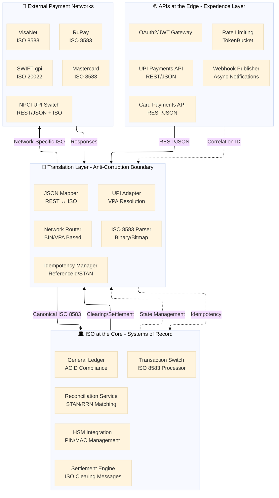

# diagram_03_the-correct-architectural-pattern-is-not-protocol-acc0

```mermaid
---
config:
  theme: base
  layout: elk
---
graph TB
    subgraph Core["🏛️ ISO at the Core - Systems of Record"]
        direction TB
        Switch[Transaction Switch<br/>ISO 8583 Processor]
        Ledger[General Ledger<br/>ACID Compliance]
        Settlement[Settlement Engine<br/>ISO Clearing Messages]
        Reconciliation[Reconciliation Service<br/>STAN/RRN Matching]
        HSM[HSM Integration<br/>PIN/MAC Management]
    end
    
    subgraph Translation["🔄 Translation Layer - Anti-Corruption Boundary"]
        direction LR
        ISO_Parser[ISO 8583 Parser<br/>Binary/Bitmap]
        JSON_Mapper[JSON Mapper<br/>REST ↔ ISO]
        UPI_Adapter[UPI Adapter<br/>VPA Resolution]
        Router[Network Router<br/>BIN/VPA Based]
        Idempotency[Idempotency Manager<br/>ReferenceId/STAN]
    end
    
    subgraph Edge["🌐 APIs at the Edge - Experience Layer"]
        direction TB
        Card_API[Card Payments API<br/>REST/JSON]
        UPI_API[UPI Payments API<br/>REST/JSON]
        Webhook[Webhook Publisher<br/>Async Notifications]
        Auth[OAuth2/JWT Gateway]
        RateLimit[Rate Limiting<br/>TokenBucket]
    end
    
    subgraph Networks["📡 External Payment Networks"]
        direction LR
        VisaNet[VisaNet<br/>ISO 8583]
        Mastercard[Mastercard<br/>ISO 8583]
        RuPay[RuPay<br/>ISO 8583]
        UPI_Switch[NPCI UPI Switch<br/>REST/JSON + ISO]
        Swift[SWIFT gpi<br/>ISO 20022]
    end
    
    Edge -->|REST/JSON| Translation
    Translation -->|Canonical ISO 8583| Core
    Core -->|Clearing/Settlement| Translation
    Translation -->|Network-Specific ISO| Networks
    Networks -->|Responses| Translation
    
    Core -.->|State Management| Translation
    Translation -.->|Idempotency| Core
    Edge -.->|Correlation ID| Translation
```
