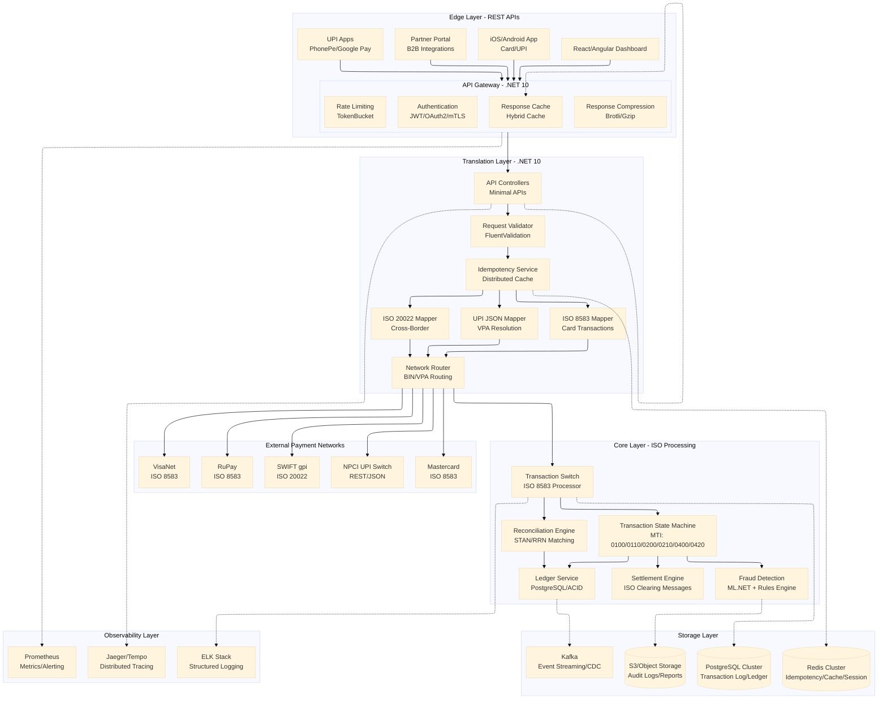

# diagram_04_the-following-diagram-illustrates-the-complete-arc-7b7f

```mermaid
---
config:
  theme: base
  layout: elk
---
graph TB
    subgraph Edge["Edge Layer - REST APIs"]
        Mobile[iOS/Android App<br/>Card/UPI]
        Web[React/Angular Dashboard]
        Partner[Partner Portal<br/>B2B Integrations]
        UPI_App[UPI Apps<br/>PhonePe/Google Pay]
        
        subgraph Gateway["API Gateway - .NET 10"]
            Auth[Authentication<br/>JWT/OAuth2/mTLS]
            RateLimit[Rate Limiting<br/>TokenBucket]
            Cache[Response Cache<br/>Hybrid Cache]
            Compress[Response Compression<br/>Brotli/Gzip]
        end
    end
    
    subgraph Translation["Translation Layer - .NET 10"]
        Controller[API Controllers<br/>Minimal APIs]
        Validator[Request Validator<br/>FluentValidation]
        Card_Mapper[ISO 8583 Mapper<br/>Card Transactions]
        UPI_Mapper[UPI JSON Mapper<br/>VPA Resolution]
        ISO20022_Mapper[ISO 20022 Mapper<br/>Cross-Border]
        Idempotency[Idempotency Service<br/>Distributed Cache]
        Router[Network Router<br/>BIN/VPA Routing]
    end
    
    subgraph Core["Core Layer - ISO Processing"]
        Switch[Transaction Switch<br/>ISO 8583 Processor]
        State_Machine[Transaction State Machine<br/>MTI: 0100/0110/0200/0210/0400/0420]
        Ledger[Ledger Service<br/>PostgreSQL/ACID]
        Fraud[Fraud Detection<br/>ML.NET + Rules Engine]
        Settlement[Settlement Engine<br/>ISO Clearing Messages]
        Reconciliation[Reconciliation Engine<br/>STAN/RRN Matching]
    end
    
    subgraph Networks["External Payment Networks"]
        direction LR
        VisaNet[VisaNet<br/>ISO 8583]
        Mastercard[Mastercard<br/>ISO 8583]
        RuPay[RuPay<br/>ISO 8583]
        UPI_Switch[NPCI UPI Switch<br/>REST/JSON]
        Swift[SWIFT gpi<br/>ISO 20022]
    end
    
    subgraph Storage["Storage Layer"]
        Redis[(Redis Cluster<br/>Idempotency/Cache/Session)]
        Postgres[(PostgreSQL Cluster<br/>Transaction Log/Ledger)]
        Kafka[Kafka<br/>Event Streaming/CDC]
        S3[(S3/Object Storage<br/>Audit Logs/Reports)]
    end
    
    subgraph Observability["Observability Layer"]
        Metrics[Prometheus<br/>Metrics/Alerting]
        Traces[Jaeger/Tempo<br/>Distributed Tracing]
        Logs[ELK Stack<br/>Structured Logging]
    end
    
    Mobile --> Gateway
    Web --> Gateway
    Partner --> Gateway
    UPI_App --> Gateway
    Gateway --> Controller
    Controller --> Validator
    Validator --> Idempotency
    
    Idempotency --> Card_Mapper
    Idempotency --> UPI_Mapper
    Idempotency --> ISO20022_Mapper
    
    Card_Mapper --> Router
    UPI_Mapper --> Router
    ISO20022_Mapper --> Router
    
    Router --> Switch
    Switch --> State_Machine
    State_Machine --> Ledger
    State_Machine --> Fraud
    State_Machine --> Settlement
    
    Router --> VisaNet
    Router --> Mastercard
    Router --> RuPay
    Router --> UPI_Switch
    Router --> Swift
    
    Switch --> Reconciliation
    Reconciliation --> Ledger
    
    Idempotency -.-> Redis
    Controller -.-> Cache
    Switch -.-> Postgres
    Ledger -.-> Kafka
    Fraud -.-> S3
    
    Gateway -.-> Metrics
    Controller -.-> Traces
    Switch -.-> Logs
```
