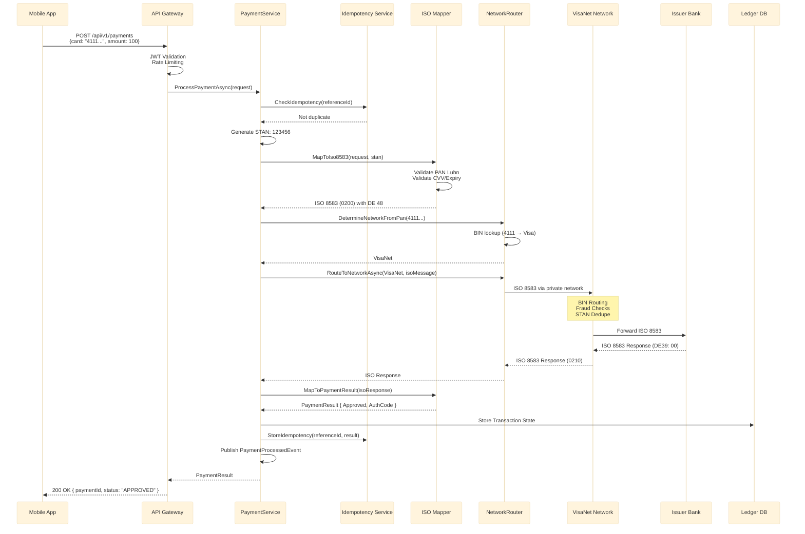

# diagram_05_card-transaction-flow-visanetmastercard-41a5

```mermaid
---
config:
  theme: base
  layout: elk
---
sequenceDiagram
    participant Client as Mobile App
    participant Gateway as API Gateway
    participant Service as PaymentService
    participant Idempotency as Idempotency Service
    participant Mapper as ISO Mapper
    participant Router as NetworkRouter
    participant VisaNet as VisaNet Network
    participant Issuer as Issuer Bank
    participant Ledger as Ledger DB
    
    Client->>Gateway: POST /api/v1/payments<br/>{card: "4111...", amount: 100}
    Gateway->>Gateway: JWT Validation<br/>Rate Limiting
    Gateway->>Service: ProcessPaymentAsync(request)
    
    Service->>Idempotency: CheckIdempotency(referenceId)
    Idempotency-->>Service: Not duplicate
    
    Service->>Service: Generate STAN: 123456
    
    Service->>Mapper: MapToIso8583(request, stan)
    Mapper->>Mapper: Validate PAN Luhn<br/>Validate CVV/Expiry
    Mapper-->>Service: ISO 8583 (0200) with DE 48
    
    Service->>Router: DetermineNetworkFromPan(4111...)
    Router->>Router: BIN lookup (4111 → Visa)
    Router-->>Service: VisaNet
    
    Service->>Router: RouteToNetworkAsync(VisaNet, isoMessage)
    Router->>VisaNet: ISO 8583 via private network
    Note over VisaNet: BIN Routing<br/>Fraud Checks<br/>STAN Dedupe
    VisaNet->>Issuer: Forward ISO 8583
    Issuer-->>VisaNet: ISO 8583 Response (DE39: 00)
    VisaNet-->>Router: ISO 8583 Response (0210)
    Router-->>Service: ISO Response
    
    Service->>Mapper: MapToPaymentResult(isoResponse)
    Mapper-->>Service: PaymentResult { Approved, AuthCode }
    
    Service->>Ledger: Store Transaction State
    Service->>Idempotency: StoreIdempotency(referenceId, result)
    
    Service->>Service: Publish PaymentProcessedEvent
    Service-->>Gateway: PaymentResult
    Gateway-->>Client: 200 OK { paymentId, status: "APPROVED" }
```
