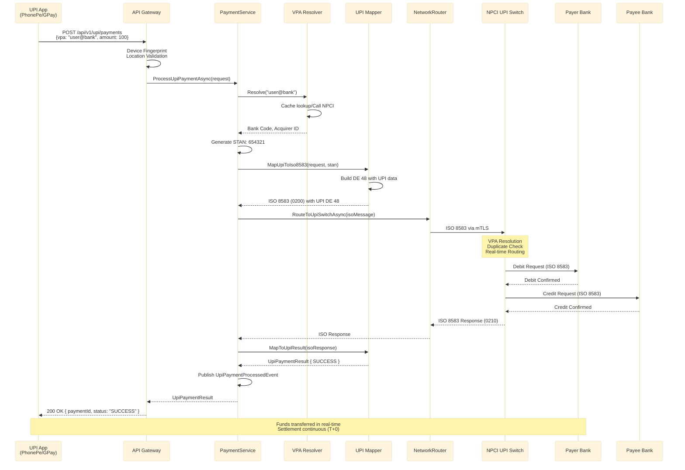

# diagram_06_upi-transaction-flow

```mermaid
---
config:
  theme: base
  layout: elk
---
sequenceDiagram
    participant Client as UPI App<br/>(PhonePe/GPay)
    participant Gateway as API Gateway
    participant Service as PaymentService
    participant VpaResolver as VPA Resolver
    participant Mapper as UPI Mapper
    participant Router as NetworkRouter
    participant Npci as NPCI UPI Switch
    participant PayerBank as Payer Bank
    participant PayeeBank as Payee Bank
    
    Client->>Gateway: POST /api/v1/upi/payments<br/>{vpa: "user@bank", amount: 100}
    Gateway->>Gateway: Device Fingerprint<br/>Location Validation
    Gateway->>Service: ProcessUpiPaymentAsync(request)
    
    Service->>VpaResolver: Resolve("user@bank")
    VpaResolver->>VpaResolver: Cache lookup/Call NPCI
    VpaResolver-->>Service: Bank Code, Acquirer ID
    
    Service->>Service: Generate STAN: 654321
    
    Service->>Mapper: MapUpiToIso8583(request, stan)
    Mapper->>Mapper: Build DE 48 with UPI data
    Mapper-->>Service: ISO 8583 (0200) with UPI DE 48
    
    Service->>Router: RouteToUpiSwitchAsync(isoMessage)
    Router->>Npci: ISO 8583 via mTLS
    
    Note over Npci: VPA Resolution<br/>Duplicate Check<br/>Real-time Routing
    
    Npci->>PayerBank: Debit Request (ISO 8583)
    PayerBank-->>Npci: Debit Confirmed
    Npci->>PayeeBank: Credit Request (ISO 8583)
    PayeeBank-->>Npci: Credit Confirmed
    
    Npci-->>Router: ISO 8583 Response (0210)
    Router-->>Service: ISO Response
    
    Service->>Mapper: MapToUpiResult(isoResponse)
    Mapper-->>Service: UpiPaymentResult { SUCCESS }
    
    Service->>Service: Publish UpiPaymentProcessedEvent
    Service-->>Gateway: UpiPaymentResult
    Gateway-->>Client: 200 OK { paymentId, status: "SUCCESS" }
    
    Note over Client,PayerBank: Funds transferred in real-time<br/>Settlement continuous (T+0)
```
