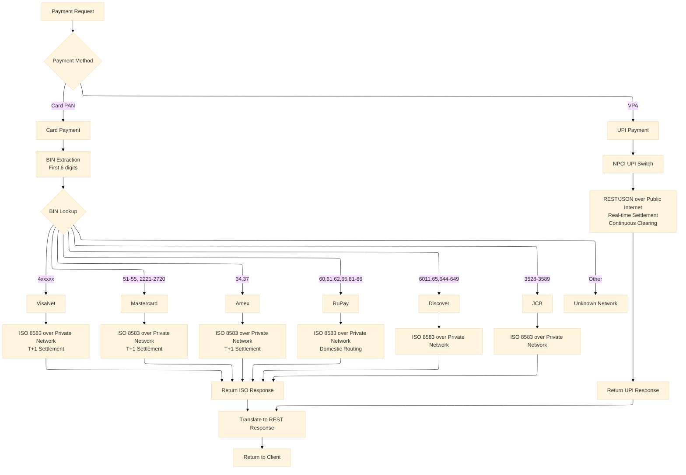

# diagram_07_multi-network-routing-decision-flow-7e0b

```mermaid
---
config:
  theme: base
  layout: elk
---
graph TB
    Start[Payment Request] --> Detect{Payment Method}
    
    Detect -->|Card PAN| Card[Card Payment]
    Detect -->|VPA| UPI[UPI Payment]
    
    Card --> BIN[BIN Extraction<br/>First 6 digits]
    BIN --> BINLookup{BIN Lookup}
    
    BINLookup -->|4xxxxx| Visa[VisaNet]
    BINLookup -->|51-55, 2221-2720| MC[Mastercard]
    BINLookup -->|34,37| Amex[Amex]
    BINLookup -->|60,61,62,65,81-86| RuPay[RuPay]
    BINLookup -->|6011,65,644-649| Discover[Discover]
    BINLookup -->|3528-3589| JCB[JCB]
    BINLookup -->|Other| Unknown[Unknown Network]
    
    UPI --> UPI_Route[NPCI UPI Switch]
    
    Visa --> Visa_Process[ISO 8583 over Private Network<br/>T+1 Settlement]
    MC --> MC_Process[ISO 8583 over Private Network<br/>T+1 Settlement]
    Amex --> Amex_Process[ISO 8583 over Private Network<br/>T+1 Settlement]
    RuPay --> RuPay_Process[ISO 8583 over Private Network<br/>Domestic Routing]
    Discover --> Discover_Process[ISO 8583 over Private Network]
    JCB --> JCB_Process[ISO 8583 over Private Network]
    
    UPI_Route --> UPI_Process[REST/JSON over Public Internet<br/>Real-time Settlement<br/>Continuous Clearing]
    
    Visa_Process --> Response[Return ISO Response]
    MC_Process --> Response
    Amex_Process --> Response
    RuPay_Process --> Response
    Discover_Process --> Response
    JCB_Process --> Response
    UPI_Process --> UPI_Response[Return UPI Response]
    
    Response --> Translate[Translate to REST Response]
    UPI_Response --> Translate
    Translate --> Client[Return to Client]
```
