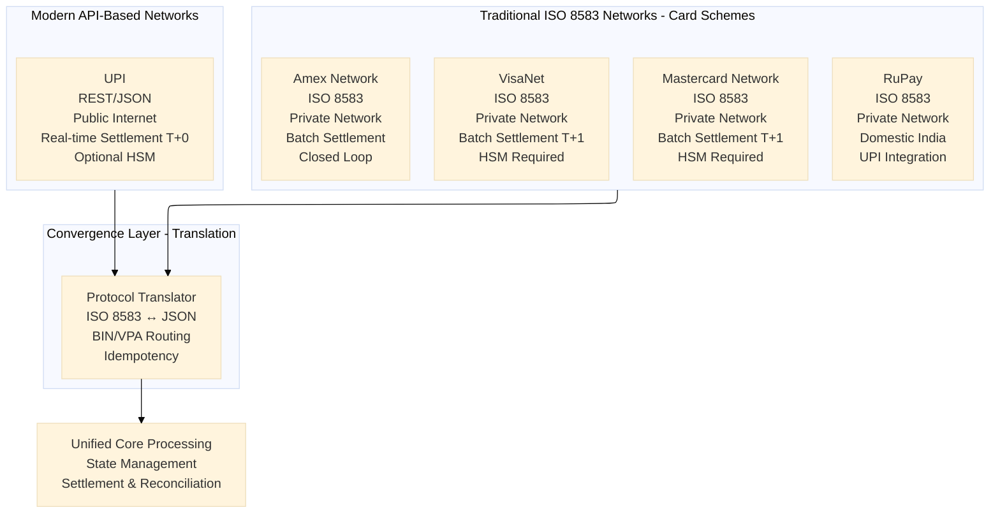

# diagram_08_payment-network-comparison-iso-networks-vs-up-30d4

```mermaid
---
config:
  theme: base
  layout: elk
---
graph TB
    subgraph Legacy["Traditional ISO 8583 Networks - Card Schemes"]
        direction TB
        VisaNet[VisaNet<br/>ISO 8583<br/>Private Network<br/>Batch Settlement T+1<br/>HSM Required]
        Mastercard[Mastercard Network<br/>ISO 8583<br/>Private Network<br/>Batch Settlement T+1<br/>HSM Required]
        Amex[Amex Network<br/>ISO 8583<br/>Private Network<br/>Batch Settlement<br/>Closed Loop]
        RuPay[RuPay<br/>ISO 8583<br/>Private Network<br/>Domestic India<br/>UPI Integration]
    end
    
    subgraph Modern["Modern API-Based Networks"]
        direction TB
        UPI[UPI<br/>REST/JSON<br/>Public Internet<br/>Real-time Settlement T+0<br/>Optional HSM]
    end
    
    subgraph Convergence["Convergence Layer - Translation"]
        direction LR
        Translator[Protocol Translator<br/>ISO 8583 ↔ JSON<br/>BIN/VPA Routing<br/>Idempotency]
    end
    
    Legacy --> Translator
    Modern --> Translator
    Translator --> Core[Unified Core Processing<br/>State Management<br/>Settlement & Reconciliation]
```
