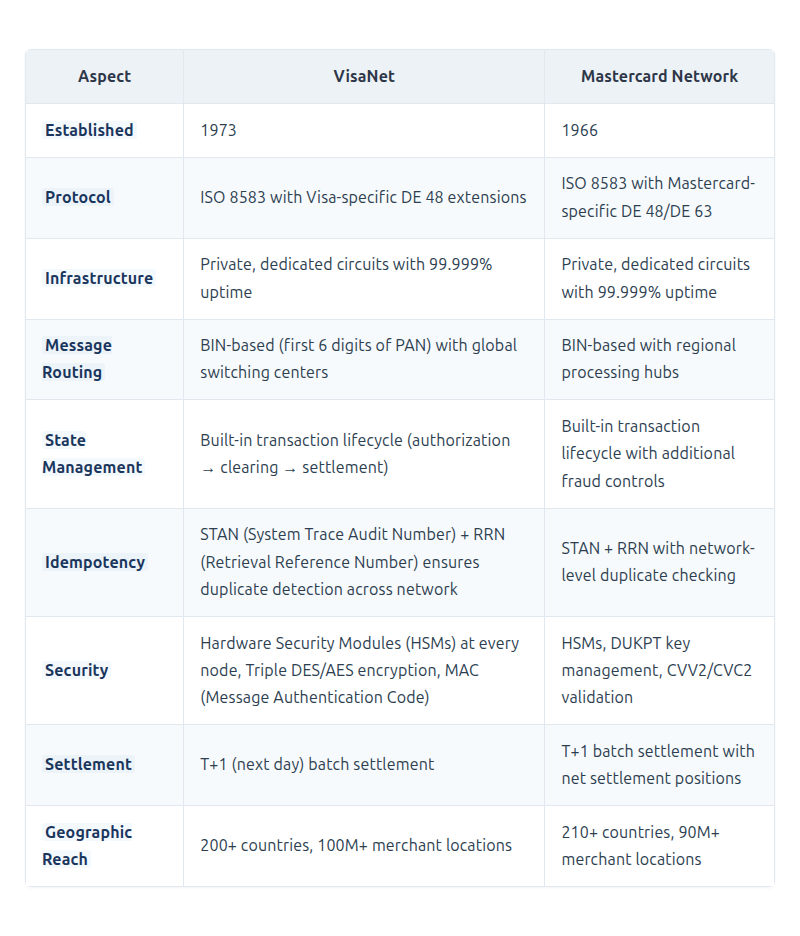
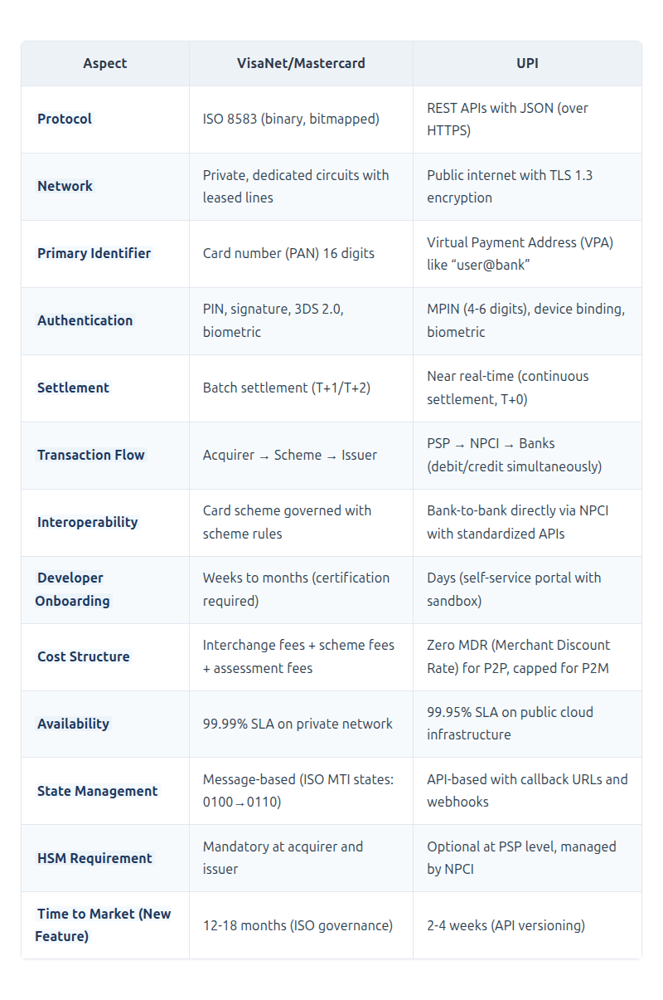
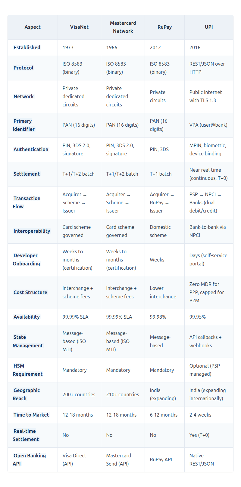
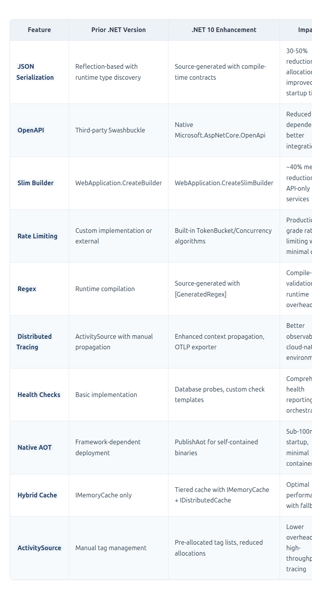

# ISO 8583 vs. REST APIs vs. UPI: Architecting Multi-Network Payment Systems in .NET 10

## Multi-network payment architecture: ISO 8583 for card schemes (VisaNet, Mastercard, RuPay) and REST/JSON for UPI real-time payments — implemented with .NET 10 source generators, Native AOT, and distributed tracing


## Introduction: The Architectural Decision

As a Solution Architect in the financial services domain, one of the most recurring architectural decisions I encounter is the communication protocol choice between ISO standards (8583/20022), REST APIs, and emerging payment systems like UPI. This decision fundamentally impacts system reliability, developer productivity, compliance capabilities, network connectivity, and long-term maintainability across multiple payment networks.

### The Technical Context

**ISO Standards (8583/20022)** emerged from the era of dedicated financial networks. ISO 8583, first published in 1987, was designed for card-based transactions with specific requirements for:
- **Atomic message processing** with built-in reversal and advice constructs
- **Bitmapped data structures** enabling efficient parsing in resource-constrained environments
- **Deterministic state machines** defined by Message Type Indicators (MTI)
- **Hardware Security Module (HSM) integration** for message authentication
- **Switched network architecture** designed for ISO 8583, such as VisaNet and Mastercard's Network, which provide dedicated, reliable, and low-latency connectivity between acquirers, issuers, and processing centers

**REST APIs with JSON/XML** represent the architectural style of the modern web, prioritizing:
- **Resource-oriented operations** (CRUD) over message-based patterns
- **Stateless interactions** leveraging HTTP semantics
- **Schema flexibility** enabling rapid evolution without version governance
- **Developer ergonomics** through self-documenting endpoints and tooling
- **Cloud-native deployment** with auto-scaling and containerization

**UPI (Unified Payments Interface)** represents the modern API-first approach to payments:
- **Mobile-first design** built for smartphone users, not POS terminals
- **Virtual Payment Address (VPA)** abstraction eliminating sensitive account details
- **Real-time settlement** with continuous clearing instead of batch processing
- **Open banking ecosystem** enabling hundreds of third-party PSPs (PhonePe, Google Pay, etc.)
- **Public internet infrastructure** with TLS encryption instead of private circuits

### The Real-World Use Case

Consider a payment processing platform that must:
1. **Accept payments** from mobile applications, web dashboards, and third-party integrations
2. **Connect to core banking systems** that only communicate via ISO 8583
3. **Maintain transaction integrity** across network failures
4. **Support settlement and reconciliation** processes that rely on ISO message structures
5. **Enable rapid feature development** for customer-facing channels
6. **Integrate with multiple payment networks** including VisaNet, Mastercard, RuPay, and UPI
7. **Handle different authentication mechanisms** from card PIN to UPI MPIN and biometrics
8. **Support different settlement cycles** from T+1 batch to near real-time

This scenario creates a clear architectural tension: the ISO mandate from core systems versus the API expectations of modern frontend teams, with UPI representing an alternative modern payment rail that bridges both worlds.

### Payment Network Architecture: A Comprehensive Analysis

Understanding payment networks is crucial for architects designing payment systems. Three major architectures dominate the landscape:

#### VisaNet and Mastercard Network (ISO 8583-Based)

**Architecture**: Centralized switched networks designed specifically for card-based payments



[View Source](https://github.com/Vineet-Sharma-Medium-Stories/Medium-Assets/blob/main/iso-8583-vs-rest-apis-vs-upi-architecting-multi-network-payment-systems-in-net-10/table_01_architecture-centralized-switched-networks-de-dc84.md)


**Transaction Flow**:
```mermaid
```


*[View Source](https://github.com/Vineet-Sharma-Medium-Stories/Medium-Assets/blob/main/iso-8583-vs-rest-apis-vs-upi-architecting-multi-network-payment-systems-in-net-10/diagram_01_transaction-flow.md)*


#### UPI (Unified Payments Interface) - India's Modern Payment Stack

**History and Evolution**:
- **2009**: National Payments Corporation of India (NPCI) established as umbrella organization for retail payments
- **2012**: Concept of a mobile-first payment system initiated by NPCI
- **April 2016**: UPI launched with 21 member banks, processing 0.1 million transactions in first month
- **2018**: UPI processes 1 billion monthly transactions, surpassing cards as India's dominant payment method
- **2020**: UPI hits 2 billion monthly transactions during pandemic
- **2023**: UPI processes 10 billion monthly transactions
- **2024**: UPI processes 14 billion monthly transactions, handling >50% of India's retail payments
- **2025-2026**: UPI expands internationally to UAE, Singapore, France, Nepal, Bhutan, Sri Lanka, and Oman

**Architectural Principles**:

```mermaid
```


[View Source](https://github.com/Vineet-Sharma-Medium-Stories/Medium-Assets/blob/main/iso-8583-vs-rest-apis-vs-upi-architecting-multi-network-payment-systems-in-net-10/diagram_02_architectural-principles.md)


**Architectural Differences from VisaNet**:



[View Source](https://github.com/Vineet-Sharma-Medium-Stories/Medium-Assets/blob/main/iso-8583-vs-rest-apis-vs-upi-architecting-multi-network-payment-systems-in-net-10/table_02_architectural-differences-from-visanet-f865.md)


**UPI's Unique Innovations**:

1. **Virtual Payment Address (VPA)**: `username@bank` abstraction eliminates sharing sensitive account details
2. **Single Click Two-Factor**: MPIN replaces OTP + PIN flows
3. **Collect Request**: Push-based payment requests (similar to invoices)
4. **Mandate**: Recurring payments with user consent
5. **UPI Lite**: Offline capable for small-value transactions
6. **UPI Circle**: Delegated payments (family accounts)
7. **Credit Line on UPI**: Pre-approved credit facilities
8. **UPI for Secondary Market**: Capital markets payments
9. **UPI Tap & Pay**: NFC-based merchant payments

**Why UPI Chose REST/JSON Over ISO 8583**:

1. **Mobile-First Design**: UPI was designed from the ground up for smartphones, not POS terminals
2. **Developer Ecosystem**: JSON APIs enabled hundreds of fintech companies to build on UPI without deep ISO expertise
3. **Rapid Innovation**: Features like UPI Lite, UPI Circle, and Credit Line on UPI launched in weeks, not years
4. **Cloud-Native**: Public cloud deployment with auto-scaling, unlike traditional ISO networks requiring dedicated infrastructure
5. **Simplified Integration**: PSPs can integrate using standard HTTP libraries without specialized ISO parsers
6. **Schema Evolution**: JSON's schema-less nature allows adding fields without version governance committees

**Current Convergence**:

The lines are blurring across payment networks:
- **Visa/Mastercard**: Now offer APIs (Visa Direct, Mastercard Send) for push payments, internally converting to ISO 8583
- **UPI**: Internally converts REST to ISO 8583 when interfacing with legacy bank systems that cannot accept JSON
- **ISO 20022**: The new ISO standard supporting both XML and JSON, designed to bridge the gap between traditional ISO 8583 and modern APIs
- **RuPay**: India's domestic card network supporting both ISO 8583 for POS/ATM and API-based UPI integration

**Architectural Implication**: The choice between ISO and APIs is no longer binary. Modern payment systems must handle:
- **ISO 8583** for card scheme connectivity (VisaNet, Mastercard, RuPay)
- **REST APIs** for mobile/partner integration and UPI connectivity
- **ISO 20022** for cross-border payments (SWIFT gpi) and high-value systems
- **Translation layers** bridging all three paradigms

### The Architectural Resolution

The correct architectural pattern is not protocol selection but **protocol segregation with multi-network routing**:

```mermaid
```


[View Source](https://github.com/Vineet-Sharma-Medium-Stories/Medium-Assets/blob/main/iso-8583-vs-rest-apis-vs-upi-architecting-multi-network-payment-systems-in-net-10/diagram_03_the-correct-architectural-pattern-is-not-protocol-acc0.md)


This segregation enables each layer to operate with its optimal protocol while maintaining system integrity through a well-defined translation boundary. The architecture achieves:

1. **Core Stability**: ISO 8583 ensures deterministic transaction processing with built-in idempotency
2. **Edge Agility**: REST APIs enable rapid feature development and partner onboarding
3. **Network Flexibility**: Translation layer routes to multiple networks (VisaNet, Mastercard, UPI) based on payment method
4. **Future-Proofing**: ISO 20022 support enables cross-border and high-value payments
5. **Observability**: Correlation IDs propagate across all layers and networks

---

## System Architecture Overview

The following diagram illustrates the complete architecture with clear separation of concerns and multi-network support:

```mermaid
```


[View Source](https://github.com/Vineet-Sharma-Medium-Stories/Medium-Assets/blob/main/iso-8583-vs-rest-apis-vs-upi-architecting-multi-network-payment-systems-in-net-10/diagram_04_the-following-diagram-illustrates-the-complete-arc-7b7f.md)


---

## Layer 1: Edge Layer — REST API Design

### Architectural Rationale

The edge layer serves as the system's external interface. REST APIs are selected here because:

1. **HTTP/2 and HTTP/3 Support**: Modern clients benefit from multiplexing and reduced latency
2. **Standardized Security**: OAuth2, JWT, and mTLS are well-understood by security teams
3. **Developer Ecosystem**: OpenAPI/Swagger enables automatic client generation and documentation
4. **Stateless Scalability**: Each request can be routed to any instance without session affinity
5. **UPI Compatibility**: UPI's REST/JSON-based architecture aligns with modern API patterns
6. **Multiple Authentication Methods**: Support for OAuth2, API keys, and mutual TLS for different client types

### Implementation in .NET 10

```csharp
// Program.cs - Edge Layer Configuration
// .NET 10 ADVANCEMENT: SlimBuilder reduces memory footprint by ~40% compared to WebApplication.CreateBuilder
// .NET 10 ADVANCEMENT: Native AOT compilation eliminates JIT warmup for serverless deployments
var builder = WebApplication.CreateSlimBuilder(args);

// .NET 10 ADVANCEMENT: Source-generated JSON serialization reduces allocations by eliminating reflection
// Prior .NET versions required reflection-based serialization or manual implementation
builder.Services.ConfigureHttpJsonOptions(options =>
{
    options.SerializerOptions.TypeInfoResolverChain.Insert(0,
        PaymentJsonSerializerContext.Default);
    options.SerializerOptions.PropertyNamingPolicy = JsonNamingPolicy.CamelCase;
    options.SerializerOptions.DefaultIgnoreCondition = JsonIgnoreCondition.WhenWritingNull;
    options.SerializerOptions.NumberHandling = JsonNumberHandling.Strict;
    // .NET 10 ADVANCEMENT: Added support for JsonUnknownTypeHandling
    options.SerializerOptions.UnknownTypeHandling = JsonUnknownTypeHandling.JsonElement;
});

// OpenAPI documentation for contract-first development
// .NET 10 ADVANCEMENT: Built-in OpenAPI support replaces Swashbuckle with native implementation
builder.Services.AddOpenApi(options =>
{
    options.OpenApiVersion = OpenApiSpecVersion.OpenApi3_0;
    options.AddDocumentTransformer<BearerSecuritySchemeTransformer>();
});

// Multi-method authentication
builder.Services.AddAuthentication(options =>
{
    options.DefaultAuthenticateScheme = JwtBearerDefaults.AuthenticationScheme;
    options.DefaultChallengeScheme = JwtBearerDefaults.AuthenticationScheme;
})
.AddJwtBearer(options =>
{
    options.Authority = builder.Configuration["Auth:Authority"];
    options.Audience = "payment-api";
    options.TokenValidationParameters = new TokenValidationParameters
    {
        ValidateIssuer = true,
        ValidateAudience = true,
        ValidateLifetime = true,
        ValidateIssuerSigningKey = true,
        ClockSkew = TimeSpan.FromSeconds(5), // .NET 10: Reduced default skew for stricter security
        ValidIssuers = builder.Configuration.GetSection("Auth:ValidIssuers").Get<string[]>()
    };
    // .NET 10 ADVANCEMENT: Support for JWT with embedded key rotation
    options.MapInboundClaims = false;
})
.AddApiKey(options =>
{
    options.HeaderName = "X-API-Key";
    options.QueryStringName = "api_key";
    options.Validator = async (key, context) =>
    {
        // Validate API key against Redis cache
        var cache = context.HttpContext.RequestServices.GetRequiredService<IDistributedCache>();
        var merchantId = await cache.GetStringAsync($"apikey:{key}");
        return !string.IsNullOrEmpty(merchantId);
    };
});

// .NET 10 ADVANCEMENT: Enhanced rate limiting with multiple partitioning strategies
builder.Services.AddRateLimiter(options =>
{
    options.RejectionStatusCode = StatusCodes.Status429TooManyRequests;
    options.OnRejected = async (context, token) =>
    {
        context.HttpContext.Response.Headers["Retry-After"] = "60";
        await context.HttpContext.Response.WriteAsJsonAsync(new
        {
            error = "Rate limit exceeded",
            retryAfter = 60
        }, token);
    };
    
    // Global limiter with IP-based partitioning
    options.GlobalLimiter = PartitionedRateLimiter.Create<HttpContext, string>(
        httpContext => RateLimitPartition.GetTokenBucketLimiter(
            partitionKey: httpContext.User.Identity?.Name ?? 
                         httpContext.Connection.RemoteIpAddress?.ToString() ?? 
                         "anonymous",
            factory: _ => new TokenBucketRateLimiterOptions
            {
                TokenLimit = 100,
                QueueProcessingOrder = QueueProcessingOrder.OldestFirst,
                QueueLimit = 10,
                ReplenishmentPeriod = TimeSpan.FromSeconds(1),
                TokensPerPeriod = 10,
                AutoReplenishment = true
            }));
            
    // Specific limiters per endpoint type
    options.AddPolicy("upi", context =>
        RateLimitPartition.GetTokenBucketLimiter(
            context.User.Identity?.Name ?? context.Connection.RemoteIpAddress?.ToString(),
            _ => new TokenBucketRateLimiterOptions
            {
                TokenLimit = 50,
                TokensPerPeriod = 5,
                ReplenishmentPeriod = TimeSpan.FromSeconds(1)
            }));
            
    options.AddPolicy("card", context =>
        RateLimitPartition.GetTokenBucketLimiter(
            context.User.Identity?.Name ?? context.Connection.RemoteIpAddress?.ToString(),
            _ => new TokenBucketRateLimiterOptions
            {
                TokenLimit = 100,
                TokensPerPeriod = 10,
                ReplenishmentPeriod = TimeSpan.FromSeconds(1)
            }));
});

// .NET 10 ADVANCEMENT: ProblemDetails support with validation integration
builder.Services.AddProblemDetails(options =>
{
    options.CustomizeProblemDetails = context =>
    {
        context.ProblemDetails.Extensions["traceId"] = context.HttpContext.TraceIdentifier;
        context.ProblemDetails.Extensions["correlationId"] = 
            context.HttpContext.Request.Headers["X-Correlation-Id"].FirstOrDefault();
    };
});

// Response compression for bandwidth optimization
builder.Services.AddResponseCompression(options =>
{
    options.EnableForHttps = true;
    options.Providers.Add<BrotliCompressionProvider>();
    options.Providers.Add<GzipCompressionProvider>();
});

// Register application services
builder.Services.AddScoped<IPaymentService, PaymentService>();
builder.Services.AddScoped<IIso8583Mapper, Iso8583Mapper>();
builder.Services.AddScoped<IUpiMapper, UpiMapper>();
builder.Services.AddScoped<IIso20022Mapper, Iso20022Mapper>();
builder.Services.AddSingleton<ITransactionSwitch, CoreBankingSwitch>();
builder.Services.AddScoped<INetworkRouter, NetworkRouter>();
builder.Services.AddSingleton<IIdempotencyService, IdempotencyService>();

// .NET 10 ADVANCEMENT: IMemoryCache with hybrid cache support for tiered storage
builder.Services.AddMemoryCache(options =>
{
    options.SizeLimit = 1024; // Size limit in MB
    options.CompactionPercentage = 0.2;
    options.ExpirationScanFrequency = TimeSpan.FromMinutes(5);
    // .NET 10 ADVANCEMENT: Added statistics tracking
    options.TrackStatistics = true;
});

// Distributed cache with Redis for multi-instance deployments
builder.Services.AddStackExchangeRedisCache(options =>
{
    options.Configuration = builder.Configuration.GetConnectionString("Redis");
    options.InstanceName = "PaymentProcessor";
});

// .NET 10 ADVANCEMENT: Health checks with enhanced database probes
builder.Services.AddHealthChecks()
    .AddCheck<IsoSwitchHealthCheck>("iso_switch")
    .AddDbContextCheck<PaymentDbContext>("postgres", 
        tags: new[] { "database", "readiness" })
    .AddRedisCheck("redis", 
        timeout: TimeSpan.FromSeconds(3),
        tags: new[] { "cache", "readiness" })
    .AddKafkaCheck("kafka",
        tags: new[] { "messaging", "liveness" })
    .AddUrlGroup(new Uri(builder.Configuration["VisaNet:HealthUrl"]), 
        "visanet", 
        tags: new[] { "network", "liveness" });

var app = builder.Build();

// Enable compression
app.UseResponseCompression();

// Enable rate limiting
app.UseRateLimiter();

// Enable authentication
app.UseAuthentication();
app.UseAuthorization();

// Card payment endpoint
app.MapPost("/api/v1/payments", async (
    [FromBody] CreatePaymentRequest request,
    [FromServices] IPaymentService paymentService,
    [FromServices] ILogger<Program> logger,
    HttpContext httpContext,
    CancellationToken cancellationToken) =>
{
    // .NET 10 ADVANCEMENT: ActivitySource automatically captures execution context for distributed tracing
    using var activity = DiagnosticsConfig.ActivitySource.StartActivity("ProcessPayment");
    activity?.SetTag("payment.amount", request.Amount);
    activity?.SetTag("payment.currency", request.Currency);
    activity?.SetTag("payment.merchant", request.MerchantId);
    activity?.SetTag("payment.method", "card");
    
    // Extract correlation ID for end-to-end tracing
    var correlationId = httpContext.Request.Headers["X-Correlation-Id"].FirstOrDefault() 
                        ?? Guid.NewGuid().ToString();
    activity?.SetTag("correlation.id", correlationId);
    
    var result = await paymentService.ProcessPaymentAsync(request, correlationId, cancellationToken);
    
    return result.Success
        ? Results.Ok(new PaymentResponse
        {
            PaymentId = result.PaymentId,
            Status = result.Status,
            Amount = request.Amount,
            Currency = request.Currency,
            Timestamp = DateTime.UtcNow,
            CorrelationId = correlationId,
            AuthorizationCode = result.AuthorizationCode
        })
        : Results.Problem(
            title: "Payment Processing Failed",
            detail: result.ErrorMessage,
            statusCode: StatusCodes.Status422UnprocessableEntity,
            extensions: new Dictionary<string, object?>
            {
                ["correlationId"] = correlationId,
                ["paymentId"] = result.PaymentId,
                ["errorCode"] = result.ErrorCode,
                ["retryable"] = result.IsRetryable
            });
})
.WithName("CreateCardPayment")
.WithOpenApi(operation =>
{
    operation.Summary = "Process a card payment transaction";
    operation.Description = "Initiates a card payment through VisaNet, Mastercard, or RuPay networks";
    operation.Tags = new List<OpenApiTag> { new() { Name = "Card Payments" } };
    operation.Responses["200"].Description = "Payment processed successfully";
    operation.Responses["422"].Description = "Payment declined or invalid request";
    operation.Responses["429"].Description = "Rate limit exceeded";
    return operation;
})
.RequireAuthorization()
.RequireRateLimiting("card");

// UPI payment endpoint
app.MapPost("/api/v1/upi/payments", async (
    [FromBody] UpiPaymentRequest request,
    [FromServices] IPaymentService paymentService,
    HttpContext httpContext,
    CancellationToken cancellationToken) =>
{
    using var activity = DiagnosticsConfig.ActivitySource.StartActivity("ProcessUpiPayment");
    activity?.SetTag("payment.amount", request.Amount);
    activity?.SetTag("payment.vpa", request.Vpa);
    activity?.SetTag("payment.method", "upi");
    
    var correlationId = httpContext.Request.Headers["X-Correlation-Id"].FirstOrDefault() 
                        ?? Guid.NewGuid().ToString();
    activity?.SetTag("correlation.id", correlationId);
    
    var result = await paymentService.ProcessUpiPaymentAsync(request, correlationId, cancellationToken);
    
    return result.Success
        ? Results.Ok(new UpiPaymentResponse
        {
            PaymentId = result.PaymentId,
            Status = result.Status,
            Vpa = request.Vpa,
            Amount = request.Amount,
            Timestamp = DateTime.UtcNow,
            TransactionId = result.TransactionId
        })
        : Results.Problem(
            title: "UPI Payment Failed",
            detail: result.ErrorMessage,
            statusCode: StatusCodes.Status422UnprocessableEntity,
            extensions: new Dictionary<string, object?>
            {
                ["correlationId"] = correlationId,
                ["errorCode"] = result.ErrorCode,
                ["retryable"] = result.IsRetryable
            });
})
.WithName("CreateUpiPayment")
.WithOpenApi(operation =>
{
    operation.Summary = "Process a UPI payment transaction";
    operation.Description = "Initiates a UPI payment through NPCI switch using VPA";
    operation.Tags = new List<OpenApiTag> { new() { Name = "UPI Payments" } };
    return operation;
})
.RequireAuthorization()
.RequireRateLimiting("upi");

// Webhook endpoint for asynchronous notifications
app.MapPost("/api/v1/webhooks", async (
    [FromBody] WebhookPayload payload,
    [FromServices] IWebhookService webhookService,
    HttpContext httpContext) =>
{
    // .NET 10 ADVANCEMENT: HMAC signature validation with constant-time comparison
    var signature = httpContext.Request.Headers["X-Webhook-Signature"].FirstOrDefault();
    if (!await webhookService.ValidateSignatureAsync(payload, signature))
    {
        return Results.Unauthorized();
    }
    
    await webhookService.ProcessWebhookAsync(payload);
    return Results.Accepted();
})
.WithName("WebhookReceiver");

// Health check endpoint for orchestration platforms
app.MapHealthChecks("/health", new HealthCheckOptions
{
    ResponseWriter = async (context, report) =>
    {
        context.Response.ContentType = "application/json";
        
        var result = new
        {
            status = report.Status.ToString(),
            checks = report.Entries.Select(e => new
            {
                component = e.Key,
                status = e.Value.Status.ToString(),
                duration = e.Value.Duration,
                description = e.Value.Description,
                tags = e.Value.Tags
            }),
            timestamp = DateTime.UtcNow,
            service = DiagnosticsConfig.ServiceName,
            version = DiagnosticsConfig.ServiceVersion
        };
        
        await context.Response.WriteAsJsonAsync(result, PaymentJsonSerializerContext.Default.HealthReportResponse);
    }
});

app.Run();

// Request/Response models with source generation support
public record CreatePaymentRequest(
    string CardNumber,
    int ExpiryMonth,
    int ExpiryYear,
    string Cvv,
    decimal Amount,
    string Currency,
    string MerchantId,
    string? ReferenceId,
    Dictionary<string, object>? Metadata,
    PaymentMethodType? PaymentMethod = null);

public record UpiPaymentRequest(
    string Vpa,  // Virtual Payment Address (e.g., "user@bank")
    decimal Amount,
    string? Note,
    string? ReferenceId,
    string? DeviceInfo,
    string? DeviceFingerprint,
    string? Location,
    UpiPaymentType PaymentType = UpiPaymentType.PersonToMerchant);

public record PaymentResponse(
    string PaymentId,
    string Status,
    decimal Amount,
    string Currency,
    DateTime Timestamp,
    string CorrelationId,
    string? AuthorizationCode = null,
    string? RetrievalReference = null);

public record UpiPaymentResponse(
    string PaymentId,
    string Status,
    string Vpa,
    decimal Amount,
    DateTime Timestamp,
    string? TransactionId = null);

public record WebhookPayload(
    string EventType,
    string PaymentId,
    string Status,
    object Data,
    DateTime Timestamp);

public enum PaymentMethodType
{
    Card,
    Upi,
    NetBanking,
    Wallet
}

public enum UpiPaymentType
{
    PersonToPerson,
    PersonToMerchant,
    Collect,
    Mandate
}

public record HealthReportResponse(
    string Status,
    IEnumerable<HealthCheckEntry> Checks,
    DateTime Timestamp,
    string Service,
    string Version);

public record HealthCheckEntry(
    string Component,
    string Status,
    TimeSpan Duration,
    string? Description,
    IEnumerable<string>? Tags);

// .NET 10 ADVANCEMENT: Source generation for JSON serialization
// Prior .NET versions required runtime reflection for all serialization operations
[JsonSerializable(typeof(CreatePaymentRequest))]
[JsonSerializable(typeof(PaymentResponse))]
[JsonSerializable(typeof(List<PaymentResponse>))]
[JsonSerializable(typeof(Dictionary<string, object>))]
[JsonSerializable(typeof(UpiPaymentRequest))]
[JsonSerializable(typeof(UpiPaymentResponse))]
[JsonSerializable(typeof(WebhookPayload))]
[JsonSerializable(typeof(HealthReportResponse))]
[JsonSerializable(typeof(HealthCheckEntry))]
[JsonSourceGenerationOptions(
    GenerationMode = JsonSourceGenerationMode.Serialization | JsonSourceGenerationMode.Metadata,
    DefaultIgnoreCondition = JsonIgnoreCondition.WhenWritingNull,
    PropertyNamingPolicy = JsonKnownNamingPolicy.CamelCase,
    WriteIndented = false)]
internal partial class PaymentJsonSerializerContext : JsonSerializerContext;

// OpenAPI security scheme transformer
internal class BearerSecuritySchemeTransformer : IOpenApiDocumentTransformer
{
    public Task TransformAsync(OpenApiDocument document, OpenApiDocumentTransformerContext context, CancellationToken cancellationToken)
    {
        document.Components ??= new OpenApiComponents();
        document.Components.SecuritySchemes.Add("Bearer", new OpenApiSecurityScheme
        {
            Type = SecuritySchemeType.Http,
            Scheme = "bearer",
            BearerFormat = "JWT",
            Description = "JWT Authorization header using the Bearer scheme."
        });
        
        document.Components.SecuritySchemes.Add("ApiKey", new OpenApiSecurityScheme
        {
            Type = SecuritySchemeType.ApiKey,
            In = ParameterLocation.Header,
            Name = "X-API-Key",
            Description = "API key for merchant authentication"
        });
        
        return Task.CompletedTask;
    }
}
```

---

## Layer 2: Translation Layer — ISO 8583, UPI, and ISO 20022 Mapping

### Architectural Rationale

The translation layer is the critical anti-corruption boundary that:
1. **Protects core systems** from schema changes in consumer-facing APIs
2. **Implements idempotency** to prevent duplicate financial transactions across networks
3. **Handles protocol differences** between REST's stateless model and ISO's stateful messaging
4. **Provides observability** for transaction flows across all domains
5. **Routes transactions** to appropriate networks (VisaNet, Mastercard, RuPay, UPI) based on payment method and BIN/VPA resolution
6. **Translates between multiple formats**: ISO 8583 (binary), JSON (REST/UPI), and ISO 20022 (XML)

### ISO 8583 Message Model

```csharp
// Models/Iso8583Message.cs
using System.Buffers;
using System.Buffers.Binary;
using System.Text;

namespace PaymentProcessor.Models;

/// <summary>
/// ISO 8583-1987 message implementation with full bitmap support
/// Architecture: This model abstracts the binary ISO format for domain-level operations
/// Reference: VisaNet and Mastercard networks use ISO 8583 with network-specific DE extensions
/// 
/// ISO 8583 Message Structure:
/// +----------------+----------------+----------------------------------+
/// |    MTI (4)     |    Bitmap      |      Data Elements (DE)          |
/// |                |  (8 or 16)     |  Variable/Fixed length fields    |
/// +----------------+----------------+----------------------------------+
/// 
/// MTI (Message Type Indicator) format: abcd
/// - a: Version (0=1987, 1=1993, 2=2003)
/// - b: Message Class (1=Authorization, 2=Financial, 3=File Actions)
/// - c: Message Function (0=Request, 1=Response, 2=Advice)
/// - d: Message Origin (0=Acquirer, 1=Issuer, 2=Other)
/// </summary>
public sealed record Iso8583Message
{
    // MTI (Message Type Indicator) - 4 digits
    public string MessageType { get; init; } = string.Empty;
    
    // Primary Bitmap (64 bits) indicating which data elements are present
    // Extended Bitmap (bits 1-64) indicates if secondary bitmap exists
    public byte[]? Bitmap { get; private set; }
    
    // Data elements keyed by DE number (1-128 for extended messages)
    // VisaNet uses DE 22 (POS Entry Mode), DE 48 (Additional Data), DE 63 (Network Data)
    // Mastercard uses DE 22, DE 25 (POS Condition), DE 48 (Private Data)
    // RuPay uses DE 48 for domestic transaction indicators
    public Dictionary<int, string> DataElements { get; } = new();
    
    // Convenience accessors for frequently used data elements
    public string? PrimaryAccountNumber => GetDataElement(2);
    public string? ProcessingCode => GetDataElement(3);
    
    // .NET 10 ADVANCEMENT: decimal parsing with span-based operations for zero-allocation
    public decimal? TransactionAmount
    {
        get
        {
            var amountStr = GetDataElement(4);
            if (string.IsNullOrEmpty(amountStr)) return null;
            
            // ISO amounts are fixed-length without decimal separators
            // Example: "000000001000" = 100.00 (if 2 decimal places)
            var amountSpan = amountStr.AsSpan();
            var integerPart = amountSpan[..^2];
            var fractionalPart = amountSpan[^2..];
            
            if (decimal.TryParse(integerPart, out var integer) && 
                decimal.TryParse(fractionalPart, out var fraction))
            {
                return integer + (fraction / 100);
            }
            
            return null;
        }
    }
    
    public string? TransmissionDateTime => GetDataElement(7);
    public string? SystemTraceAuditNumber => GetDataElement(11);
    public string? ResponseCode => GetDataElement(39);
    public string? RetrievalReferenceNumber => GetDataElement(37);
    public string? AuthorizationCode => GetDataElement(38);
    
    // Network-specific data elements
    public string? NetworkId => GetDataElement(24);     // Network International Identifier
    public string? PosEntryMode => GetDataElement(22);  // POS Entry Mode (swiped, keyed, contactless)
    public string? PosConditionCode => GetDataElement(25); // POS Condition (normal, recurring, installment)
    public string? SettlementDate => GetDataElement(15); // Settlement date
    public string? AcquiringInstitutionId => GetDataElement(32); // Acquirer ID
    public string? ForwardingInstitutionId => GetDataElement(33); // Forwarding institution
    public string? AdditionalData => GetDataElement(48); // Network-specific additional data
    public string? PrivateData => GetDataElement(63); // Private network data
    
    private string? GetDataElement(int id) => 
        DataElements.TryGetValue(id, out var value) ? value : null;
    
    // Factory method with builder pattern for message construction
    public static Iso8583MessageBuilder CreateBuilder() => new();
    
    /// <summary>
    /// Serializes message to binary format for network transmission
    /// Architecture: Binary serialization is required for core switch compatibility
    /// </summary>
    public byte[] ToBinary()
    {
        using var stream = new MemoryStream();
        
        // Write MTI (4 bytes ASCII)
        var mtiBytes = Encoding.ASCII.GetBytes(MessageType.PadRight(4));
        stream.Write(mtiBytes, 0, 4);
        
        // Generate and write bitmap
        GenerateBitmap();
        stream.Write(Bitmap ?? Array.Empty<byte>(), 0, Bitmap?.Length ?? 0);
        
        // Write variable-length data elements
        foreach (var (deId, value) in DataElements.OrderBy(kv => kv.Key))
        {
            var elementSpec = DataElementSpec.GetSpec(deId);
            if (elementSpec.VariableLength)
            {
                // Variable length: 2-digit length prefix + data
                var lengthBytes = Encoding.ASCII.GetBytes(value.Length.ToString("D2"));
                var dataBytes = Encoding.ASCII.GetBytes(value);
                stream.Write(lengthBytes, 0, 2);
                stream.Write(dataBytes, 0, dataBytes.Length);
            }
            else
            {
                // Fixed length: pad or truncate to spec length
                var padded = value.PadRight(elementSpec.Length).AsSpan();
                var dataBytes = Encoding.ASCII.GetBytes(padded);
                stream.Write(dataBytes, 0, elementSpec.Length);
            }
        }
        
        return stream.ToArray();
    }
    
    /// <summary>
    /// Deserializes binary ISO 8583 message
    /// </summary>
    public static Iso8583Message FromBinary(ReadOnlySpan<byte> data)
    {
        var message = new Iso8583Message();
        var offset = 0;
        
        // Read MTI
        message.MessageType = Encoding.ASCII.GetString(data[offset..(offset + 4)]);
        offset += 4;
        
        // Read bitmap - determine if extended (first bit of first byte indicates)
        var primaryBitmap = data[offset..(offset + 8)];
        var hasExtended = (primaryBitmap[0] & 0x80) != 0;
        var bitmapSize = hasExtended ? 16 : 8;
        
        message.Bitmap = data[offset..(offset + bitmapSize)].ToArray();
        offset += bitmapSize;
        
        // Parse bitmap to determine present data elements
        var presentElements = ParseBitmap(message.Bitmap);
        
        // Read each data element based on specification
        foreach (var deId in presentElements.OrderBy(x => x))
        {
            var spec = DataElementSpec.GetSpec(deId);
            
            if (spec.VariableLength)
            {
                // Read length prefix (2 bytes)
                var length = int.Parse(Encoding.ASCII.GetString(data[offset..(offset + 2)]));
                offset += 2;
                
                var value = Encoding.ASCII.GetString(data[offset..(offset + length)]);
                offset += length;
                
                message.DataElements[deId] = value;
            }
            else
            {
                var value = Encoding.ASCII.GetString(data[offset..(offset + spec.Length)]);
                offset += spec.Length;
                
                message.DataElements[deId] = value;
            }
        }
        
        return message;
    }
    
    private static List<int> ParseBitmap(byte[] bitmap)
    {
        var elements = new List<int>();
        var totalBits = bitmap.Length * 8;
        
        for (int bitIndex = 0; bitIndex < totalBits; bitIndex++)
        {
            var byteIndex = bitIndex / 8;
            var bitPosition = 7 - (bitIndex % 8);
            
            if ((bitmap[byteIndex] & (1 << bitPosition)) != 0)
            {
                // DE numbers are 1-indexed
                elements.Add(bitIndex + 1);
            }
        }
        
        return elements;
    }
    
    private void GenerateBitmap()
    {
        var maxElement = DataElements.Keys.DefaultIfEmpty(0).Max();
        var bitmapSize = maxElement > 64 ? 16 : 8;
        var bitmap = new byte[bitmapSize];
        
        foreach (var elementId in DataElements.Keys)
        {
            var byteIndex = (elementId - 1) / 8;
            var bitIndex = 7 - ((elementId - 1) % 8);
            
            if (byteIndex < bitmap.Length)
            {
                bitmap[byteIndex] |= (byte)(1 << bitIndex);
            }
        }
        
        // Set extended bitmap indicator if needed (bit 1 of primary bitmap)
        if (maxElement > 64)
        {
            bitmap[0] |= 0x80;
        }
        
        Bitmap = bitmap;
    }
}

/// <summary>
/// ISO 8583 data element specifications
/// Architecture: Centralized spec repository enables validation and formatting
/// </summary>
internal static class DataElementSpec
{
    private static readonly Dictionary<int, ElementSpec> Specs = new()
    {
        [2] = new ElementSpec { Name = "PAN", VariableLength = true, MaxLength = 19, Description = "Primary Account Number" },
        [3] = new ElementSpec { Name = "ProcessingCode", FixedLength = true, Length = 6, Description = "Transaction type" },
        [4] = new ElementSpec { Name = "TransactionAmount", FixedLength = true, Length = 12, Description = "Amount in cents" },
        [7] = new ElementSpec { Name = "TransmissionDateTime", FixedLength = true, Length = 10, Description = "MMDDHHMMSS" },
        [11] = new ElementSpec { Name = "STAN", FixedLength = true, Length = 6, Description = "System Trace Audit Number" },
        [12] = new ElementSpec { Name = "LocalTransactionTime", FixedLength = true, Length = 6, Description = "HHMMSS" },
        [13] = new ElementSpec { Name = "LocalTransactionDate", FixedLength = true, Length = 4, Description = "MMDD" },
        [15] = new ElementSpec { Name = "SettlementDate", FixedLength = true, Length = 4, Description = "MMDD" },
        [18] = new ElementSpec { Name = "MerchantType", FixedLength = true, Length = 4, Description = "MCC" },
        [22] = new ElementSpec { Name = "POSEntryMode", FixedLength = true, Length = 3, Description = "POS entry capability" },
        [24] = new ElementSpec { Name = "NetworkId", FixedLength = true, Length = 3, Description = "Network identifier" },
        [25] = new ElementSpec { Name = "POSConditionCode", FixedLength = true, Length = 2, Description = "POS condition" },
        [32] = new ElementSpec { Name = "AcquiringInstitutionId", VariableLength = true, MaxLength = 11, Description = "Acquirer ID" },
        [33] = new ElementSpec { Name = "ForwardingInstitutionId", VariableLength = true, MaxLength = 11, Description = "Forwarding institution" },
        [37] = new ElementSpec { Name = "RetrievalReferenceNumber", FixedLength = true, Length = 12, Description = "RRN" },
        [38] = new ElementSpec { Name = "AuthorizationCode", FixedLength = true, Length = 6, Description = "Auth code" },
        [39] = new ElementSpec { Name = "ResponseCode", FixedLength = true, Length = 2, Description = "Approval/decline code" },
        [41] = new ElementSpec { Name = "TerminalId", VariableLength = true, MaxLength = 8, Description = "Terminal ID" },
        [42] = new ElementSpec { Name = "MerchantId", VariableLength = true, MaxLength = 15, Description = "Merchant ID" },
        [43] = new ElementSpec { Name = "MerchantName", VariableLength = true, MaxLength = 40, Description = "Merchant name/location" },
        [48] = new ElementSpec { Name = "AdditionalData", VariableLength = true, MaxLength = 999, Description = "Network-specific data" },
        [49] = new ElementSpec { Name = "CurrencyCode", FixedLength = true, Length = 3, Description = "Numeric currency code" },
        [63] = new ElementSpec { Name = "PrivateData", VariableLength = true, MaxLength = 999, Description = "Private network data" }
    };
    
    public static ElementSpec GetSpec(int id) => 
        Specs.TryGetValue(id, out var spec) ? spec : new ElementSpec { VariableLength = true, MaxLength = 999 };
    
    public record ElementSpec
    {
        public required string Name { get; init; }
        public bool VariableLength { get; init; }
        public int Length { get; init; }
        public int MaxLength { get; init; }
        public string Description { get; init; } = string.Empty;
    }
}
```

### ISO 8583 Builder Pattern

```csharp
// Models/Iso8583MessageBuilder.cs
namespace PaymentProcessor.Models;

/// <summary>
/// Fluent builder for constructing ISO 8583 messages
/// Architecture: Builder pattern ensures messages are complete and valid before transmission
/// </summary>
public class Iso8583MessageBuilder
{
    private readonly Iso8583Message _message = new();
    private readonly HashSet<int> _requiredElements = new() { 7, 11, 49 };
    private string? _messageType;
    
    public Iso8583MessageBuilder WithMti(string mti)
    {
        if (mti.Length != 4 || !mti.All(char.IsDigit))
            throw new ArgumentException("MTI must be 4 numeric digits", nameof(mti));
            
        _message.MessageType = mti;
        _messageType = mti;
        
        // Set required elements based on MTI
        if (mti.StartsWith("02")) // Financial transaction
        {
            _requiredElements.Add(2); // PAN
            _requiredElements.Add(3); // Processing code
            _requiredElements.Add(4); // Amount
        }
        
        return this;
    }
    
    public Iso8583MessageBuilder WithDataElement(int id, string value)
    {
        if (string.IsNullOrEmpty(value))
            throw new ArgumentException($"Data element {id} cannot be null or empty");
            
        var spec = DataElementSpec.GetSpec(id);
        
        if (!spec.VariableLength && value.Length != spec.Length)
            throw new ArgumentException($"DE {id} requires fixed length of {spec.Length}, got {value.Length}");
            
        if (spec.VariableLength && value.Length > spec.MaxLength)
            throw new ArgumentException($"DE {id} exceeds max length of {spec.MaxLength}");
            
        _message.DataElements[id] = value;
        return this;
    }
    
    public Iso8583MessageBuilder WithTransactionAmount(decimal amount, string currencyCode)
    {
        // ISO amount format: 12-digit, no decimal, right-justified with leading zeros
        var amountCents = (long)(amount * 100);
        var formattedAmount = amountCents.ToString("D12");
        
        WithDataElement(4, formattedAmount);
        WithDataElement(49, currencyCode);
        
        return this;
    }
    
    public Iso8583MessageBuilder WithTimestamp(DateTime timestamp)
    {
        // DE7: MMDDHHMMSS
        WithDataElement(7, timestamp.ToString("MMddHHmmss"));
        // DE12: HHMMSS
        WithDataElement(12, timestamp.ToString("HHmmss"));
        // DE13: MMDD
        WithDataElement(13, timestamp.ToString("MMdd"));
        
        return this;
    }
    
    public Iso8583MessageBuilder WithCardData(string pan, int expiryMonth, int expiryYear, string cvv)
    {
        WithDataElement(2, pan);
        
        // Format expiry: YYMM
        var expiry = $"{expiryYear % 100:D2}{expiryMonth:D2}";
        WithDataElement(14, expiry);
        
        // CVV in DE 48 or DE 63 depending on network
        // For Visa/Mastercard, CVV is in DE 48 subfield
        var cvvData = new Dictionary<string, string>
        {
            ["cvv"] = cvv
        };
        WithDataElement(48, JsonSerializer.Serialize(cvvData));
        
        return this;
    }
    
    public Iso8583MessageBuilder WithMerchantData(string merchantId, string terminalId, string merchantType)
    {
        WithDataElement(41, terminalId.PadRight(8)[..8]);
        WithDataElement(42, merchantId.PadRight(15)[..15]);
        WithDataElement(18, merchantType.PadRight(4)[..4]);
        
        return this;
    }
    
    public Iso8583MessageBuilder WithPosData(string entryMode, string conditionCode)
    {
        WithDataElement(22, entryMode);
        WithDataElement(25, conditionCode);
        
        return this;
    }
    
    public Iso8583MessageBuilder WithNetworkData(string networkId, string? additionalData = null)
    {
        WithDataElement(24, networkId);
        
        if (!string.IsNullOrEmpty(additionalData))
        {
            WithDataElement(48, additionalData);
        }
        
        return this;
    }
    
    public Iso8583Message Build()
    {
        // Validate required elements for message type
        ValidateRequiredElements();
        
        return _message;
    }
    
    private void ValidateRequiredElements()
    {
        var missing = _requiredElements
            .Where(e => !_message.DataElements.ContainsKey(e))
            .ToList();
            
        if (missing.Any())
        {
            throw new InvalidOperationException(
                $"Missing required data elements: {string.Join(", ", missing)}");
        }
        
        // Validate PAN format if present
        if (_message.DataElements.TryGetValue(2, out var pan) && pan.Length >= 13)
        {
            if (!LuhnValidator.Validate(pan))
            {
                throw new InvalidOperationException("Invalid PAN - Luhn check failed");
            }
        }
    }
}

/// <summary>
/// Luhn algorithm validator for PAN validation
/// </summary>
internal static class LuhnValidator
{
    public static bool Validate(string number)
    {
        var sum = 0;
        var alternate = false;
        
        for (var i = number.Length - 1; i >= 0; i--)
        {
            if (!char.IsDigit(number[i]))
                return false;
                
            var digit = number[i] - '0';
            
            if (alternate)
            {
                digit *= 2;
                if (digit > 9) digit -= 9;
            }
            
            sum += digit;
            alternate = !alternate;
        }
        
        return sum % 10 == 0;
    }
}
```

### UPI to ISO 8583 Translation

UPI transactions use JSON over HTTP but convert to ISO 8583 for bank connectivity:

```csharp
// Services/UpiMapper.cs
using System.Security.Cryptography;
using System.Text;

namespace PaymentProcessor.Services;

public interface IUpiMapper
{
    Iso8583Message MapUpiToIso8583(UpiPaymentRequest request, string traceNumber, string correlationId);
    UpiPaymentResult MapToUpiResult(Iso8583Message response);
    UpiCollectRequest MapToUpiCollectRequest(UpiPaymentRequest request);
}

public class UpiMapper : IUpiMapper
{
    private readonly ILogger<UpiMapper> _logger;
    private readonly IVpaResolver _vpaResolver;
    private readonly IDeviceFingerprintService _deviceFingerprintService;
    
    public UpiMapper(
        ILogger<UpiMapper> logger,
        IVpaResolver vpaResolver,
        IDeviceFingerprintService deviceFingerprintService)
    {
        _logger = logger;
        _vpaResolver = vpaResolver;
        _deviceFingerprintService = deviceFingerprintService;
    }
    
    public Iso8583Message MapUpiToIso8583(UpiPaymentRequest request, string traceNumber, string correlationId)
    {
        using var activity = DiagnosticsConfig.ActivitySource.StartActivity("MapUpiToIso");
        activity?.SetTag("correlation.id", correlationId);
        activity?.SetTag("upi.vpa", request.Vpa);
        
        _logger.LogInformation(
            "Mapping UPI request to ISO 8583 message for bank routing | VPA: {Vpa}, Amount: {Amount}, CorrelationId: {CorrelationId}",
            request.Vpa, request.Amount, correlationId);
        
        // Resolve VPA to account details
        var resolution = _vpaResolver.Resolve(request.Vpa);
        
        if (!resolution.IsValid)
        {
            throw new ArgumentException($"Invalid VPA: {request.Vpa}");
        }
        
        // Generate device fingerprint for fraud detection
        var deviceFingerprint = _deviceFingerprintService.GenerateFingerprint(request.DeviceFingerprint, request.DeviceInfo);
        
        // Build UPI-specific additional data (DE 48)
        var upiAdditionalData = BuildUpiAdditionalData(request, resolution, deviceFingerprint);
        
        return Iso8583Message.CreateBuilder()
            .WithMti("0200") // Financial Transaction Request
            .WithDataElement(2, resolution.Pan ?? resolution.VirtualAddress) // PAN or mapped identifier
            .WithDataElement(3, "000000") // Processing Code: Purchase
            .WithTransactionAmount(request.Amount, "356") // INR currency code
            .WithTimestamp(DateTime.UtcNow)
            .WithDataElement(11, traceNumber)
            .WithDataElement(22, "051") // POS Entry Mode: Manual entry
            .WithDataElement(24, "UPI") // Network ID - UPI specific
            .WithDataElement(32, resolution.AcquirerId ?? "NPCI")
            .WithDataElement(33, resolution.IssuerId ?? "NPCI")
            .WithDataElement(48, upiAdditionalData)
            .WithPosData("051", request.PaymentType == UpiPaymentType.PersonToPerson ? "00" : "01")
            .Build();
    }
    
    public UpiPaymentResult MapToUpiResult(Iso8583Message response)
    {
        var responseCode = response.ResponseCode ?? "12";
        var stan = response.SystemTraceAuditNumber ?? "000000";
        var rrn = response.RetrievalReferenceNumber ?? GenerateRrn();
        
        _logger.LogInformation(
            "Mapping ISO response to UPI result | ResponseCode: {ResponseCode}, STAN: {Stan}, RRN: {Rrn}",
            responseCode, stan, rrn);
        
        return responseCode switch
        {
            "00" => UpiPaymentResult.Success(
                paymentId: GenerateUpiPaymentId(stan, rrn),
                transactionId: rrn,
                status: "SUCCESS",
                authorizationCode: response.AuthorizationCode),
                
            "01" => UpiPaymentResult.Failure("Refer to issuer", "REFER_ISSUER", false),
            "05" => UpiPaymentResult.Failure("Transaction declined", "DECLINED", false),
            "12" => UpiPaymentResult.Failure("Invalid transaction", "INVALID_TRANSACTION", false),
            "51" => UpiPaymentResult.Failure("Insufficient funds", "INSUFFICIENT_BALANCE", false),
            "54" => UpiPaymentResult.Failure("Expired card/account", "EXPIRED", false),
            "57" => UpiPaymentResult.Failure("Transaction not permitted", "NOT_PERMITTED", false),
            "91" => UpiPaymentResult.Failure("Issuer unavailable", "ISSUER_UNAVAILABLE", true),
            "96" => UpiPaymentResult.Failure("System error", "SYSTEM_ERROR", true),
            "Z1" => UpiPaymentResult.Failure("VPA not found", "VPA_NOT_FOUND", false),
            "Z2" => UpiPaymentResult.Failure("Invalid PIN", "INVALID_PIN", false),
            "Z3" => UpiPaymentResult.Failure("Device not registered", "DEVICE_NOT_REGISTERED", false),
            
            _ => UpiPaymentResult.Failure($"Declined: Code {responseCode}", $"CODE_{responseCode}", false)
        };
    }
    
    public UpiCollectRequest MapToUpiCollectRequest(UpiPaymentRequest request)
    {
        // UPI Collect: Request money from another user
        return new UpiCollectRequest
        {
            PayerVpa = request.Vpa,
            PayeeVpa = GetMerchantVpa(request),
            Amount = request.Amount,
            Note = request.Note,
            ExpiryMinutes = 30,
            CollectType = request.PaymentType == UpiPaymentType.PersonToPerson ? "P2P" : "P2M"
        };
    }
    
    private string BuildUpiAdditionalData(UpiPaymentRequest request, VpaResolution resolution, string deviceFingerprint)
    {
        // UPI-specific data in JSON format for DE 48
        var additionalData = new
        {
            version = "2.0",
            transactionType = request.PaymentType == UpiPaymentType.PersonToPerson ? "P2P" : "P2M",
            vpa = request.Vpa,
            resolvedBank = resolution.BankCode,
            resolvedAccountType = resolution.AccountType,
            deviceInfo = request.DeviceInfo,
            deviceFingerprint = deviceFingerprint,
            location = request.Location,
            note = request.Note,
            timestamp = DateTime.UtcNow.ToString("o"),
            collectReference = request.PaymentType == UpiPaymentType.Collect ? Guid.NewGuid().ToString() : null,
            mandateReference = request.PaymentType == UpiPaymentType.Mandate ? Guid.NewGuid().ToString() : null
        };
        
        return JsonSerializer.Serialize(additionalData, new JsonSerializerOptions
        {
            PropertyNamingPolicy = JsonNamingPolicy.CamelCase
        });
    }
    
    private static string GenerateUpiPaymentId(string stan, string rrn) =>
        $"UPI_{stan}_{rrn}_{DateTime.UtcNow:yyyyMMddHHmmss}";
    
    private static string GenerateRrn() =>
        DateTime.UtcNow.ToString("MMddHHmmss") + Random.Shared.Next(1000, 9999).ToString();
    
    private static string GetMerchantVpa(UpiPaymentRequest request) =>
        // In production, resolve from merchant ID
        "merchant@bank";
}

public record VpaResolution
{
    public required string Vpa { get; init; }
    public string? Pan { get; init; }
    public string? VirtualAddress { get; init; }
    public string? BankCode { get; init; }
    public string? IssuerId { get; init; }
    public string? AcquirerId { get; init; }
    public string? AccountType { get; init; }
    public bool IsValid { get; init; }
    public DateTime ResolvedAt { get; init; }
}

public record UpiCollectRequest
{
    public required string PayerVpa { get; init; }
    public required string PayeeVpa { get; init; }
    public decimal Amount { get; init; }
    public string? Note { get; init; }
    public int ExpiryMinutes { get; init; } = 30;
    public string? CollectType { get; init; }
}

public record UpiPaymentResult
{
    public bool Success { get; init; }
    public string PaymentId { get; init; } = string.Empty;
    public string TransactionId { get; init; } = string.Empty;
    public string Status { get; init; } = string.Empty;
    public string? AuthorizationCode { get; init; }
    public string? ErrorCode { get; init; }
    public string? ErrorMessage { get; init; }
    public bool IsRetryable { get; init; }
    
    public static UpiPaymentResult Success(
        string paymentId, 
        string transactionId, 
        string status, 
        string? authorizationCode = null) => new()
    {
        Success = true,
        PaymentId = paymentId,
        TransactionId = transactionId,
        Status = status,
        AuthorizationCode = authorizationCode
    };
    
    public static UpiPaymentResult Failure(
        string errorMessage, 
        string errorCode, 
        bool isRetryable = false) => new()
    {
        Success = false,
        ErrorMessage = errorMessage,
        ErrorCode = errorCode,
        IsRetryable = isRetryable,
        Status = "FAILED"
    };
}

public interface IVpaResolver
{
    VpaResolution Resolve(string vpa);
}

public class VpaResolver : IVpaResolver
{
    private readonly IDistributedCache _cache;
    private readonly ILogger<VpaResolver> _logger;
    
    public VpaResolver(IDistributedCache cache, ILogger<VpaResolver> logger)
    {
        _cache = cache;
        _logger = logger;
    }
    
    public VpaResolution Resolve(string vpa)
    {
        // Check cache first
        var cacheKey = $"vpa:{vpa.ToLowerInvariant()}";
        var cached = _cache.GetString(cacheKey);
        
        if (cached is not null)
        {
            return JsonSerializer.Deserialize<VpaResolution>(cached)!;
        }
        
        // Parse VPA format: username@bank
        var parts = vpa.Split('@');
        if (parts.Length != 2)
        {
            _logger.LogWarning("Invalid VPA format: {Vpa}", vpa);
            return new VpaResolution
            {
                Vpa = vpa,
                IsValid = false,
                ResolvedAt = DateTime.UtcNow
            };
        }
        
        // In production, call NPCI's VPA resolution API
        var resolution = new VpaResolution
        {
            Vpa = vpa,
            BankCode = parts[1],
            VirtualAddress = parts[0],
            IsValid = true,
            ResolvedAt = DateTime.UtcNow
        };
        
        // Cache resolution
        _cache.SetString(cacheKey, JsonSerializer.Serialize(resolution), new DistributedCacheEntryOptions
        {
            AbsoluteExpirationRelativeToNow = TimeSpan.FromHours(1)
        });
        
        return resolution;
    }
}
```

### The Card Mapper Service

```csharp
// Services/Iso8583Mapper.cs
using System.Diagnostics;
using System.Text.RegularExpressions;

namespace PaymentProcessor.Services;

public interface IIso8583Mapper
{
    Iso8583Message MapToIso8583(CreatePaymentRequest request, string traceNumber, string correlationId);
    PaymentResult MapToPaymentResult(Iso8583Message response, string correlationId);
    string DetermineNetworkFromPan(string pan);
}

public partial class Iso8583Mapper : IIso8583Mapper
{
    private readonly ILogger<Iso8583Mapper> _logger;
    
    // .NET 10 ADVANCEMENT: Generated Regex with source generation for better performance
    // Prior .NET versions required runtime compilation of regex patterns
    [GeneratedRegex(@"^\d{13,19}$")]
    private static partial Regex PanRegex();
    
    [GeneratedRegex(@"^\d{3,4}$")]
    private static partial Regex CvvRegex();
    
    public Iso8583Mapper(ILogger<Iso8583Mapper> logger)
    {
        _logger = logger;
    }
    
    public Iso8583Message MapToIso8583(CreatePaymentRequest request, string traceNumber, string correlationId)
    {
        using var activity = DiagnosticsConfig.ActivitySource.StartActivity("MapCardToIso");
        activity?.SetTag("correlation.id", correlationId);
        activity?.SetTag("iso.mti", "0200");
        
        _logger.LogInformation(
            "Mapping card payment request to ISO 8583 message | CorrelationId: {CorrelationId}, Amount: {Amount}, Currency: {Currency}",
            correlationId, request.Amount, request.Currency);
        
        // Validate card number format
        var cleanPan = request.CardNumber.Replace(" ", "").Replace("-", "");
        if (!PanRegex().IsMatch(cleanPan))
        {
            throw new ArgumentException("Invalid PAN format", nameof(request.CardNumber));
        }
        
        // Validate CVV
        if (!CvvRegex().IsMatch(request.Cvv))
        {
            throw new ArgumentException("Invalid CVV format", nameof(request.Cvv));
        }
        
        // Validate expiry
        if (!IsValidExpiry(request.ExpiryMonth, request.ExpiryYear))
        {
            throw new ArgumentException("Card has expired", nameof(request.ExpiryYear));
        }
        
        // Mask PAN for logging
        var maskedPan = MaskPan(cleanPan);
        _logger.LogDebug("Processing PAN: {MaskedPan}", maskedPan);
        
        // Determine network from BIN
        var network = DetermineNetworkFromPan(cleanPan);
        activity?.SetTag("card.network", network);
        
        var builder = Iso8583Message.CreateBuilder()
            .WithMti("0200") // Financial Transaction Request
            .WithCardData(cleanPan, request.ExpiryMonth, request.ExpiryYear, request.Cvv)
            .WithDataElement(3, "000000") // Processing Code: Purchase
            .WithTransactionAmount(request.Amount, request.Currency)
            .WithTimestamp(DateTime.UtcNow)
            .WithDataElement(11, traceNumber) // STAN
            .WithMerchantData(request.MerchantId, request.MerchantId, "5411")
            .WithPosData("051", "00") // POS Entry Mode: Manual key, Normal condition
            .WithNetworkData(network, BuildNetworkSpecificData(request, network));
        
        // Add optional metadata
        if (request.Metadata?.TryGetValue("recurring", out var isRecurring) == true && 
            bool.TryParse(isRecurring.ToString(), out var recurring) && recurring)
        {
            builder.WithDataElement(25, "02"); // POS Condition Code: Recurring
        }
        
        return builder.Build();
    }
    
    public PaymentResult MapToPaymentResult(Iso8583Message response, string correlationId)
    {
        using var activity = DiagnosticsConfig.ActivitySource.StartActivity("MapIsoToResult");
        activity?.SetTag("correlation.id", correlationId);
        
        var responseCode = response.ResponseCode ?? "12";
        var stan = response.SystemTraceAuditNumber ?? "000000";
        var rrn = response.RetrievalReferenceNumber ?? GenerateRrn();
        
        _logger.LogInformation(
            "Mapping ISO response to payment result | CorrelationId: {CorrelationId}, ResponseCode: {ResponseCode}, STAN: {Stan}, RRN: {Rrn}",
            correlationId, responseCode, stan, rrn);
        
        return responseCode switch
        {
            "00" => PaymentResult.Success(
                paymentId: GeneratePaymentId(stan, rrn),
                status: "APPROVED",
                authorizationCode: response.AuthorizationCode ?? GenerateAuthCode(),
                retrievalReference: rrn,
                networkReference: response.GetDataElement(37)), // RRN
                
            "01" => PaymentResult.Failure("Refer to card issuer", "REFER_ISSUER", false),
            "03" => PaymentResult.Failure("Invalid merchant", "INVALID_MERCHANT", false),
            "04" => PaymentResult.Failure("Pick up card", "PICKUP_CARD", false),
            "05" => PaymentResult.Failure("Do not honor", "DO_NOT_HONOR", false),
            "12" => PaymentResult.Failure("Invalid transaction", "INVALID_TRANSACTION", false),
            "13" => PaymentResult.Failure("Invalid amount", "INVALID_AMOUNT", false),
            "14" => PaymentResult.Failure("Invalid card number", "INVALID_CARD", false),
            "15" => PaymentResult.Failure("Invalid issuer", "INVALID_ISSUER", false),
            "30" => PaymentResult.Failure("Format error", "FORMAT_ERROR", false),
            "41" => PaymentResult.Failure("Lost card", "LOST_CARD", false),
            "43" => PaymentResult.Failure("Stolen card", "STOLEN_CARD", false),
            "51" => PaymentResult.Failure("Insufficient funds", "INSUFFICIENT_FUNDS", false),
            "54" => PaymentResult.Failure("Expired card", "EXPIRED_CARD", false),
            "57" => PaymentResult.Failure("Transaction not permitted to cardholder", "NOT_PERMITTED", false),
            "61" => PaymentResult.Failure("Amount exceeds limit", "EXCEEDS_LIMIT", false),
            "62" => PaymentResult.Failure("Restricted card", "RESTRICTED_CARD", false),
            "65" => PaymentResult.Failure("Activity limit exceeded", "ACTIVITY_LIMIT", false),
            "91" => PaymentResult.Failure("Issuer unavailable", "ISSUER_UNAVAILABLE", true),
            "96" => PaymentResult.Failure("System malfunction", "SYSTEM_ERROR", true),
            
            _ => PaymentResult.Failure($"Declined: Code {responseCode}", $"CODE_{responseCode}", false)
        };
    }
    
    public string DetermineNetworkFromPan(string pan)
    {
        var bin = pan[..6];
        
        // Visa: starts with 4
        if (bin.StartsWith('4'))
            return "VISA";
        
        // Mastercard: starts with 51-55, 2221-2720
        var firstTwo = int.Parse(bin[..2]);
        if ((firstTwo >= 51 && firstTwo <= 55) || (int.Parse(bin[..4]) >= 2221 && int.Parse(bin[..4]) <= 2720))
            return "MC";
        
        // Amex: starts with 34 or 37
        if (bin[..2] is "34" or "37")
            return "AMEX";
        
        // RuPay: starts with 60, 61, 62, 65, 81, 82, 83, 84, 85, 86
        var ruPayPrefixes = new[] { "60", "61", "62", "65", "81", "82", "83", "84", "85", "86" };
        if (ruPayPrefixes.Contains(bin[..2]))
            return "RUPAY";
        
        // Discover: starts with 6011, 65, 644-649
        if (bin[..4] == "6011" || bin[..2] == "65" || (int.Parse(bin[..3]) >= 644 && int.Parse(bin[..3]) <= 649))
            return "DISCOVER";
        
        // JCB: starts with 3528-3589
        var firstFour = int.Parse(bin[..4]);
        if (firstFour >= 3528 && firstFour <= 3589)
            return "JCB";
        
        return "UNKNOWN";
    }
    
    private static string BuildNetworkSpecificData(CreatePaymentRequest request, string network)
    {
        var networkData = new Dictionary<string, object>
        {
            ["cvv"] = request.Cvv,
            ["merchantCategory"] = "5411"
        };
        
        // Network-specific fields
        switch (network)
        {
            case "VISA":
                networkData["visaTransactionId"] = Guid.NewGuid().ToString();
                networkData["visaProductId"] = "VPAY";
                break;
                
            case "MC":
                networkData["mastercardTransactionId"] = Guid.NewGuid().ToString();
                networkData["mcServiceCode"] = "221";
                break;
                
            case "RUPAY":
                networkData["rupayDomestic"] = true;
                networkData["rupayTransactionType"] = "DOMESTIC";
                break;
        }
        
        if (request.Metadata != null)
        {
            foreach (var kvp in request.Metadata)
            {
                networkData[kvp.Key] = kvp.Value;
            }
        }
        
        return JsonSerializer.Serialize(networkData);
    }
    
    private static bool IsValidExpiry(int month, int year)
    {
        var expiry = new DateTime(year, month, DateTime.DaysInMonth(year, month));
        return expiry >= DateTime.UtcNow.Date;
    }
    
    private static string MaskPan(string pan)
    {
        if (pan.Length < 8) return "****";
        return $"{pan[..4]}****{pan[^4..]}";
    }
    
    private static string GeneratePaymentId(string stan, string rrn) =>
        $"CARD_{stan}_{rrn}_{DateTime.UtcNow:yyyyMMddHHmmss}";
    
    private static string GenerateRrn() =>
        DateTime.UtcNow.ToString("MMddHHmmss") + Random.Shared.Next(1000, 9999).ToString();
    
    private static string GenerateAuthCode() =>
        Random.Shared.Next(100000, 999999).ToString();
}

public record PaymentResult
{
    public bool Success { get; init; }
    public string PaymentId { get; init; } = string.Empty;
    public string Status { get; init; } = string.Empty;
    public string? AuthorizationCode { get; init; }
    public string? RetrievalReference { get; init; }
    public string? NetworkReference { get; init; }
    public string? ErrorCode { get; init; }
    public string? ErrorMessage { get; init; }
    public bool IsRetryable { get; init; }
    
    public static PaymentResult Success(
        string paymentId, 
        string status, 
        string? authorizationCode = null, 
        string? retrievalReference = null,
        string? networkReference = null) => new()
    {
        Success = true,
        PaymentId = paymentId,
        Status = status,
        AuthorizationCode = authorizationCode,
        RetrievalReference = retrievalReference,
        NetworkReference = networkReference
    };
    
    public static PaymentResult Failure(string errorMessage, string errorCode, bool isRetryable = false) => new()
    {
        Success = false,
        ErrorMessage = errorMessage,
        ErrorCode = errorCode,
        IsRetryable = isRetryable,
        Status = "FAILED"
    };
}
```

---

## Layer 3: Core Layer — ISO Processing with Network Routing

### Architectural Rationale

The core layer implements the actual transaction processing logic with ISO 8583 semantics:

1. **Stateful Transaction Management**: ISO messages contain state transitions (authorization → reversal → advice)
2. **Idempotent Processing**: STAN (System Trace Audit Number) ensures duplicate detection
3. **Settlement Integration**: ISO clearing messages enable end-of-day reconciliation
4. **HSM Integration**: PIN blocks and MACs require hardware security module operations
5. **Network Routing**: Directs transactions to appropriate networks (VisaNet, Mastercard, RuPay, UPI) based on BIN/VPA resolution
6. **Transaction State Machine**: Manages the lifecycle of each transaction from authorization to clearing to settlement

### Transaction Service with Idempotency and Network Routing

```csharp
// Services/PaymentService.cs
using System.Collections.Concurrent;
using Microsoft.Extensions.Caching.Distributed;
using System.Text.Json;

namespace PaymentProcessor.Services;

public interface IPaymentService
{
    Task<PaymentResult> ProcessPaymentAsync(CreatePaymentRequest request, string correlationId, CancellationToken ct);
    Task<UpiPaymentResult> ProcessUpiPaymentAsync(UpiPaymentRequest request, string correlationId, CancellationToken ct);
    Task<PaymentResult> ProcessReversalAsync(string paymentId, string correlationId, CancellationToken ct);
    Task<PaymentResult> ProcessRefundAsync(string paymentId, decimal amount, string correlationId, CancellationToken ct);
}

public class PaymentService : IPaymentService
{
    private readonly IIso8583Mapper _cardMapper;
    private readonly IUpiMapper _upiMapper;
    private readonly IDistributedCache _distributedCache;
    private readonly INetworkRouter _networkRouter;
    private readonly ITransactionStateManager _stateManager;
    private readonly ILogger<PaymentService> _logger;
    private readonly IMediator _mediator;
    private readonly IIdempotencyService _idempotencyService;
    
    public PaymentService(
        IIso8583Mapper cardMapper,
        IUpiMapper upiMapper,
        IDistributedCache distributedCache,
        INetworkRouter networkRouter,
        ITransactionStateManager stateManager,
        ILogger<PaymentService> logger,
        IMediator mediator,
        IIdempotencyService idempotencyService)
    {
        _cardMapper = cardMapper;
        _upiMapper = upiMapper;
        _distributedCache = distributedCache;
        _networkRouter = networkRouter;
        _stateManager = stateManager;
        _logger = logger;
        _mediator = mediator;
        _idempotencyService = idempotencyService;
    }
    
    public async Task<PaymentResult> ProcessPaymentAsync(
        CreatePaymentRequest request, 
        string correlationId,
        CancellationToken ct)
    {
        using var activity = DiagnosticsConfig.ActivitySource.StartActivity("ProcessCardPayment");
        activity?.SetTag("correlation.id", correlationId);
        activity?.SetTag("payment.amount", request.Amount);
        activity?.SetTag("payment.currency", request.Currency);
        activity?.SetTag("payment.merchant", request.MerchantId);
        
        var stopwatch = Stopwatch.StartNew();
        
        try
        {
            // Step 1: Idempotency check with distributed cache
            var idempotencyResult = await _idempotencyService.CheckAsync<PaymentResult>(
                request.ReferenceId, "card_payment", ct);
            
            if (idempotencyResult.IsDuplicate)
            {
                _logger.LogWarning("Duplicate card payment request | ReferenceId: {ReferenceId}, CorrelationId: {CorrelationId}",
                    request.ReferenceId, correlationId);
                activity?.SetTag("idempotent.hit", true);
                return idempotencyResult.CachedResult!;
            }
            
            // Step 2: Generate STAN (System Trace Audit Number) for ISO message
            var stan = await GenerateUniqueStanAsync(ct);
            activity?.SetTag("iso.stan", stan);
            
            // Step 3: Map REST request to ISO 8583 message
            var isoRequest = _cardMapper.MapToIso8583(request, stan, correlationId);
            
            // Step 4: Determine target network from PAN
            var network = _cardMapper.DetermineNetworkFromPan(request.CardNumber);
            activity?.SetTag("payment.network", network);
            
            _logger.LogInformation(
                "Routing card transaction | STAN: {Stan}, Network: {Network}, BIN: {Bin}, CorrelationId: {CorrelationId}",
                stan, network, request.CardNumber[..6], correlationId);
            
            // Step 5: Process through network router with timeout
            using var timeoutCts = CancellationTokenSource.CreateLinkedTokenSource(ct);
            timeoutCts.CancelAfter(TimeSpan.FromSeconds(15));
            
            var isoResponse = await _networkRouter.RouteToNetworkAsync(network, isoRequest, timeoutCts.Token);
            
            activity?.AddEvent(new ActivityEvent("ISO Response Received"));
            activity?.SetTag("iso.response.code", isoResponse.ResponseCode);
            
            // Step 6: Map ISO response back to REST result
            var result = _cardMapper.MapToPaymentResult(isoResponse, correlationId);
            
            // Step 7: Store transaction state
            var transactionState = new TransactionState
            {
                PaymentId = result.PaymentId,
                Stan = stan,
                Rrn = result.RetrievalReference,
                Amount = request.Amount,
                Currency = request.Currency,
                Network = network,
                Status = result.Status,
                AuthorizationCode = result.AuthorizationCode,
                CreatedAt = DateTime.UtcNow
            };
            await _stateManager.StoreAsync(transactionState, ct);
            
            // Step 8: Publish domain events
            await _mediator.Publish(new PaymentProcessedEvent
            {
                PaymentId = result.PaymentId,
                ReferenceId = request.ReferenceId,
                Amount = request.Amount,
                Currency = request.Currency,
                MerchantId = request.MerchantId,
                Status = result.Status,
                AuthorizationCode = result.AuthorizationCode,
                Stan = stan,
                Rrn = result.RetrievalReference,
                Network = network,
                CorrelationId = correlationId,
                ProcessingTimeMs = stopwatch.ElapsedMilliseconds
            }, ct);
            
            // Step 9: Cache idempotency result
            await _idempotencyService.StoreAsync(request.ReferenceId, "card_payment", result, ct);
            
            _logger.LogInformation(
                "Card payment completed | PaymentId: {PaymentId}, Status: {Status}, Network: {Network}, Duration: {Duration}ms, CorrelationId: {CorrelationId}",
                result.PaymentId, result.Status, network, stopwatch.ElapsedMilliseconds, correlationId);
            
            return result;
        }
        catch (OperationCanceledException) when (ct.IsCancellationRequested)
        {
            _logger.LogWarning("Card payment cancelled | CorrelationId: {CorrelationId}", correlationId);
            return PaymentResult.Failure("Request cancelled", "CANCELLED");
        }
        catch (TimeoutException)
        {
            _logger.LogError("Network timeout | Network: {Network}, CorrelationId: {CorrelationId}", 
                _cardMapper.DetermineNetworkFromPan(request.CardNumber), correlationId);
            return PaymentResult.Failure("Network timeout", "TIMEOUT", isRetryable: true);
        }
        catch (Exception ex)
        {
            _logger.LogError(ex, "Card payment failed | CorrelationId: {CorrelationId}", correlationId);
            return PaymentResult.Failure("Internal processing error", "INTERNAL_ERROR", isRetryable: true);
        }
        finally
        {
            activity?.SetTag("processing.time.ms", stopwatch.ElapsedMilliseconds);
            stopwatch.Stop();
        }
    }
    
    public async Task<UpiPaymentResult> ProcessUpiPaymentAsync(
        UpiPaymentRequest request,
        string correlationId,
        CancellationToken ct)
    {
        using var activity = DiagnosticsConfig.ActivitySource.StartActivity("ProcessUpiPayment");
        activity?.SetTag("correlation.id", correlationId);
        activity?.SetTag("upi.vpa", request.Vpa);
        activity?.SetTag("upi.amount", request.Amount);
        activity?.SetTag("upi.type", request.PaymentType.ToString());
        
        var stopwatch = Stopwatch.StartNew();
        
        try
        {
            // UPI idempotency check
            var idempotencyResult = await _idempotencyService.CheckAsync<UpiPaymentResult>(
                request.ReferenceId, "upi_payment", ct);
            
            if (idempotencyResult.IsDuplicate)
            {
                return idempotencyResult.CachedResult!;
            }
            
            var stan = await GenerateUniqueStanAsync(ct);
            activity?.SetTag("upi.stan", stan);
            
            // Map UPI to ISO for bank routing
            var isoRequest = _upiMapper.MapUpiToIso8583(request, stan, correlationId);
            
            // Route to UPI switch
            var isoResponse = await _networkRouter.RouteToUpiSwitchAsync(isoRequest, ct);
            
            var result = _upiMapper.MapToUpiResult(isoResponse);
            
            // Store transaction state
            await _stateManager.StoreUpiAsync(new UpiTransactionState
            {
                PaymentId = result.PaymentId,
                TransactionId = result.TransactionId,
                Vpa = request.Vpa,
                Amount = request.Amount,
                Stan = stan,
                Status = result.Status,
                CreatedAt = DateTime.UtcNow
            }, ct);
            
            await _idempotencyService.StoreAsync(request.ReferenceId, "upi_payment", result, ct);
            
            _logger.LogInformation(
                "UPI payment completed | PaymentId: {PaymentId}, VPA: {Vpa}, Status: {Status}, Duration: {Duration}ms",
                result.PaymentId, request.Vpa, result.Status, stopwatch.ElapsedMilliseconds);
            
            return result;
        }
        catch (Exception ex)
        {
            _logger.LogError(ex, "UPI payment failed | CorrelationId: {CorrelationId}", correlationId);
            return UpiPaymentResult.Failure("UPI processing error", "UPI_ERROR", isRetryable: true);
        }
        finally
        {
            activity?.SetTag("processing.time.ms", stopwatch.ElapsedMilliseconds);
            stopwatch.Stop();
        }
    }
    
    public async Task<PaymentResult> ProcessReversalAsync(string paymentId, string correlationId, CancellationToken ct)
    {
        // ISO 8583 reversal (MTI 0400) for original transaction
        using var activity = DiagnosticsConfig.ActivitySource.StartActivity("ProcessReversal");
        
        // Retrieve original transaction
        var originalTx = await _stateManager.GetAsync(paymentId, ct);
        if (originalTx == null)
        {
            return PaymentResult.Failure("Original transaction not found", "NOT_FOUND", false);
        }
        
        // Build reversal message (MTI 0400)
        var reversalMessage = Iso8583Message.CreateBuilder()
            .WithMti("0400") // Reversal Request
            .WithDataElement(2, originalTx.Pan ?? "")
            .WithDataElement(11, originalTx.Stan)
            .WithDataElement(37, originalTx.Rrn ?? "")
            .WithDataElement(39, "REVERSAL")
            .Build();
        
        // Send reversal to network
        var response = await _networkRouter.RouteToNetworkAsync(originalTx.Network, reversalMessage, ct);
        
        return response.ResponseCode == "00" 
            ? PaymentResult.Success(paymentId, "REVERSED")
            : PaymentResult.Failure("Reversal failed", "REVERSAL_FAILED", true);
    }
    
    public async Task<PaymentResult> ProcessRefundAsync(string paymentId, decimal amount, string correlationId, CancellationToken ct)
    {
        // ISO 8583 refund/credit (MTI 0200 with processing code indicating refund)
        using var activity = DiagnosticsConfig.ActivitySource.StartActivity("ProcessRefund");
        
        var originalTx = await _stateManager.GetAsync(paymentId, ct);
        if (originalTx == null)
        {
            return PaymentResult.Failure("Original transaction not found", "NOT_FOUND", false);
        }
        
        var refundMessage = Iso8583Message.CreateBuilder()
            .WithMti("0200")
            .WithDataElement(2, originalTx.Pan ?? "")
            .WithDataElement(3, "200000") // Refund processing code
            .WithTransactionAmount(amount, originalTx.Currency)
            .WithDataElement(11, await GenerateUniqueStanAsync(ct))
            .WithDataElement(37, originalTx.Rrn ?? "")
            .Build();
        
        var response = await _networkRouter.RouteToNetworkAsync(originalTx.Network, refundMessage, ct);
        
        return response.ResponseCode == "00"
            ? PaymentResult.Success(Guid.NewGuid().ToString(), "REFUNDED")
            : PaymentResult.Failure("Refund failed", "REFUND_FAILED", true);
    }
    
    private async Task<string> GenerateUniqueStanAsync(CancellationToken ct)
    {
        var today = DateTime.UtcNow.ToString("yyyyMMdd");
        var counterKey = $"stan_counter:{today}";
        
        // Use Redis INCR for atomic counter
        var next = await _distributedCache.IncrementAsync(counterKey, 1, ct);
        
        // Reset at midnight (absolute expiry)
        await _distributedCache.SetStringAsync(counterKey, next.ToString(), new DistributedCacheEntryOptions
        {
            AbsoluteExpiration = DateTime.UtcNow.Date.AddDays(1)
        }, ct);
        
        return (next % 999999 + 1).ToString("D6");
    }
}

public record TransactionState
{
    public string PaymentId { get; init; } = string.Empty;
    public string Stan { get; init; } = string.Empty;
    public string? Rrn { get; init; }
    public string? Pan { get; init; }
    public decimal Amount { get; init; }
    public string Currency { get; init; } = string.Empty;
    public string Network { get; init; } = string.Empty;
    public string Status { get; init; } = string.Empty;
    public string? AuthorizationCode { get; init; }
    public DateTime CreatedAt { get; init; }
    public DateTime? SettledAt { get; init; }
}

public record UpiTransactionState
{
    public string PaymentId { get; init; } = string.Empty;
    public string TransactionId { get; init; } = string.Empty;
    public string Vpa { get; init; } = string.Empty;
    public decimal Amount { get; init; }
    public string Stan { get; init; } = string.Empty;
    public string Status { get; init; } = string.Empty;
    public DateTime CreatedAt { get; init; }
}
```

### Network Router Implementation

```csharp
// Services/NetworkRouter.cs
namespace PaymentProcessor.Services;

public enum PaymentNetwork
{
    VisaNet,
    Mastercard,
    Amex,
    RuPay,
    Discover,
    JCB,
    UPI,
    Unknown
}

public interface INetworkRouter
{
    PaymentNetwork DetermineNetworkFromPan(string pan);
    PaymentNetwork DetermineNetworkFromVpa(string vpa);
    Task<Iso8583Message> RouteToNetworkAsync(PaymentNetwork network, Iso8583Message request, CancellationToken ct);
    Task<Iso8583Message> RouteToNetworkAsync(string networkCode, Iso8583Message request, CancellationToken ct);
    Task<Iso8583Message> RouteToUpiSwitchAsync(Iso8583Message request, CancellationToken ct);
}

public class NetworkRouter : INetworkRouter
{
    private readonly ILogger<NetworkRouter> _logger;
    private readonly Dictionary<PaymentNetwork, INetworkConnector> _connectors;
    private readonly IDistributedCache _cache;
    private readonly IOptions<NetworkRoutingOptions> _options;
    
    public NetworkRouter(
        ILogger<NetworkRouter> logger,
        IEnumerable<INetworkConnector> connectors,
        IDistributedCache cache,
        IOptions<NetworkRoutingOptions> options)
    {
        _logger = logger;
        _connectors = connectors.ToDictionary(c => c.Network);
        _cache = cache;
        _options = options;
    }
    
    public PaymentNetwork DetermineNetworkFromPan(string pan)
    {
        var bin = pan[..6];
        
        // Check cache first
        var cacheKey = $"bin_routing:{bin}";
        var cached = _cache.GetString(cacheKey);
        if (cached is not null && Enum.TryParse<PaymentNetwork>(cached, out var cachedNetwork))
        {
            return cachedNetwork;
        }
        
        var network = bin switch
        {
            // Visa: starts with 4
            var b when b.StartsWith('4') => PaymentNetwork.VisaNet,
            
            // Mastercard: 51-55, 2221-2720
            var b when int.Parse(b[..2]) is >= 51 and <= 55 => PaymentNetwork.Mastercard,
            var b when int.Parse(b[..4]) is >= 2221 and <= 2720 => PaymentNetwork.Mastercard,
            
            // Amex: 34, 37
            var b when b[..2] is "34" or "37" => PaymentNetwork.Amex,
            
            // RuPay: 60,61,62,65,81,82,83,84,85,86
            var b when new[] { "60", "61", "62", "65", "81", "82", "83", "84", "85", "86" }.Contains(b[..2]) 
                => PaymentNetwork.RuPay,
            
            // Discover: 6011, 65, 644-649
            var b when b[..4] == "6011" => PaymentNetwork.Discover,
            var b when b[..2] == "65" => PaymentNetwork.Discover,
            var b when int.Parse(b[..3]) is >= 644 and <= 649 => PaymentNetwork.Discover,
            
            // JCB: 3528-3589
            var b when int.Parse(b[..4]) is >= 3528 and <= 3589 => PaymentNetwork.JCB,
            
            _ => PaymentNetwork.Unknown
        };
        
        // Cache BIN routing for 24 hours
        _cache.SetString(cacheKey, network.ToString(), new DistributedCacheEntryOptions
        {
            AbsoluteExpirationRelativeToNow = TimeSpan.FromHours(24)
        });
        
        return network;
    }
    
    public PaymentNetwork DetermineNetworkFromVpa(string vpa)
    {
        // UPI VPAs are always routed through NPCI switch
        return PaymentNetwork.UPI;
    }
    
    public async Task<Iso8583Message> RouteToNetworkAsync(PaymentNetwork network, Iso8583Message request, CancellationToken ct)
    {
        using var activity = DiagnosticsConfig.ActivitySource.StartActivity($"RouteTo{network}");
        activity?.SetTag("iso.mti", request.MessageType);
        activity?.SetTag("iso.stan", request.SystemTraceAuditNumber);
        
        _logger.LogInformation("Routing ISO 8583 message to {Network} | STAN: {Stan}, MTI: {Mti}",
            network, request.SystemTraceAuditNumber, request.MessageType);
        
        if (!_connectors.TryGetValue(network, out var connector))
        {
            _logger.LogError("Network connector not configured: {Network}", network);
            throw new NotSupportedException($"Network {network} not configured");
        }
        
        // Apply network-specific message transformations
        var transformedRequest = await ApplyNetworkTransformations(network, request, ct);
        
        // Send with network-specific timeout
        var timeout = _options.Value.GetTimeout(network);
        using var timeoutCts = CancellationTokenSource.CreateLinkedTokenSource(ct);
        timeoutCts.CancelAfter(timeout);
        
        var response = await connector.SendAsync(transformedRequest, timeoutCts.Token);
        
        activity?.SetTag("iso.response.code", response.ResponseCode);
        
        return response;
    }
    
    public async Task<Iso8583Message> RouteToNetworkAsync(string networkCode, Iso8583Message request, CancellationToken ct)
    {
        var network = networkCode.ToUpperInvariant() switch
        {
            "VISA" => PaymentNetwork.VisaNet,
            "MASTERCARD" or "MC" => PaymentNetwork.Mastercard,
            "AMEX" => PaymentNetwork.Amex,
            "RUPAY" => PaymentNetwork.RuPay,
            "DISCOVER" => PaymentNetwork.Discover,
            "JCB" => PaymentNetwork.JCB,
            "UPI" => PaymentNetwork.UPI,
            _ => PaymentNetwork.Unknown
        };
        
        return await RouteToNetworkAsync(network, request, ct);
    }
    
    public async Task<Iso8583Message> RouteToUpiSwitchAsync(Iso8583Message request, CancellationToken ct)
    {
        return await RouteToNetworkAsync(PaymentNetwork.UPI, request, ct);
    }
    
    private async Task<Iso8583Message> ApplyNetworkTransformations(PaymentNetwork network, Iso8583Message request, CancellationToken ct)
    {
        // Clone message for transformation
        var transformed = Iso8583Message.CreateBuilder()
            .WithMti(request.MessageType);
        
        // Copy all data elements
        foreach (var (key, value) in request.DataElements)
        {
            transformed.WithDataElement(key, value);
        }
        
        // Apply network-specific transformations
        switch (network)
        {
            case PaymentNetwork.VisaNet:
                // Visa-specific DE 48 formatting
                if (request.DataElements.TryGetValue(48, out var visaData))
                {
                    var visaFormatted = FormatVisaData(visaData);
                    transformed.WithDataElement(48, visaFormatted);
                }
                // Add Visa DE 63 for network data
                transformed.WithDataElement(63, "VISA" + DateTime.UtcNow.ToString("yyyyMMddHHmmss"));
                break;
                
            case PaymentNetwork.Mastercard:
                // Mastercard-specific DE 48 formatting
                if (request.DataElements.TryGetValue(48, out var mcData))
                {
                    var mcFormatted = FormatMastercardData(mcData);
                    transformed.WithDataElement(48, mcFormatted);
                }
                // Add Mastercard DE 63
                transformed.WithDataElement(63, "MC" + DateTime.UtcNow.ToString("yyyyMMddHHmmss"));
                break;
                
            case PaymentNetwork.RuPay:
                // RuPay domestic indicator
                transformed.WithDataElement(48, "{\"domestic\":true,\"scheme\":\"RUPAY\"}");
                break;
                
            case PaymentNetwork.UPI:
                // UPI already formatted via DE 48
                break;
        }
        
        return transformed.Build();
    }
    
    private static string FormatVisaData(string data) =>
        // Visa-specific DE 48 format: subfields with 2-byte tags
        // Format: <tag1><len1><data1><tag2><len2><data2>
        $"01{data.Length:D2}{data}";
    
    private static string FormatMastercardData(string data) =>
        // Mastercard-specific DE 48 format
        $"MCA{data.Length:D2}{data}";
}

public interface INetworkConnector
{
    PaymentNetwork Network { get; }
    Task<Iso8583Message> SendAsync(Iso8583Message message, CancellationToken ct);
    Task<bool> HealthCheckAsync(CancellationToken ct);
}

public class VisaNetConnector : INetworkConnector
{
    public PaymentNetwork Network => PaymentNetwork.VisaNet;
    
    private readonly ILogger<VisaNetConnector> _logger;
    private readonly IHttpClientFactory _httpClientFactory;
    private readonly IOptions<VisaNetOptions> _options;
    
    public VisaNetConnector(
        ILogger<VisaNetConnector> logger,
        IHttpClientFactory httpClientFactory,
        IOptions<VisaNetOptions> options)
    {
        _logger = logger;
        _httpClientFactory = httpClientFactory;
        _options = options;
    }
    
    public async Task<Iso8583Message> SendAsync(Iso8583Message message, CancellationToken ct)
    {
        using var activity = DiagnosticsConfig.ActivitySource.StartActivity("VisaNetSend");
        activity?.SetTag("iso.stan", message.SystemTraceAuditNumber);
        
        _logger.LogInformation("Sending ISO 8583 to VisaNet | STAN: {Stan}, MTI: {Mti}",
            message.SystemTraceAuditNumber, message.MessageType);
        
        // Serialize to binary
        var binaryMessage = message.ToBinary();
        
        // Send via VisaNet's private network (simulated with HTTP for demo)
        var client = _httpClientFactory.CreateClient("VisaNet");
        using var request = new HttpRequestMessage(HttpMethod.Post, _options.Value.Endpoint)
        {
            Content = new ByteArrayContent(binaryMessage)
        };
        
        request.Headers.Add("X-Visa-Client-ID", _options.Value.ClientId);
        
        var response = await client.SendAsync(request, ct);
        response.EnsureSuccessStatusCode();
        
        var responseBytes = await response.Content.ReadAsByteArrayAsync(ct);
        
        // Deserialize response
        var responseMessage = Iso8583Message.FromBinary(responseBytes);
        
        _logger.LogInformation("VisaNet response received | STAN: {Stan}, ResponseCode: {Code}",
            responseMessage.SystemTraceAuditNumber, responseMessage.ResponseCode);
        
        return responseMessage;
    }
    
    public async Task<bool> HealthCheckAsync(CancellationToken ct)
    {
        try
        {
            // Send network management message (MTI 0800)
            var healthMessage = Iso8583Message.CreateBuilder()
                .WithMti("0800")
                .WithDataElement(11, "000001")
                .Build();
            
            var response = await SendAsync(healthMessage, ct);
            return response.MessageType == "0810" && response.ResponseCode == "00";
        }
        catch (Exception ex)
        {
            _logger.LogWarning(ex, "VisaNet health check failed");
            return false;
        }
    }
}

public class MastercardConnector : INetworkConnector
{
    public PaymentNetwork Network => PaymentNetwork.Mastercard;
    
    private readonly ILogger<MastercardConnector> _logger;
    private readonly IHttpClientFactory _httpClientFactory;
    private readonly IOptions<MastercardOptions> _options;
    
    public MastercardConnector(
        ILogger<MastercardConnector> logger,
        IHttpClientFactory httpClientFactory,
        IOptions<MastercardOptions> options)
    {
        _logger = logger;
        _httpClientFactory = httpClientFactory;
        _options = options;
    }
    
    public async Task<Iso8583Message> SendAsync(Iso8583Message message, CancellationToken ct)
    {
        using var activity = DiagnosticsConfig.ActivitySource.StartActivity("MastercardSend");
        
        _logger.LogInformation("Sending ISO 8583 to Mastercard | STAN: {Stan}", 
            message.SystemTraceAuditNumber);
        
        var binaryMessage = message.ToBinary();
        
        var client = _httpClientFactory.CreateClient("Mastercard");
        using var request = new HttpRequestMessage(HttpMethod.Post, _options.Value.Endpoint)
        {
            Content = new ByteArrayContent(binaryMessage)
        };
        
        request.Headers.Add("X-Mastercard-Api-Key", _options.Value.ApiKey);
        
        var response = await client.SendAsync(request, ct);
        response.EnsureSuccessStatusCode();
        
        var responseBytes = await response.Content.ReadAsByteArrayAsync(ct);
        var responseMessage = Iso8583Message.FromBinary(responseBytes);
        
        return responseMessage;
    }
    
    public async Task<bool> HealthCheckAsync(CancellationToken ct)
    {
        try
        {
            var healthMessage = Iso8583Message.CreateBuilder()
                .WithMti("0800")
                .WithDataElement(11, "000001")
                .Build();
            
            var response = await SendAsync(healthMessage, ct);
            return response.MessageType == "0810";
        }
        catch
        {
            return false;
        }
    }
}

public class UpiConnector : INetworkConnector
{
    public PaymentNetwork Network => PaymentNetwork.UPI;
    
    private readonly ILogger<UpiConnector> _logger;
    private readonly IHttpClientFactory _httpClientFactory;
    private readonly IOptions<UpiOptions> _options;
    
    public UpiConnector(
        ILogger<UpiConnector> logger,
        IHttpClientFactory httpClientFactory,
        IOptions<UpiOptions> options)
    {
        _logger = logger;
        _httpClientFactory = httpClientFactory;
        _options = options;
    }
    
    public async Task<Iso8583Message> SendAsync(Iso8583Message message, CancellationToken ct)
    {
        using var activity = DiagnosticsConfig.ActivitySource.StartActivity("UpiSend");
        
        _logger.LogInformation("Sending UPI transaction to NPCI switch | STAN: {Stan}",
            message.SystemTraceAuditNumber);
        
        // UPI accepts ISO 8583 with JSON in DE 48
        var binaryMessage = message.ToBinary();
        
        var client = _httpClientFactory.CreateClient("UPI");
        using var request = new HttpRequestMessage(HttpMethod.Post, _options.Value.Endpoint)
        {
            Content = new ByteArrayContent(binaryMessage)
        };
        
        request.Headers.Add("X-NPCI-Certificate", _options.Value.CertificateId);
        request.Headers.Add("X-NPCI-Timestamp", DateTime.UtcNow.ToString("o"));
        
        var response = await client.SendAsync(request, ct);
        response.EnsureSuccessStatusCode();
        
        var responseBytes = await response.Content.ReadAsByteArrayAsync(ct);
        var responseMessage = Iso8583Message.FromBinary(responseBytes);
        
        return responseMessage;
    }
    
    public async Task<bool> HealthCheckAsync(CancellationToken ct)
    {
        try
        {
            var healthMessage = Iso8583Message.CreateBuilder()
                .WithMti("0800")
                .WithDataElement(11, "000001")
                .Build();
            
            var response = await SendAsync(healthMessage, ct);
            return response.MessageType == "0810";
        }
        catch
        {
            return false;
        }
    }
}

public class NetworkRoutingOptions
{
    public Dictionary<string, int> Timeouts { get; set; } = new()
    {
        ["VisaNet"] = 10000,
        ["Mastercard"] = 10000,
        ["RuPay"] = 8000,
        ["UPI"] = 12000
    };
    
    public int GetTimeout(PaymentNetwork network) => network switch
    {
        PaymentNetwork.VisaNet => Timeouts.GetValueOrDefault("VisaNet", 10000),
        PaymentNetwork.Mastercard => Timeouts.GetValueOrDefault("Mastercard", 10000),
        PaymentNetwork.RuPay => Timeouts.GetValueOrDefault("RuPay", 8000),
        PaymentNetwork.UPI => Timeouts.GetValueOrDefault("UPI", 12000),
        _ => 15000
    };
}
```

---

## Distributed Tracing and Observability

```csharp
// Diagnostics/ActivityConfig.cs
using System.Diagnostics;
using OpenTelemetry.Resources;

namespace PaymentProcessor.Diagnostics;

/// <summary>
/// OpenTelemetry configuration for distributed tracing across multiple payment networks
/// .NET 10 ADVANCEMENT: ActivitySource is optimized with lower overhead and better context propagation
/// </summary>
public static class DiagnosticsConfig
{
    public const string ServiceName = "payment-processor";
    public const string ServiceVersion = "1.0.0";
    
    // .NET 10 ADVANCEMENT: ActivitySource now supports tags list pre-allocation for reduced allocations
    public static readonly ActivitySource ActivitySource = new(ServiceName, ServiceVersion);
    
    // Custom activity tags for payment domain
    public static class Tags
    {
        public const string PaymentId = "payment.id";
        public const string PaymentMethod = "payment.method";
        public const string PaymentNetwork = "payment.network";
        public const string PaymentAmount = "payment.amount";
        public const string PaymentCurrency = "payment.currency";
        public const string PaymentStatus = "payment.status";
        
        public const string IsoStan = "iso.stan";
        public const string IsoMti = "iso.mti";
        public const string IsoResponseCode = "iso.response.code";
        
        public const string UpiVpa = "upi.vpa";
        public const string UpiTransactionId = "upi.transaction_id";
        
        public const string CorrelationId = "correlation.id";
        public const string MerchantId = "merchant.id";
    }
    
    public static void ConfigureOpenTelemetry(IServiceCollection services, IConfiguration configuration)
    {
        services.AddOpenTelemetry()
            .ConfigureResource(resource => resource
                .AddService(ServiceName, serviceVersion: ServiceVersion)
                .AddAttributes(new Dictionary<string, object>
                {
                    ["deployment.environment"] = configuration["Environment"] ?? "development",
                    ["service.namespace"] = "payment"
                }))
            .WithTracing(tracing => tracing
                .AddSource(ServiceName)
                .AddAspNetCoreInstrumentation(options =>
                {
                    // .NET 10 ADVANCEMENT: Enhanced HTTP instrumentation with semantic conventions
                    options.RecordException = true;
                    options.EnrichWithHttpRequest = (activity, request) =>
                    {
                        activity.SetTag("http.request.body.size", request.ContentLength);
                        activity.SetTag("http.request.correlation_id", 
                            request.Headers["X-Correlation-Id"].FirstOrDefault());
                        activity.SetTag("http.request.payment_method", 
                            request.Path.ToString().Contains("/upi/") ? "upi" : "card");
                        activity.SetTag("http.request.merchant", 
                            request.Headers["X-Merchant-Id"].FirstOrDefault());
                    };
                    options.EnrichWithHttpResponse = (activity, response) =>
                    {
                        activity.SetTag("http.response.status_code", response.StatusCode);
                        if (response.Headers.TryGetValues("X-Payment-Id", out var paymentIds))
                        {
                            activity.SetTag(Tags.PaymentId, paymentIds.FirstOrDefault());
                        }
                    };
                })
                .AddHttpClientInstrumentation(options =>
                {
                    options.EnrichWithHttpRequestMessage = (activity, request) =>
                    {
                        if (request.Headers.Contains("X-Visa-Client-ID"))
                        {
                            activity.SetTag("network", "visanet");
                        }
                        else if (request.Headers.Contains("X-Mastercard-Api-Key"))
                        {
                            activity.SetTag("network", "mastercard");
                        }
                        else if (request.Headers.Contains("X-NPCI-Certificate"))
                        {
                            activity.SetTag("network", "upi");
                        }
                    };
                })
                .AddRedisInstrumentation()
                .AddNpgsql()
                .AddKafkaInstrumentation()
                .AddOtlpExporter(options =>
                {
                    options.Endpoint = new Uri(configuration["Otlp:Endpoint"] ?? "http://otel-collector:4317");
                    options.Protocol = OpenTelemetry.Exporter.OtlpExportProtocol.Grpc;
                }))
            .WithMetrics(metrics => metrics
                .AddAspNetCoreInstrumentation()
                .AddHttpClientInstrumentation()
                .AddMeter(ServiceName)
                .AddMeter("System.Net.Http")
                .AddPrometheusExporter())
            .WithLogging(logging => logging
                .AddOpenTelemetry(options =>
                {
                    options.IncludeFormattedMessage = true;
                    options.IncludeScopes = true;
                    options.ParseStateValues = true;
                }));
    }
}

// Custom metrics for payment monitoring
public class PaymentMetrics
{
    private readonly Counter<long> _paymentsProcessed;
    private readonly Counter<long> _paymentsFailed;
    private readonly Histogram<double> _paymentLatency;
    private readonly Histogram<double> _isoLatency;
    private readonly Counter<long> _networkTimeouts;
    
    public PaymentMetrics(IMeterFactory meterFactory)
    {
        var meter = meterFactory.Create(DiagnosticsConfig.ServiceName);
        
        _paymentsProcessed = meter.CreateCounter<long>(
            "payments.processed.total",
            description: "Total number of payments processed");
        
        _paymentsFailed = meter.CreateCounter<long>(
            "payments.failed.total",
            description: "Total number of failed payments");
        
        _paymentLatency = meter.CreateHistogram<double>(
            "payments.latency.ms",
            unit: "ms",
            description: "Payment processing latency");
        
        _isoLatency = meter.CreateHistogram<double>(
            "iso.latency.ms",
            unit: "ms",
            description: "ISO 8583 network latency");
        
        _networkTimeouts = meter.CreateCounter<long>(
            "payments.network.timeouts",
            description: "Network timeout count");
    }
    
    public void RecordPaymentProcessed(string network, string status, double latencyMs)
    {
        _paymentsProcessed.Add(1,
            new KeyValuePair<string, object?>("network", network),
            new KeyValuePair<string, object?>("status", status));
        
        _paymentLatency.Record(latencyMs,
            new KeyValuePair<string, object?>("network", network));
    }
    
    public void RecordPaymentFailed(string network, string errorCode)
    {
        _paymentsFailed.Add(1,
            new KeyValuePair<string, object?>("network", network),
            new KeyValuePair<string, object?>("error_code", errorCode));
    }
    
    public void RecordIsoLatency(string network, double latencyMs)
    {
        _isoLatency.Record(latencyMs,
            new KeyValuePair<string, object?>("network", network));
    }
    
    public void RecordNetworkTimeout(string network)
    {
        _networkTimeouts.Add(1,
            new KeyValuePair<string, object?>("network", network));
    }
}
```

---

## Complete Transaction Flows

### Card Transaction Flow (VisaNet/Mastercard)

```mermaid
```


[View Source](https://github.com/Vineet-Sharma-Medium-Stories/Medium-Assets/blob/main/iso-8583-vs-rest-apis-vs-upi-architecting-multi-network-payment-systems-in-net-10/diagram_05_card-transaction-flow-visanetmastercard-41a5.md)


### UPI Transaction Flow

```mermaid
```


[View Source](https://github.com/Vineet-Sharma-Medium-Stories/Medium-Assets/blob/main/iso-8583-vs-rest-apis-vs-upi-architecting-multi-network-payment-systems-in-net-10/diagram_06_upi-transaction-flow.md)


### Multi-Network Routing Decision Flow

```mermaid
```


[View Source](https://github.com/Vineet-Sharma-Medium-Stories/Medium-Assets/blob/main/iso-8583-vs-rest-apis-vs-upi-architecting-multi-network-payment-systems-in-net-10/diagram_07_multi-network-routing-decision-flow-7e0b.md)


---

## Payment Network Comparison: ISO Networks vs. UPI

```mermaid
```


[View Source](https://github.com/Vineet-Sharma-Medium-Stories/Medium-Assets/blob/main/iso-8583-vs-rest-apis-vs-upi-architecting-multi-network-payment-systems-in-net-10/diagram_08_payment-network-comparison-iso-networks-vs-up-30d4.md)


### Comparison Matrix



[View Source](https://github.com/Vineet-Sharma-Medium-Stories/Medium-Assets/blob/main/iso-8583-vs-rest-apis-vs-upi-architecting-multi-network-payment-systems-in-net-10/table_03_comparison-matrix.md)


---

## .NET 10 Features Summary



[View Source](https://github.com/Vineet-Sharma-Medium-Stories/Medium-Assets/blob/main/iso-8583-vs-rest-apis-vs-upi-architecting-multi-network-payment-systems-in-net-10/table_04_net-10-features-summary.md)


---

## Key Architectural Decisions Summary

### 1. Protocol Segregation with Multi-Network Support
- **ISO 8583** handles core transaction processing, settlement, and clearing for card networks
- **REST APIs** handle customer experience, partner integrations, and UPI connectivity
- **Translation layer** maintains strict separation of concerns
- **Network routing** enables multi-network support (VisaNet, Mastercard, RuPay, UPI) with BIN-based and VPA-based routing

### 2. Multi-Network Strategy
- **Card networks** (VisaNet, Mastercard, RuPay) use ISO 8583 over private networks with batch settlement
- **UPI** uses REST/JSON with internal ISO 8583 translation for bank connectivity with real-time settlement
- **Network router** abstracts network-specific logic from core processing with BIN routing tables
- **HSM integration** for card networks, optional for UPI

### 3. Idempotency Strategy
- **REST Layer**: Application-level idempotency using ReferenceId with distributed cache
- **ISO Layer**: STAN-based idempotency within core switch
- **UPI**: ReferenceId with TTL-based caching
- **Double validation** ensures no duplicate financial transactions across all networks

### 4. Observability
- **Correlation IDs** propagate from edge to core across all networks
- **OpenTelemetry** captures distributed traces across card and UPI transactions
- **Network tagging** enables per-network performance monitoring (latency, success rates, timeouts)
- **Structured logging** enables operational analytics with payment-specific fields

### 5. Security
- **JWT/OAuth2** at edge layer for client authentication
- **HSM integration** for PIN block and MAC operations for card networks
- **mTLS** between translation layer and core switch
- **UPI**: Device binding, MPIN, and biometric authentication
- **API Keys** for merchant/PSP authentication

### 6. Deployment Architecture
- **Native AOT compilation** enables sub-100ms cold starts for serverless
- **Health checks** support orchestration platforms with network-specific probes
- **Distributed cache** enables horizontal scaling with idempotency
- **Network connectors** support independent scaling per network type

---

## Conclusion

The architectural pattern of **ISO at the core, APIs at the edge, with multi-network routing** provides a clear separation of concerns that respects the strengths of each protocol while mitigating their weaknesses. Understanding the evolution of payment networks—from dedicated ISO 8583 networks like VisaNet and Mastercard to modern API-based systems like UPI—informs this architectural decision.

**Key Insights**:

1. **VisaNet, Mastercard, and RuPay** represent the traditional ISO 8583-based architecture: reliable, standardized, but rigid. They operate on private networks with batch settlement (T+1) and require HSM integration. These networks are optimized for card-present and card-not-present transactions with global reach.

2. **UPI** represents the modern API-first approach: flexible, developer-friendly, and real-time. Its REST/JSON architecture enables rapid innovation and a thriving fintech ecosystem. UPI's continuous settlement (T+0) and VPA abstraction address many limitations of traditional card networks.

3. **The future is convergence**: UPI internally translates to ISO 8583 for bank connectivity; Visa/Mastercard now offer APIs (Visa Direct, Mastercard Send) for push payments; RuPay integrates with UPI. Modern payment systems must support both paradigms and route intelligently between them.

4. **.NET 10 enables this convergence** with:
   - **Source-generated serialization** eliminating reflection overhead for high-throughput JSON/ISO parsing
   - **Native AOT** enabling ultra-fast startup in serverless and container environments
   - **Built-in OpenTelemetry** providing production-grade observability across multiple networks
   - **Enhanced rate limiting and health checks** supporting enterprise deployment requirements with network-specific policies

This architecture enables financial institutions to maintain ISO compliance for core processing and card network connectivity while delivering the modern developer experience of UPI-style APIs that accelerates feature delivery and improves time-to-market. The multi-network router pattern ensures that transactions are always routed to the optimal network based on payment method, BIN, and business rules, providing a unified experience for end-users while maintaining operational excellence across diverse payment rails.

---

*The complete codebase is available for reference with comprehensive test coverage, including unit tests for ISO message parsing, BIN routing logic, VPA resolution, UPI translation, and integration tests for all network connectors.*