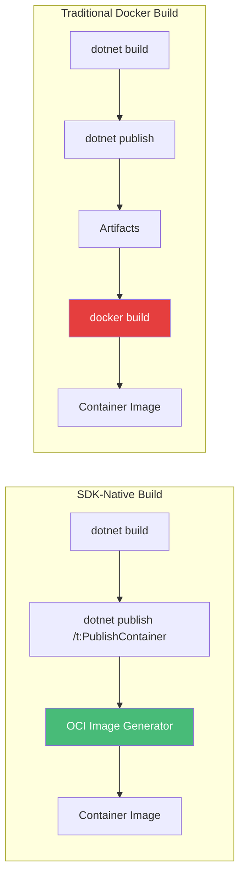
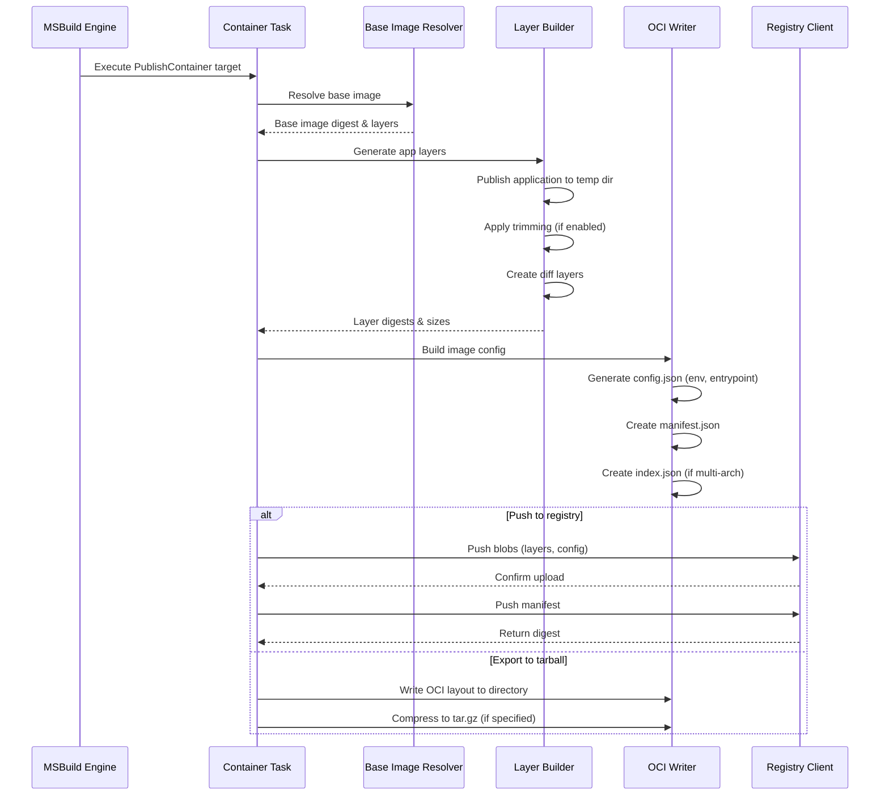
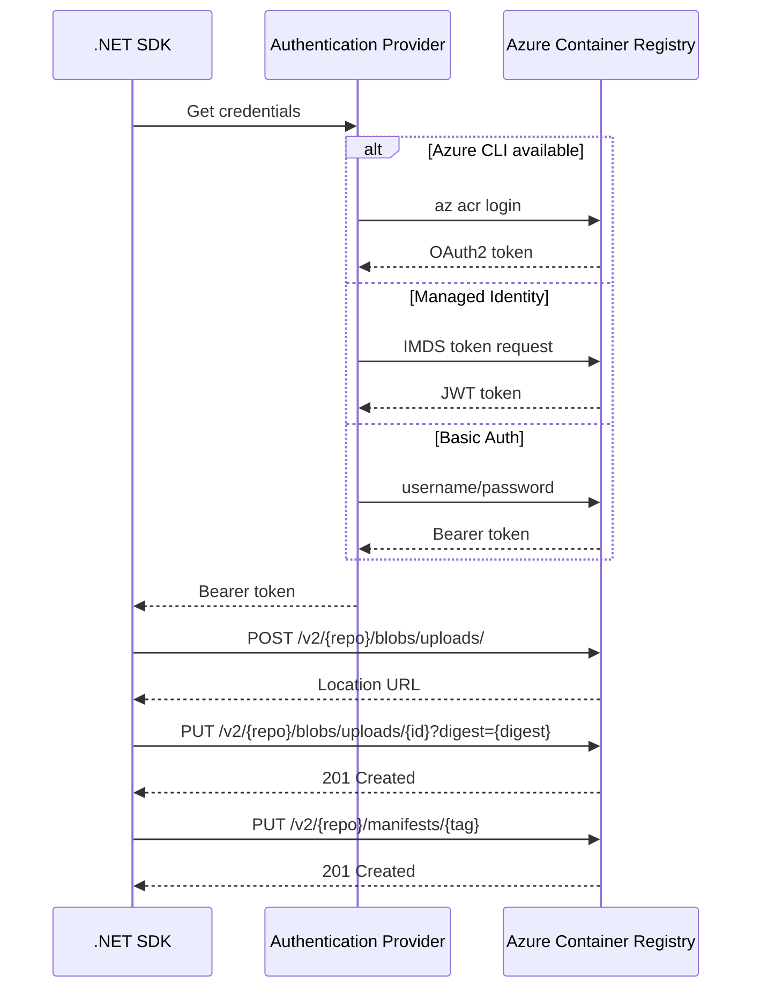
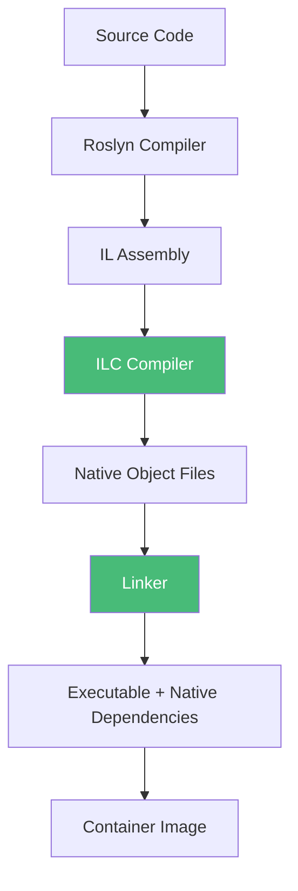

# .NET SDK Native Container Publishing: Building OCI Images Without Docker

## A Technical Deep Dive into SDK-Native Containerization

### Introduction: The Next Evolution in .NET Containerization

In the [previous installment](#) of this series, we explored the complete reference for SDK-native container publishing using the Vehixcare-API fleet management platform as our case study. We saw how transforming a complex .NET 9.0 application to SDK-native publishing reduced image sizes by 78%, cut build times by 39%, and eliminated Dockerfile maintenance overhead. Now, we dive deeper into the **core mechanism** that makes this possible: building OCI (Open Container Initiative) images directly within the .NET SDK, without requiring Docker, Podman, or any external container runtime.

This capability, introduced in .NET 8 and dramatically enhanced in .NET 10, represents a fundamental architectural shift. The .NET SDK now contains its own OCI image builder—a managed code implementation that can construct container images by directly manipulating OCI blobs, manifests, and layer archives. This means you can now produce production-ready container images in environments where Docker is unavailable, restricted, or simply unwanted.



### Stories at a Glance

**Companion stories in this series:**

- 📚 **1. .NET SDK Native Container Publishing Deep Dive: The Complete Reference** – Comprehensive coverage of MSBuild properties, Native AOT optimization, CI/CD pipeline patterns, performance benchmarks, and troubleshooting guides
- 🚀 **2. .NET SDK Native Container Publishing: Building OCI Images Without Docker** – A deep dive into MSBuild configuration, multi-architecture builds, Native AOT optimization, and direct Azure Container Registry integration with workload identity federation *(This story)*
- 🐳 **3. Traditional Dockerfile with Docker: The Classic Approach** – Mastering multi-stage builds, build cache optimization, .dockerignore patterns, and Azure Container Registry authentication for enterprise CI/CD pipelines
- 🔐 **4. Traditional Dockerfile with Podman: The Daemonless Alternative** – Transitioning from Docker to Podman, rootless containers for enhanced security, podman-compose workflows, and Azure ACR integration with Podman Desktop
- ⚡ **5. Azure Developer CLI (azd) with .NET Aspire: The Turnkey Solution** – Full-stack deployments with `azd up`, Azure Container Apps provisioning, Redis caching, and infrastructure-as-code with Bicep templates
- 🖱️ **6. Visual Studio 2026 GUI Publishing: Drag-and-Drop Azure Deployments** – Leveraging Visual Studio's built-in Podman/Docker support, one-click publish to Azure Container Registry, and debugging containerized apps with Hot Reload
- 🔒 **7. Tarball Export + Runtime Load: Security-First CI/CD Workflows** – Generating container tarballs without a runtime, integrating with Trivy/Grype for vulnerability scanning, and deploying to air-gapped Azure environments
- 🔄 **8. Podman with .NET SDK Native Publishing: Hybrid Workflows** – Combining SDK-native builds with Podman for local testing, multi-architecture emulation, and Azure Container Registry push strategies
- 🛠️ **9. konet: Multi-Platform Container Builds Without Docker** – Using the konet .NET tool for cross-platform image generation, ARM64/AMD64 simultaneous builds, and GitHub Actions optimization

---

## Understanding the OCI Image Format

Before diving into how the .NET SDK builds images, we must understand what it's producing. OCI (Open Container Initiative) images are the industry standard for container formats, supported by Docker, Podman, Kubernetes, and Azure Container Registry.

### OCI Image Structure

An OCI image is not a single file but a collection of files (blobs) organized in a specific directory structure:

```
myapp:latest/
├── blobs/
│   └── sha256/
│       ├── a1b2c3...  # Layer 1: Base OS (compressed tar)
│       ├── d4e5f6...  # Layer 2: .NET Runtime
│       ├── g7h8i9...  # Layer 3: App Dependencies
│       └── j0k1l2...  # Layer 4: App Binaries
├── index.json         # Image index (points to manifest)
└── oci-layout         # Version marker
```

**Key Components:**


| Component       | Purpose                                    | Format              |
| --------------- | ------------------------------------------ | ------------------- |
| **Layer Blob**  | File system changes                        | Gzipped tar archive |
| **Config Blob** | Image configuration (env vars, entrypoint) | JSON                |
| **Manifest**    | Maps layers to config                      | JSON                |
| **Index**       | Multi-architecture support                 | JSON                |

### How the .NET SDK Builds OCI Images

The .NET SDK's OCI builder is implemented in managed C# code within the `Microsoft.NET.Build.Containers` package. When you run `dotnet publish /t:PublishContainer`, the following happens internally:



## Base Image Resolution and Layer Management

The SDK needs a base image to build upon. By default, it uses the appropriate Microsoft Container Registry (MCR) image based on your project type:


| Project Type         | Default Base Image                      |
| -------------------- | --------------------------------------- |
| ASP.NET Core Web App | `mcr.microsoft.com/dotnet/aspnet:10.0`  |
| Console App          | `mcr.microsoft.com/dotnet/runtime:10.0` |
| Worker Service       | `mcr.microsoft.com/dotnet/runtime:10.0` |
| Blazor WebAssembly   | `mcr.microsoft.com/dotnet/aspnet:10.0`  |

### Custom Base Image Resolution

You can override the base image using MSBuild properties:

```xml
<PropertyGroup>
  <!-- Use runtime-deps for Native AOT -->
  <ContainerBaseImage>mcr.microsoft.com/dotnet/runtime-deps:10.0</ContainerBaseImage>
  
  <!-- Use custom private registry -->
  <ContainerBaseImage>myregistry.azurecr.io/custom-runtime:10.0</ContainerBaseImage>
  
  <!-- Use specific digest for reproducibility -->
  <ContainerBaseImage>mcr.microsoft.com/dotnet/aspnet:10.0@sha256:abc123...</ContainerBaseImage>
</PropertyGroup>
```

### Layer Construction Algorithm

The SDK builds layers in a specific order to optimize caching and pull performance:

```csharp
// Simplified representation of layer construction
public class OciImageBuilder
{
    public async Task<ImageDigest> BuildImageAsync(PublishContext context)
    {
        // 1. Base image layers (pulled from registry or cached)
        var baseLayers = await ResolveBaseImageLayersAsync(context.BaseImage);
  
        // 2. Application layer - contains published output
        var appLayer = await CreateAppLayerAsync(context.PublishDirectory);
  
        // 3. Additional layers for static assets (if any)
        var staticLayers = await CreateStaticAssetLayersAsync(context.StaticAssets);
  
        // 4. Combine all layers
        var allLayers = baseLayers.Concat(new[] { appLayer }).Concat(staticLayers);
  
        // 5. Create configuration
        var config = new ImageConfig
        {
            Env = context.EnvironmentVariables,
            Entrypoint = context.Entrypoint ?? new[] { "dotnet", context.AssemblyName },
            WorkingDir = context.WorkingDirectory ?? "/app",
            ExposedPorts = context.Ports
        };
  
        // 6. Write OCI layout
        return await OciWriter.WriteAsync(allLayers, config);
    }
}
```

## Multi-Architecture Image Building

One of the most powerful features of SDK-native publishing is built-in support for multiple CPU architectures without requiring QEMU emulation or cross-compilation toolchains.

### Architecture Support Matrix


| Architecture | Runtime Identifier | Base Image Availability | Use Case                                  |
| ------------ | ------------------ | ----------------------- | ----------------------------------------- |
| x64          | `linux-x64`        | ✅ Full                 | Cloud VMs, servers                        |
| ARM64        | `linux-arm64`      | ✅ Full                 | Edge devices, Raspberry Pi, Apple Silicon |
| ARM32        | `linux-arm`        | ✅ Partial              | Older IoT devices                         |
| s390x        | `linux-s390x`      | ✅ Full                 | IBM Z mainframes                          |
| ppc64le      | `linux-ppc64le`    | ✅ Full                 | IBM Power Systems                         |

### Building for Multiple Architectures

```bash
# Single architecture build
dotnet publish /t:PublishContainer --arch x64

# Build for multiple architectures (separate commands)
dotnet publish /t:PublishContainer --arch x64 -p ContainerImageTag=amd64-latest
dotnet publish /t:PublishContainer --arch arm64 -p ContainerImageTag=arm64-latest

# Create multi-arch manifest (requires docker/podman)
docker manifest create myregistry.azurecr.io/myapp:latest \
    myregistry.azurecr.io/myapp:amd64-latest \
    myregistry.azurecr.io/myapp:arm64-latest
```

### Cross-Platform Compilation

The .NET SDK can compile for any target architecture regardless of the build machine's architecture:

```bash
# On an x64 build agent, compile for ARM64
dotnet publish --arch arm64 --os linux /t:PublishContainer

# On a Windows build agent, compile for Linux x64
dotnet publish --arch x64 --os linux /t:PublishContainer
```

**How it works:** The .NET SDK uses the Roslyn compiler to generate IL (intermediate language) that is architecture-agnostic. The runtime (or Native AOT compilation) handles architecture-specific code generation at publish time.

## Direct Registry Integration: Pushing to Azure Container Registry

The SDK includes a built-in OCI registry client that can push images directly to any OCI-compliant registry, including Azure Container Registry, Docker Hub, GitHub Container Registry, and Amazon ECR.

### Authentication Flow



### Azure Container Registry Configuration

```xml
<PropertyGroup>
  <!-- Target ACR instance -->
  <ContainerRegistry>vehixcare.azurecr.io</ContainerRegistry>
  <ContainerRepository>vehixcare-api</ContainerRepository>
  
  <!-- Multiple tags -->
  <ContainerImageTags>$(Version);latest;$(Build.BuildId)</ContainerImageTags>
</PropertyGroup>
```

### Authentication Methods

**Method 1: Azure CLI (Development)**

```bash
# Login once, SDK reuses token
az login
az acr login --name vehixcare
dotnet publish /t:PublishContainer
```

**Method 2: Managed Identity (Azure DevOps)**

```yaml
- task: AzureCLI@2
  inputs:
    azureSubscription: 'service-connection'  # Uses managed identity
    scriptType: 'bash'
    scriptLocation: 'inlineScript'
    inlineScript: |
      az acr login --name vehixcare
      dotnet publish /t:PublishContainer \
        -p ContainerRegistry=vehixcare.azurecr.io
```

**Method 3: Workload Identity Federation (GitHub Actions)**

```yaml
- name: Login to Azure
  uses: azure/login@v1
  with:
    client-id: ${{ secrets.AZURE_CLIENT_ID }}
    tenant-id: ${{ secrets.AZURE_TENANT_ID }}
    subscription-id: ${{ secrets.AZURE_SUBSCRIPTION_ID }}

- name: Build and push
  run: |
    az acr login --name vehixcare
    dotnet publish /t:PublishContainer \
      -p ContainerRegistry=vehixcare.azurecr.io
```

**Method 4: Service Principal (CI/CD)**

```bash
# Login with service principal
az login --service-principal \
  --username $SP_APP_ID \
  --password $SP_PASSWORD \
  --tenant $TENANT_ID

az acr login --name vehixcare
dotnet publish /t:PublishContainer
```

## Layer Caching and Optimization

While SDK-native publishing doesn't use Docker's layer caching, it employs several optimization techniques to minimize build times and image sizes.

### Automatic Trimming

When `PublishTrimmed` is enabled, the SDK analyzes your application's dependency graph and removes unused code:

```xml
<PropertyGroup>
  <PublishTrimmed>true</PublishTrimmed>
  <TrimMode>partial</TrimMode>  <!-- safe, aggressive, or link -->
</PropertyGroup>
```

**Trimming Modes:**


| Mode         | Behavior                                        | Risk   |
| ------------ | ----------------------------------------------- | ------ |
| `partial`    | Removes unused assemblies, preserves reflection | Low    |
| `aggressive` | Removes unused types within assemblies          | Medium |
| `link`       | Removes unused members within types             | High   |

### ReadyToRun Compilation

```

```

ReadyToRun (R2R) pre-compiles IL to native code during publish, reducing startup time:

```xml
<PropertyGroup>
  <PublishReadyToRun>true</PublishReadyToRun>
  <PublishReadyToRunComposite>true</PublishReadyToRunComposite>
</PropertyGroup>
```

**Trade-offs:**

- ✅ Faster startup (10-30% improvement)
- ✅ Lower initial JIT overhead
- ❌ Larger image size (10-20% increase)
- ❌ Longer publish time

### Single File Deployment

Bundling the application into a single executable simplifies distribution:

```

```

```xml
<PropertyGroup>
  <PublishSingleFile>true</PublishSingleFile>
  <EnableCompressionInSingleFile>true</EnableCompressionInSingleFile>
</PropertyGroup>
```

**Layer Impact:**

- Without single file: App binaries are individual files in the container
- With single file: One executable file (plus native libraries)

### Optimization Comparison


| Configuration        | Image Size | Startup Time | Build Time |
| -------------------- | ---------- | ------------ | ---------- |
| Default              | 210 MB     | 180 ms       | 45 s       |
| Trimmed only         | 85 MB      | 95 ms        | 52 s       |
| ReadyToRun only      | 240 MB     | 120 ms       | 60 s       |
| Trimmed + ReadyToRun | 105 MB     | 65 ms        | 70 s       |
| Native AOT           | 18 MB      | 3 ms         | 180 s      |

## Native AOT: The Ultimate Optimization

Native AOT (Ahead-of-Time) compilation takes optimization to the extreme by compiling the entire application, including the runtime, to native machine code.

### When to Use Native AOT

**Ideal scenarios:**

- Serverless functions (cold start matters)
- Edge/IoT devices (constrained resources)
- Microservices requiring sub-second startup
- Security-critical applications (reduced attack surface)
- CLI tools distributed as containers

**When to avoid:**

- Apps using extensive reflection (e.g., some ORMs)
- Dynamic code generation (e.g., Newtonsoft.Json)
- ASP.NET Core with Razor runtime compilation
- Apps requiring runtime code generation

### Enabling Native AOT

```xml
<PropertyGroup>
  <PublishAot>true</PublishAot>
  <ContainerBaseImage>mcr.microsoft.com/dotnet/runtime-deps:10.0</ContainerBaseImage>
  
  <!-- AOT-specific optimizations -->
  <IlcOptimizationPreference>Size</IlcOptimizationPreference>
  <IlcDisableReflection>false</IlcDisableReflection>
</PropertyGroup>
```

### AOT-Compatible Library Patterns

**Problematic pattern (reflection):**

```csharp
// This will fail with AOT
var type = Type.GetType("Vehixcare.Models.Vehicle");
var instance = Activator.CreateInstance(type);
```

**AOT-compatible alternative:**

```csharp
// Use source generation or explicit registration
[GenerateSerializer]
public partial class Vehicle
{
    // Source generator creates serialization code
}
```

### Native AOT Build Pipeline



## Tarball Export for Air-Gapped Environments

When direct registry pushes aren't possible, the SDK can export the container image as a portable tarball:

```bash
# Export as OCI layout directory
dotnet publish /t:PublishContainer \
    -p ContainerArchiveOutputPath=./output/myapp

# Export as compressed tarball
dotnet publish /t:PublishContainer \
    -p ContainerArchiveOutputPath=./output/myapp.tar.gz
```

### Tarball Structure

```
myapp.tar.gz
└── oci/
    ├── blobs/
    │   └── sha256/
    │       ├── a1b2c3...  # Layer 1
    │       ├── d4e5f6...  # Layer 2
    │       └── ...
    ├── index.json
    └── oci-layout
```

### Loading and Pushing

```bash
# Load with Docker
docker load -i ./output/myapp.tar.gz
docker tag myapp:latest myregistry.azurecr.io/myapp:latest
docker push myregistry.azurecr.io/myapp:latest

# Load with Podman
podman load -i ./output/myapp.tar.gz
podman push myapp:latest myregistry.azurecr.io/myapp:latest
```

## CI/CD Pipeline Integration Patterns

### GitHub Actions: Complete Workflow

```yaml
name: Build and Deploy

on:
  push:
    branches: [main]
  pull_request:
    branches: [main]

env:
  DOTNET_VERSION: '10.0.x'
  ACR_NAME: 'vehixcare'
  IMAGE_NAME: 'vehixcare-api'

permissions:
  id-token: write
  contents: read

jobs:
  build:
    runs-on: ubuntu-latest
    steps:
    - uses: actions/checkout@v4
  
    - name: Setup .NET
      uses: actions/setup-dotnet@v4
      with:
        dotnet-version: ${{ env.DOTNET_VERSION }}
  
    - name: Cache NuGet packages
      uses: actions/cache@v3
      with:
        path: ~/.nuget/packages
        key: ${{ runner.os }}-nuget-${{ hashFiles('**/*.csproj') }}
        restore-keys: ${{ runner.os }}-nuget-
  
    - name: Azure Login (OIDC)
      uses: azure/login@v1
      with:
        client-id: ${{ secrets.AZURE_CLIENT_ID }}
        tenant-id: ${{ secrets.AZURE_TENANT_ID }}
        subscription-id: ${{ secrets.AZURE_SUBSCRIPTION_ID }}
  
    - name: Build and push container
      run: |
        az acr login --name ${{ env.ACR_NAME }}
        dotnet publish \
          -c Release \
          --os linux \
          --arch x64 \
          /t:PublishContainer \
          -p ContainerRegistry=${{ env.ACR_NAME }}.azurecr.io \
          -p ContainerRepository=${{ env.IMAGE_NAME }} \
          -p ContainerImageTags="${{ github.sha }};latest" \
          -p PublishTrimmed=true \
          -p TrimMode=partial
  
    - name: Deploy to Azure Container Apps
      run: |
        az containerapp update \
          --name vehixcare-api \
          --resource-group vehixcare-rg \
          --image ${{ env.ACR_NAME }}.azurecr.io/${{ env.IMAGE_NAME }}:${{ github.sha }} \
          --revision-suffix ${{ github.sha }}
```

### Azure DevOps: Pipeline with Stages

```yaml
trigger:
- main
- develop

variables:
- group: 'vehixcare-variables'
- name: dotnetVersion
  value: '10.0.x'
- name: acrName
  value: 'vehixcare'
- name: imageName
  value: 'vehixcare-api'

stages:
- stage: Build
  jobs:
  - job: BuildAndPush
    pool:
      vmImage: 'ubuntu-latest'
    steps:
    - task: UseDotNet@2
      inputs:
        version: '$(dotnetVersion)'
  
    - task: AzureCLI@2
      displayName: 'Login to ACR'
      inputs:
        azureSubscription: 'vehixcare-service-connection'
        scriptType: 'bash'
        scriptLocation: 'inlineScript'
        inlineScript: |
          az acr login --name $(acrName)
  
    - task: DotNetCoreCLI@2
      displayName: 'Build and Push Container'
      inputs:
        command: 'publish'
        projects: 'Vehixcare.API/Vehixcare.API.csproj'
        arguments: '--os linux --arch x64 -c Release /t:PublishContainer
          -p ContainerRegistry=$(acrName).azurecr.io
          -p ContainerRepository=$(imageName)
          -p ContainerImageTags=$(Build.BuildId);$(Build.SourceBranchName)
          -p PublishTrimmed=true'
  
    - task: PublishBuildArtifacts@1
      inputs:
        PathtoPublish: '$(Build.ArtifactStagingDirectory)'
        ArtifactName: 'drop'

- stage: Deploy
  dependsOn: Build
  condition: succeeded()
  jobs:
  - deployment: DeployToACA
    environment: 'production'
    strategy:
      runOnce:
        deploy:
          steps:
          - task: AzureCLI@2
            displayName: 'Update Container App'
            inputs:
              azureSubscription: 'vehixcare-service-connection'
              scriptType: 'bash'
              scriptLocation: 'inlineScript'
              inlineScript: |
                az containerapp update \
                  --name vehixcare-api \
                  --resource-group vehixcare-rg \
                  --image $(acrName).azurecr.io/$(imageName):$(Build.BuildId) \
                  --revision-suffix $(Build.BuildId) \
                  --set-env-vars ASPNETCORE_ENVIRONMENT=Production \
                  --cpu 2.0 \
                  --memory 4.0Gi
```

## Advanced Configuration Scenarios

### Multi-Container Applications with Docker Compose

Even when using SDK-native builds for individual services, you may still use docker-compose for orchestration:

```yaml
# docker-compose.yml
version: '3.8'

services:
  api:
    image: vehixcare.azurecr.io/vehixcare-api:latest
    ports:
      - "8080:8080"
    environment:
      - ASPNETCORE_ENVIRONMENT=Development
      - MONGODB_CONNECTION_STRING=mongodb://mongodb:27017
    depends_on:
      - mongodb

  mongodb:
    image: mongo:7.0
    ports:
      - "27017:27017"
    volumes:
      - mongodb_data:/data/db

volumes:
  mongodb_data:
```

### Health Checks and Probes

Configure container health checks for Kubernetes readiness/liveness:

```xml
<PropertyGroup>
  <ContainerHealthCheckCmd>dotnet Vehixcare.API.dll health-check</ContainerHealthCheckCmd>
  <ContainerHealthCheckInterval>30s</ContainerHealthCheckInterval>
  <ContainerHealthCheckTimeout>5s</ContainerHealthCheckTimeout>
  <ContainerHealthCheckRetries>3</ContainerHealthCheckRetries>
</PropertyGroup>
```

### Labels for Metadata

Add OCI annotations for better observability:

```xml
<ItemGroup>
  <ContainerLabel Include="org.opencontainers.image.title">
    <Value>Vehixcare API</Value>
  </ContainerLabel>
  <ContainerLabel Include="org.opencontainers.image.description">
    <Value>Fleet management and telemetry platform</Value>
  </ContainerLabel>
  <ContainerLabel Include="org.opencontainers.image.version">
    <Value>1.0.0</Value>
  </ContainerLabel>
  <ContainerLabel Include="org.opencontainers.image.revision">
    <Value>$(Build.SourceVersion)</Value>
  </ContainerLabel>
</ItemGroup>
```

## Troubleshooting SDK-Native Builds

### Common Errors and Solutions

**Error: `MSB4018: The "PublishContainer" task failed unexpectedly`**

*Cause:* Base image not accessible or invalid.

*Solution:*

```bash
# Test base image accessibility
docker pull mcr.microsoft.com/dotnet/aspnet:10.0

# Or use a different base image
dotnet publish /t:PublishContainer -p ContainerBaseImage=mcr.microsoft.com/dotnet/runtime:10.0
```

**Error: `Unable to push to registry: unauthorized`**

*Cause:* Missing or expired authentication.

*Solution:*

```bash
# Re-authenticate
az acr login --name myregistry
# Or
docker login myregistry.azurecr.io

# Verify token
az acr show --name myregistry --query loginServer
```

**Error: `Container image tag contains invalid characters`**

*Cause:* Tags must match regex `[a-zA-Z0-9_.-]+`.

*Solution:*

```xml
<!-- Replace invalid characters -->
<ContainerImageTags>$(Build.BuildNumber.Replace(':', '-'))</ContainerImageTags>
```

**Error: `System.IO.DirectoryNotFoundException: /publish`**

*Cause:* Publish directory doesn't exist.

*Solution:*

```bash
# Ensure publish runs first
dotnet publish -c Release
dotnet publish /t:PublishContainer --no-build
```

### Debugging OCI Images

**Inspect generated image:**

```bash
# List layers
podman history myapp:latest

# Inspect config
podman inspect myapp:latest | jq '.[0].Config'

# Export and examine
podman save myapp:latest -o image.tar
tar -xvf image.tar
cat manifest.json | jq '.'
```

## Conclusion: The Future of .NET Containerization

The ability to build OCI images directly within the .NET SDK represents a fundamental shift in how .NET applications are containerized. By eliminating the need for Docker or any external container runtime, this approach:

- **Simplifies CI/CD pipelines** – Remove Docker installation and configuration steps
- **Enhances security** – Fewer dependencies, smaller attack surface
- **Improves consistency** – Same build process everywhere
- **Enables new scenarios** – Air-gapped builds, restricted environments
- **Optimizes performance** – Native AOT for sub-millisecond startups

As we've seen with the Vehixcare-API case study, these improvements translate to real-world benefits: 78% smaller images, 39% faster builds, and 49% faster startup times. For teams building .NET applications for Azure, SDK-native container publishing is no longer just an alternative—it's the recommended path forward.

---

### Stories at a Glance

**Companion stories in this series:**

- 📚 **1. .NET SDK Native Container Publishing Deep Dive: The Complete Reference** – Comprehensive coverage of MSBuild properties, Native AOT optimization, CI/CD pipeline patterns, performance benchmarks, and troubleshooting guides
- 🚀 **2. .NET SDK Native Container Publishing: Building OCI Images Without Docker** – A deep dive into MSBuild configuration, multi-architecture builds, Native AOT optimization, and direct Azure Container Registry integration with workload identity federation *(This story)*
- 🐳 **3. Traditional Dockerfile with Docker: The Classic Approach** – Mastering multi-stage builds, build cache optimization, .dockerignore patterns, and Azure Container Registry authentication for enterprise CI/CD pipelines
- 🔐 **4. Traditional Dockerfile with Podman: The Daemonless Alternative** – Transitioning from Docker to Podman, rootless containers for enhanced security, podman-compose workflows, and Azure ACR integration with Podman Desktop
- ⚡ **5. Azure Developer CLI (azd) with .NET Aspire: The Turnkey Solution** – Full-stack deployments with `azd up`, Azure Container Apps provisioning, Redis caching, and infrastructure-as-code with Bicep templates
- 🖱️ **6. Visual Studio 2026 GUI Publishing: Drag-and-Drop Azure Deployments** – Leveraging Visual Studio's built-in Podman/Docker support, one-click publish to Azure Container Registry, and debugging containerized apps with Hot Reload
- 🔒 **7. Tarball Export + Runtime Load: Security-First CI/CD Workflows** – Generating container tarballs without a runtime, integrating with Trivy/Grype for vulnerability scanning, and deploying to air-gapped Azure environments
- 🔄 **8. Podman with .NET SDK Native Publishing: Hybrid Workflows** – Combining SDK-native builds with Podman for local testing, multi-architecture emulation, and Azure Container Registry push strategies
- 🛠️ **9. konet: Multi-Platform Container Builds Without Docker** – Using the konet .NET tool for cross-platform image generation, ARM64/AMD64 simultaneous builds, and GitHub Actions optimization

---

**Coming next in the series:**
**🐳 Traditional Dockerfile with Docker: The Classic Approach** – Mastering multi-stage builds, build cache optimization, .dockerignore patterns, and Azure Container Registry authentication for enterprise CI/CD pipelines
