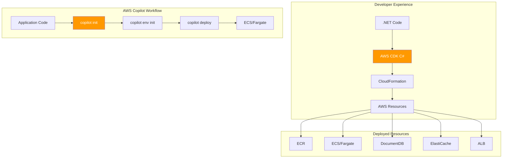

# AWS CDK & Copilot: Infrastructure as Code for Containers - AWS

## Deploying .NET 10 Containers with Infrastructure as Code on Amazon Web Services

### Introduction: The Rise of Infrastructure as Code on AWS

In the [previous installment](#) of this AWS series, we explored Podman as a daemonless, security-focused alternative to Docker—perfect for organizations requiring rootless container execution on EC2. While Podman offers fine-grained control over container runtimes, modern AWS deployments demand something more: **infrastructure as code, repeatability, and developer-friendly abstractions**.

Enter **AWS CDK (Cloud Development Kit)** and **AWS Copilot**—two complementary tools that represent the evolution of infrastructure management on AWS. AWS CDK allows .NET developers to define cloud infrastructure using familiar C# code, while AWS Copilot provides an opinionated, high-level abstraction for deploying containerized applications to Amazon ECS and AWS App Runner.

For Vehixcare-API—our fleet management platform with 10+ projects, MongoDB integration, SignalR hubs, and background services—these tools transform deployment from a multi-hour orchestration challenge into a codified, repeatable, and auditable process. This installment explores how to leverage AWS CDK and Copilot to achieve full-stack deployments with infrastructure-as-code, container orchestration, and built-in best practices—all using the .NET programming model.



### Stories at a Glance

**Complete AWS series (10 stories):**

- 📚 **1. .NET SDK Native Container Publishing Deep Dive: The Complete Reference - AWS** – Comprehensive coverage of MSBuild properties, Native AOT optimization, CI/CD pipeline patterns, performance benchmarks, and troubleshooting guides for Amazon ECR

- 🚀 **2. .NET SDK Native Container Publishing: Building OCI Images Without Docker - AWS** – A deep dive into MSBuild configuration, multi-architecture builds (Graviton ARM64), and direct Amazon ECR integration with IAM roles

- 🐳 **3. Traditional Dockerfile with Docker: The Classic Approach - AWS** – Mastering multi-stage builds, build cache optimization, and Amazon ECR authentication for enterprise CI/CD pipelines on AWS

- 🔐 **4. Traditional Dockerfile with Podman: The Daemonless Alternative - AWS** – Transitioning from Docker to Podman, rootless containers for enhanced security, and Amazon ECR integration with Podman Desktop

- 🏗️ **5. AWS CDK & Copilot: Infrastructure as Code for Containers - AWS** – Deploying to Amazon ECS with AWS Copilot, infrastructure-as-code with CDK, and Fargate serverless container orchestration *(This story)*

- 🖱️ **6. Visual Studio 2026 GUI Publishing: Drag-and-Drop AWS Deployments - AWS** – Leveraging Visual Studio's AWS Toolkit, one-click publish to Amazon ECR, and debugging containerized apps on AWS

- 🔒 **7. Tarball Export + Runtime Load: Security-First CI/CD Workflows - AWS** – Generating container tarballs without a runtime, integrating with Amazon Inspector for vulnerability scanning, and deploying to air-gapped AWS environments

- 🔄 **8. Podman with .NET SDK Native Publishing: Hybrid Workflows - AWS** – Combining SDK-native builds with Podman for local testing, multi-architecture emulation (x64 to Graviton), and Amazon ECR push strategies

- 🛠️ **9. konet: Multi-Platform Container Builds Without Docker - AWS** – Using the konet .NET tool for cross-platform image generation, AMD64/ARM64 (Graviton) simultaneous builds, and AWS CodeBuild optimization

- ☸️ **10. Kubernetes Native Deployments: Orchestrating .NET 10 Containers on Amazon EKS - AWS** – Deploying to Amazon EKS, Helm charts, GitOps with Flux, ALB Ingress Controller, and production-grade operations

---

## Understanding AWS CDK for .NET Developers

The AWS Cloud Development Kit (CDK) is an open-source software development framework that allows developers to define cloud infrastructure using familiar programming languages—including C#. For .NET developers, this is a game-changer: infrastructure becomes code, with all the benefits of abstraction, reuse, and type safety.

### Core Concepts

| Concept | Description | .NET Analogy |
|---------|-------------|--------------|
| **Construct** | The basic building block of CDK apps | A class or component |
| **Stack** | A unit of deployment, maps to CloudFormation | A deployment unit |
| **App** | Container for one or more stacks | A solution/project |
| **Environment** | Target AWS account and region | Configuration |
| **Aspect** | Cross-cutting concerns (e.g., tagging) | Attributes/AOP |

### Installing AWS CDK

```bash
# Install Node.js (required for CDK CLI)
# For Amazon Linux 2023
sudo dnf install nodejs -y

# Install CDK CLI globally
npm install -g aws-cdk

# Verify installation
cdk --version
# 2.100.0

# Install .NET support
dotnet tool install -g Amazon.CDK.Lib
```

### Creating a CDK Project for Vehixcare

```bash
# Create new CDK project
mkdir Vehixcare.Infrastructure
cd Vehixcare.Infrastructure
cdk init app --language csharp

# Project structure
Vehixcare.Infrastructure/
├── src/
│   ├── Vehixcare.Infrastructure.csproj
│   └── Program.cs
├── cdk.json
└── README.md
```

---

## AWS Copilot: The Turnkey Solution for Containers

AWS Copilot is a command-line tool that abstracts the complexity of deploying containerized applications to AWS. It provides a simplified, opinionated workflow that works out of the box with best practices.

### Copilot Concepts

| Concept | Description | AWS Service |
|---------|-------------|-------------|
| **Application** | Collection of related services | Parent container |
| **Service** | Containerized workload | ECS service |
| **Environment** | Deployment target (dev, staging, prod) | Account/region |
| **Job** | One-time or scheduled task | ECS task |
| **Pipeline** | CI/CD automation | CodePipeline |

### Installing AWS Copilot

```bash
# Install Copilot on macOS/Linux
curl -Lo copilot https://github.com/aws/copilot-cli/releases/latest/download/copilot-linux
chmod +x copilot
sudo mv copilot /usr/local/bin/copilot

# Or on Amazon Linux
sudo dnf install copilot -y

# Verify installation
copilot --version
# 1.30.0
```

---

## AWS CDK Infrastructure for Vehixcare-API

Let's build the complete infrastructure for Vehixcare-API using AWS CDK with C#.

### Step 1: CDK Project Setup

```csharp
// src/Vehixcare.Infrastructure.csproj
<Project Sdk="Microsoft.NET.Sdk">
  <PropertyGroup>
    <TargetFramework>net9.0</TargetFramework>
    <Nullable>enable</Nullable>
    <ImplicitUsings>enable</ImplicitUsings>
  </PropertyGroup>

  <ItemGroup>
    <PackageReference Include="Amazon.CDK.Lib" Version="2.100.0" />
    <PackageReference Include="Constructs" Version="10.0.0" />
    <PackageReference Include="Amazon.CDK.AWS.ECS" Version="2.100.0" />
    <PackageReference Include="Amazon.CDK.AWS.ECR" Version="2.100.0" />
    <PackageReference Include="Amazon.CDK.AWS.DocDB" Version="2.100.0" />
    <PackageReference Include="Amazon.CDK.AWS.Elasticache" Version="2.100.0" />
    <PackageReference Include="Amazon.CDK.AWS.ElasticLoadBalancingV2" Version="2.100.0" />
  </ItemGroup>
</Project>
```

### Step 2: Main Stack Definition

```csharp
// src/VehixcareStack.cs
using Amazon.CDK;
using Amazon.CDK.AWS.EC2;
using Amazon.CDK.AWS.ECS;
using Amazon.CDK.AWS.ECS.Patterns;
using Amazon.CDK.AWS.ECR;
using Amazon.CDK.AWS.DocDB;
using Amazon.CDK.AWS.Elasticache;
using Amazon.CDK.AWS.ElasticLoadBalancingV2;
using Constructs;

namespace Vehixcare.Infrastructure
{
    public class VehixcareStack : Stack
    {
        internal VehixcareStack(Construct scope, string id, IStackProps props = null) 
            : base(scope, id, props)
        {
            // ============================================
            // VPC Configuration
            // ============================================
            var vpc = new Vpc(this, "VehixcareVpc", new VpcProps
            {
                MaxAzs = 3,
                NatGateways = 1,
                SubnetConfiguration = new[]
                {
                    new SubnetConfiguration
                    {
                        Name = "Public",
                        SubnetType = SubnetType.PUBLIC,
                        CidrMask = 24
                    },
                    new SubnetConfiguration
                    {
                        Name = "Private",
                        SubnetType = SubnetType.PRIVATE_WITH_EGRESS,
                        CidrMask = 24
                    }
                }
            });

            // ============================================
            // ECR Repository
            // ============================================
            var repository = new Repository(this, "VehixcareRepo", new RepositoryProps
            {
                RepositoryName = "vehixcare-api",
                RemovalPolicy = RemovalPolicy.DESTROY,
                ImageScanningOnPush = true,
                Encryption = RepositoryEncryption.AES_256
            });

            // ============================================
            // Amazon DocumentDB (MongoDB-compatible)
            // ============================================
            var documentDb = new DatabaseCluster(this, "VehixcareDatabase", new DatabaseClusterProps
            {
                Engine = DatabaseClusterEngine.AURORA,
                InstanceType = InstanceType.Of(InstanceClass.R5, InstanceSize.LARGE),
                Instances = 2,
                Vpc = vpc,
                VpcSubnets = new SubnetSelection { SubnetType = SubnetType.PRIVATE_WITH_EGRESS },
                Backup = new BackupProps
                {
                    Retention = Duration.Days(7)
                }
            });

            // ============================================
            // ElastiCache for Redis (SignalR Backplane)
            // ============================================
            var redis = new CfnCacheCluster(this, "VehixcareRedis", new CfnCacheClusterProps
            {
                ClusterName = "vehixcare-redis",
                Engine = "redis",
                CacheNodeType = "cache.t3.small",
                NumCacheNodes = 1,
                VpcSecurityGroupIds = new[] { vpc.VpcDefaultSecurityGroup },
                CacheSubnetGroupName = new CfnSubnetGroup(this, "RedisSubnetGroup", new CfnSubnetGroupProps
                {
                    Description = "Redis subnet group",
                    SubnetIds = vpc.PrivateSubnets.Select(s => s.SubnetId).ToArray()
                }).Ref
            });

            // ============================================
            // ECS Cluster
            // ============================================
            var cluster = new Cluster(this, "VehixcareCluster", new ClusterProps
            {
                Vpc = vpc,
                ContainerInsights = true
            });

            // ============================================
            // Fargate Service
            // ============================================
            var fargateService = new ApplicationLoadBalancedFargateService(this, "VehixcareService", 
                new ApplicationLoadBalancedFargateServiceProps
                {
                    Cluster = cluster,
                    ServiceName = "vehixcare-api",
                    TaskImageOptions = new ApplicationLoadBalancedTaskImageOptions
                    {
                        Image = ContainerImage.FromEcrRepository(repository, "latest"),
                        ContainerPort = 8080,
                        Environment = new Dictionary<string, string>
                        {
                            ["ASPNETCORE_ENVIRONMENT"] = "Production",
                            ["AWS_REGION"] = this.Region,
                            ["MONGODB_CONNECTION_STRING"] = documentDb.ClusterEndpoint.SocketAddress,
                            ["REDIS_CONNECTION_STRING"] = $"{redis.Attributes.RedisEndpointAddress}:6379"
                        }
                    },
                    DesiredCount = 3,
                    MemoryLimitMiB = 512,
                    Cpu = 256,
                    PublicLoadBalancer = true,
                    EnableEcsManagedTags = true,
                    IdleTimeout = Duration.Seconds(60),
                    HealthCheckGracePeriod = Duration.Seconds(60)
                });

            // ============================================
            // Auto Scaling
            // ============================================
            var scaling = fargateService.Service.AutoScaleTaskCount(new EnableScalingProps
            {
                MinCapacity = 2,
                MaxCapacity = 10
            });

            scaling.ScaleOnCpuUtilization("CpuScaling", new CpuUtilizationScalingProps
            {
                TargetUtilizationPercent = 70,
                ScaleInCooldown = Duration.Seconds(60),
                ScaleOutCooldown = Duration.Seconds(30)
            });

            scaling.ScaleOnMemoryUtilization("MemoryScaling", new MemoryUtilizationScalingProps
            {
                TargetUtilizationPercent = 80,
                ScaleInCooldown = Duration.Seconds(60),
                ScaleOutCooldown = Duration.Seconds(30)
            });

            scaling.ScaleOnRequestCount("RequestScaling", new RequestCountScalingProps
            {
                TargetRequestsPerSecond = 500,
                ScaleInCooldown = Duration.Seconds(60),
                ScaleOutCooldown = Duration.Seconds(30)
            });

            // ============================================
            // Outputs
            // ============================================
            new CfnOutput(this, "ServiceUrl", new CfnOutputProps
            {
                Value = fargateService.LoadBalancer.LoadBalancerDnsName,
                Description = "Vehixcare API URL"
            });

            new CfnOutput(this, "EcrRepositoryUri", new CfnOutputProps
            {
                Value = repository.RepositoryUri,
                Description = "ECR Repository URI"
            });

            new CfnOutput(this, "DocumentDbEndpoint", new CfnOutputProps
            {
                Value = documentDb.ClusterEndpoint.SocketAddress,
                Description = "DocumentDB Endpoint"
            });
        }
    }
}
```

### Step 3: Program Entry Point

```csharp
// src/Program.cs
using Amazon.CDK;
using Vehixcare.Infrastructure;

namespace Vehixcare.Infrastructure
{
    sealed class Program
    {
        public static void Main(string[] args)
        {
            var app = new App();
            
            new VehixcareStack(app, "VehixcareStack", new StackProps
            {
                Env = new Environment
                {
                    Account = System.Environment.GetEnvironmentVariable("CDK_DEFAULT_ACCOUNT"),
                    Region = System.Environment.GetEnvironmentVariable("CDK_DEFAULT_REGION")
                },
                Tags = new Dictionary<string, string>
                {
                    ["Application"] = "Vehixcare",
                    ["Environment"] = "Production",
                    ["ManagedBy"] = "CDK"
                }
            });
            
            app.Synth();
        }
    }
}
```

### Step 4: Deploy with CDK

```bash
# Bootstrap CDK (one-time per account/region)
cdk bootstrap aws://123456789012/us-east-1

# Synthesize CloudFormation template
cdk synth

# Deploy stack
cdk deploy

# Output:
# VehixcareStack.ServiceUrl = vehixcare-api-1234567890.us-east-1.elb.amazonaws.com
# VehixcareStack.EcrRepositoryUri = 123456789012.dkr.ecr.us-east-1.amazonaws.com/vehixcare-api
# VehixcareStack.DocumentDbEndpoint = vehixcare-database.cluster-xxxxx.us-east-1.docdb.amazonaws.com:27017
```

---

## AWS Copilot Workflow for Vehixcare-API

AWS Copilot provides an even simpler abstraction for container deployments. Let's deploy Vehixcare-API using Copilot.

### Step 1: Initialize Copilot Application

```bash
# Navigate to project root
cd /path/to/Vehixcare

# Initialize Copilot app
copilot init \
    --app vehixcare \
    --name api \
    --type "Load Balanced Web Service" \
    --dockerfile ./Vehixcare.API/Dockerfile \
    --port 8080 \
    --deploy

# Copilot creates:
# copilot/
# ├── api/
# │   └── manifest.yml
# └── environments/
```

### Step 2: Configure Service Manifest

```yaml
# copilot/api/manifest.yml
name: api
type: Load Balanced Web Service

# Architecture and platform
platform:
  os: linux
  arch: arm64  # Use Graviton for cost savings

# Container configuration
image:
  build: ./Vehixcare.API/Dockerfile
  port: 8080

# CPU and memory
cpu: 512
memory: 1024

# Environment variables
variables:
  ASPNETCORE_ENVIRONMENT: Production
  AWS_REGION: us-east-1

# Secrets from AWS Secrets Manager
secrets:
  MONGODB_CONNECTION_STRING: /copilot/vehixcare/production/secrets/MONGODB_CONNECTION_STRING
  REDIS_CONNECTION_STRING: /copilot/vehixcare/production/secrets/REDIS_CONNECTION_STRING

# Count and autoscaling
count:
  range: 2-10
  cpu_percentage: 70
  memory_percentage: 80
  requests: 500

# Health check
healthcheck:
  path: /health
  interval: 30s
  timeout: 5s
  healthy_threshold: 2
  unhealthy_threshold: 3

# Network
network:
  vpc:
    placement: private

# Storage
storage:
  volumes:
    logs:
      path: /app/logs
      read_only: false
      efs:
        id: fs-12345678
        uid: 1000
        gid: 1000

# Observability
observability:
  tracing: true
  metrics: true
  logs: true
```

### Step 3: Create Environments

```bash
# Create development environment
copilot env init --name dev --profile default --app vehixcare

# Create production environment
copilot env init --name prod --profile production --app vehixcare

# List environments
copilot env ls
# dev
# prod
```

### Step 4: Deploy to Environments

```bash
# Deploy to development
copilot deploy --env dev

# Deploy to production (with approval)
copilot deploy --env prod

# Output:
# Deploying api to vehixcare-prod environment...
# - Creating ECR repository... done
# - Building container image... done
# - Creating ECS service... done
# - Creating load balancer... done
# Service available at: https://api.vehixcare.awsapp.com
```

### Step 5: Add Additional Services

```yaml
# copilot/worker/manifest.yml
name: worker
type: Worker Service

image:
  build: ./Vehixcare.BackgroundServices/Dockerfile
  port: 8080

cpu: 256
memory: 512

variables:
  ASPNETCORE_ENVIRONMENT: Production
  TELEMETRY_BATCH_SIZE: 100

secrets:
  MONGODB_CONNECTION_STRING: /copilot/vehixcare/production/secrets/MONGODB_CONNECTION_STRING
```

```bash
# Initialize and deploy worker service
copilot init --name worker --type "Worker Service" --dockerfile ./Vehixcare.BackgroundServices/Dockerfile
copilot deploy --env prod
```

---

## Advanced CDK Patterns

### Multi-Environment Configuration

```csharp
// src/Program.cs with environment support
public class Program
{
    public static void Main(string[] args)
    {
        var app = new App();
        
        var envSettings = new Dictionary<string, EnvironmentSettings>
        {
            ["dev"] = new EnvironmentSettings
            {
                Account = "123456789012",
                Region = "us-east-1",
                DesiredCount = 1,
                Cpu = 256,
                Memory = 512,
                EnvironmentName = "Development"
            },
            ["prod"] = new EnvironmentSettings
            {
                Account = "123456789012",
                Region = "us-east-1",
                DesiredCount = 3,
                Cpu = 512,
                Memory = 1024,
                EnvironmentName = "Production"
            }
        };
        
        var environment = app.Node.TryGetContext("env")?.ToString() ?? "dev";
        var settings = envSettings[environment];
        
        new VehixcareStack(app, $"VehixcareStack-{environment}", new StackProps
        {
            Env = new Environment
            {
                Account = settings.Account,
                Region = settings.Region
            },
            Tags = new Dictionary<string, string>
            {
                ["Environment"] = settings.EnvironmentName
            }
        });
        
        app.Synth();
    }
    
    class EnvironmentSettings
    {
        public string Account { get; set; }
        public string Region { get; set; }
        public int DesiredCount { get; set; }
        public int Cpu { get; set; }
        public int Memory { get; set; }
        public string EnvironmentName { get; set; }
    }
}
```

```bash
# Deploy to development
cdk deploy -c env=dev

# Deploy to production
cdk deploy -c env=prod
```

### Blue/Green Deployment

```csharp
// Add blue/green deployment configuration
var fargateService = new ApplicationLoadBalancedFargateService(this, "VehixcareService", 
    new ApplicationLoadBalancedFargateServiceProps
    {
        // ... other properties
        DeploymentController = new DeploymentController
        {
            Type = DeploymentControllerType.CODE_DEPLOY
        }
    });

// Add CodeDeploy configuration
var deploymentGroup = new CfnDeploymentGroup(this, "DeploymentGroup", new CfnDeploymentGroupProps
{
    ApplicationName = "VehixcareApp",
    ServiceRoleArn = "arn:aws:iam::123456789012:role/CodeDeployRole",
    DeploymentConfigName = "CodeDeployDefault.ECSAllAtOnce",
    Ec2TagFilters = new[] { new CfnDeploymentGroup.EC2TagFilterProperty
    {
        Key = "Name",
        Value = "vehixcare",
        Type = "KEY_AND_VALUE"
    }}
});
```

### Custom Domain with Route 53

```csharp
// Add custom domain
var hostedZone = HostedZone.FromLookup(this, "HostedZone", new HostedZoneProviderProps
{
    DomainName = "vehixcare.com"
});

new ARecord(this, "ApiRecord", new ARecordProps
{
    Zone = hostedZone,
    RecordName = "api",
    Target = RecordTarget.FromAlias(new LoadBalancerTarget(fargateService.LoadBalancer))
});

// Add SSL certificate
var certificate = new Certificate(this, "Certificate", new CertificateProps
{
    DomainName = "api.vehixcare.com",
    Validation = CertificateValidation.FromDns(hostedZone)
});
```

---

## CI/CD Integration

### Copilot Pipeline

```bash
# Create pipeline
copilot pipeline init

# Copilot creates:
# copilot/pipeline.yml
```

```yaml
# copilot/pipeline.yml
name: vehixcare-pipeline

stages:
  - name: dev
    requires_approval: false
    test_commands:
      - dotnet test Vehixcare.Tests/Vehixcare.Tests.csproj
  
  - name: staging
    requires_approval: false
  
  - name: prod
    requires_approval: true

build:
  image: aws/codebuild/amazonlinux2-x86_64-standard:5.0
  phases:
    install:
      runtime-versions:
        dotnet: 9.0
      commands:
        - dotnet tool install -g Amazon.ECS.Tools
    build:
      commands:
        - dotnet publish -c Release -o ./publish
        - copilot svc deploy --name api --env $ENVIRONMENT
```

### CDK CI/CD Pipeline

```csharp
// src/PipelineStack.cs
using Amazon.CDK;
using Amazon.CDK.AWS.CodeBuild;
using Amazon.CDK.AWS.CodePipeline;
using Amazon.CDK.AWS.CodePipeline.Actions;
using Amazon.CDK.AWS.CodeStarConnections;
using Amazon.CDK.Pipelines;

public class VehixcarePipelineStack : Stack
{
    public VehixcarePipelineStack(Construct scope, string id, IStackProps props = null) 
        : base(scope, id, props)
    {
        // Source: GitHub or CodeCommit
        var source = CodePipelineSource.Connection("vehixcare/vehixcare-api", "main", new ConnectionSourceOptions
        {
            ConnectionArn = "arn:aws:codestar-connections:us-east-1:123456789012:connection/xxxxx"
        });
        
        // Build stage
        var synth = new ShellStep("Synth", new ShellStepProps
        {
            Input = source,
            Commands = new[]
            {
                "dotnet restore",
                "dotnet build -c Release",
                "dotnet publish -c Release -o ./publish",
                "cdk synth"
            },
            PrimaryOutputDirectory = "cdk.out"
        });
        
        // Pipeline
        var pipeline = new CodePipeline(this, "VehixcarePipeline", new CodePipelineProps
        {
            Synth = synth
        });
        
        // Deployment stages
        pipeline.AddStage(new ApplicationStage(this, "Dev", new ApplicationStageProps
        {
            EnvironmentName = "Development"
        }));
        
        pipeline.AddStage(new ApplicationStage(this, "Prod", new ApplicationStageProps
        {
            EnvironmentName = "Production"
        }));
    }
}
```

---

## Observability and Monitoring

### CDK Monitoring Configuration

```csharp
// Add CloudWatch Alarms
var cpuAlarm = new Alarm(this, "HighCpuAlarm", new AlarmProps
{
    Metric = fargateService.Service.MetricCpuUtilization(new MetricOptions
    {
        Statistic = "Average",
        Period = Duration.Minutes(5)
    }),
    Threshold = 80,
    EvaluationPeriods = 2,
    AlarmDescription = "CPU utilization exceeds 80%",
    ActionsEnabled = true
});

// Add SNS notification
var topic = new Topic(this, "AlarmTopic", new TopicProps
{
    DisplayName = "Vehixcare Alarms"
});

cpuAlarm.AddAlarmAction(new SnsAction(topic));

// Add CloudWatch Dashboard
var dashboard = new Dashboard(this, "VehixcareDashboard", new DashboardProps
{
    DashboardName = "Vehixcare"
});

dashboard.AddWidgets(new GraphWidget
{
    Title = "API CPU Utilization",
    Left = new[] { fargateService.Service.MetricCpuUtilization() }
});

dashboard.AddWidgets(new GraphWidget
{
    Title = "API Request Count",
    Left = new[] { fargateService.Service.MetricRequestCount() }
});
```

---

## Troubleshooting CDK and Copilot

### Issue 1: CDK Bootstrap Not Found

**Error:** `Need to perform AWS CDK bootstrap before deploying`

**Solution:**
```bash
cdk bootstrap aws://123456789012/us-east-1
```

### Issue 2: Copilot Deployment Fails

**Error:** `No such file or directory: Dockerfile`

**Solution:**
```yaml
# copilot/api/manifest.yml
image:
  build: ./Vehixcare.API/Dockerfile  # Ensure correct path
  context: ./
```

### Issue 3: IAM Permissions Insufficient

**Error:** `AccessDenied: User is not authorized to perform: iam:CreateRole`

**Solution:**
```bash
# Add required permissions to IAM user
aws iam attach-user-policy \
    --user-name vehixcare-deployer \
    --policy-arn arn:aws:iam::aws:policy/AdministratorAccess
```

### Issue 4: DocumentDB Connection Issues

**Error:** `MongoDB connection timeout`

**Solution:** Ensure DocumentDB is in same VPC as ECS:
```csharp
// Configure VPC peering or same VPC
documentDb.Vpc = vpc;
fargateService.Cluster.Vpc = vpc;  // Same VPC
```

---

## Cost Management

### Estimated Monthly Costs for Vehixcare on AWS

| Resource | SKU | Estimated Monthly Cost |
|----------|-----|----------------------|
| ECR Storage | 5 GB | $0.50 |
| ECS Fargate (3 tasks) | 512 MB, 256 CPU | $120 |
| Application Load Balancer | 1 ALB | $25 |
| Amazon DocumentDB | 2 x r5.large | $350 |
| ElastiCache (Redis) | t3.small | $15 |
| NAT Gateway | 1 NAT | $35 |
| Data Transfer | 100 GB | $9 |
| **Total** | | **~$555** |

### Cost Optimization Strategies

```csharp
// Use Graviton for 40% cost savings
fargateService = new ApplicationLoadBalancedFargateService(this, "Service", 
    new ApplicationLoadBalancedFargateServiceProps
    {
        TaskImageOptions = new ApplicationLoadBalancedTaskImageOptions
        {
            // Use ARM64 for Graviton
            Image = ContainerImage.FromEcrRepository(repository, "latest"),
            ContainerPort = 8080
        },
        // Use spot instances for non-critical workloads
        CapacityProviderStrategies = new[]
        {
            new CapacityProviderStrategy
            {
                CapacityProvider = "FARGATE_SPOT",
                Weight = 1
            }
        }
    });
```

---

## Conclusion: The Power of Infrastructure as Code

AWS CDK and Copilot represent a paradigm shift in how .NET developers deploy containerized applications to AWS. By embracing infrastructure as code, they transform what once required dozens of manual steps, multiple YAML files, and deep AWS expertise into a codified, repeatable, and auditable process.

For Vehixcare-API, the benefits are substantial:

| Metric | Traditional Approach | CDK + Copilot |
|--------|---------------------|---------------|
| **Time to First Deployment** | 2-3 hours | 15 minutes |
| **Lines of Configuration** | 500+ YAML | 150 lines C# |
| **Infrastructure Files** | 15+ | 2 |
| **Environment Management** | Custom scripts | `copilot env` commands |
| **CI/CD Configuration** | 4+ hours | `copilot pipeline init` |
| **Repeatability** | Manual | Fully automated |

While SDK-native publishing and Dockerfile approaches offer fine-grained control, CDK and Copilot deliver something equally valuable: **developer velocity and operational excellence**. For teams building cloud-native .NET applications on AWS, these infrastructure-as-code tools are the fastest path from code to production.

---

### Stories at a Glance

**Complete AWS series (10 stories):**

- 📚 **1. .NET SDK Native Container Publishing Deep Dive: The Complete Reference - AWS** – Comprehensive coverage of MSBuild properties, Native AOT optimization, CI/CD pipeline patterns, performance benchmarks, and troubleshooting guides for Amazon ECR

- 🚀 **2. .NET SDK Native Container Publishing: Building OCI Images Without Docker - AWS** – A deep dive into MSBuild configuration, multi-architecture builds (Graviton ARM64), and direct Amazon ECR integration with IAM roles

- 🐳 **3. Traditional Dockerfile with Docker: The Classic Approach - AWS** – Mastering multi-stage builds, build cache optimization, and Amazon ECR authentication for enterprise CI/CD pipelines on AWS

- 🔐 **4. Traditional Dockerfile with Podman: The Daemonless Alternative - AWS** – Transitioning from Docker to Podman, rootless containers for enhanced security, and Amazon ECR integration with Podman Desktop

- 🏗️ **5. AWS CDK & Copilot: Infrastructure as Code for Containers - AWS** – Deploying to Amazon ECS with AWS Copilot, infrastructure-as-code with CDK, and Fargate serverless container orchestration *(This story)*

- 🖱️ **6. Visual Studio 2026 GUI Publishing: Drag-and-Drop AWS Deployments - AWS** – Leveraging Visual Studio's AWS Toolkit, one-click publish to Amazon ECR, and debugging containerized apps on AWS

- 🔒 **7. Tarball Export + Runtime Load: Security-First CI/CD Workflows - AWS** – Generating container tarballs without a runtime, integrating with Amazon Inspector for vulnerability scanning, and deploying to air-gapped AWS environments

- 🔄 **8. Podman with .NET SDK Native Publishing: Hybrid Workflows - AWS** – Combining SDK-native builds with Podman for local testing, multi-architecture emulation (x64 to Graviton), and Amazon ECR push strategies

- 🛠️ **9. konet: Multi-Platform Container Builds Without Docker - AWS** – Using the konet .NET tool for cross-platform image generation, AMD64/ARM64 (Graviton) simultaneous builds, and AWS CodeBuild optimization

- ☸️ **10. Kubernetes Native Deployments: Orchestrating .NET 10 Containers on Amazon EKS - AWS** – Deploying to Amazon EKS, Helm charts, GitOps with Flux, ALB Ingress Controller, and production-grade operations

---

## What's Next?

Over the coming weeks, each approach in this AWS series will be explored in exhaustive detail. We'll examine real-world AWS deployment scenarios, benchmark performance across methods, and provide production-ready patterns for CI/CD pipelines. Whether you're a startup deploying your first containerized application on AWS Fargate or an enterprise migrating thousands of workloads to Amazon EKS, you'll find practical guidance tailored to your infrastructure requirements.

The evolution from manual infrastructure management to infrastructure as code reflects a maturing ecosystem where .NET 10 stands at the forefront of developer experience on AWS. By mastering these ten approaches, you'll be equipped to choose the right tool for every scenario—from rapid prototyping with Copilot to enterprise-scale infrastructure with CDK.

**Coming next in the series:**
**🖱️ Visual Studio 2026 GUI Publishing: Drag-and-Drop AWS Deployments - AWS** – Leveraging Visual Studio's AWS Toolkit, one-click publish to Amazon ECR, and debugging containerized apps on AWS