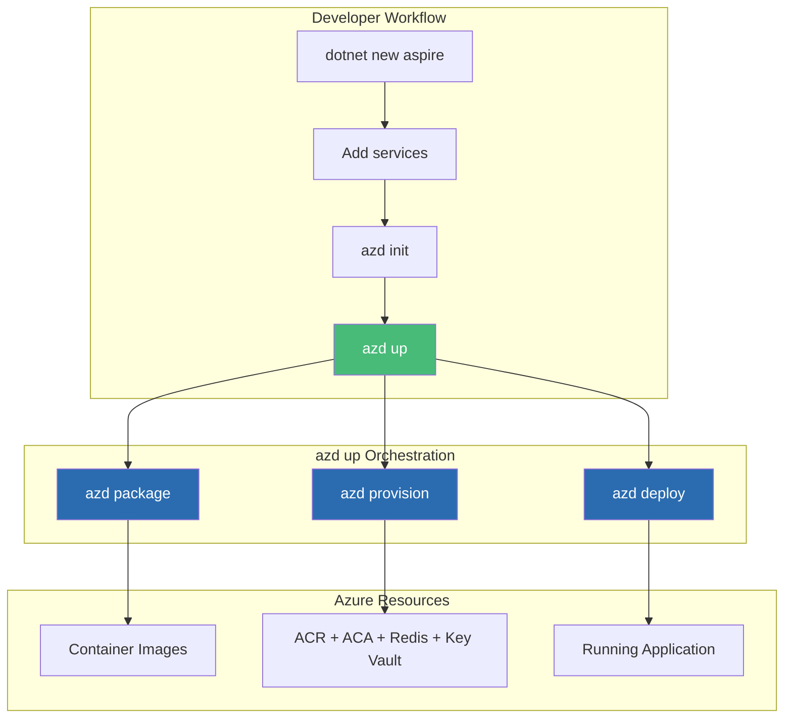
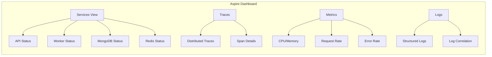

# Azure Developer CLI (azd) with .NET Aspire: The Turnkey Solution

## Full-Stack Deployments from Code to Cloud in Minutes

### Introduction: The Dawn of Opinionated Cloud Development

In the [previous installment](#) of this series, we explored Podman as a daemonless, security-focused alternative to Docker—perfect for organizations requiring rootless container execution and enhanced security postures. While Podman offers fine-grained control over container runtimes, many developers and organizations crave something different: **simplicity, automation, and opinionated best practices**.

Enter the **Azure Developer CLI (`azd`)** combined with **.NET Aspire**—Microsoft's vision for the future of cloud-native .NET development. This turnkey solution represents the culmination of years of evolution in Azure tooling, transforming complex deployments that once required dozens of manual steps into a single command: `azd up`.

For Vehixcare-API, our fleet management platform with 10+ projects, MongoDB integration, SignalR hubs, and background services, `azd` transforms deployment from a multi-hour orchestration challenge into a 10-minute automated workflow. This installment explores how to leverage `azd` and .NET Aspire to achieve full-stack deployments with infrastructure-as-code, containerization, and monitoring—all without writing a single line of YAML.



### Stories at a Glance

**Companion stories in this series:**

- 📚 **1. .NET SDK Native Container Publishing Deep Dive: The Complete Reference** – Comprehensive coverage of MSBuild properties, Native AOT optimization, CI/CD pipeline patterns, performance benchmarks, and troubleshooting guides

- 🚀 **2. .NET SDK Native Container Publishing: Building OCI Images Without Docker** – A deep dive into MSBuild configuration, multi-architecture builds, Native AOT optimization, and direct Azure Container Registry integration with workload identity federation

- 🐳 **3. Traditional Dockerfile with Docker: The Classic Approach** – Mastering multi-stage builds, build cache optimization, .dockerignore patterns, and Azure Container Registry authentication for enterprise CI/CD pipelines

- 🔐 **4. Traditional Dockerfile with Podman: The Daemonless Alternative** – Transitioning from Docker to Podman, rootless containers for enhanced security, podman-compose workflows, and Azure ACR integration with Podman Desktop

- ⚡ **5. Azure Developer CLI (azd) with .NET Aspire: The Turnkey Solution** – Full-stack deployments with `azd up`, Azure Container Apps provisioning, Redis caching, and infrastructure-as-code with Bicep templates *(This story)*

- 🖱️ **6. Visual Studio 2026 GUI Publishing: Drag-and-Drop Azure Deployments** – Leveraging Visual Studio's built-in Podman/Docker support, one-click publish to Azure Container Registry, and debugging containerized apps with Hot Reload

- 🔒 **7. Tarball Export + Runtime Load: Security-First CI/CD Workflows** – Generating container tarballs without a runtime, integrating with Trivy/Grype for vulnerability scanning, and deploying to air-gapped Azure environments

- 🔄 **8. Podman with .NET SDK Native Publishing: Hybrid Workflows** – Combining SDK-native builds with Podman for local testing, multi-architecture emulation, and Azure Container Registry push strategies

- 🛠️ **9. konet: Multi-Platform Container Builds Without Docker** – Using the konet .NET tool for cross-platform image generation, ARM64/AMD64 simultaneous builds, and GitHub Actions optimization

---

## Understanding Azure Developer CLI (azd)

The Azure Developer CLI is a command-line tool that orchestrates the entire application lifecycle—from code to cloud. It abstracts the complexity of Azure resource provisioning, container building, and application deployment into a cohesive workflow.

### Core Principles

| Principle | Description | Benefit |
|-----------|-------------|---------|
| **Convention over Configuration** | Standardized project structure and naming | Minimal YAML, maximum automation |
| **Infrastructure as Code** | Bicep templates for all Azure resources | Reproducible, auditable deployments |
| **Local-to-Cloud Consistency** | Same configuration works locally and in Azure | No environment drift |
| **Built-in Best Practices** | Security defaults, monitoring, scaling | Production-ready out of the box |

### The azd Command Structure

```bash
# Initialize a new project (creates azure.yaml)
azd init

# Full deployment lifecycle
azd up          # Package + Provision + Deploy

# Individual stages
azd package     # Build container images
azd provision   # Create Azure resources
azd deploy      # Deploy application to Azure

# Environment management
azd env new     # Create new environment
azd env list    # List environments
azd env set     # Set environment variables

# CI/CD integration
azd pipeline config  # Configure GitHub Actions or Azure DevOps
```

## .NET Aspire: The Cloud-Native Stack for .NET

.NET Aspire, introduced with .NET 8 and matured in .NET 10, is an opinionated cloud-native development framework that provides:

### Key Components

**1. App Host (Orchestration)**
```csharp
// Vehixcare.AppHost/Program.cs
var builder = DistributedApplication.CreateBuilder(args);

// Add MongoDB
var mongodb = builder.AddMongoDB("mongodb")
    .WithDataVolume()
    .WithMongoExpress();

// Add Redis for caching
var cache = builder.AddRedis("cache");

// Add the API project
var api = builder.AddProject<Projects.Vehixcare_API>("api")
    .WithReference(mongodb)
    .WithReference(cache)
    .WithExternalHttpEndpoints();

// Add background service
builder.AddProject<Projects.Vehixcare_BackgroundServices>("worker")
    .WithReference(mongodb);

builder.Build().Run();
```

**2. Service Discovery**
- Automatic service endpoint resolution
- DNS-based discovery for container environments
- No hardcoded URLs

**3. Telemetry**
- OpenTelemetry integration out of the box
- Distributed tracing, metrics, and logs
- Dashboard for local development

**4. Health Checks**
- Built-in health endpoints for all services
- Readiness/liveness probes for containers
- Dashboard visualization

### Transforming Vehixcare-API to .NET Aspire

Let's transform our fleet management platform to use .NET Aspire:

**Step 1: Create the AppHost Project**

```bash
# Add AppHost project to solution
dotnet new aspire-apphost -n Vehixcare.AppHost
dotnet sln add Vehixcare.AppHost

# Add reference to API project
dotnet add Vehixcare.AppHost reference Vehixcare.API
dotnet add Vehixcare.AppHost reference Vehixcare.BackgroundServices
```

**Step 2: Configure the AppHost**

```csharp
// Vehixcare.AppHost/Program.cs
using System.Net;
using Projects;

var builder = DistributedApplication.CreateBuilder(args);

// ============================================
// DATABASE SERVICES
// ============================================

// MongoDB for primary data storage
var mongodb = builder.AddMongoDB("mongodb")
    .WithDataVolume()  // Persist data between restarts
    .WithMongoExpress() // Admin UI at /mongo-express
    .WithEnvironment("MONGO_INITDB_ROOT_USERNAME", "admin")
    .WithEnvironment("MONGO_INITDB_ROOT_PASSWORD", "password");

// Redis for caching and SignalR backplane
var redis = builder.AddRedis("redis")
    .WithRedisCommander() // Admin UI at /redis-commander
    .WithDataVolume();

// ============================================
// APPLICATION SERVICES
// ============================================

// Main API service
var api = builder.AddProject<Projects.Vehixcare_API>("api")
    .WithReference(mongodb)
    .WithReference(redis)
    .WithExternalHttpEndpoints()
    .WithHttpHealthCheck("/health")
    .WithReplicas(3)  // Scale to 3 instances
    .WithEnvironment("ASPNETCORE_ENVIRONMENT", "Production")
    .WithEnvironment("SignalR__Backplane", "redis");

// Background telemetry processor
var worker = builder.AddProject<Projects.Vehixcare_BackgroundServices>("worker")
    .WithReference(mongodb)
    .WithEnvironment("TELEMETRY_BATCH_SIZE", "100")
    .WithEnvironment("TELEMETRY_INTERVAL_MS", "5000");

// ============================================
// ADDITIONAL RESOURCES
// ============================================

// Azure Key Vault for secrets (when deployed)
if (builder.Environment.IsProduction())
{
    var keyVault = builder.AddAzureKeyVault("secrets");
    api.WithReference(keyVault);
    worker.WithReference(keyVault);
}

// ============================================
// BUILD AND RUN
// ============================================

builder.Build().Run();
```

**Step 3: Update API Project for Aspire**

```xml
<!-- Vehixcare.API/Vehixcare.API.csproj -->
<Project Sdk="Microsoft.NET.Sdk.Web">
  <PropertyGroup>
    <TargetFramework>net9.0</TargetFramework>
    <ImplicitUsings>enable</ImplicitUsings>
    <Nullable>enable</Nullable>
  </PropertyGroup>

  <!-- Aspire service defaults -->
  <ItemGroup>
    <PackageReference Include="Microsoft.Extensions.ServiceDiscovery" Version="9.0.0" />
    <PackageReference Include="OpenTelemetry.Extensions.Hosting" Version="1.9.0" />
    <PackageReference Include="OpenTelemetry.Exporter.Console" Version="1.9.0" />
  </ItemGroup>
  
  <!-- Existing packages -->
  <ItemGroup>
    <PackageReference Include="MongoDB.Driver" Version="2.25.0" />
    <PackageReference Include="Microsoft.AspNetCore.SignalR.StackExchangeRedis" Version="9.0.0" />
    <!-- ... -->
  </ItemGroup>
</Project>
```

**Step 4: Configure Service Discovery**

```csharp
// Vehixcare.API/Program.cs
using Microsoft.Extensions.ServiceDiscovery;

var builder = WebApplication.CreateBuilder(args);

// Add service discovery
builder.Services.AddServiceDiscovery();

// Configure MongoDB connection using service discovery
builder.Services.AddSingleton<IMongoClient>(sp =>
{
    // Use service discovery to resolve MongoDB endpoint
    var serviceEndpoint = sp.GetRequiredService<ServiceEndpointResolver>()
        .GetEndpointAsync("mongodb").GetAwaiter().GetResult();
    
    var connectionString = $"mongodb://admin:password@{serviceEndpoint.Host}:{serviceEndpoint.Port}";
    return new MongoClient(connectionString);
});

// Configure Redis for SignalR backplane
builder.Services.AddSignalR()
    .AddStackExchangeRedis(options =>
    {
        options.Configuration = "redis";  // Service discovery resolves "redis"
    });

var app = builder.Build();

// Health check endpoint for Aspire
app.MapHealthChecks("/health");

app.Run();
```

## The azd Workflow: From Zero to Deployed

### Step 1: Initialize the Project

```bash
# Navigate to solution root
cd /path/to/Vehixcare

# Initialize azd (detects .NET Aspire project)
azd init

# Output:
# ? Select a project: 
#   1. Vehixcare.AppHost
#   2. Vehixcare.API
#   3. Vehixcare.BackgroundServices
#   (Select 1 - Vehixcare.AppHost)

# ? What is the name of your application? vehixcare
# ? What is the location for your Azure resources? East US

# azd creates:
# - azure.yaml: Deployment configuration
# - infrastructure/ : Bicep templates
# - .azure/ : Environment configuration
```

### Step 2: Review Generated azure.yaml

```yaml
# azure.yaml
name: vehixcare
metadata:
  template: azd-init@1.0.0

services:
  api:
    project: Vehixcare.API
    host: containerapp
    language: dotnet
    docker:
      path: ./Dockerfile
      context: ./
    target:
      port: 8080

  worker:
    project: Vehixcare.BackgroundServices
    host: containerapp
    language: dotnet
    docker:
      path: ./Dockerfile.worker
      context: ./

  mongodb:
    host: mongodb
    resource:
      type: "Microsoft.DocumentDB/mongoClusters"
      sku: "M30"
      capabilities: ["EnableMongo"]
      databaseName: "vehixcare"

  redis:
    host: cache
    resource:
      type: "Microsoft.Cache/redis"
      sku: "Standard"
      capacity: 1
```

### Step 3: Deploy with One Command

```bash
# The magic command: package, provision, deploy
azd up

# What happens:
# ============================================
# Phase 1: azd package
# ============================================
# Building Vehixcare.API...
# Building container image: vehixcare.azurecr.io/api:latest
# Building Vehixcare.BackgroundServices...
# Building container image: vehixcare.azurecr.io/worker:latest
# 
# ============================================
# Phase 2: azd provision
# ============================================
# Creating resource group: vehixcare-rg
# Creating Azure Container Registry: vehixcareacr
# Creating Azure Container Apps Environment: vehixcare-env
# Creating MongoDB cluster: vehixcare-mongo
# Creating Redis cache: vehixcare-redis
# Creating Log Analytics Workspace: vehixcare-logs
# Creating Application Insights: vehixcare-insights
# 
# ============================================
# Phase 3: azd deploy
# ============================================
# Pushing api image to ACR...
# Creating Container App: api
# Pushing worker image to ACR...
# Creating Container App: worker
# Configuring service discovery...
# 
# ============================================
# Deployment complete!
# ============================================
# API endpoint: https://api.vehixcare.azurewebsites.net
# Worker status: Running
# MongoDB endpoint: mongodb://vehixcare-mongo.mongo.cosmos.azure.com:10255
# Redis endpoint: vehixcare-redis.redis.cache.windows.net:6380
# 
# Application Insights: https://portal.azure.com/.../vehixcare-insights
```

## Infrastructure as Code with Bicep

`azd` generates Bicep templates that define all Azure resources. These are fully customizable:

### Main Bicep File

```bicep
// infrastructure/main.bicep
param environmentName string
param location string = resourceGroup().location

// ============================================
// RESOURCE GROUP
// ============================================
resource rg 'Microsoft.Resources/resourceGroups@2023-07-01' = {
  name: 'rg-${environmentName}'
  location: location
}

// ============================================
// CONTAINER REGISTRY
// ============================================
resource acr 'Microsoft.ContainerRegistry/registries@2023-07-01' = {
  name: 'acr${environmentName}'
  location: location
  sku: {
    name: 'Standard'
  }
  properties: {
    adminUserEnabled: false
  }
}

// ============================================
// CONTAINER APPS ENVIRONMENT
// ============================================
resource logAnalytics 'Microsoft.OperationalInsights/workspaces@2023-09-01' = {
  name: 'log-${environmentName}'
  location: location
  properties: {
    sku: {
      name: 'PerGB2018'
    }
  }
}

resource containerAppsEnv 'Microsoft.App/managedEnvironments@2023-11-02-preview' = {
  name: 'cae-${environmentName}'
  location: location
  properties: {
    daprAIConnectionString: applicationInsights.properties.ConnectionString
    appLogsConfiguration: {
      destination: 'log-analytics'
      logAnalyticsConfiguration: {
        customerId: logAnalytics.properties.customerId
        sharedKey: logAnalytics.listKeys().primarySharedKey
      }
    }
  }
}

// ============================================
// MONGODB
// ============================================
resource mongodb 'Microsoft.DocumentDB/mongoClusters@2023-09-15' = {
  name: 'mongo-${environmentName}'
  location: location
  properties: {
    administratorLogin: 'vehixcare'
    administratorLoginPassword: '@admin123!'
    serverVersion: '5.0'
    nodeGroupSpecs: [
      {
        kind: 'Shard'
        sku: 'M30'
        diskSizeGB: 128
        enableHa: true
      }
    ]
  }
}

// ============================================
// REDIS CACHE
// ============================================
resource redis 'Microsoft.Cache/redis@2023-08-01' = {
  name: 'redis-${environmentName}'
  location: location
  properties: {
    sku: {
      name: 'Standard'
      family: 'C'
      capacity: 1
    }
    enableNonSslPort: false
    minimumTlsVersion: '1.2'
    redisConfiguration: {
      'maxmemory-policy': 'allkeys-lru'
    }
  }
}

// ============================================
// APPLICATION INSIGHTS
// ============================================
resource applicationInsights 'Microsoft.Insights/components@2020-02-02' = {
  name: 'appi-${environmentName}'
  location: location
  kind: 'web'
  properties: {
    Application_Type: 'web'
    WorkspaceResourceId: logAnalytics.id
  }
}

// ============================================
// CONTAINER APPS
// ============================================
module api './containerapp.bicep' = {
  name: 'api-deployment'
  params: {
    name: 'api'
    environmentName: containerAppsEnv.name
    image: '${acr.properties.loginServer}/api:${imageTag}'
    port: 8080
    environmentVariables: [
      {
        name: 'ASPNETCORE_ENVIRONMENT'
        value: 'Production'
      }
      {
        name: 'MONGODB_CONNECTION_STRING'
        value: mongodb.properties.connectionString
      }
      {
        name: 'REDIS_CONNECTION_STRING'
        value: redis.properties.sslHostName
      }
    ]
    secrets: [
      {
        name: 'mongodb-password'
        value: '@admin123!'
      }
    ]
    scale: {
      minReplicas: 2
      maxReplicas: 10
      rules: [
        {
          name: 'http'
          custom: {
            type: 'http'
            metadata: {
              concurrentRequests: '50'
            }
          }
        }
      ]
    }
  }
}
```

## Environment Management

### Multiple Environments

```bash
# Create development environment
azd env new dev
azd env set AZURE_LOCATION eastus
azd up

# Create staging environment
azd env new staging
azd env set AZURE_LOCATION eastus2
azd env set AZURE_SKU Standard
azd up

# Create production environment
azd env new prod
azd env set AZURE_LOCATION westus3
azd env set AZURE_SKU Premium
azd env set AZURE_REPLICAS 5
azd up

# List environments
azd env list
# dev    (current)
# staging
# prod
```

### Environment Variables

```bash
# Set environment-specific variables
azd env set MONGODB_SKU M30
azd env set API_REPLICAS 3
azd env set WORKER_MEMORY 2Gi

# Variables are stored in .azure/{env}/.env
# Can be referenced in Bicep:
# param mongodbSku string = environmentVariable('MONGODB_SKU')
```

## CI/CD Integration

### Configure GitHub Actions

```bash
# Generate GitHub Actions workflow
azd pipeline config --provider github

# Output:
# Created GitHub Actions workflow: .github/workflows/azure-dev.yml
# Configured secrets: AZURE_CLIENT_ID, AZURE_TENANT_ID, AZURE_SUBSCRIPTION_ID
# Created service principal: vehixcare-azd-sp
```

### Generated GitHub Actions Workflow

```yaml
# .github/workflows/azure-dev.yml
name: Deploy to Azure

on:
  push:
    branches: [main]
  pull_request:
    branches: [main]
  workflow_dispatch:

env:
  AZURE_CLIENT_ID: ${{ secrets.AZURE_CLIENT_ID }}
  AZURE_TENANT_ID: ${{ secrets.AZURE_TENANT_ID }}
  AZURE_SUBSCRIPTION_ID: ${{ secrets.AZURE_SUBSCRIPTION_ID }}

jobs:
  build-and-deploy:
    runs-on: ubuntu-latest
    steps:
    - uses: actions/checkout@v4

    - name: Setup .NET
      uses: actions/setup-dotnet@v4
      with:
        dotnet-version: 10.0.x

    - name: Install azd
      uses: Azure/setup-azd@v1

    - name: Login to Azure
      uses: azure/login@v1
      with:
        client-id: ${{ env.AZURE_CLIENT_ID }}
        tenant-id: ${{ env.AZURE_TENANT_ID }}
        subscription-id: ${{ env.AZURE_SUBSCRIPTION_ID }}

    - name: Deploy with azd
      run: |
        azd up \
          --environment production \
          --no-prompt
```

## Local Development Experience

### Running with Aspire Dashboard

```bash
# Run the entire solution locally
cd Vehixcare.AppHost
dotnet run

# Output:
# Now listening on: https://localhost:7242
# Aspire Dashboard: https://localhost:7242/dashboard
```

The Aspire Dashboard provides:



### Dashboard Features

**Service Graph:**
- Visual representation of service dependencies
- Real-time health status
- Request flow visualization

**Traces:**
- End-to-end request tracing
- Span details with timing
- Error identification

**Metrics:**
- CPU and memory usage per service
- Request throughput
- Latency percentiles
- Error rates

**Logs:**
- Structured log viewing
- Log correlation with traces
- Filtering and searching

## Advanced .NET Aspire Patterns

### Custom Resource Types

```csharp
// Create custom resource for vehicle telemetry simulator
public class TelemetrySimulatorResource : ContainerResource, IResourceWithConnectionString
{
    public TelemetrySimulatorResource(string name) : base(name)
    {
        Vehicles = new List<Vehicle>();
    }
    
    public List<Vehicle> Vehicles { get; }
    
    public ReferenceExpression ConnectionStringExpression =>
        ReferenceExpression.Create($"{Name}.connectionString");
}

// Extension method for adding simulator
public static class TelemetrySimulatorExtensions
{
    public static IResourceBuilder<TelemetrySimulatorResource> AddTelemetrySimulator(
        this IDistributedApplicationBuilder builder, 
        string name,
        int vehicleCount = 100)
    {
        var resource = new TelemetrySimulatorResource(name);
        
        return builder.AddResource(resource)
            .WithImage("vehixcare/simulator:latest")
            .WithEnvironment("VEHICLE_COUNT", vehicleCount.ToString())
            .WithEnvironment("API_ENDPOINT", "http://api")
            .WithHttpEndpoint(port: 8081, name: "simulator")
            .WithHealthCheck("/health");
    }
}

// Usage in AppHost
var simulator = builder.AddTelemetrySimulator("simulator", vehicleCount: 500)
    .WithReference(api);
```

### Service Defaults Configuration

```csharp
// Service defaults for consistent configuration
public static class ServiceDefaults
{
    public static IHostApplicationBuilder AddServiceDefaults(this IHostApplicationBuilder builder)
    {
        // OpenTelemetry
        builder.Services.AddOpenTelemetry()
            .WithTracing(tracing => tracing
                .AddAspNetCoreInstrumentation()
                .AddHttpClientInstrumentation()
                .AddMongoDBInstrumentation()
                .AddSource("Vehixcare.*"))
            .WithMetrics(metrics => metrics
                .AddAspNetCoreInstrumentation()
                .AddHttpClientInstrumentation()
                .AddMeter("Vehixcare.*"));
        
        // Service discovery
        builder.Services.AddServiceDiscovery();
        
        // Health checks
        builder.Services.AddHealthChecks()
            .AddMongoDb()
            .AddRedis()
            .AddUrlGroup(new Uri("http://api/health"), "API Health");
        
        return builder;
    }
}

// Usage in API Program.cs
var builder = WebApplication.CreateBuilder(args);
builder.AddServiceDefaults();  // All defaults applied
```

## Monitoring and Observability

### Application Insights Integration

```csharp
// Configure Application Insights
builder.Services.AddApplicationInsightsTelemetry(options =>
{
    options.ConnectionString = Environment.GetEnvironmentVariable("APPLICATIONINSIGHTS_CONNECTION_STRING");
    options.EnableAdaptiveSampling = true;
    options.EnableQuickPulseMetricStream = true;
});

// Custom telemetry for telemetry processing
public class TelemetryProcessor
{
    private readonly TelemetryClient _telemetryClient;
    
    public async Task ProcessTelemetry(TelemetryData data)
    {
        // Track custom metric
        _telemetryClient.TrackMetric("TelemetryIngestionRate", 1);
        
        // Track custom event
        _telemetryClient.TrackEvent("TelemetryProcessed", new Dictionary<string, string>
        {
            ["VehicleId"] = data.VehicleId,
            ["DataType"] = data.Type.ToString()
        });
        
        // Track dependency (MongoDB)
        using var operation = _telemetryClient.StartOperation<DependencyTelemetry>("MongoDB Insert");
        await _mongoCollection.InsertOneAsync(data);
        operation.Telemetry.Success = true;
        operation.Telemetry.Duration = stopwatch.Elapsed;
    }
}
```

## Cost Management

### Estimated Monthly Costs for Vehixcare

| Resource | SKU | Estimated Monthly Cost |
|----------|-----|----------------------|
| Azure Container Registry | Standard | $15 |
| Container Apps Environment | Basic | $45 |
| API Container App (3 replicas) | Consumption | $120 |
| Worker Container App | Consumption | $60 |
| MongoDB Cluster | M30 | $250 |
| Redis Cache | Standard (1 GB) | $85 |
| Log Analytics | 10 GB/day | $120 |
| Application Insights | Standard | $90 |
| **Total** | | **~$785** |

### Cost Optimization Strategies

```yaml
# Development environment (reduced cost)
services:
  mongodb:
    resource:
      type: "Microsoft.DocumentDB/mongoClusters"
      sku: "M10"  # Reduced from M30
      capabilities: []
  
  api:
    scale:
      minReplicas: 1  # Reduced from 2
      maxReplicas: 3  # Reduced from 10

# Production environment (full capacity)
services:
  mongodb:
    resource:
      type: "Microsoft.DocumentDB/mongoClusters"
      sku: "M50"  # Increased for production
      capabilities: ["EnableGeoReplication"]
  
  api:
    scale:
      minReplicas: 3
      maxReplicas: 20
      rules:
        - name: http
          custom:
            type: http
            metadata:
              concurrentRequests: '100'
```

## Troubleshooting azd Deployments

### Issue 1: Authentication Failed

**Error:** `Failed to authenticate with Azure`

**Solution:**
```bash
# Re-authenticate
az logout
az login

# Verify subscription
az account show

# Set subscription if multiple
az account set --subscription "My Subscription"
```

### Issue 2: Resource Quota Exceeded

**Error:** `Quota exceeded for region East US`

**Solution:**
```bash
# Change region
azd env set AZURE_LOCATION centralus

# Or request quota increase in Azure portal
# Navigate to Subscriptions → Usage + quotas → Request increase
```

### Issue 3: Docker Build Fails

**Error:** `Docker build failed: COPY failed`

**Solution:**
```bash
# Check Dockerfile paths
azd package --debug

# Use podman instead (if Docker unavailable)
export DOCKER_HOST=unix:///run/user/$(id -u)/podman/podman.sock
azd up
```

### Issue 4: Service Discovery Failing

**Error:** `Unable to resolve service 'mongodb'`

**Solution:**
```csharp
// Add fallback for local development
var serviceEndpoint = await serviceEndpointResolver
    .GetEndpointAsync("mongodb")
    .ConfigureAwait(false);

if (serviceEndpoint == null)
{
    // Fallback to environment variable
    var connectionString = Environment.GetEnvironmentVariable("MONGODB_CONNECTION_STRING");
    return new MongoClient(connectionString);
}
```

## Conclusion: The Power of Convention

Azure Developer CLI with .NET Aspire represents a paradigm shift in cloud development. By embracing convention over configuration, it transforms what once required dozens of manual steps, multiple YAML files, and deep Azure expertise into a single command: `azd up`.

For Vehixcare-API, the benefits are substantial:

| Metric | Traditional Approach | azd + Aspire |
|--------|---------------------|--------------|
| **Time to First Deployment** | 2-3 hours | 10 minutes |
| **Lines of YAML** | 200+ | 10 |
| **Infrastructure Files** | 15+ | 5 (auto-generated) |
| **Service Discovery** | Manual URL configuration | Automatic |
| **Observability Setup** | Manual instrumentation | Built-in OpenTelemetry |
| **Environment Management** | Custom scripts | `azd env` commands |
| **CI/CD Configuration** | 4+ hours | `azd pipeline config` |

While SDK-native publishing and Dockerfile approaches offer fine-grained control, `azd` with .NET Aspire delivers something equally valuable: **developer velocity**. For teams building cloud-native .NET applications, especially those leveraging Azure services, this turnkey solution is the fastest path from code to production.

---

### Stories at a Glance

**Companion stories in this series:**

- 📚 **1. .NET SDK Native Container Publishing Deep Dive: The Complete Reference** – Comprehensive coverage of MSBuild properties, Native AOT optimization, CI/CD pipeline patterns, performance benchmarks, and troubleshooting guides

- 🚀 **2. .NET SDK Native Container Publishing: Building OCI Images Without Docker** – A deep dive into MSBuild configuration, multi-architecture builds, Native AOT optimization, and direct Azure Container Registry integration with workload identity federation

- 🐳 **3. Traditional Dockerfile with Docker: The Classic Approach** – Mastering multi-stage builds, build cache optimization, .dockerignore patterns, and Azure Container Registry authentication for enterprise CI/CD pipelines

- 🔐 **4. Traditional Dockerfile with Podman: The Daemonless Alternative** – Transitioning from Docker to Podman, rootless containers for enhanced security, podman-compose workflows, and Azure ACR integration with Podman Desktop

- ⚡ **5. Azure Developer CLI (azd) with .NET Aspire: The Turnkey Solution** – Full-stack deployments with `azd up`, Azure Container Apps provisioning, Redis caching, and infrastructure-as-code with Bicep templates *(This story)*

- 🖱️ **6. Visual Studio 2026 GUI Publishing: Drag-and-Drop Azure Deployments** – Leveraging Visual Studio's built-in Podman/Docker support, one-click publish to Azure Container Registry, and debugging containerized apps with Hot Reload

- 🔒 **7. Tarball Export + Runtime Load: Security-First CI/CD Workflows** – Generating container tarballs without a runtime, integrating with Trivy/Grype for vulnerability scanning, and deploying to air-gapped Azure environments

- 🔄 **8. Podman with .NET SDK Native Publishing: Hybrid Workflows** – Combining SDK-native builds with Podman for local testing, multi-architecture emulation, and Azure Container Registry push strategies

- 🛠️ **9. konet: Multi-Platform Container Builds Without Docker** – Using the konet .NET tool for cross-platform image generation, ARM64/AMD64 simultaneous builds, and GitHub Actions optimization

---

**Coming next in the series:**
**🖱️ Visual Studio 2026 GUI Publishing: Drag-and-Drop Azure Deployments** – Leveraging Visual Studio's built-in Podman/Docker support, one-click publish to Azure Container Registry, and debugging containerized apps with Hot Reload