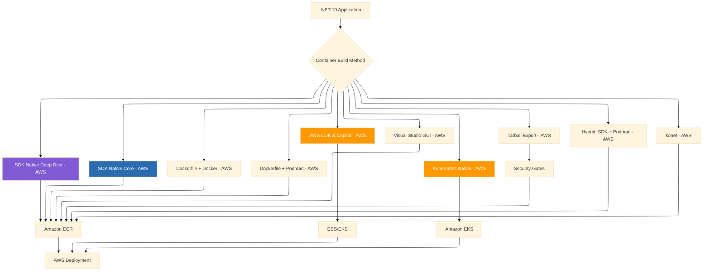

# Publishing .NET 10 Apps as Container Images: A Complete Guide to 10 Deployment Approaches
## The .NET 10 series explores the full spectrum of container deployment options for modern .NET applications, from SDK-native simplicity to Kubernetes orchestration with AWS

## AWS Edition: From Development to Production on Amazon Web Services


### Introduction: The Evolution of .NET Container Publishing on AWS

The containerization landscape for .NET applications has undergone a remarkable transformation. When Docker first emerged in 2013, .NET developers were confined to Windows containers, a niche approach that felt like an afterthought. Fast forward to 2026, and .NET 10 represents the culmination of a decade-long journey toward seamless containerization, offering developers an unprecedented array of deployment options that rival—and in some ways surpass—the ecosystem maturity of languages like Go and Rust.

On Amazon Web Services (AWS), this evolution has been equally profound. AWS now offers a comprehensive suite of container services—from Amazon ECR (Elastic Container Registry) for image storage, to Amazon ECS (Elastic Container Service) for serverless containers, to Amazon EKS (Elastic Kubernetes Service) for enterprise-grade orchestration. For .NET developers targeting AWS, the question is no longer "can I containerize?" but rather "which approach best fits my architecture, security requirements, and operational model?"

What makes .NET 10 particularly special is the native container support baked directly into the SDK. Gone are the days when writing a Dockerfile was mandatory. Today, a single `dotnet publish` command can produce production-ready OCI images, push them directly to Amazon ECR, or even export them as tarballs for security scanning—all without Docker installed on your machine.

This shift reflects a broader industry trend: the decoupling of container image creation from container runtimes. As organizations embrace Podman's daemonless architecture for enhanced security, and as air-gapped environments demand greater control over the supply chain, the .NET SDK's container tooling provides the flexibility to adapt to any infrastructure requirement—including the diverse ecosystem of AWS.



### Stories at a Glance

**Companion stories in this AWS series:**

- 📚 [**1. .NET SDK Native Container Publishing Deep Dive: The Complete Reference - AWS**](#) – Comprehensive coverage of MSBuild properties, Native AOT optimization, CI/CD pipeline patterns, performance benchmarks, and troubleshooting guides for Amazon ECR

- 🚀 **2. .NET SDK Native Container Publishing: Building OCI Images Without Docker - AWS** – A deep dive into MSBuild configuration, multi-architecture builds (Graviton ARM64), and direct Amazon ECR integration with IAM roles

- 🐳 **3. Traditional Dockerfile with Docker: The Classic Approach - AWS** – Mastering multi-stage builds, build cache optimization, and Amazon ECR authentication for enterprise CI/CD pipelines on AWS

- 🔐 **4. Traditional Dockerfile with Podman: The Daemonless Alternative - AWS** – Transitioning from Docker to Podman, rootless containers for enhanced security, and Amazon ECR integration with Podman Desktop

- 🏗️ **5. AWS CDK & Copilot: Infrastructure as Code for Containers - AWS** – Deploying to Amazon ECS with AWS Copilot, infrastructure-as-code with CDK, and Fargate serverless container orchestration

- 🖱️ **6. Visual Studio 2026 GUI Publishing: Drag-and-Drop AWS Deployments - AWS** – Leveraging Visual Studio's AWS Toolkit, one-click publish to Amazon ECR, and debugging containerized apps on AWS

- 🔒 **7. Tarball Export + Runtime Load: Security-First CI/CD Workflows - AWS** – Generating container tarballs without a runtime, integrating with Amazon Inspector for vulnerability scanning, and deploying to air-gapped AWS environments

- 🔄 **8. Podman with .NET SDK Native Publishing: Hybrid Workflows - AWS** – Combining SDK-native builds with Podman for local testing, multi-architecture emulation (x64 to Graviton), and Amazon ECR push strategies

- 🛠️ **9. konet: Multi-Platform Container Builds Without Docker - AWS** – Using the konet .NET tool for cross-platform image generation, AMD64/ARM64 (Graviton) simultaneous builds, and AWS CodeBuild optimization

- ☸️ **10. Kubernetes Native Deployments: Orchestrating .NET 10 Containers on Amazon EKS - AWS** – Deploying to Amazon EKS, Helm charts, GitOps with Flux, ALB Ingress Controller, and production-grade operations

---

## 1. 📚 .NET SDK Native Container Publishing Deep Dive: The Complete Reference - AWS

This comprehensive reference covers the SDK-native approach with exhaustive detail on every configuration option, optimization technique, and troubleshooting pattern for AWS deployments.

### MSBuild Properties Reference for Amazon ECR

| Property | AWS Value | Description |
|----------|-----------|-------------|
| `ContainerRegistry` | `123456789012.dkr.ecr.us-east-1.amazonaws.com` | Amazon ECR registry URL |
| `ContainerRepository` | `vehixcare-api` | Image repository name |
| `ContainerImageTags` | `latest;1.0.0;$(BuildId)` | Multiple tags |
| `ContainerEnvironmentVariable` | `ASPNETCORE_ENVIRONMENT=Production` | Runtime config |

### Authentication with Amazon ECR

```bash
# Get login password and authenticate Docker/Podman
aws ecr get-login-password --region us-east-1 | \
    podman login --username AWS --password-stdin 123456789012.dkr.ecr.us-east-1.amazonaws.com

# Direct push with SDK-native
dotnet publish /t:PublishContainer \
    -p ContainerRegistry=123456789012.dkr.ecr.us-east-1.amazonaws.com \
    -p ContainerRepository=vehixcare-api
```

### Native AOT for AWS Graviton (ARM64)

```xml
<PropertyGroup>
  <PublishAot>true</PublishAot>
  <ContainerBaseImage>mcr.microsoft.com/dotnet/runtime-deps:10.0</ContainerBaseImage>
  <ContainerImageTags>graviton-latest</ContainerImageTags>
</PropertyGroup>
```

```bash
# Build for AWS Graviton processors
dotnet publish /t:PublishContainer \
    --arch arm64 \
    -p ContainerRegistry=123456789012.dkr.ecr.us-east-1.amazonaws.com
```

### CI/CD with AWS CodeBuild

```yaml
# buildspec.yml
version: 0.2
phases:
  install:
    runtime-versions:
      dotnet: 10.0
    commands:
      - dotnet tool install -g Amazon.ECS.Tools
  pre_build:
    commands:
      - aws ecr get-login-password --region $AWS_DEFAULT_REGION | docker login --username AWS --password-stdin $AWS_ACCOUNT_ID.dkr.ecr.$AWS_DEFAULT_REGION.amazonaws.com
  build:
    commands:
      - dotnet publish /t:PublishContainer \
          -p ContainerRegistry=$AWS_ACCOUNT_ID.dkr.ecr.$AWS_DEFAULT_REGION.amazonaws.com \
          -p ContainerRepository=vehixcare-api
```

---

## 2. 🚀 .NET SDK Native Container Publishing: Building OCI Images Without Docker - AWS

At the heart of modern .NET containerization lies the SDK's native container publishing capability, introduced in .NET 8 and refined dramatically through .NET 10.

### Multi-Architecture for AWS (x64 + Graviton)

```bash
# Build for x64 (Intel/AMD)
dotnet publish /t:PublishContainer \
    --arch x64 \
    -p ContainerRegistry=$ACCOUNT_ID.dkr.ecr.us-east-1.amazonaws.com \
    -p ContainerImageTag=amd64-latest

# Build for ARM64 (AWS Graviton)
dotnet publish /t:PublishContainer \
    --arch arm64 \
    -p ContainerRegistry=$ACCOUNT_ID.dkr.ecr.us-east-1.amazonaws.com \
    -p ContainerImageTag=arm64-latest

# Create multi-arch manifest
docker manifest create $ACCOUNT_ID.dkr.ecr.us-east-1.amazonaws.com/vehixcare-api:latest \
    $ACCOUNT_ID.dkr.ecr.us-east-1.amazonaws.com/vehixcare-api:amd64-latest \
    $ACCOUNT_ID.dkr.ecr.us-east-1.amazonaws.com/vehixcare-api:arm64-latest

docker manifest push $ACCOUNT_ID.dkr.ecr.us-east-1.amazonaws.com/vehixcare-api:latest
```

### IAM Roles for Service Accounts (IRSA)

```yaml
# IAM role for EKS pod to pull from ECR
apiVersion: v1
kind: ServiceAccount
metadata:
  name: vehixcare-api-sa
  namespace: vehixcare
  annotations:
    eks.amazonaws.com/role-arn: arn:aws:iam::123456789012:role/ecr-pull-role
```

---

## 3. 🐳 Traditional Dockerfile with Docker: The Classic Approach - AWS

The traditional Dockerfile approach with Docker remains the industry standard for good reason, offering unparalleled control over the container build process.

### Amazon ECR Authentication

```bash
# Login to Amazon ECR
aws ecr get-login-password --region us-east-1 | \
    docker login --username AWS --password-stdin $ACCOUNT_ID.dkr.ecr.us-east-1.amazonaws.com

# Build and push
docker build -t vehixcare-api:latest .
docker tag vehixcare-api:latest $ACCOUNT_ID.dkr.ecr.us-east-1.amazonaws.com/vehixcare-api:latest
docker push $ACCOUNT_ID.dkr.ecr.us-east-1.amazonaws.com/vehixcare-api:latest
```

### Dockerfile Optimizations for AWS

```dockerfile
# Multi-stage build for .NET 10
FROM mcr.microsoft.com/dotnet/sdk:10.0 AS build
WORKDIR /src
COPY . .
RUN dotnet publish -c Release -o /app/publish \
    /p:PublishTrimmed=true \
    /p:PublishReadyToRun=true

FROM mcr.microsoft.com/dotnet/aspnet:10.0
WORKDIR /app
COPY --from=build /app/publish .
ENV ASPNETCORE_ENVIRONMENT=Production
ENTRYPOINT ["dotnet", "Vehixcare.API.dll"]
```

---

## 4. 🔐 Traditional Dockerfile with Podman: The Daemonless Alternative - AWS

Podman offers a daemonless, rootless container engine that fundamentally changes the security posture of containerized workloads—particularly valuable for AWS deployments.

### Rootless Podman on AWS EC2

```bash
# On EC2 with Amazon Linux 2023
sudo dnf install podman -y

# Run rootless
podman build -t vehixcare-api:latest .

# Push to ECR (requires credential helper)
podman push $ACCOUNT_ID.dkr.ecr.us-east-1.amazonaws.com/vehixcare-api:latest
```

### Podman with EC2 Instance Profile

```bash
# EC2 instance with IAM role automatically authenticates
aws ecr get-login-password --region us-east-1 | \
    podman login --username AWS --password-stdin $ACCOUNT_ID.dkr.ecr.us-east-1.amazonaws.com

podman push $ACCOUNT_ID.dkr.ecr.us-east-1.amazonaws.com/vehixcare-api:latest
```

---

## 5. 🏗️ AWS CDK & Copilot: Infrastructure as Code for Containers - AWS

AWS Copilot and CDK represent the most opinionated and automated approach to deploying .NET 10 applications to AWS.

### AWS Copilot for ECS

```bash
# Initialize Copilot app
copilot init \
    --app vehixcare \
    --name api \
    --type "Load Balanced Web Service" \
    --dockerfile ./Dockerfile \
    --deploy

# Configure environment
copilot env init --name production --profile default
copilot deploy --env production
```

### AWS CDK with .NET

```csharp
// VehixcareStack.cs
using Amazon.CDK;
using Amazon.CDK.AWS.ECS;
using Amazon.CDK.AWS.ECR;
using Amazon.CDK.AWS.ElasticLoadBalancingV2;

public class VehixcareStack : Stack
{
    public VehixcareStack(Construct scope, string id, IStackProps props = null) 
        : base(scope, id, props)
    {
        // ECR Repository
        var repository = new Repository(this, "VehixcareRepo", new RepositoryProps
        {
            RepositoryName = "vehixcare-api",
            RemovalPolicy = RemovalPolicy.DESTROY
        });

        // ECS Cluster
        var cluster = new Cluster(this, "VehixcareCluster", new ClusterProps
        {
            Vpc = Vpc.FromLookup(this, "VPC", new VpcLookupOptions { IsDefault = true })
        });

        // Fargate Task Definition
        var taskDefinition = new FargateTaskDefinition(this, "TaskDef", new FargateTaskDefinitionProps
        {
            MemoryLimitMiB = 512,
            Cpu = 256
        });

        taskDefinition.AddContainer("Api", new ContainerDefinitionOptions
        {
            Image = ContainerImage.FromEcrRepository(repository, "latest"),
            PortMappings = new[] { new PortMapping { ContainerPort = 8080 } },
            Environment = new Dictionary<string, string>
            {
                ["ASPNETCORE_ENVIRONMENT"] = "Production"
            }
        });

        // Load Balanced Service
        var service = new FargateService(this, "Service", new FargateServiceProps
        {
            Cluster = cluster,
            TaskDefinition = taskDefinition,
            DesiredCount = 3
        });
    }
}
```

---

## 6. 🖱️ Visual Studio 2026 GUI Publishing: Drag-and-Drop AWS Deployments - AWS

Visual Studio 2026 with the AWS Toolkit provides the most accessible path to AWS container deployment for .NET developers.

### AWS Toolkit for Visual Studio

1. **Install AWS Toolkit** from Visual Studio Marketplace
2. **Configure AWS Credentials** via IAM user or SSO
3. **Right-click project → Publish to AWS**
4. **Select target**: Amazon ECS or Amazon EKS

### Deployment Options

| Target | Description |
|--------|-------------|
| **Amazon ECS (Fargate)** | Serverless container hosting |
| **Amazon ECS (EC2)** | EC2-backed container hosting |
| **Amazon EKS** | Kubernetes orchestration |
| **Amazon ECR** | Registry only |

---

## 7. 🔒 Tarball Export + Runtime Load: Security-First CI/CD Workflows - AWS

For regulated industries and security-conscious organizations, deploying container images directly to registries is often prohibited. Tarball export enables security gates before push to Amazon ECR.

### Security Scanning with Amazon Inspector

```bash
# Build tarball
dotnet publish /t:PublishContainer \
    -p ContainerArchiveOutputPath=./output/vehixcare-api.tar.gz

# Scan with Amazon Inspector (via AWS CLI)
aws inspector2 scan-findings \
    --filter-criteria '{"resourceType":[{"comparison":"EQUALS","value":"AWS_ECR_CONTAINER_IMAGE"}]}'

# Load and push after approval
podman load -i ./output/vehixcare-api.tar.gz
podman tag localhost/vehixcare-api:latest $ACCOUNT_ID.dkr.ecr.us-east-1.amazonaws.com/vehixcare-api:approved
podman push $ACCOUNT_ID.dkr.ecr.us-east-1.amazonaws.com/vehixcare-api:approved
```

---

## 8. 🔄 Podman with .NET SDK Native Publishing: Hybrid Workflows - AWS

The combination of .NET SDK-native container publishing with Podman offers the best of both worlds: SDK-native simplicity with Podman's local testing and security.

### Local Testing for AWS Graviton

```bash
# Build ARM64 image with SDK
dotnet publish /t:PublishContainer --arch arm64 -p ContainerImageTag=graviton-test

# Run on x64 with emulation
podman run --rm --platform linux/arm64 -p 8080:8080 vehixcare-api:graviton-test

# Push to ECR after validation
podman tag vehixcare-api:graviton-test $ACCOUNT_ID.dkr.ecr.us-east-1.amazonaws.com/vehixcare-api:graviton
podman push $ACCOUNT_ID.dkr.ecr.us-east-1.amazonaws.com/vehixcare-api:graviton
```

---

## 9. 🛠️ konet: Multi-Platform Container Builds Without Docker - AWS

konet enables building images for multiple AWS architectures in parallel, from any build environment.

### Graviton-Optimized Builds

```bash
# Install konet
dotnet tool install --global konet

# Publish application
dotnet publish -c Release -o ./publish

# Build for both x64 and Graviton in parallel
konet build \
    --publish-path ./publish \
    --platforms linux/amd64,linux/arm64 \
    --output vehixcare-api:latest \
    --registry $ACCOUNT_ID.dkr.ecr.us-east-1.amazonaws.com \
    --push
```

---

## 10. ☸️ Kubernetes Native Deployments: Orchestrating .NET 10 Containers on Amazon EKS - AWS

Amazon EKS provides managed Kubernetes orchestration for .NET 10 containers at enterprise scale.

### Creating an EKS Cluster

```bash
# Create EKS cluster
eksctl create cluster \
    --name vehixcare-eks \
    --region us-east-1 \
    --nodegroup-name standard-workers \
    --node-type t3.medium \
    --nodes 3 \
    --nodes-min 2 \
    --nodes-max 10 \
    --managed

# Configure kubectl
aws eks update-kubeconfig --region us-east-1 --name vehixcare-eks
```

### Deployment Manifest for EKS

```yaml
# deployment.yaml
apiVersion: apps/v1
kind: Deployment
metadata:
  name: vehixcare-api
  namespace: vehixcare
spec:
  replicas: 3
  selector:
    matchLabels:
      app: vehixcare-api
  template:
    metadata:
      labels:
        app: vehixcare-api
    spec:
      containers:
      - name: api
        image: $ACCOUNT_ID.dkr.ecr.us-east-1.amazonaws.com/vehixcare-api:latest
        ports:
        - containerPort: 8080
        resources:
          requests:
            memory: "256Mi"
            cpu: "250m"
          limits:
            memory: "512Mi"
            cpu: "500m"
```

### ALB Ingress Controller

```bash
# Install AWS Load Balancer Controller
helm repo add eks https://aws.github.io/eks-charts
helm install aws-load-balancer-controller eks/aws-load-balancer-controller \
    --set clusterName=vehixcare-eks \
    --set serviceAccount.create=true \
    --set region=us-east-1
```

```yaml
# ingress.yaml
apiVersion: networking.k8s.io/v1
kind: Ingress
metadata:
  name: vehixcare-api-ingress
  annotations:
    kubernetes.io/ingress.class: alb
    alb.ingress.kubernetes.io/scheme: internet-facing
    alb.ingress.kubernetes.io/target-type: ip
spec:
  rules:
  - host: api.vehixcare.com
    http:
      paths:
      - path: /
        pathType: Prefix
        backend:
          service:
            name: vehixcare-api-service
            port:
              number: 80
```

---

### Stories at a Glance

**Complete AWS series (10 stories):**

- 📚 [**1. .NET SDK Native Container Publishing Deep Dive: The Complete Reference - AWS**](#) – Comprehensive coverage of MSBuild properties, Native AOT optimization, CI/CD pipeline patterns, and Amazon ECR integration

- 🚀 **2. .NET SDK Native Container Publishing: Building OCI Images Without Docker - AWS** – MSBuild configuration, multi-architecture builds (x64 + Graviton), and direct Amazon ECR integration with IAM roles

- 🐳 **3. Traditional Dockerfile with Docker: The Classic Approach - AWS** – Multi-stage builds, build cache optimization, and Amazon ECR authentication for enterprise CI/CD pipelines

- 🔐 **4. Traditional Dockerfile with Podman: The Daemonless Alternative - AWS** – Transitioning to Podman, rootless containers, and Amazon ECR integration with Podman Desktop

- 🏗️ **5. AWS CDK & Copilot: Infrastructure as Code for Containers - AWS** – Deploying to Amazon ECS with AWS Copilot, infrastructure-as-code with CDK, and Fargate serverless container orchestration

- 🖱️ **6. Visual Studio 2026 GUI Publishing: Drag-and-Drop AWS Deployments - AWS** – AWS Toolkit for Visual Studio, one-click publish to Amazon ECR, and debugging containerized apps on AWS

- 🔒 **7. Tarball Export + Runtime Load: Security-First CI/CD Workflows - AWS** – Generating container tarballs, Amazon Inspector vulnerability scanning, and deploying to air-gapped AWS environments

- 🔄 **8. Podman with .NET SDK Native Publishing: Hybrid Workflows - AWS** – Combining SDK-native builds with Podman, multi-architecture emulation (x64 to Graviton), and Amazon ECR push strategies

- 🛠️ **9. konet: Multi-Platform Container Builds Without Docker - AWS** – Cross-platform image generation, AMD64/ARM64 (Graviton) simultaneous builds, and AWS CodeBuild optimization

- ☸️ **10. Kubernetes Native Deployments: Orchestrating .NET 10 Containers on Amazon EKS - AWS** – Deploying to Amazon EKS, Helm charts, GitOps with Flux, ALB Ingress Controller, and production-grade operations

---

## What's Next?

Over the coming weeks, each approach in this AWS series will be explored in exhaustive detail. We'll examine real-world AWS deployment scenarios, benchmark performance across methods, and provide production-ready patterns for CI/CD pipelines. Whether you're a startup deploying your first containerized application on AWS Fargate or an enterprise migrating thousands of workloads to Amazon EKS, you'll find practical guidance tailored to your infrastructure requirements.

The evolution from Dockerfile-centric builds to SDK-native containerization reflects a maturing ecosystem where .NET 10 stands at the forefront of developer experience. By mastering these ten approaches, you'll be equipped to choose the right tool for every scenario—from rapid prototyping on AWS Graviton to mission-critical production deployments on Amazon EKS.

**Coming next in the series:**
**📚 .NET SDK Native Container Publishing Deep Dive: The Complete Reference - AWS** – We'll explore MSBuild properties that control every aspect of image generation, demonstrate multi-architecture pipelines in AWS CodeBuild, and show how to reduce image sizes by 90% using Native AOT and assembly trimming for Graviton processors.