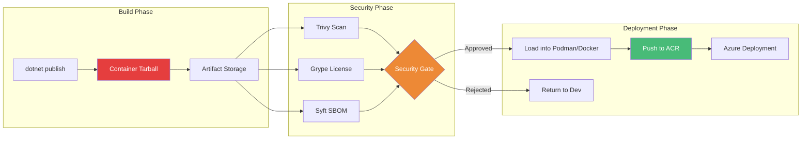
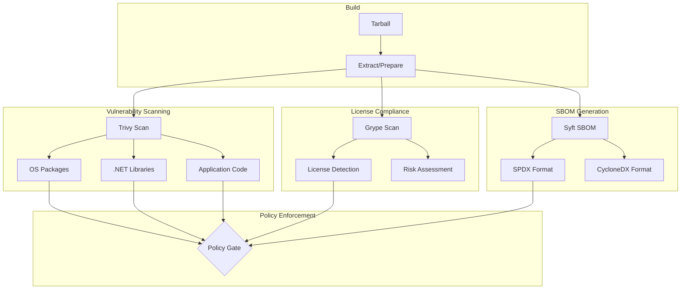
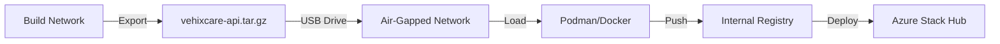

# Tarball Export + Runtime Load: Security-First CI/CD Workflows

## Building Secure Container Pipelines with Air-Gapped Deployments

### Introduction: The Security Imperative

In the [previous installment](#) of this series, we explored Visual Studio 2026 GUI publishing—the most accessible path to containerized Azure deployments. While GUI tooling prioritizes developer productivity, many organizations face a different priority: **security**. In regulated industries like finance, healthcare, and government, container images cannot be pushed directly to registries without passing through rigorous security gates—vulnerability scanning, license compliance checks, and approval workflows.

This is where **tarball export** becomes indispensable. By decoupling image creation from image distribution, the .NET SDK's tarball export capability enables security-first CI/CD pipelines where images are built, scanned, approved, and only then loaded into production registries. For Vehixcare-API—our fleet management platform handling sensitive vehicle telemetry and driver behavior data—this security-first approach is not optional; it's mandatory.

This installment explores the complete security-first workflow: generating container tarballs without a container runtime, integrating with industry-standard scanners (Trivy, Grype, Syft), implementing approval gates, and deploying to air-gapped Azure environments. We'll demonstrate how tarball export transforms container delivery from a continuous push model to a controlled, auditable supply chain.



### Stories at a Glance

**Companion stories in this series:**

- 📚 **1. .NET SDK Native Container Publishing Deep Dive: The Complete Reference** – Comprehensive coverage of MSBuild properties, Native AOT optimization, CI/CD pipeline patterns, performance benchmarks, and troubleshooting guides

- 🚀 **2. .NET SDK Native Container Publishing: Building OCI Images Without Docker** – A deep dive into MSBuild configuration, multi-architecture builds, Native AOT optimization, and direct Azure Container Registry integration with workload identity federation

- 🐳 **3. Traditional Dockerfile with Docker: The Classic Approach** – Mastering multi-stage builds, build cache optimization, .dockerignore patterns, and Azure Container Registry authentication for enterprise CI/CD pipelines

- 🔐 **4. Traditional Dockerfile with Podman: The Daemonless Alternative** – Transitioning from Docker to Podman, rootless containers for enhanced security, podman-compose workflows, and Azure ACR integration with Podman Desktop

- ⚡ **5. Azure Developer CLI (azd) with .NET Aspire: The Turnkey Solution** – Full-stack deployments with `azd up`, Azure Container Apps provisioning, Redis caching, and infrastructure-as-code with Bicep templates

- 🖱️ **6. Visual Studio 2026 GUI Publishing: Drag-and-Drop Azure Deployments** – Leveraging Visual Studio's built-in Podman/Docker support, one-click publish to Azure Container Registry, and debugging containerized apps with Hot Reload

- 🔒 **7. Tarball Export + Runtime Load: Security-First CI/CD Workflows** – Generating container tarballs without a runtime, integrating with Trivy/Grype for vulnerability scanning, and deploying to air-gapped Azure environments *(This story)*

- 🔄 **8. Podman with .NET SDK Native Publishing: Hybrid Workflows** – Combining SDK-native builds with Podman for local testing, multi-architecture emulation, and Azure Container Registry push strategies

- 🛠️ **9. konet: Multi-Platform Container Builds Without Docker** – Using the konet .NET tool for cross-platform image generation, ARM64/AMD64 simultaneous builds, and GitHub Actions optimization

---

## Understanding Tarball Export

### What Is a Container Tarball?

A container tarball is a portable archive containing a complete OCI (Open Container Initiative) image. Unlike Docker images stored in a local daemon, tarballs are **self-contained files** that can be:

- Stored in artifact repositories
- Transferred across air-gapped networks
- Scanned by security tools
- Signed for supply chain integrity
- Loaded into any OCI-compliant runtime

### Tarball Structure

```bash
# Extract and examine a container tarball
tar -xzf vehixcare-api.tar.gz
tree vehixcare-api/

vehixcare-api/
├── blobs/
│   └── sha256/
│       ├── a1b2c3d4e5f6...  # Base OS layer
│       ├── b2c3d4e5f6g7...  # .NET runtime layer
│       ├── c3d4e5f6g7h8...  # Application layer
│       └── d4e5f6g7h8i9...  # Image configuration
├── index.json               # Image index (points to manifest)
└── oci-layout               # Version marker
```

### Why Tarball Export Matters for Security

| Security Requirement | Direct Push | Tarball Export |
|---------------------|-------------|----------------|
| **Vulnerability Scanning** | After push (remediation harder) | Before push (block at source) |
| **License Compliance** | After push | Before push |
| **SBOM Generation** | Optional | Mandatory in workflow |
| **Image Signing** | Possible | Enforced before loading |
| **Air-Gapped Deployments** | Impossible | Native support |
| **Approval Workflows** | Complex | Built-in |

## Generating Container Tarballs

### Basic Tarball Export

```bash
# Generate tarball without pushing to registry
dotnet publish Vehixcare.API/Vehixcare.API.csproj \
    --os linux \
    --arch x64 \
    -c Release \
    /t:PublishContainer \
    -p ContainerArchiveOutputPath=./output/vehixcare-api.tar.gz
```

### Compressed vs. Uncompressed Tarballs

```bash
# Uncompressed OCI layout directory
dotnet publish /t:PublishContainer \
    -p ContainerArchiveOutputPath=./output/vehixcare-api-oci

# Compressed tarball (recommended for storage)
dotnet publish /t:PublishContainer \
    -p ContainerArchiveOutputPath=./output/vehixcare-api.tar.gz
```

### Multi-Architecture Tarball Export

```bash
# Export both architectures to same tarball
dotnet publish /t:PublishContainer \
    --arch x64 \
    -p ContainerArchiveOutputPath=./output/vehixcare-api-amd64.tar.gz

dotnet publish /t:PublishContainer \
    --arch arm64 \
    -p ContainerArchiveOutputPath=./output/vehixcare-api-arm64.tar.gz

# Create multi-arch manifest tarball (requires container runtime)
docker manifest create vehixcare-api:latest \
    vehixcare-api-amd64:latest \
    vehixcare-api-arm64:latest

docker manifest push vehixcare-api:latest
docker save vehixcare-api:latest -o vehixcare-api-multiarch.tar
```

## Security Scanning Workflow

### Comprehensive Scanning Pipeline



### Step 1: Vulnerability Scanning with Trivy

Trivy (from Aqua Security) scans container images for vulnerabilities:

```bash
# Install Trivy
# macOS
brew install trivy

# Ubuntu/Debian
sudo apt install trivy

# Windows (Chocolatey)
choco install trivy

# Scan tarball directly
trivy image --input ./output/vehixcare-api.tar.gz \
    --severity HIGH,CRITICAL \
    --format table \
    --exit-code 1 \
    --ignore-unfixed \
    --vuln-type os,library \
    --scanners vuln,secret,config
```

**Sample Output:**
```
vehixcare-api.tar.gz (debian 12.0)
===================================
Total: 42 vulnerabilities (UNKNOWN: 0, LOW: 15, MEDIUM: 18, HIGH: 7, CRITICAL: 2)

┌───────────────┬────────────────┬──────────┬───────────────────┬───────────────┐
│    Library    │ Vulnerability  │ Severity │  Installed Version│ Fixed Version │
├───────────────┼────────────────┼──────────┼───────────────────┼───────────────┤
│ libc6         │ CVE-2023-4911  │ HIGH     │ 2.36-9+deb12u1    │ 2.36-9+deb12u2│
│ openssl       │ CVE-2023-5363  │ CRITICAL │ 3.0.11-1~deb12u1  │ 3.0.11-1~deb12u2│
│ System.Text.Json│ CVE-2024-30136│ HIGH    │ 9.0.0              │ 9.0.1         │
└───────────────┴────────────────┴──────────┴───────────────────┴───────────────┘
```

**Advanced Trivy Configuration:**

```bash
# Scan with custom policies
trivy image --input ./output/vehixcare-api.tar.gz \
    --severity HIGH,CRITICAL \
    --security-checks vuln,secret \
    --ignore-policy ./policies/ignore.rego \
    --report summary \
    --format sarif \
    --output trivy-results.sarif
```

### Step 2: License Compliance with Grype

Grype (from Anchore) identifies software licenses and compliance issues:

```bash
# Install Grype
# macOS
brew install grype

# Ubuntu/Debian
curl -sSfL https://raw.githubusercontent.com/anchore/grype/main/install.sh | sh -s -- -b /usr/local/bin

# Scan tarball
grype ./output/vehixcare-api.tar.gz \
    --fail-on high \
    --output table \
    --only-fixed \
    --scope all-layers
```

**Sample Output:**
```
NAME          INSTALLED   LICENSES      VULNERABILITIES
MongoDB.Driver 2.25.0     Apache-2.0    (2 medium, 1 high)
System.Text.Json 9.0.0    MIT           (none)
Serilog       4.0.0       Apache-2.0    (none)
AutoMapper    13.0.0      MIT           (none)

License Summary:
- Apache-2.0: 15 packages (allowed)
- MIT: 8 packages (allowed)
- GPL-3.0: 1 package (RESTRICTED - requires review)
```

**License Policy Configuration:**

```yaml
# grype-policy.yaml
allow:
  - Apache-2.0
  - MIT
  - BSD-2-Clause
  - BSD-3-Clause

deny:
  - GPL-3.0
  - AGPL-3.0
  - MPL-2.0

# Block if any denied license found
block-on: deny
```

```bash
# Apply license policy
grype ./output/vehixcare-api.tar.gz \
    --fail-on high \
    --policy grype-policy.yaml
```

### Step 3: SBOM Generation with Syft

Syft generates Software Bill of Materials (SBOM) in industry-standard formats:

```bash
# Install Syft
# macOS
brew install syft

# Ubuntu/Debian
curl -sSfL https://raw.githubusercontent.com/anchore/syft/main/install.sh | sh -s -- -b /usr/local/bin

# Generate SPDX SBOM
syft ./output/vehixcare-api.tar.gz \
    -o spdx-json \
    > ./output/sbom-vehixcare.spdx.json

# Generate CycloneDX SBOM
syft ./output/vehixcare-api.tar.gz \
    -o cyclonedx-json \
    > ./output/sbom-vehixcare.cyclonedx.json

# Generate table format (human-readable)
syft ./output/vehixcare-api.tar.gz \
    -o table
```

**Sample SBOM (SPDX):**

```json
{
  "SPDXID": "SPDXRef-DOCUMENT",
  "name": "vehixcare-api-sbom",
  "creationInfo": {
    "created": "2024-01-15T10:30:00Z",
    "creators": [
      "Tool: syft-1.0.0"
    ]
  },
  "packages": [
    {
      "SPDXID": "SPDXRef-Package-MongoDB.Driver",
      "name": "MongoDB.Driver",
      "versionInfo": "2.25.0",
      "licenseDeclared": "Apache-2.0",
      "downloadLocation": "https://www.nuget.org/packages/MongoDB.Driver/2.25.0",
      "externalRefs": [
        {
          "referenceCategory": "PACKAGE-MANAGER",
          "referenceType": "purl",
          "referenceLocator": "pkg:nuget/MongoDB.Driver@2.25.0"
        }
      ]
    }
  ]
}
```

### Step 4: Image Signing with Cosign

Cosign (from Sigstore) signs container images for supply chain integrity:

```bash
# Install Cosign
# macOS
brew install cosign

# Linux
curl -sSL https://github.com/sigstore/cosign/releases/latest/download/cosign-linux-amd64 -o /usr/local/bin/cosign
chmod +x /usr/local/bin/cosign

# Generate key pair
cosign generate-key-pair

# Sign tarball (after loading to registry)
podman load -i ./output/vehixcare-api.tar.gz
podman push vehixcare-api:latest vehixcare.azurecr.io/vehixcare-api:latest

cosign sign --key cosign.key vehixcare.azurecr.io/vehixcare-api:latest

# Verify signature
cosign verify --key cosign.pub vehixcare.azurecr.io/vehixcare-api:latest

# Attach SBOM as OCI artifact
cosign attach sbom --sbom ./output/sbom-vehixcare.spdx.json \
    vehixcare.azurecr.io/vehixcare-api:latest
```

## Complete CI/CD Pipeline Implementation

### GitHub Actions Security-First Pipeline

```yaml
# .github/workflows/secure-build-deploy.yml
name: Secure Build and Deploy

on:
  push:
    branches: [main, develop]
  pull_request:
    branches: [main]

env:
  DOTNET_VERSION: '10.0.x'
  IMAGE_NAME: 'vehixcare-api'
  SECURITY_SEVERITY_THRESHOLD: 'HIGH'

jobs:
  secure-build:
    runs-on: ubuntu-latest
    permissions:
      contents: read
      packages: write
      id-token: write
    
    steps:
    - name: Checkout code
      uses: actions/checkout@v4
      with:
        fetch-depth: 0

    - name: Setup .NET
      uses: actions/setup-dotnet@v4
      with:
        dotnet-version: ${{ env.DOTNET_VERSION }}

    - name: Install security tools
      run: |
        # Install Trivy
        wget https://github.com/aquasecurity/trivy/releases/download/v0.48.0/trivy_0.48.0_Linux-64bit.deb
        sudo dpkg -i trivy_0.48.0_Linux-64bit.deb
        
        # Install Grype
        curl -sSfL https://raw.githubusercontent.com/anchore/grype/main/install.sh | sh -s -- -b /usr/local/bin
        
        # Install Syft
        curl -sSfL https://raw.githubusercontent.com/anchore/syft/main/install.sh | sh -s -- -b /usr/local/bin

    - name: Build container tarball
      run: |
        dotnet publish Vehixcare.API/Vehixcare.API.csproj \
          --os linux \
          --arch x64 \
          -c Release \
          /t:PublishContainer \
          -p ContainerArchiveOutputPath=./output/${{ env.IMAGE_NAME }}.tar.gz \
          -p ContainerImageTag=${{ github.sha }}

    - name: Run Trivy vulnerability scan
      id: trivy
      continue-on-error: true
      run: |
        trivy image --input ./output/${{ env.IMAGE_NAME }}.tar.gz \
          --severity ${{ env.SECURITY_SEVERITY_THRESHOLD }},CRITICAL \
          --format sarif \
          --output trivy-results.sarif \
          --exit-code 1 \
          --ignore-unfixed
        
        # Capture exit code for gate
        echo "status=$?" >> $GITHUB_OUTPUT

    - name: Upload Trivy results
      uses: github/codeql-action/upload-sarif@v3
      with:
        sarif_file: trivy-results.sarif

    - name: Run Grype license scan
      id: grype
      continue-on-error: true
      run: |
        grype ./output/${{ env.IMAGE_NAME }}.tar.gz \
          --fail-on high \
          --output json \
          > grype-results.json
        
        # Check if any denied licenses found
        DENIED_COUNT=$(jq '.matches[] | select(.artifact.licenses[] | .value == "GPL-3.0" or .value == "AGPL-3.0")' grype-results.json | wc -l)
        if [ $DENIED_COUNT -gt 0 ]; then
          echo "status=failed" >> $GITHUB_OUTPUT
          exit 1
        else
          echo "status=passed" >> $GITHUB_OUTPUT
        fi

    - name: Generate SBOM
      run: |
        syft ./output/${{ env.IMAGE_NAME }}.tar.gz \
          -o spdx-json \
          > ./output/sbom.spdx.json

    - name: Upload SBOM
      uses: actions/upload-artifact@v4
      with:
        name: sbom
        path: ./output/sbom.spdx.json

    - name: Security Gate
      if: steps.trivy.outputs.status != '0' || steps.grype.outputs.status != 'passed'
      run: |
        echo "❌ Security gate failed!"
        echo "Trivy status: ${{ steps.trivy.outputs.status }}"
        echo "Grype status: ${{ steps.grype.outputs.status }}"
        exit 1

    - name: Upload approved tarball
      if: success()
      uses: actions/upload-artifact@v4
      with:
        name: approved-image
        path: ./output/${{ env.IMAGE_NAME }}.tar.gz
        retention-days: 7

  deploy:
    needs: secure-build
    if: github.ref == 'refs/heads/main' && success()
    runs-on: ubuntu-latest
    environment: production
    
    steps:
    - name: Download approved tarball
      uses: actions/download-artifact@v4
      with:
        name: approved-image
        path: ./output/

    - name: Install Podman
      run: |
        sudo apt update
        sudo apt install -y podman

    - name: Login to Azure
      uses: azure/login@v1
      with:
        client-id: ${{ secrets.AZURE_CLIENT_ID }}
        tenant-id: ${{ secrets.AZURE_TENANT_ID }}
        subscription-id: ${{ secrets.AZURE_SUBSCRIPTION_ID }}

    - name: Load and push to ACR
      run: |
        # Login to ACR
        az acr login --name vehixcare
        
        # Load tarball into Podman
        podman load -i ./output/vehixcare-api.tar.gz
        
        # Tag and push
        podman tag localhost/vehixcare-api:latest vehixcare.azurecr.io/vehixcare-api:${{ github.sha }}
        podman push vehixcare.azurecr.io/vehixcare-api:${{ github.sha }}

    - name: Deploy to Azure Container Apps
      run: |
        az containerapp update \
          --name vehixcare-api \
          --resource-group vehixcare-rg \
          --image vehixcare.azurecr.io/vehixcare-api:${{ github.sha }} \
          --revision-suffix ${{ github.sha }}
```

### Azure DevOps Security Pipeline

```yaml
# azure-pipelines.yml
trigger:
- main
- develop

variables:
  - group: vehixcare-security
  - name: dotnetVersion
    value: '10.0.x'
  - name: imageName
    value: 'vehixcare-api'

stages:
- stage: SecureBuild
  displayName: 'Secure Build and Scan'
  jobs:
  - job: BuildAndScan
    pool:
      vmImage: 'ubuntu-latest'
    steps:
    - task: UseDotNet@2
      inputs:
        version: '$(dotnetVersion)'
    
    - script: |
        # Install security tools
        wget https://github.com/aquasecurity/trivy/releases/download/v0.48.0/trivy_0.48.0_Linux-64bit.deb
        sudo dpkg -i trivy_0.48.0_Linux-64bit.deb
        curl -sSfL https://raw.githubusercontent.com/anchore/grype/main/install.sh | sh -s -- -b /usr/local/bin
        curl -sSfL https://raw.githubusercontent.com/anchore/syft/main/install.sh | sh -s -- -b /usr/local/bin
      displayName: 'Install security tools'
    
    - task: DotNetCoreCLI@2
      displayName: 'Build container tarball'
      inputs:
        command: 'publish'
        projects: 'Vehixcare.API/Vehixcare.API.csproj'
        arguments: '--os linux --arch x64 -c Release /t:PublishContainer
          -p ContainerArchiveOutputPath=$(Build.ArtifactStagingDirectory)/$(imageName).tar.gz
          -p ContainerImageTag=$(Build.BuildId)'
    
    - script: |
        trivy image --input $(Build.ArtifactStagingDirectory)/$(imageName).tar.gz \
          --severity HIGH,CRITICAL \
          --format sarif \
          --output $(Build.ArtifactStagingDirectory)/trivy-results.sarif \
          --exit-code 1
      displayName: 'Trivy vulnerability scan'
    
    - script: |
        grype $(Build.ArtifactStagingDirectory)/$(imageName).tar.gz \
          --fail-on high \
          --output json \
          > $(Build.ArtifactStagingDirectory)/grype-results.json
      displayName: 'Grype license scan'
    
    - script: |
        syft $(Build.ArtifactStagingDirectory)/$(imageName).tar.gz \
          -o spdx-json \
          > $(Build.ArtifactStagingDirectory)/sbom.spdx.json
      displayName: 'Generate SBOM'
    
    - task: PublishBuildArtifacts@1
      displayName: 'Publish approved artifacts'
      inputs:
        PathtoPublish: '$(Build.ArtifactStagingDirectory)'
        ArtifactName: 'approved-image'

- stage: Deploy
  displayName: 'Deploy to Azure'
  dependsOn: SecureBuild
  condition: and(succeeded(), eq(variables['Build.SourceBranch'], 'refs/heads/main'))
  jobs:
  - deployment: DeployToACA
    environment: 'production'
    strategy:
      runOnce:
        deploy:
          steps:
          - task: DownloadBuildArtifacts@0
            inputs:
              artifactName: 'approved-image'
              downloadPath: '$(System.ArtifactsDirectory)'
          
          - script: |
              sudo apt update
              sudo apt install -y podman
            displayName: 'Install Podman'
          
          - task: AzureCLI@2
            displayName: 'Login to ACR'
            inputs:
              azureSubscription: 'vehixcare-service-connection'
              scriptType: 'bash'
              scriptLocation: 'inlineScript'
              inlineScript: |
                az acr login --name vehixcare
          
          - script: |
              podman load -i $(System.ArtifactsDirectory)/approved-image/vehixcare-api.tar.gz
              podman tag localhost/vehixcare-api:latest vehixcare.azurecr.io/vehixcare-api:$(Build.BuildId)
              podman push vehixcare.azurecr.io/vehixcare-api:$(Build.BuildId)
            displayName: 'Load and push image'
          
          - task: AzureCLI@2
            displayName: 'Deploy to Container Apps'
            inputs:
              azureSubscription: 'vehixcare-service-connection'
              scriptType: 'bash'
              scriptLocation: 'inlineScript'
              inlineScript: |
                az containerapp update \
                  --name vehixcare-api \
                  --resource-group vehixcare-rg \
                  --image vehixcare.azurecr.io/vehixcare-api:$(Build.BuildId) \
                  --revision-suffix $(Build.BuildId)
```

## Air-Gapped Deployments

### Transferring Tarballs Across Air-Gapped Networks

For organizations with disconnected environments, tarballs can be transferred via:



### Deploying to Azure Stack Hub (Air-Gapped)

Azure Stack Hub supports air-gapped container deployments:

```bash
# On air-gapped network (no internet)
# 1. Transfer tarball via secure media
# 2. Load image
podman load -i /media/vehixcare-api.tar.gz

# 3. Push to internal registry (Azure Stack Hub)
podman tag vehixcare-api:latest azurestack.contoso.com/vehixcare-api:latest
podman push azurestack.contoso.com/vehixcare-api:latest

# 4. Deploy to Azure Stack Hub
az stack containerapp update \
  --name vehixcare-api \
  --resource-group vehixcare-rg \
  --image azurestack.contoso.com/vehixcare-api:latest
```

## Compliance Frameworks

### NIST SP 800-190 Compliance

NIST SP 800-190 (Container Security) requires:

| Requirement | Implementation |
|-------------|----------------|
| **Image Scanning** | Trivy scan before deployment |
| **SBOM Generation** | Syft SPDX generation |
| **Vulnerability Management** | Block HIGH/CRITICAL vulnerabilities |
| **Image Signing** | Cosign signature verification |
| **Least Privilege** | Non-root user in container |

### PCI DSS Compliance

For Vehixcare handling payment data (lease payments):

```bash
# PCI DSS Requirement 6.2: Critical patches
trivy image --input vehixcare-api.tar.gz \
    --severity CRITICAL \
    --ignore-unfixed=false \
    --exit-code 1

# PCI DSS Requirement 6.5: Secure coding
# Run SAST tools before container build
# (OWASP Dependency Check, etc.)

# PCI DSS Requirement 10.5: Log security events
# Ensure container logs are captured
```

## Troubleshooting Security Pipelines

### Issue 1: Trivy False Positives

**Problem:** Vulnerability reported but not applicable to .NET application.

**Solution:** Create ignore file:
```yaml
# .trivyignore
# CVE-2024-12345 - This CVE affects Java libraries, not .NET
CVE-2024-12345
# CVE-2024-67890 - Patched in next release, not exploitable
CVE-2024-67890
```

```bash
trivy image --input vehixcare-api.tar.gz \
    --ignorefile .trivyignore \
    --severity HIGH,CRITICAL
```

### Issue 2: Large Tarball Sizes

**Problem:** Tarball exceeds artifact storage limits.

**Solution:** Optimize with trimming and compression:
```xml
<PropertyGroup>
  <PublishTrimmed>true</PublishTrimmed>
  <PublishSingleFile>true</PublishSingleFile>
  <EnableCompressionInSingleFile>true</EnableCompressionInSingleFile>
</PropertyGroup>
```

### Issue 3: SBOM Not Generating

**Problem:** Syft fails to parse tarball.

**Solution:** Ensure tarball is valid OCI layout:
```bash
# Validate tarball
tar -tzf vehixcare-api.tar.gz | head -10
# Should show blobs/ and index.json

# If corrupted, regenerate
dotnet publish /t:PublishContainer \
    -p ContainerArchiveOutputPath=./output/vehixcare-api.tar.gz
```

## Performance Metrics

| Step | Time | Notes |
|------|------|-------|
| **dotnet publish (tarball)** | 45-60s | No container runtime |
| **Trivy Scan** | 30-45s | Cached base layers |
| **Grype Scan** | 20-30s | License analysis |
| **Syft SBOM** | 10-15s | Generation |
| **Tarball Transfer** | Variable | Network/air-gap dependent |
| **Load + Push** | 15-20s | Runtime required |

## Conclusion: Security as Code

Tarball export transforms container delivery from an uncontrolled push model to a controlled, auditable supply chain. For Vehixcare-API, this security-first approach ensures:

- **No vulnerable images reach production** – Blocked at the gate
- **Complete supply chain visibility** – SBOMs for every image
- **License compliance** – Automated detection of restricted licenses
- **Air-gapped support** – Deploy to disconnected environments
- **Audit trail** – Every image is scanned, signed, and approved

While direct registry pushes offer convenience, security-first organizations require the control and visibility that tarball export provides. By integrating Trivy, Grype, Syft, and Cosign into your CI/CD pipeline, you can achieve the same level of security automation that major cloud providers use for their own supply chains.

---

### Stories at a Glance

**Companion stories in this series:**

- 📚 **1. .NET SDK Native Container Publishing Deep Dive: The Complete Reference** – Comprehensive coverage of MSBuild properties, Native AOT optimization, CI/CD pipeline patterns, performance benchmarks, and troubleshooting guides

- 🚀 **2. .NET SDK Native Container Publishing: Building OCI Images Without Docker** – A deep dive into MSBuild configuration, multi-architecture builds, Native AOT optimization, and direct Azure Container Registry integration with workload identity federation

- 🐳 **3. Traditional Dockerfile with Docker: The Classic Approach** – Mastering multi-stage builds, build cache optimization, .dockerignore patterns, and Azure Container Registry authentication for enterprise CI/CD pipelines

- 🔐 **4. Traditional Dockerfile with Podman: The Daemonless Alternative** – Transitioning from Docker to Podman, rootless containers for enhanced security, podman-compose workflows, and Azure ACR integration with Podman Desktop

- ⚡ **5. Azure Developer CLI (azd) with .NET Aspire: The Turnkey Solution** – Full-stack deployments with `azd up`, Azure Container Apps provisioning, Redis caching, and infrastructure-as-code with Bicep templates

- 🖱️ **6. Visual Studio 2026 GUI Publishing: Drag-and-Drop Azure Deployments** – Leveraging Visual Studio's built-in Podman/Docker support, one-click publish to Azure Container Registry, and debugging containerized apps with Hot Reload

- 🔒 **7. Tarball Export + Runtime Load: Security-First CI/CD Workflows** – Generating container tarballs without a runtime, integrating with Trivy/Grype for vulnerability scanning, and deploying to air-gapped Azure environments *(This story)*

- 🔄 **8. Podman with .NET SDK Native Publishing: Hybrid Workflows** – Combining SDK-native builds with Podman for local testing, multi-architecture emulation, and Azure Container Registry push strategies

- 🛠️ **9. konet: Multi-Platform Container Builds Without Docker** – Using the konet .NET tool for cross-platform image generation, ARM64/AMD64 simultaneous builds, and GitHub Actions optimization

---

**Coming next in the series:**
**🔄 Podman with .NET SDK Native Publishing: Hybrid Workflows** – Combining SDK-native builds with Podman for local testing, multi-architecture emulation, and Azure Container Registry push strategies