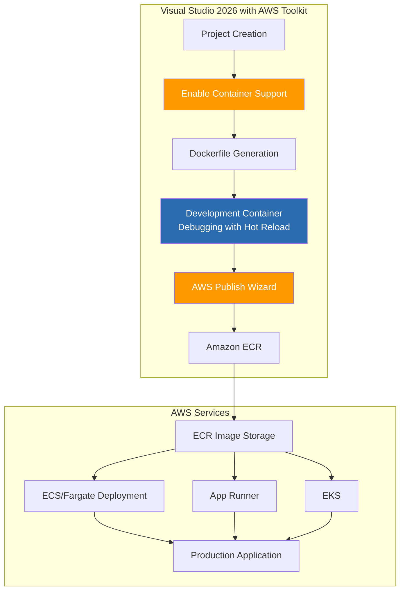
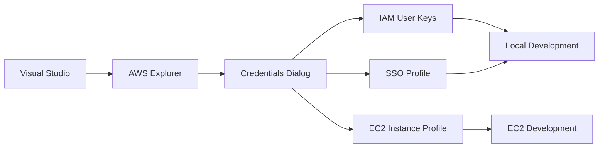
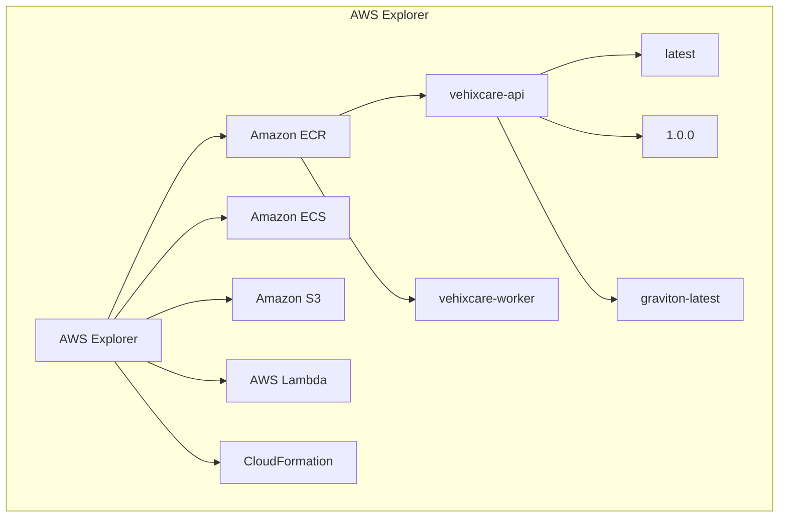
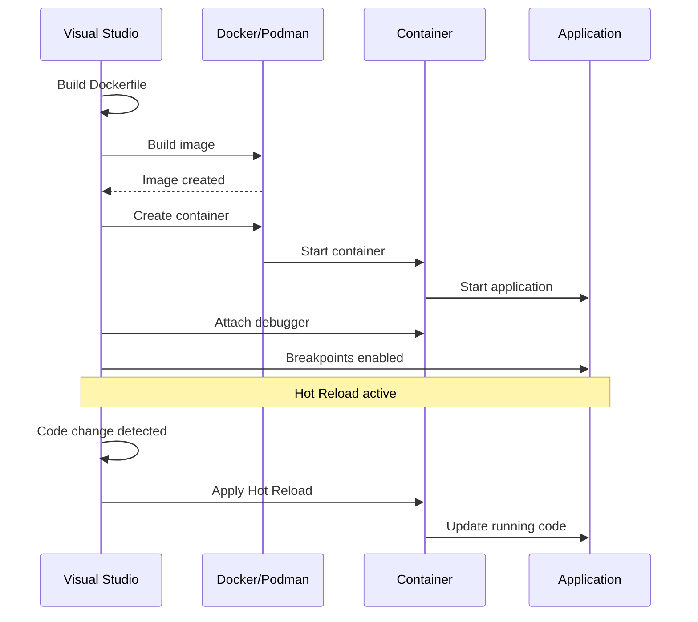
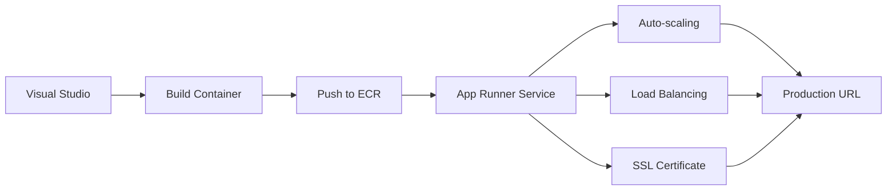
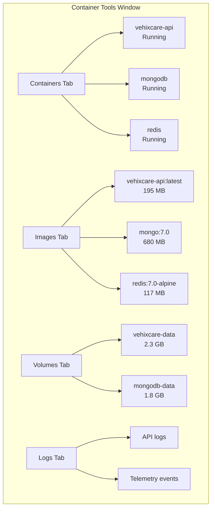

# Visual Studio 2026 GUI Publishing: Drag-and-Drop AWS Deployments - AWS

## Integrated Development Environment to Amazon Web Services in Clicks

### Introduction: The Power of Visual Tooling on AWS

In the [previous installment](#) of this AWS series, we explored AWS CDK and Copilot—powerful infrastructure-as-code tools that bring the .NET programming model to cloud deployments. While these tools offer automation and repeatability, many developers prefer a different experience: **visual, interactive, and integrated directly into their development environment**.

**Visual Studio 2026** with the AWS Toolkit represents the culmination of Microsoft and Amazon's investment in developer productivity, offering the most comprehensive GUI-based container deployment experience for AWS available. For Vehixcare-API—our fleet management platform with 10+ projects, MongoDB integration, and SignalR hubs—Visual Studio transforms container deployment from a command-line exercise into an intuitive, point-and-click workflow that even developers new to AWS can master.

This installment explores Visual Studio's built-in AWS tooling, from Dockerfile generation to one-click Amazon ECR publishing, integrated debugging with Hot Reload inside containers, and seamless AWS credential management. We'll demonstrate how Visual Studio 2026 makes container development on AWS accessible to developers of all skill levels while maintaining the depth required for production deployments.



### Stories at a Glance

**Complete AWS series (10 stories):**

- 📚 **1. .NET SDK Native Container Publishing Deep Dive: The Complete Reference - AWS** – Comprehensive coverage of MSBuild properties, Native AOT optimization, CI/CD pipeline patterns, performance benchmarks, and troubleshooting guides for Amazon ECR

- 🚀 **2. .NET SDK Native Container Publishing: Building OCI Images Without Docker - AWS** – A deep dive into MSBuild configuration, multi-architecture builds (Graviton ARM64), and direct Amazon ECR integration with IAM roles

- 🐳 **3. Traditional Dockerfile with Docker: The Classic Approach - AWS** – Mastering multi-stage builds, build cache optimization, and Amazon ECR authentication for enterprise CI/CD pipelines on AWS

- 🔐 **4. Traditional Dockerfile with Podman: The Daemonless Alternative - AWS** – Transitioning from Docker to Podman, rootless containers for enhanced security, and Amazon ECR integration with Podman Desktop

- 🏗️ **5. AWS CDK & Copilot: Infrastructure as Code for Containers - AWS** – Deploying to Amazon ECS with AWS Copilot, infrastructure-as-code with CDK, and Fargate serverless container orchestration

- 🖱️ **6. Visual Studio 2026 GUI Publishing: Drag-and-Drop AWS Deployments - AWS** – Leveraging Visual Studio's AWS Toolkit, one-click publish to Amazon ECR, and debugging containerized apps on AWS *(This story)*

- 🔒 **7. Tarball Export + Runtime Load: Security-First CI/CD Workflows - AWS** – Generating container tarballs without a runtime, integrating with Amazon Inspector for vulnerability scanning, and deploying to air-gapped AWS environments

- 🔄 **8. Podman with .NET SDK Native Publishing: Hybrid Workflows - AWS** – Combining SDK-native builds with Podman for local testing, multi-architecture emulation (x64 to Graviton), and Amazon ECR push strategies

- 🛠️ **9. konet: Multi-Platform Container Builds Without Docker - AWS** – Using the konet .NET tool for cross-platform image generation, AMD64/ARM64 (Graviton) simultaneous builds, and AWS CodeBuild optimization

- ☸️ **10. Kubernetes Native Deployments: Orchestrating .NET 10 Containers on Amazon EKS - AWS** – Deploying to Amazon EKS, Helm charts, GitOps with Flux, ALB Ingress Controller, and production-grade operations

---

## AWS Toolkit for Visual Studio

The AWS Toolkit for Visual Studio is a free, open-source extension that integrates AWS services directly into the Visual Studio IDE, providing a seamless experience for .NET developers targeting AWS.

### Key Features

| Feature | Description | Benefit |
|---------|-------------|---------|
| **AWS Explorer** | Visual management of AWS resources | Browse S3, ECR, EC2, Lambda from IDE |
| **Credential Management** | Store and manage AWS credentials | Secure, multi-profile support |
| **Container Publishing** | One-click publish to Amazon ECR | Zero CLI commands |
| **ECS Deployment** | Deploy containers to ECS/Fargate | Visual task definition editor |
| **Lambda Integration** | Publish and debug Lambda functions | Local testing with AWS emulation |
| **CloudFormation Support** | Visual CloudFormation editor | YAML/JSON with intellisense |
| **EC2 Instance Management** | Start/stop/connect to EC2 | SSH from Visual Studio |

### Installing the AWS Toolkit

1. **Open Visual Studio 2026**
2. **Extensions → Manage Extensions**
3. **Search for "AWS Toolkit"**
4. **Click Download and Install**
5. **Restart Visual Studio**

Or download directly from the [AWS Toolkit Marketplace](https://marketplace.visualstudio.com/items?itemName=AmazonWebServices.AWSToolkitforVisualStudio2026).

### Configuring AWS Credentials



**Step-by-Step Credential Setup:**

1. **View → AWS Explorer**
2. **Right-click "Credentials" → "Add Profile"**
3. **Enter AWS Access Key ID and Secret Access Key**
4. **Select Default Region (us-east-1)**
5. **Click "Save"**

**IAM User Policy Required:**
```json
{
  "Version": "2012-10-17",
  "Statement": [
    {
      "Effect": "Allow",
      "Action": [
        "ecr:*",
        "ecs:*",
        "iam:PassRole",
        "cloudformation:*"
      ],
      "Resource": "*"
    }
  ]
}
```

---

## Getting Started: Creating a Containerized Project for AWS

### Option 1: New Project with Container Support

When creating a new project in Visual Studio 2026:

1. **File → New → Project**
2. Select **ASP.NET Core Web API** (or any .NET template)
3. Configure project name: **Vehixcare.API**
4. In the **Additional Information** dialog:
   - Check **Enable container support**
   - Select **Linux** as target OS
   - Select **Amazon ECR** as target registry

**Generated Project Structure:**
```
Vehixcare.API/
├── Dockerfile                 # Generated Dockerfile for AWS
├── .dockerignore              # Excluded files
├── Properties/
│   └── launchSettings.json    # Container debug profiles
├── aws-ecr-config.json        # AWS ECR configuration
└── ... (existing files)
```

### Option 2: Add Container Support to Existing Vehixcare Project

For Vehixcare-API, which already exists:

1. **Right-click the project** in Solution Explorer
2. Select **Add → Container Orchestrator Support...**
3. Choose **Docker Compose** or **AWS ECS Task Definition**
4. Select **Linux** container type

Visual Studio analyzes the project and generates:

- **Dockerfile** – Optimized for the project type and AWS
- **docker-compose.yml** – For multi-container scenarios
- **.dockerignore** – Excludes build artifacts
- **task-definition.json** – For ECS deployment

---

## The Generated Dockerfile: AWS-Optimized

Visual Studio generates a production-ready Dockerfile following best practices for AWS:

```dockerfile
# Vehixcare.API/Dockerfile
# Auto-generated by Visual Studio 2026 with AWS Toolkit

# Base runtime image
FROM mcr.microsoft.com/dotnet/aspnet:9.0 AS base
WORKDIR /app
EXPOSE 80
EXPOSE 443

# Build image with SDK
FROM mcr.microsoft.com/dotnet/sdk:9.0 AS build
WORKDIR /src

# Copy project files for dependency restoration
COPY ["Vehixcare.API/Vehixcare.API.csproj", "Vehixcare.API/"]
COPY ["Vehixcare.Business/Vehixcare.Business.csproj", "Vehixcare.Business/"]
COPY ["Vehixcare.Common/Vehixcare.Common.csproj", "Vehixcare.Common/"]
COPY ["Vehixcare.Data/Vehixcare.Data.csproj", "Vehixcare.Data/"]
COPY ["Vehixcare.Hubs/Vehixcare.Hubs.csproj", "Vehixcare.Hubs/"]
COPY ["Vehixcare.Models/Vehixcare.Models.csproj", "Vehixcare.Models/"]
COPY ["Vehixcare.Repository/Vehixcare.Repository.csproj", "Vehixcare.Repository/"]
COPY ["Vehixcare.BackgroundServices/Vehixcare.BackgroundServices.csproj", "Vehixcare.BackgroundServices/"]

# Restore dependencies
RUN dotnet restore "Vehixcare.API/Vehixcare.API.csproj"

# Copy source code
COPY . .

# Build application
WORKDIR "/src/Vehixcare.API"
RUN dotnet build "Vehixcare.API.csproj" -c Release -o /app/build

# Publish
FROM build AS publish
RUN dotnet publish "Vehixcare.API.csproj" -c Release -o /app/publish \
    /p:UseAppHost=false

# Final image
FROM base AS final
WORKDIR /app
COPY --from=publish /app/publish .

# AWS-specific environment variables
ENV ASPNETCORE_ENVIRONMENT=Production
ENV AWS_REGION=us-east-1

ENTRYPOINT ["dotnet", "Vehixcare.API.dll"]
```

---

## AWS Explorer: Visual Resource Management

The AWS Explorer window provides a visual interface to manage AWS resources directly from Visual Studio.

### Viewing Amazon ECR Repositories

1. **View → AWS Explorer**
2. **Expand "Amazon ECR"**
3. **View all repositories** including Vehixcare repositories
4. **Right-click to:**
   - Create new repository
   - Delete repository
   - View images
   - Copy repository URI



### Container Images View

When you expand an ECR repository, you see:
- **Image tags** with version information
- **Image size** and **push date**
- **Vulnerability scan status** (Amazon Inspector)
- **Pull command** (copy to clipboard)

---

## Container Debugging with Hot Reload

### F5 Experience with Containers on AWS

When you press **F5** in a container-enabled project:



### Container Debugging Configuration

Visual Studio creates a container-specific debug profile:

```json
// Properties/launchSettings.json
{
  "profiles": {
    "Vehixcare.API": {
      "commandName": "Project",
      "dotnetRunMessages": true,
      "launchBrowser": true,
      "applicationUrl": "https://localhost:7001;http://localhost:7000",
      "environmentVariables": {
        "ASPNETCORE_ENVIRONMENT": "Development",
        "AWS_REGION": "us-east-1"
      }
    },
    "Container (AWS)": {
      "commandName": "Docker",
      "launchBrowser": true,
      "launchUrl": "{Scheme}://{ServiceHost}:{ServicePort}/swagger",
      "environmentVariables": {
        "ASPNETCORE_ENVIRONMENT": "Development",
        "AWS_REGION": "us-east-1",
        "AWS_ACCESS_KEY_ID": "${AWS_ACCESS_KEY_ID}",
        "AWS_SECRET_ACCESS_KEY": "${AWS_SECRET_ACCESS_KEY}"
      },
      "httpPort": 7000,
      "sslPort": 7001,
      "useSSL": true
    }
  }
}
```

### Hot Reload Inside Containers

Visual Studio 2026 supports **Hot Reload** for containerized applications:

**Supported Modifications:**
- ✅ Method bodies (C# code)
- ✅ Razor components (Blazor)
- ✅ CSS/SCSS files
- ✅ JavaScript/TypeScript
- ✅ Configuration changes (appsettings.json)

**Unsupported Modifications (require rebuild):**
- ❌ Adding new classes
- ❌ Changing method signatures
- ❌ Adding/removing NuGet packages
- ❌ Modifying project file

**Using Hot Reload with AWS:**
1. Run application with **F5** (debugging inside container)
2. Make code changes
3. Click **Hot Reload** button or press **Alt+F10**
4. Changes applied instantly without container restart
5. Continue debugging with updated code

---

## Publishing to Amazon ECR

### Step-by-Step Publish Wizard

1. **Right-click project** → **Publish to AWS...**

```mermaid
graph TD
    A[Publish Wizard] --> B{Select Target}
    B --> C[Amazon ECR]
    B --> D[Amazon ECS]
    B --> E[AWS App Runner]
    
    C --> F{ECR Repository}
    F --> G[Create New]
    F --> H[Select Existing]
    
    G --> I[Configure Repository]
    I --> I1[Name: vehixcare-api]
    I --> I2[Scan on Push: Enabled]
    I --> I3[Encryption: AES-256]
    
    H --> J[Select vehixcare-api]
    
    J --> K[Configure Image]
    K --> K1[Tag: latest]
    K --> K2[Tag: 1.0.0]
    K --> K3[Tag: $(Version)]
    
    K --> L[Publish]
    L --> M[Image pushed to ECR]
```

### AWS Publish Wizard Options

**Step 1: Select AWS Account**

| Setting | Value |
|---------|-------|
| **Profile** | vehixcare-dev |
| **Region** | US East (N. Virginia) |

**Step 2: Configure ECR Repository**

| Setting | Value | Description |
|---------|-------|-------------|
| **Repository Name** | vehixcare-api | Must be unique within account |
| **Scan on Push** | ✅ Enabled | Amazon Inspector vulnerability scanning |
| **Encryption** | AES-256 | Server-side encryption |
| **Tag Immutability** | Disabled | Allow overwriting tags |

**Step 3: Image Configuration**

| Setting | Value |
|---------|-------|
| **Image Tag** | latest |
| **Image Tag** | 1.0.0 |
| **Image Tag** | $(Build.BuildNumber) |
| **Platform** | linux/amd64 |

**Step 4: Advanced Settings**

```xml
<!-- Publish profile settings stored in .pubxml -->
<PropertyGroup>
  <AWSProfileName>vehixcare-dev</AWSProfileName>
  <AWSRegion>us-east-1</AWSRegion>
  <ECRRepositoryName>vehixcare-api</ECRRepositoryName>
  <ContainerImageTags>latest;1.0.0;$(Version)</ContainerImageTags>
  <DockerfileContext>.</DockerfileContext>
  <ContainerOptimization>trim</ContainerOptimization>
  <PublishAot>false</PublishAot>
</PropertyGroup>
```

### Publishing Output

```
Publishing to Amazon ECR...
===========================================
Repository: vehixcare-api
Region: us-east-1
Tags: latest, 1.0.0, 20240315-123456

Building Docker image...
[========================================] 100%

Pushing to Amazon ECR...
[========================================] 100%

✅ Successfully published vehixcare-api:latest
✅ Successfully published vehixcare-api:1.0.0
✅ Successfully published vehixcare-api:20240315-123456

Repository URI: 123456789012.dkr.ecr.us-east-1.amazonaws.com/vehixcare-api

View in AWS Console: https://console.aws.amazon.com/ecr/repositories/vehixcare-api
```

---

## Deploying to Amazon ECS/Fargate

### ECS Task Definition Editor

After publishing to ECR, Visual Studio provides a visual editor for ECS task definitions:

1. **Right-click project** → **Publish to AWS** → **Amazon ECS**
2. **Create new ECS service** or **Update existing**

**Task Definition Editor:**

```json
{
  "family": "vehixcare-api",
  "taskRoleArn": "arn:aws:iam::123456789012:role/ecsTaskRole",
  "executionRoleArn": "arn:aws:iam::123456789012:role/ecsExecutionRole",
  "networkMode": "awsvpc",
  "requiresCompatibilities": ["FARGATE"],
  "cpu": "512",
  "memory": "1024",
  "runtimePlatform": {
    "operatingSystemFamily": "LINUX",
    "cpuArchitecture": "ARM64"
  },
  "containerDefinitions": [
    {
      "name": "api",
      "image": "123456789012.dkr.ecr.us-east-1.amazonaws.com/vehixcare-api:latest",
      "essential": true,
      "portMappings": [
        {
          "containerPort": 8080,
          "protocol": "tcp"
        }
      ],
      "environment": [
        {
          "name": "ASPNETCORE_ENVIRONMENT",
          "value": "Production"
        },
        {
          "name": "AWS_REGION",
          "value": "us-east-1"
        }
      ],
      "logConfiguration": {
        "logDriver": "awslogs",
        "options": {
          "awslogs-group": "/ecs/vehixcare-api",
          "awslogs-region": "us-east-1",
          "awslogs-stream-prefix": "ecs"
        }
      },
      "healthCheck": {
        "command": ["CMD-SHELL", "curl -f http://localhost:8080/health || exit 1"],
        "interval": 30,
        "timeout": 5,
        "retries": 3,
        "startPeriod": 60
      }
    }
  ]
}
```

### ECS Service Configuration

**Step 1: Cluster Selection**
- Create new cluster: **vehixcare-cluster**
- Select existing: **production-cluster**

**Step 2: Load Balancer Configuration**
- Application Load Balancer
- Create new or select existing
- Target group: **vehixcare-api-tg**
- Health check path: **/health**

**Step 3: Auto Scaling Configuration**
| Setting | Value |
|---------|-------|
| **Min Tasks** | 2 |
| **Max Tasks** | 10 |
| **CPU Threshold** | 70% |
| **Memory Threshold** | 80% |
| **Request Threshold** | 500 requests/second |

**Step 4: Deployment**
```
Deploying to Amazon ECS...
===========================================
Cluster: vehixcare-cluster
Service: vehixcare-api
Desired Count: 3
Load Balancer: vehixcare-alb

Creating service...
[========================================] 100%

Service created successfully!
Service URL: http://vehixcare-api-1234567890.us-east-1.elb.amazonaws.com
```

---

## AWS App Runner Integration

AWS App Runner is a fully managed container application service that requires no infrastructure management.

### Publishing to App Runner

1. **Right-click project** → **Publish to AWS** → **AWS App Runner**
2. **Configure service:**
   - Service name: **vehixcare-api**
   - Region: **us-east-1**
   - Auto-scaling: **Enabled**
   - Minimum instances: **1**
   - Maximum instances: **5**

3. **Configure connection:**
   - Source: **ECR image**
   - Image: **vehixcare-api:latest**
   - Port: **8080**

4. **Deploy**



---

## AWS CloudFormation Integration

### Visual CloudFormation Editor

Visual Studio provides a visual editor for AWS CloudFormation templates:

1. **Add new item** → **AWS CloudFormation Template**
2. **Visual designer** shows resource relationships
3. **Intellisense** for CloudFormation resources
4. **Validate** template syntax

```yaml
# cloudformation.yaml - Generated by Visual Studio
AWSTemplateFormatVersion: '2010-09-09'
Description: Vehixcare API Infrastructure

Resources:
  VehixcareECRRepository:
    Type: AWS::ECR::Repository
    Properties:
      RepositoryName: vehixcare-api
      ImageScanningConfiguration:
        ScanOnPush: true
      EncryptionConfiguration:
        EncryptionType: AES256

  VehixcareECSCluster:
    Type: AWS::ECS::Cluster
    Properties:
      ClusterName: vehixcare-cluster

  VehixcareTaskDefinition:
    Type: AWS::ECS::TaskDefinition
    Properties:
      Family: vehixcare-api
      RequiresCompatibilities:
        - FARGATE
      Cpu: '512'
      Memory: '1024'
      NetworkMode: awsvpc
      ContainerDefinitions:
        - Name: api
          Image: !Sub ${AWS::AccountId}.dkr.ecr.${AWS::Region}.amazonaws.com/vehixcare-api:latest
          PortMappings:
            - ContainerPort: 8080
```

### Deploy CloudFormation Stack

1. **Right-click template** → **Deploy to AWS CloudFormation**
2. **Select stack name**: **vehixcare-stack**
3. **Configure parameters**
4. **Deploy**

---

## Container Tools Window

Visual Studio provides a dedicated **Container Tools** window for managing containers:

**View → Other Windows → Container Tools**

This window shows:



**Features:**
- **Real-time logs** from running containers
- **Container metrics** (CPU, memory, network)
- **File system explorer** inside containers
- **Terminal access** to containers
- **Container operations** (start, stop, restart, remove)

---

## Multi-Container Applications with Docker Compose

For Vehixcare-API with MongoDB and Redis, Visual Studio manages the entire stack:

### Adding Docker Compose Support

1. **Right-click solution** → **Add → Container Orchestrator Support**
2. Select **Docker Compose**
3. Choose projects to include

**Generated docker-compose.yml:**

```yaml
# docker-compose.yml
version: '3.8'

services:
  vehixcare.api:
    image: ${DOCKER_REGISTRY-}vehixcareapi
    build:
      context: .
      dockerfile: Vehixcare.API/Dockerfile
    ports:
      - "8080:8080"
      - "8443:8443"
    environment:
      - ASPNETCORE_ENVIRONMENT=Development
      - AWS_REGION=us-east-1
      - MONGODB_CONNECTION_STRING=mongodb://mongodb:27017
      - REDIS_CONNECTION_STRING=redis:6379
    depends_on:
      - mongodb
      - redis

  mongodb:
    image: mongo:7.0
    ports:
      - "27017:27017"
    environment:
      - MONGO_INITDB_ROOT_USERNAME=admin
      - MONGO_INITDB_ROOT_PASSWORD=password
    volumes:
      - mongodb_data:/data/db

  redis:
    image: redis:7.0-alpine
    ports:
      - "6379:6379"
    volumes:
      - redis_data:/data

volumes:
  mongodb_data:
  redis_data:
```

### Running with Docker Compose

1. **Set docker-compose as startup project**
2. **Press F5** – All services start together
3. **Container Tools** window shows all running containers
4. **Output window** shows logs from all services

---

## AWS Lambda Container Support

Visual Studio can also publish containerized .NET applications to AWS Lambda:

### Lambda Container Configuration

1. **Right-click project** → **Publish to AWS Lambda**
2. **Select "Container image"** as deployment package
3. **Configure Lambda function:**
   - Function name: **vehixcare-telemetry-processor**
   - Memory: **1024 MB**
   - Timeout: **30 seconds**
   - Architecture: **arm64** (Graviton)

4. **Select ECR image** from published images
5. **Deploy**

```csharp
// Lambda function code in container
public class TelemetryProcessor
{
    public async Task<string> ProcessTelemetry(TelemetryEvent input)
    {
        // Process telemetry data
        var result = await _telemetryService.ProcessAsync(input);
        return result.ToString();
    }
}
```

---

## Troubleshooting Visual Studio AWS Integration

### Issue 1: AWS Credentials Not Found

**Error:** `No AWS credentials found in profile`

**Solution:**
1. **View → AWS Explorer**
2. **Right-click "Credentials" → "Add Profile"**
3. **Enter Access Key ID and Secret Access Key**
4. **Verify with "Test Connection"**

### Issue 2: Docker Not Running

**Error:** `Docker is not installed or not running`

**Solution:**
1. **Install Docker Desktop** or **Podman Desktop**
2. **Start Docker/Podman**
3. **Restart Visual Studio**
4. **Verify in Container Tools window**

### Issue 3: ECR Push Fails

**Error:** `unauthorized: authentication required`

**Solution:**
1. **Verify AWS credentials** in AWS Explorer
2. **Check IAM permissions** for ECR push
3. **Use "Publish to AWS" wizard** which handles authentication

### Issue 4: Hot Reload Not Working in Container

**Error:** `Hot Reload not supported in this container configuration`

**Solution:**
1. **Ensure project is configured for Hot Reload:**
   ```xml
   <PropertyGroup>
     <EnableHotReload>true</EnableHotReload>
   </PropertyGroup>
   ```
2. **Run with debugger (F5, not Ctrl+F5)**
3. **Check Output window for Hot Reload status**

---

## Performance Comparison: Visual Studio Workflows on AWS

| Workflow | Time to Deploy | Steps | Learning Curve |
|----------|---------------|-------|----------------|
| **Visual Studio AWS Toolkit** | 10-15 minutes | 5 clicks | Low |
| **AWS CLI Only** | 20-30 minutes | 15+ commands | High |
| **AWS Copilot** | 10-15 minutes | 3 commands | Medium |
| **AWS CDK** | 15-25 minutes | Code + commands | Medium-High |

---

## Conclusion: The Developer Experience Advantage

Visual Studio 2026 with AWS Toolkit represents the most accessible path to containerized AWS deployments for .NET developers. By abstracting the complexity of Dockerfile creation, container debugging, and Amazon ECR publishing, it enables:

- **Faster onboarding** – New developers can containerize applications without learning Docker syntax or AWS CLI
- **Integrated workflow** – Stay within IDE from code to cloud
- **Visual debugging** – Inspect container state, logs, and performance from familiar tools
- **Multi-runtime support** – Seamlessly switch between Docker and Podman
- **AWS service integration** – Visual management of ECR, ECS, Lambda, and CloudFormation

For Vehixcare-API, Visual Studio's AWS tooling reduces the time to first containerized deployment from hours to minutes, while maintaining the depth required for production scenarios. Whether you're a solo developer prototyping a new service or an enterprise team standardizing on AWS, Visual Studio 2026 provides the most developer-friendly containerization experience available on the platform.

---

### Stories at a Glance

**Complete AWS series (10 stories):**

- 📚 **1. .NET SDK Native Container Publishing Deep Dive: The Complete Reference - AWS** – Comprehensive coverage of MSBuild properties, Native AOT optimization, CI/CD pipeline patterns, performance benchmarks, and troubleshooting guides for Amazon ECR

- 🚀 **2. .NET SDK Native Container Publishing: Building OCI Images Without Docker - AWS** – A deep dive into MSBuild configuration, multi-architecture builds (Graviton ARM64), and direct Amazon ECR integration with IAM roles

- 🐳 **3. Traditional Dockerfile with Docker: The Classic Approach - AWS** – Mastering multi-stage builds, build cache optimization, and Amazon ECR authentication for enterprise CI/CD pipelines on AWS

- 🔐 **4. Traditional Dockerfile with Podman: The Daemonless Alternative - AWS** – Transitioning from Docker to Podman, rootless containers for enhanced security, and Amazon ECR integration with Podman Desktop

- 🏗️ **5. AWS CDK & Copilot: Infrastructure as Code for Containers - AWS** – Deploying to Amazon ECS with AWS Copilot, infrastructure-as-code with CDK, and Fargate serverless container orchestration

- 🖱️ **6. Visual Studio 2026 GUI Publishing: Drag-and-Drop AWS Deployments - AWS** – Leveraging Visual Studio's AWS Toolkit, one-click publish to Amazon ECR, and debugging containerized apps on AWS *(This story)*

- 🔒 **7. Tarball Export + Runtime Load: Security-First CI/CD Workflows - AWS** – Generating container tarballs without a runtime, integrating with Amazon Inspector for vulnerability scanning, and deploying to air-gapped AWS environments

- 🔄 **8. Podman with .NET SDK Native Publishing: Hybrid Workflows - AWS** – Combining SDK-native builds with Podman for local testing, multi-architecture emulation (x64 to Graviton), and Amazon ECR push strategies

- 🛠️ **9. konet: Multi-Platform Container Builds Without Docker - AWS** – Using the konet .NET tool for cross-platform image generation, AMD64/ARM64 (Graviton) simultaneous builds, and AWS CodeBuild optimization

- ☸️ **10. Kubernetes Native Deployments: Orchestrating .NET 10 Containers on Amazon EKS - AWS** – Deploying to Amazon EKS, Helm charts, GitOps with Flux, ALB Ingress Controller, and production-grade operations

---

## What's Next?

Over the coming weeks, each approach in this AWS series will be explored in exhaustive detail. We'll examine real-world AWS deployment scenarios, benchmark performance across methods, and provide production-ready patterns for CI/CD pipelines. Whether you're a startup deploying your first containerized application on AWS Fargate or an enterprise migrating thousands of workloads to Amazon EKS, you'll find practical guidance tailored to your infrastructure requirements.

The evolution from command-line deployments to visual tooling reflects a maturing ecosystem where .NET 10 stands at the forefront of developer experience on AWS. By mastering these ten approaches, you'll be equipped to choose the right tool for every scenario—from rapid prototyping with Visual Studio to enterprise-scale deployments with infrastructure as code.

**Coming next in the series:**
**🔒 Tarball Export + Runtime Load: Security-First CI/CD Workflows - AWS** – Generating container tarballs without a runtime, integrating with Amazon Inspector for vulnerability scanning, and deploying to air-gapped AWS environments