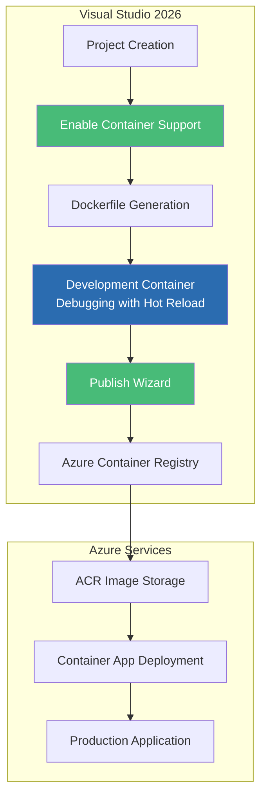
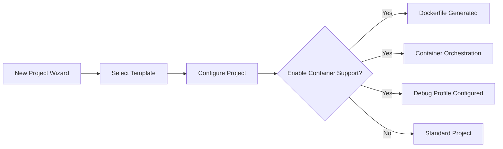
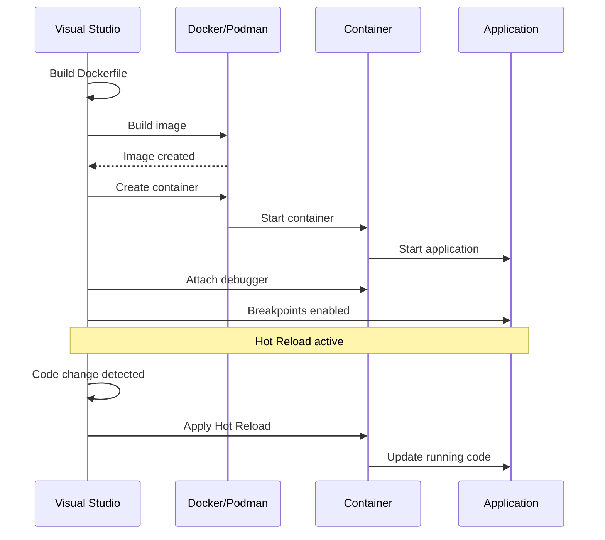
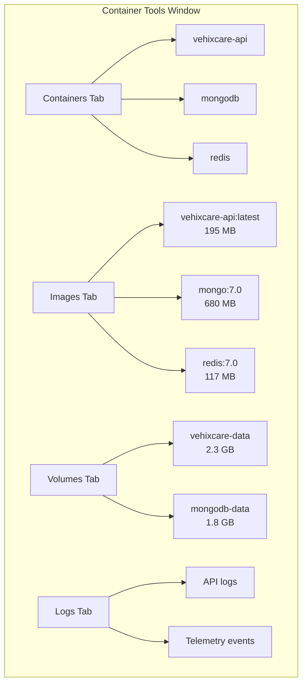
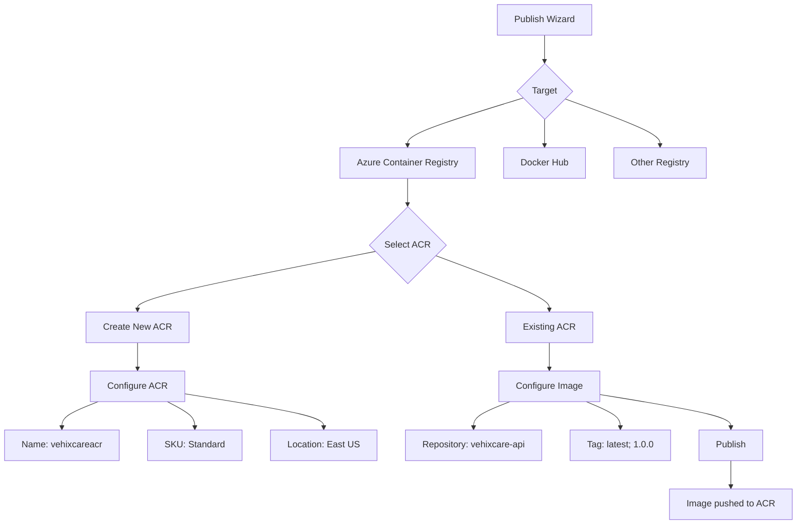
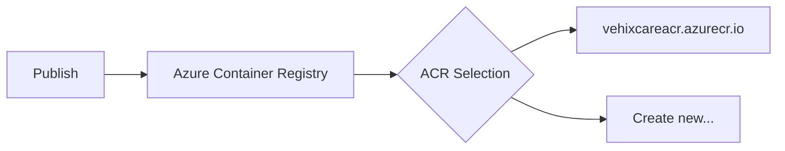

# Visual Studio 2026 GUI Publishing: Drag-and-Drop Azure Deployments

## Integrated Development Environment to Azure in Clicks

### Introduction: The Power of Visual Tooling

In the [previous installment](#) of this series, we explored the Azure Developer CLI with .NET Aspire—a powerful command-line approach that transforms complex deployments into a single `azd up` command. While command-line tools offer automation and repeatability, many developers prefer a different experience: **visual, interactive, and integrated directly into their development environment**.

**Visual Studio 2026** represents the culmination of Microsoft's investment in developer productivity, offering the most comprehensive GUI-based container deployment experience available. For Vehixcare-API—our fleet management platform with 10+ projects, MongoDB integration, and SignalR hubs—Visual Studio transforms container deployment from a command-line exercise into an intuitive, point-and-click workflow that even developers new to containers can master.

This installment explores Visual Studio's built-in container tooling, from Dockerfile generation to one-click Azure Container Registry publishing, integrated debugging with Hot Reload inside containers, and seamless Podman support for rootless container execution. We'll demonstrate how Visual Studio 2026 makes container development accessible to developers of all skill levels while maintaining the depth required for production deployments.



### Stories at a Glance

**Companion stories in this series:**

- 📚 **1. .NET SDK Native Container Publishing Deep Dive: The Complete Reference** – Comprehensive coverage of MSBuild properties, Native AOT optimization, CI/CD pipeline patterns, performance benchmarks, and troubleshooting guides

- 🚀 **2. .NET SDK Native Container Publishing: Building OCI Images Without Docker** – A deep dive into MSBuild configuration, multi-architecture builds, Native AOT optimization, and direct Azure Container Registry integration with workload identity federation

- 🐳 **3. Traditional Dockerfile with Docker: The Classic Approach** – Mastering multi-stage builds, build cache optimization, .dockerignore patterns, and Azure Container Registry authentication for enterprise CI/CD pipelines

- 🔐 **4. Traditional Dockerfile with Podman: The Daemonless Alternative** – Transitioning from Docker to Podman, rootless containers for enhanced security, podman-compose workflows, and Azure ACR integration with Podman Desktop

- ⚡ **5. Azure Developer CLI (azd) with .NET Aspire: The Turnkey Solution** – Full-stack deployments with `azd up`, Azure Container Apps provisioning, Redis caching, and infrastructure-as-code with Bicep templates

- 🖱️ **6. Visual Studio 2026 GUI Publishing: Drag-and-Drop Azure Deployments** – Leveraging Visual Studio's built-in Podman/Docker support, one-click publish to Azure Container Registry, and debugging containerized apps with Hot Reload *(This story)*

- 🔒 **7. Tarball Export + Runtime Load: Security-First CI/CD Workflows** – Generating container tarballs without a runtime, integrating with Trivy/Grype for vulnerability scanning, and deploying to air-gapped Azure environments

- 🔄 **8. Podman with .NET SDK Native Publishing: Hybrid Workflows** – Combining SDK-native builds with Podman for local testing, multi-architecture emulation, and Azure Container Registry push strategies

- 🛠️ **9. konet: Multi-Platform Container Builds Without Docker** – Using the konet .NET tool for cross-platform image generation, ARM64/AMD64 simultaneous builds, and GitHub Actions optimization

---

## Visual Studio Container Tooling Overview

Visual Studio 2026 provides comprehensive container tooling integrated throughout the development lifecycle:

### Key Features

| Feature | Description | Benefit |
|---------|-------------|---------|
| **Container Support on Project Creation** | Enable containerization when creating new projects | Zero-configuration start |
| **Dockerfile Generation** | Auto-generates optimized Dockerfiles | Best practices applied automatically |
| **Container Debugging** | F5 debugging inside containers | Seamless development experience |
| **Hot Reload in Containers** | Edit code while container runs | Instant feedback loop |
| **Container Tools Window** | GUI for managing containers, images, volumes | Visual container management |
| **Publish to ACR Wizard** | Step-by-step publishing to Azure Container Registry | One-click deployment |
| **Multi-Container Orchestration** | Docker Compose support with GUI | Complex app stacks simplified |

## Getting Started: Creating a Containerized Project

### Option 1: New Project with Container Support

When creating a new project in Visual Studio 2026:

1. **File → New → Project**
2. Select **ASP.NET Core Web API** (or any .NET template)
3. Configure project name and location
4. In the **Additional Information** dialog, check **Enable container support**



**Generated Project Structure:**
```
Vehixcare.API/
├── Dockerfile                 # Generated Dockerfile
├── .dockerignore              # Excluded files
├── Properties/
│   └── launchSettings.json    # Container debug profiles
└── ... (existing files)
```

### Option 2: Add Container Support to Existing Project

For Vehixcare-API, which already exists, we can add container support:

1. **Right-click the project** in Solution Explorer
2. Select **Add → Container Orchestrator Support...**
3. Choose **Docker Compose** or **Kubernetes/Helm**

Visual Studio analyzes the project and generates:

- **Dockerfile** – Optimized for the project type
- **docker-compose.yml** – For multi-container scenarios
- **.dockerignore** – Excludes build artifacts

## The Generated Dockerfile: Best Practices Applied

Visual Studio generates a production-ready Dockerfile following Microsoft's best practices:

```dockerfile
# Vehixcare.API/Dockerfile
# Auto-generated by Visual Studio 2026

# Base runtime image
FROM mcr.microsoft.com/dotnet/aspnet:9.0 AS base
WORKDIR /app
EXPOSE 80
EXPOSE 443

# Build image with SDK
FROM mcr.microsoft.com/dotnet/sdk:9.0 AS build
WORKDIR /src

# Copy project files for dependency restoration
COPY ["Vehixcare.API/Vehixcare.API.csproj", "Vehixcare.API/"]
COPY ["Vehixcare.Business/Vehixcare.Business.csproj", "Vehixcare.Business/"]
COPY ["Vehixcare.Common/Vehixcare.Common.csproj", "Vehixcare.Common/"]
COPY ["Vehixcare.Data/Vehixcare.Data.csproj", "Vehixcare.Data/"]
COPY ["Vehixcare.Hubs/Vehixcare.Hubs.csproj", "Vehixcare.Hubs/"]
COPY ["Vehixcare.Models/Vehixcare.Models.csproj", "Vehixcare.Models/"]
COPY ["Vehixcare.Repository/Vehixcare.Repository.csproj", "Vehixcare.Repository/"]
COPY ["Vehixcare.BackgroundServices/Vehixcare.BackgroundServices.csproj", "Vehixcare.BackgroundServices/"]

# Restore dependencies
RUN dotnet restore "Vehixcare.API/Vehixcare.API.csproj"

# Copy source code
COPY . .

# Build application
WORKDIR "/src/Vehixcare.API"
RUN dotnet build "Vehixcare.API.csproj" -c Release -o /app/build

# Publish
FROM build AS publish
RUN dotnet publish "Vehixcare.API.csproj" -c Release -o /app/publish \
    /p:UseAppHost=false

# Final image
FROM base AS final
WORKDIR /app
COPY --from=publish /app/publish .
ENTRYPOINT ["dotnet", "Vehixcare.API.dll"]
```

### Customizing the Generated Dockerfile

Visual Studio allows customization through **Container Development Settings**:

1. **Project → Properties → Container**
2. Configure:

```xml
<!-- Vehixcare.API.csproj Container Settings -->
<PropertyGroup>
  <ContainerPort>8080</ContainerPort>
  <ContainerPort Include="8443">https</ContainerPort>
  <ContainerBaseImage>mcr.microsoft.com/dotnet/aspnet:9.0</ContainerBaseImage>
  <ContainerWorkingDirectory>/app</ContainerWorkingDirectory>
  <ContainerUser>appuser</ContainerUser>
  <ContainerEnvironmentVariable Include="ASPNETCORE_ENVIRONMENT">
    <Value>Development</Value>
  </ContainerEnvironmentVariable>
</PropertyGroup>
```

## Debugging Inside Containers

### F5 Experience with Containers

When you press **F5** in a container-enabled project:



### Launch Settings Configuration

Visual Studio creates a container-specific debug profile:

```json
// Properties/launchSettings.json
{
  "profiles": {
    "Vehixcare.API": {
      "commandName": "Project",
      "dotnetRunMessages": true,
      "launchBrowser": true,
      "applicationUrl": "https://localhost:7001;http://localhost:7000",
      "environmentVariables": {
        "ASPNETCORE_ENVIRONMENT": "Development"
      }
    },
    "Container (Docker)": {
      "commandName": "Docker",
      "launchBrowser": true,
      "launchUrl": "{Scheme}://{ServiceHost}:{ServicePort}/swagger",
      "environmentVariables": {
        "ASPNETCORE_ENVIRONMENT": "Development"
      },
      "httpPort": 7000,
      "sslPort": 7001,
      "useSSL": true
    }
  }
}
```

### Hot Reload Inside Containers

Visual Studio 2026 supports **Hot Reload** for containerized applications:

**Supported Modifications:**
- ✅ Method bodies (C# code)
- ✅ Razor components (Blazor)
- ✅ CSS/SCSS files
- ✅ JavaScript/TypeScript
- ✅ Configuration changes (appsettings.json)

**Unsupported Modifications (require rebuild):**
- ❌ Adding new classes
- ❌ Changing method signatures
- ❌ Adding/removing NuGet packages
- ❌ Modifying project file

**Using Hot Reload:**
1. Run application with **F5** (debugging inside container)
2. Make code changes
3. Click **Hot Reload** button or press **Alt+F10**
4. Changes applied instantly without container restart

### Container Tools Window

Visual Studio provides a dedicated **Container Tools** window:

**View → Other Windows → Container Tools**

This window shows:
- **Containers** – Running and stopped containers
- **Images** – Available images with size and creation date
- **Volumes** – Data volumes and mounts
- **Environment** – Container environment variables



## Multi-Container Applications with Docker Compose

For Vehixcare-API with MongoDB and Redis, Visual Studio can manage the entire stack:

### Adding Docker Compose Support

1. **Right-click solution** → **Add → Container Orchestrator Support**
2. Select **Docker Compose**
3. Choose projects to include in the compose file

**Generated docker-compose.yml:**

```yaml
# docker-compose.yml
version: '3.8'

services:
  vehixcare.api:
    image: ${DOCKER_REGISTRY-}vehixcareapi
    build:
      context: .
      dockerfile: Vehixcare.API/Dockerfile
    ports:
      - "8080:8080"
      - "8443:8443"
    environment:
      - ASPNETCORE_ENVIRONMENT=Development
      - MONGODB_CONNECTION_STRING=mongodb://mongodb:27017
      - REDIS_CONNECTION_STRING=redis:6379
    depends_on:
      - mongodb
      - redis

  mongodb:
    image: mongo:7.0
    ports:
      - "27017:27017"
    environment:
      - MONGO_INITDB_ROOT_USERNAME=admin
      - MONGO_INITDB_ROOT_PASSWORD=password
    volumes:
      - mongodb_data:/data/db

  redis:
    image: redis:7.0-alpine
    ports:
      - "6379:6379"
    volumes:
      - redis_data:/data

volumes:
  mongodb_data:
  redis_data:
```

### Running with Docker Compose from Visual Studio

1. **Set docker-compose as startup project**
2. **Press F5** – All services start together
3. **Container Tools** window shows all running containers
4. **Output window** shows logs from all services

## Container Image Publishing to Azure

### Step-by-Step Publish Wizard

1. **Right-click project** → **Publish...**
2. Select **Azure** as target
3. Choose **Azure Container Registry**



### Publishing to Azure Container Registry

**Step 1: Select ACR**



**Step 2: Configure Image Settings**

| Setting | Value | Description |
|---------|-------|-------------|
| **Repository** | `vehixcare-api` | Image name in registry |
| **Tag** | `latest` | Default tag |
| **Tag** | `1.0.0` | Version tag |
| **Tag** | `$(BuildId)` | CI/CD variable |

**Step 3: Advanced Settings**

```xml
<!-- Publish profile settings -->
<PropertyGroup>
  <ContainerRegistry>vehixcareacr.azurecr.io</ContainerRegistry>
  <ContainerRepository>vehixcare-api</ContainerRepository>
  <ContainerImageTags>latest;1.0.0;$(Version)</ContainerImageTags>
  <ContainerBuildContext>../..</ContainerBuildContext>
  <ContainerRuntimeIdentifier>linux-x64</ContainerRuntimeIdentifier>
  <ContainerOptimization>trim</ContainerOptimization>
</PropertyGroup>
```

### Deployment Options After Publishing

After publishing to ACR, Visual Studio offers deployment options:

| Option | Description | Target |
|--------|-------------|--------|
| **Deploy to Azure Container Apps** | Serverless container hosting | Azure Container Apps |
| **Deploy to App Service** | Platform as a Service | Azure App Service |
| **Deploy to AKS** | Kubernetes orchestration | Azure Kubernetes Service |
| **Create CI/CD Pipeline** | GitHub Actions/Azure DevOps | Automation |

## Podman Support in Visual Studio

Visual Studio 2026 natively supports **Podman** as an alternative container runtime.

### Enabling Podman

1. **Install Podman Desktop** from [podman-desktop.io](https://podman-desktop.io)
2. **Initialize Podman Machine**:
   ```powershell
   podman machine init --cpus 4 --memory 4096
   podman machine start
   ```
3. **Configure Visual Studio**:
   - **Tools → Options → Container Tools**
   - Set **Container Runtime** to `Podman`

### Podman vs Docker in Visual Studio

| Feature | Docker | Podman |
|---------|--------|--------|
| **Debugging** | ✅ Full support | ✅ Full support |
| **Hot Reload** | ✅ Supported | ✅ Supported |
| **Docker Compose** | ✅ `docker-compose` | ✅ `podman-compose` |
| **Rootless Mode** | ❌ Requires root daemon | ✅ Default |
| **Container Tools** | ✅ Works | ✅ Works |

### Debugging with Podman

When Podman is selected, Visual Studio:
1. Uses Podman to build images
2. Runs containers with Podman
3. Attaches debugger via Podman API
4. All features work identically to Docker

## Continuous Integration with Azure DevOps

### Generating CI/CD Pipeline

Visual Studio can generate Azure DevOps YAML pipelines:

1. **Right-click project** → **Publish**
2. **Create CI/CD Pipeline**
3. Configure pipeline settings

**Generated Pipeline:**

```yaml
# azure-pipelines.yml
trigger:
- main

variables:
  dockerRegistryServiceConnection: 'acr-service-connection'
  imageRepository: 'vehixcare-api'
  containerRegistry: 'vehixcareacr.azurecr.io'
  dockerfilePath: '$(Build.SourcesDirectory)/Vehixcare.API/Dockerfile'
  tag: '$(Build.BuildId)'

stages:
- stage: Build
  displayName: 'Build and push stage'
  jobs:
  - job: Build
    displayName: 'Build'
    pool:
      vmImage: 'ubuntu-latest'
    steps:
    - task: Docker@2
      displayName: 'Build and push'
      inputs:
        containerRegistry: '$(dockerRegistryServiceConnection)'
        repository: '$(imageRepository)'
        command: 'buildAndPush'
        Dockerfile: '$(dockerfilePath)'
        tags: '$(tag)'
```

## Advanced Visual Studio Container Features

### Container Performance Profiling

Visual Studio includes container-aware profiling tools:

1. **Debug → Performance Profiler**
2. Select **Container Profiling**
3. Choose target container

**Profiling Data:**
- CPU usage per container
- Memory allocation
- Network I/O
- Disk operations
- Container-specific metrics

### Container Diagnostics

**Diagnostics Tools** during debugging:

```
Container: vehixcare-api
├── CPU: 2.3%
├── Memory: 245 MB / 2 GB
├── Network In: 1.2 MB/s
├── Network Out: 0.8 MB/s
├── Disk Read: 0 KB/s
├── Disk Write: 12 KB/s
└── Threads: 24
```

### Container Log Streaming

**View → Other Windows → Container Logs**

- Real-time log streaming
- Search and filter
- Export to file
- Color-coded by container

### Container File System Explorer

**Container Tools → File System**

- Browse container file system
- View files and directories
- Download logs and artifacts
- Upload configuration files

## Troubleshooting Visual Studio Container Issues

### Issue 1: Docker/Podman Not Detected

**Error:** `Docker is not installed or not running`

**Solution:**
1. Verify Docker/Podman is installed:
   ```bash
   docker --version
   # or
   podman --version
   ```
2. Ensure runtime is running:
   ```bash
   docker ps
   # or
   podman ps
   ```
3. Configure Visual Studio:
   - **Tools → Options → Container Tools**
   - Verify runtime path

### Issue 2: Hot Reload Not Working

**Error:** `Hot Reload not supported in this container configuration`

**Solution:**
1. Ensure project is configured for Hot Reload:
   ```xml
   <PropertyGroup>
     <EnableHotReload>true</EnableHotReload>
   </PropertyGroup>
   ```
2. Run with debugger (**F5**, not Ctrl+F5)
3. Check Output window for Hot Reload status

### Issue 3: Debugger Not Attaching

**Error:** `Unable to attach debugger to container`

**Solution:**
1. Check Dockerfile exposes debug ports:
   ```dockerfile
   # Ensure debug port is exposed
   EXPOSE 80
   EXPOSE 443
   # For remote debugging
   EXPOSE 4022
   ```
2. Verify launch settings:
   ```json
   {
     "commandName": "Docker",
     "useRemoteDebugger": true
   }
   ```

### Issue 4: Build Fails Due to Large Context

**Error:** `Docker build failed: COPY failed: file not found`

**Solution:**
1. Check `.dockerignore` file
2. Exclude unnecessary folders:
   ```
   bin/
   obj/
   .git/
   .vs/
   node_modules/
   ```
3. Verify Dockerfile paths are correct

## Performance Comparison: Visual Studio Workflows

| Workflow | Time to Deploy | Steps | Learning Curve |
|----------|---------------|-------|----------------|
| **Visual Studio GUI** | 10-15 minutes | 5 clicks | Low |
| **Visual Studio + CLI** | 8-12 minutes | Mixed | Medium |
| **Azure CLI Only** | 15-25 minutes | 15+ commands | High |
| **azd CLI** | 10-15 minutes | 3 commands | Medium |

## Conclusion: The Developer Experience Advantage

Visual Studio 2026 GUI publishing represents the most accessible path to containerized Azure deployments for .NET developers. By abstracting the complexity of Dockerfile creation, container debugging, and Azure Container Registry publishing, it enables:

- **Faster onboarding** – New developers can containerize applications without learning Docker syntax
- **Integrated workflow** – Stay within IDE from code to cloud
- **Visual debugging** – Inspect container state, logs, and performance from familiar tools
- **Cross-runtime support** – Seamlessly switch between Docker and Podman

For Vehixcare-API, Visual Studio's container tooling reduces the time to first containerized deployment from hours to minutes, while maintaining the depth required for production scenarios. Whether you're a solo developer prototyping a new service or an enterprise team standardizing on Azure, Visual Studio 2026 provides the most developer-friendly containerization experience available.

---

### Stories at a Glance

**Companion stories in this series:**

- 📚 **1. .NET SDK Native Container Publishing Deep Dive: The Complete Reference** – Comprehensive coverage of MSBuild properties, Native AOT optimization, CI/CD pipeline patterns, performance benchmarks, and troubleshooting guides

- 🚀 **2. .NET SDK Native Container Publishing: Building OCI Images Without Docker** – A deep dive into MSBuild configuration, multi-architecture builds, Native AOT optimization, and direct Azure Container Registry integration with workload identity federation

- 🐳 **3. Traditional Dockerfile with Docker: The Classic Approach** – Mastering multi-stage builds, build cache optimization, .dockerignore patterns, and Azure Container Registry authentication for enterprise CI/CD pipelines

- 🔐 **4. Traditional Dockerfile with Podman: The Daemonless Alternative** – Transitioning from Docker to Podman, rootless containers for enhanced security, podman-compose workflows, and Azure ACR integration with Podman Desktop

- ⚡ **5. Azure Developer CLI (azd) with .NET Aspire: The Turnkey Solution** – Full-stack deployments with `azd up`, Azure Container Apps provisioning, Redis caching, and infrastructure-as-code with Bicep templates

- 🖱️ **6. Visual Studio 2026 GUI Publishing: Drag-and-Drop Azure Deployments** – Leveraging Visual Studio's built-in Podman/Docker support, one-click publish to Azure Container Registry, and debugging containerized apps with Hot Reload *(This story)*

- 🔒 **7. Tarball Export + Runtime Load: Security-First CI/CD Workflows** – Generating container tarballs without a runtime, integrating with Trivy/Grype for vulnerability scanning, and deploying to air-gapped Azure environments

- 🔄 **8. Podman with .NET SDK Native Publishing: Hybrid Workflows** – Combining SDK-native builds with Podman for local testing, multi-architecture emulation, and Azure Container Registry push strategies

- 🛠️ **9. konet: Multi-Platform Container Builds Without Docker** – Using the konet .NET tool for cross-platform image generation, ARM64/AMD64 simultaneous builds, and GitHub Actions optimization

---

**Coming next in the series:**
**🔒 Tarball Export + Runtime Load: Security-First CI/CD Workflows** – Generating container tarballs without a runtime, integrating with Trivy/Grype for vulnerability scanning, and deploying to air-gapped Azure environments