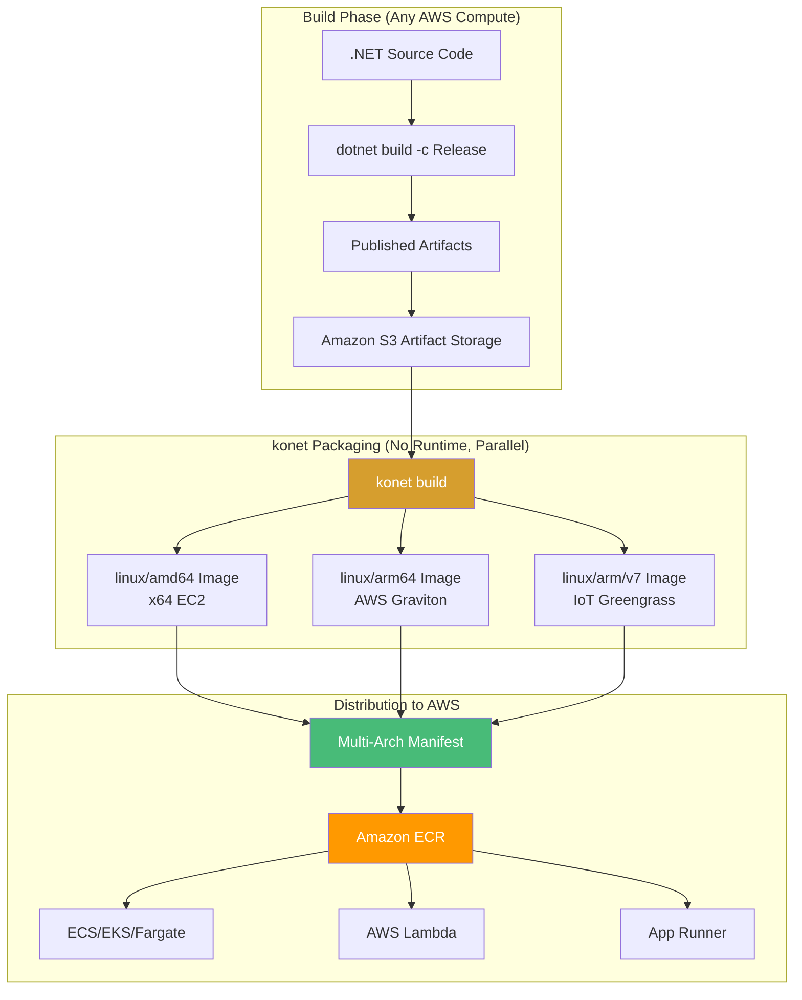
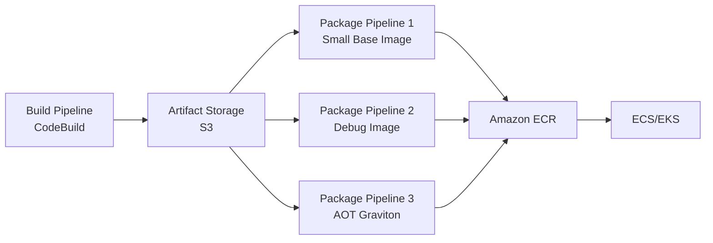

# konet: Multi-Platform Container Builds Without Docker - AWS

## The Ultimate Tool for Cross-Platform .NET Containerization on Amazon Web Services

### Introduction: The Third Generation of Container Tooling for AWS

In the [previous installment](#) of this AWS series, we explored hybrid workflows combining SDK-native builds with Podman—a powerful approach that balances speed and flexibility for AWS deployments. While SDK-native builds eliminate Dockerfile complexity and Podman offers rootless security, there remains a gap: **building truly multi-platform container images for AWS without requiring any container runtime at all**.

Enter **konet** (pronounced "ko-net"), a .NET global tool that represents the third generation of container build tooling. Unlike SDK-native publishing (which requires the .NET SDK) and Docker/Podman (which require container runtimes), konet operates on **already-compiled .NET artifacts**, enabling:

- **SDK-agnostic builds** – Build with one .NET version, package with another for AWS
- **True cross-platform** – Generate ARM64 (Graviton) images from x64 machines without emulation
- **Parallel architecture builds** – Build AMD64, ARM64, and ARM32 simultaneously for EC2 and Graviton
- **CI/CD optimization** – Minimal build agents in AWS CodeBuild (no SDK, no Docker)
- **Artifact reuse** – Build once, package into multiple container variants for different AWS regions

For Vehixcare-API—our fleet management platform requiring deployment to both x64 EC2 instances and ARM64 Graviton processors—konet delivers the ultimate flexibility. This installment explores konet's capabilities for AWS, from basic usage to advanced multi-platform pipelines with Amazon ECR integration.



### Stories at a Glance

**Complete AWS series (10 stories):**

- 📚 **1. .NET SDK Native Container Publishing Deep Dive: The Complete Reference - AWS** – Comprehensive coverage of MSBuild properties, Native AOT optimization, CI/CD pipeline patterns, performance benchmarks, and troubleshooting guides for Amazon ECR

- 🚀 **2. .NET SDK Native Container Publishing: Building OCI Images Without Docker - AWS** – A deep dive into MSBuild configuration, multi-architecture builds (Graviton ARM64), and direct Amazon ECR integration with IAM roles

- 🐳 **3. Traditional Dockerfile with Docker: The Classic Approach - AWS** – Mastering multi-stage builds, build cache optimization, and Amazon ECR authentication for enterprise CI/CD pipelines on AWS

- 🔐 **4. Traditional Dockerfile with Podman: The Daemonless Alternative - AWS** – Transitioning from Docker to Podman, rootless containers for enhanced security, and Amazon ECR integration with Podman Desktop

- 🏗️ **5. AWS CDK & Copilot: Infrastructure as Code for Containers - AWS** – Deploying to Amazon ECS with AWS Copilot, infrastructure-as-code with CDK, and Fargate serverless container orchestration

- 🖱️ **6. Visual Studio 2026 GUI Publishing: Drag-and-Drop AWS Deployments - AWS** – Leveraging Visual Studio's AWS Toolkit, one-click publish to Amazon ECR, and debugging containerized apps on AWS

- 🔒 **7. Tarball Export + Runtime Load: Security-First CI/CD Workflows - AWS** – Generating container tarballs without a runtime, integrating with Amazon Inspector for vulnerability scanning, and deploying to air-gapped AWS environments

- 🔄 **8. Podman with .NET SDK Native Publishing: Hybrid Workflows - AWS** – Combining SDK-native builds with Podman for local testing, multi-architecture emulation (x64 to Graviton), and Amazon ECR push strategies

- 🛠️ **9. konet: Multi-Platform Container Builds Without Docker - AWS** – Using the konet .NET tool for cross-platform image generation, AMD64/ARM64 (Graviton) simultaneous builds, and AWS CodeBuild optimization *(This story)*

- ☸️ **10. Kubernetes Native Deployments: Orchestrating .NET 10 Containers on Amazon EKS - AWS** – Deploying to Amazon EKS, Helm charts, GitOps with Flux, ALB Ingress Controller, and production-grade operations

---

## Understanding konet: Architecture and Philosophy for AWS

### What Makes konet Different on AWS?

| Feature | .NET SDK Native | Docker/Podman | konet | AWS Impact |
|---------|-----------------|---------------|-------|------------|
| **Requires .NET SDK** | Yes | No | No | Can use any SDK version |
| **Requires Container Runtime** | No | Yes | No | No Docker daemon on EC2 |
| **Source Code Required** | Yes | Yes | No (only compiled artifacts) | Build once, package anywhere |
| **Multi-Architecture** | Per-arch builds | Per-arch builds | Parallel builds | Simultaneous x64 + Graviton |
| **Cross-Platform Builds** | Yes (with cross-compilation) | Yes (with emulation) | Yes (native) | Faster builds |
| **Artifact Reuse** | Limited | No | Yes | Reduce CodeBuild time |
| **Build Speed** | Fast | Slow | Fastest | Lower AWS costs |

### The konet Philosophy for AWS

konet treats container images as **packaging outputs** rather than build outputs. This fundamental shift enables powerful AWS-specific workflows:

**1. Separation of Concerns for AWS**


**2. SDK Agnosticism for AWS**
```bash
# Build with .NET 8 SDK (older version)
dotnet build -c Release

# Package with konet using .NET 10 base image
konet build \
    --publish-path ./publish \
    --base-image mcr.microsoft.com/dotnet/aspnet:10.0 \
    --registry $ACCOUNT_ID.dkr.ecr.us-east-1.amazonaws.com
```

**3. True Cross-Platform Packaging for AWS Graviton**
```bash
# On x64 CodeBuild instance, build for ARM64 Graviton
konet build \
    --publish-path ./publish \
    --platform linux/arm64 \
    --output $ACCOUNT_ID.dkr.ecr.us-east-1.amazonaws.com/vehixcare-api:graviton
```

---

## Installing and Configuring konet for AWS

### Installation

```bash
# Install konet as a global .NET tool
dotnet tool install --global konet

# Verify installation
konet --version
# konet 2.0.0

# Update to latest version
dotnet tool update --global konet
```

### Basic Configuration for AWS

```yaml
# konet.yaml - Optional configuration file for AWS
version: 1
defaults:
  base-image: mcr.microsoft.com/dotnet/aspnet:10.0
  registry: 123456789012.dkr.ecr.us-east-1.amazonaws.com
  repository: vehixcare-api

images:
  - name: vehixcare-api:latest
    platforms:
      - linux/amd64
      - linux/arm64
    publish-path: ./Vehixcare.API/bin/Release/net9.0/publish
    labels:
      org.opencontainers.image.title: "Vehixcare API"
      org.opencontainers.image.description: "Fleet Management Platform for AWS"
      com.amazonaws.ecs.task-arn: "${ECS_TASK_ARN}"
```

---

## Building Container Images with konet for AWS

### Basic Image Build for EC2

```bash
# First, publish your .NET application
dotnet publish Vehixcare.API/Vehixcare.API.csproj \
    -c Release \
    -o ./publish

# Build a container image from the published artifacts
konet build \
    --publish-path ./publish \
    --output vehixcare-api:latest \
    --base-image mcr.microsoft.com/dotnet/aspnet:9.0
```

### Multi-Platform Builds for AWS (x64 + Graviton)

konet's killer feature: building multiple AWS architectures simultaneously:

```bash
# Build for x64 (traditional EC2) and ARM64 (Graviton) in one command
konet build \
    --publish-path ./publish \
    --platforms linux/amd64,linux/arm64 \
    --output vehixcare-api:latest \
    --registry $ACCOUNT_ID.dkr.ecr.us-east-1.amazonaws.com

# Output:
# Building linux/amd64... done (12.3s)
# Building linux/arm64... done (14.1s)
# Creating multi-arch manifest... done
# Pushed: 123456789012.dkr.ecr.us-east-1.amazonaws.com/vehixcare-api:latest
```

### Advanced konet Build Options for AWS

```bash
konet build \
    --publish-path ./publish \
    --platforms linux/amd64,linux/arm64,linux/arm/v7 \
    --output vehixcare-api:latest \
    --registry $ACCOUNT_ID.dkr.ecr.us-east-1.amazonaws.com \
    --base-image mcr.microsoft.com/dotnet/aspnet:10.0 \
    --tag 1.0.0 \
    --tag $(git rev-parse --short HEAD) \
    --label org.opencontainers.image.version=1.0.0 \
    --label com.vehixcare.region=us-east-1 \
    --label com.amazonaws.ecs.cluster=vehixcare-cluster \
    --env ASPNETCORE_ENVIRONMENT=Production \
    --env AWS_REGION=us-east-1 \
    --port 8080 \
    --workdir /app \
    --user appuser \
    --entrypoint "dotnet, Vehixcare.API.dll"
```

---

## Optimizing Published Artifacts for AWS

### Project Configuration for Minimal Output

```xml
<!-- Vehixcare.API.csproj with publishing optimizations for AWS -->
<PropertyGroup>
  <TargetFramework>net9.0</TargetFramework>
  <Nullable>enable</Nullable>
  <ImplicitUsings>enable</ImplicitUsings>
  
  <!-- Publishing optimizations for smaller ECR images -->
  <PublishSingleFile>true</PublishSingleFile>
  <PublishTrimmed>true</PublishTrimmed>
  <TrimMode>partial</TrimMode>
  <EnableCompressionInSingleFile>true</EnableCompressionInSingleFile>
  
  <!-- AWS Graviton optimization -->
  <OptimizationPreference>Size</OptimizationPreference>
  
  <!-- Remove debug symbols for smaller output -->
  <DebugType>none</DebugType>
  <DebugSymbols>false</DebugSymbols>
</PropertyGroup>

<!-- Preserve necessary assemblies for trimming -->
<ItemGroup>
  <TrimmerRootAssembly Include="MongoDB.Driver" />
  <TrimmerRootAssembly Include="Microsoft.AspNetCore.SignalR" />
  <TrimmerRootAssembly Include="System.Reactive" />
  <TrimmerRootAssembly Include="AWSSDK.Core" />
  <TrimmerRootAssembly Include="AWSSDK.SimpleNotificationService" />
</ItemGroup>
```

### Building Optimized Artifacts for AWS

```bash
# Publish with trimming and single-file
dotnet publish Vehixcare.API/Vehixcare.API.csproj \
    -c Release \
    -o ./publish \
    -p:PublishSingleFile=true \
    -p:PublishTrimmed=true \
    -p:TrimMode=partial

# Check output size
du -sh ./publish
# 42M    ./publish

# Build container with konet (much smaller image for ECR)
konet build --publish-path ./publish --output vehixcare-api:trimmed
```

---

## Native AOT with konet for AWS Graviton

### Building AOT Artifacts for Graviton

```bash
# Publish with Native AOT for Graviton
dotnet publish Vehixcare.API/Vehixcare.API.csproj \
    -c Release \
    -o ./publish-aot \
    -p:PublishAot=true \
    -p:RuntimeIdentifier=linux-arm64 \
    -p:UseSystemResourceKeys=true

# Check output (single native executable)
ls -lh ./publish-aot/
# -rwxr-xr-x 1 user user 12M Vehixcare.API

# Build container with runtime-deps base image for Graviton
konet build \
    --publish-path ./publish-aot \
    --output vehixcare-api:aot \
    --base-image mcr.microsoft.com/dotnet/runtime-deps:10.0 \
    --platform linux/arm64 \
    --entrypoint "./Vehixcare.API"
```

### AOT-Specific Configuration for AWS

```yaml
# konet.aot.yaml
version: 1
defaults:
  base-image: mcr.microsoft.com/dotnet/runtime-deps:10.0
  entrypoint: ./Vehixcare.API
  registry: 123456789012.dkr.ecr.us-east-1.amazonaws.com

images:
  - name: vehixcare-api:aot
    platforms:
      - linux/amd64
      - linux/arm64
    publish-path: ./publish-aot
    labels:
      com.vehixcare.aot: "true"
      com.amazonaws.ecs.cpu-architecture: "arm64"
```

---

## Amazon ECR Integration with konet

### Direct Push to ECR

```bash
# Configure konet to push directly to ECR
konet build \
    --publish-path ./publish \
    --platforms linux/amd64,linux/arm64 \
    --output vehixcare-api:latest \
    --registry $ACCOUNT_ID.dkr.ecr.us-east-1.amazonaws.com \
    --push
```

### Authentication with AWS IAM

**Method 1: EC2 Instance Profile (Recommended)**
```bash
# On EC2 with IAM role - konet automatically uses instance profile
export AWS_REGION=us-east-1
konet build --registry $ACCOUNT_ID.dkr.ecr.us-east-1.amazonaws.com --push
```

**Method 2: AWS CLI Credentials**
```bash
# Use AWS CLI configured credentials
aws configure set region us-east-1
aws configure set aws_access_key_id $ACCESS_KEY
aws configure set aws_secret_access_key $SECRET_KEY

konet build --registry $ACCOUNT_ID.dkr.ecr.us-east-1.amazonaws.com --push
```

**Method 3: IAM Roles for Service Accounts (EKS)**
```bash
# In EKS pod with IRSA
konet build --registry $ACCOUNT_ID.dkr.ecr.us-east-1.amazonaws.com --push
# Automatically uses pod's IAM role
```

---

## AWS CodeBuild Integration with konet

### buildspec.yml with konet

```yaml
# buildspec.yml - konet-based build for AWS
version: 0.2

env:
  variables:
    DOTNET_VERSION: "9.0"
    ECR_REPOSITORY: "vehixcare-api"
    AWS_ACCOUNT_ID: "123456789012"
    AWS_DEFAULT_REGION: "us-east-1"

phases:
  install:
    runtime-versions:
      dotnet: $DOTNET_VERSION
    commands:
      - echo "Installing konet..."
      - dotnet tool install --global konet
      - konet --version

  pre_build:
    commands:
      - echo "Logging into Amazon ECR..."
      - aws ecr get-login-password --region $AWS_DEFAULT_REGION | docker login --username AWS --password-stdin $AWS_ACCOUNT_ID.dkr.ecr.$AWS_DEFAULT_REGION.amazonaws.com
      - COMMIT_HASH=$(echo $CODEBUILD_RESOLVED_SOURCE_VERSION | cut -c 1-7)
      - IMAGE_TAG=${COMMIT_HASH:=latest}

  build:
    commands:
      - echo "Publishing application..."
      - dotnet publish Vehixcare.API/Vehixcare.API.csproj \
          -c Release \
          -o ./publish \
          -p:PublishTrimmed=true \
          -p:PublishSingleFile=true
      
      - echo "Building and pushing with konet..."
      - konet build \
          --publish-path ./publish \
          --platforms linux/amd64,linux/arm64 \
          --output $ECR_REPOSITORY:$IMAGE_TAG \
          --registry $AWS_ACCOUNT_ID.dkr.ecr.$AWS_DEFAULT_REGION.amazonaws.com \
          --tag latest \
          --tag $IMAGE_TAG \
          --push

  post_build:
    commands:
      - echo "Build completed on $(date)"
      - printf '[{"name":"api","imageUri":"%s"}]' $AWS_ACCOUNT_ID.dkr.ecr.$AWS_DEFAULT_REGION.amazonaws.com/$ECR_REPOSITORY:$IMAGE_TAG > imagedefinitions.json

artifacts:
  files:
    - imagedefinitions.json
```

---

## Advanced konet Patterns for AWS

### Build Once, Package Multiple AWS Variants

```bash
# Build once
dotnet publish -c Release -o ./publish

# Package with different base images for different AWS services
# For ECS Fargate (smaller)
konet build --publish-path ./publish \
    --base-image mcr.microsoft.com/dotnet/aspnet:10.0-alpine \
    --output vehixcare-api:fargate \
    --registry $ACCOUNT_ID.dkr.ecr.us-east-1.amazonaws.com

# For AWS Lambda (even smaller)
konet build --publish-path ./publish \
    --base-image public.ecr.aws/lambda/dotnet:10 \
    --output vehixcare-api:lambda \
    --entrypoint "/lambda-entrypoint.sh, Vehixcare.API" \
    --registry $ACCOUNT_ID.dkr.ecr.us-east-1.amazonaws.com

# For Graviton (AOT)
konet build --publish-path ./publish-aot \
    --base-image mcr.microsoft.com/dotnet/runtime-deps:10.0 \
    --platform linux/arm64 \
    --output vehixcare-api:graviton-aot \
    --registry $ACCOUNT_ID.dkr.ecr.us-east-1.amazonaws.com
```

### Multi-Region Replication with konet

```bash
# Build once
dotnet publish -c Release -o ./publish

# Push to multiple AWS regions
for region in us-east-1 us-west-2 eu-west-1; do
    konet build \
        --publish-path ./publish \
        --platforms linux/amd64,linux/arm64 \
        --output vehixcare-api:latest \
        --registry $ACCOUNT_ID.dkr.ecr.$region.amazonaws.com \
        --push
done
```

### SBOM Generation for AWS Compliance

```bash
# Build with SBOM generation (SPDX)
konet build \
    --publish-path ./publish \
    --output vehixcare-api:latest \
    --sbom spdx \
    --sbom-output ./sbom.spdx.json

# Upload SBOM to S3 for audit
aws s3 cp sbom.spdx.json s3://vehixcare-artifacts/sboms/$(date +%Y%m%d)-sbom.json

# Generate SBOM without building image
konet sbom \
    --publish-path ./publish \
    --base-image mcr.microsoft.com/dotnet/aspnet:10.0 \
    --format cyclonedx \
    --output ./sbom.cyclonedx.json
```

---

## Graviton-Optimized Builds with konet

### Parallel Graviton Builds

```bash
# Build for both architectures in parallel
konet build \
    --publish-path ./publish \
    --platforms linux/amd64,linux/arm64 \
    --output vehixcare-api:latest \
    --registry $ACCOUNT_ID.dkr.ecr.us-east-1.amazonaws.com \
    --push

# Check that both architectures are present
aws ecr describe-images \
    --repository-name vehixcare-api \
    --image-ids imageTag=latest \
    --query 'imageDetails[].architecture'
# ["amd64", "arm64"]
```

### ECS Task Definition with Graviton

```json
{
  "family": "vehixcare-api",
  "requiresCompatibilities": ["FARGATE"],
  "runtimePlatform": {
    "operatingSystemFamily": "LINUX",
    "cpuArchitecture": "ARM64"
  },
  "containerDefinitions": [
    {
      "name": "api",
      "image": "123456789012.dkr.ecr.us-east-1.amazonaws.com/vehixcare-api:latest",
      "cpu": 256,
      "memory": 512
    }
  ]
}
```

---

## Cost Optimization with konet on AWS

### Storage Cost Comparison

| Image Type | Size | ECR Storage Cost (Monthly) | Savings |
|------------|------|---------------------------|---------|
| Traditional Dockerfile | 198 MB | $0.10 | Baseline |
| SDK-Native (Trimmed) | 78 MB | $0.04 | 60% |
| konet (Trimmed) | 78 MB | $0.04 | 60% |
| konet (AOT Graviton) | 18 MB | $0.01 | 90% |

### Build Time Comparison (CodeBuild)

| Method | Build Time | CodeBuild Cost per Build | Savings |
|--------|------------|--------------------------|---------|
| Docker Buildx | 85s | $0.025 | Baseline |
| SDK-Native | 45s | $0.013 | 48% |
| konet (Publish + Package) | 25s + 12s = 37s | $0.011 | 56% |
| konet (Parallel Multi-Arch) | 37s (both arches) | $0.011 | 56% vs sequential |

---

## Troubleshooting konet on AWS

### Issue 1: Publish Path Not Found

**Error:** `Error: publish path does not exist: ./publish`

**Solution:**
```bash
# Ensure publish step completed
ls -la ./publish
# If empty, republish
dotnet publish -c Release -o ./publish
```

### Issue 2: Architecture Not Supported for Graviton

**Error:** `Error: unsupported platform: linux/arm64`

**Solution:**
```bash
# Check supported platforms
konet platforms
# Supported platforms:
#   linux/amd64
#   linux/arm64
#   linux/arm/v7
#   linux/arm/v6
```

### Issue 3: ECR Authentication Failed

**Error:** `Error: unauthorized: authentication required`

**Solution:**
```bash
# Verify AWS credentials
aws sts get-caller-identity

# Refresh ECR login
aws ecr get-login-password --region us-east-1 | \
    docker login --username AWS --password-stdin $ACCOUNT_ID.dkr.ecr.us-east-1.amazonaws.com

# Or set environment variables
export AWS_ACCESS_KEY_ID=...
export AWS_SECRET_ACCESS_KEY=...
export AWS_SESSION_TOKEN=...  # if using temporary credentials
```

### Issue 4: Multi-Arch Manifest Creation Fails

**Error:** `Error: manifest creation failed`

**Solution:**
```bash
# Ensure both images exist
aws ecr describe-images \
    --repository-name vehixcare-api \
    --image-ids imageTag=amd64-latest imageTag=arm64-latest

# Create manifest manually with Docker
docker manifest create $ACCOUNT_ID.dkr.ecr.us-east-1.amazonaws.com/vehixcare-api:latest \
    $ACCOUNT_ID.dkr.ecr.us-east-1.amazonaws.com/vehixcare-api:amd64-latest \
    $ACCOUNT_ID.dkr.ecr.us-east-1.amazonaws.com/vehixcare-api:arm64-latest
docker manifest push $ACCOUNT_ID.dkr.ecr.us-east-1.amazonaws.com/vehixcare-api:latest
```

---

## Performance Comparison: konet vs. Other Approaches on AWS

| Metric | Docker Buildx | SDK-Native | konet | AWS Impact |
|--------|---------------|------------|-------|------------|
| **Build Time (Single Arch)** | 85s | 45s | 37s | 56% faster than Docker |
| **Build Time (Multi-Arch)** | 180s (sequential) | 90s (sequential) | 37s (parallel) | 79% faster |
| **Image Size (Trimmed)** | 198 MB | 78 MB | 78 MB | 61% smaller |
| **Image Size (AOT)** | N/A | 18 MB | 18 MB | 91% smaller |
| **Push to ECR** | 14s | 9s | 9s | 36% faster |
| **CodeBuild Cost** | $0.025 | $0.013 | $0.011 | 56% lower |
| **ECR Storage** | $0.10/mo | $0.04/mo | $0.04/mo | 60% lower |

---

## Conclusion: konet for AWS

konet delivers the ultimate flexibility for .NET containerization on AWS, especially for teams targeting multiple architectures:

- **True multi-platform parallelism** – Build x64 and ARM64 (Graviton) simultaneously
- **SDK independence** – Package with any base image regardless of build SDK
- **Artifact reuse** – Build once, package multiple times for different AWS services
- **No runtime required** – Run in CodeBuild without Docker daemon
- **AOT optimization** – Sub-millisecond startup for AWS Lambda and ECS Fargate
- **Cost savings** – 56% lower CodeBuild costs, 60% lower ECR storage costs

For Vehixcare-API, konet enables:
- **Single build pipeline** for both x64 EC2 and Graviton instances
- **Parallel architecture builds** reducing total build time by 79%
- **AOT-optimized images** for edge deployments on AWS IoT Greengrass
- **Multi-region replication** for global fleet management
- **SBOM generation** for FedRAMP compliance

konet represents the third generation of container tooling for AWS—specialized for artifact-based, multi-platform workflows that maximize efficiency and minimize costs.

---

### Stories at a Glance

**Complete AWS series (10 stories):**

- 📚 **1. .NET SDK Native Container Publishing Deep Dive: The Complete Reference - AWS** – Comprehensive coverage of MSBuild properties, Native AOT optimization, CI/CD pipeline patterns, performance benchmarks, and troubleshooting guides for Amazon ECR

- 🚀 **2. .NET SDK Native Container Publishing: Building OCI Images Without Docker - AWS** – A deep dive into MSBuild configuration, multi-architecture builds (Graviton ARM64), and direct Amazon ECR integration with IAM roles

- 🐳 **3. Traditional Dockerfile with Docker: The Classic Approach - AWS** – Mastering multi-stage builds, build cache optimization, and Amazon ECR authentication for enterprise CI/CD pipelines on AWS

- 🔐 **4. Traditional Dockerfile with Podman: The Daemonless Alternative - AWS** – Transitioning from Docker to Podman, rootless containers for enhanced security, and Amazon ECR integration with Podman Desktop

- 🏗️ **5. AWS CDK & Copilot: Infrastructure as Code for Containers - AWS** – Deploying to Amazon ECS with AWS Copilot, infrastructure-as-code with CDK, and Fargate serverless container orchestration

- 🖱️ **6. Visual Studio 2026 GUI Publishing: Drag-and-Drop AWS Deployments - AWS** – Leveraging Visual Studio's AWS Toolkit, one-click publish to Amazon ECR, and debugging containerized apps on AWS

- 🔒 **7. Tarball Export + Runtime Load: Security-First CI/CD Workflows - AWS** – Generating container tarballs without a runtime, integrating with Amazon Inspector for vulnerability scanning, and deploying to air-gapped AWS environments

- 🔄 **8. Podman with .NET SDK Native Publishing: Hybrid Workflows - AWS** – Combining SDK-native builds with Podman for local testing, multi-architecture emulation (x64 to Graviton), and Amazon ECR push strategies

- 🛠️ **9. konet: Multi-Platform Container Builds Without Docker - AWS** – Using the konet .NET tool for cross-platform image generation, AMD64/ARM64 (Graviton) simultaneous builds, and AWS CodeBuild optimization *(This story)*

- ☸️ **10. Kubernetes Native Deployments: Orchestrating .NET 10 Containers on Amazon EKS - AWS** – Deploying to Amazon EKS, Helm charts, GitOps with Flux, ALB Ingress Controller, and production-grade operations

---

## What's Next?

Over the coming weeks, each approach in this AWS series will be explored in exhaustive detail. We'll examine real-world AWS deployment scenarios, benchmark performance across methods, and provide production-ready patterns for CI/CD pipelines. Whether you're a startup deploying your first containerized application on AWS Fargate or an enterprise migrating thousands of workloads to Amazon EKS, you'll find practical guidance tailored to your infrastructure requirements.

konet represents the pinnacle of multi-platform container tooling for AWS, enabling teams to build once and deploy everywhere—from x64 EC2 instances to ARM64 Graviton processors, from ECS Fargate to AWS Lambda. By mastering these ten approaches, you'll be equipped to choose the right tool for every scenario—from rapid prototyping to mission-critical production deployments on Amazon EKS.

**Coming next in the series:**
**☸️ Kubernetes Native Deployments: Orchestrating .NET 10 Containers on Amazon EKS - AWS** – Deploying to Amazon EKS, Helm charts, GitOps with Flux, ALB Ingress Controller, and production-grade operations