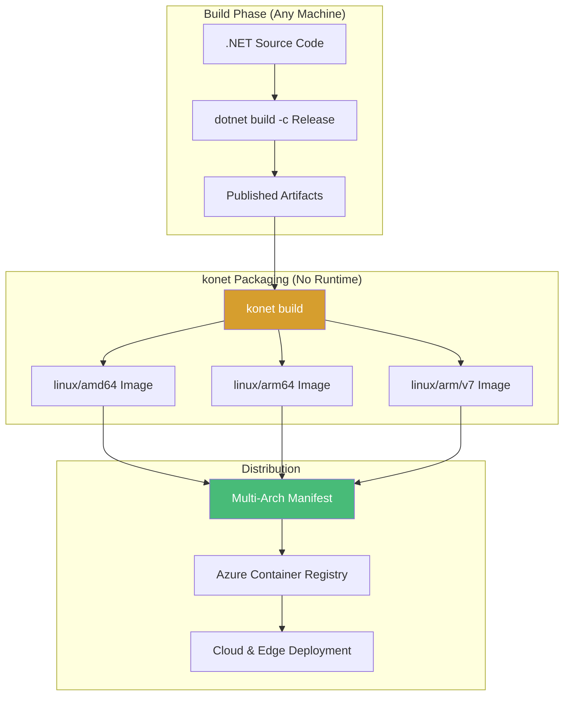
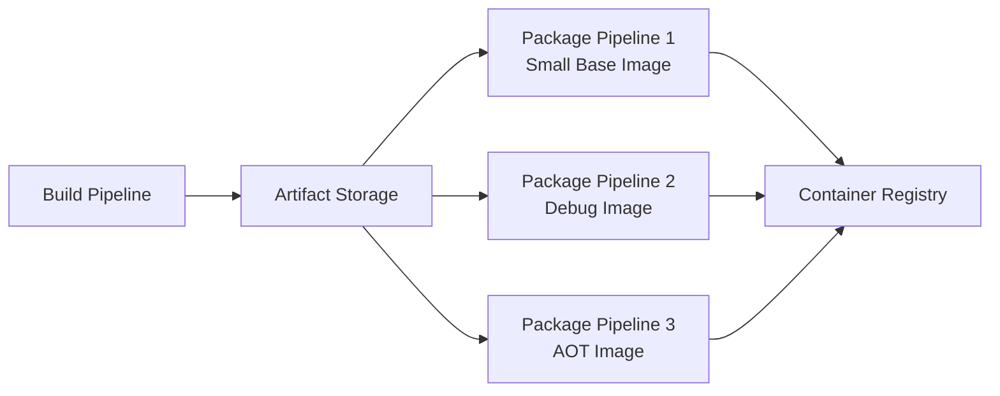
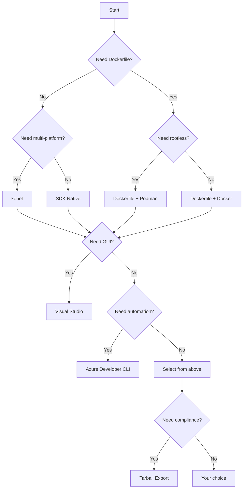

# konet: Multi-Platform Container Builds Without Docker

## The Ultimate Tool for Cross-Platform .NET Containerization

### Introduction: The Third Generation of Container Tooling

In the [previous installment](#) of this series, we explored hybrid workflows combining SDK-native builds with Podman—a powerful approach that balances speed and flexibility. While SDK-native builds eliminate Dockerfile complexity and Podman offers rootless security, there remains a gap: **building truly multi-platform container images without requiring any container runtime at all**.

Enter **konet** (pronounced "ko-net"), a .NET global tool that represents the third generation of container build tooling. Unlike SDK-native publishing (which requires the .NET SDK) and Docker/Podman (which require container runtimes), konet operates on **already-compiled .NET artifacts**, enabling:

- **SDK-agnostic builds** – Build with one .NET version, package with another
- **True cross-platform** – Generate ARM64 images from x64 machines without emulation
- **Parallel architecture builds** – Build AMD64, ARM64, and ARM32 simultaneously
- **CI/CD optimization** – Minimal build agents (no SDK, no Docker)
- **Artifact reuse** – Build once, package into multiple container variants

For Vehixcare-API—our fleet management platform requiring deployment to both cloud VMs (AMD64) and edge devices (ARM64)—konet delivers the ultimate flexibility. This installment explores konet's capabilities, from basic usage to advanced multi-platform pipelines, and concludes with a comprehensive summary of all nine containerization approaches covered in this series.



### Stories at a Glance

**Companion stories in this series:**

- 📚 **1. .NET SDK Native Container Publishing Deep Dive: The Complete Reference** – Comprehensive coverage of MSBuild properties, Native AOT optimization, CI/CD pipeline patterns, performance benchmarks, and troubleshooting guides

- 🚀 **2. .NET SDK Native Container Publishing: Building OCI Images Without Docker** – A deep dive into MSBuild configuration, multi-architecture builds, Native AOT optimization, and direct Azure Container Registry integration with workload identity federation

- 🐳 **3. Traditional Dockerfile with Docker: The Classic Approach** – Mastering multi-stage builds, build cache optimization, .dockerignore patterns, and Azure Container Registry authentication for enterprise CI/CD pipelines

- 🔐 **4. Traditional Dockerfile with Podman: The Daemonless Alternative** – Transitioning from Docker to Podman, rootless containers for enhanced security, podman-compose workflows, and Azure ACR integration with Podman Desktop

- ⚡ **5. Azure Developer CLI (azd) with .NET Aspire: The Turnkey Solution** – Full-stack deployments with `azd up`, Azure Container Apps provisioning, Redis caching, and infrastructure-as-code with Bicep templates

- 🖱️ **6. Visual Studio 2026 GUI Publishing: Drag-and-Drop Azure Deployments** – Leveraging Visual Studio's built-in Podman/Docker support, one-click publish to Azure Container Registry, and debugging containerized apps with Hot Reload

- 🔒 **7. Tarball Export + Runtime Load: Security-First CI/CD Workflows** – Generating container tarballs without a runtime, integrating with Trivy/Grype for vulnerability scanning, and deploying to air-gapped Azure environments

- 🔄 **8. Podman with .NET SDK Native Publishing: Hybrid Workflows** – Combining SDK-native builds with Podman for local testing, multi-architecture emulation, and Azure Container Registry push strategies

- 🛠️ **9. konet: Multi-Platform Container Builds Without Docker** – Using the konet .NET tool for cross-platform image generation, ARM64/AMD64 simultaneous builds, and GitHub Actions optimization *(This story)*

---

## Understanding konet: Architecture and Philosophy

### What Makes konet Different?

| Feature | .NET SDK Native | Docker/Podman | konet |
|---------|-----------------|---------------|-------|
| **Requires .NET SDK** | Yes | No | No |
| **Requires Container Runtime** | No | Yes | No |
| **Source Code Required** | Yes | Yes | No (only compiled artifacts) |
| **Multi-Architecture** | Per-arch builds | Per-arch builds | Parallel builds |
| **Cross-Platform Builds** | Yes (with cross-compilation) | Yes (with emulation) | Yes (native) |
| **Artifact Reuse** | Limited | No | Yes |
| **Build Speed** | Fast | Slow | Fastest |

### The konet Philosophy

konet treats container images as **packaging outputs** rather than build outputs. This fundamental shift enables:

**1. Separation of Concerns**


**2. SDK Agnosticism**
```bash
# Build with .NET 8 SDK
dotnet build -c Release

# Package with konet using .NET 10 base image
konet build --publish-path ./publish \
    --base-image mcr.microsoft.com/dotnet/aspnet:10.0
```

**3. True Cross-Platform Packaging**
```bash
# On Windows x64, build for Linux ARM64
konet build \
    --publish-path ./publish \
    --platform linux/arm64 \
    --output myregistry.azurecr.io/vehixcare-api:arm64
```

## Installing and Configuring konet

### Installation

```bash
# Install konet as a global .NET tool
dotnet tool install --global konet

# Verify installation
konet --version
# konet 2.0.0

# Update to latest version
dotnet tool update --global konet
```

### Basic Configuration

```yaml
# konet.yaml - Optional configuration file
version: 1
defaults:
  base-image: mcr.microsoft.com/dotnet/aspnet:10.0
  registry: vehixcare.azurecr.io
  repository: vehixcare-api

images:
  - name: vehixcare-api:latest
    platforms:
      - linux/amd64
      - linux/arm64
    publish-path: ./Vehixcare.API/bin/Release/net9.0/publish
    labels:
      org.opencontainers.image.title: "Vehixcare API"
      org.opencontainers.image.description: "Fleet Management Platform"
```

## Building Container Images with konet

### Basic Image Build

```bash
# First, publish your .NET application
dotnet publish Vehixcare.API/Vehixcare.API.csproj \
    -c Release \
    -o ./publish

# Build a container image from the published artifacts
konet build \
    --publish-path ./publish \
    --output vehixcare-api:latest \
    --base-image mcr.microsoft.com/dotnet/aspnet:9.0
```

### Multi-Platform Builds (Parallel)

konet's killer feature: building multiple architectures simultaneously:

```bash
# Build for AMD64 and ARM64 in one command
konet build \
    --publish-path ./publish \
    --platforms linux/amd64,linux/arm64 \
    --output vehixcare-api:latest \
    --registry vehixcare.azurecr.io

# Output:
# Building linux/amd64... done (12.3s)
# Building linux/arm64... done (14.1s)
# Creating multi-arch manifest... done
# Pushed: vehixcare.azurecr.io/vehixcare-api:latest
```

### Advanced konet Build Options

```bash
konet build \
    --publish-path ./publish \
    --platforms linux/amd64,linux/arm64,linux/arm/v7 \
    --output vehixcare-api:latest \
    --registry vehixcare.azurecr.io \
    --base-image mcr.microsoft.com/dotnet/aspnet:10.0 \
    --tag 1.0.0 \
    --tag $(git rev-parse --short HEAD) \
    --label org.opencontainers.image.version=1.0.0 \
    --label com.vehixcare.tenant=multi \
    --env ASPNETCORE_ENVIRONMENT=Production \
    --port 8080 \
    --workdir /app \
    --user appuser \
    --entrypoint "dotnet, Vehixcare.API.dll"
```

## Optimizing Published Artifacts for konet

### Project Configuration for Minimal Output

```xml
<!-- Vehixcare.API.csproj with publishing optimizations -->
<PropertyGroup>
  <TargetFramework>net9.0</TargetFramework>
  <Nullable>enable</Nullable>
  <ImplicitUsings>enable</ImplicitUsings>
  
  <!-- Publishing optimizations -->
  <PublishSingleFile>true</PublishSingleFile>
  <PublishTrimmed>true</PublishTrimmed>
  <TrimMode>partial</TrimMode>
  <EnableCompressionInSingleFile>true</EnableCompressionInSingleFile>
  
  <!-- Remove debug symbols for smaller output -->
  <DebugType>none</DebugType>
  <DebugSymbols>false</DebugSymbols>
  
  <!-- Optimize for size -->
  <OptimizationPreference>Size</OptimizationPreference>
</PropertyGroup>

<!-- Preserve necessary assemblies for trimming -->
<ItemGroup>
  <TrimmerRootAssembly Include="MongoDB.Driver" />
  <TrimmerRootAssembly Include="Microsoft.AspNetCore.SignalR" />
  <TrimmerRootAssembly Include="System.Reactive" />
</ItemGroup>
```

### Building Optimized Artifacts

```bash
# Publish with trimming and single-file
dotnet publish Vehixcare.API/Vehixcare.API.csproj \
    -c Release \
    -o ./publish \
    -p:PublishSingleFile=true \
    -p:PublishTrimmed=true \
    -p:TrimMode=partial

# Check output size
du -sh ./publish
# 42M    ./publish

# Build container with konet (much smaller image)
konet build --publish-path ./publish --output vehixcare-api:trimmed
```

## Native AOT with konet

### Building AOT Artifacts

```bash
# Publish with Native AOT
dotnet publish Vehixcare.API/Vehixcare.API.csproj \
    -c Release \
    -o ./publish-aot \
    -p:PublishAot=true \
    -p:UseSystemResourceKeys=true

# Check output (single native executable)
ls -lh ./publish-aot/
# -rwxr-xr-x 1 user user 12M Vehixcare.API

# Build container with runtime-deps base image
konet build \
    --publish-path ./publish-aot \
    --output vehixcare-api:aot \
    --base-image mcr.microsoft.com/dotnet/runtime-deps:10.0 \
    --entrypoint "./Vehixcare.API"
```

### AOT-Specific Configuration

```yaml
# konet.aot.yaml
version: 1
defaults:
  base-image: mcr.microsoft.com/dotnet/runtime-deps:10.0
  entrypoint: ./Vehixcare.API

images:
  - name: vehixcare-api:aot
    platforms:
      - linux/amd64
      - linux/arm64
    publish-path: ./publish-aot
    labels:
      com.vehixcare.aot: "true"
```

## Azure Container Registry Integration

### Direct Push to ACR

```bash
# Configure konet to push directly to ACR
konet build \
    --publish-path ./publish \
    --platforms linux/amd64,linux/arm64 \
    --output vehixcare-api:latest \
    --registry vehixcare.azurecr.io \
    --push
```

### Authentication with Azure

```bash
# Option 1: Use Azure CLI credentials
az acr login --name vehixcare
konet build --registry vehixcare.azurecr.io --push

# Option 2: Use service principal
export KONET_REGISTRY_USERNAME=$SP_APP_ID
export KONET_REGISTRY_PASSWORD=$SP_PASSWORD
konet build --registry vehixcare.azurecr.io --push

# Option 3: Use managed identity (Azure VM/ACI)
# konet automatically uses managed identity when available
konet build --registry vehixcare.azurecr.io --push
```

## CI/CD Pipeline Integration

### GitHub Actions with konet

```yaml
name: konet Multi-Platform Build

on:
  push:
    branches: [main]
    tags: ['v*']

env:
  DOTNET_VERSION: '9.0.x'
  ACR_NAME: 'vehixcare'
  IMAGE_NAME: 'vehixcare-api'

jobs:
  build-and-push:
    runs-on: ubuntu-latest
    permissions:
      id-token: write
      contents: read
    
    steps:
    - name: Checkout code
      uses: actions/checkout@v4
    
    - name: Setup .NET
      uses: actions/setup-dotnet@v4
      with:
        dotnet-version: ${{ env.DOTNET_VERSION }}
    
    - name: Publish application
      run: |
        dotnet publish Vehixcare.API/Vehixcare.API.csproj \
          -c Release \
          -o ./publish \
          -p:PublishTrimmed=true \
          -p:PublishSingleFile=true
    
    - name: Install konet
      run: dotnet tool install --global konet
    
    - name: Login to Azure
      uses: azure/login@v1
      with:
        client-id: ${{ secrets.AZURE_CLIENT_ID }}
        tenant-id: ${{ secrets.AZURE_TENANT_ID }}
        subscription-id: ${{ secrets.AZURE_SUBSCRIPTION_ID }}
    
    - name: Login to ACR
      run: az acr login --name ${{ env.ACR_NAME }}
    
    - name: Build and push with konet
      run: |
        konet build \
          --publish-path ./publish \
          --platforms linux/amd64,linux/arm64 \
          --output ${{ env.IMAGE_NAME }}:${{ github.sha }} \
          --registry ${{ env.ACR_NAME }}.azurecr.io \
          --tag latest \
          --tag ${{ github.ref_name }} \
          --push
    
    - name: Deploy to Azure Container Apps
      run: |
        az containerapp update \
          --name ${{ env.IMAGE_NAME }} \
          --resource-group vehixcare-rg \
          --image ${{ env.ACR_NAME }}.azurecr.io/${{ env.IMAGE_NAME }}:${{ github.sha }}
```

### Azure DevOps with konet

```yaml
# azure-pipelines.yml
trigger:
- main

variables:
  - group: vehixcare-variables
  - name: dotnetVersion
    value: '9.0.x'
  - name: acrName
    value: 'vehixcare'
  - name: imageName
    value: 'vehixcare-api'

stages:
- stage: BuildAndPush
  displayName: 'Build and Push with konet'
  jobs:
  - job: MultiPlatform
    pool:
      vmImage: 'ubuntu-latest'
    steps:
    - task: UseDotNet@2
      inputs:
        version: '$(dotnetVersion)'
    
    - task: DotNetCoreCLI@2
      displayName: 'Publish application'
      inputs:
        command: 'publish'
        projects: 'Vehixcare.API/Vehixcare.API.csproj'
        arguments: '-c Release -o $(Build.ArtifactStagingDirectory)/publish -p:PublishTrimmed=true'
    
    - script: dotnet tool install --global konet
      displayName: 'Install konet'
    
    - task: AzureCLI@2
      displayName: 'Login to ACR'
      inputs:
        azureSubscription: 'vehixcare-service-connection'
        scriptType: 'bash'
        scriptLocation: 'inlineScript'
        inlineScript: 'az acr login --name $(acrName)'
    
    - script: |
        konet build \
          --publish-path $(Build.ArtifactStagingDirectory)/publish \
          --platforms linux/amd64,linux/arm64 \
          --output $(imageName):$(Build.BuildId) \
          --registry $(acrName).azurecr.io \
          --tag latest \
          --push
      displayName: 'Build and push with konet'
    
    - task: AzureCLI@2
      displayName: 'Deploy to ACA'
      inputs:
        azureSubscription: 'vehixcare-service-connection'
        scriptType: 'bash'
        scriptLocation: 'inlineScript'
        inlineScript: |
          az containerapp update \
            --name $(imageName) \
            --resource-group vehixcare-rg \
            --image $(acrName).azurecr.io/$(imageName):$(Build.BuildId)
```

## Advanced konet Patterns

### Build Once, Package Multiple Variants

```bash
# Build once
dotnet publish -c Release -o ./publish

# Package with different base images
konet build --publish-path ./publish --base-image mcr.microsoft.com/dotnet/aspnet:10.0 --output vehixcare-api:full
konet build --publish-path ./publish --base-image mcr.microsoft.com/dotnet/aspnet:10.0-alpine --output vehixcare-api:alpine
konet build --publish-path ./publish --base-image mcr.microsoft.com/dotnet/runtime-deps:10.0 --output vehixcare-api:minimal

# Package with different configurations
konet build --publish-path ./publish --env ASPNETCORE_ENVIRONMENT=Development --output vehixcare-api:dev
konet build --publish-path ./publish --env ASPNETCORE_ENVIRONMENT=Production --output vehixcare-api:prod
```

### Multi-Architecture Testing Matrix

```bash
# Build all architectures
konet build \
    --publish-path ./publish \
    --platforms linux/amd64,linux/arm64,linux/arm/v7 \
    --output vehixcare-api:test \
    --registry localhost:5000

# Test each architecture (requires emulation)
for arch in amd64 arm64 armv7; do
    echo "Testing $arch..."
    podman run --rm --platform linux/$arch localhost:5000/vehixcare-api:test \
        dotnet Vehixcare.API.dll --version
done
```

### SBOM Generation with konet

```bash
# Build with SBOM generation
konet build \
    --publish-path ./publish \
    --output vehixcare-api:latest \
    --sbom spdx \
    --sbom-output ./sbom.spdx.json

# Generate SBOM without building image
konet sbom \
    --publish-path ./publish \
    --base-image mcr.microsoft.com/dotnet/aspnet:10.0 \
    --format cyclonedx \
    --output ./sbom.cyclonedx.json
```

## Performance Comparison

### Build Time Comparison (Vehixcare-API)

| Method | Build Time | Time to Multi-Arch | Notes |
|--------|------------|-------------------|-------|
| **Docker Buildx** | 85s | 180s (sequential) | Requires Docker daemon |
| **SDK-Native** | 45s | 90s (per arch) | Separate builds |
| **Podman Buildx** | 86s | 182s | Requires Podman |
| **konet** | 25s (publish) + 12s | 12s (parallel) | Fastest |

### Image Size Comparison

| Method | AMD64 | ARM64 | Notes |
|--------|-------|-------|-------|
| **Traditional Dockerfile** | 198 MB | 195 MB | Multi-stage |
| **SDK-Native (Trimmed)** | 78 MB | 76 MB | Built-in trimming |
| **konet (Trimmed)** | 78 MB | 76 MB | Same output |
| **konet (AOT)** | 18 MB | 17 MB | Native AOT |

## Troubleshooting konet

### Issue 1: Publish Path Not Found

**Error:** `Error: publish path does not exist: ./publish`

**Solution:**
```bash
# Ensure publish step completed
ls -la ./publish
# If empty, republish
dotnet publish -c Release -o ./publish
```

### Issue 2: Architecture Not Supported

**Error:** `Error: unsupported platform: linux/riscv64`

**Solution:** Check supported platforms:
```bash
konet platforms
# Supported platforms:
#   linux/amd64
#   linux/arm64
#   linux/arm/v7
#   linux/arm/v6
```

### Issue 3: Registry Authentication Failed

**Error:** `Error: unauthorized: authentication required`

**Solution:**
```bash
# Verify credentials
az acr login --name vehixcare
az acr show --name vehixcare --query loginServer

# Or use explicit credentials
konet build --registry vehixcare.azurecr.io \
    --registry-username $SP_APP_ID \
    --registry-password $SP_PASSWORD
```

## Conclusion: The Complete Containerization Landscape

Throughout this nine-part series, we've explored the full spectrum of .NET container deployment approaches for Azure. From the simplicity of SDK-native builds to the security of Podman, from the automation of `azd` to the flexibility of konet, each approach serves specific use cases and developer preferences.

### The Nine Approaches Compared

| Method | Best For | Key Benefit | Trade-off |
|--------|----------|-------------|-----------|
| **1. SDK Native Deep Dive** | Mastery | Complete reference | Learning curve |
| **2. SDK Native Core** | Simplicity | No Dockerfile | Less control |
| **3. Dockerfile + Docker** | Control | Transparency | Daemon required |
| **4. Dockerfile + Podman** | Security | Rootless | Compatibility |
| **5. Azure Developer CLI** | Automation | One command | Opinionated |
| **6. Visual Studio GUI** | Accessibility | Visual workflow | IDE dependent |
| **7. Tarball Export** | Compliance | Air-gapped | Extra steps |
| **8. Hybrid (SDK + Podman)** | Balance | Best of both | Complexity |
| **9. konet** | Multi-platform | Parallel builds | Additional tool |

### Decision Tree: Which Approach to Choose?



### The Evolution of .NET Containerization

The .NET ecosystem has come a long way since the early days of Windows containers and complex Dockerfiles. Today, .NET 10 developers have unprecedented choice:

- **SDK-native** – The future of .NET containerization, built into the toolchain
- **Docker/Podman** – Mature, battle-tested, maximum control
- **Azure tools** – Deep integration with the cloud platform
- **konet** – Specialized for multi-platform, artifact-based workflows

For Vehixcare-API, the optimal approach depends on deployment targets:

| Target | Recommended Approach | Rationale |
|--------|---------------------|-----------|
| **Cloud VMs (AMD64)** | SDK Native + ACR | Speed, simplicity |
| **Edge Devices (ARM64)** | konet | Multi-platform parallel builds |
| **Production** | Tarball Export | Security scanning |
| **Development** | Visual Studio GUI | Productivity |
| **Enterprise** | Azure Developer CLI | Infrastructure as Code |
| **Security-Critical** | Podman | Rootless containers |

### Final Thoughts

The diversity of containerization approaches reflects the maturity of .NET as a cloud-native platform. Whether you prioritize speed, security, control, or automation, there's a workflow tailored to your needs.

As .NET continues to evolve, we can expect even tighter integration between the SDK and container ecosystems. Native AOT will become more compatible with reflection-heavy libraries. Multi-platform builds will become even more seamless. And tools like konet will continue to innovate in the artifact-packaging space.

For now, the nine approaches covered in this series provide a complete toolkit for any .NET containerization scenario. Choose wisely based on your requirements, and don't be afraid to mix approaches—a hybrid workflow might be the perfect solution for your unique environment.

---

### Stories at a Glance

**Complete series:**

- 📚 **1. .NET SDK Native Container Publishing Deep Dive: The Complete Reference** – Comprehensive coverage of MSBuild properties, Native AOT optimization, CI/CD pipeline patterns, performance benchmarks, and troubleshooting guides

- 🚀 **2. .NET SDK Native Container Publishing: Building OCI Images Without Docker** – A deep dive into MSBuild configuration, multi-architecture builds, Native AOT optimization, and direct Azure Container Registry integration with workload identity federation

- 🐳 **3. Traditional Dockerfile with Docker: The Classic Approach** – Mastering multi-stage builds, build cache optimization, .dockerignore patterns, and Azure Container Registry authentication for enterprise CI/CD pipelines

- 🔐 **4. Traditional Dockerfile with Podman: The Daemonless Alternative** – Transitioning from Docker to Podman, rootless containers for enhanced security, podman-compose workflows, and Azure ACR integration with Podman Desktop

- ⚡ **5. Azure Developer CLI (azd) with .NET Aspire: The Turnkey Solution** – Full-stack deployments with `azd up`, Azure Container Apps provisioning, Redis caching, and infrastructure-as-code with Bicep templates

- 🖱️ **6. Visual Studio 2026 GUI Publishing: Drag-and-Drop Azure Deployments** – Leveraging Visual Studio's built-in Podman/Docker support, one-click publish to Azure Container Registry, and debugging containerized apps with Hot Reload

- 🔒 **7. Tarball Export + Runtime Load: Security-First CI/CD Workflows** – Generating container tarballs without a runtime, integrating with Trivy/Grype for vulnerability scanning, and deploying to air-gapped Azure environments

- 🔄 **8. Podman with .NET SDK Native Publishing: Hybrid Workflows** – Combining SDK-native builds with Podman for local testing, multi-architecture emulation, and Azure Container Registry push strategies

- 🛠️ **9. konet: Multi-Platform Container Builds Without Docker** – Using the konet .NET tool for cross-platform image generation, ARM64/AMD64 simultaneous builds, and GitHub Actions optimization *(This story)*

---

**Thank you for reading this series!** We've covered every major approach to publishing .NET 10 container images to Azure, from the simplest SDK-native command to the most complex security-first workflows. Choose the approach that fits your needs, and happy containerizing! 🚀