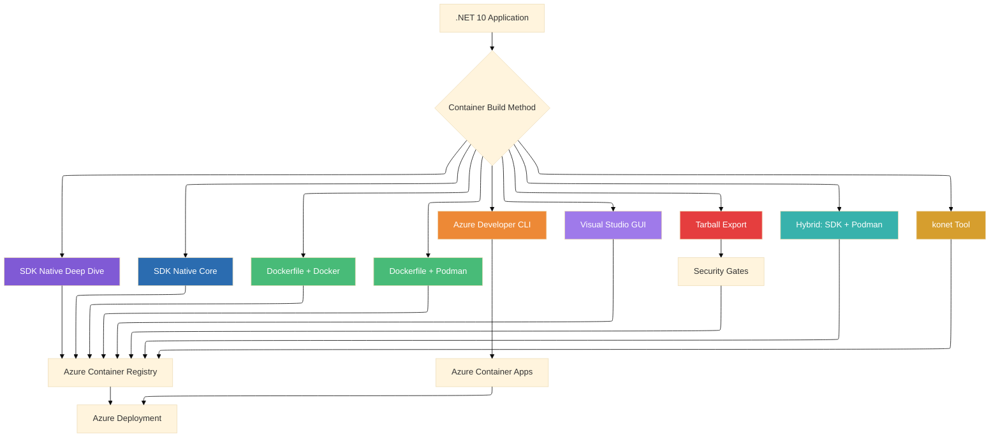

# This shift reflects a broader industry trend: the 

```mermaid
---
config:
  theme: base
  layout: elk
---
graph TD
    A[.NET 10 Application] --> B{Container Build Method}
    
    B --> C[SDK Native Deep Dive]
    B --> D[SDK Native Core]
    B --> E[Dockerfile + Docker]
    B --> F[Dockerfile + Podman]
    B --> G[Azure Developer CLI]
    B --> H[Visual Studio GUI]
    B --> I[Tarball Export]
    B --> J[Hybrid: SDK + Podman]
    B --> K[konet Tool]
    
    C --> L[Azure Container Registry]
    D --> L
    E --> L
    F --> L
    G --> M[Azure Container Apps]
    H --> L
    I --> N[Security Gates]
    J --> L
    K --> L
    
    N --> L
    L --> O[Azure Deployment]
    M --> O
    
    style C fill:#805ad5,color:#fff
    style D fill:#2b6cb0,color:#fff
    style E fill:#48bb78,color:#fff
    style F fill:#48bb78,color:#fff
    style G fill:#ed8936,color:#fff
    style H fill:#9f7aea,color:#fff
    style I fill:#e53e3e,color:#fff
    style J fill:#38b2ac,color:#fff
    style K fill:#d69e2e,color:#fff
```
