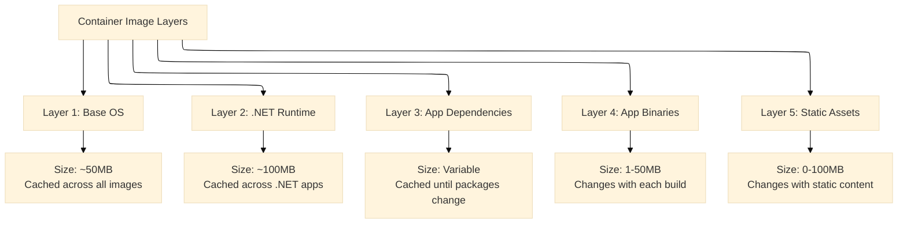

# ### Layer Structure Analysis

```mermaid
---
config:
  theme: base
  layout: elk
---
graph TD
    A[Container Image Layers] --> B[Layer 1: Base OS]
    A --> C[Layer 2: .NET Runtime]
    A --> D[Layer 3: App Dependencies]
    A --> E[Layer 4: App Binaries]
    A --> F[Layer 5: Static Assets]
    
    B --> B1[Size: ~50MB<br/>Cached across all images]
    C --> C1[Size: ~100MB<br/>Cached across .NET apps]
    D --> D1[Size: Variable<br/>Cached until packages change]
    E --> E1[Size: 1-50MB<br/>Changes with each build]
    F --> F1[Size: 0-100MB<br/>Changes with static content]
```
