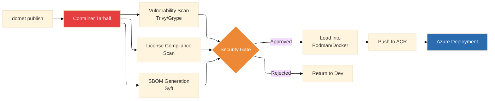

# In regulated industries and security-conscious org

```mermaid
---
config:
  theme: base
  layout: elk
---
graph LR
    A[dotnet publish] --> B[Container Tarball]
    B --> C[Vulnerability Scan<br/>Trivy/Grype]
    B --> D[License Compliance<br/>Scan]
    B --> E[SBOM Generation<br/>Syft]
    
    C --> F{Security Gate}
    D --> F
    E --> F
    
    F -->|Approved| G[Load into<br/>Podman/Docker]
    F -->|Rejected| H[Return to Dev]
    
    G --> I[Push to ACR]
    I --> J[Azure Deployment]
    
    style B fill:#e53e3e,color:#fff
    style F fill:#ed8936,color:#fff
    style J fill:#2b6cb0,color:#fff
```
