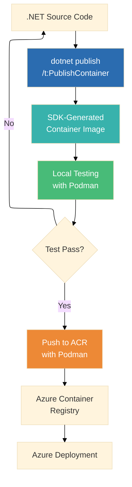

# The combination of .NET SDK-native container publi

```mermaid
---
config:
  theme: base
  layout: elk
---
graph TD
    A[.NET Source Code] --> B[dotnet publish<br/>/t:PublishContainer]
    B --> C[SDK-Generated<br/>Container Image]
    
    C --> D[Local Testing<br/>with Podman]
    D --> E{Test Pass?}
    
    E -->|No| A
    E -->|Yes| F[Push to ACR<br/>with Podman]
    
    F --> G[Azure Container<br/>Registry]
    G --> H[Azure Deployment]
    
    style B fill:#2b6cb0,color:#fff
    style C fill:#38b2ac,color:#fff
    style D fill:#48bb78,color:#fff
    style F fill:#ed8936,color:#fff
```
