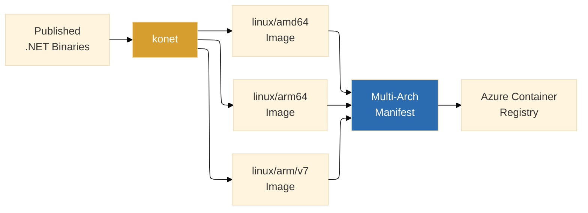

# This command builds both AMD64 and ARM64 images, c

```mermaid
---
config:
  theme: base
  layout: elk
---
graph LR
    A[Published<br/>.NET Binaries] --> B[konet]
    
    B --> C[linux/amd64<br/>Image]
    B --> D[linux/arm64<br/>Image]
    B --> E[linux/arm/v7<br/>Image]
    
    C --> F[Multi-Arch<br/>Manifest]
    D --> F
    E --> F
    
    F --> G[Azure Container<br/>Registry]
    
    style B fill:#d69e2e,color:#fff
    style F fill:#2b6cb0,color:#fff
```
