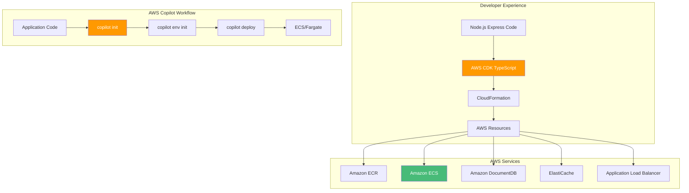

# AWS CDK & Copilot: Multi-Cloud Node.js Container Deployments

## Deploying Express.js Applications to AWS ECS with Infrastructure as Code

### Introduction: The Multi-Cloud Node.js Strategy

In the [previous installment](#) of this Node.js series, we explored GitHub Actions CI/CD—the automation backbone that enables teams to ship Express.js applications faster and safer. While Azure provides a robust platform for Node.js workloads, many organizations adopt a **multi-cloud strategy**—deploying applications across Azure, AWS, and on-premises to ensure resilience, avoid vendor lock-in, and optimize costs.

For the **AI Powered Video Tutorial Portal**—an Express.js application with MongoDB integration, Winston logging, and comprehensive REST API endpoints—AWS provides powerful container services that complement Azure deployments. **AWS CDK (Cloud Development Kit)** and **AWS Copilot** represent the infrastructure-as-code tools that bring the same developer experience to AWS that Node.js developers enjoy with Azure.

This final installment explores the complete workflow for deploying Express.js applications to AWS using CDK and Copilot. We'll master infrastructure-as-code with TypeScript, deploy to Amazon ECS with Fargate, configure load balancers, integrate with AWS services (DocumentDB, ElastiCache, Secrets Manager), and implement GitOps workflows—all while maintaining the ability to deploy across both Azure and AWS from a single codebase.



### Stories at a Glance

**Complete Node.js series (10 stories):**

- 📦 **1. NPM + Docker Multi-Stage: The Classic Node.js Approach** – Leveraging npm with optimized multi-stage Docker builds for Express.js applications on Azure Container Registry

- 🧶 **2. Yarn + Docker: Deterministic Dependency Management** – Using Yarn for reproducible builds with Yarn Berry and Plug'n'Play for optimal container performance

- ⚡ **3. pnpm + Docker: Disk-Efficient Node.js Containers** – Leveraging pnpm's content-addressable storage for faster installs and smaller images

- 🚀 **4. Azure Container Apps: Serverless Node.js Deployment** – Deploying Express.js applications to Azure Container Apps with auto-scaling and managed infrastructure

- 💻 **5. Visual Studio Code Dev Containers: Local Development to Production** – Using VS Code Dev Containers for consistent Node.js development environments that mirror Azure production

- 🔧 **6. Azure Developer CLI (azd) with Node.js: The Turnkey Solution** – Full-stack deployments with `azd up`, Azure Container Apps provisioning, and infrastructure-as-code with Bicep

- 🔒 **7. Tarball Export + Runtime Load: Security-First CI/CD Workflows** – Generating container tarballs, integrating with Trivy/Grype for vulnerability scanning, and deploying to air-gapped Azure environments

- ☸️ **8. Azure Kubernetes Service (AKS): Node.js Microservices at Scale** – Deploying Express.js applications to AKS, Helm charts, GitOps with Flux, and production-grade operations

- 🤖 **9. GitHub Actions + Container Registry: CI/CD for Node.js** – Automated container builds, testing, and deployment with GitHub Actions workflows to Azure

- 🏗️ **10. AWS CDK & Copilot: Multi-Cloud Node.js Container Deployments** – Deploying Node.js Express applications to AWS ECS with AWS Copilot, infrastructure-as-code with CDK, and Fargate serverless orchestration *(This story)*

---

## Understanding AWS CDK for Node.js Developers

### What Is AWS CDK?

The AWS Cloud Development Kit (CDK) is an open-source software development framework that allows developers to define cloud infrastructure using familiar programming languages—including TypeScript. For Node.js Express developers, this is a game-changer: infrastructure becomes code, with all the benefits of abstraction, reuse, and type safety.

| Concept | Description | Node.js Analogy |
|---------|-------------|-----------------|
| **Construct** | The basic building block of CDK apps | A TypeScript class |
| **Stack** | A unit of deployment, maps to CloudFormation | A deployment unit |
| **App** | Container for one or more stacks | A TypeScript module |
| **Environment** | Target AWS account and region | Configuration |
| **Aspect** | Cross-cutting concerns (e.g., tagging) | TypeScript decorators |

### Installing AWS CDK

```bash
# Install Node.js (required for CDK CLI)
# On Ubuntu/Debian
curl -fsSL https://deb.nodesource.com/setup_18.x | sudo -E bash -
sudo apt-get install -y nodejs

# On macOS
brew install node

# Install CDK CLI globally
npm install -g aws-cdk

# Verify installation
cdk --version
# 2.100.0

# Create a new CDK project in TypeScript
mkdir courses-portal-infra
cd courses-portal-infra
cdk init app --language typescript

# Install additional dependencies
npm install @aws-cdk/aws-ecs-patterns @aws-cdk/aws-docdb @aws-cdk/aws-elasticache
```

---

## AWS Copilot: The Turnkey Solution for Containers

### What Is AWS Copilot?

AWS Copilot is a command-line tool that abstracts the complexity of deploying containerized applications to AWS. It provides a simplified, opinionated workflow that works out of the box with best practices for Node.js Express applications.

| Concept | Description | AWS Service |
|---------|-------------|-------------|
| **Application** | Collection of related services | Parent container |
| **Service** | Containerized workload | ECS service |
| **Environment** | Deployment target (dev, staging, prod) | Account/region |
| **Job** | One-time or scheduled task | ECS task |
| **Pipeline** | CI/CD automation | CodePipeline |

### Installing AWS Copilot

```bash
# Install Copilot on macOS/Linux
curl -Lo copilot https://github.com/aws/copilot-cli/releases/latest/download/copilot-linux
chmod +x copilot
sudo mv copilot /usr/local/bin/copilot

# Or on macOS with Homebrew
brew install aws/tap/copilot-cli

# Verify installation
copilot --version
# 1.30.0

# Configure AWS credentials (if not already)
aws configure
```

---

## AWS CDK Infrastructure for Express.js

### Step 1: CDK Project Setup

```typescript
// bin/courses-portal.ts
#!/usr/bin/env node
import * as cdk from 'aws-cdk-lib';
import { CoursesPortalStack } from '../lib/courses-portal-stack';

const app = new cdk.App();

// Production stack
new CoursesPortalStack(app, 'CoursesPortalStack-Prod', {
  env: {
    account: process.env.CDK_DEFAULT_ACCOUNT,
    region: 'us-east-1'
  },
  environmentName: 'production',
  tags: {
    Environment: 'Production',
    Application: 'CoursesPortal',
    ManagedBy: 'CDK'
  }
});

// Development stack
new CoursesPortalStack(app, 'CoursesPortalStack-Dev', {
  env: {
    account: process.env.CDK_DEFAULT_ACCOUNT,
    region: 'us-east-1'
  },
  environmentName: 'development',
  tags: {
    Environment: 'Development',
    Application: 'CoursesPortal',
    ManagedBy: 'CDK'
  }
});

app.synth();
```

### Step 2: Main Stack Definition

```typescript
// lib/courses-portal-stack.ts
import * as cdk from 'aws-cdk-lib';
import * as ec2 from 'aws-cdk-lib/aws-ec2';
import * as ecs from 'aws-cdk-lib/aws-ecs';
import * as ecs_patterns from 'aws-cdk-lib/aws-ecs-patterns';
import * as ecr from 'aws-cdk-lib/aws-ecr';
import * as docdb from 'aws-cdk-lib/aws-docdb';
import * as elasticache from 'aws-cdk-lib/aws-elasticache';
import * as secretsmanager from 'aws-cdk-lib/aws-secretsmanager';
import * as iam from 'aws-cdk-lib/aws-iam';
import * as elbv2 from 'aws-cdk-lib/aws-elasticloadbalancingv2';
import { Construct } from 'constructs';

interface CoursesPortalStackProps extends cdk.StackProps {
  environmentName: string;
}

export class CoursesPortalStack extends cdk.Stack {
  constructor(scope: Construct, id: string, props: CoursesPortalStackProps) {
    super(scope, id, props);

    const isProd = props.environmentName === 'production';

    // ============================================
    // VPC CONFIGURATION
    // ============================================
    const vpc = new ec2.Vpc(this, 'CoursesPortalVpc', {
      maxAzs: 3,
      natGateways: isProd ? 1 : 0,
      subnetConfiguration: [
        {
          name: 'Public',
          subnetType: ec2.SubnetType.PUBLIC,
          cidrMask: 24
        },
        {
          name: 'Private',
          subnetType: ec2.SubnetType.PRIVATE_WITH_EGRESS,
          cidrMask: 24
        },
        {
          name: 'Isolated',
          subnetType: ec2.SubnetType.PRIVATE_ISOLATED,
          cidrMask: 24
        }
      ]
    });

    // ============================================
    // ECR REPOSITORY
    // ============================================
    const repository = new ecr.Repository(this, 'CoursesPortalRepo', {
      repositoryName: `courses-portal-api-${props.environmentName}`,
      removalPolicy: isProd ? cdk.RemovalPolicy.RETAIN : cdk.RemovalPolicy.DESTROY,
      imageScanOnPush: true,
      encryption: ecr.RepositoryEncryption.AES_256
    });

    // ============================================
    // SECRETS MANAGER
    // ============================================
    // JWT Secret
    const jwtSecret = new secretsmanager.Secret(this, 'JwtSecret', {
      secretName: `courses-portal/${props.environmentName}/jwt-secret`,
      generateSecretString: {
        secretStringTemplate: JSON.stringify({ secret: '' }),
        generateStringKey: 'secret',
        passwordLength: 32,
        excludePunctuation: true
      }
    });

    // MongoDB Password
    const dbPassword = new secretsmanager.Secret(this, 'DbPassword', {
      secretName: `courses-portal/${props.environmentName}/db-password`,
      generateSecretString: {
        secretStringTemplate: JSON.stringify({ password: '' }),
        generateStringKey: 'password',
        passwordLength: 16
      }
    });

    // ============================================
    // AMAZON DOCUMENTDB (MongoDB-compatible)
    // ============================================
    const dbSecurityGroup = new ec2.SecurityGroup(this, 'DatabaseSecurityGroup', {
      vpc,
      description: 'DocumentDB security group',
      allowAllOutbound: true
    });

    dbSecurityGroup.addIngressRule(
      ec2.Peer.ipv4(vpc.vpcCidrBlock),
      ec2.Port.tcp(27017),
      'Allow MongoDB access from VPC'
    );

    const docdbCluster = new docdb.DatabaseCluster(this, 'CoursesDatabase', {
      masterUser: {
        username: 'courses_admin',
        password: dbPassword.secretValueFromJson('password')
      },
      instanceType: ec2.InstanceType.of(
        ec2.InstanceClass.R5,
        isProd ? ec2.InstanceSize.LARGE : ec2.InstanceSize.SMALL
      ),
      instances: isProd ? 2 : 1,
      vpc,
      vpcSubnets: { subnetType: ec2.SubnetType.PRIVATE_ISOLATED },
      securityGroup: dbSecurityGroup,
      removalPolicy: isProd ? cdk.RemovalPolicy.RETAIN : cdk.RemovalPolicy.DESTROY
    });

    // DocumentDB Connection String Secret
    const dbConnectionSecret = new secretsmanager.Secret(this, 'DbConnectionSecret', {
      secretName: `courses-portal/${props.environmentName}/mongodb-uri`,
      secretStringValue: cdk.Fn.join('', [
        'mongodb://courses_admin:',
        dbPassword.secretValueFromJson('password').toString(),
        '@',
        docdbCluster.clusterEndpoint.socketAddress,
        ':27017/courses_portal?ssl=true&replicaSet=rs0&readPreference=secondaryPreferred'
      ])
    });

    // ============================================
    // ELASTICACHE FOR REDIS
    // ============================================
    const redisSecurityGroup = new ec2.SecurityGroup(this, 'RedisSecurityGroup', {
      vpc,
      description: 'Redis security group',
      allowAllOutbound: true
    });

    redisSecurityGroup.addIngressRule(
      ec2.Peer.ipv4(vpc.vpcCidrBlock),
      ec2.Port.tcp(6379),
      'Allow Redis access from VPC'
    );

    const redisSubnetGroup = new elasticache.CfnSubnetGroup(this, 'RedisSubnetGroup', {
      description: 'Redis subnet group',
      subnetIds: vpc.selectSubnets({ subnetType: ec2.SubnetType.PRIVATE_WITH_EGRESS }).subnetIds
    });

    const redisCluster = new elasticache.CfnCacheCluster(this, 'RedisCluster', {
      clusterName: `courses-portal-redis-${props.environmentName}`,
      engine: 'redis',
      cacheNodeType: isProd ? 'cache.t3.small' : 'cache.t3.micro',
      numCacheNodes: 1,
      vpcSecurityGroupIds: [redisSecurityGroup.securityGroupId],
      cacheSubnetGroupName: redisSubnetGroup.ref
    });

    const redisConnectionSecret = new secretsmanager.Secret(this, 'RedisConnectionSecret', {
      secretName: `courses-portal/${props.environmentName}/redis-uri`,
      secretStringValue: cdk.Fn.join('', [
        'redis://',
        redisCluster.attrRedisEndpointAddress,
        ':6379'
      ])
    });

    // ============================================
    // ECS CLUSTER
    // ============================================
    const cluster = new ecs.Cluster(this, 'CoursesPortalCluster', {
      vpc,
      containerInsights: true
    });

    // ============================================
    // IAM TASK ROLE
    // ============================================
    const taskRole = new iam.Role(this, 'TaskRole', {
      assumedBy: new iam.ServicePrincipal('ecs-tasks.amazonaws.com'),
      managedPolicies: [
        iam.ManagedPolicy.fromAwsManagedPolicyName('SecretsManagerReadWrite'),
        iam.ManagedPolicy.fromAwsManagedPolicyName('CloudWatchAgentServerPolicy'),
        iam.ManagedPolicy.fromAwsManagedPolicyName('AmazonSSMReadOnlyAccess')
      ]
    });

    jwtSecret.grantRead(taskRole);
    dbConnectionSecret.grantRead(taskRole);
    redisConnectionSecret.grantRead(taskRole);

    // ============================================
    // ECS TASK DEFINITION
    // ============================================
    const taskDefinition = new ecs.FargateTaskDefinition(this, 'TaskDefinition', {
      memoryLimitMiB: 1024,
      cpu: 512,
      taskRole
    });

    const container = taskDefinition.addContainer('CoursesApi', {
      image: ecs.ContainerImage.fromEcrRepository(repository, 'latest'),
      logging: ecs.LogDrivers.awsLogs({
        streamPrefix: 'courses-api',
        logGroup: new cdk.aws_logs.LogGroup(this, 'ApiLogGroup', {
          logGroupName: `/ecs/courses-api-${props.environmentName}`,
          retention: cdk.aws_logs.RetentionDays.ONE_MONTH,
          removalPolicy: cdk.RemovalPolicy.DESTROY
        })
      }),
      environment: {
        NODE_ENV: isProd ? 'production' : 'development',
        AWS_REGION: this.region,
        API_KEY_ENABLED: 'true',
        MONGODB_DB: 'courses_portal'
      },
      secrets: {
        JWT_SECRET_KEY: ecs.Secret.fromSecretsManager(jwtSecret, 'secret'),
        MONGODB_URI: ecs.Secret.fromSecretsManager(dbConnectionSecret),
        REDIS_URI: ecs.Secret.fromSecretsManager(redisConnectionSecret)
      },
      portMappings: [{ containerPort: 3000, protocol: ecs.Protocol.TCP }],
      healthCheck: {
        command: ['CMD-SHELL', 'curl -f http://localhost:3000/health || exit 1'],
        interval: cdk.Duration.seconds(30),
        timeout: cdk.Duration.seconds(5),
        retries: 3,
        startPeriod: cdk.Duration.seconds(60)
      }
    });

    // ============================================
    // FARGATE SERVICE WITH LOAD BALANCER
    // ============================================
    const fargateService = new ecs_patterns.ApplicationLoadBalancedFargateService(this, 'CoursesPortalService', {
      cluster,
      serviceName: `courses-portal-api-${props.environmentName}`,
      taskDefinition,
      desiredCount: isProd ? 3 : 1,
      publicLoadBalancer: isProd,
      listenerPort: 443,
      protocol: elbv2.ApplicationProtocol.HTTPS,
      idleTimeout: cdk.Duration.seconds(60),
      healthCheckGracePeriod: cdk.Duration.seconds(60)
    });

    fargateService.targetGroup.configureHealthCheck({
      path: '/health',
      interval: cdk.Duration.seconds(30),
      timeout: cdk.Duration.seconds(5),
      healthyThresholdCount: 2,
      unhealthyThresholdCount: 3,
      port: '3000'
    });

    // ============================================
    // AUTO SCALING
    // ============================================
    if (isProd) {
      const scaling = fargateService.service.autoScaleTaskCount({
        minCapacity: 2,
        maxCapacity: 10
      });

      scaling.scaleOnCpuUtilization('CpuScaling', {
        targetUtilizationPercent: 70,
        scaleInCooldown: cdk.Duration.seconds(60),
        scaleOutCooldown: cdk.Duration.seconds(30)
      });

      scaling.scaleOnMemoryUtilization('MemoryScaling', {
        targetUtilizationPercent: 80,
        scaleInCooldown: cdk.Duration.seconds(60),
        scaleOutCooldown: cdk.Duration.seconds(30)
      });

      scaling.scaleOnRequestCount('RequestScaling', {
        targetRequestsPerSecond: 500,
        scaleInCooldown: cdk.Duration.seconds(60),
        scaleOutCooldown: cdk.Duration.seconds(30)
      });
    }

    // ============================================
    // OUTPUTS
    // ============================================
    new cdk.CfnOutput(this, 'ServiceUrl', {
      value: fargateService.loadBalancer.loadBalancerDnsName,
      description: 'Courses Portal API URL'
    });

    new cdk.CfnOutput(this, 'EcrRepositoryUri', {
      value: repository.repositoryUri,
      description: 'ECR Repository URI'
    });

    new cdk.CfnOutput(this, 'DocumentDbEndpoint', {
      value: docdbCluster.clusterEndpoint.socketAddress,
      description: 'DocumentDB Endpoint'
    });

    new cdk.CfnOutput(this, 'RedisEndpoint', {
      value: redisCluster.attrRedisEndpointAddress,
      description: 'Redis Endpoint'
    });
  }
}
```

### Step 3: Deploy with CDK

```bash
# Bootstrap CDK (one-time per account/region)
cdk bootstrap aws://123456789012/us-east-1

# Synthesize CloudFormation template
cdk synth

# Deploy development stack
cdk deploy CoursesPortalStack-Dev

# Deploy production stack
cdk deploy CoursesPortalStack-Prod

# Output:
# CoursesPortalStack-Prod.ServiceUrl = courses-porta-Course-1234567890.us-east-1.elb.amazonaws.com
# CoursesPortalStack-Prod.EcrRepositoryUri = 123456789012.dkr.ecr.us-east-1.amazonaws.com/courses-portal-api
# CoursesPortalStack-Prod.DocumentDbEndpoint = coursesdatabase.cluster-xxxxx.us-east-1.docdb.amazonaws.com:27017
# CoursesPortalStack-Prod.RedisEndpoint = courses-portal-redis-prod.xxxxx.ng.0001.use1.cache.amazonaws.com
```

---

## AWS Copilot Workflow for Express.js

### Step 1: Initialize Copilot Application

```bash
# Navigate to your Express.js project
cd Courses-Portal-API-NodeJS

# Initialize Copilot app
copilot init \
    --app courses-portal \
    --name api \
    --type "Load Balanced Web Service" \
    --dockerfile ./Dockerfile \
    --port 3000 \
    --deploy

# Copilot creates:
# copilot/
# ├── api/
# │   └── manifest.yml
# └── environments/
```

### Step 2: Configure Service Manifest

```yaml
# copilot/api/manifest.yml
name: api
type: Load Balanced Web Service

# Architecture and platform
platform:
  os: linux
  arch: arm64  # Use Graviton for cost savings

# Container configuration
image:
  build: ./Dockerfile
  port: 3000

# CPU and memory
cpu: 512
memory: 1024

# Environment variables
variables:
  NODE_ENV: production
  AWS_REGION: us-east-1
  API_KEY_ENABLED: "true"
  MONGODB_DB: courses_portal

# Secrets from AWS Secrets Manager
secrets:
  JWT_SECRET_KEY: /copilot/courses-portal/production/secrets/JWT_SECRET_KEY
  MONGODB_URI: /copilot/courses-portal/production/secrets/MONGODB_URI
  REDIS_URI: /copilot/courses-portal/production/secrets/REDIS_URI

# Count and autoscaling
count:
  range: 2-10
  cpu_percentage: 70
  memory_percentage: 80
  requests: 500

# Health check
healthcheck:
  path: /health
  interval: 30s
  timeout: 5s
  healthy_threshold: 2
  unhealthy_threshold: 3

# Network
network:
  vpc:
    placement: private

# Storage
storage:
  volumes:
    logs:
      path: /app/logs
      read_only: false
      efs:
        id: fs-12345678
        uid: 1000
        gid: 1000

# Observability
observability:
  tracing: true
  metrics: true
  logs: true
```

### Step 3: Create Environments

```bash
# Create development environment
copilot env init --name dev --profile default --app courses-portal

# Create production environment
copilot env init --name prod --profile production --app courses-portal

# List environments
copilot env ls
# dev
# prod
```

### Step 4: Deploy to Environments

```bash
# Deploy to development
copilot deploy --env dev

# Deploy to production (with approval)
copilot deploy --env prod

# Output:
# Deploying api to courses-portal-prod environment...
# - Creating ECR repository... done
# - Building container image... done
# - Creating ECS service... done
# - Creating load balancer... done
# Service available at: https://api.courses-portal.awsapp.com
```

---

## Multi-Cloud Strategy: Azure + AWS

### Shared Configuration for Node.js

```javascript
// config.js - Multi-cloud configuration
require('dotenv').config();

const cloudProvider = process.env.CLOUD_PROVIDER || 'azure';

module.exports = {
  // Cloud provider detection
  cloudProvider,
  
  // Database (works with both Azure Cosmos DB and Amazon DocumentDB)
  mongodbUri: process.env.MONGODB_URI || 'mongodb://localhost:27017/courses_portal',
  
  // Redis (Azure Cache for Redis or ElastiCache)
  redisHost: process.env.REDIS_HOST || 'localhost',
  redisPort: parseInt(process.env.REDIS_PORT || '6379', 10),
  
  // JWT
  jwtSecretKey: process.env.JWT_SECRET_KEY || 'dev-secret-key',
  
  // Application
  nodeEnv: process.env.NODE_ENV || 'development',
  port: parseInt(process.env.PORT || '3000', 10),
  
  // Feature flags
  apiKeyEnabled: process.env.API_KEY_ENABLED === 'true',
  continueWatchingEnabled: true,
  bookmarksEnabled: true
};
```

### Azure Deployment Configuration

```yaml
# azure.yaml for Azure Developer CLI
name: courses-portal-api
services:
  api:
    project: .
    host: containerapp
    language: js
    docker:
      path: ./Dockerfile
    target:
      port: 3000
```

### AWS Copilot Manifest

```yaml
# copilot/api/manifest.yml for AWS Copilot
name: api
type: Load Balanced Web Service

image:
  build: ./Dockerfile
  port: 3000

cpu: 512
memory: 1024

variables:
  CLOUD_PROVIDER: aws
  AWS_REGION: us-east-1

secrets:
  JWT_SECRET_KEY: /copilot/courses-portal/production/secrets/JWT_SECRET_KEY
  MONGODB_URI: /copilot/courses-portal/production/secrets/MONGODB_URI
  REDIS_URI: /copilot/courses-portal/production/secrets/REDIS_URI
```

---

## CI/CD Across Clouds with GitHub Actions

### Multi-Cloud GitHub Actions Workflow

```yaml
# .github/workflows/multi-cloud-deploy.yml
name: Multi-Cloud Node.js Deploy

on:
  push:
    branches: [main]
  workflow_dispatch:

jobs:
  deploy-azure:
    runs-on: ubuntu-latest
    environment: azure-production
    steps:
    - uses: actions/checkout@v4
    
    - name: Setup Node.js
      uses: actions/setup-node@v4
      with:
        node-version: '20'
    
    - name: Install dependencies
      run: npm ci
    
    - name: Run tests
      run: npm test
    
    - name: Login to Azure
      uses: azure/login@v1
      with:
        client-id: ${{ secrets.AZURE_CLIENT_ID }}
        tenant-id: ${{ secrets.AZURE_TENANT_ID }}
        subscription-id: ${{ secrets.AZURE_SUBSCRIPTION_ID }}
    
    - name: Deploy with azd
      run: |
        azd up --environment production --no-prompt

  deploy-aws:
    runs-on: ubuntu-latest
    environment: aws-production
    steps:
    - uses: actions/checkout@v4
    
    - name: Setup Node.js
      uses: actions/setup-node@v4
      with:
        node-version: '20'
    
    - name: Install dependencies
      run: npm ci
    
    - name: Run tests
      run: npm test
    
    - name: Configure AWS credentials
      uses: aws-actions/configure-aws-credentials@v2
      with:
        role-to-assume: arn:aws:iam::123456789012:role/github-actions-role
        aws-region: us-east-1
    
    - name: Deploy with Copilot
      run: |
        copilot deploy --env prod --name api
```

---

## Cost Comparison: Azure vs AWS for Node.js

| Service | Azure | AWS | Notes |
|---------|-------|-----|-------|
| **Container Registry** | ACR: $5-15/mo | ECR: $0.10/GB/mo | Comparable |
| **Serverless Containers** | ACA: $0-30/mo | ECS Fargate: $0-40/mo | ACA scale to zero cheaper |
| **MongoDB Compatible** | Cosmos DB: $20-200/mo | DocumentDB: $30-300/mo | Cosmos DB has free tier |
| **Redis** | Cache for Redis: $15-60/mo | ElastiCache: $15-50/mo | Comparable |
| **Load Balancer** | Application Gateway: $25-125/mo | ALB: $20-100/mo | Comparable |
| **Total** | **$65-430/mo** | **$80-490/mo** | Azure slightly cheaper for small workloads |

---

## Conclusion: The Multi-Cloud Advantage for Node.js

AWS CDK and Copilot empower Node.js Express developers to deploy to AWS with the same infrastructure-as-code patterns used in Azure:

- **TypeScript-first infrastructure** – Define AWS resources with TypeScript, not YAML
- **Simplified ECS deployments** – Copilot abstracts complexity
- **Multi-cloud readiness** – Same application code runs on Azure and AWS
- **Cost optimization** – Choose the best cloud for each workload
- **Resilience** – Deploy across clouds for high availability

For the AI Powered Video Tutorial Portal, AWS CDK and Copilot enable:

- **Infrastructure as code** – Full AWS infrastructure defined in TypeScript
- **Rapid deployment** – Deploy to ECS Fargate in minutes
- **Graviton optimization** – 40% cost savings with ARM64
- **Seamless Azure integration** – Multi-cloud deployment strategy
- **Production-ready patterns** – Auto-scaling, health checks, secrets management

AWS CDK represents the future of Node.js infrastructure management—bringing the same developer experience to AWS that Node.js developers love. By mastering these ten approaches, you're now equipped to deploy Express.js applications across any cloud, from Azure to AWS and beyond.

---

### Stories at a Glance

**Complete Node.js series (10 stories):**

- 📦 **1. NPM + Docker Multi-Stage: The Classic Node.js Approach** – Leveraging npm with optimized multi-stage Docker builds for Express.js applications on Azure Container Registry

- 🧶 **2. Yarn + Docker: Deterministic Dependency Management** – Using Yarn for reproducible builds with Yarn Berry and Plug'n'Play for optimal container performance

- ⚡ **3. pnpm + Docker: Disk-Efficient Node.js Containers** – Leveraging pnpm's content-addressable storage for faster installs and smaller images

- 🚀 **4. Azure Container Apps: Serverless Node.js Deployment** – Deploying Express.js applications to Azure Container Apps with auto-scaling and managed infrastructure

- 💻 **5. Visual Studio Code Dev Containers: Local Development to Production** – Using VS Code Dev Containers for consistent Node.js development environments that mirror Azure production

- 🔧 **6. Azure Developer CLI (azd) with Node.js: The Turnkey Solution** – Full-stack deployments with `azd up`, Azure Container Apps provisioning, and infrastructure-as-code with Bicep

- 🔒 **7. Tarball Export + Runtime Load: Security-First CI/CD Workflows** – Generating container tarballs, integrating with Trivy/Grype for vulnerability scanning, and deploying to air-gapped Azure environments

- ☸️ **8. Azure Kubernetes Service (AKS): Node.js Microservices at Scale** – Deploying Express.js applications to AKS, Helm charts, GitOps with Flux, and production-grade operations

- 🤖 **9. GitHub Actions + Container Registry: CI/CD for Node.js** – Automated container builds, testing, and deployment with GitHub Actions workflows to Azure

- 🏗️ **10. AWS CDK & Copilot: Multi-Cloud Node.js Container Deployments** – Deploying Node.js Express applications to AWS ECS with AWS Copilot, infrastructure-as-code with CDK, and Fargate serverless orchestration *(This story)*

---

## What's Next?

This concludes our comprehensive Node.js series on containerizing Express.js applications. We've covered the full spectrum of deployment approaches—from npm and Yarn for dependency management, to Azure Container Apps and AKS for serverless and orchestrated deployments, to multi-cloud strategies with AWS CDK and Copilot.

Whether you're deploying to Azure, AWS, or both, you now have the complete toolkit to succeed with Node.js Express containerization. Each approach serves different use cases, and the right choice depends on your team's experience, operational requirements, and cloud strategy.

**Thank you for reading this complete Node.js series!** We've explored every major approach to building, testing, and deploying Node.js Express container images—from local development with VS Code Dev Containers to enterprise-scale orchestration on Azure Kubernetes Service and AWS ECS. You're now equipped to choose the right tool for every scenario. Happy containerizing! 🚀