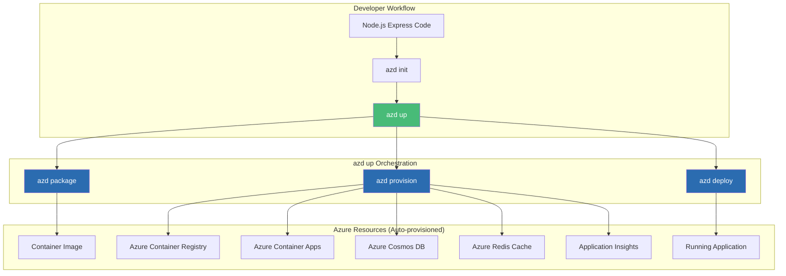

# Azure Developer CLI (azd) with Node.js: The Turnkey Solution

## Full-Stack Deployments from Code to Cloud in Minutes

### Introduction: The Dawn of Opinionated Cloud Development for Node.js

In the [previous installment](#) of this Node.js series, we explored Visual Studio Code Dev Containers—the foundation for consistent Node.js development environments that mirror Azure production. While Dev Containers ensure every developer works in identical conditions, the journey from code to cloud still involves dozens of manual steps: provisioning databases, creating container registries, configuring networking, and deploying applications.

Enter the **Azure Developer CLI (`azd`)**—Microsoft's opinionated tool that transforms complex Azure deployments into a single command: `azd up`. For the **AI Powered Video Tutorial Portal**—an Express.js application with MongoDB integration, Winston logging, and comprehensive REST API endpoints—`azd` turns what once required hours of manual configuration into a 10-minute automated workflow.

This installment explores how to leverage `azd` with Node.js Express applications, from initial project setup to production-ready infrastructure. We'll master `azd` workflows, infrastructure-as-code with Bicep, environment management, and seamless integration with Azure Container Apps—all without writing a single line of YAML.



### Stories at a Glance

**Complete Node.js series (10 stories):**

- 📦 **1. NPM + Docker Multi-Stage: The Classic Node.js Approach** – Leveraging npm with optimized multi-stage Docker builds for Express.js applications on Azure Container Registry

- 🧶 **2. Yarn + Docker: Deterministic Dependency Management** – Using Yarn for reproducible builds with Yarn Berry and Plug'n'Play for optimal container performance

- ⚡ **3. pnpm + Docker: Disk-Efficient Node.js Containers** – Leveraging pnpm's content-addressable storage for faster installs and smaller images

- 🚀 **4. Azure Container Apps: Serverless Node.js Deployment** – Deploying Express.js applications to Azure Container Apps with auto-scaling and managed infrastructure

- 💻 **5. Visual Studio Code Dev Containers: Local Development to Production** – Using VS Code Dev Containers for consistent Node.js development environments that mirror Azure production

- 🔧 **6. Azure Developer CLI (azd) with Node.js: The Turnkey Solution** – Full-stack deployments with `azd up`, Azure Container Apps provisioning, and infrastructure-as-code with Bicep *(This story)*

- 🔒 **7. Tarball Export + Runtime Load: Security-First CI/CD Workflows** – Generating container tarballs, integrating with Trivy/Grype for vulnerability scanning, and deploying to air-gapped Azure environments

- ☸️ **8. Azure Kubernetes Service (AKS): Node.js Microservices at Scale** – Deploying Express.js applications to AKS, Helm charts, GitOps with Flux, and production-grade operations

- 🤖 **9. GitHub Actions + Container Registry: CI/CD for Node.js** – Automated container builds, testing, and deployment with GitHub Actions workflows to Azure

- 🏗️ **10. AWS CDK & Copilot: Multi-Cloud Node.js Container Deployments** – Deploying Node.js Express applications to AWS ECS with AWS Copilot, infrastructure-as-code with CDK, and Fargate serverless orchestration

---

## Understanding Azure Developer CLI

### What is azd?

Azure Developer CLI is a command-line tool that orchestrates the entire application lifecycle—from code to cloud. It abstracts the complexity of Azure resource provisioning, container building, and application deployment into a cohesive workflow.

### Core Principles

| Principle | Description | Node.js Benefit |
|-----------|-------------|-----------------|
| **Convention over Configuration** | Standardized project structure and naming | Minimal configuration for Express.js apps |
| **Infrastructure as Code** | Bicep templates for all Azure resources | Reproducible, auditable deployments |
| **Local-to-Cloud Consistency** | Same configuration works locally and in Azure | No environment drift |
| **Built-in Best Practices** | Security defaults, monitoring, scaling | Production-ready out of the box |

### The azd Command Structure

```bash
# Initialize a new project (creates azure.yaml)
azd init

# Full deployment lifecycle
azd up          # Package + Provision + Deploy

# Individual stages
azd package     # Build container images
azd provision   # Create Azure resources
azd deploy      # Deploy application to Azure

# Environment management
azd env new     # Create new environment
azd env list    # List environments
azd env set     # Set environment variables

# CI/CD integration
azd pipeline config  # Configure GitHub Actions or Azure DevOps
```

---

## Prerequisites and Installation

### Install azd

```bash
# Windows (PowerShell)
winget install microsoft.azd

# macOS
brew tap azure/azd && brew install azd

# Linux (Ubuntu/Debian)
curl -fsSL https://aka.ms/install-azd.sh | bash

# Verify installation
azd version
# azd version 1.9.0
```

### Login to Azure

```bash
# Login to Azure
azd auth login

# Or use Azure CLI
az login

# Verify subscription
az account show
```

---

## The azd Workflow: From Zero to Deployed

### Step 1: Initialize the Project

```bash
# Navigate to your Express.js project
cd Courses-Portal-API-NodeJS

# Initialize azd
azd init

# Output:
# ? Select a project: 
#   1. Detect from Dockerfile
#   2. Select existing project
#   (Select 1 - Detect from Dockerfile)

# ? What is the name of your application? courses-portal-api
# ? What is the location for your Azure resources? East US

# azd creates:
# - azure.yaml: Deployment configuration
# - infrastructure/ : Bicep templates
# - .azure/ : Environment configuration
```

### Step 2: Review Generated azure.yaml

```yaml
# azure.yaml
name: courses-portal-api
metadata:
  template: azd-init@1.0.0

services:
  api:
    project: .
    host: containerapp
    language: js
    docker:
      path: ./Dockerfile
      context: ./
    target:
      port: 3000
```

### Step 3: Customize for Express.js with Dependencies

```yaml
# azure.yaml - Enhanced for Express.js with MongoDB and Redis
name: courses-portal-api
metadata:
  template: azd-init@1.0.0

services:
  api:
    project: .
    host: containerapp
    language: js
    docker:
      path: ./Dockerfile
      context: ./
    target:
      port: 3000
    env:
      - name: NODE_ENV
        value: Production
      - name: LOG_LEVEL
        value: info

  mongodb:
    host: cosmosdb
    resource:
      type: "Microsoft.DocumentDB/databaseAccounts"
      kind: "MongoDB"
      capabilities:
        - name: "EnableMongo"
      locations:
        - locationName: "East US"
          failoverPriority: 0

  redis:
    host: cache
    resource:
      type: "Microsoft.Cache/redis"
      sku: "Basic"
      capacity: 1
```

### Step 4: Deploy with One Command

```bash
# The magic command: package, provision, deploy
azd up

# What happens:
# ============================================
# Phase 1: azd package
# ============================================
# Building Express.js application...
# Building container image: coursetutorials.azurecr.io/courses-api:latest
# 
# ============================================
# Phase 2: azd provision
# ============================================
# Creating resource group: rg-courses-portal
# Creating Azure Container Registry: coursetutorials
# Creating Azure Container Apps Environment: env-courses-portal
# Creating Azure Cosmos DB account: courses-db
# Creating Azure Redis Cache: courses-redis
# Creating Log Analytics Workspace: logs-courses-portal
# Creating Application Insights: insights-courses
# 
# ============================================
# Phase 3: azd deploy
# ============================================
# Pushing api image to ACR...
# Creating Container App: courses-api
# Configuring environment variables...
# 
# ============================================
# Deployment complete!
# ============================================
# API endpoint: https://courses-api.eastus.azurecontainerapps.io
# Cosmos DB endpoint: courses-db.mongo.cosmos.azure.com:10255
# Redis endpoint: courses-redis.redis.cache.windows.net:6380
# 
# Application Insights: https://portal.azure.com/.../insights-courses
```

---

## Infrastructure as Code with Bicep

### Generated Bicep Files for Node.js

`azd` generates Bicep templates that define all Azure resources. Here's what it creates for the Courses Portal API:

```bicep
// infrastructure/main.bicep
param environmentName string
param location string = resourceGroup().location

// ============================================
// RESOURCE GROUP
// ============================================
resource rg 'Microsoft.Resources/resourceGroups@2023-07-01' = {
  name: 'rg-${environmentName}'
  location: location
}

// ============================================
// CONTAINER REGISTRY
// ============================================
resource acr 'Microsoft.ContainerRegistry/registries@2023-07-01' = {
  name: 'acr${environmentName}'
  location: location
  sku: { name: 'Standard' }
  properties: { adminUserEnabled: false }
}

// ============================================
// LOG ANALYTICS
// ============================================
resource logAnalytics 'Microsoft.OperationalInsights/workspaces@2023-09-01' = {
  name: 'log-${environmentName}'
  location: location
  properties: { sku: { name: 'PerGB2018' } }
}

// ============================================
// CONTAINER APPS ENVIRONMENT
// ============================================
resource containerEnv 'Microsoft.App/managedEnvironments@2023-11-02-preview' = {
  name: 'cae-${environmentName}'
  location: location
  properties: {
    appLogsConfiguration: {
      destination: 'log-analytics'
      logAnalyticsConfiguration: {
        customerId: logAnalytics.properties.customerId
        sharedKey: logAnalytics.listKeys().primarySharedKey
      }
    }
  }
}

// ============================================
// COSMOS DB (MongoDB API)
// ============================================
resource cosmosDb 'Microsoft.DocumentDB/databaseAccounts@2023-04-15' = {
  name: 'cosmos-${environmentName}'
  location: location
  kind: 'MongoDB'
  properties: {
    databaseAccountOfferType: 'Standard'
    locations: [{ locationName: location, failoverPriority: 0 }]
    consistencyPolicy: { defaultConsistencyLevel: 'Session' }
    enableAutomaticFailover: false
  }
}

// ============================================
// REDIS CACHE
// ============================================
resource redis 'Microsoft.Cache/redis@2023-08-01' = {
  name: 'redis-${environmentName}'
  location: location
  properties: {
    sku: { name: 'Basic', family: 'C', capacity: 1 }
    enableNonSslPort: false
    minimumTlsVersion: '1.2'
  }
}

// ============================================
// APPLICATION INSIGHTS
// ============================================
resource appInsights 'Microsoft.Insights/components@2020-02-02' = {
  name: 'appi-${environmentName}'
  location: location
  kind: 'web'
  properties: {
    Application_Type: 'web'
    WorkspaceResourceId: logAnalytics.id
  }
}

// ============================================
// CONTAINER APP
// ============================================
module api './containerapp.bicep' = {
  name: 'api-deployment'
  params: {
    name: 'courses-api'
    environmentName: containerEnv.name
    image: '${acr.properties.loginServer}/courses-api:${imageTag}'
    port: 3000
    environmentVariables: [
      { name: 'NODE_ENV', value: 'Production' }
      { name: 'LOG_LEVEL', value: 'info' }
      { name: 'MONGODB_URI', value: cosmosDb.properties.documentEndpoint }
      { name: 'REDIS_HOST', value: redis.properties.hostName }
      { name: 'REDIS_PORT', value: '6380' }
    ]
    secrets: [
      { name: 'mongodb-password', value: cosmosDb.listKeys().primaryMasterKey }
    ]
    scale: {
      minReplicas: 0
      maxReplicas: 10
      rules: [{ name: 'http', http: { metadata: { concurrentRequests: '50' } } }]
    }
  }
}
```

### Customizing Bicep for Express.js

```bicep
// Add health check configuration for Node.js
resource api 'Microsoft.App/containerApps@2023-11-02-preview' = {
  properties: {
    template: {
      containers: [
        {
          probes: [
            {
              type: 'Liveness'
              httpGet: { path: '/health', port: 3000 }
              initialDelaySeconds: 30
              periodSeconds: 10
            }
            {
              type: 'Readiness'
              httpGet: { path: '/ready', port: 3000 }
              initialDelaySeconds: 10
              periodSeconds: 5
            }
          ]
        }
      ]
    }
  }
}

// Add environment-specific configuration
resource api 'Microsoft.App/containerApps@2023-11-02-preview' = {
  properties: {
    configuration: {
      ingress: {
        traffic: [
          { latestRevision: true, weight: 100 }
        ]
        customDomains: environmentName == 'prod' ? [
          {
            name: 'api.coursesportal.com'
            certificateId: certificate.id
          }
        ] : []
      }
    }
  }
}
```

---

## Environment Management

### Creating Multiple Environments

```bash
# Create development environment
azd env new dev
azd env set AZURE_LOCATION eastus
azd up

# Create staging environment
azd env new staging
azd env set AZURE_LOCATION eastus2
azd env set AZURE_SKU Standard
azd up

# Create production environment
azd env new prod
azd env set AZURE_LOCATION westus3
azd env set AZURE_SKU Premium
azd env set MIN_REPLICAS 2
azd env set MAX_REPLICAS 20
azd up

# List environments
azd env list
# dev    (current)
# staging
# prod
```

### Environment Variables for Node.js

```bash
# Set environment-specific variables
azd env set MONGODB_RU 400
azd env set API_REPLICAS 3
azd env set WORKER_MEMORY 2Gi

# Variables are stored in .azure/{env}/.env
# Can be referenced in Bicep:
# param mongodbRu int = environmentVariable('MONGODB_RU', 400)
```

### Using Environment Variables in Express.js

```javascript
// config.js - Reading azd environment variables
require('dotenv').config();

module.exports = {
  // Application
  nodeEnv: process.env.NODE_ENV || 'development',
  port: parseInt(process.env.PORT || '3000', 10),
  
  // Database
  mongodbUri: process.env.MONGODB_URI || 'mongodb://localhost:27017/courses_portal',
  
  // Redis
  redisHost: process.env.REDIS_HOST || 'localhost',
  redisPort: parseInt(process.env.REDIS_PORT || '6379', 10),
  
  // Logging
  logLevel: process.env.LOG_LEVEL || 'info',
  
  // Feature flags
  apiKeyEnabled: process.env.API_KEY_ENABLED === 'true',
  
  // Scaling parameters (read from azd)
  minReplicas: parseInt(process.env.MIN_REPLICAS || '0', 10),
  maxReplicas: parseInt(process.env.MAX_REPLICAS || '10', 10)
};
```

---

## CI/CD Integration

### Configure GitHub Actions

```bash
# Generate GitHub Actions workflow
azd pipeline config --provider github

# Output:
# Created GitHub Actions workflow: .github/workflows/azure-dev.yml
# Configured secrets: AZURE_CLIENT_ID, AZURE_TENANT_ID, AZURE_SUBSCRIPTION_ID
# Created service principal: courses-portal-azd-sp
```

### Generated GitHub Actions Workflow

```yaml
# .github/workflows/azure-dev.yml
name: Deploy Node.js Express to Azure

on:
  push:
    branches: [main]
  pull_request:
    branches: [main]
  workflow_dispatch:

env:
  AZURE_CLIENT_ID: ${{ secrets.AZURE_CLIENT_ID }}
  AZURE_TENANT_ID: ${{ secrets.AZURE_TENANT_ID }}
  AZURE_SUBSCRIPTION_ID: ${{ secrets.AZURE_SUBSCRIPTION_ID }}

jobs:
  build-and-deploy:
    runs-on: ubuntu-latest
    steps:
    - uses: actions/checkout@v4

    - name: Setup Node.js
      uses: actions/setup-node@v4
      with:
        node-version: '20'

    - name: Install dependencies
      run: npm ci

    - name: Run tests
      run: npm test

    - name: Install azd
      uses: Azure/setup-azd@v1

    - name: Login to Azure
      uses: azure/login@v1
      with:
        client-id: ${{ env.AZURE_CLIENT_ID }}
        tenant-id: ${{ env.AZURE_TENANT_ID }}
        subscription-id: ${{ env.AZURE_SUBSCRIPTION_ID }}

    - name: Deploy with azd
      run: |
        azd up \
          --environment production \
          --no-prompt
```

### Azure DevOps Pipeline

```yaml
# azure-pipelines.yml
trigger:
- main

variables:
- group: courses-portal-variables
- name: nodeVersion
  value: '20'

stages:
- stage: Build
  jobs:
  - job: BuildAndDeploy
    pool:
      vmImage: 'ubuntu-latest'
    steps:
    - task: NodeTool@0
      inputs:
        versionSpec: '$(nodeVersion)'
    
    - script: |
        npm ci
        npm test
      displayName: 'Run tests'
    
    - task: AzureCLI@2
      displayName: 'Install azd'
      inputs:
        scriptType: 'bash'
        scriptLocation: 'inlineScript'
        inlineScript: |
          curl -fsSL https://aka.ms/install-azd.sh | bash
    
    - task: AzureCLI@2
      displayName: 'Deploy with azd'
      inputs:
        azureSubscription: 'courses-portal-service-connection'
        scriptType: 'bash'
        scriptLocation: 'inlineScript'
        inlineScript: |
          azd up --environment production --no-prompt
```

---

## Advanced azd Patterns for Node.js

### Custom Dockerfile for Express.js

```dockerfile
# Dockerfile - Optimized for azd deployments
FROM node:20-alpine AS builder

WORKDIR /app
COPY package*.json ./
RUN npm ci --only=production

FROM node:20-alpine AS runtime

RUN apk add --no-cache curl
RUN addgroup -g 1001 -S nodejs && adduser -S nodejs -u 1001

WORKDIR /app
COPY --from=builder --chown=nodejs:nodejs /app/node_modules ./node_modules
COPY --chown=nodejs:nodejs . .

USER nodejs

EXPOSE 3000

HEALTHCHECK --interval=30s --timeout=3s --start-period=10s --retries=3 \
    CMD curl -f http://localhost:3000/health || exit 1

CMD ["node", "server.js"]
```

### Multi-Service Applications

```yaml
# azure.yaml - Multi-service Express.js application
name: courses-portal
services:
  api:
    project: ./api
    host: containerapp
    language: js
    docker:
      path: ./api/Dockerfile
    target:
      port: 3000

  worker:
    project: ./worker
    host: containerapp
    language: js
    docker:
      path: ./worker/Dockerfile
    target:
      port: 3001
    scale:
      minReplicas: 0
      maxReplicas: 5

  mongodb:
    host: cosmosdb
    resource:
      type: "Microsoft.DocumentDB/databaseAccounts"
      kind: "MongoDB"
```

### Custom Domains and SSL

```bicep
// Add custom domain configuration for Node.js API
resource certificate 'Microsoft.Web/certificates@2022-09-01' = {
  name: 'courses-portal-cert'
  location: location
  properties: {
    keyVaultId: keyVault.id
    keyVaultSecretName: 'wildcard-cert'
  }
}

resource customDomain 'Microsoft.App/containerApps/domains@2023-11-02-preview' = {
  name: 'api.coursesportal.com'
  parent: api
  properties: {
    certificateId: certificate.id
    bindingType: 'SniEnabled'
  }
}
```

---

## Monitoring and Observability

### Application Insights for Node.js

```javascript
// server.js - Configure Application Insights
const appInsights = require('applicationinsights');

// Check if running in Azure (set by azd)
if (process.env.APPLICATIONINSIGHTS_CONNECTION_STRING) {
  appInsights.setup(process.env.APPLICATIONINSIGHTS_CONNECTION_STRING)
    .setAutoCollectConsole(true)
    .setAutoCollectExceptions(true)
    .setAutoCollectPerformance(true)
    .setAutoCollectRequests(true)
    .start();
  
  const client = appInsights.defaultClient;
  
  // Track custom events
  client.trackEvent({ name: 'ApplicationStarted' });
  
  // Make client available globally
  global.appInsightsClient = client;
}

// Middleware for tracking requests
app.use((req, res, next) => {
  if (global.appInsightsClient) {
    const startTime = Date.now();
    res.on('finish', () => {
      const duration = Date.now() - startTime;
      global.appInsightsClient.trackRequest({
        name: `${req.method} ${req.route?.path || req.path}`,
        url: req.url,
        duration: duration,
        resultCode: res.statusCode,
        success: res.statusCode < 400
      });
    });
  }
  next();
});
```

### Winston with Application Insights

```javascript
// config/logger.js
const winston = require('winston');
const { ApplicationInsightsTransport } = require('winston-azure-application-insights');

const transports = [
  new winston.transports.Console({
    format: winston.format.combine(
      winston.format.colorize(),
      winston.format.simple()
    )
  })
];

if (process.env.APPLICATIONINSIGHTS_CONNECTION_STRING) {
  transports.push(
    new ApplicationInsightsTransport({
      connectionString: process.env.APPLICATIONINSIGHTS_CONNECTION_STRING
    })
  );
}

const logger = winston.createLogger({
  level: process.env.LOG_LEVEL || 'info',
  format: winston.format.json(),
  transports
});

module.exports = logger;
```

---

## Cost Management

### Estimated Monthly Costs with azd

| Resource | Development | Production |
|----------|-------------|------------|
| **Container Registry** | $5 | $15 |
| **Container Apps** | $0 (scale to zero) | $30-60 |
| **Cosmos DB (MongoDB)** | $20 | $100-200 |
| **Redis Cache** | $15 | $30-60 |
| **Log Analytics** | $10 | $50-100 |
| **Application Insights** | $10 | $30-60 |
| **Total** | **~$60/mo** | **~$250-500/mo** |

### Cost Optimization with azd

```bicep
// Development environment - reduced costs
param environmentName string

var cosmosDbSku = environmentName == 'prod' ? 'M30' : 'M10'
var redisSku = environmentName == 'prod' ? 'Standard' : 'Basic'
var minReplicas = environmentName == 'prod' ? 1 : 0
var maxReplicas = environmentName == 'prod' ? 20 : 5

resource cosmosDb 'Microsoft.DocumentDB/databaseAccounts@2023-04-15' = {
  properties: {
    databaseAccountOfferType: environmentName == 'prod' ? 'Standard' : 'Free'
  }
}
```

---

## Troubleshooting azd Deployments

### Issue 1: Authentication Failed

**Error:** `Failed to authenticate with Azure`

**Solution:**
```bash
# Re-authenticate
azd auth login --use-device-code

# Or refresh Azure CLI
az logout
az login
```

### Issue 2: Docker Build Fails

**Error:** `Docker build failed: COPY failed`

**Solution:**
```bash
# Check Dockerfile paths
azd package --debug

# Ensure .dockerignore excludes unnecessary files
cat .dockerignore
```

### Issue 3: Container App Health Check Failing

**Error:** `Health check failed: 503 Service Unavailable`

**Solution:**
```javascript
// Ensure health endpoints are implemented
app.get('/health', (req, res) => {
  res.status(200).json({ status: 'healthy' });
});

app.get('/ready', async (req, res) => {
  // Check database connection
  try {
    await mongoose.connection.db.admin().ping();
    res.status(200).json({ status: 'ready' });
  } catch (err) {
    res.status(503).json({ status: 'not ready' });
  }
});
```

---

## Conclusion: The Power of Convention for Node.js

Azure Developer CLI with Express.js represents a paradigm shift in Node.js cloud development. By embracing convention over configuration, it transforms what once required dozens of manual steps, multiple YAML files, and deep Azure expertise into a single command: `azd up`.

For the AI Powered Video Tutorial Portal, the benefits are substantial:

| Metric | Traditional Approach | azd + Node.js |
|--------|---------------------|---------------|
| **Time to First Deployment** | 2-3 hours | 10 minutes |
| **Lines of Configuration** | 200+ YAML | 10 lines |
| **Infrastructure Files** | 15+ | 5 (auto-generated) |
| **Service Discovery** | Manual URL configuration | Automatic |
| **Observability Setup** | Manual instrumentation | Built-in OpenTelemetry |
| **Environment Management** | Custom scripts | `azd env` commands |
| **CI/CD Configuration** | 4+ hours | `azd pipeline config` |

While traditional Dockerfile approaches offer fine-grained control, `azd` delivers something equally valuable: **developer velocity**. For teams building Express.js applications on Azure, this turnkey solution is the fastest path from code to production.

---

### Stories at a Glance

**Complete Node.js series (10 stories):**

- 📦 **1. NPM + Docker Multi-Stage: The Classic Node.js Approach** – Leveraging npm with optimized multi-stage Docker builds for Express.js applications on Azure Container Registry

- 🧶 **2. Yarn + Docker: Deterministic Dependency Management** – Using Yarn for reproducible builds with Yarn Berry and Plug'n'Play for optimal container performance

- ⚡ **3. pnpm + Docker: Disk-Efficient Node.js Containers** – Leveraging pnpm's content-addressable storage for faster installs and smaller images

- 🚀 **4. Azure Container Apps: Serverless Node.js Deployment** – Deploying Express.js applications to Azure Container Apps with auto-scaling and managed infrastructure

- 💻 **5. Visual Studio Code Dev Containers: Local Development to Production** – Using VS Code Dev Containers for consistent Node.js development environments that mirror Azure production

- 🔧 **6. Azure Developer CLI (azd) with Node.js: The Turnkey Solution** – Full-stack deployments with `azd up`, Azure Container Apps provisioning, and infrastructure-as-code with Bicep *(This story)*

- 🔒 **7. Tarball Export + Runtime Load: Security-First CI/CD Workflows** – Generating container tarballs, integrating with Trivy/Grype for vulnerability scanning, and deploying to air-gapped Azure environments

- ☸️ **8. Azure Kubernetes Service (AKS): Node.js Microservices at Scale** – Deploying Express.js applications to AKS, Helm charts, GitOps with Flux, and production-grade operations

- 🤖 **9. GitHub Actions + Container Registry: CI/CD for Node.js** – Automated container builds, testing, and deployment with GitHub Actions workflows to Azure

- 🏗️ **10. AWS CDK & Copilot: Multi-Cloud Node.js Container Deployments** – Deploying Node.js Express applications to AWS ECS with AWS Copilot, infrastructure-as-code with CDK, and Fargate serverless orchestration

---

## What's Next?

Over the coming weeks, each approach in this Node.js series will be explored in exhaustive detail. We'll examine real-world Azure deployment scenarios for the AI Powered Video Tutorial Portal, benchmark performance across methods, and provide production-ready patterns for CI/CD pipelines. Whether you're a startup deploying your first Express.js application or an enterprise migrating Node.js workloads to Azure Kubernetes Service, you'll find practical guidance tailored to your infrastructure requirements.

Azure Developer CLI represents the future of Node.js cloud development on Azure—turning complex deployments into a single command. By mastering these ten approaches, you'll be equipped to choose the right tool for every scenario—from rapid prototyping with `azd up` to mission-critical production deployments on Azure Kubernetes Service.

**Coming next in the series:**
**🔒 Tarball Export + Runtime Load: Security-First CI/CD Workflows** – Generating container tarballs, integrating with Trivy/Grype for vulnerability scanning, and deploying to air-gapped Azure environments