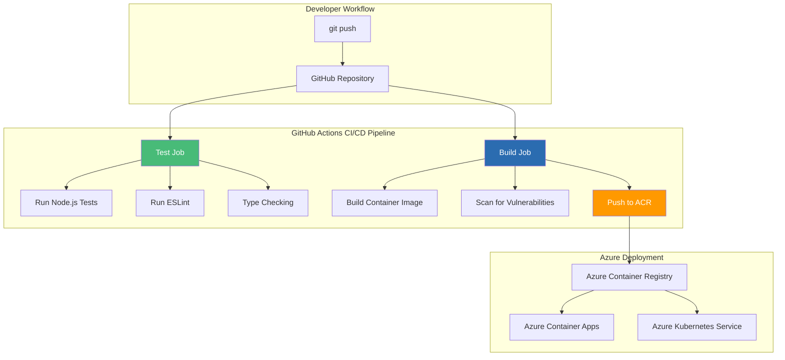
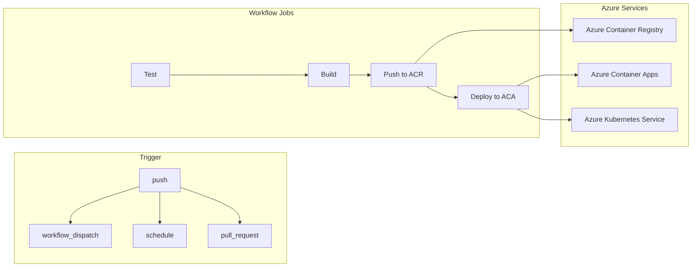

# GitHub Actions + Container Registry: CI/CD for Node.js

## Automating Express.js Container Builds, Testing, and Deployment on Azure

### Introduction: The Automation Imperative for Node.js on Azure

In the [previous installment](#) of this Node.js series, we explored Azure Kubernetes Service (AKS)—the enterprise-grade orchestration platform that enables running Express.js applications at scale. While AKS provides the runtime infrastructure for production workloads, a critical question remains: **how do you automate the journey from code commit to production deployment on Azure?**

Enter **GitHub Actions**—the CI/CD platform that integrates directly with your Node.js code repository. For the **AI Powered Video Tutorial Portal**—an Express.js application with complex dependencies, extensive test suites, and multiple deployment targets—GitHub Actions provides the automation backbone that transforms manual deployment processes into reliable, repeatable, and auditable workflows.

This installment explores the complete CI/CD pipeline for Node.js Express applications using GitHub Actions. We'll master workflow configuration, container building, testing strategies, security scanning, and automated deployment to Azure Container Registry and Azure Container Apps—all while maintaining the speed and reliability that modern development demands.



### Stories at a Glance

**Complete Node.js series (10 stories):**

- 📦 **1. NPM + Docker Multi-Stage: The Classic Node.js Approach** – Leveraging npm with optimized multi-stage Docker builds for Express.js applications on Azure Container Registry

- 🧶 **2. Yarn + Docker: Deterministic Dependency Management** – Using Yarn for reproducible builds with Yarn Berry and Plug'n'Play for optimal container performance

- ⚡ **3. pnpm + Docker: Disk-Efficient Node.js Containers** – Leveraging pnpm's content-addressable storage for faster installs and smaller images

- 🚀 **4. Azure Container Apps: Serverless Node.js Deployment** – Deploying Express.js applications to Azure Container Apps with auto-scaling and managed infrastructure

- 💻 **5. Visual Studio Code Dev Containers: Local Development to Production** – Using VS Code Dev Containers for consistent Node.js development environments that mirror Azure production

- 🔧 **6. Azure Developer CLI (azd) with Node.js: The Turnkey Solution** – Full-stack deployments with `azd up`, Azure Container Apps provisioning, and infrastructure-as-code with Bicep

- 🔒 **7. Tarball Export + Runtime Load: Security-First CI/CD Workflows** – Generating container tarballs, integrating with Trivy/Grype for vulnerability scanning, and deploying to air-gapped Azure environments

- ☸️ **8. Azure Kubernetes Service (AKS): Node.js Microservices at Scale** – Deploying Express.js applications to AKS, Helm charts, GitOps with Flux, and production-grade operations

- 🤖 **9. GitHub Actions + Container Registry: CI/CD for Node.js** – Automated container builds, testing, and deployment with GitHub Actions workflows to Azure *(This story)*

- 🏗️ **10. AWS CDK & Copilot: Multi-Cloud Node.js Container Deployments** – Deploying Node.js Express applications to AWS ECS with AWS Copilot, infrastructure-as-code with CDK, and Fargate serverless orchestration

---

## Understanding GitHub Actions for Node.js on Azure

### What Are GitHub Actions?

GitHub Actions is a CI/CD platform that automates software workflows directly from your GitHub repository. For Node.js Express applications targeting Azure, Actions can:

| Workflow | Purpose | Node.js Benefit |
|----------|---------|-----------------|
| **Test** | Run unit and integration tests | Validate Express.js endpoints |
| **Lint** | Check code style | Maintain consistent JavaScript code quality |
| **Type Check** | Verify TypeScript types | Catch type errors before runtime |
| **Build** | Create container images | Package Express.js for deployment |
| **Scan** | Check for vulnerabilities | Secure Node.js dependencies |
| **Push** | Upload to ACR | Store images for ACA/AKS |
| **Deploy** | Deploy to Azure | ACA, AKS, or App Service |

### GitHub Actions Architecture for Node.js



---

## Prerequisites

### GitHub Repository Setup

```bash
# Create repository (if not exists)
gh repo create courses-portal-api --public --source=.

# Set up repository secrets for Azure
gh secret set AZURE_CLIENT_ID --body "$(az ad sp create-for-rbac --name courses-api-sp --role contributor --scopes /subscriptions/$(az account show --query id -o tsv) --sdk-auth | jq -r .clientId)"
gh secret set AZURE_TENANT_ID --body "$(az account show --query tenantId -o tsv)"
gh secret set AZURE_SUBSCRIPTION_ID --body "$(az account show --query id -o tsv)"
gh secret set ACR_USERNAME --body "$(az acr credential show --name coursetutorials --query username -o tsv)"
gh secret set ACR_PASSWORD --body "$(az acr credential show --name coursetutorials --query passwords[0].value -o tsv)"
```

### Azure Resources

```bash
# Create Azure Container Registry
az acr create \
    --resource-group rg-courses-portal \
    --name coursetutorials \
    --sku Standard \
    --admin-enabled true

# Create Azure Container Apps Environment (if not exists)
az containerapp env create \
    --name env-courses-portal \
    --resource-group rg-courses-portal \
    --location eastus
```

---

## Basic CI/CD Workflow for Node.js

### Complete Workflow File

```yaml
# .github/workflows/ci-cd.yml
name: Node.js Express CI/CD Pipeline for Azure

on:
  push:
    branches: [main, develop]
    paths-ignore:
      - '**.md'
      - 'docs/**'
  pull_request:
    branches: [main]
  workflow_dispatch:

env:
  NODE_VERSION: '20'
  ACR_NAME: coursetutorials
  IMAGE_NAME: courses-api
  ACA_ENVIRONMENT: env-courses-portal
  ACA_APP_NAME: courses-api

jobs:
  test:
    name: Test Node.js Application
    runs-on: ubuntu-latest
    
    steps:
    - name: Checkout code
      uses: actions/checkout@v4
    
    - name: Setup Node.js
      uses: actions/setup-node@v4
      with:
        node-version: ${{ env.NODE_VERSION }}
        cache: 'npm'
    
    - name: Install dependencies
      run: npm ci
    
    - name: Run ESLint
      run: npm run lint -- --max-warnings 0
    
    - name: Run tests with coverage
      run: npm test -- --coverage
    
    - name: Upload coverage to Codecov
      uses: codecov/codecov-action@v3
      with:
        file: ./coverage/lcov.info
        flags: unittests
        name: codecov-umbrella

  build:
    name: Build and Push Container
    needs: test
    if: github.ref == 'refs/heads/main' && success()
    runs-on: ubuntu-latest
    
    steps:
    - name: Checkout code
      uses: actions/checkout@v4
    
    - name: Set up Docker Buildx
      uses: docker/setup-buildx-action@v3
    
    - name: Login to Azure Container Registry
      uses: azure/docker-login@v1
      with:
        login-server: ${{ env.ACR_NAME }}.azurecr.io
        username: ${{ secrets.ACR_USERNAME }}
        password: ${{ secrets.ACR_PASSWORD }}
    
    - name: Build and push container
      uses: docker/build-push-action@v5
      with:
        context: .
        file: ./Dockerfile
        push: true
        tags: |
          ${{ env.ACR_NAME }}.azurecr.io/${{ env.IMAGE_NAME }}:${{ github.sha }}
          ${{ env.ACR_NAME }}.azurecr.io/${{ env.IMAGE_NAME }}:latest
        cache-from: type=gha
        cache-to: type=gha,mode=max
        labels: |
          org.opencontainers.image.source=${{ github.server_url }}/${{ github.repository }}
          org.opencontainers.image.revision=${{ github.sha }}
          org.opencontainers.image.created=${{ github.event.head_commit.timestamp }}

  deploy:
    name: Deploy to Azure Container Apps
    needs: build
    if: github.ref == 'refs/heads/main' && success()
    runs-on: ubuntu-latest
    environment: production
    
    steps:
    - name: Login to Azure
      uses: azure/login@v1
      with:
        client-id: ${{ secrets.AZURE_CLIENT_ID }}
        tenant-id: ${{ secrets.AZURE_TENANT_ID }}
        subscription-id: ${{ secrets.AZURE_SUBSCRIPTION_ID }}
    
    - name: Deploy to Azure Container Apps
      run: |
        az containerapp update \
          --name ${{ env.ACA_APP_NAME }} \
          --resource-group rg-courses-portal \
          --image ${{ env.ACR_NAME }}.azurecr.io/${{ env.IMAGE_NAME }}:${{ github.sha }} \
          --revision-suffix ${{ github.sha }}
```

---

## Advanced CI/CD Patterns for Node.js

### Security Scanning Workflow

```yaml
# .github/workflows/security-scan.yml
name: Node.js Security Scan

on:
  push:
    branches: [main]
  schedule:
    - cron: '0 0 * * *'  # Daily scan
  workflow_dispatch:

jobs:
  security-scan:
    runs-on: ubuntu-latest
    
    steps:
    - uses: actions/checkout@v4
    
    - name: Setup Node.js
      uses: actions/setup-node@v4
      with:
        node-version: '20'
    
    - name: Run npm audit
      run: npm audit --audit-level=high
    
    - name: Build Docker image
      run: |
        docker build -t courses-api:scan .
        docker save courses-api:scan -o image.tar
    
    - name: Install Trivy
      run: |
        wget https://github.com/aquasecurity/trivy/releases/download/v0.48.0/trivy_0.48.0_Linux-64bit.deb
        sudo dpkg -i trivy_0.48.0_Linux-64bit.deb
    
    - name: Run Trivy vulnerability scan
      run: |
        trivy image --input image.tar --severity HIGH,CRITICAL --format sarif --output trivy-results.sarif
    
    - name: Upload Trivy results to GitHub Security
      uses: github/codeql-action/upload-sarif@v3
      with:
        sarif_file: trivy-results.sarif
    
    - name: Install Grype
      run: |
        curl -sSfL https://raw.githubusercontent.com/anchore/grype/main/install.sh | sh -s -- -b /usr/local/bin
    
    - name: Run Grype license scan
      run: |
        grype image.tar --fail-on high --output json > grype-results.json
    
    - name: Check for restricted licenses
      run: |
        DENIED_COUNT=$(jq '.matches[] | select(.artifact.licenses[] | .value == "GPL-3.0")' grype-results.json | wc -l)
        if [ $DENIED_COUNT -gt 0 ]; then
          echo "Found $DENIED_COUNT restricted licenses!"
          exit 1
        fi
```

### Matrix Testing for Multiple Node.js Versions

```yaml
# .github/workflows/matrix-test.yml
name: Matrix Testing

on:
  pull_request:
    branches: [main]
  push:
    branches: [develop]

jobs:
  test:
    runs-on: ubuntu-latest
    strategy:
      matrix:
        node-version: ['18', '20', '22']
        express-version: ['4.18.2', '4.19.0']
    
    steps:
    - uses: actions/checkout@v4
    
    - name: Setup Node.js ${{ matrix.node-version }}
      uses: actions/setup-node@v4
      with:
        node-version: ${{ matrix.node-version }}
    
    - name: Install dependencies
      run: |
        npm install express@${{ matrix.express-version }}
        npm ci
    
    - name: Run tests
      run: npm test
```

### Deployment to Multiple Environments

```yaml
# .github/workflows/environment-deploy.yml
name: Environment-Specific Deployment

on:
  push:
    branches: [develop, staging, main]

jobs:
  deploy:
    runs-on: ubuntu-latest
    environment: ${{ github.ref_name }}
    
    steps:
    - uses: actions/checkout@v4
    
    - name: Set environment variables
      run: |
        if [ "${{ github.ref_name }}" == "main" ]; then
          echo "ENVIRONMENT=production" >> $GITHUB_ENV
          echo "ACA_APP_NAME=courses-api-prod" >> $GITHUB_ENV
          echo "MIN_REPLICAS=2" >> $GITHUB_ENV
          echo "MAX_REPLICAS=10" >> $GITHUB_ENV
        elif [ "${{ github.ref_name }}" == "staging" ]; then
          echo "ENVIRONMENT=staging" >> $GITHUB_ENV
          echo "ACA_APP_NAME=courses-api-staging" >> $GITHUB_ENV
          echo "MIN_REPLICAS=1" >> $GITHUB_ENV
          echo "MAX_REPLICAS=5" >> $GITHUB_ENV
        else
          echo "ENVIRONMENT=development" >> $GITHUB_ENV
          echo "ACA_APP_NAME=courses-api-dev" >> $GITHUB_ENV
          echo "MIN_REPLICAS=0" >> $GITHUB_ENV
          echo "MAX_REPLICAS=3" >> $GITHUB_ENV
        fi
    
    - name: Login to Azure
      uses: azure/login@v1
      with:
        client-id: ${{ secrets.AZURE_CLIENT_ID }}
        tenant-id: ${{ secrets.AZURE_TENANT_ID }}
        subscription-id: ${{ secrets.AZURE_SUBSCRIPTION_ID }}
    
    - name: Build and push container
      run: |
        docker build -t coursetutorials.azurecr.io/courses-api:${{ github.sha }} .
        docker push coursetutorials.azurecr.io/courses-api:${{ github.sha }}
    
    - name: Deploy to Container App
      run: |
        az containerapp update \
          --name ${{ env.ACA_APP_NAME }} \
          --resource-group rg-courses-portal \
          --image coursetutorials.azurecr.io/courses-api:${{ github.sha }} \
          --min-replicas ${{ env.MIN_REPLICAS }} \
          --max-replicas ${{ env.MAX_REPLICAS }}
```

---

## Optimizing Build Performance for Node.js

### Dependency Caching

```yaml
# Caching npm packages
- name: Cache npm packages
  uses: actions/cache@v3
  with:
    path: ~/.npm
    key: ${{ runner.os }}-node-${{ hashFiles('package-lock.json') }}
    restore-keys: |
      ${{ runner.os }}-node-

# Caching Docker layers
- name: Cache Docker layers
  uses: actions/cache@v3
  with:
    path: /tmp/.buildx-cache
    key: ${{ runner.os }}-buildx-${{ github.sha }}
    restore-keys: |
      ${{ runner.os }}-buildx-
```

### Conditional Job Execution

```yaml
# Only run specific jobs for certain branches
jobs:
  test:
    runs-on: ubuntu-latest
    
  build:
    runs-on: ubuntu-latest
    needs: test
    if: github.ref == 'refs/heads/main' && success()
  
  deploy-prod:
    runs-on: ubuntu-latest
    needs: build
    if: github.ref == 'refs/heads/main' && success()
  
  deploy-dev:
    runs-on: ubuntu-latest
    needs: test
    if: github.ref == 'refs/heads/develop' && success()
```

---

## Node.js Testing Strategies in CI/CD

### Unit Tests with Jest

```javascript
// jest.config.js
module.exports = {
  testEnvironment: 'node',
  coverageDirectory: 'coverage',
  collectCoverageFrom: [
    'controllers/**/*.js',
    'middleware/**/*.js',
    'routes/**/*.js',
    'services/**/*.js',
    '!**/node_modules/**',
    '!**/coverage/**'
  ],
  testMatch: ['**/tests/**/*.test.js'],
  verbose: true
};
```

```yaml
- name: Run unit tests
  run: npm test -- --coverage
```

### Integration Tests with Docker Compose

```yaml
- name: Start test environment
  run: |
    docker-compose -f docker-compose.test.yml up -d mongodb redis
    sleep 10

- name: Run integration tests
  run: npm run test:integration

- name: Stop test environment
  if: always()
  run: |
    docker-compose -f docker-compose.test.yml down
```

### End-to-End Tests

```yaml
- name: Deploy to test environment
  run: |
    az containerapp update \
      --name courses-api-test \
      --image coursetutorials.azurecr.io/courses-api:${{ github.sha }}

- name: Wait for deployment
  run: sleep 30

- name: Run E2E tests
  run: npm run test:e2e -- --base-url=https://courses-api-test.eastus.azurecontainerapps.io

- name: Clean up test deployment
  if: always()
  run: |
    az containerapp update \
      --name courses-api-test \
      --image coursetutorials.azurecr.io/courses-api:latest
```

---

## Container Registry Integration

### Azure Container Registry

```yaml
- name: Login to ACR
  uses: azure/docker-login@v1
  with:
    login-server: coursetutorials.azurecr.io
    username: ${{ secrets.ACR_USERNAME }}
    password: ${{ secrets.ACR_PASSWORD }}

- name: Build and push
  uses: docker/build-push-action@v5
  with:
    push: true
    tags: |
      coursetutorials.azurecr.io/courses-api:${{ github.sha }}
      coursetutorials.azurecr.io/courses-api:latest
```

### Docker Hub

```yaml
- name: Login to Docker Hub
  uses: docker/login-action@v3
  with:
    username: ${{ secrets.DOCKER_USERNAME }}
    password: ${{ secrets.DOCKER_PASSWORD }}

- name: Build and push
  uses: docker/build-push-action@v5
  with:
    push: true
    tags: |
      coursesportal/courses-api:${{ github.sha }}
      coursesportal/courses-api:latest
```

### GitHub Container Registry

```yaml
- name: Login to GHCR
  uses: docker/login-action@v3
  with:
    registry: ghcr.io
    username: ${{ github.repository_owner }}
    password: ${{ secrets.GITHUB_TOKEN }}

- name: Build and push
  uses: docker/build-push-action@v5
  with:
    push: true
    tags: |
      ghcr.io/${{ github.repository }}/courses-api:${{ github.sha }}
      ghcr.io/${{ github.repository }}/courses-api:latest
```

---

## Monitoring and Notifications

### Slack Notifications

```yaml
- name: Notify Slack on failure
  if: failure()
  uses: slackapi/slack-github-action@v1.24.0
  with:
    payload: |
      {
        "text": "❌ Deployment failed for ${{ github.repository }}!\nCommit: ${{ github.sha }}\nAuthor: ${{ github.actor }}\nWorkflow: ${{ github.workflow }}"
      }
  env:
    SLACK_WEBHOOK_URL: ${{ secrets.SLACK_WEBHOOK_URL }}
```

### Microsoft Teams Notifications

```yaml
- name: Notify Teams on success
  if: success()
  uses: aliencube/microsoft-teams-actions@v1
  with:
    webhook_uri: ${{ secrets.TEAMS_WEBHOOK_URL }}
    title: "✅ Node.js Deployment Successful"
    summary: "${{ github.repository }} deployed successfully"
    sections: |
      [
        {
          "activityTitle": "Deployment: ${{ github.sha }}",
          "activitySubtitle": "Branch: ${{ github.ref_name }}",
          "facts": [
            {
              "name": "Environment",
              "value": "${{ github.ref_name }}"
            },
            {
              "name": "Image Tag",
              "value": "${{ github.sha }}"
            }
          ]
        }
      ]
```

---

## Troubleshooting GitHub Actions for Node.js

### Issue 1: Cache Misses

**Problem:** Cache keys not matching, causing full rebuilds

**Solution:**
```yaml
# Use hash of package-lock.json for precise cache keys
- name: Cache npm packages
  uses: actions/cache@v3
  with:
    path: ~/.npm
    key: ${{ runner.os }}-node-${{ hashFiles('package-lock.json') }}
    restore-keys: |
      ${{ runner.os }}-node-
```

### Issue 2: Docker Build Timeout

**Problem:** Docker builds taking too long

**Solution:**
```yaml
# Use buildx with cache
- name: Set up Docker Buildx
  uses: docker/setup-buildx-action@v3
  with:
    driver-opts: network=host

- name: Build and push
  uses: docker/build-push-action@v5
  with:
    cache-from: type=gha
    cache-to: type=gha,mode=max
```

### Issue 3: Node.js Tests Failing in CI

**Error:** `Error: Cannot find module`

**Solution:**
```yaml
# Ensure node_modules is installed correctly
- name: Install dependencies
  run: npm ci

# Run tests with increased memory
- name: Run tests
  run: node --max-old-space-size=4096 node_modules/jest/bin/jest.js --coverage
```

### Issue 4: npm Audit Fails

**Error:** `found 5 vulnerabilities (1 high, 4 moderate)`

**Solution:**
```yaml
# Run audit with fix
- name: Run npm audit fix
  run: npm audit fix --force

# Or only fail on critical vulnerabilities
- name: Run npm audit
  run: npm audit --audit-level=critical
```

---

## Performance Metrics

| Metric | Without Cache | With Cache | Improvement |
|--------|---------------|------------|-------------|
| **npm install** | 30-60s | 5-10s | 70-85% faster |
| **Docker build** | 45-90s | 15-25s | 65-70% faster |
| **Total Pipeline** | 2-4 minutes | 45-90 seconds | 60-70% faster |

---

## Conclusion: The Automation Advantage for Node.js

GitHub Actions transforms Node.js Express development on Azure by automating the entire journey from code to cloud:

- **Automated testing** – Catch bugs before they reach production
- **Consistent builds** – Reproducible container images every time
- **Security scanning** – Identify vulnerabilities automatically
- **Multi-environment deployment** – Dev → Staging → Production
- **Team visibility** – Everyone sees build status and test results
- **Audit trail** – Every deployment is tracked and recorded

For the AI Powered Video Tutorial Portal, GitHub Actions enables:

- **Fast iteration** – Code to production in minutes
- **Confident releases** – Tests pass before deployment
- **Security compliance** – Automated vulnerability scanning
- **Multiple environments** – Isolated dev, staging, and production
- **Team collaboration** – PR checks before merging

GitHub Actions represents the modern standard for Node.js CI/CD on Azure—providing the automation foundation that enables teams to ship Express.js applications faster, safer, and with greater confidence.

---

### Stories at a Glance

**Complete Node.js series (10 stories):**

- 📦 **1. NPM + Docker Multi-Stage: The Classic Node.js Approach** – Leveraging npm with optimized multi-stage Docker builds for Express.js applications on Azure Container Registry

- 🧶 **2. Yarn + Docker: Deterministic Dependency Management** – Using Yarn for reproducible builds with Yarn Berry and Plug'n'Play for optimal container performance

- ⚡ **3. pnpm + Docker: Disk-Efficient Node.js Containers** – Leveraging pnpm's content-addressable storage for faster installs and smaller images

- 🚀 **4. Azure Container Apps: Serverless Node.js Deployment** – Deploying Express.js applications to Azure Container Apps with auto-scaling and managed infrastructure

- 💻 **5. Visual Studio Code Dev Containers: Local Development to Production** – Using VS Code Dev Containers for consistent Node.js development environments that mirror Azure production

- 🔧 **6. Azure Developer CLI (azd) with Node.js: The Turnkey Solution** – Full-stack deployments with `azd up`, Azure Container Apps provisioning, and infrastructure-as-code with Bicep

- 🔒 **7. Tarball Export + Runtime Load: Security-First CI/CD Workflows** – Generating container tarballs, integrating with Trivy/Grype for vulnerability scanning, and deploying to air-gapped Azure environments

- ☸️ **8. Azure Kubernetes Service (AKS): Node.js Microservices at Scale** – Deploying Express.js applications to AKS, Helm charts, GitOps with Flux, and production-grade operations

- 🤖 **9. GitHub Actions + Container Registry: CI/CD for Node.js** – Automated container builds, testing, and deployment with GitHub Actions workflows to Azure *(This story)*

- 🏗️ **10. AWS CDK & Copilot: Multi-Cloud Node.js Container Deployments** – Deploying Node.js Express applications to AWS ECS with AWS Copilot, infrastructure-as-code with CDK, and Fargate serverless orchestration

---

## What's Next?

This concludes our comprehensive Node.js series on containerizing Express.js applications. We've covered the full spectrum of deployment approaches—from npm and Yarn for dependency management, to Azure Container Apps and AKS for serverless and orchestrated deployments.

Whether you're deploying to Azure Container Apps, Azure Kubernetes Service, or multi-cloud with AWS CDK, you now have the complete toolkit to succeed with Node.js containerization on Azure. Each approach serves different use cases, and the right choice depends on your team's experience, operational requirements, and scaling needs.

**Thank you for reading this complete Node.js series!** We've explored every major approach to building, testing, and deploying Node.js Express container images—from local development with VS Code Dev Containers to enterprise-scale orchestration on Azure Kubernetes Service. You're now equipped to choose the right tool for every scenario. Happy containerizing on Azure! 🚀

**Coming next in the series:**
**🏗️ AWS CDK & Copilot: Multi-Cloud Node.js Container Deployments** – Deploying Node.js Express applications to AWS ECS with AWS Copilot, infrastructure-as-code with CDK, and Fargate serverless orchestration