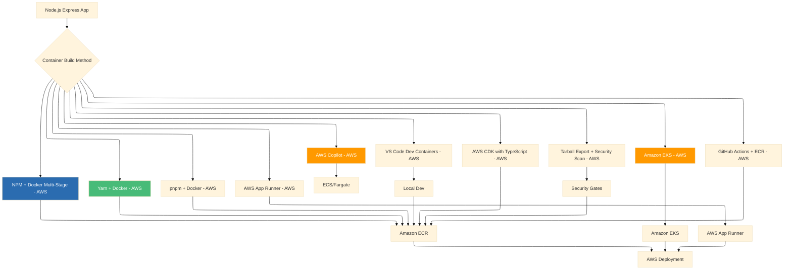

# Publishing Node.js Express Apps as Container Images: A Complete Guide to 10 Deployment Approaches -  AWS
## The Node.js series adapts the patterns to the Node.js ecosystem, focusing on Express.js applications with dependencies like Express, Mongoose, and Winston with AWS

## AWS Edition: From Development to Production on Amazon Web Services


### Introduction: The Node.js Containerization Journey on AWS

In our previous series, we explored the complete landscape of containerizing .NET 10 applications across Azure and AWS, covering nine distinct approaches for Azure and ten for AWS. We then extended this journey to Python FastAPI applications, and then to Node.js Express applications on Azure. Now, we bring those proven patterns to the Node.js ecosystem on **Amazon Web Services (AWS)**.

Node.js powers millions of APIs and web applications worldwide, and the **AI Powered Video Tutorial Portal**—an Express.js-based REST API for managing course videos, content, and section assets with MongoDB—represents exactly the kind of modern Node.js application that benefits from robust containerization strategies on AWS. With its modular architecture, Mongoose ODM, Winston logging, and comprehensive Swagger documentation, this project showcases the patterns that make Node.js a premier choice for API development.

This series adapts the proven patterns from our .NET, Python, and Azure Node.js containerization guides to the AWS ecosystem, focusing on AWS deployment with Visual Studio Code as the primary development environment. Whether you're deploying an Express.js backend, a NestJS application, or a microservices architecture, you'll find battle-tested patterns for containerizing Node.js applications at scale on AWS—from Graviton-optimized builds to ECS Fargate and EKS orchestration.



### Stories at a Glance

**Companion stories in this AWS Node.js series:**

- 📦 **1. NPM + Docker Multi-Stage: The Classic Node.js Approach - AWS** – Leveraging npm with optimized multi-stage Docker builds for Express.js applications on Amazon ECR

- 🧶 **2. Yarn + Docker: Deterministic Dependency Management - AWS** – Using Yarn for reproducible builds with Yarn Berry and Plug'n'Play for optimal container performance on AWS Graviton

- ⚡ **3. pnpm + Docker: Disk-Efficient Node.js Containers - AWS** – Leveraging pnpm's content-addressable storage for faster installs and smaller images on Amazon ECS

- 🚀 **4. AWS Copilot: The Turnkey Container Solution - AWS** – Deploying Express.js applications to Amazon ECS with AWS Copilot, Fargate, and built-in best practices

- 💻 **5. Visual Studio Code Dev Containers: Local Development to Production - AWS** – Using VS Code Dev Containers for consistent Node.js development environments that mirror AWS production

- 🏗️ **6. AWS CDK with TypeScript: Infrastructure as Code for Containers - AWS** – Defining Express.js infrastructure with TypeScript CDK, deploying to ECS Fargate with auto-scaling

- 🔒 **7. Tarball Export + Runtime Load: Security-First CI/CD Workflows - AWS** – Generating container tarballs, integrating with Amazon Inspector, and deploying to air-gapped AWS environments

- ☸️ **8. Amazon EKS: Node.js Microservices at Scale - AWS** – Deploying Express.js applications to Amazon EKS, Helm charts, GitOps with Flux, and production-grade operations

- 🤖 **9. GitHub Actions + Amazon ECR: CI/CD for Node.js - AWS** – Automated container builds, testing, and deployment with GitHub Actions workflows to AWS

- 🏗️ **10. AWS App Runner: Fully Managed Node.js Container Service - AWS** – Deploying Express.js applications to AWS App Runner with zero infrastructure management

---

## 1. 📦 NPM + Docker Multi-Stage: The Classic Node.js Approach - AWS

### Introduction to npm for AWS Containerization

npm (Node Package Manager) remains the most widely used package manager for Node.js applications. For the AI Powered Video Tutorial Portal—an Express.js application with dependencies like Express, Mongoose, Winston, and Swagger UI Express—npm provides a straightforward, battle-tested approach to dependency management on AWS.

### The npm-Optimized Dockerfile for AWS

```dockerfile
# ============================================
# AI Powered Video Tutorial Portal - npm Build for AWS
# ============================================
# Production-ready Dockerfile for Express.js + npm
# Optimized for Amazon ECR and ECS Fargate deployment

# Stage 1: Builder with npm
FROM node:20-alpine AS builder

WORKDIR /app

# Copy package files first for layer caching
COPY package*.json ./

# Install production dependencies only
RUN npm ci --only=production --omit=dev

# Stage 2: Runtime
FROM node:20-alpine AS runtime

# Install runtime dependencies for health checks
RUN apk add --no-cache curl

# Create non-root user for security
RUN addgroup -g 1001 -S nodejs && \
    adduser -S nodejs -u 1001

WORKDIR /app

# Copy installed dependencies from builder
COPY --from=builder --chown=nodejs:nodejs /app/node_modules ./node_modules

# Copy application code
COPY --chown=nodejs:nodejs . .

# Switch to non-root user
USER nodejs

EXPOSE 3000

HEALTHCHECK --interval=30s --timeout=3s --start-period=10s --retries=3 \
    CMD curl -f http://localhost:3000/health || exit 1

CMD ["node", "server.js"]
```

### Build and Push to Amazon ECR

```bash
# Authenticate to ECR
aws ecr get-login-password --region us-east-1 | \
    docker login --username AWS --password-stdin 123456789012.dkr.ecr.us-east-1.amazonaws.com

# Create ECR repository
aws ecr create-repository --repository-name courses-api --region us-east-1

# Build and push
docker build -t courses-api:latest -f Dockerfile.npm .
docker tag courses-api:latest 123456789012.dkr.ecr.us-east-1.amazonaws.com/courses-api:latest
docker push 123456789012.dkr.ecr.us-east-1.amazonaws.com/courses-api:latest
```

---

## 2. 🧶 Yarn + Docker: Deterministic Dependency Management - AWS

### Yarn for Reproducible Node.js Builds on AWS

Yarn offers deterministic builds with yarn.lock files, ensuring consistent dependency resolution across environments. Yarn Berry (Yarn 2+) adds Plug'n'Play (PnP) for zero-install capabilities.

### The Yarn-Optimized Dockerfile for AWS Graviton

```dockerfile
# ============================================
# AI Powered Video Tutorial Portal - Yarn Build for AWS Graviton
# ============================================

FROM node:20-alpine AS builder

# Enable Yarn Berry (Yarn 2+)
RUN corepack enable && corepack prepare yarn@4.0.0 --activate

WORKDIR /app

# Copy package files with Yarn Berry lockfile
COPY package.json yarn.lock .yarnrc.yml ./

# Install dependencies with Yarn (immutable for CI)
RUN yarn install --immutable

FROM node:20-alpine AS runtime

RUN apk add --no-cache curl
RUN addgroup -g 1001 -S nodejs && adduser -S nodejs -u 1001

WORKDIR /app
COPY --from=builder --chown=nodejs:nodejs /app/.yarn ./.yarn
COPY --from=builder --chown=nodejs:nodejs /app/node_modules ./node_modules
COPY --chown=nodejs:nodejs . .

USER nodejs

EXPOSE 3000
CMD ["node", "server.js"]
```

---

## 3. ⚡ pnpm + Docker: Disk-Efficient Node.js Containers - AWS

### pnpm for Space-Efficient Node.js Containers on AWS

pnpm uses a content-addressable storage approach, reducing disk usage and installation time significantly for AWS CodeBuild pipelines.

### The pnpm-Optimized Dockerfile for AWS

```dockerfile
# ============================================
# AI Powered Video Tutorial Portal - pnpm Build for AWS
# ============================================

FROM node:20-alpine AS builder

# Enable pnpm
RUN corepack enable && corepack prepare pnpm@8.0.0 --activate

WORKDIR /app

# Copy package files
COPY package.json pnpm-lock.yaml ./

# Install dependencies with pnpm
RUN pnpm install --frozen-lockfile --prod

FROM node:20-alpine AS runtime

RUN apk add --no-cache curl
RUN addgroup -g 1001 -S nodejs && adduser -S nodejs -u 1001

WORKDIR /app
COPY --from=builder --chown=nodejs:nodejs /app/node_modules ./node_modules
COPY --chown=nodejs:nodejs . .

USER nodejs

EXPOSE 3000
CMD ["node", "server.js"]
```

---

## 4. 🚀 AWS Copilot: The Turnkey Container Solution - AWS

### Deploying Express.js to Amazon ECS with Copilot

AWS Copilot provides a simplified, opinionated workflow for deploying containerized applications to ECS Fargate.

```bash
# Initialize Copilot app
copilot init \
    --app courses-portal \
    --name api \
    --type "Load Balanced Web Service" \
    --dockerfile ./Dockerfile \
    --port 3000 \
    --deploy
```

```yaml
# copilot/api/manifest.yml
name: api
type: Load Balanced Web Service

platform:
  os: linux
  arch: arm64  # AWS Graviton for cost savings

image:
  build: ./Dockerfile
  port: 3000

cpu: 512
memory: 1024

variables:
  NODE_ENV: production
  AWS_REGION: us-east-1

secrets:
  JWT_SECRET_KEY: /copilot/courses-portal/production/secrets/JWT_SECRET_KEY
  MONGODB_URI: /copilot/courses-portal/production/secrets/MONGODB_URI

count:
  range: 2-10
  cpu_percentage: 70
  memory_percentage: 80

healthcheck:
  path: /health
  interval: 30s
  timeout: 5s
```

---

## 5. 💻 Visual Studio Code Dev Containers: Local Development to Production - AWS

### Using VS Code Dev Containers for Consistent Node.js Development on AWS

Dev Containers enable reproducible development environments that mirror AWS production.

```json
// .devcontainer/devcontainer.json
{
  "name": "Node.js Express API - AWS",
  "build": {
    "dockerfile": "Dockerfile",
    "context": ".."
  },
  "customizations": {
    "vscode": {
      "extensions": [
        "amazonwebservices.aws-toolkit-vscode",
        "mongodb.mongodb-vscode",
        "ms-azuretools.vscode-docker"
      ]
    }
  },
  "forwardPorts": [3000],
  "postCreateCommand": "npm install"
}
```

---

## 6. 🏗️ AWS CDK with TypeScript: Infrastructure as Code for Containers - AWS

### Defining Express.js Infrastructure with TypeScript CDK

```typescript
// bin/courses-portal.ts
#!/usr/bin/env node
import * as cdk from 'aws-cdk-lib';
import { CoursesPortalStack } from '../lib/courses-portal-stack';

const app = new cdk.App();
new CoursesPortalStack(app, 'CoursesPortalStack', {
  env: { account: '123456789012', region: 'us-east-1' }
});
app.synth();
```

```typescript
// lib/courses-portal-stack.ts
import * as cdk from 'aws-cdk-lib';
import * as ecs from 'aws-cdk-lib/aws-ecs';
import * as ecs_patterns from 'aws-cdk-lib/aws-ecs-patterns';
import * as ecr from 'aws-cdk-lib/aws-ecr';
import * as ec2 from 'aws-cdk-lib/aws-ec2';

export class CoursesPortalStack extends cdk.Stack {
  constructor(scope: cdk.App, id: string, props?: cdk.StackProps) {
    super(scope, id, props);

    const vpc = new ec2.Vpc(this, 'CoursesVpc', { maxAzs: 2 });
    const repository = new ecr.Repository(this, 'CoursesRepo', { repositoryName: 'courses-api' });
    const cluster = new ecs.Cluster(this, 'CoursesCluster', { vpc });

    new ecs_patterns.ApplicationLoadBalancedFargateService(this, 'CoursesService', {
      cluster,
      taskImageOptions: {
        image: ecs.ContainerImage.fromEcrRepository(repository, 'latest'),
        containerPort: 3000,
        environment: { NODE_ENV: 'production' }
      },
      desiredCount: 3,
      memoryLimitMiB: 512,
      cpu: 256
    });
  }
}
```

```bash
cdk deploy
```

---

## 7. 🔒 Tarball Export + Runtime Load: Security-First CI/CD Workflows - AWS

### Security Scanning with Amazon Inspector

```bash
# Build and export tarball
docker build -t courses-api:scan .
docker save courses-api:scan -o courses-api.tar

# Scan with Amazon Inspector (via ECR)
aws ecr create-repository --repository-name temp-scan
docker tag courses-api:scan $ACCOUNT_ID.dkr.ecr.us-east-1.amazonaws.com/temp-scan:scan
docker push $ACCOUNT_ID.dkr.ecr.us-east-1.amazonaws.com/temp-scan:scan

# Wait for Inspector scan
aws inspector2 list-findings --filter-criteria '{
    "severity": [{"comparison": "EQUALS", "value": "CRITICAL"}]
}'

# After approval, load and push
docker load -i courses-api.tar
docker tag courses-api:scan $ACCOUNT_ID.dkr.ecr.us-east-1.amazonaws.com/courses-api:approved
docker push $ACCOUNT_ID.dkr.ecr.us-east-1.amazonaws.com/courses-api:approved
```

---

## 8. ☸️ Amazon EKS: Node.js Microservices at Scale - AWS

### Deploying Express.js to Amazon EKS

```yaml
# deployment.yaml
apiVersion: apps/v1
kind: Deployment
metadata:
  name: courses-api
  namespace: courses
spec:
  replicas: 3
  selector:
    matchLabels:
      app: courses-api
  template:
    metadata:
      labels:
        app: courses-api
    spec:
      containers:
      - name: api
        image: $ACCOUNT_ID.dkr.ecr.us-east-1.amazonaws.com/courses-api:latest
        ports:
        - containerPort: 3000
        env:
        - name: JWT_SECRET_KEY
          valueFrom:
            secretKeyRef:
              name: jwt-secret
              key: secret
        resources:
          requests:
            memory: "256Mi"
            cpu: "250m"
          limits:
            memory: "512Mi"
            cpu: "500m"
        livenessProbe:
          httpGet:
            path: /health
            port: 3000
```

---

## 9. 🤖 GitHub Actions + Amazon ECR: CI/CD for Node.js - AWS

### Automated Node.js Container Pipeline to AWS

```yaml
# .github/workflows/deploy-aws.yml
name: Deploy Node.js to AWS ECS

on:
  push:
    branches: [main]

jobs:
  deploy:
    runs-on: ubuntu-latest
    steps:
    - uses: actions/checkout@v4
    
    - name: Setup Node.js
      uses: actions/setup-node@v4
      with:
        node-version: '20'
    
    - name: Install dependencies
      run: npm ci
    
    - name: Run tests
      run: npm test
    
    - name: Configure AWS credentials
      uses: aws-actions/configure-aws-credentials@v2
      with:
        role-to-assume: arn:aws:iam::123456789012:role/github-actions-role
        aws-region: us-east-1
    
    - name: Login to Amazon ECR
      run: aws ecr get-login-password | docker login --username AWS --password-stdin ${{ secrets.ECR_REGISTRY }}
    
    - name: Build and push
      run: |
        docker build -t courses-api:${{ github.sha }} .
        docker tag courses-api:${{ github.sha }} ${{ secrets.ECR_REGISTRY }}/courses-api:${{ github.sha }}
        docker push ${{ secrets.ECR_REGISTRY }}/courses-api:${{ github.sha }}
    
    - name: Update ECS service
      run: |
        aws ecs update-service --cluster courses-cluster --service courses-api --force-new-deployment
```

---

## 10. 🏗️ AWS App Runner: Fully Managed Node.js Container Service - AWS

### Deploying Express.js to AWS App Runner

AWS App Runner is a fully managed container application service that requires no infrastructure management.

```bash
# Create App Runner service from ECR image
aws apprunner create-service \
    --service-name courses-api \
    --source-configuration '{
        "ImageRepository": {
            "ImageIdentifier": "123456789012.dkr.ecr.us-east-1.amazonaws.com/courses-api:latest",
            "ImageConfiguration": {
                "Port": "3000",
                "RuntimeEnvironmentVariables": [
                    {"Name": "NODE_ENV", "Value": "production"}
                ]
            }
        }
    }' \
    --instance-configuration '{
        "Cpu": "1 vCPU",
        "Memory": "2 GB"
    }' \
    --auto-scaling-configuration '{
        "MaxConcurrency": 100,
        "MinSize": 1,
        "MaxSize": 10
    }'
```

---

### Stories at a Glance

**Complete AWS Node.js series (10 stories):**

- 📦 **1. NPM + Docker Multi-Stage: The Classic Node.js Approach - AWS** – Leveraging npm with optimized multi-stage Docker builds for Express.js applications on Amazon ECR

- 🧶 **2. Yarn + Docker: Deterministic Dependency Management - AWS** – Using Yarn for reproducible builds with Yarn Berry and Plug'n'Play for optimal container performance on AWS Graviton

- ⚡ **3. pnpm + Docker: Disk-Efficient Node.js Containers - AWS** – Leveraging pnpm's content-addressable storage for faster installs and smaller images on Amazon ECS

- 🚀 **4. AWS Copilot: The Turnkey Container Solution - AWS** – Deploying Express.js applications to Amazon ECS with AWS Copilot, Fargate, and built-in best practices

- 💻 **5. Visual Studio Code Dev Containers: Local Development to Production - AWS** – Using VS Code Dev Containers for consistent Node.js development environments that mirror AWS production

- 🏗️ **6. AWS CDK with TypeScript: Infrastructure as Code for Containers - AWS** – Defining Express.js infrastructure with TypeScript CDK, deploying to ECS Fargate with auto-scaling

- 🔒 **7. Tarball Export + Runtime Load: Security-First CI/CD Workflows - AWS** – Generating container tarballs, integrating with Amazon Inspector, and deploying to air-gapped AWS environments

- ☸️ **8. Amazon EKS: Node.js Microservices at Scale - AWS** – Deploying Express.js applications to Amazon EKS, Helm charts, GitOps with Flux, and production-grade operations

- 🤖 **9. GitHub Actions + Amazon ECR: CI/CD for Node.js - AWS** – Automated container builds, testing, and deployment with GitHub Actions workflows to AWS

- 🏗️ **10. AWS App Runner: Fully Managed Node.js Container Service - AWS** – Deploying Express.js applications to AWS App Runner with zero infrastructure management

---

## What's Next?

Over the coming weeks, each approach in this AWS Node.js series will be explored in exhaustive detail. We'll examine real-world AWS deployment scenarios for the AI Powered Video Tutorial Portal, benchmark performance across methods, and provide production-ready patterns for CI/CD pipelines. Whether you're a startup deploying your first Express.js application on AWS Fargate or an enterprise migrating Node.js workloads to Amazon EKS, you'll find practical guidance tailored to your infrastructure requirements.

The evolution from npm to Yarn and pnpm reflects a maturing ecosystem where Node.js stands at the forefront of API development on AWS. By mastering these ten approaches, you'll be equipped to choose the right tool for every scenario—from rapid prototyping with VS Code Dev Containers to mission-critical production deployments on Amazon EKS and App Runner.

**Coming next in the series:**
**📦 NPM + Docker Multi-Stage: The Classic Node.js Approach - AWS** – We'll explore npm-optimized Dockerfiles, layer caching strategies, and Amazon ECR integration for Express.js applications on AWS Graviton.