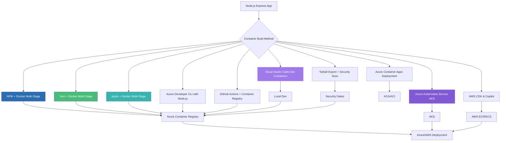

# Publishing Node.js Express Apps as Container Images: A Complete Guide to 10 Deployment Approaches

## Node.js Edition: From Development to Production on Azure

### Introduction: The Node.js Containerization Journey on Azure

In our previous series, we explored the complete landscape of containerizing .NET 10 applications across Azure and AWS, covering nine distinct approaches for Azure and ten for AWS. We then extended this journey to Python FastAPI applications, adapting those proven patterns for the Python ecosystem. Now, we turn our attention to the Node.js ecosystem—the runtime that powers millions of APIs and web applications worldwide.

The **AI Powered Video Tutorial Portal**—an Express.js-based REST API for managing course videos, content, and section assets with MongoDB—represents exactly the kind of modern Node.js application that benefits from robust containerization strategies on Azure. With its modular architecture, Mongoose ODM, Winston logging, and comprehensive Swagger documentation, this project showcases the patterns that make Node.js a premier choice for API development.

This series adapts the proven patterns from our .NET and Python containerization guides to the Node.js ecosystem, focusing on Azure deployment with Visual Studio Code as the primary development environment. Whether you're deploying an Express.js backend, a NestJS application, or a microservices architecture, you'll find battle-tested patterns for containerizing Node.js applications at scale on Azure.



### Stories at a Glance

**Companion stories in this Node.js series:**

- 📦 **1. NPM + Docker Multi-Stage: The Classic Node.js Approach** – Leveraging npm with optimized multi-stage Docker builds for Express.js applications on Azure Container Registry

- 🧶 **2. Yarn + Docker: Deterministic Dependency Management** – Using Yarn for reproducible builds with Yarn Berry and Plug'n'Play for optimal container performance

- ⚡ **3. pnpm + Docker: Disk-Efficient Node.js Containers** – Leveraging pnpm's content-addressable storage for faster installs and smaller images

- 🚀 **4. Azure Container Apps: Serverless Node.js Deployment** – Deploying Express.js applications to Azure Container Apps with auto-scaling and managed infrastructure

- 💻 **5. Visual Studio Code Dev Containers: Local Development to Production** – Using VS Code Dev Containers for consistent Node.js development environments that mirror Azure production

- 🔧 **6. Azure Developer CLI (azd) with Node.js: The Turnkey Solution** – Full-stack deployments with `azd up`, Azure Container Apps provisioning, and infrastructure-as-code with Bicep

- 🔒 **7. Tarball Export + Runtime Load: Security-First CI/CD Workflows** – Generating container tarballs, integrating with Trivy/Grype for vulnerability scanning, and deploying to air-gapped Azure environments

- ☸️ **8. Azure Kubernetes Service (AKS): Node.js Microservices at Scale** – Deploying Express.js applications to AKS, Helm charts, GitOps with Flux, and production-grade operations

- 🤖 **9. GitHub Actions + Container Registry: CI/CD for Node.js** – Automated container builds, testing, and deployment with GitHub Actions workflows to Azure

- 🏗️ **10. AWS CDK & Copilot: Multi-Cloud Node.js Container Deployments** – Deploying Node.js Express applications to AWS ECS with AWS Copilot, infrastructure-as-code with CDK, and Fargate serverless orchestration

---

## 1. 📦 NPM + Docker Multi-Stage: The Classic Node.js Approach

### Introduction to npm for Node.js Containerization

npm (Node Package Manager) remains the most widely used package manager for Node.js applications. For the AI Powered Video Tutorial Portal—an Express.js application with dependencies like Express, Mongoose, Winston, and Swagger UI Express—npm provides a straightforward, battle-tested approach to dependency management.

### The npm-Optimized Dockerfile for Azure

```dockerfile
# ============================================
# AI Powered Video Tutorial Portal - npm Build for Azure
# ============================================
# Production-ready Dockerfile for Express.js + npm
# Optimized for Azure Container Registry and Container Apps

# Stage 1: Builder with npm
FROM node:20-alpine AS builder

WORKDIR /app

# Copy package files first for layer caching
COPY package*.json ./

# Install production dependencies only
RUN npm ci --only=production --omit=dev

# Stage 2: Runtime
FROM node:20-alpine AS runtime

# Install runtime dependencies for health checks
RUN apk add --no-cache curl

# Create non-root user for security
RUN addgroup -g 1001 -S nodejs && \
    adduser -S nodejs -u 1001

WORKDIR /app

# Copy installed dependencies from builder
COPY --from=builder --chown=nodejs:nodejs /app/node_modules ./node_modules

# Copy application code
COPY --chown=nodejs:nodejs . .

# Switch to non-root user
USER nodejs

# Expose port
EXPOSE 3000

# Health check for Azure Container Apps
HEALTHCHECK --interval=30s --timeout=3s --start-period=10s --retries=3 \
    CMD curl -f http://localhost:3000/health || exit 1

# Run the application
CMD ["node", "server.js"]
```

### Build and Push to Azure Container Registry

```bash
# Login to ACR
az acr login --name coursetutorials

# Build and push
docker build -t coursetutorials.azurecr.io/courses-api:latest -f Dockerfile.npm .
docker push coursetutorials.azurecr.io/courses-api:latest
```

---

## 2. 🧶 Yarn + Docker: Deterministic Dependency Management

### Yarn for Reproducible Node.js Builds

Yarn offers deterministic builds with yarn.lock files, ensuring consistent dependency resolution across environments.

### The Yarn-Optimized Dockerfile for Azure

```dockerfile
# ============================================
# AI Powered Video Tutorial Portal - Yarn Build for Azure
# ============================================

FROM node:20-alpine AS builder

# Enable Yarn Berry (Yarn 2+)
RUN corepack enable && corepack prepare yarn@4.0.0 --activate

WORKDIR /app

# Copy package files with Yarn Berry lockfile
COPY package.json yarn.lock .yarnrc.yml ./

# Install dependencies with Yarn (immutable for CI)
RUN yarn install --immutable

# Stage 2: Runtime
FROM node:20-alpine AS runtime

RUN apk add --no-cache curl
RUN addgroup -g 1001 -S nodejs && adduser -S nodejs -u 1001

WORKDIR /app

# Copy dependencies and application
COPY --from=builder --chown=nodejs:nodejs /app/.yarn ./.yarn
COPY --from=builder --chown=nodejs:nodejs /app/node_modules ./node_modules
COPY --chown=nodejs:nodejs . .

USER nodejs

EXPOSE 3000

HEALTHCHECK --interval=30s --timeout=3s --start-period=10s --retries=3 \
    CMD curl -f http://localhost:3000/health || exit 1

CMD ["node", "server.js"]
```

---

## 3. ⚡ pnpm + Docker: Disk-Efficient Node.js Containers

### pnpm for Space-Efficient Node.js Containers

pnpm uses a content-addressable storage approach, reducing disk usage and installation time significantly.

### The pnpm-Optimized Dockerfile for Azure

```dockerfile
# ============================================
# AI Powered Video Tutorial Portal - pnpm Build for Azure
# ============================================

FROM node:20-alpine AS builder

# Enable pnpm
RUN corepack enable && corepack prepare pnpm@8.0.0 --activate

WORKDIR /app

# Copy package files
COPY package.json pnpm-lock.yaml ./

# Install dependencies with pnpm
RUN pnpm install --frozen-lockfile --prod

# Stage 2: Runtime
FROM node:20-alpine AS runtime

RUN apk add --no-cache curl
RUN addgroup -g 1001 -S nodejs && adduser -S nodejs -u 1001

WORKDIR /app

# Copy dependencies (pnpm uses symlinks, so preserve structure)
COPY --from=builder --chown=nodejs:nodejs /app/node_modules ./node_modules
COPY --chown=nodejs:nodejs . .

USER nodejs

EXPOSE 3000

HEALTHCHECK CMD curl -f http://localhost:3000/health || exit 1

CMD ["node", "server.js"]
```

---

## 4. 🚀 Azure Container Apps: Serverless Node.js Deployment

### Deploying Express.js to Azure Container Apps

Azure Container Apps provides a serverless container platform ideal for Node.js applications with automatic scaling.

### Bicep Infrastructure for Node.js

```bicep
// main.bicep
param environmentName string
param location string = resourceGroup().location

// Container Registry
resource acr 'Microsoft.ContainerRegistry/registries@2023-07-01' = {
  name: 'acr${environmentName}'
  location: location
  sku: { name: 'Standard' }
}

// Container Apps Environment
resource containerEnv 'Microsoft.App/managedEnvironments@2023-11-02-preview' = {
  name: 'cae-${environmentName}'
  location: location
  properties: {
    appLogsConfiguration: {
      destination: 'log-analytics'
      logAnalyticsConfiguration: {
        customerId: logAnalytics.properties.customerId
        sharedKey: logAnalytics.listKeys().primarySharedKey
      }
    }
  }
}

// Container App
resource api 'Microsoft.App/containerApps@2023-11-02-preview' = {
  name: 'courses-api'
  location: location
  properties: {
    environmentId: containerEnv.id
    configuration: {
      ingress: {
        external: true
        targetPort: 3000
        traffic: [{ latestRevision: true, weight: 100 }]
      }
    }
    template: {
      containers: [{
        image: '${acr.properties.loginServer}/courses-api:latest'
        name: 'api'
        resources: { cpu: 0.5, memory: '1Gi' }
        probes: [{
          type: 'Liveness'
          httpGet: { path: '/health', port: 3000 }
          initialDelaySeconds: 30
          periodSeconds: 10
        }]
      }]
      scale: {
        minReplicas: 0
        maxReplicas: 10
        rules: [{ name: 'http', http: { metadata: { concurrentRequests: '50' } } }]
      }
    }
  }
}
```

---

## 5. 💻 Visual Studio Code Dev Containers: Local Development to Production

### Using VS Code Dev Containers for Consistent Node.js Development

```json
// .devcontainer/devcontainer.json
{
  "name": "Node.js Express API - Azure",
  "build": {
    "dockerfile": "Dockerfile",
    "context": ".."
  },
  "customizations": {
    "vscode": {
      "extensions": [
        "ms-vscode.vscode-node-azure-pack",
        "mongodb.mongodb-vscode",
        "ms-azuretools.vscode-docker",
        "GitHub.copilot"
      ]
    }
  },
  "forwardPorts": [3000, 27017],
  "postCreateCommand": "npm install",
  "remoteUser": "node"
}
```

```dockerfile
# .devcontainer/Dockerfile
FROM mcr.microsoft.com/devcontainers/javascript-node:20

RUN npm install -g npm@latest
RUN apt-get update && apt-get install -y curl mongodb-mongosh

WORKDIR /workspace
```

---

## 6. 🔧 Azure Developer CLI (azd) with Node.js: The Turnkey Solution

### Full-Stack Deployments with azd for Node.js

```yaml
# azure.yaml
name: courses-portal-api
metadata:
  template: azd-init@1.0.0

services:
  api:
    project: .
    host: containerapp
    language: js
    docker:
      path: ./Dockerfile
      context: ./
    target:
      port: 3000
```

```bash
azd init
azd up
```

---

## 7. 🔒 Tarball Export + Runtime Load: Security-First CI/CD Workflows

### Security Scanning for Node.js Containers

```bash
# Build tarball
docker build -t courses-api:scan -f Dockerfile .
docker save courses-api:scan -o courses-api.tar

# Scan with Trivy for Node.js vulnerabilities
trivy image --input courses-api.tar --severity HIGH,CRITICAL

# Scan with Grype for license compliance
grype courses-api.tar

# Generate SBOM
syft courses-api.tar -o spdx-json > sbom.json

# Load and push after approval
docker load -i courses-api.tar
docker tag courses-api:scan coursetutorials.azurecr.io/courses-api:approved
docker push coursetutorials.azurecr.io/courses-api:approved
```

---

## 8. ☸️ Azure Kubernetes Service (AKS): Node.js Microservices at Scale

### Deploying Express.js to AKS

```yaml
# deployment.yaml
apiVersion: apps/v1
kind: Deployment
metadata:
  name: courses-api
  namespace: courses
spec:
  replicas: 3
  selector:
    matchLabels:
      app: courses-api
  template:
    metadata:
      labels:
        app: courses-api
    spec:
      containers:
      - name: api
        image: coursetutorials.azurecr.io/courses-api:latest
        ports:
        - containerPort: 3000
        env:
        - name: MONGODB_URI
          valueFrom:
            secretKeyRef:
              name: mongodb-secret
              key: uri
        resources:
          requests:
            memory: "256Mi"
            cpu: "250m"
          limits:
            memory: "512Mi"
            cpu: "500m"
        livenessProbe:
          httpGet:
            path: /health
            port: 3000
          initialDelaySeconds: 30
          periodSeconds: 10
```

---

## 9. 🤖 GitHub Actions + Container Registry: CI/CD for Node.js

### Automated Node.js Container Pipeline

```yaml
# .github/workflows/deploy.yml
name: Build and Deploy Node.js API

on:
  push:
    branches: [main]

jobs:
  build:
    runs-on: ubuntu-latest
    steps:
    - uses: actions/checkout@v4
    
    - name: Setup Node.js
      uses: actions/setup-node@v4
      with:
        node-version: '20'
    
    - name: Install dependencies
      run: npm ci
    
    - name: Run tests
      run: npm test
    
    - name: Login to ACR
      uses: azure/docker-login@v1
      with:
        login-server: coursetutorials.azurecr.io
        username: ${{ secrets.ACR_USERNAME }}
        password: ${{ secrets.ACR_PASSWORD }}
    
    - name: Build and push
      run: |
        docker build -t coursetutorials.azurecr.io/courses-api:${{ github.sha }} .
        docker push coursetutorials.azurecr.io/courses-api:${{ github.sha }}
    
    - name: Deploy to ACA
      run: az containerapp update --name courses-api --resource-group rg-courses --image coursetutorials.azurecr.io/courses-api:${{ github.sha }}
```

---

## 10. 🏗️ AWS CDK & Copilot: Multi-Cloud Node.js Container Deployments

### Deploying Node.js to AWS ECS with Copilot

```bash
# Initialize Copilot app
copilot init \
    --app courses-portal \
    --name api \
    --type "Load Balanced Web Service" \
    --dockerfile ./Dockerfile \
    --port 3000 \
    --deploy
```

### AWS CDK with TypeScript

```typescript
// app.ts
import * as cdk from 'aws-cdk-lib';
import * as ecs from 'aws-cdk-lib/aws-ecs';
import * as ecs_patterns from 'aws-cdk-lib/aws-ecs-patterns';
import * as ecr from 'aws-cdk-lib/aws-ecr';
import * as ec2 from 'aws-cdk-lib/aws-ec2';

export class CoursesPortalStack extends cdk.Stack {
  constructor(scope: cdk.App, id: string, props?: cdk.StackProps) {
    super(scope, id, props);

    const vpc = new ec2.Vpc(this, 'CoursesVpc', { maxAzs: 2 });
    const repository = new ecr.Repository(this, 'CoursesRepo', { repositoryName: 'courses-api' });
    const cluster = new ecs.Cluster(this, 'CoursesCluster', { vpc });

    new ecs_patterns.ApplicationLoadBalancedFargateService(this, 'CoursesService', {
      cluster,
      taskImageOptions: {
        image: ecs.ContainerImage.fromEcrRepository(repository, 'latest'),
        containerPort: 3000,
        environment: { NODE_ENV: 'production' }
      },
      desiredCount: 3,
      memoryLimitMiB: 512,
      cpu: 256
    });
  }
}
```

---

### Stories at a Glance

**Complete Node.js series (10 stories):**

- 📦 **1. NPM + Docker Multi-Stage: The Classic Node.js Approach** – Leveraging npm with optimized multi-stage Docker builds for Express.js applications on Azure Container Registry

- 🧶 **2. Yarn + Docker: Deterministic Dependency Management** – Using Yarn for reproducible builds with Yarn Berry and Plug'n'Play for optimal container performance

- ⚡ **3. pnpm + Docker: Disk-Efficient Node.js Containers** – Leveraging pnpm's content-addressable storage for faster installs and smaller images

- 🚀 **4. Azure Container Apps: Serverless Node.js Deployment** – Deploying Express.js applications to Azure Container Apps with auto-scaling and managed infrastructure

- 💻 **5. Visual Studio Code Dev Containers: Local Development to Production** – Using VS Code Dev Containers for consistent Node.js development environments that mirror Azure production

- 🔧 **6. Azure Developer CLI (azd) with Node.js: The Turnkey Solution** – Full-stack deployments with `azd up`, Azure Container Apps provisioning, and infrastructure-as-code with Bicep

- 🔒 **7. Tarball Export + Runtime Load: Security-First CI/CD Workflows** – Generating container tarballs, integrating with Trivy/Grype for vulnerability scanning, and deploying to air-gapped Azure environments

- ☸️ **8. Azure Kubernetes Service (AKS): Node.js Microservices at Scale** – Deploying Express.js applications to AKS, Helm charts, GitOps with Flux, and production-grade operations

- 🤖 **9. GitHub Actions + Container Registry: CI/CD for Node.js** – Automated container builds, testing, and deployment with GitHub Actions workflows to Azure

- 🏗️ **10. AWS CDK & Copilot: Multi-Cloud Node.js Container Deployments** – Deploying Node.js Express applications to AWS ECS with AWS Copilot, infrastructure-as-code with CDK, and Fargate serverless orchestration

---

## What's Next?

Over the coming weeks, each approach in this Node.js series will be explored in exhaustive detail. We'll examine real-world Azure deployment scenarios for the AI Powered Video Tutorial Portal, benchmark performance across methods, and provide production-ready patterns for CI/CD pipelines. Whether you're a startup deploying your first Express.js application or an enterprise migrating Node.js workloads to Azure Kubernetes Service, you'll find practical guidance tailored to your infrastructure requirements.

The evolution from npm to Yarn and pnpm reflects a maturing ecosystem where Node.js stands at the forefront of API development. By mastering these ten approaches, you'll be equipped to choose the right tool for every scenario—from rapid prototyping with VS Code Dev Containers to mission-critical production deployments on Azure Kubernetes Service.

**Coming next in the series:**
**📦 NPM + Docker Multi-Stage: The Classic Node.js Approach** – We'll explore npm-optimized Dockerfiles, layer caching strategies, and Azure Container Registry integration for Express.js applications.