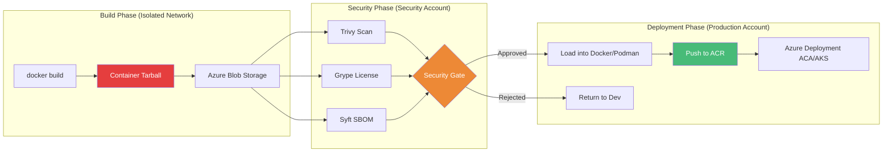
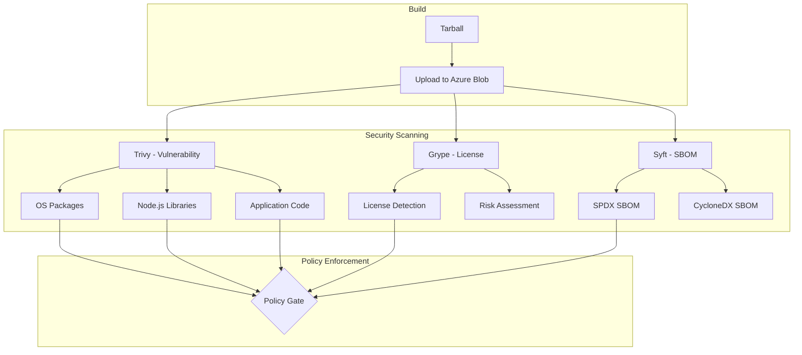
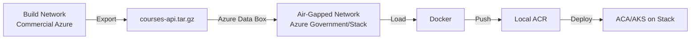

# Tarball Export + Runtime Load: Security-First CI/CD Workflows - Azure

## Building Secure Node.js Container Pipelines with Azure and Air-Gapped Deployments

### Introduction: The Security Imperative for Node.js Applications on Azure

In the [previous installment](#) of this Node.js series, we explored Azure Developer CLI (`azd`)—the turnkey solution that transforms complex Azure deployments into a single command. While `azd` prioritizes developer velocity, many organizations face a different priority: **security**. In regulated industries like finance, healthcare, and government, container images cannot be pushed directly to registries without passing through rigorous security gates—vulnerability scanning, license compliance checks, and approval workflows.

For the **AI Powered Video Tutorial Portal**—an Express.js application handling course content, user data, and API endpoints—this security-first approach is not optional; it's mandatory for compliance frameworks like HIPAA, PCI DSS, and FedRAMP.

This is where **tarball export** becomes indispensable. By decoupling image creation from image distribution, the Docker `save`/`load` workflow enables security-first CI/CD pipelines where images are built, scanned, approved, and only then loaded into production registries. This installment explores the complete security-first workflow for Node.js Express applications: generating container tarballs, integrating with security scanners (Trivy, Grype, Syft), implementing approval gates, and deploying to air-gapped Azure environments like Azure Government and Azure Stack.



### Stories at a Glance

**Complete Node.js series (10 stories):**

- 📦 **1. NPM + Docker Multi-Stage: The Classic Node.js Approach** – Leveraging npm with optimized multi-stage Docker builds for Express.js applications on Azure Container Registry

- 🧶 **2. Yarn + Docker: Deterministic Dependency Management** – Using Yarn for reproducible builds with Yarn Berry and Plug'n'Play for optimal container performance

- ⚡ **3. pnpm + Docker: Disk-Efficient Node.js Containers** – Leveraging pnpm's content-addressable storage for faster installs and smaller images

- 🚀 **4. Azure Container Apps: Serverless Node.js Deployment** – Deploying Express.js applications to Azure Container Apps with auto-scaling and managed infrastructure

- 💻 **5. Visual Studio Code Dev Containers: Local Development to Production** – Using VS Code Dev Containers for consistent Node.js development environments that mirror Azure production

- 🔧 **6. Azure Developer CLI (azd) with Node.js: The Turnkey Solution** – Full-stack deployments with `azd up`, Azure Container Apps provisioning, and infrastructure-as-code with Bicep

- 🔒 **7. Tarball Export + Runtime Load: Security-First CI/CD Workflows** – Generating container tarballs, integrating with Trivy/Grype for vulnerability scanning, and deploying to air-gapped Azure environments *(This story)*

- ☸️ **8. Azure Kubernetes Service (AKS): Node.js Microservices at Scale** – Deploying Express.js applications to AKS, Helm charts, GitOps with Flux, and production-grade operations

- 🤖 **9. GitHub Actions + Container Registry: CI/CD for Node.js** – Automated container builds, testing, and deployment with GitHub Actions workflows to Azure

- 🏗️ **10. AWS CDK & Copilot: Multi-Cloud Node.js Container Deployments** – Deploying Node.js Express applications to AWS ECS with AWS Copilot, infrastructure-as-code with CDK, and Fargate serverless orchestration

---

## Understanding Tarball Export for Node.js Containers

### What Is a Container Tarball?

A container tarball is a portable archive containing a complete OCI (Open Container Initiative) image. Unlike Docker images stored in a local daemon, tarballs are **self-contained files** that can be:

- Stored in Azure Blob Storage for artifact management
- Transferred across air-gapped networks (Azure Government, Azure Stack)
- Scanned by security tools (Trivy, Grype, Microsoft Defender for Cloud)
- Signed for supply chain integrity with Azure Key Vault
- Loaded into any OCI-compliant runtime on Azure

### Tarball Structure for Node.js Applications

```bash
# Extract and examine a container tarball
tar -xzf courses-api.tar.gz
tree courses-api/

courses-api/
├── blobs/
│   └── sha256/
│       ├── a1b2c3d4e5f6...  # Base OS layer (Debian slim)
│       ├── b2c3d4e5f6g7...  # Node.js runtime layer
│       ├── c3d4e5f6g7h8...  # Node.js dependencies layer
│       └── d4e5f6g7h8i9...  # Application code layer
├── index.json               # Image index (points to manifest)
└── oci-layout               # Version marker
```

### Why Tarball Export Matters for Node.js Security

| Security Requirement | Direct Push to ACR | Tarball Export | Azure Compliance Impact |
|---------------------|-------------------|----------------|------------------------|
| **Vulnerability Scanning** | After push (remediation harder) | Before push (block at source) | FedRAMP requirement |
| **License Compliance** | After push | Before push | HIPAA requirement |
| **SBOM Generation** | Optional | Mandatory in workflow | Executive Order 14028 |
| **Image Signing** | Possible | Enforced before loading | NIST SP 800-190 |
| **Air-Gapped Deployments** | Impossible | Native support | Azure Government/Stack |
| **Approval Workflows** | Complex | Built-in | DoD Impact Level |

---

## Generating Container Tarballs for Node.js

### Building the Image and Exporting Tarball

```bash
# Build the Express.js container image
docker build -t courses-api:latest -f Dockerfile .

# Save the image as a tarball
docker save courses-api:latest -o courses-api.tar

# Compress for storage (recommended for Azure Blob)
gzip courses-api.tar
# Creates courses-api.tar.gz

# Verify tarball contents
tar -tzf courses-api.tar.gz | head -10
# blobs/
# blobs/sha256/
# blobs/sha256/a1b2c3...
# index.json
# oci-layout
```

### Multi-Architecture Tarball Export

```bash
# Build for multiple architectures
docker build --platform linux/amd64 -t courses-api:amd64 -f Dockerfile .
docker build --platform linux/arm64 -t courses-api:arm64 -f Dockerfile .

# Save as separate tarballs
docker save courses-api:amd64 -o courses-api-amd64.tar
docker save courses-api:arm64 -o courses-api-arm64.tar

# Or create a multi-arch manifest
docker manifest create courses-api:latest \
    courses-api:amd64 \
    courses-api:arm64

docker save courses-api:latest -o courses-api-multiarch.tar
```

### Store Tarball in Azure Blob Storage

```bash
# Create storage account
az storage account create \
    --name coursesartifacts \
    --resource-group rg-courses-portal \
    --location eastus \
    --sku Standard_LRS

# Create container
az storage container create \
    --name container-images \
    --account-name coursesartifacts

# Upload tarball
az storage blob upload \
    --account-name coursesartifacts \
    --container-name container-images \
    --name courses-api-$(date +%Y%m%d-%H%M%S).tar.gz \
    --file courses-api.tar.gz

# Enable versioning for audit trail
az storage account blob-service-properties update \
    --name coursesartifacts \
    --enable-versioning true
```

---

## Security Scanning Workflow for Node.js

### Comprehensive Scanning Pipeline



### Step 1: Vulnerability Scanning with Trivy

Trivy (from Aqua Security) scans container images for vulnerabilities, including Node.js packages:

```bash
# Install Trivy
# macOS
brew install trivy

# Ubuntu/Debian
sudo apt install trivy

# Windows (Chocolatey)
choco install trivy

# Scan tarball directly
trivy image --input courses-api.tar.gz \
    --severity HIGH,CRITICAL \
    --format table \
    --exit-code 1 \
    --ignore-unfixed \
    --vuln-type os,library \
    --scanners vuln,secret,config
```

**Sample Output:**
```
courses-api.tar.gz (debian 12.0)
===================================
Total: 28 vulnerabilities (UNKNOWN: 0, LOW: 8, MEDIUM: 12, HIGH: 6, CRITICAL: 2)

┌───────────────────┬────────────────┬──────────┬───────────────────┬───────────────┐
│     Library       │ Vulnerability  │ Severity │  Installed Version│ Fixed Version │
├───────────────────┼────────────────┼──────────┼───────────────────┼───────────────┤
│ libc6             │ CVE-2023-4911  │ HIGH     │ 2.36-9+deb12u1    │ 2.36-9+deb12u2│
│ node:express      │ CVE-2023-XXXX  │ HIGH     │ 4.18.2            │ 4.18.3        │
│ mongoose          │ CVE-2023-YYYY  │ CRITICAL │ 7.5.0             │ 7.5.1         │
│ jsonwebtoken      │ CVE-2023-ZZZZ  │ HIGH     │ 9.0.0             │ 9.0.1         │
└───────────────────┴────────────────┴──────────┴───────────────────┴───────────────┘
```

### Step 2: License Compliance with Grype

Grype (from Anchore) identifies software licenses and compliance issues:

```bash
# Install Grype
# macOS
brew install grype

# Ubuntu/Debian
curl -sSfL https://raw.githubusercontent.com/anchore/grype/main/install.sh | sh -s -- -b /usr/local/bin

# Scan tarball
grype courses-api.tar.gz \
    --fail-on high \
    --output table \
    --only-fixed \
    --scope all-layers
```

**Sample Output:**
```
NAME              INSTALLED   LICENSES      VULNERABILITIES
express           4.18.2      MIT           (none)
mongoose          7.5.0       MIT           (1 critical)
jsonwebtoken      9.0.0       MIT           (1 high)
winston           3.11.0      MIT           (none)
helmet            7.0.0       MIT           (none)

License Summary:
- MIT: 12 packages (allowed)
- Apache-2.0: 2 packages (allowed)
- BSD-3-Clause: 1 package (allowed)
- GPL-3.0: 0 packages
```

### Step 3: SBOM Generation with Syft

Syft generates Software Bill of Materials (SBOM) in industry-standard formats:

```bash
# Install Syft
# macOS
brew install syft

# Ubuntu/Debian
curl -sSfL https://raw.githubusercontent.com/anchore/syft/main/install.sh | sh -s -- -b /usr/local/bin

# Generate SPDX SBOM
syft courses-api.tar.gz \
    -o spdx-json \
    > sbom-courses-api.spdx.json

# Generate CycloneDX SBOM
syft courses-api.tar.gz \
    -o cyclonedx-json \
    > sbom-courses-api.cyclonedx.json

# Upload SBOM to Azure Blob
az storage blob upload \
    --account-name coursesartifacts \
    --container-name sboms \
    --name sbom-$(date +%Y%m%d).spdx.json \
    --file sbom-courses-api.spdx.json
```

---

## Microsoft Defender for Cloud Integration

### Enable Defender for Container Registry

```bash
# Enable Microsoft Defender for Cloud on ACR
az security pricing create \
    --name ContainerRegistry \
    --tier standard

# Configure scanning on push
az acr update \
    --name coursetutorials \
    --resource-group rg-courses-portal \
    --admin-enabled false

# Enable vulnerability scanning
az acr config update \
    --name coursetutorials \
    --resource-group rg-courses-portal \
    --scan-on-push true
```

### Scan Results with Defender

```bash
# Get scan results for an image
az acr repository show-manifests \
    --name coursetutorials \
    --repository courses-api \
    --query "[?tags[0]=='latest'].{digest:digest, scanStatus:scanStatus}" \
    --output table

# View vulnerability findings
az acr repository show \
    --name coursetutorials \
    --image courses-api:latest \
    --query vulnerabilities
```

---

## Complete CI/CD Pipeline with Security Gates

### GitHub Actions Security-First Pipeline for Node.js

```yaml
# .github/workflows/secure-deploy.yml
name: Secure Node.js Container Build and Deploy

on:
  push:
    branches: [main]
  pull_request:
    branches: [main]

env:
  ACR_NAME: coursetutorials
  IMAGE_NAME: courses-api
  NODE_VERSION: '20'

jobs:
  secure-build:
    runs-on: ubuntu-latest
    permissions:
      contents: read
      id-token: write
      security-events: write
    
    steps:
    - name: Checkout code
      uses: actions/checkout@v4

    - name: Setup Node.js
      uses: actions/setup-node@v4
      with:
        node-version: ${{ env.NODE_VERSION }}

    - name: Install dependencies
      run: npm ci

    - name: Run Node.js tests
      run: npm test

    - name: Build Docker image
      run: |
        docker build -t ${{ env.IMAGE_NAME }}:${{ github.sha }} .
        docker save ${{ env.IMAGE_NAME }}:${{ github.sha }} -o image.tar
        gzip image.tar

    - name: Install security tools
      run: |
        # Install Trivy
        wget https://github.com/aquasecurity/trivy/releases/download/v0.48.0/trivy_0.48.0_Linux-64bit.deb
        sudo dpkg -i trivy_0.48.0_Linux-64bit.deb
        
        # Install Grype
        curl -sSfL https://raw.githubusercontent.com/anchore/grype/main/install.sh | sh -s -- -b /usr/local/bin
        
        # Install Syft
        curl -sSfL https://raw.githubusercontent.com/anchore/syft/main/install.sh | sh -s -- -b /usr/local/bin

    - name: Run Trivy vulnerability scan
      id: trivy
      continue-on-error: true
      run: |
        trivy image --input image.tar.gz \
          --severity HIGH,CRITICAL \
          --format sarif \
          --output trivy-results.sarif \
          --exit-code 1
        echo "status=$?" >> $GITHUB_OUTPUT

    - name: Upload Trivy results to GitHub Security
      uses: github/codeql-action/upload-sarif@v3
      with:
        sarif_file: trivy-results.sarif

    - name: Run Grype license scan
      id: grype
      continue-on-error: true
      run: |
        grype image.tar.gz --fail-on high --output json > grype-results.json
        DENIED_COUNT=$(jq '.matches[] | select(.artifact.licenses[] | .value == "GPL-3.0" or .value == "AGPL-3.0")' grype-results.json | wc -l)
        if [ $DENIED_COUNT -gt 0 ]; then
          echo "status=failed" >> $GITHUB_OUTPUT
          exit 1
        else
          echo "status=passed" >> $GITHUB_OUTPUT
        fi

    - name: Generate SBOM
      run: |
        syft image.tar.gz -o spdx-json > sbom.spdx.json

    - name: Security Gate
      if: steps.trivy.outputs.status != '0' || steps.grype.outputs.status != 'passed'
      run: |
        echo "❌ Security gate failed!"
        echo "Trivy status: ${{ steps.trivy.outputs.status }}"
        echo "Grype status: ${{ steps.grype.outputs.status }}"
        exit 1

    - name: Login to Azure
      uses: azure/login@v1
      with:
        client-id: ${{ secrets.AZURE_CLIENT_ID }}
        tenant-id: ${{ secrets.AZURE_TENANT_ID }}
        subscription-id: ${{ secrets.AZURE_SUBSCRIPTION_ID }}

    - name: Login to ACR
      run: az acr login --name ${{ env.ACR_NAME }}

    - name: Load and push approved image to ACR
      run: |
        docker load -i image.tar.gz
        docker tag ${{ env.IMAGE_NAME }}:${{ github.sha }} ${{ env.ACR_NAME }}.azurecr.io/${{ env.IMAGE_NAME }}:${{ github.sha }}
        docker push ${{ env.ACR_NAME }}.azurecr.io/${{ env.IMAGE_NAME }}:${{ github.sha }}

    - name: Deploy to Azure Container Apps
      run: |
        az containerapp update \
          --name courses-api \
          --resource-group rg-courses-portal \
          --image ${{ env.ACR_NAME }}.azurecr.io/${{ env.IMAGE_NAME }}:${{ github.sha }}
```

---

## Air-Gapped Deployments with Azure Government and Azure Stack

### Transferring Tarballs Across Air-Gapped Networks

For Azure Government, Azure Stack, or air-gapped environments:



### Deploying to Azure Stack Hub

```bash
# On Azure Stack Hub (air-gapped network)
# 1. Transfer tarball via Data Box or physical media
# 2. Load image
docker load -i /media/courses-api.tar.gz

# 3. Push to local registry
docker tag courses-api:latest azurestack.contoso.com/courses-api:latest
docker push azurestack.contoso.com/courses-api:latest

# 4. Deploy to Azure Stack Hub Container Apps
az stack containerapp update \
    --name courses-api \
    --resource-group rg-courses-portal \
    --image azurestack.contoso.com/courses-api:latest
```

### Azure Government Deployment

```bash
# Configure Azure Government CLI
az cloud set --name AzureUSGovernment
az login

# Load and push to Government ACR
docker load -i courses-api.tar.gz
docker tag courses-api:latest $GOV_ACCOUNT.azurecr.us/courses-api:latest
docker push $GOV_ACCOUNT.azurecr.us/courses-api:latest

# Deploy to Azure Government Container Apps
az containerapp update \
    --name courses-api \
    --resource-group rg-courses-portal \
    --image $GOV_ACCOUNT.azurecr.us/courses-api:latest
```

---

## Image Signing with Azure Key Vault

### Set Up Key Vault for Signing

```bash
# Create Key Vault
az keyvault create \
    --name courses-kv \
    --resource-group rg-courses-portal \
    --location eastus \
    --enable-soft-delete

# Generate signing key
az keyvault key create \
    --name courses-signing-key \
    --vault-name courses-kv \
    --kty RSA \
    --size 2048

# Get key ID
KEY_ID=$(az keyvault key show \
    --name courses-signing-key \
    --vault-name courses-kv \
    --query key.kid -o tsv)
```

### Sign and Verify Images with Cosign

```bash
# Install Cosign
go install github.com/sigstore/cosign/v2/cmd/cosign@latest

# Sign image with Azure Key Vault
cosign sign \
    --key azurekms://courses-kv.vault.azure.net/keys/courses-signing-key \
    $ACR_NAME.azurecr.io/courses-api:latest

# Verify signature
cosign verify \
    --key azurekms://courses-kv.vault.azure.net/keys/courses-signing-key \
    $ACR_NAME.azurecr.io/courses-api:latest
```

---

## Compliance Frameworks

### NIST SP 800-190 Compliance for Node.js

| Requirement | Implementation | Verification |
|-------------|----------------|--------------|
| **Image Scanning** | Trivy + Defender for Cloud | Scan before deployment |
| **SBOM Generation** | Syft + Azure Blob | SPDX stored in audit log |
| **Vulnerability Management** | Block HIGH/CRITICAL findings | Security gate in pipeline |
| **Image Signing** | Cosign + Azure Key Vault | Verify before deployment |
| **Least Privilege** | Non-root user in Dockerfile | User ID check |
| **Audit Trail** | Azure Monitor + Log Analytics | All operations logged |

### FedRAMP High Requirements

```bash
# FedRAMP High requirements for Node.js containers
# 1. Image must be scanned for vulnerabilities
trivy image --input courses-api.tar.gz --severity HIGH,CRITICAL --exit-code 1

# 2. SBOM must be generated and stored
syft courses-api.tar.gz -o spdx-json > sbom.spdx.json
az storage blob upload --account-name coursesartifacts --container-name sboms --name sbom.spdx.json --file sbom.spdx.json

# 3. Image must be signed
cosign sign --key $KEY_ID $ACR_NAME.azurecr.io/courses-api:latest

# 4. Audit logs must be enabled
az monitor diagnostic-settings create \
    --resource $ACR_ID \
    --name audit-logs \
    --logs '[{"category":"AuditEvent","enabled":true}]' \
    --workspace $LOG_ANALYTICS_ID
```

---

## Troubleshooting Security Pipelines

### Issue 1: Trivy False Positives

**Problem:** Vulnerability reported but not applicable to Node.js application.

**Solution:**
```yaml
# .trivyignore
# CVE-2024-12345 - This CVE affects Java libraries, not Node.js
CVE-2024-12345
# CVE-2024-67890 - Patched in next release, not exploitable
CVE-2024-67890
```

```bash
trivy image --input courses-api.tar.gz --ignorefile .trivyignore
```

### Issue 2: Large Tarball Size

**Problem:** Tarball exceeds artifact storage limits.

**Solution:**
```dockerfile
# Use multi-stage builds with minimal base
FROM node:20-alpine AS builder
# ... build deps ...

FROM node:20-alpine AS runtime
# ... copy only needed files ...

# Use Alpine for even smaller images
FROM node:20-alpine AS runtime
```

### Issue 3: SBOM Generation Fails

**Error:** `Error: unable to generate SBOM`

**Solution:**
```bash
# Validate tarball integrity
tar -tzf courses-api.tar.gz | head -10
# Should show blobs/ and index.json

# If corrupted, regenerate
docker save courses-api:latest -o courses-api.tar
gzip courses-api.tar
```

### Issue 4: Node.js Dependency Vulnerabilities

**Error:** `Critical vulnerability found in package`

**Solution:**
```bash
# Update vulnerable packages in package.json
npm audit fix
# or
npm install express@latest mongoose@latest

# Regenerate package-lock.json
npm install
git add package-lock.json
git commit -m "Update vulnerable dependencies"
```

---

## Performance Metrics

| Step | Time | Notes |
|------|------|-------|
| **docker build** | 30-60s | Depends on dependencies |
| **docker save** | 10-15s | Creates tarball |
| **Trivy Scan** | 30-45s | Cached base layers |
| **Grype Scan** | 20-30s | License analysis |
| **Syft SBOM** | 10-15s | Generation |
| **Azure Blob Upload** | 10-20s | Network dependent |
| **Load + Push** | 10-20s | Runtime required |

---

## Conclusion: Security as Code for Node.js

Tarball export transforms container delivery from an uncontrolled push model to a controlled, auditable supply chain for Node.js applications. For the AI Powered Video Tutorial Portal, this security-first approach ensures:

- **No vulnerable images reach production** – Blocked by Trivy security gate
- **Complete supply chain visibility** – SBOMs for every image in Azure Blob
- **License compliance** – Automated detection of restricted licenses (GPL, AGPL)
- **Air-gapped support** – Deploy to Azure Government and Azure Stack
- **Audit trail** – Every image is scanned, signed, and approved
- **FedRAMP compliance** – Meets federal security requirements

While direct registry pushes offer convenience, security-first organizations require the control and visibility that tarball export provides. By integrating Trivy, Grype, Syft, and Azure Key Vault into your CI/CD pipeline, you can achieve the same level of security automation that major government and enterprise organizations require for Node.js workloads.

---

### Stories at a Glance

**Complete Node.js series (10 stories):**

- 📦 **1. NPM + Docker Multi-Stage: The Classic Node.js Approach** – Leveraging npm with optimized multi-stage Docker builds for Express.js applications on Azure Container Registry

- 🧶 **2. Yarn + Docker: Deterministic Dependency Management** – Using Yarn for reproducible builds with Yarn Berry and Plug'n'Play for optimal container performance

- ⚡ **3. pnpm + Docker: Disk-Efficient Node.js Containers** – Leveraging pnpm's content-addressable storage for faster installs and smaller images

- 🚀 **4. Azure Container Apps: Serverless Node.js Deployment** – Deploying Express.js applications to Azure Container Apps with auto-scaling and managed infrastructure

- 💻 **5. Visual Studio Code Dev Containers: Local Development to Production** – Using VS Code Dev Containers for consistent Node.js development environments that mirror Azure production

- 🔧 **6. Azure Developer CLI (azd) with Node.js: The Turnkey Solution** – Full-stack deployments with `azd up`, Azure Container Apps provisioning, and infrastructure-as-code with Bicep

- 🔒 **7. Tarball Export + Runtime Load: Security-First CI/CD Workflows** – Generating container tarballs, integrating with Trivy/Grype for vulnerability scanning, and deploying to air-gapped Azure environments *(This story)*

- ☸️ **8. Azure Kubernetes Service (AKS): Node.js Microservices at Scale** – Deploying Express.js applications to AKS, Helm charts, GitOps with Flux, and production-grade operations

- 🤖 **9. GitHub Actions + Container Registry: CI/CD for Node.js** – Automated container builds, testing, and deployment with GitHub Actions workflows to Azure

- 🏗️ **10. AWS CDK & Copilot: Multi-Cloud Node.js Container Deployments** – Deploying Node.js Express applications to AWS ECS with AWS Copilot, infrastructure-as-code with CDK, and Fargate serverless orchestration

---

## What's Next?

Over the coming weeks, each approach in this Node.js series will be explored in exhaustive detail. We'll examine real-world Azure deployment scenarios for the AI Powered Video Tutorial Portal, benchmark performance across methods, and provide production-ready patterns for CI/CD pipelines. Whether you're a startup deploying your first Express.js application or an enterprise migrating Node.js workloads to Azure Kubernetes Service, you'll find practical guidance tailored to your infrastructure requirements.

Tarball export represents the security-first evolution of Node.js container delivery—ensuring that every image is scanned, verified, and approved before reaching production. By mastering these ten approaches, you'll be equipped to choose the right tool for every scenario—from rapid prototyping with `azd up` to FedRAMP-compliant production deployments on Azure Government.

**Coming next in the series:**
**☸️ Azure Kubernetes Service (AKS): Node.js Microservices at Scale** – Deploying Express.js applications to AKS, Helm charts, GitOps with Flux, and production-grade operations