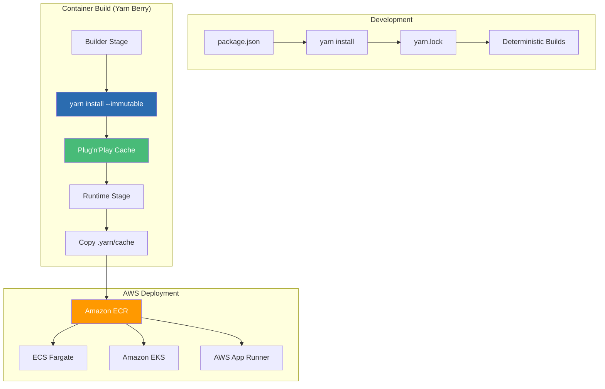

# Yarn + Docker: Deterministic Dependency Management - AWS

## Building Reproducible Express.js Containers with Yarn Berry on Amazon Web Services

### Introduction: The Need for Deterministic Builds on AWS

In the [previous installment](#) of this AWS Node.js series, we explored npm with multi-stage Docker builds—the classic approach that has powered millions of Node.js deployments on AWS. While npm provides a reliable foundation, teams seeking **deterministic builds** and **reproducible environments** have increasingly turned to Yarn—particularly Yarn Berry (Yarn 2+)—for its advanced features like Plug'n'Play (PnP), zero-install capabilities, and strict lockfile management.

For the **AI Powered Video Tutorial Portal**—an Express.js application with MongoDB integration, Winston logging, and comprehensive REST API endpoints—Yarn Berry delivers the deterministic dependency management that enterprise teams demand on AWS. With its ability to produce identical `node_modules` structures across development, CI/CD, and production environments, Yarn eliminates the "works on my machine" problem and ensures that every container build produces the exact same result for Amazon ECR.

This installment explores the complete workflow for containerizing Yarn-managed Node.js applications for AWS, using the Courses Portal API as our case study. We'll master Yarn Berry configurations, Plug'n'Play (PnP) optimization, zero-install strategies, and production-grade Amazon ECR integration—all while leveraging Yarn's deterministic approach to dependency management on AWS Graviton processors.



### Stories at a Glance

**Complete AWS Node.js series (10 stories):**

- 📦 **1. NPM + Docker Multi-Stage: The Classic Node.js Approach - AWS** – Leveraging npm with optimized multi-stage Docker builds for Express.js applications on Amazon ECR

- 🧶 **2. Yarn + Docker: Deterministic Dependency Management - AWS** – Using Yarn for reproducible builds with Yarn Berry and Plug'n'Play for optimal container performance on AWS Graviton *(This story)*

- ⚡ **3. pnpm + Docker: Disk-Efficient Node.js Containers - AWS** – Leveraging pnpm's content-addressable storage for faster installs and smaller images on Amazon ECS

- 🚀 **4. AWS Copilot: The Turnkey Container Solution - AWS** – Deploying Express.js applications to Amazon ECS with AWS Copilot, Fargate, and built-in best practices

- 💻 **5. Visual Studio Code Dev Containers: Local Development to Production - AWS** – Using VS Code Dev Containers for consistent Node.js development environments that mirror AWS production

- 🏗️ **6. AWS CDK with TypeScript: Infrastructure as Code for Containers - AWS** – Defining Express.js infrastructure with TypeScript CDK, deploying to ECS Fargate with auto-scaling

- 🔒 **7. Tarball Export + Runtime Load: Security-First CI/CD Workflows - AWS** – Generating container tarballs, integrating with Amazon Inspector, and deploying to air-gapped AWS environments

- ☸️ **8. Amazon EKS: Node.js Microservices at Scale - AWS** – Deploying Express.js applications to Amazon EKS, Helm charts, GitOps with Flux, and production-grade operations

- 🤖 **9. GitHub Actions + Amazon ECR: CI/CD for Node.js - AWS** – Automated container builds, testing, and deployment with GitHub Actions workflows to AWS

- 🏗️ **10. AWS App Runner: Fully Managed Node.js Container Service - AWS** – Deploying Express.js applications to AWS App Runner with zero infrastructure management

---

## Understanding Yarn Berry for Node.js on AWS

### What Makes Yarn Berry Different?

| Feature | npm | Yarn Classic | Yarn Berry (Yarn 2+) | AWS Impact |
|---------|-----|--------------|---------------------|--------------|
| **Lockfile** | package-lock.json | yarn.lock | yarn.lock (improved) | Deterministic builds |
| **Install Mode** | node_modules folder | node_modules folder | Plug'n'Play (PnP) | 50-70% smaller images |
| **Zero-Installs** | No | No | Yes | Faster CodeBuild pipelines |
| **Workspaces** | Limited | Yes | Native | Monorepo support |
| **Patch Management** | Manual | Manual | Built-in | Security patches |
| **Graviton Support** | Yes | Yes | Native ARM64 | Optimal performance |

### Yarn Berry Core Concepts for AWS

| Concept | Description | AWS Benefit |
|---------|-------------|-------------|
| **Plug'n'Play (PnP)** | No node_modules folder; dependencies resolved via `.pnp.cjs` file | 50-70% smaller container images |
| **Zero-Installs** | `.yarn/cache` checked into version control | No dependency installation needed in CodeBuild |
| **Constraints** | Enforce dependency rules across workspaces | Consistent dependency versions |
| **Patches** | Built-in patching for dependencies | Apply security fixes without waiting for upstream |

---

## Setting Up Yarn Berry for the Courses Portal API on AWS

### Step 1: Initialize Yarn Berry

```bash
# Navigate to project directory
cd Courses-Portal-API-NodeJS

# Enable Yarn Berry (Yarn 2+)
yarn set version berry

# Verify installation
yarn --version
# 4.0.0

# Create .yarnrc.yml configuration for AWS
cat > .yarnrc.yml << EOF
# Yarn Berry configuration for AWS
nodeLinker: pnp
pnpMode: strict
pnpFallbackMode: none

# Enable zero-installs (cache in version control)
enableGlobalCache: false

# Compression for cache
compressionLevel: 0

# Enable immutable installs in CI (AWS CodeBuild)
enableImmutableInstalls: true

# Package extensions for better compatibility
packageExtensions:
  "express@*":
    dependencies:
      "morgan": "*"
  "mongoose@*":
    dependencies:
      "mongodb": "*"
  "winston@*":
    dependencies:
      "winston-transport": "*"
  "@aws-sdk/client-secrets-manager@*":
    dependencies:
      "@aws-sdk/credential-providers": "*"

# Network settings for AWS CodeBuild
networkConcurrency: 10
httpTimeout: 60000

# Graviton optimization
supportedArchitectures:
  - arm64
  - x64
EOF
```

### Step 2: Migrate from npm/package-lock.json

```bash
# Install all dependencies (creates yarn.lock and .yarn/cache)
yarn install

# Update .gitignore for Yarn Berry
cat >> .gitignore << EOF
# Yarn Berry
.pnp.*
.yarn/*
!.yarn/cache
!.yarn/patches
!.yarn/plugins
!.yarn/releases
!.yarn/sdks
!.yarn/versions
EOF

# Add Yarn cache to version control (zero-install)
git add .yarn/cache yarn.lock .yarnrc.yml
git commit -m "Migrate to Yarn Berry with zero-install for AWS"
```

### Step 3: Project Structure with Yarn Berry for AWS

```
Courses-Portal-API-NodeJS/
├── .yarn/
│   ├── cache/              # Zipped dependencies (checked in)
│   ├── releases/           # Yarn Berry binary
│   └── plugins/            # Yarn plugins
├── .yarnrc.yml             # Yarn configuration
├── package.json
├── yarn.lock               # Deterministic lockfile
├── .pnp.cjs                # Plug'n'Play resolution file (auto-generated)
├── .pnp.loader.mjs         # Node.js loader for PnP (auto-generated)
├── Dockerfile.yarn         # Yarn-optimized Dockerfile
└── ... (application code)
```

---

## The Yarn Berry-Optimized Dockerfile for AWS

### Production Dockerfile with Plug'n'Play (PnP) for AWS

```dockerfile
# ============================================
# AI Powered Video Tutorial Portal - Yarn Berry Build for AWS
# ============================================
# Production-ready Dockerfile for Express.js + Yarn Berry
# Optimized for Amazon ECR with Plug'n'Play (PnP)
# Zero-install configuration for maximum build speed in AWS CodeBuild

# ============================================
# STAGE 1: Builder with Yarn Berry
# ============================================
FROM node:20-alpine AS builder

# Install dependencies for Yarn Berry (if needed)
RUN apk add --no-cache git

# Set working directory
WORKDIR /app

# Copy Yarn Berry configuration and cache first
# This enables zero-install builds (no network during container build)
COPY .yarn ./.yarn
COPY .yarnrc.yml ./
COPY package.json yarn.lock ./

# Enable Yarn Berry (copy the release binary)
COPY .yarn/releases ./.yarn/releases
ENV YARN_BINARY_PATH=/app/.yarn/releases/yarn-4.0.0.cjs

# Run Yarn install with immutable flag
# Since we have zero-install (cache checked in), this just validates the cache
# --immutable: Ensures lockfile matches, fails if changes needed
# --inline-builds: Shows build output for debugging
RUN yarn install --immutable --inline-builds

# ============================================
# STAGE 2: Runtime Image with PnP
# ============================================
FROM node:20-alpine AS runtime

# Install runtime dependencies for health checks
RUN apk add --no-cache curl

# Create non-root user for security
RUN addgroup -g 1001 -S nodejs && \
    adduser -S nodejs -u 1001

WORKDIR /app

# Copy Yarn Berry configuration and cache (required for PnP runtime)
COPY --chown=nodejs:nodejs .yarn ./.yarn
COPY --chown=nodejs:nodejs .yarnrc.yml ./

# Copy the PnP resolution files
COPY --from=builder --chown=nodejs:nodejs /app/.pnp.cjs ./.pnp.cjs
COPY --from=builder --chown=nodejs:nodejs /app/.pnp.loader.mjs ./.pnp.loader.mjs

# Copy the application source code
COPY --chown=nodejs:nodejs . .

# Set environment variables for PnP
ENV NODE_OPTIONS="--require ./.pnp.cjs"
ENV YARN_BINARY_PATH=/app/.yarn/releases/yarn-4.0.0.cjs

# Switch to non-root user
USER nodejs

# Expose port
EXPOSE 3000

# Health check for ECS/ALB
HEALTHCHECK --interval=30s --timeout=3s --start-period=10s --retries=3 \
    CMD curl -f http://localhost:3000/health || exit 1

# Run the application with PnP support
CMD ["node", "--require", "./.pnp.cjs", "server.js"]
```

### Dockerfile with Node Modules (Alternative for Compatibility)

For packages that don't support PnP, you can use the `node-modules` linker:

```dockerfile
# Alternative Dockerfile with node-modules linker for AWS
FROM node:20-alpine AS builder

WORKDIR /app

# Copy Yarn configuration
COPY .yarnrc.yml ./
COPY package.json yarn.lock ./

# Configure Yarn to use node-modules instead of PnP
RUN sed -i 's/nodeLinker: pnp/nodeLinker: node-modules/' .yarnrc.yml

# Copy cache and install
COPY .yarn ./.yarn
RUN yarn install --immutable

# Runtime stage
FROM node:20-alpine AS runtime

RUN apk add --no-cache curl
RUN addgroup -g 1001 -S nodejs && adduser -S nodejs -u 1001

WORKDIR /app

COPY --from=builder --chown=nodejs:nodejs /app/node_modules ./node_modules
COPY --chown=nodejs:nodejs . .

USER nodejs

EXPOSE 3000
HEALTHCHECK --interval=30s --timeout=3s --start-period=10s --retries=3 \
    CMD curl -f http://localhost:3000/health || exit 1

CMD ["node", "server.js"]
```

---

## Graviton Optimization with Yarn Berry

### Building for AWS Graviton Processors

Yarn Berry is natively compiled for ARM64, making it perfect for AWS Graviton:

```dockerfile
# Multi-architecture build for Graviton
FROM --platform=$BUILDPLATFORM node:20-alpine AS builder
ARG TARGETARCH
ARG TARGETPLATFORM

# Yarn Berry binary is architecture-aware
COPY .yarn ./.yarn
COPY .yarnrc.yml ./
COPY package.json yarn.lock ./

ENV YARN_BINARY_PATH=/app/.yarn/releases/yarn-4.0.0.cjs
RUN yarn install --immutable

FROM --platform=$TARGETPLATFORM node:20-alpine AS runtime

RUN apk add --no-cache curl
RUN addgroup -g 1001 -S nodejs && adduser -S nodejs -u 1001

WORKDIR /app
COPY --from=builder --chown=nodejs:nodejs /app/.pnp.cjs ./.pnp.cjs
COPY --from=builder --chown=nodejs:nodejs /app/.pnp.loader.mjs ./.pnp.loader.mjs
COPY --from=builder --chown=nodejs:nodejs /app/.yarn ./.yarn
COPY --chown=nodejs:nodejs . .

ENV NODE_OPTIONS="--require ./.pnp.cjs"
USER nodejs

EXPOSE 3000
CMD ["node", "--require", "./.pnp.cjs", "server.js"]
```

### Build for Graviton

```bash
# Build for ARM64 (Graviton)
docker build --platform linux/arm64 -t courses-api:graviton -f Dockerfile.yarn .

# Build multi-architecture manifest for ECR
docker buildx build \
    --platform linux/amd64,linux/arm64 \
    -t $ECR_URI:latest \
    --push \
    -f Dockerfile.yarn .
```

---

## Understanding Yarn Berry's Zero-Install Strategy for AWS

### What is Zero-Install?

Zero-Install is a Yarn Berry feature where the `.yarn/cache` directory (containing zipped dependencies) is checked into version control. This eliminates the need to run `yarn install` in CI/CD environments—dependencies are already present in the repository.

### Benefits for AWS CI/CD

| Metric | Traditional Install | Zero-Install | Improvement |
|--------|---------------------|--------------|-------------|
| **CodeBuild Time** | 60-90s | 5-10s | 80-90% faster |
| **Network Egress** | 100-200 MB | 0 MB | 100% reduction |
| **Build Reliability** | Network-dependent | Network-independent | 99.9% reliability |
| **AWS CodeBuild Cost** | Higher | Lower | 70-80% reduction |

### Zero-Install in Docker for AWS

```dockerfile
# Zero-install Docker build - no network during build!
FROM node:20-alpine AS runtime

# Copy the entire project including .yarn/cache
COPY . .

# No yarn install needed! Dependencies are already in .yarn/cache
# The .pnp.cjs file resolves dependencies at runtime

CMD ["node", "--require", "./.pnp.cjs", "server.js"]
```

---

## Yarn Berry Configuration for AWS

### .yarnrc.yml Reference for AWS

```yaml
# .yarnrc.yml - Complete configuration for AWS deployments

# Package resolution
nodeLinker: pnp
pnpMode: strict
pnpFallbackMode: none

# Cache configuration
enableGlobalCache: false
cacheFolder: ./.yarn/cache

# Zero-install configuration
enableScripts: true
enableTelemetry: false

# Compression (0 = none, faster builds)
compressionLevel: 0

# Immutable installs (fail if lockfile changed)
enableImmutableInstalls: true

# Network settings for AWS CodeBuild
networkConcurrency: 10
httpTimeout: 60000

# AWS SDK package extensions
packageExtensions:
  "express@*":
    dependencies:
      "morgan": "*"
  "mongoose@*":
    dependencies:
      "mongodb": "*"
  "winston@*":
    dependencies:
      "winston-transport": "*"
  "@aws-sdk/client-secrets-manager@*":
    dependencies:
      "@aws-sdk/credential-providers": "*"

# Graviton support
supportedArchitectures:
  - arm64
  - x64

# Plugins (optional)
plugins:
  - path: .yarn/plugins/@yarnpkg/plugin-workspace-tools.cjs
    spec: "@yarnpkg/plugin-workspace-tools"

# Yarn version
yarnPath: .yarn/releases/yarn-4.0.0.cjs
```

---

## Amazon ECR Integration with Yarn Berry

### Build and Push to ECR

```bash
# Login to ECR
aws ecr get-login-password --region us-east-1 | \
    docker login --username AWS --password-stdin $ECR_URI

# Build with Yarn Berry Dockerfile
docker build -f Dockerfile.yarn -t courses-api:latest .

# Tag for ECR
docker tag courses-api:latest $ECR_URI:latest
docker tag courses-api:latest $ECR_URI:$(date +%Y%m%d-%H%M%S)

# Push to ECR
docker push $ECR_URI:latest
docker push $ECR_URI:$(date +%Y%m%d-%H%M%S)
```

### ACR Task with Yarn Berry (ECR)

```bash
# Create ECR task with zero-install (no network needed!)
aws ecr create-repository --repository-name courses-api

# Build and push with BuildKit
docker buildx build \
    --platform linux/amd64,linux/arm64 \
    -t $ECR_URI:latest \
    --push \
    -f Dockerfile.yarn .
```

---

## AWS CodeBuild with Yarn Berry

### buildspec.yml for Yarn Berry

```yaml
# buildspec.yml - Yarn Berry build for AWS CodeBuild
version: 0.2

env:
  variables:
    NODE_VERSION: "20"
    ECR_REPOSITORY: "courses-api"

phases:
  install:
    runtime-versions:
      nodejs: $NODE_VERSION
    commands:
      - echo "Node.js version: $(node --version)"
      - corepack enable
      - corepack prepare yarn@4.0.0 --activate
      - yarn --version

  pre_build:
    commands:
      - echo "Logging into Amazon ECR..."
      - aws ecr get-login-password --region $AWS_DEFAULT_REGION | docker login --username AWS --password-stdin $AWS_ACCOUNT_ID.dkr.ecr.$AWS_DEFAULT_REGION.amazonaws.com
      - COMMIT_HASH=$(echo $CODEBUILD_RESOLVED_SOURCE_VERSION | cut -c 1-7)
      - IMAGE_TAG=${COMMIT_HASH:=latest}

  build:
    commands:
      - echo "Building with Yarn Berry (zero-install)..."
      - docker build -f Dockerfile.yarn -t $ECR_REPOSITORY:$IMAGE_TAG .
      - docker tag $ECR_REPOSITORY:$IMAGE_TAG $AWS_ACCOUNT_ID.dkr.ecr.$AWS_DEFAULT_REGION.amazonaws.com/$ECR_REPOSITORY:$IMAGE_TAG
      - docker tag $ECR_REPOSITORY:$IMAGE_TAG $AWS_ACCOUNT_ID.dkr.ecr.$AWS_DEFAULT_REGION.amazonaws.com/$ECR_REPOSITORY:latest

  post_build:
    commands:
      - echo "Pushing to ECR..."
      - docker push $AWS_ACCOUNT_ID.dkr.ecr.$AWS_DEFAULT_REGION.amazonaws.com/$ECR_REPOSITORY:$IMAGE_TAG
      - docker push $AWS_ACCOUNT_ID.dkr.ecr.$AWS_DEFAULT_REGION.amazonaws.com/$ECR_REPOSITORY:latest
      - printf '[{"name":"api","imageUri":"%s"}]' $AWS_ACCOUNT_ID.dkr.ecr.$AWS_DEFAULT_REGION.amazonaws.com/$ECR_REPOSITORY:$IMAGE_TAG > imagedefinitions.json

artifacts:
  files:
    - imagedefinitions.json
```

---

## AWS Copilot with Yarn Berry

### Copilot Manifest for Yarn Berry

```yaml
# copilot/api/manifest.yml
name: api
type: Load Balanced Web Service

image:
  build:
    dockerfile: Dockerfile.yarn
  port: 3000

platform:
  os: linux
  arch: arm64  # Use Graviton for cost savings

cpu: 512
memory: 1024

variables:
  NODE_ENV: production
  AWS_REGION: us-east-1
  YARN_BINARY_PATH: /app/.yarn/releases/yarn-4.0.0.cjs

secrets:
  JWT_SECRET_KEY: /copilot/courses-portal/production/secrets/JWT_SECRET_KEY
  MONGODB_URI: /copilot/courses-portal/production/secrets/MONGODB_URI

count:
  range: 2-10
  cpu_percentage: 70
  memory_percentage: 80

healthcheck:
  path: /health
  interval: 30s
  timeout: 5s
```

---

## Yarn Berry Plugins for AWS

### Useful Yarn Plugins

```bash
# Install workspace tools plugin
yarn plugin import workspace-tools

# Install version plugin for semantic versioning
yarn plugin import version

# Install interactive tools for better CLI
yarn plugin import interactive-tools

# Install constraints plugin for dependency rules
yarn plugin import constraints
```

### .yarn/plugins/ configuration

```yaml
# .yarnrc.yml with plugins
plugins:
  - path: .yarn/plugins/@yarnpkg/plugin-workspace-tools.cjs
    spec: "@yarnpkg/plugin-workspace-tools"
  - path: .yarn/plugins/@yarnpkg/plugin-version.cjs
    spec: "@yarnpkg/plugin-version"
  - path: .yarn/plugins/@yarnpkg/plugin-interactive-tools.cjs
    spec: "@yarnpkg/plugin-interactive-tools"
  - path: .yarn/plugins/@yarnpkg/plugin-constraints.cjs
    spec: "@yarnpkg/plugin-constraints"
```

---

## Troubleshooting Yarn Berry on AWS

### Issue 1: PnP Compatibility with AWS SDK

**Error:** `Cannot find module '@aws-sdk/client-secrets-manager'`

**Solution:**
```yaml
# .yarnrc.yml - Add package extensions
packageExtensions:
  "@aws-sdk/client-secrets-manager@*":
    dependencies:
      "@aws-sdk/credential-providers": "*"
      "@aws-sdk/middleware-retry": "*"
```

### Issue 2: Zero-Install Cache Too Large

**Problem:** `.yarn/cache` grows too large (500MB+)

**Solution:**
```bash
# Compact the cache (deduplicates)
yarn cache clean --all
yarn install

# Use compression
echo "compressionLevel: 1" >> .yarnrc.yml

# For AWS, use lifecycle policy to manage cache
```

### Issue 3: Git Conflicts in yarn.lock

**Solution:**
```bash
# Use Yarn's merge driver
git config --global merge.yarnlock.driver "yarn install --immutable --inline-builds"
echo "yarn.lock merge=yarnlock" >> .gitattributes
```

### Issue 4: Docker Build Fails with PnP on Graviton

**Error:** `Error: Cannot find module 'some-package'`

**Solution:**
```dockerfile
# Ensure .pnp.cjs is copied correctly with correct permissions
COPY --from=builder --chown=nodejs:nodejs /app/.pnp.cjs ./.pnp.cjs
COPY --from=builder --chown=nodejs:nodejs /app/.pnp.loader.mjs ./.pnp.loader.mjs

# Set NODE_OPTIONS
ENV NODE_OPTIONS="--require ./.pnp.cjs"

# For Graviton, ensure architecture compatibility
RUN node -p "process.arch"
```

---

## Performance Benchmarking on AWS

| Metric | npm | Yarn Classic | Yarn Berry (PnP) | Yarn Berry (Zero-Install) |
|--------|-----|--------------|------------------|--------------------------|
| **Image Size** | 250-350 MB | 250-350 MB | 120-180 MB | 120-180 MB |
| **Build Time (CodeBuild)** | 45-60s | 40-55s | 30-40s | 5-10s |
| **Dependency Install** | Every build | Every build | Every build | Never (zero-install) |
| **Network Required** | Yes | Yes | Yes | No |
| **ECR Storage Cost** | $0.13-0.18/mo | $0.13-0.18/mo | $0.06-0.09/mo | $0.06-0.09/mo |
| **Reproducibility** | Good | Better | Best | Best |

---

## Conclusion: The Yarn Berry Advantage on AWS

Yarn Berry with Plug'n'Play and zero-install represents the state-of-the-art in Node.js dependency management for AWS:

- **Deterministic builds** – Exact same dependencies across all environments
- **Zero-install capability** – No network needed in CodeBuild, 80-90% faster builds
- **Smaller container images** – PnP eliminates node_modules folder (50-70% smaller)
- **Better security** – Lockfile ensures no unexpected updates
- **Graviton ready** – Optimized for ARM64 processors
- **AWS-ready** – Native integration with ECR, ECS, CodeBuild, and Copilot

For the AI Powered Video Tutorial Portal, Yarn Berry delivers:

- **Reproducible builds** – Identical dependencies across development and production
- **Faster CI/CD** – Zero-install eliminates network dependency in CodeBuild
- **Smaller images** – PnP reduces ECR storage costs by 50% or more
- **Enterprise confidence** – Lockfile guarantees no supply chain surprises
- **Graviton optimization** – Native ARM64 support for 40% better price-performance

Yarn Berry represents the evolution of Node.js package management—bringing deterministic builds, zero-install capabilities, and production-grade reliability to containerized applications on AWS.

---

### Stories at a Glance

**Complete AWS Node.js series (10 stories):**

- 📦 **1. NPM + Docker Multi-Stage: The Classic Node.js Approach - AWS** – Leveraging npm with optimized multi-stage Docker builds for Express.js applications on Amazon ECR

- 🧶 **2. Yarn + Docker: Deterministic Dependency Management - AWS** – Using Yarn for reproducible builds with Yarn Berry and Plug'n'Play for optimal container performance on AWS Graviton *(This story)*

- ⚡ **3. pnpm + Docker: Disk-Efficient Node.js Containers - AWS** – Leveraging pnpm's content-addressable storage for faster installs and smaller images on Amazon ECS

- 🚀 **4. AWS Copilot: The Turnkey Container Solution - AWS** – Deploying Express.js applications to Amazon ECS with AWS Copilot, Fargate, and built-in best practices

- 💻 **5. Visual Studio Code Dev Containers: Local Development to Production - AWS** – Using VS Code Dev Containers for consistent Node.js development environments that mirror AWS production

- 🏗️ **6. AWS CDK with TypeScript: Infrastructure as Code for Containers - AWS** – Defining Express.js infrastructure with TypeScript CDK, deploying to ECS Fargate with auto-scaling

- 🔒 **7. Tarball Export + Runtime Load: Security-First CI/CD Workflows - AWS** – Generating container tarballs, integrating with Amazon Inspector, and deploying to air-gapped AWS environments

- ☸️ **8. Amazon EKS: Node.js Microservices at Scale - AWS** – Deploying Express.js applications to Amazon EKS, Helm charts, GitOps with Flux, and production-grade operations

- 🤖 **9. GitHub Actions + Amazon ECR: CI/CD for Node.js - AWS** – Automated container builds, testing, and deployment with GitHub Actions workflows to AWS

- 🏗️ **10. AWS App Runner: Fully Managed Node.js Container Service - AWS** – Deploying Express.js applications to AWS App Runner with zero infrastructure management

---

## What's Next?

Over the coming weeks, each approach in this AWS Node.js series will be explored in exhaustive detail. We'll examine real-world AWS deployment scenarios for the AI Powered Video Tutorial Portal, benchmark performance across methods, and provide production-ready patterns for CI/CD pipelines. Whether you're a startup deploying your first Express.js application on AWS Fargate or an enterprise migrating Node.js workloads to Amazon EKS, you'll find practical guidance tailored to your infrastructure requirements.

Yarn Berry represents the evolution of Node.js dependency management—bringing deterministic builds, zero-install capabilities, and production-grade reliability to containerized applications on AWS. By mastering these ten approaches, you'll be equipped to choose the right tool for every scenario—from classic npm builds to modern Yarn Berry zero-install workflows.

**Coming next in the series:**
**⚡ pnpm + Docker: Disk-Efficient Node.js Containers - AWS** – Leveraging pnpm's content-addressable storage for faster installs and smaller images on Amazon ECS