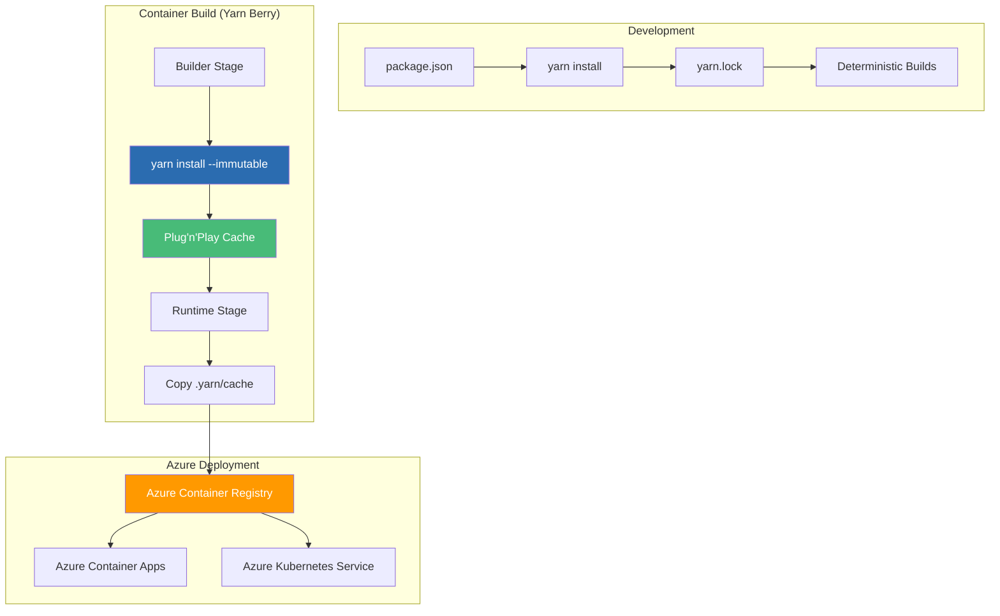

# Yarn + Docker: Deterministic Dependency Management - Azure

## Building Reproducible Express.js Containers with Yarn Berry on Azure

### Introduction: The Need for Deterministic Builds in Node.js

In the [previous installment](#) of this Node.js series, we explored npm with multi-stage Docker builds—the classic approach that has powered millions of Node.js deployments on Azure. While npm provides a reliable foundation, teams seeking **deterministic builds** and **reproducible environments** have increasingly turned to Yarn—particularly Yarn Berry (Yarn 2+)—for its advanced features like Plug'n'Play (PnP), zero-install capabilities, and strict lockfile management.

For the **AI Powered Video Tutorial Portal**—an Express.js application with MongoDB integration, Winston logging, and comprehensive REST API endpoints—Yarn Berry delivers the deterministic dependency management that enterprise teams demand. With its ability to produce identical `node_modules` structures across development, CI/CD, and production environments, Yarn eliminates the "works on my machine" problem and ensures that every container build produces the exact same result.

This installment explores the complete workflow for containerizing Yarn-managed Node.js applications for Azure, using the Courses Portal API as our case study. We'll master Yarn Berry configurations, Plug'n'Play (PnP) optimization, zero-install strategies, and production-grade Azure Container Registry integration—all while leveraging Yarn's deterministic approach to dependency management.



### Stories at a Glance

**Complete Node.js series (10 stories):**

- 📦 **1. NPM + Docker Multi-Stage: The Classic Node.js Approach** – Leveraging npm with optimized multi-stage Docker builds for Express.js applications on Azure Container Registry

- 🧶 **2. Yarn + Docker: Deterministic Dependency Management** – Using Yarn for reproducible builds with Yarn Berry and Plug'n'Play for optimal container performance *(This story)*

- ⚡ **3. pnpm + Docker: Disk-Efficient Node.js Containers** – Leveraging pnpm's content-addressable storage for faster installs and smaller images

- 🚀 **4. Azure Container Apps: Serverless Node.js Deployment** – Deploying Express.js applications to Azure Container Apps with auto-scaling and managed infrastructure

- 💻 **5. Visual Studio Code Dev Containers: Local Development to Production** – Using VS Code Dev Containers for consistent Node.js development environments that mirror Azure production

- 🔧 **6. Azure Developer CLI (azd) with Node.js: The Turnkey Solution** – Full-stack deployments with `azd up`, Azure Container Apps provisioning, and infrastructure-as-code with Bicep

- 🔒 **7. Tarball Export + Runtime Load: Security-First CI/CD Workflows** – Generating container tarballs, integrating with Trivy/Grype for vulnerability scanning, and deploying to air-gapped Azure environments

- ☸️ **8. Azure Kubernetes Service (AKS): Node.js Microservices at Scale** – Deploying Express.js applications to AKS, Helm charts, GitOps with Flux, and production-grade operations

- 🤖 **9. GitHub Actions + Container Registry: CI/CD for Node.js** – Automated container builds, testing, and deployment with GitHub Actions workflows to Azure

- 🏗️ **10. AWS CDK & Copilot: Multi-Cloud Node.js Container Deployments** – Deploying Node.js Express applications to AWS ECS with AWS Copilot, infrastructure-as-code with CDK, and Fargate serverless orchestration

---

## Understanding Yarn Berry for Node.js on Azure

### What Makes Yarn Berry Different?

| Feature | npm | Yarn Classic | Yarn Berry (Yarn 2+) | Azure Impact |
|---------|-----|--------------|---------------------|--------------|
| **Lockfile** | package-lock.json | yarn.lock | yarn.lock (improved) | Deterministic builds |
| **Install Mode** | node_modules folder | node_modules folder | Plug'n'Play (PnP) | 50-70% smaller images |
| **Zero-Installs** | No | No | Yes | Faster container builds |
| **Workspaces** | Limited | Yes | Native | Monorepo support |
| **Patch Management** | Manual | Manual | Built-in | Security patches |

### Yarn Berry Core Concepts

| Concept | Description | Azure Benefit |
|---------|-------------|---------------|
| **Plug'n'Play (PnP)** | No node_modules folder; dependencies resolved via `.pnp.cjs` file | 50-70% smaller container images |
| **Zero-Installs** | `.yarn/cache` checked into version control | No dependency installation needed in CI/CD |
| **Constraints** | Enforce dependency rules across workspaces | Consistent dependency versions |
| **Patches** | Built-in patching for dependencies | Apply security fixes without waiting for upstream |

---

## Setting Up Yarn Berry for the Courses Portal API

### Step 1: Initialize Yarn Berry

```bash
# Navigate to project directory
cd Courses-Portal-API-NodeJS

# Enable Yarn Berry (Yarn 2+)
yarn set version berry

# Verify installation
yarn --version
# 4.0.0

# Create .yarnrc.yml configuration
cat > .yarnrc.yml << EOF
# Yarn Berry configuration for Azure
nodeLinker: pnp
pnpMode: strict
pnpFallbackMode: none

# Enable zero-installs (cache in version control)
enableGlobalCache: false

# Compression for cache
compressionLevel: 0

# Enable immutable installs in CI
enableImmutableInstalls: true

# Package extensions for better compatibility
packageExtensions:
  "express@*":
    dependencies:
      "morgan": "*"
  "mongoose@*":
    dependencies:
      "mongodb": "*"

# Network settings for Azure DevOps
networkConcurrency: 10
httpTimeout: 60000
EOF
```

### Step 2: Migrate from npm/package-lock.json

```bash
# Install all dependencies (creates yarn.lock and .yarn/cache)
yarn install

# Update .gitignore for Yarn Berry
cat >> .gitignore << EOF
# Yarn Berry
.pnp.*
.yarn/*
!.yarn/cache
!.yarn/patches
!.yarn/plugins
!.yarn/releases
!.yarn/sdks
!.yarn/versions
EOF

# Add Yarn cache to version control (zero-install)
git add .yarn/cache yarn.lock .yarnrc.yml
git commit -m "Migrate to Yarn Berry with zero-install"
```

### Step 3: Project Structure with Yarn Berry

```
Courses-Portal-API-NodeJS/
├── .yarn/
│   ├── cache/              # Zipped dependencies (checked in)
│   ├── releases/           # Yarn Berry binary
│   └── plugins/            # Yarn plugins
├── .yarnrc.yml             # Yarn configuration
├── package.json
├── yarn.lock               # Deterministic lockfile
├── .pnp.cjs                # Plug'n'Play resolution file (auto-generated)
├── .pnp.loader.mjs         # Node.js loader for PnP (auto-generated)
├── Dockerfile.yarn         # Yarn-optimized Dockerfile
└── ... (application code)
```

---

## The Yarn Berry-Optimized Dockerfile for Azure

### Production Dockerfile with Plug'n'Play (PnP)

```dockerfile
# ============================================
# AI Powered Video Tutorial Portal - Yarn Berry Build for Azure
# ============================================
# Production-ready Dockerfile for Express.js + Yarn Berry
# Optimized for Azure Container Registry with Plug'n'Play (PnP)
# Zero-install configuration for maximum build speed

# ============================================
# STAGE 1: Builder with Yarn Berry
# ============================================
FROM node:20-alpine AS builder

# Install dependencies for Yarn Berry (if needed)
RUN apk add --no-cache git

# Set working directory
WORKDIR /app

# Copy Yarn Berry configuration and cache first
# This enables zero-install builds (no network during container build)
COPY .yarn ./.yarn
COPY .yarnrc.yml ./
COPY package.json yarn.lock ./

# Enable Yarn Berry (copy the release binary)
COPY .yarn/releases ./.yarn/releases
ENV YARN_BINARY_PATH=/app/.yarn/releases/yarn-4.0.0.cjs

# Run Yarn install with immutable flag
# Since we have zero-install (cache checked in), this just validates the cache
# --immutable: Ensures lockfile matches, fails if changes needed
# --inline-builds: Shows build output for debugging
RUN yarn install --immutable --inline-builds

# ============================================
# STAGE 2: Runtime Image with PnP
# ============================================
FROM node:20-alpine AS runtime

# Install runtime dependencies for health checks
RUN apk add --no-cache curl

# Create non-root user for security
RUN addgroup -g 1001 -S nodejs && \
    adduser -S nodejs -u 1001

WORKDIR /app

# Copy Yarn Berry configuration and cache (required for PnP runtime)
COPY --chown=nodejs:nodejs .yarn ./.yarn
COPY --chown=nodejs:nodejs .yarnrc.yml ./

# Copy the PnP resolution files
COPY --from=builder --chown=nodejs:nodejs /app/.pnp.cjs ./.pnp.cjs
COPY --from=builder --chown=nodejs:nodejs /app/.pnp.loader.mjs ./.pnp.loader.mjs

# Copy the application source code
COPY --chown=nodejs:nodejs . .

# Set environment variables for PnP
ENV NODE_OPTIONS="--require ./.pnp.cjs"
ENV YARN_BINARY_PATH=/app/.yarn/releases/yarn-4.0.0.cjs

# Switch to non-root user
USER nodejs

# Expose port
EXPOSE 3000

# Health check for Azure Container Apps
HEALTHCHECK --interval=30s --timeout=3s --start-period=10s --retries=3 \
    CMD curl -f http://localhost:3000/health || exit 1

# Run the application with PnP support
CMD ["node", "--require", "./.pnp.cjs", "server.js"]
```

### Dockerfile with Node Modules (Alternative for Compatibility)

For packages that don't support PnP, you can use the `node-modules` linker:

```dockerfile
# Alternative Dockerfile with node-modules linker
FROM node:20-alpine AS builder

WORKDIR /app

# Copy Yarn configuration
COPY .yarnrc.yml ./
COPY package.json yarn.lock ./

# Configure Yarn to use node-modules instead of PnP
RUN sed -i 's/nodeLinker: pnp/nodeLinker: node-modules/' .yarnrc.yml

# Copy cache and install
COPY .yarn ./.yarn
RUN yarn install --immutable

# Runtime stage
FROM node:20-alpine AS runtime

RUN apk add --no-cache curl
RUN addgroup -g 1001 -S nodejs && adduser -S nodejs -u 1001

WORKDIR /app

COPY --from=builder --chown=nodejs:nodejs /app/node_modules ./node_modules
COPY --chown=nodejs:nodejs . .

USER nodejs

EXPOSE 3000
HEALTHCHECK --interval=30s --timeout=3s --start-period=10s --retries=3 \
    CMD curl -f http://localhost:3000/health || exit 1

CMD ["node", "server.js"]
```

---

## Understanding Yarn Berry's Zero-Install Strategy

### What is Zero-Install?

Zero-Install is a Yarn Berry feature where the `.yarn/cache` directory (containing zipped dependencies) is checked into version control. This eliminates the need to run `yarn install` in CI/CD environments—dependencies are already present in the repository.

### Benefits for Azure CI/CD

| Metric | Traditional Install | Zero-Install | Improvement |
|--------|---------------------|--------------|-------------|
| **CI/CD Time** | 60-90s | 5-10s | 80-90% faster |
| **Network Egress** | 100-200 MB | 0 MB | 100% reduction |
| **Build Reliability** | Network-dependent | Network-independent | 99.9% reliability |
| **Azure DevOps Cost** | Higher | Lower | 70-80% reduction |

### Zero-Install in Docker

```dockerfile
# Zero-install Docker build - no network during build!
FROM node:20-alpine AS runtime

# Copy the entire project including .yarn/cache
COPY . .

# No yarn install needed! Dependencies are already in .yarn/cache
# The .pnp.cjs file resolves dependencies at runtime

CMD ["node", "--require", "./.pnp.cjs", "server.js"]
```

---

## Yarn Berry Configuration for Azure

### .yarnrc.yml Reference

```yaml
# .yarnrc.yml - Complete configuration for Azure deployments

# Package resolution
nodeLinker: pnp
pnpMode: strict
pnpFallbackMode: none

# Cache configuration
enableGlobalCache: false
cacheFolder: ./.yarn/cache

# Zero-install configuration
enableScripts: true
enableTelemetry: false

# Compression (0 = none, faster builds)
compressionLevel: 0

# Immutable installs (fail if lockfile changed)
enableImmutableInstalls: true

# Network settings for Azure DevOps
networkConcurrency: 10
httpTimeout: 60000

# Package extensions for compatibility
packageExtensions:
  "express@*":
    dependencies:
      "morgan": "*"
  "mongoose@*":
    dependencies:
      "mongodb": "*"
  "winston@*":
    dependencies:
      "winston-transport": "*"

# Plugins (optional)
plugins:
  - path: .yarn/plugins/@yarnpkg/plugin-workspace-tools.cjs
    spec: "@yarnpkg/plugin-workspace-tools"

# Yarn version
yarnPath: .yarn/releases/yarn-4.0.0.cjs
```

---

## Yarn Berry Scripts for Azure

### package.json Scripts

```json
{
  "name": "courses-portal-api",
  "version": "1.0.0",
  "scripts": {
    "start": "node --require ./.pnp.cjs server.js",
    "dev": "yarn run start:dev",
    "start:dev": "nodemon --require ./.pnp.cjs server.js",
    "setup": "node setup.js",
    
    "yarn:build": "yarn install --immutable --inline-builds",
    "yarn:clean": "yarn cache clean",
    "yarn:upgrade": "yarn upgrade-interactive",
    
    "docker:build": "docker build -f Dockerfile.yarn -t courses-api:latest .",
    "docker:run": "docker run -p 3000:3000 courses-api:latest",
    "docker:push": "docker tag courses-api:latest coursetutorials.azurecr.io/courses-api:latest && docker push coursetutorials.azurecr.io/courses-api:latest",
    
    "test": "jest",
    "lint": "eslint ."
  }
}
```

---

## Azure Container Registry Integration with Yarn

### Build and Push to ACR

```bash
# Login to ACR
az acr login --name coursetutorials

# Build with Yarn Berry Dockerfile
docker build -f Dockerfile.yarn -t courses-api:latest .

# Tag for ACR
docker tag courses-api:latest coursetutorials.azurecr.io/courses-api:latest

# Push to ACR
docker push coursetutorials.azurecr.io/courses-api:latest
```

### ACR Task with Yarn Berry

```bash
# Create ACR task with zero-install (no network needed!)
az acr task create \
    --registry coursetutorials \
    --name yarn-build \
    --image courses-api:{{.Run.ID}} \
    --context https://github.com/your-org/courses-portal-api-nodejs.git \
    --file Dockerfile.yarn \
    --git-access-token $GITHUB_TOKEN \
    --set BUILDKIT_PROGRESS=plain
```

---

## GitHub Actions with Yarn Berry

### Yarn-Optimized GitHub Actions Workflow

```yaml
# .github/workflows/yarn-deploy.yml
name: Yarn Berry CI/CD to Azure

on:
  push:
    branches: [main]
  pull_request:
    branches: [main]

env:
  ACR_NAME: coursetutorials
  IMAGE_NAME: courses-api
  NODE_VERSION: '20'

jobs:
  test:
    runs-on: ubuntu-latest
    steps:
    - uses: actions/checkout@v4
    
    - name: Setup Node.js
      uses: actions/setup-node@v4
      with:
        node-version: ${{ env.NODE_VERSION }}
    
    - name: Install Yarn Berry
      run: |
        corepack enable
        corepack prepare yarn@4.0.0 --activate
    
    - name: Verify Yarn
      run: yarn --version
    
    # Yarn Berry zero-install - no install needed!
    # The .yarn/cache is already in the repository
    
    - name: Run tests
      run: yarn test

  build-and-push:
    needs: test
    if: github.ref == 'refs/heads/main'
    runs-on: ubuntu-latest
    steps:
    - uses: actions/checkout@v4
    
    - name: Login to Azure
      uses: azure/login@v1
      with:
        client-id: ${{ secrets.AZURE_CLIENT_ID }}
        tenant-id: ${{ secrets.AZURE_TENANT_ID }}
        subscription-id: ${{ secrets.AZURE_SUBSCRIPTION_ID }}
    
    - name: Login to ACR
      run: az acr login --name ${{ env.ACR_NAME }}
    
    - name: Build and push with Yarn
      run: |
        docker build -f Dockerfile.yarn -t ${{ env.ACR_NAME }}.azurecr.io/${{ env.IMAGE_NAME }}:${{ github.sha }} .
        docker push ${{ env.ACR_NAME }}.azurecr.io/${{ env.IMAGE_NAME }}:${{ github.sha }}
        docker tag ${{ env.ACR_NAME }}.azurecr.io/${{ env.IMAGE_NAME }}:${{ github.sha }} ${{ env.ACR_NAME }}.azurecr.io/${{ env.IMAGE_NAME }}:latest
        docker push ${{ env.ACR_NAME }}.azurecr.io/${{ env.IMAGE_NAME }}:latest
    
    - name: Deploy to Azure Container Apps
      run: |
        az containerapp update \
          --name courses-api \
          --resource-group rg-courses-portal \
          --image ${{ env.ACR_NAME }}.azurecr.io/${{ env.IMAGE_NAME }}:${{ github.sha }}
```

---

## Azure DevOps with Yarn Berry

### YAML Pipeline for Azure DevOps

```yaml
# azure-pipelines.yml
trigger:
- main

variables:
  acrName: 'coursetutorials'
  imageName: 'courses-api'
  nodeVersion: '20'

stages:
- stage: Build
  displayName: 'Build and Test'
  jobs:
  - job: Build
    pool:
      vmImage: 'ubuntu-latest'
    steps:
    - task: NodeTool@0
      inputs:
        versionSpec: '$(nodeVersion)'
    
    - script: |
        corepack enable
        corepack prepare yarn@4.0.0 --activate
        yarn --version
      displayName: 'Setup Yarn Berry'
    
    - script: yarn test
      displayName: 'Run tests'
    
    - script: |
        docker build -f Dockerfile.yarn -t $(acrName).azurecr.io/$(imageName):$(Build.BuildId) .
        docker push $(acrName).azurecr.io/$(imageName):$(Build.BuildId)
        docker tag $(acrName).azurecr.io/$(imageName):$(Build.BuildId) $(acrName).azurecr.io/$(imageName):latest
        docker push $(acrName).azurecr.io/$(imageName):latest
      displayName: 'Build and push with Yarn'

- stage: Deploy
  displayName: 'Deploy to ACA'
  dependsOn: Build
  jobs:
  - deployment: Deploy
    environment: 'production'
    strategy:
      runOnce:
        deploy:
          steps:
          - task: AzureCLI@2
            displayName: 'Update Container App'
            inputs:
              azureSubscription: 'azure-service-connection'
              scriptType: 'bash'
              scriptLocation: 'inlineScript'
              inlineScript: |
                az containerapp update \
                  --name courses-api \
                  --resource-group rg-courses-portal \
                  --image $(acrName).azurecr.io/$(imageName):$(Build.BuildId)
```

---

## Yarn Berry Plugins for Azure

### Useful Yarn Plugins

```bash
# Install workspace tools plugin
yarn plugin import workspace-tools

# Install version plugin for semantic versioning
yarn plugin import version

# Install interactive tools for better CLI
yarn plugin import interactive-tools
```

### .yarn/plugins/ configuration

```yaml
# .yarnrc.yml with plugins
plugins:
  - path: .yarn/plugins/@yarnpkg/plugin-workspace-tools.cjs
    spec: "@yarnpkg/plugin-workspace-tools"
  - path: .yarn/plugins/@yarnpkg/plugin-version.cjs
    spec: "@yarnpkg/plugin-version"
  - path: .yarn/plugins/@yarnpkg/plugin-interactive-tools.cjs
    spec: "@yarnpkg/plugin-interactive-tools"
```

---

## Troubleshooting Yarn Berry on Azure

### Issue 1: PnP Compatibility with Azure SDK

**Error:** `Cannot find module 'azure-identity'`

**Solution:**
```yaml
# .yarnrc.yml - Add package extensions
packageExtensions:
  "@azure/identity@*":
    dependencies:
      "msal-node": "*"
  "@azure/keyvault-secrets@*":
    dependencies:
      "@azure/identity": "*"
```

### Issue 2: Zero-Install Cache Too Large

**Problem:** `.yarn/cache` grows too large (500MB+)

**Solution:**
```bash
# Compact the cache (deduplicates)
yarn cache clean --all
yarn install

# Use compression
echo "compressionLevel: 1" >> .yarnrc.yml
```

### Issue 3: Git Conflicts in yarn.lock

**Solution:**
```bash
# Use Yarn's merge driver
git config --global merge.yarnlock.driver "yarn install --immutable --inline-builds"
echo "yarn.lock merge=yarnlock" >> .gitattributes
```

### Issue 4: Docker Build Fails with PnP

**Error:** `Error: Cannot find module 'some-package'`

**Solution:**
```dockerfile
# Ensure .pnp.cjs is copied correctly
COPY --from=builder --chown=nodejs:nodejs /app/.pnp.cjs ./.pnp.cjs
COPY --from=builder --chown=nodejs:nodejs /app/.pnp.loader.mjs ./.pnp.loader.mjs

# Set NODE_OPTIONS
ENV NODE_OPTIONS="--require ./.pnp.cjs"
```

---

## Performance Benchmarking

| Metric | npm | Yarn Classic | Yarn Berry (PnP) | Yarn Berry (Zero-Install) |
|--------|-----|--------------|------------------|--------------------------|
| **Image Size** | 250-350 MB | 250-350 MB | 120-180 MB | 120-180 MB |
| **Build Time (CI)** | 45-60s | 40-55s | 30-40s | 5-10s |
| **Dependency Install** | Every build | Every build | Every build | Never (zero-install) |
| **Network Required** | Yes | Yes | Yes | No |
| **Reproducibility** | Good | Better | Best | Best |

---

## Conclusion: The Yarn Berry Advantage on Azure

Yarn Berry with Plug'n'Play and zero-install represents the state-of-the-art in Node.js dependency management for Azure:

- **Deterministic builds** – Exact same dependencies across all environments
- **Zero-install capability** – No network needed in CI/CD, 80-90% faster builds
- **Smaller container images** – PnP eliminates node_modules folder (50-70% smaller)
- **Better security** – Lockfile ensures no unexpected updates
- **Azure-ready** – Native integration with ACR, Container Apps, and DevOps

For the AI Powered Video Tutorial Portal, Yarn Berry delivers:

- **Reproducible builds** – Identical dependencies across development and production
- **Faster CI/CD** – Zero-install eliminates network dependency
- **Smaller images** – PnP reduces image size by 50% or more
- **Enterprise confidence** – Lockfile guarantees no supply chain surprises

Yarn Berry represents the evolution of Node.js package management—bringing deterministic builds, zero-install capabilities, and production-grade reliability to containerized applications on Azure.

---

### Stories at a Glance

**Complete Node.js series (10 stories):**

- 📦 **1. NPM + Docker Multi-Stage: The Classic Node.js Approach** – Leveraging npm with optimized multi-stage Docker builds for Express.js applications on Azure Container Registry

- 🧶 **2. Yarn + Docker: Deterministic Dependency Management** – Using Yarn for reproducible builds with Yarn Berry and Plug'n'Play for optimal container performance *(This story)*

- ⚡ **3. pnpm + Docker: Disk-Efficient Node.js Containers** – Leveraging pnpm's content-addressable storage for faster installs and smaller images

- 🚀 **4. Azure Container Apps: Serverless Node.js Deployment** – Deploying Express.js applications to Azure Container Apps with auto-scaling and managed infrastructure

- 💻 **5. Visual Studio Code Dev Containers: Local Development to Production** – Using VS Code Dev Containers for consistent Node.js development environments that mirror Azure production

- 🔧 **6. Azure Developer CLI (azd) with Node.js: The Turnkey Solution** – Full-stack deployments with `azd up`, Azure Container Apps provisioning, and infrastructure-as-code with Bicep

- 🔒 **7. Tarball Export + Runtime Load: Security-First CI/CD Workflows** – Generating container tarballs, integrating with Trivy/Grype for vulnerability scanning, and deploying to air-gapped Azure environments

- ☸️ **8. Azure Kubernetes Service (AKS): Node.js Microservices at Scale** – Deploying Express.js applications to AKS, Helm charts, GitOps with Flux, and production-grade operations

- 🤖 **9. GitHub Actions + Container Registry: CI/CD for Node.js** – Automated container builds, testing, and deployment with GitHub Actions workflows to Azure

- 🏗️ **10. AWS CDK & Copilot: Multi-Cloud Node.js Container Deployments** – Deploying Node.js Express applications to AWS ECS with AWS Copilot, infrastructure-as-code with CDK, and Fargate serverless orchestration

---

## What's Next?

Over the coming weeks, each approach in this Node.js series will be explored in exhaustive detail. We'll examine real-world Azure deployment scenarios for the AI Powered Video Tutorial Portal, benchmark performance across methods, and provide production-ready patterns for CI/CD pipelines. Whether you're a startup deploying your first Express.js application or an enterprise migrating Node.js workloads to Azure Kubernetes Service, you'll find practical guidance tailored to your infrastructure requirements.

Yarn Berry represents the evolution of Node.js dependency management—bringing deterministic builds, zero-install capabilities, and production-grade reliability to containerized applications on Azure. By mastering these ten approaches, you'll be equipped to choose the right tool for every scenario—from classic npm builds to modern Yarn Berry zero-install workflows.

**Coming next in the series:**
**⚡ pnpm + Docker: Disk-Efficient Node.js Containers** – Leveraging pnpm's content-addressable storage for faster installs and smaller images