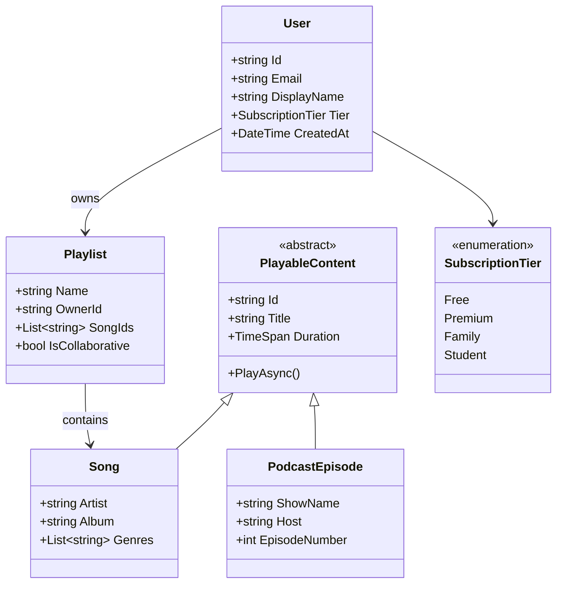
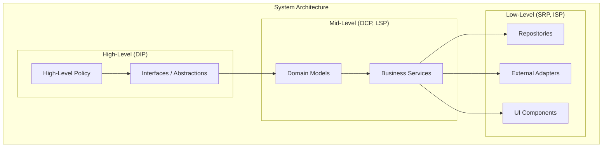
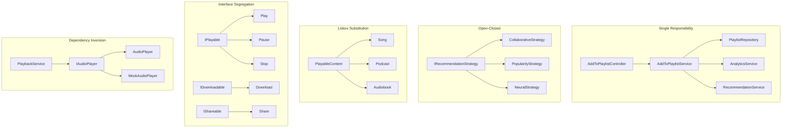

# SOLID Principles: Building Unbreakable Foundations
## A 6-Part Series Using Spotify as Your Blueprint

---

# Part 1: Redefining SOLID Principles
## Beyond Acronyms, Into Architectural Reality

---

**Subtitle:**
S.O.L.I.D. is not a checklist—it's a survival guide for software evolution. Here is how each principle prevents your Spotify-scale application from collapsing under its own weight.

**Keywords:**
SOLID Principles, Single Responsibility, Open-Closed, Liskov Substitution, Interface Segregation, Dependency Inversion, .NET 10, Clean Architecture, Spotify system design

---

## Introduction: The SOLID Crisis

**The Legacy Way:**
SOLID principles are taught as academic rules. "A class should have one reason to change." "Depend on abstractions." Developers memorize them for interviews, implement them mechanically, and miss the profound wisdom they contain.

**The Redefined Way:**
SOLID principles are **early warning systems** for architectural decay. Each principle guards against a specific way that software dies:

| Principle | Prevents | Real-World Consequence |
|-----------|----------|------------------------|
| **S**ingle Responsibility | Fragility | One change breaks unrelated features |
| **O**pen-Closed | Rigidity | Can't add features without modifying existing code |
| **L**iskov Substitution | Surprise | Subclasses behave unexpectedly, causing crashes |
| **I**nterface Segregation | Coupling | Clients depend on methods they don't use |
| **D**ependency Inversion | Immobility | Can't test, can't reuse, can't evolve |

**Why .NET 10 Makes SOLID More Important:**
Modern .NET applications are:
- **Reactive:** Event-driven architectures amplify the cost of violations
- **Async:** Improper abstractions lead to deadlocks and resource leaks
- **Distributed:** Microservices magnify coupling problems
- **High-scale:** Millions of users expose every design flaw

Let's rebuild Spotify the right way—with SOLID foundations.

---

## The Spotify Domain Model

Throughout this series, we'll use this domain model:



---

## The Six-Part Journey

This series will explore each SOLID principle in depth:

| Part | Principle | Focus | Spotify Example |
|------|-----------|-------|-----------------|
| **1** | Introduction | Overview, architecture, .NET 10 foundations | The big picture |
| **2** | **S**ingle Responsibility | One reason to change | User profile vs. playback logic |
| **3** | **O**pen-Closed | Open for extension, closed for modification | Recommendation algorithms |
| **4** | **L**iskov Substitution | Subtypes must be substitutable | Songs, podcasts, and playable content |
| **5** | **I**nterface Segregation | Don't depend on what you don't use | Streaming, caching, and analytics interfaces |
| **6** | **D**ependency Inversion | Depend on abstractions, not concretions | Audio player architecture |

---

## Why SOLID Matters for Spotify

### The Cost of Violations

**Without Single Responsibility:**
A `User` class handles authentication, playback history, billing, and recommendations. Changing the billing logic accidentally breaks playlist loading. Customer support drowns in "it worked yesterday" tickets.

**Without Open-Closed:**
Adding a new recommendation algorithm requires modifying the existing recommendation engine. Every change risks breaking existing algorithms. Innovation slows to a crawl.

**Without Liskov Substitution:**
A `PremiumUser` subclass overrides methods in unexpected ways. The audio player checks `if (user is PremiumUser)` everywhere. Code becomes littered with type checks and special cases.

**Without Interface Segregation:**
A `IPlayable` interface has `Play()`, `Pause()`, `Download()`, `Share()`, and `AddToPlaylist()`. Podcast episodes implement `Download()` but throw `NotImplementedException`. Clients don't know what to expect.

**Without Dependency Inversion:**
High-level playback logic depends directly on low-level audio hardware. Unit testing requires actual speakers. The code is immobile—it can't run in different environments.

### The SOLID .NET 10 Advantage

| Principle | .NET 10 Feature | Benefit |
|-----------|-----------------|---------|
| **S** | Primary constructors, record types | Clear, focused types |
| **O** | Strategy pattern + DI | Plug in new behaviors |
| **L** | Interface constraints, polymorphism | Compile-time safety |
| **I** | Interface segregation, default interface methods | Minimal dependencies |
| **D** | Dependency Injection, IHost | Testable, configurable systems |

---

## Architectural Context: Where SOLID Lives

SOLID principles operate at different levels of your architecture:



**Where each principle applies:**

| Principle | Primary Level | Secondary Level |
|-----------|---------------|-----------------|
| **SRP** | Class/Method | Module/Component |
| **OCP** | Class/Module | System/Service |
| **LSP** | Inheritance hierarchy | Interface contracts |
| **ISP** | Interface design | Client boundaries |
| **DIP** | Module/System | Cross-cutting concerns |

---

## The .NET 10 Toolbox for SOLID

Throughout this series, we'll use these .NET 10 features:

### 1. Primary Constructors (SRP, DIP)

```csharp
// WHY .NET 10: Primary constructors make dependencies explicit
public class PlaybackService(
    IAudioPlayer _audioPlayer,
    ILogger<PlaybackService> _logger,
    IAnalyticsService _analytics)
{
    public async Task PlayAsync(string songId)
    {
        _logger.LogInformation("Playing {SongId}", songId);
        await _audioPlayer.PlayAsync(songId);
        await _analytics.TrackPlayAsync(songId);
    }
}
```

### 2. Record Types (SRP, LSP)

```csharp
// WHY .NET 10: Records provide immutable, value-based equality
public record Song(
    string Id,
    string Title,
    string Artist,
    TimeSpan Duration);

public record PodcastEpisode(
    string Id,
    string Title,
    string ShowName,
    TimeSpan Duration) : PlayableContent(Id, Title, Duration);
```

### 3. Dependency Injection (DIP)

```csharp
// WHY .NET 10: Built-in DI container with keyed services
builder.Services.AddKeyedScoped<IPaymentProcessor, StripeProcessor>("stripe");
builder.Services.AddKeyedScoped<IPaymentProcessor, PayPalProcessor>("paypal");

// Register with factory pattern
builder.Services.AddScoped<IPlaylistRepository>(sp =>
    new CachedPlaylistRepository(
        sp.GetRequiredService<PlaylistDbContext>(),
        sp.GetRequiredService<IMemoryCache>()));
```

### 4. Source Generators (OCP, ISP)

```csharp
// WHY .NET 10: Source generators reduce boilerplate
[GenerateSerializer]
public partial record PlaybackEvent
{
    public string SongId { get; init; }
    public string UserId { get; init; }
    public DateTime Timestamp { get; init; }
}
```

### 5. Required Members (SRP)

```csharp
// WHY .NET 10: Required members ensure proper initialization
public class Playlist
{
    public required string Id { get; init; }
    public required string Name { get; init; }
    public required string OwnerId { get; init; }
    public List<string> SongIds { get; } = new();
}
```

### 6. Default Interface Methods (ISP, OCP)

```csharp
// WHY .NET 10: Default methods allow interface evolution
public interface IAnalyticsService
{
    Task TrackPlayAsync(string songId);
    
    // New method with default implementation
    Task TrackPlayAsync(string songId, string playlistId) =>
        TrackPlayAsync(songId); // Default fallback
}
```

---

## The SOLID Mindset Shift

**Before SOLID:**
```csharp
public class UserService
{
    public void RegisterUser(string email, string password)
    {
        // Validate email
        // Hash password
        // Save to database
        // Send welcome email
        // Log analytics
        // Update cache
        // Notify marketing
    }
}
```

This method does everything. Changing email validation might break the database save. Adding a new notification requires modifying this method.

**After SOLID:**
```csharp
public class UserRegistrationService
{
    private readonly IValidator<User> _validator;
    private readonly IPasswordHasher _hasher;
    private readonly IUserRepository _repository;
    private readonly IEmailService _emailService;
    private readonly IAnalyticsService _analytics;
    
    public async Task<User> RegisterAsync(string email, string password)
    {
        var user = new User(email, _hasher.Hash(password));
        
        await _validator.ValidateAsync(user);
        await _repository.SaveAsync(user);
        await _emailService.SendWelcomeAsync(user);
        await _analytics.TrackRegistrationAsync(user);
        
        return user;
    }
}
```

Each collaborator has one responsibility. The method orchestrates, but doesn't implement. You can swap validators, change email providers, or add notifications without touching this code.

---

## SOLID in Practice: A Spotify Example

Let's see how SOLID would shape a feature like "Add Song to Playlist":



Each component has clear boundaries, depends on abstractions, and can evolve independently.

---

## What's Coming in Each Part

### Part 2: Single Responsibility Principle
*"One Class, One Job"*

We'll explore:
- Separating user management from playback logic
- Repository pattern for data access
- Service layer boundaries
- CQRS with MediatR
- EF Core configuration separation
- Real Spotify example: User profile vs. playback history

### Part 3: Open-Closed Principle
*"Open for Extension, Closed for Modification"*

We'll explore:
- Strategy pattern for recommendation algorithms
- Decorator pattern for premium features
- Chain of Responsibility for request validation
- Plugin architecture with DI
- Real Spotify example: Adding new recommendation algorithms

### Part 4: Liskov Substitution Principle
*"Subtypes Must Be Substitutable"*

We'll explore:
- Inheritance hierarchies for playable content
- Contract design with pre/post conditions
- Avoiding type checks with polymorphism
- Covariance and contravariance in .NET
- Real Spotify example: Songs, podcasts, and playlists

### Part 5: Interface Segregation Principle
*"Don't Depend on What You Don't Use"*

We'll explore:
- Fine-grained interfaces vs. fat interfaces
- Role interfaces with marker patterns
- Default interface methods for evolution
- Adapter pattern for third-party integration
- Real Spotify example: Separating playback from social features

### Part 6: Dependency Inversion Principle
*"Depend on Abstractions, Not Concretions"*

We'll explore:
- Dependency Injection container configuration
- Factory patterns for complex dependencies
- Testing with mocks and fakes
- Cross-cutting concerns with decorators
- Real Spotify example: Audio player abstraction

---

## The SOLID Payoff

When you apply SOLID principles consistently:

| Benefit | Description |
|---------|-------------|
| **Testability** | Each component can be tested in isolation |
| **Maintainability** | Changes are localized, risk is reduced |
| **Extensibility** | New features don't require rewriting existing code |
| **Reusability** | Components can be reused in different contexts |
| **Parallel Development** | Teams can work independently on different components |
| **Onboarding** | New developers understand the system faster |

---

## Conclusion: SOLID as a Mindset

SOLID is not about writing perfect code the first time. It's about **recognizing the smell of rotting architecture** and knowing how to stop it.

- When you see a class doing too much → **SRP**
- When you're afraid to add a feature → **OCP**
- When subclasses behave unexpectedly → **LSP**
- When interfaces are bloated → **ISP**
- When you can't test or reuse → **DIP**

**The Final Redefinition:**
SOLID principles are your canary in the coal mine. They sing when your architecture is healthy and fall silent when it's dying. Learn to listen.

---

## Next Up: Part 2 - Single Responsibility Principle

In Part 2, we'll dive deep into the **Single Responsibility Principle** with:

- Real Spotify code using .NET 10
- Reactive programming with System.Reactive
- Entity Framework Core 10 integration
- SPAP<T> patterns for resource management
- Mermaid diagrams for every concept
- Production-ready examples

**Coming Up in Part 2:**
*Single Responsibility Principle: How Spotify Separates Concerns with .NET 10*

---