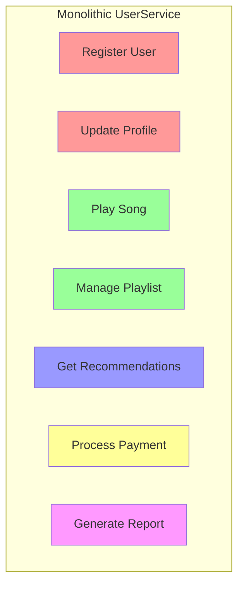
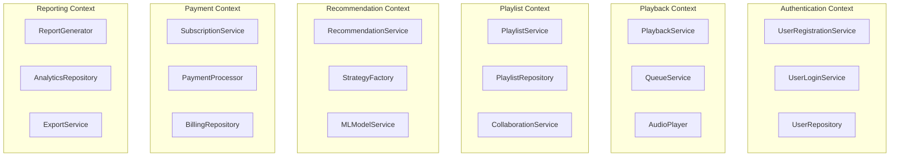
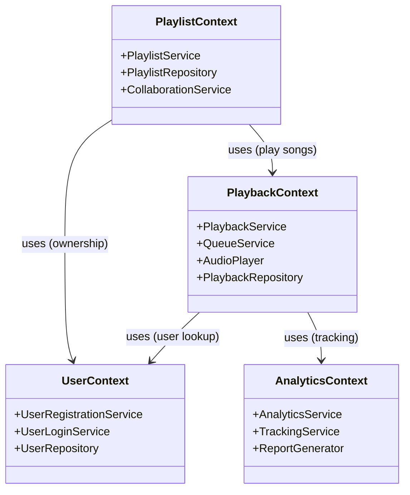
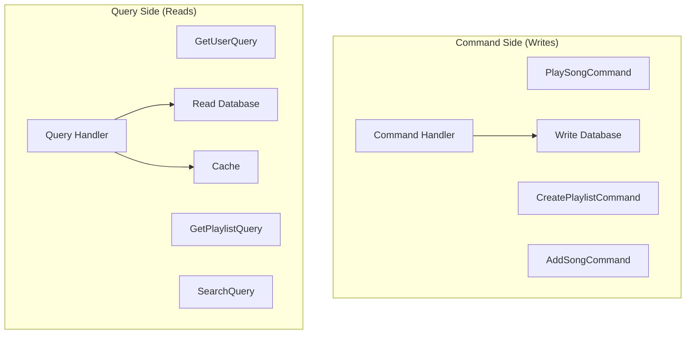
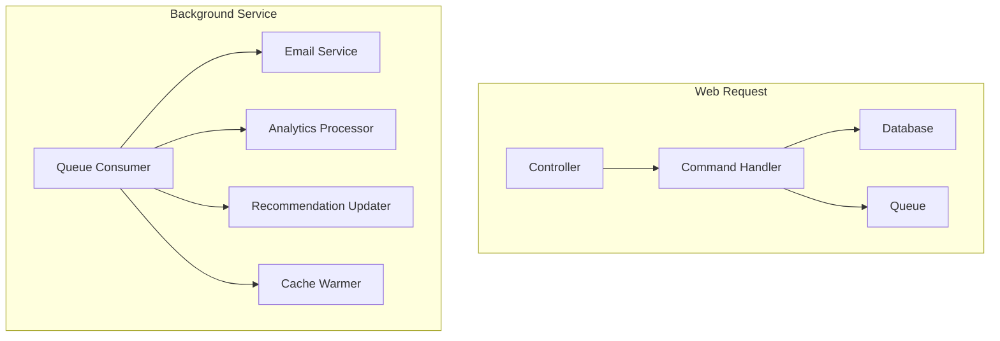
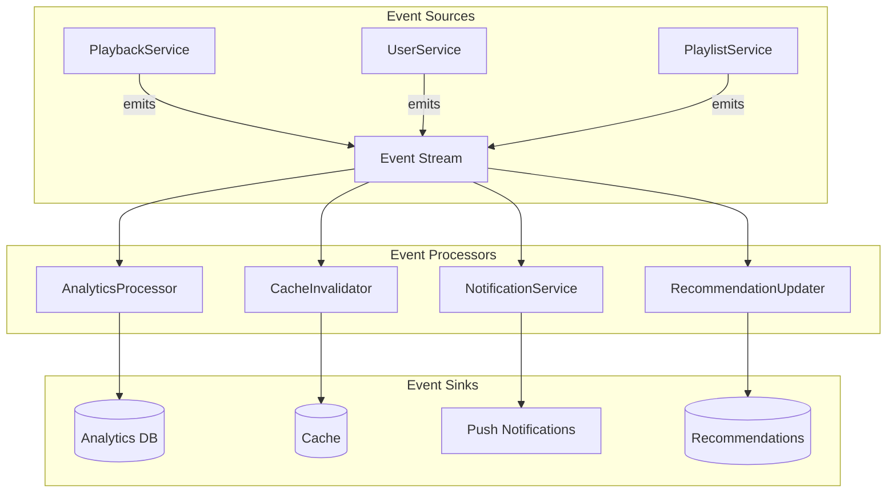

# Part 2: Single Responsibility Principle
## One Class, One Job - The .NET 10 Way

---

**Subtitle:**
How Spotify separates user management from playback, repositories from services, and commands from queries using .NET 10, Reactive Programming, and EF Core.

**Keywords:**
Single Responsibility Principle, SRP, .NET 10, C# 13, Reactive Programming, Entity Framework Core, CQRS, MediatR, Repository Pattern, Spotify system design

---

## Introduction: The Tragedy of the God Class

**The Legacy Violation:**
```csharp
public class UserService
{
    public void RegisterUser(string email, string password) { }
    public void Login(string email, string password) { }
    public void UpdateProfile(string userId, string name) { }
    public void PlaySong(string userId, string songId) { }
    public void AddToPlaylist(string userId, string songId, string playlistId) { }
    public void GetRecommendations(string userId) { }
    public void ProcessPayment(string userId, decimal amount) { }
    public void GenerateReport(string userId) { }
    // 50 more methods...
}
```

This class knows too much. It authenticates, plays music, manages playlists, processes payments, and generates reports. A change to payment processing risks breaking playlist functionality. Testing requires mocking half the system. Onboarding a new developer means understanding 5,000 lines of spaghetti.

**The Redefined View:**
The Single Responsibility Principle (SRP) states that a class should have **one reason to change**. But "reason to change" means "actor"—someone who might request changes. If the marketing team, the finance team, and the engineering team all have reasons to change the same class, that class violates SRP.

**Why .NET 10 Makes SRP Critical:**

| .NET 10 Feature | SRP Benefit |
|-----------------|-------------|
| Primary constructors | Explicit dependencies reveal responsibilities |
| Record types | Immutable, focused data carriers |
| Minimal APIs | Tiny, focused endpoints |
| Source generators | Separate code generation from logic |
| Dependency injection | Natural separation of concerns |

---

## The Spotify Context: A Tale of Two Responsibilities

Consider a typical violation in Spotify:



Each color represents a different actor who might request changes:
- **Red (Authentication)**: Security team
- **Green (Playback)**: Audio engineering team
- **Blue (Recommendations)**: ML team
- **Yellow (Payments)**: Finance team
- **Purple (Reporting)**: Analytics team

When all these concerns live together, a security change requires deploying playback code. A payment fix requires regression testing recommendations. Deployment becomes a nightmare.

---

## The SRP Solution: Separation of Concerns



Each context has its own classes, each with a single responsibility. Teams can work independently. Changes are isolated. Testing is focused.

---

## .NET 10 SRP Toolkit

### 1. Primary Constructors

```csharp
// WHY .NET 10: Primary constructors make dependencies explicit
// Every parameter is a dependency - if there are too many, SRP is violated
public class PlaybackService(
    IAudioPlayer _audioPlayer,
    IPlaybackRepository _repository,
    ILogger<PlaybackService> _logger,
    IAnalyticsService _analytics)
{
    public async Task PlayAsync(string songId, string userId)
    {
        _logger.LogInformation("Playing {SongId} for {UserId}", songId, userId);
        
        var song = await _repository.GetSongAsync(songId);
        await _audioPlayer.PlayAsync(song.Url);
        await _analytics.TrackPlayAsync(userId, songId);
    }
}
```

**SRP Check:** If a constructor has more than 3-4 parameters, the class might have too many responsibilities.

### 2. Record Types for Data Carriers

```csharp
// WHY .NET 10: Records are perfect for DTOs - pure data with no behavior
public record PlaybackRequest(
    string UserId,
    string SongId,
    string? PlaylistId,
    TimeSpan? StartPosition);

public record PlaybackResult(
    string SessionId,
    string SongId,
    TimeSpan Duration,
    bool FromCache);
```

**SRP Benefit:** Data carriers have one job: carry data. No business logic, no validation, no persistence.

### 3. Source Generators for Boilerplate

```csharp
// WHY .NET 10: Source generators separate generated code from hand-written logic
[GenerateMediatR] // Hypothetical generator
public partial record PlaySongCommand : IRequest<PlaybackResult>
{
    public required string UserId { get; init; }
    public required string SongId { get; init; }
}
```

**SRP Benefit:** Generated code handles cross-cutting concerns, leaving business classes focused.

---

## Real Spotify Example 1: User Management vs. Playback

### The Violation

```csharp
// BAD: This class has multiple responsibilities
public class UserService
{
    private readonly SpotifyDbContext _context;
    private readonly ILogger<UserService> _logger;
    
    // User management responsibilities
    public async Task<User> RegisterAsync(string email, string password)
    {
        // Validate email
        // Hash password
        // Save user
        // Send welcome email
        // Log analytics
        return new User();
    }
    
    public async Task<User> LoginAsync(string email, string password)
    {
        // Find user
        // Verify password
        // Generate token
        // Update last login
        return new User();
    }
    
    // Playback responsibilities
    public async Task PlaySongAsync(string userId, string songId)
    {
        // Check subscription
        // Get stream URL
        // Initialize player
        // Update history
        // Track analytics
    }
    
    public async Task PauseAsync(string userId)
    {
        // Pause current playback
        // Update state
        // Track analytics
    }
    
    // Playlist responsibilities
    public async Task AddToPlaylistAsync(string userId, string songId, string playlistId)
    {
        // Verify ownership
        // Check duplicates
        // Add to playlist
        // Update cache
    }
    
    // 30 more methods...
}
```

**Why This Fails:**
- **Multiple actors:** Security team changes authentication, audio team changes playback, product team changes playlists
- **Testing nightmare:** Testing `PlaySongAsync` requires setting up user data
- **Deployment risk:** A security patch could accidentally break playback
- **Cognitive load:** New developers must understand the entire domain

### The SRP Solution



### The SRP-Compliant Implementation

```csharp
// ========== User Context ==========

/// <summary>
/// RESPONSIBILITY: User registration only
/// </summary>
public class UserRegistrationService
{
    private readonly IUserRepository _userRepository;
    private readonly IPasswordHasher _passwordHasher;
    private readonly IEmailService _emailService;
    private readonly IUserAnalyticsService _analytics;
    private readonly ILogger<UserRegistrationService> _logger;
    
    public UserRegistrationService(
        IUserRepository userRepository,
        IPasswordHasher passwordHasher,
        IEmailService emailService,
        IUserAnalyticsService analytics,
        ILogger<UserRegistrationService> logger)
    {
        _userRepository = userRepository;
        _passwordHasher = passwordHasher;
        _emailService = emailService;
        _analytics = analytics;
        _logger = logger;
    }
    
    public async Task<User> RegisterAsync(string email, string password)
    {
        _logger.LogInformation("Registering user with email {Email}", email);
        
        // Validate
        if (await _userRepository.ExistsByEmailAsync(email))
            throw new UserAlreadyExistsException(email);
        
        // Create
        var user = new User
        {
            Id = Guid.NewGuid().ToString(),
            Email = email,
            PasswordHash = _passwordHasher.Hash(password),
            CreatedAt = DateTime.UtcNow
        };
        
        // Save
        await _userRepository.AddAsync(user);
        
        // Notify
        await _emailService.SendWelcomeEmailAsync(user);
        await _analytics.TrackRegistrationAsync(user);
        
        return user;
    }
}

/// <summary>
/// RESPONSIBILITY: User login only
/// </summary>
public class UserLoginService
{
    private readonly IUserRepository _userRepository;
    private readonly IPasswordHasher _passwordHasher;
    private readonly ITokenService _tokenService;
    private readonly ILoginAnalyticsService _analytics;
    private readonly ILogger<UserLoginService> _logger;
    
    public UserLoginService(
        IUserRepository userRepository,
        IPasswordHasher passwordHasher,
        ITokenService tokenService,
        ILoginAnalyticsService analytics,
        ILogger<UserLoginService> logger)
    {
        _userRepository = userRepository;
        _passwordHasher = passwordHasher;
        _tokenService = tokenService;
        _analytics = analytics;
        _logger = logger;
    }
    
    public async Task<LoginResult> LoginAsync(string email, string password)
    {
        _logger.LogInformation("Login attempt for {Email}", email);
        
        var user = await _userRepository.GetByEmailAsync(email);
        if (user == null || !_passwordHasher.Verify(password, user.PasswordHash))
        {
            await _analytics.TrackFailedLoginAsync(email);
            throw new InvalidCredentialsException();
        }
        
        var token = _tokenService.GenerateToken(user);
        user.LastLoginAt = DateTime.UtcNow;
        await _userRepository.UpdateAsync(user);
        
        await _analytics.TrackSuccessfulLoginAsync(user);
        
        return new LoginResult(user, token);
    }
}

// ========== Playback Context ==========

/// <summary>
/// RESPONSIBILITY: Playback orchestration only
/// </summary>
public class PlaybackService
{
    private readonly IPlaybackRepository _repository;
    private readonly IAudioPlayer _audioPlayer;
    private readonly IPlaybackAnalyticsService _analytics;
    private readonly ILogger<PlaybackService> _logger;
    
    public PlaybackService(
        IPlaybackRepository repository,
        IAudioPlayer audioPlayer,
        IPlaybackAnalyticsService analytics,
        ILogger<PlaybackService> logger)
    {
        _repository = repository;
        _audioPlayer = audioPlayer;
        _analytics = analytics;
        _logger = logger;
    }
    
    public async Task<PlaybackSession> PlayAsync(string userId, string songId, string? playlistId = null)
    {
        _logger.LogInformation("Starting playback for user {UserId}, song {SongId}", userId, songId);
        
        // Get song details
        var song = await _repository.GetSongAsync(songId);
        if (song == null)
            throw new SongNotFoundException(songId);
        
        // Check permissions (delegates to another service)
        // This is orchestration, not implementation
        
        // Start playback
        var session = new PlaybackSession
        {
            Id = Guid.NewGuid().ToString(),
            UserId = userId,
            SongId = songId,
            StartedAt = DateTime.UtcNow,
            PlaylistId = playlistId
        };
        
        await _audioPlayer.PlayAsync(song.StreamUrl);
        await _repository.SaveSessionAsync(session);
        await _analytics.TrackPlayStartedAsync(session);
        
        return session;
    }
    
    public async Task PauseAsync(string sessionId)
    {
        _logger.LogInformation("Pausing session {SessionId}", sessionId);
        
        var session = await _repository.GetSessionAsync(sessionId);
        if (session == null)
            throw new SessionNotFoundException(sessionId);
        
        await _audioPlayer.PauseAsync();
        
        session.PausedAt = DateTime.UtcNow;
        await _repository.UpdateSessionAsync(session);
        await _analytics.TrackPlayPausedAsync(session);
    }
}

/// <summary>
/// RESPONSIBILITY: Audio hardware interaction only
/// </summary>
public class AudioPlayer : IAudioPlayer
{
    private readonly IAudioHardware _hardware;
    private readonly ILogger<AudioPlayer> _logger;
    
    public AudioPlayer(IAudioHardware hardware, ILogger<AudioPlayer> logger)
    {
        _hardware = hardware;
        _logger = logger;
    }
    
    public async Task PlayAsync(string streamUrl)
    {
        _logger.LogDebug("Playing from {StreamUrl}", streamUrl);
        await _hardware.PlayAsync(streamUrl);
    }
    
    public async Task PauseAsync()
    {
        _logger.LogDebug("Pausing playback");
        await _hardware.PauseAsync();
    }
    
    public async Task StopAsync()
    {
        _logger.LogDebug("Stopping playback");
        await _hardware.StopAsync();
    }
}

// ========== Playlist Context ==========

/// <summary>
/// RESPONSIBILITY: Playlist management only
/// </summary>
public class PlaylistService
{
    private readonly IPlaylistRepository _playlistRepository;
    private readonly IPlaylistAnalyticsService _analytics;
    private readonly ILogger<PlaylistService> _logger;
    
    public PlaylistService(
        IPlaylistRepository playlistRepository,
        IPlaylistAnalyticsService analytics,
        ILogger<PlaylistService> logger)
    {
        _playlistRepository = playlistRepository;
        _analytics = analytics;
        _logger = logger;
    }
    
    public async Task<Playlist> CreatePlaylistAsync(string userId, string name, string? description = null)
    {
        _logger.LogInformation("Creating playlist {Name} for user {UserId}", name, userId);
        
        var playlist = new Playlist
        {
            Id = Guid.NewGuid().ToString(),
            Name = name,
            Description = description,
            OwnerId = userId,
            CreatedAt = DateTime.UtcNow
        };
        
        await _playlistRepository.AddAsync(playlist);
        await _analytics.TrackPlaylistCreatedAsync(playlist);
        
        return playlist;
    }
    
    public async Task AddSongAsync(string playlistId, string songId, string addedBy)
    {
        _logger.LogInformation("Adding song {SongId} to playlist {PlaylistId}", songId, playlistId);
        
        var playlist = await _playlistRepository.GetAsync(playlistId);
        if (playlist == null)
            throw new PlaylistNotFoundException(playlistId);
        
        // Check permissions (delegates to authorization service)
        
        playlist.SongIds.Add(songId);
        playlist.UpdatedAt = DateTime.UtcNow;
        
        await _playlistRepository.UpdateAsync(playlist);
        await _analytics.TrackSongAddedAsync(playlistId, songId, addedBy);
    }
}

// ========== Analytics Context ==========

/// <summary>
/// RESPONSIBILITY: Playback analytics only
/// </summary>
public class PlaybackAnalyticsService : IPlaybackAnalyticsService
{
    private readonly IAnalyticsRepository _repository;
    private readonly ILogger<PlaybackAnalyticsService> _logger;
    
    public PlaybackAnalyticsService(
        IAnalyticsRepository repository,
        ILogger<PlaybackAnalyticsService> logger)
    {
        _repository = repository;
        _logger = logger;
    }
    
    public async Task TrackPlayStartedAsync(PlaybackSession session)
    {
        var @event = new PlaybackEvent
        {
            Id = Guid.NewGuid().ToString(),
            Type = "PlayStarted",
            UserId = session.UserId,
            SongId = session.SongId,
            Timestamp = session.StartedAt,
            Metadata = new Dictionary<string, object>
            {
                ["playlistId"] = session.PlaylistId ?? "null"
            }
        };
        
        await _repository.SaveEventAsync(@event);
        _logger.LogDebug("Tracked play start for {SongId}", session.SongId);
    }
    
    public async Task TrackPlayPausedAsync(PlaybackSession session)
    {
        var duration = session.PausedAt!.Value - session.StartedAt;
        
        var @event = new PlaybackEvent
        {
            Id = Guid.NewGuid().ToString(),
            Type = "PlayPaused",
            UserId = session.UserId,
            SongId = session.SongId,
            Timestamp = session.PausedAt.Value,
            Metadata = new Dictionary<string, object>
            {
                ["durationSeconds"] = duration.TotalSeconds
            }
        };
        
        await _repository.SaveEventAsync(@event);
    }
}
```

**SRP Benefits Achieved:**
- Each class has one clear responsibility
- Each class has one reason to change
- Teams can work independently
- Testing is focused and simple
- Changes are isolated and safe

---

## Real Spotify Example 2: Repository Pattern with SRP

### The Violation

```csharp
// BAD: Repository does too much
public class SpotifyRepository
{
    private readonly SpotifyDbContext _context;
    
    // User operations
    public async Task<User> GetUserAsync(string id) { }
    public async Task SaveUserAsync(User user) { }
    
    // Song operations
    public async Task<Song> GetSongAsync(string id) { }
    public async Task<List<Song>> GetSongsByArtistAsync(string artist) { }
    
    // Playlist operations
    public async Task<Playlist> GetPlaylistAsync(string id) { }
    public async Task AddSongToPlaylistAsync(string playlistId, string songId) { }
    
    // Analytics operations
    public async Task<List<PlaybackEvent>> GetUserHistoryAsync(string userId) { }
    public async Task SaveEventAsync(PlaybackEvent @event) { }
    
    // Caching logic mixed in
    private readonly IMemoryCache _cache;
    public async Task<Song> GetCachedSongAsync(string id) { }
}
```

### The SRP Solution

```csharp
// ========== Separate Repositories by Aggregate ==========

/// <summary>
/// RESPONSIBILITY: User data access only
/// </summary>
public interface IUserRepository
{
    Task<User?> GetByIdAsync(string id, CancellationToken ct = default);
    Task<User?> GetByEmailAsync(string email, CancellationToken ct = default);
    Task<bool> ExistsByEmailAsync(string email, CancellationToken ct = default);
    Task AddAsync(User user, CancellationToken ct = default);
    Task UpdateAsync(User user, CancellationToken ct = default);
}

public class UserRepository : IUserRepository
{
    private readonly SpotifyDbContext _context;
    private readonly ILogger<UserRepository> _logger;
    
    public UserRepository(SpotifyDbContext context, ILogger<UserRepository> logger)
    {
        _context = context;
        _logger = logger;
    }
    
    public async Task<User?> GetByIdAsync(string id, CancellationToken ct = default)
    {
        return await _context.Users
            .AsNoTracking()
            .FirstOrDefaultAsync(u => u.Id == id, ct);
    }
    
    public async Task<User?> GetByEmailAsync(string email, CancellationToken ct = default)
    {
        return await _context.Users
            .AsNoTracking()
            .FirstOrDefaultAsync(u => u.Email == email, ct);
    }
    
    public async Task<bool> ExistsByEmailAsync(string email, CancellationToken ct = default)
    {
        return await _context.Users
            .AnyAsync(u => u.Email == email, ct);
    }
    
    public async Task AddAsync(User user, CancellationToken ct = default)
    {
        await _context.Users.AddAsync(user, ct);
        await _context.SaveChangesAsync(ct);
        _logger.LogInformation("Added user {UserId}", user.Id);
    }
    
    public async Task UpdateAsync(User user, CancellationToken ct = default)
    {
        _context.Users.Update(user);
        await _context.SaveChangesAsync(ct);
        _logger.LogDebug("Updated user {UserId}", user.Id);
    }
}

/// <summary>
/// RESPONSIBILITY: Song data access only
/// </summary>
public interface ISongRepository
{
    Task<Song?> GetByIdAsync(string id, CancellationToken ct = default);
    Task<List<Song>> GetByIdsAsync(IEnumerable<string> ids, CancellationToken ct = default);
    Task<List<Song>> GetByArtistAsync(string artist, int limit = 50, CancellationToken ct = default);
    Task<List<Song>> GetByGenreAsync(string genre, int limit = 50, CancellationToken ct = default);
    Task IncrementPlayCountAsync(string id, CancellationToken ct = default);
}

public class SongRepository : ISongRepository
{
    private readonly SpotifyDbContext _context;
    private readonly ILogger<SongRepository> _logger;
    
    public SongRepository(SpotifyDbContext context, ILogger<SongRepository> logger)
    {
        _context = context;
        _logger = logger;
    }
    
    public async Task<Song?> GetByIdAsync(string id, CancellationToken ct = default)
    {
        return await _context.Songs
            .AsNoTracking()
            .FirstOrDefaultAsync(s => s.Id == id, ct);
    }
    
    public async Task<List<Song>> GetByIdsAsync(IEnumerable<string> ids, CancellationToken ct = default)
    {
        return await _context.Songs
            .AsNoTracking()
            .Where(s => ids.Contains(s.Id))
            .ToListAsync(ct);
    }
    
    public async Task<List<Song>> GetByArtistAsync(string artist, int limit = 50, CancellationToken ct = default)
    {
        return await _context.Songs
            .AsNoTracking()
            .Where(s => s.Artist == artist)
            .OrderByDescending(s => s.PlayCount)
            .Take(limit)
            .ToListAsync(ct);
    }
    
    public async Task<List<Song>> GetByGenreAsync(string genre, int limit = 50, CancellationToken ct = default)
    {
        return await _context.Songs
            .AsNoTracking()
            .Where(s => s.Genres.Contains(genre))
            .OrderByDescending(s => s.PlayCount)
            .Take(limit)
            .ToListAsync(ct);
    }
    
    public async Task IncrementPlayCountAsync(string id, CancellationToken ct = default)
    {
        var song = await _context.Songs.FindAsync([id], ct);
        if (song != null)
        {
            song.PlayCount++;
            await _context.SaveChangesAsync(ct);
        }
    }
}

/// <summary>
/// RESPONSIBILITY: Playlist data access only
/// </summary>
public interface IPlaylistRepository
{
    Task<Playlist?> GetByIdAsync(string id, CancellationToken ct = default);
    Task<List<Playlist>> GetByUserAsync(string userId, CancellationToken ct = default);
    Task AddAsync(Playlist playlist, CancellationToken ct = default);
    Task UpdateAsync(Playlist playlist, CancellationToken ct = default);
    Task DeleteAsync(string id, CancellationToken ct = default);
    Task<bool> IsOwnerAsync(string playlistId, string userId, CancellationToken ct = default);
}

public class PlaylistRepository : IPlaylistRepository
{
    private readonly SpotifyDbContext _context;
    private readonly ILogger<PlaylistRepository> _logger;
    
    public PlaylistRepository(SpotifyDbContext context, ILogger<PlaylistRepository> logger)
    {
        _context = context;
        _logger = logger;
    }
    
    public async Task<Playlist?> GetByIdAsync(string id, CancellationToken ct = default)
    {
        return await _context.Playlists
            .Include(p => p.SongIds)
            .AsNoTracking()
            .FirstOrDefaultAsync(p => p.Id == id, ct);
    }
    
    public async Task<List<Playlist>> GetByUserAsync(string userId, CancellationToken ct = default)
    {
        return await _context.Playlists
            .Where(p => p.OwnerId == userId)
            .OrderByDescending(p => p.UpdatedAt ?? p.CreatedAt)
            .AsNoTracking()
            .ToListAsync(ct);
    }
    
    public async Task AddAsync(Playlist playlist, CancellationToken ct = default)
    {
        await _context.Playlists.AddAsync(playlist, ct);
        await _context.SaveChangesAsync(ct);
        _logger.LogInformation("Created playlist {PlaylistId}", playlist.Id);
    }
    
    public async Task UpdateAsync(Playlist playlist, CancellationToken ct = default)
    {
        _context.Playlists.Update(playlist);
        await _context.SaveChangesAsync(ct);
        _logger.LogDebug("Updated playlist {PlaylistId}", playlist.Id);
    }
    
    public async Task DeleteAsync(string id, CancellationToken ct = default)
    {
        var playlist = await _context.Playlists.FindAsync([id], ct);
        if (playlist != null)
        {
            _context.Playlists.Remove(playlist);
            await _context.SaveChangesAsync(ct);
            _logger.LogInformation("Deleted playlist {PlaylistId}", id);
        }
    }
    
    public async Task<bool> IsOwnerAsync(string playlistId, string userId, CancellationToken ct = default)
    {
        return await _context.Playlists
            .AnyAsync(p => p.Id == playlistId && p.OwnerId == userId, ct);
    }
}

/// <summary>
/// RESPONSIBILITY: Analytics data access only
/// </summary>
public interface IAnalyticsRepository
{
    Task SaveEventAsync(PlaybackEvent @event, CancellationToken ct = default);
    Task<List<PlaybackEvent>> GetUserEventsAsync(string userId, DateTime? from = null, DateTime? to = null, CancellationToken ct = default);
    Task<Dictionary<string, int>> GetTopSongsAsync(string userId, int limit = 10, CancellationToken ct = default);
}

public class AnalyticsRepository : IAnalyticsRepository
{
    private readonly SpotifyDbContext _context;
    private readonly ILogger<AnalyticsRepository> _logger;
    
    public AnalyticsRepository(SpotifyDbContext context, ILogger<AnalyticsRepository> logger)
    {
        _context = context;
        _logger = logger;
    }
    
    public async Task SaveEventAsync(PlaybackEvent @event, CancellationToken ct = default)
    {
        // In real app, would use time-series database
        await _context.PlaybackEvents.AddAsync(@event, ct);
        await _context.SaveChangesAsync(ct);
    }
    
    public async Task<List<PlaybackEvent>> GetUserEventsAsync(
        string userId, 
        DateTime? from = null, 
        DateTime? to = null, 
        CancellationToken ct = default)
    {
        var query = _context.PlaybackEvents
            .Where(e => e.UserId == userId);
        
        if (from.HasValue)
            query = query.Where(e => e.Timestamp >= from.Value);
        
        if (to.HasValue)
            query = query.Where(e => e.Timestamp <= to.Value);
        
        return await query
            .OrderByDescending(e => e.Timestamp)
            .AsNoTracking()
            .ToListAsync(ct);
    }
    
    public async Task<Dictionary<string, int>> GetTopSongsAsync(
        string userId, 
        int limit = 10, 
        CancellationToken ct = default)
    {
        var topSongs = await _context.PlaybackEvents
            .Where(e => e.UserId == userId && e.Type == "PlayStarted")
            .GroupBy(e => e.SongId)
            .Select(g => new { SongId = g.Key, Count = g.Count() })
            .OrderByDescending(x => x.Count)
            .Take(limit)
            .ToDictionaryAsync(x => x.SongId, x => x.Count, ct);
        
        return topSongs;
    }
}
```

**SRP Benefits Achieved:**
- Each repository handles one aggregate root
- Changes to user storage don't affect playlists
- Caching can be added as a decorator (OCP)
- Testing each repository is isolated

---

## Real Spotify Example 3: CQRS with SRP

Command Query Responsibility Segregation (CQRS) takes SRP to the architectural level by separating read and write operations.



### The Implementation

```csharp
// ========== Commands (Write Side) ==========

/// <summary>
/// RESPONSIBILITY: Represent a write operation
/// </summary>
public record PlaySongCommand : IRequest<PlaybackResult>
{
    public required string UserId { get; init; }
    public required string SongId { get; init; }
    public string? PlaylistId { get; init; }
    public TimeSpan? StartPosition { get; init; }
}

/// <summary>
/// RESPONSIBILITY: Handle the play song command
/// </summary>
public class PlaySongCommandHandler : IRequestHandler<PlaySongCommand, PlaybackResult>
{
    private readonly ISongRepository _songRepository;
    private readonly IPlaybackRepository _playbackRepository;
    private readonly IAudioPlayer _audioPlayer;
    private readonly IAnalyticsRepository _analytics;
    private readonly ILogger<PlaySongCommandHandler> _logger;
    
    public PlaySongCommandHandler(
        ISongRepository songRepository,
        IPlaybackRepository playbackRepository,
        IAudioPlayer audioPlayer,
        IAnalyticsRepository analytics,
        ILogger<PlaySongCommandHandler> logger)
    {
        _songRepository = songRepository;
        _playbackRepository = playbackRepository;
        _audioPlayer = audioPlayer;
        _analytics = analytics;
        _logger = logger;
    }
    
    public async Task<PlaybackResult> Handle(PlaySongCommand command, CancellationToken ct)
    {
        _logger.LogInformation("Handling PlaySongCommand for {SongId}", command.SongId);
        
        var song = await _songRepository.GetByIdAsync(command.SongId, ct);
        if (song == null)
            throw new SongNotFoundException(command.SongId);
        
        var session = new PlaybackSession
        {
            Id = Guid.NewGuid().ToString(),
            UserId = command.UserId,
            SongId = command.SongId,
            StartedAt = DateTime.UtcNow,
            PlaylistId = command.PlaylistId
        };
        
        await _audioPlayer.PlayAsync(song.StreamUrl, command.StartPosition, ct);
        await _playbackRepository.SaveSessionAsync(session, ct);
        
        // Fire and forget analytics (could use background queue)
        _ = _analytics.SaveEventAsync(new PlaybackEvent
        {
            Id = Guid.NewGuid().ToString(),
            Type = "PlayStarted",
            UserId = command.UserId,
            SongId = command.SongId,
            Timestamp = session.StartedAt
        }, ct);
        
        await _songRepository.IncrementPlayCountAsync(command.SongId, ct);
        
        return new PlaybackResult(session.Id, song, false);
    }
}

// ========== Queries (Read Side) ==========

/// <summary>
/// RESPONSIBILITY: Represent a read operation
/// </summary>
public record GetUserPlaylistsQuery : IRequest<List<PlaylistSummary>>
{
    public required string UserId { get; init; }
    public int? Limit { get; init; }
    public int? Offset { get; init; }
}

/// <summary>
/// RESPONSIBILITY: Handle the get playlists query
/// </summary>
public class GetUserPlaylistsQueryHandler : IRequestHandler<GetUserPlaylistsQuery, List<PlaylistSummary>>
{
    private readonly IPlaylistReadRepository _readRepository;
    private readonly IMemoryCache _cache;
    private readonly ILogger<GetUserPlaylistsQueryHandler> _logger;
    
    public GetUserPlaylistsQueryHandler(
        IPlaylistReadRepository readRepository,
        IMemoryCache cache,
        ILogger<GetUserPlaylistsQueryHandler> logger)
    {
        _readRepository = readRepository;
        _cache = cache;
        _logger = logger;
    }
    
    public async Task<List<PlaylistSummary>> Handle(GetUserPlaylistsQuery query, CancellationToken ct)
    {
        var cacheKey = $"playlists_{query.UserId}_{query.Limit}_{query.Offset}";
        
        if (_cache.TryGetValue(cacheKey, out List<PlaylistSummary>? cached))
        {
            _logger.LogDebug("Cache hit for {CacheKey}", cacheKey);
            return cached!;
        }
        
        _logger.LogDebug("Cache miss for {CacheKey}", cacheKey);
        
        var playlists = await _readRepository.GetByUserAsync(
            query.UserId, 
            query.Limit ?? 20, 
            query.Offset ?? 0, 
            ct);
        
        _cache.Set(cacheKey, playlists, TimeSpan.FromMinutes(5));
        
        return playlists;
    }
}

/// <summary>
/// RESPONSIBILITY: Read-optimized repository
/// </summary>
public interface IPlaylistReadRepository
{
    Task<List<PlaylistSummary>> GetByUserAsync(string userId, int limit, int offset, CancellationToken ct);
    Task<PlaylistDetail?> GetDetailAsync(string playlistId, CancellationToken ct);
}

public class PlaylistReadRepository : IPlaylistReadRepository
{
    private readonly SpotifyDbContext _context;
    private readonly ILogger<PlaylistReadRepository> _logger;
    
    public PlaylistReadRepository(SpotifyDbContext context, ILogger<PlaylistReadRepository> logger)
    {
        _context = context;
        _logger = logger;
    }
    
    public async Task<List<PlaylistSummary>> GetByUserAsync(
        string userId, 
        int limit, 
        int offset, 
        CancellationToken ct)
    {
        // Optimized read query - denormalized, no tracking
        return await _context.Playlists
            .Where(p => p.OwnerId == userId)
            .OrderByDescending(p => p.UpdatedAt ?? p.CreatedAt)
            .Skip(offset)
            .Take(limit)
            .Select(p => new PlaylistSummary
            {
                Id = p.Id,
                Name = p.Name,
                SongCount = p.SongIds.Count,
                OwnerId = p.OwnerId,
                IsCollaborative = p.IsCollaborative,
                UpdatedAt = p.UpdatedAt ?? p.CreatedAt
            })
            .AsNoTracking()
            .ToListAsync(ct);
    }
    
    public async Task<PlaylistDetail?> GetDetailAsync(string playlistId, CancellationToken ct)
    {
        // Single query with includes - optimized for read
        return await _context.Playlists
            .Where(p => p.Id == playlistId)
            .Select(p => new PlaylistDetail
            {
                Id = p.Id,
                Name = p.Name,
                Description = p.Description,
                OwnerId = p.OwnerId,
                SongCount = p.SongIds.Count,
                Songs = p.SongIds.Take(100).ToList(), // Limit for performance
                IsCollaborative = p.IsCollaborative,
                CreatedAt = p.CreatedAt,
                UpdatedAt = p.UpdatedAt
            })
            .AsNoTracking()
            .FirstOrDefaultAsync(ct);
    }
}
```

**CQRS SRP Benefits:**
- **Commands:** One responsibility—change state
- **Queries:** One responsibility—return data
- **Read models:** Optimized for display, not storage
- **Write models:** Enforce business rules, maintain consistency
- **Scaling:** Reads and writes can scale independently

---

## Real Spotify Example 4: Background Processing with SRP

Many operations don't need to happen synchronously. SRP suggests separating immediate concerns from background concerns.



### The Implementation

```csharp
// ========== Background Task Queue ==========

/// <summary>
/// RESPONSIBILITY: Queue background work
/// </summary>
public interface IBackgroundTaskQueue
{
    ValueTask QueueAsync<TWork>(TWork work, CancellationToken ct = default) where TWork : class;
    ValueTask<TWork?> DequeueAsync<TWork>(CancellationToken ct = default) where TWork : class;
}

/// <summary>
/// RESPONSIBILITY: Channel-based background queue (SPAP)
/// </summary>
public class BackgroundTaskQueue : IBackgroundTaskQueue
{
    private readonly Channel<object> _queue;
    private readonly ILogger<BackgroundTaskQueue> _logger;
    
    public BackgroundTaskQueue(ILogger<BackgroundTaskQueue> logger)
    {
        _queue = Channel.CreateBounded<object>(new BoundedChannelOptions(1000)
        {
            FullMode = BoundedChannelFullMode.Wait,
            SingleWriter = false,
            SingleReader = false
        });
        _logger = logger;
    }
    
    public async ValueTask QueueAsync<TWork>(TWork work, CancellationToken ct = default) where TWork : class
    {
        await _queue.Writer.WriteAsync(work, ct);
        _logger.LogDebug("Queued background work of type {WorkType}", typeof(TWork).Name);
    }
    
    public async ValueTask<TWork?> DequeueAsync<TWork>(CancellationToken ct = default) where TWork : class
    {
        var item = await _queue.Reader.ReadAsync(ct);
        return item as TWork;
    }
}

// ========== Background Work Items ==========

/// <summary>
/// RESPONSIBILITY: Email notification work
/// </summary>
public record SendEmailWork
{
    public required string To { get; init; }
    public required string Subject { get; init; }
    public required string Body { get; init; }
    public bool IsHtml { get; init; }
}

/// <summary>
/// RESPONSIBILITY: Analytics processing work
/// </summary>
public record ProcessAnalyticsWork
{
    public required string UserId { get; init; }
    public required string EventType { get; init; }
    public required DateTime Timestamp { get; init; }
    public Dictionary<string, object>? Data { get; init; }
}

/// <summary>
/// RESPONSIBILITY: Recommendation update work
/// </summary>
public record UpdateRecommendationsWork
{
    public required string UserId { get; init; }
    public string? TriggerSongId { get; init; }
    public bool ForceFullUpdate { get; init; }
}

// ========== Background Service ==========

/// <summary>
/// RESPONSIBILITY: Process background tasks
/// </summary>
public class BackgroundTaskProcessor : BackgroundService
{
    private readonly IBackgroundTaskQueue _queue;
    private readonly IServiceProvider _services;
    private readonly ILogger<BackgroundTaskProcessor> _logger;
    
    public BackgroundTaskProcessor(
        IBackgroundTaskQueue queue,
        IServiceProvider services,
        ILogger<BackgroundTaskProcessor> logger)
    {
        _queue = queue;
        _services = services;
        _logger = logger;
    }
    
    protected override async Task ExecuteAsync(CancellationToken stoppingToken)
    {
        _logger.LogInformation("Background task processor started");
        
        await foreach (var workItem in ReadAllAsync(stoppingToken))
        {
            try
            {
                await ProcessWorkItemAsync(workItem, stoppingToken);
            }
            catch (Exception ex)
            {
                _logger.LogError(ex, "Error processing background work: {WorkType}", workItem?.GetType().Name);
            }
        }
    }
    
    private async IAsyncEnumerable<object> ReadAllAsync([EnumeratorCancellation] CancellationToken ct)
    {
        while (!ct.IsCancellationRequested)
        {
            var workItem = await _queue.DequeueAsync<object>(ct);
            if (workItem != null)
                yield return workItem;
        }
    }
    
    private async Task ProcessWorkItemAsync(object workItem, CancellationToken ct)
    {
        using var scope = _services.CreateScope();
        
        _logger.LogDebug("Processing background work: {WorkType}", workItem.GetType().Name);
        
        switch (workItem)
        {
            case SendEmailWork email:
                await ProcessEmailAsync(scope, email, ct);
                break;
                
            case ProcessAnalyticsWork analytics:
                await ProcessAnalyticsAsync(scope, analytics, ct);
                break;
                
            case UpdateRecommendationsWork recs:
                await ProcessRecommendationsAsync(scope, recs, ct);
                break;
        }
    }
    
    private async Task ProcessEmailAsync(IServiceScope scope, SendEmailWork work, CancellationToken ct)
    {
        var emailService = scope.ServiceProvider.GetRequiredService<IEmailService>();
        await emailService.SendEmailAsync(work.To, work.Subject, work.Body, work.IsHtml, ct);
        _logger.LogInformation("Sent email to {To}", work.To);
    }
    
    private async Task ProcessAnalyticsAsync(IServiceScope scope, ProcessAnalyticsWork work, CancellationToken ct)
    {
        var analytics = scope.ServiceProvider.GetRequiredService<IAnalyticsProcessor>();
        await analytics.ProcessEventAsync(work, ct);
    }
    
    private async Task ProcessRecommendationsAsync(IServiceScope scope, UpdateRecommendationsWork work, CancellationToken ct)
    {
        var recs = scope.ServiceProvider.GetRequiredService<IRecommendationService>();
        await recs.UpdateUserRecommendationsAsync(work.UserId, work.TriggerSongId, work.ForceFullUpdate, ct);
    }
}

// ========== Controller Using Background Queue ==========

[ApiController]
[Route("api/[controller]")]
public class PlaybackController : ControllerBase
{
    private readonly IMediator _mediator;
    private readonly IBackgroundTaskQueue _queue;
    private readonly ILogger<PlaybackController> _logger;
    
    public PlaybackController(
        IMediator mediator,
        IBackgroundTaskQueue queue,
        ILogger<PlaybackController> logger)
    {
        _mediator = mediator;
        _queue = queue;
        _logger = logger;
    }
    
    [HttpPost("play")]
    public async Task<ActionResult<PlaybackResult>> PlaySong(PlaySongCommand command)
    {
        // Handle synchronously
        var result = await _mediator.Send(command);
        
        // Queue background work
        await _queue.QueueAsync(new ProcessAnalyticsWork
        {
            UserId = command.UserId,
            EventType = "PlayStarted",
            Timestamp = DateTime.UtcNow,
            Data = new Dictionary<string, object>
            {
                ["songId"] = command.SongId,
                ["playlistId"] = command.PlaylistId ?? "null"
            }
        });
        
        await _queue.QueueAsync(new UpdateRecommendationsWork
        {
            UserId = command.UserId,
            TriggerSongId = command.SongId,
            ForceFullUpdate = false
        });
        
        return Ok(result);
    }
}
```

**Background Processing SRP Benefits:**
- **Web layer:** One responsibility—respond to HTTP requests
- **Command handlers:** One responsibility—execute business logic
- **Queue:** One responsibility—hold pending work
- **Background service:** One responsibility—process queued work
- **Email service:** One responsibility—send emails
- **Analytics processor:** One responsibility—process analytics

---

## Real Spotify Example 5: Reactive Event Processing with SRP

Reactive programming naturally enforces SRP by separating event sources, processors, and subscribers.



### The Implementation

```csharp
// ========== Event Types ==========

/// <summary>
/// RESPONSIBILITY: Carry event data
/// </summary>
public abstract record SpotifyEvent
{
    public required string Id { get; init; } = Guid.NewGuid().ToString();
    public required string EventType { get; init; }
    public required string UserId { get; init; }
    public required DateTime Timestamp { get; init; } = DateTime.UtcNow;
    public Dictionary<string, object> Metadata { get; init; } = new();
}

public record PlaybackEvent : SpotifyEvent
{
    public string? SongId { get; init; }
    public string? PlaylistId { get; init; }
    public TimeSpan? Position { get; init; }
    public bool? Skipped { get; init; }
}

public record UserEvent : SpotifyEvent
{
    public string? Email { get; init; }
    public string? Action { get; init; } // "login", "logout", "register"
    public string? DeviceId { get; init; }
}

public record PlaylistEvent : SpotifyEvent
{
    public string? PlaylistId { get; init; }
    public string? SongId { get; init; }
    public string? Action { get; init; } // "create", "add", "remove", "share"
}

// ========== Event Bus (Observer Pattern) ==========

/// <summary>
/// RESPONSIBILITY: Route events to subscribers
/// </summary>
public interface IEventBus
{
    void Publish<T>(T @event) where T : SpotifyEvent;
    IObservable<T> Subscribe<T>() where T : SpotifyEvent;
}

/// <summary>
/// RESPONSIBILITY: Reactive event bus using Subject
/// </summary>
public class EventBus : IEventBus, IDisposable
{
    private readonly Subject<SpotifyEvent> _subject = new();
    private readonly ILogger<EventBus> _logger;
    
    public EventBus(ILogger<EventBus> logger)
    {
        _logger = logger;
    }
    
    public void Publish<T>(T @event) where T : SpotifyEvent
    {
        _logger.LogDebug("Publishing event: {EventType}", @event.EventType);
        _subject.OnNext(@event);
    }
    
    public IObservable<T> Subscribe<T>() where T : SpotifyEvent
    {
        return _subject
            .OfType<T>()
            .AsObservable();
    }
    
    public void Dispose()
    {
        _subject.Dispose();
    }
}

// ========== Event Processors (Each with SRP) ==========

/// <summary>
/// RESPONSIBILITY: Process analytics events
/// </summary>
public class AnalyticsEventProcessor : IDisposable
{
    private readonly IEventBus _eventBus;
    private readonly IAnalyticsRepository _analytics;
    private readonly ILogger<AnalyticsEventProcessor> _logger;
    private readonly List<IDisposable> _subscriptions = new();
    
    public AnalyticsEventProcessor(
        IEventBus eventBus,
        IAnalyticsRepository analytics,
        ILogger<AnalyticsEventProcessor> logger)
    {
        _eventBus = eventBus;
        _analytics = analytics;
        _logger = logger;
        
        // Subscribe to all event types
        _subscriptions.Add(eventBus.Subscribe<PlaybackEvent>()
            .Subscribe(async e => await ProcessPlaybackEvent(e)));
        
        _subscriptions.Add(eventBus.Subscribe<UserEvent>()
            .Subscribe(async e => await ProcessUserEvent(e)));
        
        _subscriptions.Add(eventBus.Subscribe<PlaylistEvent>()
            .Subscribe(async e => await ProcessPlaylistEvent(e)));
    }
    
    private async Task ProcessPlaybackEvent(PlaybackEvent @event)
    {
        _logger.LogDebug("Processing analytics for playback event: {EventId}", @event.Id);
        
        var analyticsEvent = new AnalyticsEvent
        {
            Id = @event.Id,
            UserId = @event.UserId,
            Category = "Playback",
            Action = @event.EventType,
            Label = @event.SongId,
            Value = @event.Position?.TotalSeconds,
            Timestamp = @event.Timestamp,
            Metadata = @event.Metadata
        };
        
        await _analytics.SaveEventAsync(analyticsEvent);
    }
    
    private async Task ProcessUserEvent(UserEvent @event)
    {
        // Process user analytics
        await Task.CompletedTask;
    }
    
    private async Task ProcessPlaylistEvent(PlaylistEvent @event)
    {
        // Process playlist analytics
        await Task.CompletedTask;
    }
    
    public void Dispose()
    {
        foreach (var sub in _subscriptions)
        {
            sub.Dispose();
        }
    }
}

/// <summary>
/// RESPONSIBILITY: Invalidate cache based on events
/// </summary>
public class CacheInvalidatorProcessor : IDisposable
{
    private readonly IEventBus _eventBus;
    private readonly IMemoryCache _cache;
    private readonly ILogger<CacheInvalidatorProcessor> _logger;
    private readonly IDisposable _subscription;
    
    public CacheInvalidatorProcessor(
        IEventBus eventBus,
        IMemoryCache cache,
        ILogger<CacheInvalidatorProcessor> logger)
    {
        _eventBus = eventBus;
        _cache = cache;
        _logger = logger;
        
        // Only care about events that affect cache
        _subscription = eventBus.Subscribe<PlaylistEvent>()
            .Where(e => e.Action is "add" or "remove" or "update")
            .Subscribe(async e => await InvalidatePlaylistCache(e));
    }
    
    private async Task InvalidatePlaylistCache(PlaylistEvent @event)
    {
        if (@event.PlaylistId != null)
        {
            var cacheKey = $"playlist_{@event.PlaylistId}";
            _cache.Remove(cacheKey);
            _logger.LogInformation("Invalidated cache for playlist {PlaylistId}", @event.PlaylistId);
        }
        
        // Also invalidate user's playlist list
        if (@event.UserId != null)
        {
            var pattern = $"playlists_{@event.UserId}_*";
            // In a real cache, would need to scan or use tagged cache
        }
        
        await Task.CompletedTask;
    }
    
    public void Dispose()
    {
        _subscription.Dispose();
    }
}

/// <summary>
/// RESPONSIBILITY: Send push notifications based on events
/// </summary>
public class NotificationProcessor : IDisposable
{
    private readonly IEventBus _eventBus;
    private readonly IPushNotificationService _push;
    private readonly ILogger<NotificationProcessor> _logger;
    private readonly IDisposable _subscription;
    
    public NotificationProcessor(
        IEventBus eventBus,
        IPushNotificationService push,
        ILogger<NotificationProcessor> logger)
    {
        _eventBus = eventBus;
        _push = push;
        _logger = logger;
        
        // Subscribe to events that should trigger notifications
        _subscription = eventBus.Subscribe<PlaylistEvent>()
            .Where(e => e.Action == "share")
            .Subscribe(async e => await SendShareNotification(e));
    }
    
    private async Task SendShareNotification(PlaylistEvent @event)
    {
        if (@event.PlaylistId != null && @event.Metadata.TryGetValue("sharedWith", out var sharedWith))
        {
            var notification = new PushNotification
            {
                UserId = sharedWith.ToString()!,
                Title = "Playlist Shared",
                Body = $"Someone shared a playlist with you",
                Data = new Dictionary<string, string>
                {
                    ["playlistId"] = @event.PlaylistId
                }
            };
            
            await _push.SendAsync(notification);
            _logger.LogInformation("Sent share notification for playlist {PlaylistId}", @event.PlaylistId);
        }
    }
    
    public void Dispose()
    {
        _subscription.Dispose();
    }
}

// ========== Service Using Event Bus ==========

/// <summary>
/// RESPONSIBILITY: Playback operations only
/// </summary>
public class PlaybackService
{
    private readonly IPlaybackRepository _repository;
    private readonly IAudioPlayer _audioPlayer;
    private readonly IEventBus _eventBus;
    private readonly ILogger<PlaybackService> _logger;
    
    public PlaybackService(
        IPlaybackRepository repository,
        IAudioPlayer audioPlayer,
        IEventBus eventBus,
        ILogger<PlaybackService> logger)
    {
        _repository = repository;
        _audioPlayer = audioPlayer;
        _eventBus = eventBus;
        _logger = logger;
    }
    
    public async Task<PlaybackSession> PlayAsync(string userId, string songId, string? playlistId = null)
    {
        _logger.LogInformation("Playing {SongId} for {UserId}", songId, userId);
        
        var song = await _repository.GetSongAsync(songId);
        var session = new PlaybackSession
        {
            Id = Guid.NewGuid().ToString(),
            UserId = userId,
            SongId = songId,
            StartedAt = DateTime.UtcNow,
            PlaylistId = playlistId
        };
        
        await _audioPlayer.PlayAsync(song.StreamUrl);
        await _repository.SaveSessionAsync(session);
        
        // Publish event - doesn't care who's listening
        _eventBus.Publish(new PlaybackEvent
        {
            Id = Guid.NewGuid().ToString(),
            EventType = "PlayStarted",
            UserId = userId,
            Timestamp = session.StartedAt,
            SongId = songId,
            PlaylistId = playlistId,
            Metadata = new Dictionary<string, object>
            {
                ["sessionId"] = session.Id
            }
        });
        
        return session;
    }
}
```

**Reactive SRP Benefits:**
- **Event bus:** One responsibility—route events
- **Each processor:** One responsibility—handle one aspect
- **AnalyticsProcessor:** Only cares about analytics
- **CacheInvalidator:** Only cares about cache
- **NotificationProcessor:** Only cares about notifications
- **Services:** Publish events, don't know who's listening

---

## Testing SRP-Compliant Code

SRP makes testing dramatically easier:

```csharp
public class PlaybackServiceTests
{
    [Fact]
    public async Task PlayAsync_ShouldStartPlayback_WhenSongExists()
    {
        // Arrange
        var repository = new Mock<IPlaybackRepository>();
        var audioPlayer = new Mock<IAudioPlayer>();
        var eventBus = new Mock<IEventBus>();
        var logger = new Mock<ILogger<PlaybackService>>();
        
        var song = new Song { Id = "song-1", StreamUrl = "http://test.com/stream" };
        repository.Setup(r => r.GetSongAsync("song-1", It.IsAny<CancellationToken>()))
            .ReturnsAsync(song);
        
        var service = new PlaybackService(
            repository.Object,
            audioPlayer.Object,
            eventBus.Object,
            logger.Object);
        
        // Act
        var result = await service.PlayAsync("user-1", "song-1");
        
        // Assert
        Assert.NotNull(result);
        Assert.Equal("user-1", result.UserId);
        Assert.Equal("song-1", result.SongId);
        
        audioPlayer.Verify(a => a.PlayAsync(song.StreamUrl, null, It.IsAny<CancellationToken>()), Times.Once);
        repository.Verify(r => r.SaveSessionAsync(It.IsAny<PlaybackSession>(), It.IsAny<CancellationToken>()), Times.Once);
        eventBus.Verify(e => e.Publish(It.IsAny<PlaybackEvent>()), Times.Once);
    }
    
    [Fact]
    public async Task PlayAsync_ShouldThrow_WhenSongNotFound()
    {
        // Arrange
        var repository = new Mock<IPlaybackRepository>();
        repository.Setup(r => r.GetSongAsync("invalid", It.IsAny<CancellationToken>()))
            .ReturnsAsync((Song?)null);
        
        var service = new PlaybackService(
            repository.Object,
            new Mock<IAudioPlayer>().Object,
            new Mock<IEventBus>().Object,
            new Mock<ILogger<PlaybackService>>().Object);
        
        // Act & Assert
        await Assert.ThrowsAsync<SongNotFoundException>(() => 
            service.PlayAsync("user-1", "invalid"));
    }
}
```

**Testing Benefits:**
- Each dependency can be mocked independently
- Tests verify one behavior at a time
- No need to set up unrelated dependencies
- Tests run faster and are more reliable

---

## SRP Anti-Patterns to Avoid

### 1. The God Class

```csharp
// BAD
public class EverythingService
{
    public void RegisterUser() { }
    public void PlaySong() { }
    public void ProcessPayment() { }
    public void GenerateReport() { }
    public void SendEmail() { }
}
```

### 2. The Repository That Does Everything

```csharp
// BAD
public interface IRepository
{
    Task<User> GetUserAsync(string id);
    Task<Song> GetSongAsync(string id);
    Task<Playlist> GetPlaylistAsync(string id);
    Task SaveAsync(object entity);
    Task DeleteAsync(object entity);
}
```

### 3. The Service That Knows Too Much

```csharp
// BAD
public class UserService
{
    private readonly SpotifyDbContext _context;
    private readonly IEmailService _email;
    private readonly IPaymentService _payment;
    private readonly IAnalyticsService _analytics;
    private readonly IRecommendationService _recs;
    private readonly ILogger _logger;
    private readonly ICache _cache;
    // 10 more dependencies...
    
    public async Task DoEverything() { }
}
```

### 4. Mixed Concerns

```csharp
// BAD
public class Playlist
{
    public string Id { get; set; }
    public string Name { get; set; }
    public List<string> SongIds { get; set; }
    
    // Business logic
    public void AddSong(string songId) { }
    
    // Validation
    public bool Validate() { }
    
    // Persistence
    public async Task SaveAsync() { }
    
    // UI formatting
    public string ToDisplayString() { }
    
    // Export
    public byte[] ExportAsJson() { }
}
```

---

## SRP Refactoring Checklist

When refactoring for SRP, ask these questions:

1. **Who are the actors?** Which teams or stakeholders might request changes to this class?
2. **What are the responsibilities?** List every distinct responsibility.
3. **Are responsibilities related?** If not, separate them.
4. **How many dependencies?** More than 3-4 suggests multiple responsibilities.
5. **How many public methods?** More than 5-6 suggests multiple responsibilities.
6. **Is the class testable?** If you need many mocks, it's doing too much.
7. **Does the name fit?** If you can't name it simply, it's doing too much.

---

## Conclusion: The SRP Mindset

The Single Responsibility Principle is not about making classes as small as possible. It's about **aligning change with reason**.

**When you violate SRP:**
- Changes in one area break unrelated features
- Testing becomes complex and fragile
- Understanding the code requires context switching
- Deployment risks increase

**When you follow SRP:**
- Each class has one clear purpose
- Changes are isolated and safe
- Testing is simple and focused
- New developers can understand one piece at a time

**The .NET 10 Advantage:**
- Primary constructors make dependencies explicit
- Record types provide focused data carriers
- Source generators handle cross-cutting concerns
- Dependency injection enforces separation
- CQRS patterns naturally separate reads and writes
- Reactive programming separates event sources from processors

---

## Next Up: Part 3 - Open-Closed Principle

In Part 3, we'll explore the **Open-Closed Principle** with:

- Strategy pattern for recommendation algorithms
- Decorator pattern for premium features
- Chain of Responsibility for request validation
- Plugin architecture with DI
- Real Spotify examples with .NET 10
- Mermaid diagrams for every concept

**Coming Up in Part 3:**
*Open-Closed Principle: Open for Extension, Closed for Modification - The .NET 10 Way*

---