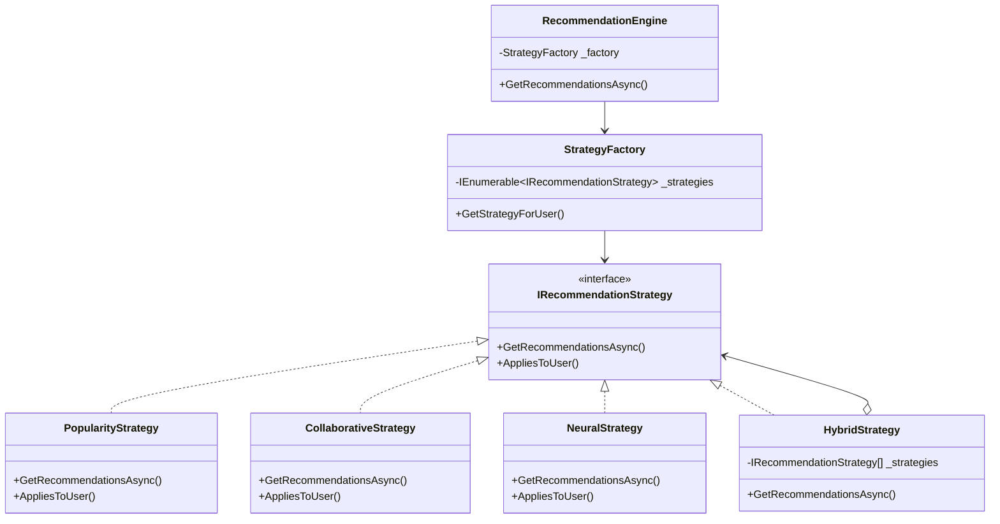
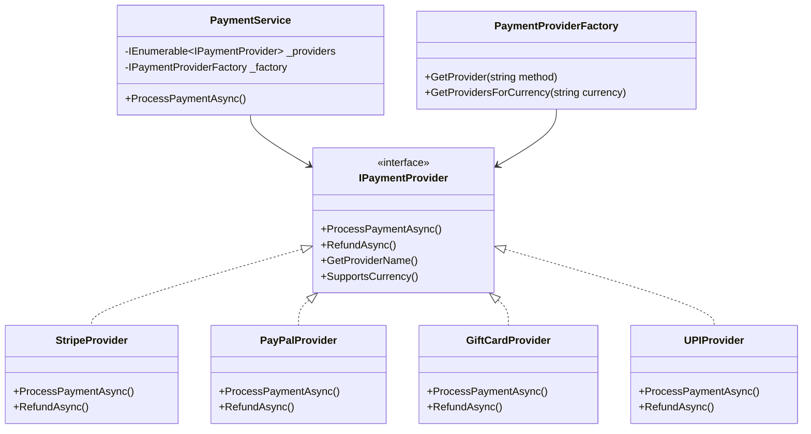
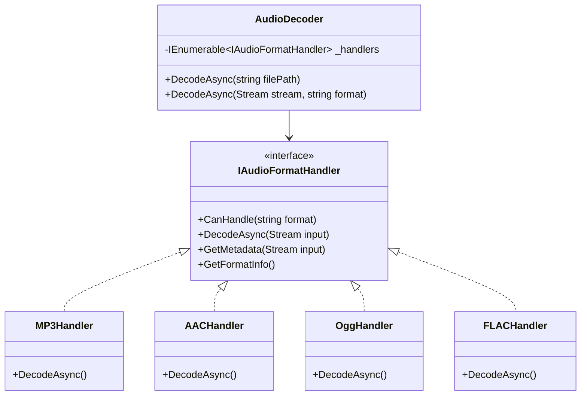
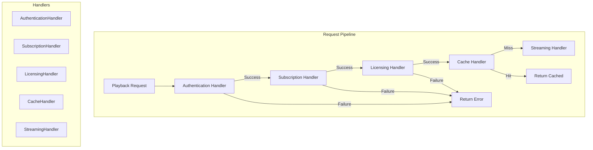
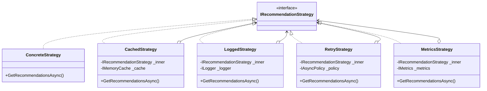

# Part 3: Open-Closed Principle
## Open for Extension, Closed for Modification - The .NET 10 Way

---

**Subtitle:**
How Spotify adds new recommendation algorithms, payment providers, and audio formats without touching existing code—using .NET 10, Strategy Pattern, Decorators, and Dependency Injection.

**Keywords:**
Open-Closed Principle, OCP, .NET 10, C# 13, Strategy Pattern, Decorator Pattern, Chain of Responsibility, Plugin Architecture, Dependency Injection, Spotify system design

---

## Introduction: The Legacy of Fear

**The Legacy Violation:**
```csharp
public class RecommendationEngine
{
    public List<string> GetRecommendations(string userId, string algorithm)
    {
        if (algorithm == "popularity")
        {
            // Popularity-based logic
        }
        else if (algorithm == "collaborative")
        {
            // Collaborative filtering logic
        }
        else if (algorithm == "neural")
        {
            // Neural network logic
        }
        else if (algorithm == "genre-based")
        {
            // Genre-based logic
        }
        // Every new algorithm requires modifying this method
        // Every change risks breaking existing algorithms
    }
}
```

Every time the product team wants to test a new recommendation algorithm, a developer must modify this method. The code becomes a minefield of conditionals. Testing requires regression testing all algorithms. Innovation slows to a crawl.

**The Redefined View:**
The Open-Closed Principle states that software entities should be **open for extension but closed for modification**. You should be able to add new functionality without changing existing code.

**Why This Matters for Spotify:**

| Scenario | Without OCP | With OCP |
|----------|-------------|----------|
| New recommendation algorithm | Modify RecommendationEngine, risk breaking existing ones | Add new Strategy class, zero risk |
| New payment provider | Modify PaymentService, touch 10+ files | Add new PaymentProvider implementation |
| New audio format | Modify AudioPlayer, add switch statements | Add new AudioFormat handler |
| New subscription tier | Modify UserService, update all permission checks | Add new Tier with its own rules |

**The Cost of Violation:**
- **Fragility:** Changes break existing features
- **Rigidity:** Adding features requires modifying core code
- **Immobility:** Code can't be reused in different contexts
- **Technical debt:** Accumulates with every modification

---

## The .NET 10 OCP Toolkit

### 1. Interfaces and Abstraction

```csharp
// WHY .NET 10: Interfaces define contracts that can be extended
public interface IRecommendationStrategy
{
    string StrategyName { get; }
    Task<List<string>> GetRecommendationsAsync(string userId, int count, CancellationToken ct = default);
    bool AppliesToUser(string userId, UserProfile profile);
}
```

### 2. Dependency Injection with Keyed Services

```csharp
// WHY .NET 10: Keyed services allow multiple implementations
builder.Services.AddKeyedScoped<IRecommendationStrategy, PopularityStrategy>("popularity");
builder.Services.AddKeyedScoped<IRecommendationStrategy, CollaborativeStrategy>("collaborative");
builder.Services.AddKeyedScoped<IRecommendationStrategy, NeuralStrategy>("neural");

// Resolve by key
var strategy = serviceProvider.GetKeyedService<IRecommendationStrategy>("popularity");
```

### 3. Strategy Pattern with Factory

```csharp
// WHY .NET 10: Factory pattern combined with DI for dynamic selection
public class RecommendationStrategyFactory
{
    private readonly IEnumerable<IRecommendationStrategy> _strategies;
    
    public IRecommendationStrategy GetStrategyForUser(UserProfile profile)
    {
        return _strategies.FirstOrDefault(s => s.AppliesToUser(profile.UserId, profile))
            ?? _strategies.First(); // Default
    }
}
```

### 4. Decorator Pattern with DI

```csharp
// WHY .NET 10: Decorators add behavior without modifying the decorated class
public class CachedRecommendationStrategy : IRecommendationStrategy
{
    private readonly IRecommendationStrategy _inner;
    private readonly IMemoryCache _cache;
    
    public CachedRecommendationStrategy(IRecommendationStrategy inner, IMemoryCache cache)
    {
        _inner = inner;
        _cache = cache;
    }
    
    public async Task<List<string>> GetRecommendationsAsync(string userId, int count, CancellationToken ct)
    {
        var cacheKey = $"recs_{userId}_{count}";
        return await _cache.GetOrCreateAsync(cacheKey, async entry =>
        {
            entry.SlidingExpiration = TimeSpan.FromHours(1);
            return await _inner.GetRecommendationsAsync(userId, count, ct);
        });
    }
}
```

### 5. Chain of Responsibility Pattern

```csharp
// WHY .NET 10: Chain pattern allows dynamic handler composition
public interface IPlaybackHandler
{
    Task<PlaybackResult> HandleAsync(PlaybackRequest request, Func<Task<PlaybackResult>> next);
}

// Register chain
builder.Services.AddScoped<IPlaybackHandler, AuthenticationHandler>();
builder.Services.AddScoped<IPlaybackHandler, SubscriptionHandler>();
builder.Services.AddScoped<IPlaybackHandler, LicensingHandler>();
builder.Services.AddScoped<IPlaybackHandler, CacheHandler>();
```

---

## Real Spotify Example 1: Recommendation Strategies

Spotify uses multiple recommendation algorithms for different contexts. New algorithms are constantly being developed and tested.



### The OCP-Compliant Implementation

```csharp
// ========== Strategy Interface ==========

/// <summary>
/// RESPONSIBILITY: Define contract for recommendation algorithms
/// OPEN FOR EXTENSION: New strategies implement this interface
/// CLOSED FOR MODIFICATION: Existing code uses this interface
/// </summary>
public interface IRecommendationStrategy
{
    string StrategyName { get; }
    Task<List<string>> GetRecommendationsAsync(
        string userId, 
        int count, 
        CancellationToken cancellationToken = default);
    
    bool AppliesToUser(string userId, UserProfile profile);
}

// ========== User Profile ==========

public record UserProfile
{
    public required string UserId { get; init; }
    public int TotalPlays { get; init; }
    public int DaysSinceJoined { get; init; }
    public IReadOnlyList<string> RecentlyPlayed { get; init; } = Array.Empty<string>();
    public IReadOnlyDictionary<string, double> GenreAffinities { get; init; } = new Dictionary<string, double>();
    public bool IsNewUser => DaysSinceJoined < 7 || TotalPlays < 50;
    public bool IsPowerUser => TotalPlays >= 1000;
}

// ========== Concrete Strategies ==========

/// <summary>
/// Strategy 1: Popularity-based - for new users with no history
/// </summary>
public class PopularityStrategy : IRecommendationStrategy
{
    private readonly ISongRepository _songRepository;
    private readonly ILogger<PopularityStrategy> _logger;
    
    public string StrategyName => "Popularity-Based";
    
    public PopularityStrategy(ISongRepository songRepository, ILogger<PopularityStrategy> logger)
    {
        _songRepository = songRepository;
        _logger = logger;
    }
    
    public bool AppliesToUser(string userId, UserProfile profile)
    {
        // New users or users with little history
        return profile.IsNewUser;
    }
    
    public async Task<List<string>> GetRecommendationsAsync(
        string userId, 
        int count, 
        CancellationToken cancellationToken = default)
    {
        _logger.LogInformation("[{Strategy}] Getting recommendations for user {UserId}", StrategyName, userId);
        
        // Get globally popular songs
        var popularSongs = await _songRepository.GetMostPopularAsync(count, cancellationToken);
        
        return popularSongs.Select(s => s.Id).ToList();
    }
}

/// <summary>
/// Strategy 2: Collaborative Filtering - for users with moderate history
/// </summary>
public class CollaborativeStrategy : IRecommendationStrategy
{
    private readonly IRecommendationRepository _repository;
    private readonly ILogger<CollaborativeStrategy> _logger;
    
    public string StrategyName => "Collaborative Filtering";
    
    public CollaborativeStrategy(IRecommendationRepository repository, ILogger<CollaborativeStrategy> logger)
    {
        _repository = repository;
        _logger = logger;
    }
    
    public bool AppliesToUser(string userId, UserProfile profile)
    {
        // Users with moderate history but not power users
        return !profile.IsNewUser && !profile.IsPowerUser;
    }
    
    public async Task<List<string>> GetRecommendationsAsync(
        string userId, 
        int count, 
        CancellationToken cancellationToken = default)
    {
        _logger.LogInformation("[{Strategy}] Getting recommendations for user {UserId}", StrategyName, userId);
        
        // Find similar users and their liked songs
        var similarUsers = await _repository.FindSimilarUsersAsync(userId, 10, cancellationToken);
        var recommendations = await _repository.GetCollaborativeRecommendationsAsync(
            userId, similarUsers, count, cancellationToken);
        
        return recommendations;
    }
}

/// <summary>
/// Strategy 3: Neural Network - for power users with extensive history
/// </summary>
public class NeuralStrategy : IRecommendationStrategy
{
    private readonly IMLModelService _mlService;
    private readonly ILogger<NeuralStrategy> _logger;
    
    public string StrategyName => "Neural Network";
    
    public NeuralStrategy(IMLModelService mlService, ILogger<NeuralStrategy> logger)
    {
        _mlService = mlService;
        _logger = logger;
    }
    
    public bool AppliesToUser(string userId, UserProfile profile)
    {
        // Power users get the advanced model
        return profile.IsPowerUser;
    }
    
    public async Task<List<string>> GetRecommendationsAsync(
        string userId, 
        int count, 
        CancellationToken cancellationToken = default)
    {
        _logger.LogInformation("[{Strategy}] Getting recommendations for user {UserId}", StrategyName, userId);
        
        // Run neural network inference
        var recommendations = await _mlService.GetRecommendationsAsync(userId, count, cancellationToken);
        
        return recommendations;
    }
}

/// <summary>
/// Strategy 4: Hybrid - combines multiple strategies
/// OPEN FOR EXTENSION: Can combine any existing strategies
/// </summary>
public class HybridStrategy : IRecommendationStrategy
{
    private readonly IEnumerable<IRecommendationStrategy> _strategies;
    private readonly ILogger<HybridStrategy> _logger;
    
    public string StrategyName => "Hybrid";
    
    public HybridStrategy(IEnumerable<IRecommendationStrategy> strategies, ILogger<HybridStrategy> logger)
    {
        _strategies = strategies;
        _logger = logger;
    }
    
    public bool AppliesToUser(string userId, UserProfile profile)
    {
        // Hybrid can apply to anyone, but typically used for A/B testing
        return profile.UserId.GetHashCode() % 2 == 0; // 50% of users
    }
    
    public async Task<List<string>> GetRecommendationsAsync(
        string userId, 
        int count, 
        CancellationToken cancellationToken = default)
    {
        _logger.LogInformation("[{Strategy}] Getting hybrid recommendations for user {UserId}", StrategyName, userId);
        
        // Run multiple strategies and combine results
        var allTasks = _strategies.Select(s => s.GetRecommendationsAsync(userId, count / 2, cancellationToken));
        var results = await Task.WhenAll(allTasks);
        
        // Combine and deduplicate
        var combined = results.SelectMany(r => r).Distinct().Take(count).ToList();
        
        return combined;
    }
}

// ========== Strategy Factory ==========

/// <summary>
/// RESPONSIBILITY: Select appropriate strategy for user
/// OPEN FOR EXTENSION: New strategies automatically considered
/// CLOSED FOR MODIFICATION: Factory doesn't change when new strategies added
/// </summary>
public class RecommendationStrategyFactory
{
    private readonly IEnumerable<IRecommendationStrategy> _strategies;
    private readonly ILogger<RecommendationStrategyFactory> _logger;
    
    public RecommendationStrategyFactory(
        IEnumerable<IRecommendationStrategy> strategies,
        ILogger<RecommendationStrategyFactory> logger)
    {
        _strategies = strategies;
        _logger = logger;
    }
    
    public IRecommendationStrategy GetStrategyForUser(UserProfile profile)
    {
        var strategy = _strategies.FirstOrDefault(s => s.AppliesToUser(profile.UserId, profile));
        
        if (strategy == null)
        {
            _logger.LogWarning("No strategy found for user {UserId}, using default", profile.UserId);
            strategy = _strategies.First(); // Default to first
        }
        
        _logger.LogDebug("Selected {Strategy} for user {UserId}", strategy.StrategyName, profile.UserId);
        return strategy;
    }
    
    public IReadOnlyList<IRecommendationStrategy> GetAllStrategies() => _strategies.ToList();
}

// ========== Recommendation Engine ==========

/// <summary>
/// RESPONSIBILITY: Orchestrate recommendation generation
/// CLOSED FOR MODIFICATION: No changes needed when new strategies added
/// </summary>
public class RecommendationEngine
{
    private readonly RecommendationStrategyFactory _factory;
    private readonly IUserProfileRepository _profileRepository;
    private readonly ILogger<RecommendationEngine> _logger;
    
    public RecommendationEngine(
        RecommendationStrategyFactory factory,
        IUserProfileRepository profileRepository,
        ILogger<RecommendationEngine> logger)
    {
        _factory = factory;
        _profileRepository = profileRepository;
        _logger = logger;
    }
    
    public async Task<List<string>> GetRecommendationsAsync(
        string userId, 
        int count = 30,
        CancellationToken cancellationToken = default)
    {
        // Get user profile
        var profile = await _profileRepository.GetUserProfileAsync(userId, cancellationToken);
        
        // Select strategy (dynamic based on user)
        var strategy = _factory.GetStrategyForUser(profile);
        
        _logger.LogInformation("Using {Strategy} for user {UserId}", strategy.StrategyName, userId);
        
        // Get recommendations (polymorphic call)
        return await strategy.GetRecommendationsAsync(userId, count, cancellationToken);
    }
    
    /// <summary>
    /// For A/B testing - use specific strategy
    /// </summary>
    public async Task<List<string>> GetRecommendationsWithStrategyAsync(
        string userId,
        string strategyName,
        int count = 30,
        CancellationToken cancellationToken = default)
    {
        var strategy = _factory.GetAllStrategies()
            .FirstOrDefault(s => s.StrategyName.Equals(strategyName, StringComparison.OrdinalIgnoreCase));
        
        if (strategy == null)
            throw new ArgumentException($"Unknown strategy: {strategyName}");
        
        return await strategy.GetRecommendationsAsync(userId, count, cancellationToken);
    }
}

// ========== Repository Interfaces ==========

public interface ISongRepository
{
    Task<List<Song>> GetMostPopularAsync(int count, CancellationToken ct);
}

public interface IRecommendationRepository
{
    Task<List<string>> FindSimilarUsersAsync(string userId, int limit, CancellationToken ct);
    Task<List<string>> GetCollaborativeRecommendationsAsync(string userId, List<string> similarUsers, int count, CancellationToken ct);
}

public interface IMLModelService
{
    Task<List<string>> GetRecommendationsAsync(string userId, int count, CancellationToken ct);
}

public interface IUserProfileRepository
{
    Task<UserProfile> GetUserProfileAsync(string userId, CancellationToken ct);
}

// ========== Dependency Injection Registration ==========

/*
// In Program.cs
builder.Services.AddScoped<IRecommendationStrategy, PopularityStrategy>();
builder.Services.AddScoped<IRecommendationStrategy, CollaborativeStrategy>();
builder.Services.AddScoped<IRecommendationStrategy, NeuralStrategy>();
builder.Services.AddScoped<IRecommendationStrategy, HybridStrategy>();

builder.Services.AddScoped<RecommendationStrategyFactory>();
builder.Services.AddScoped<RecommendationEngine>();
*/

// ========== Adding a New Strategy ==========

/// <summary>
/// NEW STRATEGY: Genre-based recommendations
/// Added without modifying any existing code!
/// </summary>
public class GenreBasedStrategy : IRecommendationStrategy
{
    private readonly ISongRepository _songRepository;
    private readonly ILogger<GenreBasedStrategy> _logger;
    
    public string StrategyName => "Genre-Based";
    
    public GenreBasedStrategy(ISongRepository songRepository, ILogger<GenreBasedStrategy> logger)
    {
        _songRepository = songRepository;
        _logger = logger;
    }
    
    public bool AppliesToUser(string userId, UserProfile profile)
    {
        // Apply to users with strong genre preferences
        return profile.GenreAffinities.Values.Any(v => v > 0.8);
    }
    
    public async Task<List<string>> GetRecommendationsAsync(
        string userId, 
        int count, 
        CancellationToken cancellationToken = default)
    {
        _logger.LogInformation("[{Strategy}] Getting genre-based recommendations for user {UserId}", StrategyName, userId);
        
        // Implementation here
        return new List<string>();
    }
}

// Just register it - no other changes needed!
// builder.Services.AddScoped<IRecommendationStrategy, GenreBasedStrategy>();
```

**OCP Benefits Achieved:**
- **New algorithm?** Add a new class, register it - done
- **Existing code?** Zero changes
- **Testing?** Test only the new strategy
- **Risk?** Zero risk to existing strategies
- **Deployment?** Can be deployed independently

---

## Real Spotify Example 2: Payment Providers

Spotify accepts payments through multiple providers: credit cards, PayPal, gift cards, and region-specific providers like UPI in India or iDEAL in Netherlands.



### The OCP-Compliant Implementation

```csharp
// ========== Payment Provider Interface ==========

/// <summary>
/// RESPONSIBILITY: Define contract for payment processing
/// OPEN FOR EXTENSION: New providers implement this interface
/// </summary>
public interface IPaymentProvider
{
    string ProviderName { get; }
    Task<PaymentResult> ProcessPaymentAsync(PaymentRequest request, CancellationToken ct = default);
    Task<RefundResult> RefundAsync(RefundRequest request, CancellationToken ct = default);
    bool SupportsCurrency(string currencyCode);
    bool SupportsPaymentMethod(string method);
}

// ========== Request/Response Types ==========

public record PaymentRequest
{
    public required string TransactionId { get; init; } = Guid.NewGuid().ToString();
    public required string UserId { get; init; }
    public required decimal Amount { get; init; }
    public required string CurrencyCode { get; init; }
    public required string PaymentMethod { get; init; } // "card", "paypal", "giftcard", "upi"
    public Dictionary<string, string>? PaymentDetails { get; init; }
    public string? Description { get; init; }
    public DateTime RequestedAt { get; init; } = DateTime.UtcNow;
}

public record PaymentResult
{
    public required bool Success { get; init; }
    public required string TransactionId { get; init; }
    public string? ProviderTransactionId { get; init; }
    public string? ErrorMessage { get; init; }
    public string? ErrorCode { get; init; }
    public DateTime ProcessedAt { get; init; } = DateTime.UtcNow;
}

public record RefundRequest
{
    public required string OriginalTransactionId { get; init; }
    public required decimal Amount { get; init; }
    public string? Reason { get; init; }
}

public record RefundResult
{
    public required bool Success { get; init; }
    public required string RefundId { get; init; }
    public string? ErrorMessage { get; init; }
}

// ========== Concrete Providers ==========

/// <summary>
/// Stripe payment provider (credit cards)
/// </summary>
public class StripeProvider : IPaymentProvider
{
    private readonly IHttpClientFactory _httpClientFactory;
    private readonly IOptions<StripeOptions> _options;
    private readonly ILogger<StripeProvider> _logger;
    
    public string ProviderName => "Stripe";
    
    public StripeProvider(
        IHttpClientFactory httpClientFactory,
        IOptions<StripeOptions> options,
        ILogger<StripeProvider> logger)
    {
        _httpClientFactory = httpClientFactory;
        _options = options;
        _logger = logger;
    }
    
    public bool SupportsCurrency(string currencyCode)
    {
        // Stripe supports most currencies
        var supported = new[] { "USD", "EUR", "GBP", "CAD", "AUD" };
        return supported.Contains(currencyCode);
    }
    
    public bool SupportsPaymentMethod(string method)
    {
        return method == "card" || method == "apple_pay" || method == "google_pay";
    }
    
    public async Task<PaymentResult> ProcessPaymentAsync(PaymentRequest request, CancellationToken ct = default)
    {
        _logger.LogInformation("Processing {Amount} {Currency} via Stripe", request.Amount, request.CurrencyCode);
        
        var client = _httpClientFactory.CreateClient("Stripe");
        
        // Call Stripe API
        var response = await client.PostAsJsonAsync("https://api.stripe.com/v1/charges", new
        {
            amount = (long)(request.Amount * 100), // in cents
            currency = request.CurrencyCode.ToLower(),
            description = request.Description
        }, ct);
        
        if (response.IsSuccessStatusCode)
        {
            var result = await response.Content.ReadFromJsonAsync<StripeResponse>(ct);
            return new PaymentResult
            {
                Success = true,
                TransactionId = request.TransactionId,
                ProviderTransactionId = result?.Id,
                ProcessedAt = DateTime.UtcNow
            };
        }
        
        var error = await response.Content.ReadAsStringAsync(ct);
        _logger.LogError("Stripe payment failed: {Error}", error);
        
        return new PaymentResult
        {
            Success = false,
            TransactionId = request.TransactionId,
            ErrorMessage = "Payment processing failed",
            ErrorCode = $"STRIPE_{response.StatusCode}"
        };
    }
    
    public async Task<RefundResult> RefundAsync(RefundRequest request, CancellationToken ct = default)
    {
        // Refund logic
        return new RefundResult { Success = true, RefundId = Guid.NewGuid().ToString() };
    }
}

/// <summary>
/// PayPal payment provider
/// </summary>
public class PayPalProvider : IPaymentProvider
{
    private readonly IHttpClientFactory _httpClientFactory;
    private readonly ILogger<PayPalProvider> _logger;
    
    public string ProviderName => "PayPal";
    
    public PayPalProvider(IHttpClientFactory httpClientFactory, ILogger<PayPalProvider> logger)
    {
        _httpClientFactory = httpClientFactory;
        _logger = logger;
    }
    
    public bool SupportsCurrency(string currencyCode)
    {
        var supported = new[] { "USD", "EUR", "GBP", "AUD", "CAD", "JPY" };
        return supported.Contains(currencyCode);
    }
    
    public bool SupportsPaymentMethod(string method)
    {
        return method == "paypal";
    }
    
    public async Task<PaymentResult> ProcessPaymentAsync(PaymentRequest request, CancellationToken ct = default)
    {
        _logger.LogInformation("Processing {Amount} {Currency} via PayPal", request.Amount, request.CurrencyCode);
        
        // PayPal-specific implementation
        await Task.Delay(100, ct);
        
        return new PaymentResult
        {
            Success = true,
            TransactionId = request.TransactionId,
            ProviderTransactionId = $"PP-{Guid.NewGuid()}",
            ProcessedAt = DateTime.UtcNow
        };
    }
    
    public async Task<RefundResult> RefundAsync(RefundRequest request, CancellationToken ct = default)
    {
        return new RefundResult { Success = true, RefundId = Guid.NewGuid().ToString() };
    }
}

/// <summary>
/// UPI payment provider (India-specific)
/// </summary>
public class UPIProvider : IPaymentProvider
{
    private readonly ILogger<UPIProvider> _logger;
    
    public string ProviderName => "UPI";
    
    public UPIProvider(ILogger<UPIProvider> logger)
    {
        _logger = logger;
    }
    
    public bool SupportsCurrency(string currencyCode)
    {
        return currencyCode == "INR";
    }
    
    public bool SupportsPaymentMethod(string method)
    {
        return method == "upi" || method == "gpay" || method == "phonepe";
    }
    
    public async Task<PaymentResult> ProcessPaymentAsync(PaymentRequest request, CancellationToken ct = default)
    {
        _logger.LogInformation("Processing ₹{Amount} via UPI", request.Amount);
        
        // UPI-specific implementation
        await Task.Delay(200, ct);
        
        return new PaymentResult
        {
            Success = true,
            TransactionId = request.TransactionId,
            ProviderTransactionId = $"UPI-{Guid.NewGuid()}",
            ProcessedAt = DateTime.UtcNow
        };
    }
    
    public async Task<RefundResult> RefundAsync(RefundRequest request, CancellationToken ct = default)
    {
        return new RefundResult { Success = true, RefundId = Guid.NewGuid().ToString() };
    }
}

/// <summary>
/// Gift card provider
/// </summary>
public class GiftCardProvider : IPaymentProvider
{
    private readonly IGiftCardRepository _giftCardRepository;
    private readonly ILogger<GiftCardProvider> _logger;
    
    public string ProviderName => "GiftCard";
    
    public GiftCardProvider(IGiftCardRepository giftCardRepository, ILogger<GiftCardProvider> logger)
    {
        _giftCardRepository = giftCardRepository;
        _logger = logger;
    }
    
    public bool SupportsCurrency(string currencyCode)
    {
        return true; // Gift cards have their own currency
    }
    
    public bool SupportsPaymentMethod(string method)
    {
        return method == "giftcard";
    }
    
    public async Task<PaymentResult> ProcessPaymentAsync(PaymentRequest request, CancellationToken ct = default)
    {
        _logger.LogInformation("Processing gift card payment");
        
        var giftCardCode = request.PaymentDetails?["code"];
        if (string.IsNullOrEmpty(giftCardCode))
        {
            return new PaymentResult
            {
                Success = false,
                TransactionId = request.TransactionId,
                ErrorMessage = "Gift card code required"
            };
        }
        
        var giftCard = await _giftCardRepository.GetByCodeAsync(giftCardCode, ct);
        if (giftCard == null || giftCard.Balance < request.Amount)
        {
            return new PaymentResult
            {
                Success = false,
                TransactionId = request.TransactionId,
                ErrorMessage = "Invalid or insufficient gift card"
            };
        }
        
        giftCard.Balance -= request.Amount;
        await _giftCardRepository.UpdateAsync(giftCard, ct);
        
        return new PaymentResult
        {
            Success = true,
            TransactionId = request.TransactionId,
            ProviderTransactionId = giftCardCode,
            ProcessedAt = DateTime.UtcNow
        };
    }
    
    public async Task<RefundResult> RefundAsync(RefundRequest request, CancellationToken ct = default)
    {
        // Gift cards can't be refunded
        return new RefundResult { Success = false, RefundId = Guid.NewGuid().ToString(), ErrorMessage = "Gift cards cannot be refunded" };
    }
}

// ========== Payment Provider Factory ==========

/// <summary>
/// RESPONSIBILITY: Select appropriate payment provider
/// OPEN FOR EXTENSION: New providers automatically considered
/// </summary>
public class PaymentProviderFactory
{
    private readonly IEnumerable<IPaymentProvider> _providers;
    private readonly ILogger<PaymentProviderFactory> _logger;
    
    public PaymentProviderFactory(
        IEnumerable<IPaymentProvider> providers,
        ILogger<PaymentProviderFactory> logger)
    {
        _providers = providers;
        _logger = logger;
    }
    
    public IPaymentProvider GetProvider(string paymentMethod, string currencyCode)
    {
        var provider = _providers.FirstOrDefault(p => 
            p.SupportsPaymentMethod(paymentMethod) && p.SupportsCurrency(currencyCode));
        
        if (provider == null)
        {
            _logger.LogWarning("No provider found for method {Method} and currency {Currency}", 
                paymentMethod, currencyCode);
            throw new PaymentProviderNotFoundException($"No provider supports {paymentMethod} in {currencyCode}");
        }
        
        _logger.LogDebug("Selected {Provider} for {Method}/{Currency}", 
            provider.ProviderName, paymentMethod, currencyCode);
        
        return provider;
    }
    
    public IEnumerable<IPaymentProvider> GetAllProviders() => _providers;
    
    public IEnumerable<IPaymentProvider> GetProvidersForCurrency(string currencyCode)
    {
        return _providers.Where(p => p.SupportsCurrency(currencyCode));
    }
}

// ========== Payment Service ==========

/// <summary>
/// RESPONSIBILITY: Process payments using appropriate provider
/// CLOSED FOR MODIFICATION: No changes when new providers added
/// </summary>
public class PaymentService
{
    private readonly PaymentProviderFactory _factory;
    private readonly ITransactionRepository _transactionRepository;
    private readonly ILogger<PaymentService> _logger;
    
    public PaymentService(
        PaymentProviderFactory factory,
        ITransactionRepository transactionRepository,
        ILogger<PaymentService> logger)
    {
        _factory = factory;
        _transactionRepository = transactionRepository;
        _logger = logger;
    }
    
    public async Task<PaymentResult> ProcessPaymentAsync(PaymentRequest request, CancellationToken ct = default)
    {
        _logger.LogInformation("Processing payment {TransactionId} for user {UserId}", 
            request.TransactionId, request.UserId);
        
        // Get appropriate provider
        var provider = _factory.GetProvider(request.PaymentMethod, request.CurrencyCode);
        
        // Save initial transaction
        await _transactionRepository.SaveAsync(new Transaction
        {
            Id = request.TransactionId,
            UserId = request.UserId,
            Amount = request.Amount,
            Currency = request.CurrencyCode,
            Status = "Processing",
            CreatedAt = DateTime.UtcNow
        }, ct);
        
        try
        {
            // Process with selected provider
            var result = await provider.ProcessPaymentAsync(request, ct);
            
            // Update transaction
            await _transactionRepository.UpdateStatusAsync(
                request.TransactionId, 
                result.Success ? "Completed" : "Failed",
                result.ProviderTransactionId,
                ct);
            
            return result;
        }
        catch (Exception ex)
        {
            _logger.LogError(ex, "Payment processing failed for {TransactionId}", request.TransactionId);
            
            await _transactionRepository.UpdateStatusAsync(
                request.TransactionId, 
                "Failed",
                null,
                ct);
            
            throw;
        }
    }
}

// ========== Adding a New Provider ==========

/// <summary>
/// NEW PROVIDER: iDEAL (Netherlands)
/// Added without modifying any existing code!
/// </summary>
public class IdealProvider : IPaymentProvider
{
    private readonly ILogger<IdealProvider> _logger;
    
    public string ProviderName => "iDEAL";
    
    public IdealProvider(ILogger<IdealProvider> logger)
    {
        _logger = logger;
    }
    
    public bool SupportsCurrency(string currencyCode)
    {
        return currencyCode == "EUR";
    }
    
    public bool SupportsPaymentMethod(string method)
    {
        return method == "ideal";
    }
    
    public async Task<PaymentResult> ProcessPaymentAsync(PaymentRequest request, CancellationToken ct = default)
    {
        _logger.LogInformation("Processing €{Amount} via iDEAL", request.Amount);
        
        // iDEAL-specific implementation
        await Task.Delay(150, ct);
        
        return new PaymentResult
        {
            Success = true,
            TransactionId = request.TransactionId,
            ProviderTransactionId = $"IDEAL-{Guid.NewGuid()}",
            ProcessedAt = DateTime.UtcNow
        };
    }
    
    public async Task<RefundResult> RefundAsync(RefundRequest request, CancellationToken ct = default)
    {
        return new RefundResult { Success = true, RefundId = Guid.NewGuid().ToString() };
    }
}

// Just register it!
// builder.Services.AddScoped<IPaymentProvider, IdealProvider>();
```

**OCP Benefits Achieved:**
- **New payment provider?** Add a new class, register it
- **No changes** to PaymentService or existing providers
- **Risk-free** deployment of new payment methods
- **Regional customization** without global changes

---

## Real Spotify Example 3: Audio Format Handlers

Spotify supports multiple audio formats: MP3, AAC, Ogg Vorbis, FLAC for premium users. The audio player should support new formats without modification.



### The OCP-Compliant Implementation

```csharp
// ========== Format Handler Interface ==========

/// <summary>
/// RESPONSIBILITY: Handle a specific audio format
/// OPEN FOR EXTENSION: New formats implement this interface
/// </summary>
public interface IAudioFormatHandler
{
    string FormatName { get; }
    bool CanHandle(string formatExtension, string? mimeType = null);
    Task<DecodedAudio> DecodeAsync(Stream input, CancellationToken ct = default);
    AudioMetadata GetMetadata(Stream input);
    FormatInfo GetFormatInfo();
}

public record DecodedAudio
{
    public required byte[] PCMData { get; init; }
    public required int SampleRate { get; init; }
    public required int Channels { get; init; }
    public required int BitsPerSample { get; init; }
    public TimeSpan Duration { get; init; }
}

public record AudioMetadata
{
    public TimeSpan Duration { get; init; }
    public int Bitrate { get; init; }
    public string? Title { get; init; }
    public string? Artist { get; init; }
    public string? Album { get; init; }
    public Dictionary<string, string>? CustomMetadata { get; init; }
}

public record FormatInfo
{
    public required string FormatName { get; init; }
    public required bool SupportsStreaming { get; init; }
    public required bool SupportsSeeking { get; init; }
    public required int DefaultBitrate { get; init; }
    public required string[] FileExtensions { get; init; }
    public required string[] MimeTypes { get; init; }
}

// ========== Concrete Handlers ==========

/// <summary>
/// MP3 format handler
/// </summary>
public class MP3Handler : IAudioFormatHandler
{
    private readonly ILogger<MP3Handler> _logger;
    
    public string FormatName => "MP3";
    
    public MP3Handler(ILogger<MP3Handler> logger)
    {
        _logger = logger;
    }
    
    public bool CanHandle(string formatExtension, string? mimeType = null)
    {
        var extensions = new[] { ".mp3", ".mpga" };
        var mimeTypes = new[] { "audio/mpeg", "audio/mp3" };
        
        return extensions.Contains(formatExtension.ToLower()) ||
               (mimeType != null && mimeTypes.Contains(mimeType.ToLower()));
    }
    
    public async Task<DecodedAudio> DecodeAsync(Stream input, CancellationToken ct = default)
    {
        _logger.LogDebug("Decoding MP3 stream");
        
        // In real app, would use NAudio, FFmpeg, or platform APIs
        await Task.Delay(50, ct); // Simulate decoding
        
        return new DecodedAudio
        {
            PCMData = new byte[1024 * 1024], // 1MB of PCM data
            SampleRate = 44100,
            Channels = 2,
            BitsPerSample = 16,
            Duration = TimeSpan.FromSeconds(180)
        };
    }
    
    public AudioMetadata GetMetadata(Stream input)
    {
        // Parse ID3 tags
        return new AudioMetadata
        {
            Duration = TimeSpan.FromSeconds(180),
            Bitrate = 320,
            Title = "Sample Song",
            Artist = "Sample Artist",
            Album = "Sample Album"
        };
    }
    
    public FormatInfo GetFormatInfo()
    {
        return new FormatInfo
        {
            FormatName = "MP3",
            SupportsStreaming = true,
            SupportsSeeking = true,
            DefaultBitrate = 128,
            FileExtensions = new[] { ".mp3", ".mpga" },
            MimeTypes = new[] { "audio/mpeg", "audio/mp3" }
        };
    }
}

/// <summary>
/// FLAC format handler (lossless, premium only)
/// </summary>
public class FLACHandler : IAudioFormatHandler
{
    private readonly ILogger<FLACHandler> _logger;
    
    public string FormatName => "FLAC";
    
    public FLACHandler(ILogger<FLACHandler> logger)
    {
        _logger = logger;
    }
    
    public bool CanHandle(string formatExtension, string? mimeType = null)
    {
        var extensions = new[] { ".flac" };
        var mimeTypes = new[] { "audio/flac", "audio/x-flac" };
        
        return extensions.Contains(formatExtension.ToLower()) ||
               (mimeType != null && mimeTypes.Contains(mimeType.ToLower()));
    }
    
    public async Task<DecodedAudio> DecodeAsync(Stream input, CancellationToken ct = default)
    {
        _logger.LogDebug("Decoding FLAC stream (lossless)");
        
        // FLAC decoding is more CPU intensive
        await Task.Delay(150, ct);
        
        return new DecodedAudio
        {
            PCMData = new byte[1024 * 1024 * 3], // 3MB of PCM data
            SampleRate = 96000,
            Channels = 2,
            BitsPerSample = 24,
            Duration = TimeSpan.FromSeconds(180)
        };
    }
    
    public AudioMetadata GetMetadata(Stream input)
    {
        return new AudioMetadata
        {
            Duration = TimeSpan.FromSeconds(180),
            Bitrate = 1411, // CD quality
            Title = "Sample Song (Lossless)",
            Artist = "Sample Artist",
            Album = "Sample Album (Deluxe)"
        };
    }
    
    public FormatInfo GetFormatInfo()
    {
        return new FormatInfo
        {
            FormatName = "FLAC",
            SupportsStreaming = true,
            SupportsSeeking = true,
            DefaultBitrate = 1411,
            FileExtensions = new[] { ".flac" },
            MimeTypes = new[] { "audio/flac", "audio/x-flac" }
        };
    }
}

// ========== Audio Decoder ==========

/// <summary>
/// RESPONSIBILITY: Decode audio using appropriate handler
/// CLOSED FOR MODIFICATION: No changes when new formats added
/// </summary>
public class AudioDecoder
{
    private readonly IEnumerable<IAudioFormatHandler> _handlers;
    private readonly ILogger<AudioDecoder> _logger;
    
    public AudioDecoder(
        IEnumerable<IAudioFormatHandler> handlers,
        ILogger<AudioDecoder> logger)
    {
        _handlers = handlers;
        _logger = logger;
    }
    
    public async Task<DecodedAudio> DecodeAsync(
        string filePath, 
        CancellationToken ct = default)
    {
        var extension = Path.GetExtension(filePath);
        var handler = _handlers.FirstOrDefault(h => h.CanHandle(extension));
        
        if (handler == null)
        {
            throw new NotSupportedException($"No handler found for format {extension}");
        }
        
        _logger.LogInformation("Decoding {FilePath} using {Handler}", filePath, handler.FormatName);
        
        await using var fileStream = File.OpenRead(filePath);
        return await handler.DecodeAsync(fileStream, ct);
    }
    
    public async Task<DecodedAudio> DecodeAsync(
        Stream stream, 
        string formatExtension,
        CancellationToken ct = default)
    {
        var handler = _handlers.FirstOrDefault(h => h.CanHandle(formatExtension));
        
        if (handler == null)
        {
            throw new NotSupportedException($"No handler found for format {formatExtension}");
        }
        
        return await handler.DecodeAsync(stream, ct);
    }
    
    public AudioMetadata GetMetadata(string filePath)
    {
        var extension = Path.GetExtension(filePath);
        var handler = _handlers.FirstOrDefault(h => h.CanHandle(extension));
        
        if (handler == null)
        {
            throw new NotSupportedException($"No handler found for format {extension}");
        }
        
        using var fileStream = File.OpenRead(filePath);
        return handler.GetMetadata(fileStream);
    }
    
    public IEnumerable<FormatInfo> GetSupportedFormats()
    {
        return _handlers.Select(h => h.GetFormatInfo());
    }
}

// ========== Audio Player Using Decoder ==========

public class AudioPlayer
{
    private readonly AudioDecoder _decoder;
    private readonly IAudioOutput _output;
    private readonly ILogger<AudioPlayer> _logger;
    
    public AudioPlayer(
        AudioDecoder decoder,
        IAudioOutput output,
        ILogger<AudioPlayer> logger)
    {
        _decoder = decoder;
        _output = output;
        _logger = logger;
    }
    
    public async Task PlayAsync(string filePath, CancellationToken ct = default)
    {
        _logger.LogInformation("Playing {FilePath}", filePath);
        
        // Decode using appropriate handler
        var decoded = await _decoder.DecodeAsync(filePath, ct);
        
        // Play through audio output
        await _output.PlayAsync(decoded, ct);
    }
}

// ========== Adding a New Format ==========

/// <summary>
/// NEW FORMAT: Opus (high efficiency)
/// Added without modifying any existing code!
/// </summary>
public class OpusHandler : IAudioFormatHandler
{
    private readonly ILogger<OpusHandler> _logger;
    
    public string FormatName => "Opus";
    
    public OpusHandler(ILogger<OpusHandler> logger)
    {
        _logger = logger;
    }
    
    public bool CanHandle(string formatExtension, string? mimeType = null)
    {
        var extensions = new[] { ".opus" };
        var mimeTypes = new[] { "audio/opus", "audio/ogg; codecs=opus" };
        
        return extensions.Contains(formatExtension.ToLower()) ||
               (mimeType != null && mimeTypes.Any(m => mimeType.ToLower().Contains(m)));
    }
    
    public async Task<DecodedAudio> DecodeAsync(Stream input, CancellationToken ct = default)
    {
        _logger.LogDebug("Decoding Opus stream");
        
        await Task.Delay(75, ct);
        
        return new DecodedAudio
        {
            PCMData = new byte[1024 * 512],
            SampleRate = 48000,
            Channels = 2,
            BitsPerSample = 16,
            Duration = TimeSpan.FromSeconds(180)
        };
    }
    
    public AudioMetadata GetMetadata(Stream input)
    {
        return new AudioMetadata
        {
            Duration = TimeSpan.FromSeconds(180),
            Bitrate = 160,
            Title = "Sample Song (Opus)",
            Artist = "Sample Artist"
        };
    }
    
    public FormatInfo GetFormatInfo()
    {
        return new FormatInfo
        {
            FormatName = "Opus",
            SupportsStreaming = true,
            SupportsSeeking = true,
            DefaultBitrate = 160,
            FileExtensions = new[] { ".opus" },
            MimeTypes = new[] { "audio/opus", "audio/ogg" }
        };
    }
}

// Just register it!
// builder.Services.AddScoped<IAudioFormatHandler, OpusHandler>();
```

**OCP Benefits Achieved:**
- **New audio format?** Add a new handler class
- **No changes** to AudioDecoder or AudioPlayer
- **Format detection** is automatic
- **Feature flags** can control format availability

---

## Real Spotify Example 4: Request Processing Pipeline

When a user requests to play a song, multiple checks run: authentication, subscription, licensing, cache, and parental controls. This is a perfect use case for the Chain of Responsibility pattern.



### The OCP-Compliant Implementation

```csharp
// ========== Handler Interface ==========

/// <summary>
/// RESPONSIBILITY: Process a part of the playback request
/// OPEN FOR EXTENSION: New handlers can be added
/// </summary>
public interface IPlaybackHandler
{
    int Order { get; } // For ordering the chain
    Task<PlaybackResult> HandleAsync(PlaybackRequest request, CancellationToken ct = default);
}

// ========== Request/Response Types ==========

public record PlaybackRequest
{
    public required string RequestId { get; init; } = Guid.NewGuid().ToString();
    public required string UserId { get; init; }
    public required string ContentId { get; init; }
    public string? DeviceId { get; init; }
    public string? PlaylistId { get; init; }
    public TimeSpan? StartPosition { get; init; }
    public Dictionary<string, object> Context { get; init; } = new();
}

public record PlaybackResult
{
    public required bool Success { get; init; }
    public required string Message { get; init; }
    public string? StreamUrl { get; init; }
    public TimeSpan? Duration { get; init; }
    public int? Quality { get; init; }
    public bool FromCache { get; init; }
    public string? ErrorCode { get; init; }
    public TimeSpan ProcessingTime { get; init; }
}

// ========== Concrete Handlers ==========

/// <summary>
/// Handler 1: Authentication
/// </summary>
public class AuthenticationHandler : IPlaybackHandler
{
    private readonly IUserRepository _userRepository;
    private readonly ILogger<AuthenticationHandler> _logger;
    
    public int Order => 10;
    
    public AuthenticationHandler(IUserRepository userRepository, ILogger<AuthenticationHandler> logger)
    {
        _userRepository = userRepository;
        _logger = logger;
    }
    
    public async Task<PlaybackResult> HandleAsync(PlaybackRequest request, CancellationToken ct = default)
    {
        var startTime = DateTime.UtcNow;
        
        _logger.LogInformation("[Auth] Checking authentication for user {UserId}", request.UserId);
        
        var user = await _userRepository.GetByIdAsync(request.UserId, ct);
        
        if (user == null)
        {
            return new PlaybackResult
            {
                Success = false,
                Message = "User not authenticated",
                ErrorCode = "AUTH_001",
                ProcessingTime = DateTime.UtcNow - startTime
            };
        }
        
        request.Context["User"] = user;
        
        // Continue - return null to indicate proceed to next handler
        return null!;
    }
}

/// <summary>
/// Handler 2: Subscription check
/// </summary>
public class SubscriptionHandler : IPlaybackHandler
{
    private readonly ISubscriptionService _subscriptionService;
    private readonly ILogger<SubscriptionHandler> _logger;
    
    public int Order => 20;
    
    public SubscriptionHandler(ISubscriptionService subscriptionService, ILogger<SubscriptionHandler> logger)
    {
        _subscriptionService = subscriptionService;
        _logger = logger;
    }
    
    public async Task<PlaybackResult> HandleAsync(PlaybackRequest request, CancellationToken ct = default)
    {
        var startTime = DateTime.UtcNow;
        
        _logger.LogInformation("[Subscription] Checking subscription for user {UserId}", request.UserId);
        
        var isActive = await _subscriptionService.IsSubscriptionActiveAsync(request.UserId, ct);
        var requiresPremium = request.ContentId.StartsWith("premium-");
        
        if (requiresPremium && !isActive)
        {
            return new PlaybackResult
            {
                Success = false,
                Message = "Premium subscription required",
                ErrorCode = "SUB_001",
                ProcessingTime = DateTime.UtcNow - startTime
            };
        }
        
        request.Context["IsPremium"] = isActive;
        
        return null!; // Continue
    }
}

/// <summary>
/// Handler 3: Licensing check
/// </summary>
public class LicensingHandler : IPlaybackHandler
{
    private readonly ILicensingService _licensingService;
    private readonly ILogger<LicensingHandler> _logger;
    
    public int Order => 30;
    
    public LicensingHandler(ILicensingService licensingService, ILogger<LicensingHandler> logger)
    {
        _licensingService = licensingService;
        _logger = logger;
    }
    
    public async Task<PlaybackResult> HandleAsync(PlaybackRequest request, CancellationToken ct = default)
    {
        var startTime = DateTime.UtcNow;
        
        _logger.LogInformation("[Licensing] Checking license for content {ContentId}", request.ContentId);
        
        var isLicensed = await _licensingService.IsContentLicensedAsync(request.ContentId, request.UserId, ct);
        
        if (!isLicensed)
        {
            return new PlaybackResult
            {
                Success = false,
                Message = "Content not available in your region",
                ErrorCode = "LIC_001",
                ProcessingTime = DateTime.UtcNow - startTime
            };
        }
        
        return null!; // Continue
    }
}

/// <summary>
/// Handler 4: Cache check
/// This handler can short-circuit the chain on cache hit
/// </summary>
public class CacheHandler : IPlaybackHandler
{
    private readonly ICacheService _cacheService;
    private readonly ILogger<CacheHandler> _logger;
    
    public int Order => 40;
    
    public CacheHandler(ICacheService cacheService, ILogger<CacheHandler> logger)
    {
        _cacheService = cacheService;
        _logger = logger;
    }
    
    public async Task<PlaybackResult> HandleAsync(PlaybackRequest request, CancellationToken ct = default)
    {
        var startTime = DateTime.UtcNow;
        
        _logger.LogInformation("[Cache] Checking cache for content {ContentId}", request.ContentId);
        
        var cached = await _cacheService.GetCachedContentAsync(request.ContentId, ct);
        
        if (cached != null)
        {
            _logger.LogInformation("[Cache] Cache HIT for {ContentId}", request.ContentId);
            
            // Return result - this short-circuits the chain
            return new PlaybackResult
            {
                Success = true,
                Message = "Playing from cache",
                StreamUrl = cached.Url,
                Duration = cached.Duration,
                Quality = cached.Quality,
                FromCache = true,
                ProcessingTime = DateTime.UtcNow - startTime
            };
        }
        
        _logger.LogDebug("[Cache] Cache MISS for {ContentId}", request.ContentId);
        
        return null!; // Continue to streaming
    }
}

/// <summary>
/// Handler 5: Streaming (terminal handler)
/// </summary>
public class StreamingHandler : IPlaybackHandler
{
    private readonly IStreamingService _streamingService;
    private readonly ILogger<StreamingHandler> _logger;
    
    public int Order => 50;
    
    public StreamingHandler(IStreamingService streamingService, ILogger<StreamingHandler> logger)
    {
        _streamingService = streamingService;
        _logger = logger;
    }
    
    public async Task<PlaybackResult> HandleAsync(PlaybackRequest request, CancellationToken ct = default)
    {
        var startTime = DateTime.UtcNow;
        
        _logger.LogInformation("[Streaming] Preparing stream for content {ContentId}", request.ContentId);
        
        var isPremium = request.Context.TryGetValue("IsPremium", out var premium) && (bool)premium;
        var quality = isPremium ? 320 : 128;
        
        var streamInfo = await _streamingService.GetStreamingUrlAsync(
            request.ContentId, quality, request.StartPosition, ct);
        
        _logger.LogInformation("[Streaming] Stream prepared for {ContentId}", request.ContentId);
        
        return new PlaybackResult
        {
            Success = true,
            Message = "Streaming content",
            StreamUrl = streamInfo.Url,
            Duration = streamInfo.Duration,
            Quality = quality,
            FromCache = false,
            ProcessingTime = DateTime.UtcNow - startTime
        };
    }
}

// ========== Chain Executor ==========

/// <summary>
/// RESPONSIBILITY: Execute the handler chain
/// CLOSED FOR MODIFICATION: New handlers automatically included via DI
/// </summary>
public class PlaybackChainExecutor
{
    private readonly IEnumerable<IPlaybackHandler> _handlers;
    private readonly ILogger<PlaybackChainExecutor> _logger;
    
    public PlaybackChainExecutor(
        IEnumerable<IPlaybackHandler> handlers,
        ILogger<PlaybackChainExecutor> logger)
    {
        _handlers = handlers.OrderBy(h => h.Order);
        _logger = logger;
    }
    
    public async Task<PlaybackResult> ExecuteAsync(PlaybackRequest request, CancellationToken ct = default)
    {
        _logger.LogInformation("Executing playback chain for request {RequestId}", request.RequestId);
        
        foreach (var handler in _handlers)
        {
            var result = await handler.HandleAsync(request, ct);
            
            // If handler returned a result, chain stops
            if (result != null)
            {
                _logger.LogDebug("Chain stopped by {Handler} with success={Success}", 
                    handler.GetType().Name, result.Success);
                return result;
            }
        }
        
        // Should never reach here if chain is properly configured
        throw new InvalidOperationException("Chain completed without terminal handler");
    }
}

// ========== Adding a New Handler ==========

/// <summary>
/// NEW HANDLER: Parental Controls
/// Added without modifying any existing handlers or chain executor!
/// </summary>
public class ParentalControlsHandler : IPlaybackHandler
{
    private readonly IParentalControlsService _parentalControls;
    private readonly ILogger<ParentalControlsHandler> _logger;
    
    public int Order => 25; // Runs after subscription, before licensing
    
    public ParentalControlsHandler(
        IParentalControlsService parentalControls,
        ILogger<ParentalControlsHandler> logger)
    {
        _parentalControls = parentalControls;
        _logger = logger;
    }
    
    public async Task<PlaybackResult> HandleAsync(PlaybackRequest request, CancellationToken ct = default)
    {
        var startTime = DateTime.UtcNow;
        
        _logger.LogInformation("[Parental] Checking parental controls for content {ContentId}", request.ContentId);
        
        var isAllowed = await _parentalControls.IsContentAllowedForUserAsync(
            request.UserId, request.ContentId, ct);
        
        if (!isAllowed)
        {
            return new PlaybackResult
            {
                Success = false,
                Message = "Content restricted by parental controls",
                ErrorCode = "PAR_001",
                ProcessingTime = DateTime.UtcNow - startTime
            };
        }
        
        return null!; // Continue
    }
}

// Just register it!
// builder.Services.AddScoped<IPlaybackHandler, ParentalControlsHandler>();
```

**OCP Benefits Achieved:**
- **New validation step?** Add a new handler class
- **No changes** to existing handlers or chain executor
- **Order control** via Order property
- **Short-circuiting** possible at any point
- **Pipeline visualization** matches business process

---

## Real Spotify Example 5: Decorators for Cross-Cutting Concerns

Sometimes you need to add behavior across multiple classes without modifying them: caching, logging, retries, metrics. The Decorator pattern is perfect for this.



### The OCP-Compliant Implementation

```csharp
// ========== Base Strategy Interface ==========

public interface IRecommendationStrategy
{
    Task<List<string>> GetRecommendationsAsync(string userId, int count, CancellationToken ct = default);
}

// ========== Concrete Strategy ==========

public class CollaborativeStrategy : IRecommendationStrategy
{
    private readonly IRecommendationRepository _repository;
    private readonly ILogger<CollaborativeStrategy> _logger;
    
    public CollaborativeStrategy(
        IRecommendationRepository repository,
        ILogger<CollaborativeStrategy> logger)
    {
        _repository = repository;
        _logger = logger;
    }
    
    public async Task<List<string>> GetRecommendationsAsync(string userId, int count, CancellationToken ct = default)
    {
        _logger.LogDebug("Getting collaborative recommendations for {UserId}", userId);
        
        var similarUsers = await _repository.FindSimilarUsersAsync(userId, 10, ct);
        return await _repository.GetCollaborativeRecommendationsAsync(userId, similarUsers, count, ct);
    }
}

// ========== Caching Decorator ==========

/// <summary>
/// DECORATOR: Adds caching to any recommendation strategy
/// </summary>
public class CachedRecommendationStrategy : IRecommendationStrategy
{
    private readonly IRecommendationStrategy _inner;
    private readonly IMemoryCache _cache;
    private readonly ILogger<CachedRecommendationStrategy> _logger;
    
    public CachedRecommendationStrategy(
        IRecommendationStrategy inner,
        IMemoryCache cache,
        ILogger<CachedRecommendationStrategy> logger)
    {
        _inner = inner;
        _cache = cache;
        _logger = logger;
    }
    
    public async Task<List<string>> GetRecommendationsAsync(string userId, int count, CancellationToken ct = default)
    {
        var cacheKey = $"recs_{userId}_{count}";
        
        if (_cache.TryGetValue(cacheKey, out List<string>? cached))
        {
            _logger.LogDebug("Cache hit for {CacheKey}", cacheKey);
            return cached!;
        }
        
        _logger.LogDebug("Cache miss for {CacheKey}", cacheKey);
        
        var recommendations = await _inner.GetRecommendationsAsync(userId, count, ct);
        
        _cache.Set(cacheKey, recommendations, TimeSpan.FromMinutes(30));
        
        return recommendations;
    }
}

// ========== Logging Decorator ==========

/// <summary>
/// DECORATOR: Adds detailed logging to any recommendation strategy
/// </summary>
public class LoggedRecommendationStrategy : IRecommendationStrategy
{
    private readonly IRecommendationStrategy _inner;
    private readonly ILogger<LoggedRecommendationStrategy> _logger;
    
    public LoggedRecommendationStrategy(
        IRecommendationStrategy inner,
        ILogger<LoggedRecommendationStrategy> logger)
    {
        _inner = inner;
        _logger = logger;
    }
    
    public async Task<List<string>> GetRecommendationsAsync(string userId, int count, CancellationToken ct = default)
    {
        var startTime = DateTime.UtcNow;
        
        _logger.LogInformation("Getting recommendations for user {UserId} with {InnerStrategy}", 
            userId, _inner.GetType().Name);
        
        try
        {
            var result = await _inner.GetRecommendationsAsync(userId, count, ct);
            
            var duration = DateTime.UtcNow - startTime;
            _logger.LogInformation("Got {Count} recommendations for user {UserId} in {DurationMs}ms", 
                result.Count, userId, duration.TotalMilliseconds);
            
            return result;
        }
        catch (Exception ex)
        {
            _logger.LogError(ex, "Failed to get recommendations for user {UserId}", userId);
            throw;
        }
    }
}

// ========== Retry Decorator ==========

/// <summary>
/// DECORATOR: Adds retry logic to any recommendation strategy
/// </summary>
public class RetryRecommendationStrategy : IRecommendationStrategy
{
    private readonly IRecommendationStrategy _inner;
    private readonly IAsyncPolicy _policy;
    private readonly ILogger<RetryRecommendationStrategy> _logger;
    
    public RetryRecommendationStrategy(
        IRecommendationStrategy inner,
        IAsyncPolicy policy,
        ILogger<RetryRecommendationStrategy> logger)
    {
        _inner = inner;
        _policy = policy;
        _logger = logger;
    }
    
    public async Task<List<string>> GetRecommendationsAsync(string userId, int count, CancellationToken ct = default)
    {
        return await _policy.ExecuteAsync(async (cancellationToken) =>
        {
            return await _inner.GetRecommendationsAsync(userId, count, cancellationToken);
        }, ct);
    }
}

// ========== Metrics Decorator ==========

/// <summary>
/// DECORATOR: Adds metrics collection to any recommendation strategy
/// </summary>
public class MetricsRecommendationStrategy : IRecommendationStrategy
{
    private readonly IRecommendationStrategy _inner;
    private readonly IMetricsCollector _metrics;
    private readonly ILogger<MetricsRecommendationStrategy> _logger;
    
    public MetricsRecommendationStrategy(
        IRecommendationStrategy inner,
        IMetricsCollector metrics,
        ILogger<MetricsRecommendationStrategy> logger)
    {
        _inner = inner;
        _metrics = metrics;
        _logger = logger;
    }
    
    public async Task<List<string>> GetRecommendationsAsync(string userId, int count, CancellationToken ct = default)
    {
        var stopwatch = ValueStopwatch.StartNew();
        
        try
        {
            var result = await _inner.GetRecommendationsAsync(userId, count, ct);
            
            _metrics.RecordLatency("recommendations.duration", stopwatch.GetElapsedTime());
            _metrics.IncrementCounter("recommendations.success", tags: new[] { _inner.GetType().Name });
            _metrics.RecordValue("recommendations.count", result.Count);
            
            return result;
        }
        catch (Exception)
        {
            _metrics.IncrementCounter("recommendations.failure", tags: new[] { _inner.GetType().Name });
            throw;
        }
    }
}

// ========== Decorator Extensions ==========

/// <summary>
/// Extension methods for easy decorator composition
/// </summary>
public static class RecommendationStrategyExtensions
{
    public static IRecommendationStrategy WithCaching(
        this IRecommendationStrategy inner,
        IMemoryCache cache,
        ILoggerFactory loggerFactory)
    {
        var logger = loggerFactory.CreateLogger<CachedRecommendationStrategy>();
        return new CachedRecommendationStrategy(inner, cache, logger);
    }
    
    public static IRecommendationStrategy WithLogging(
        this IRecommendationStrategy inner,
        ILoggerFactory loggerFactory)
    {
        var logger = loggerFactory.CreateLogger<LoggedRecommendationStrategy>();
        return new LoggedRecommendationStrategy(inner, logger);
    }
    
    public static IRecommendationStrategy WithRetry(
        this IRecommendationStrategy inner,
        IAsyncPolicy policy,
        ILoggerFactory loggerFactory)
    {
        var logger = loggerFactory.CreateLogger<RetryRecommendationStrategy>();
        return new RetryRecommendationStrategy(inner, policy, logger);
    }
    
    public static IRecommendationStrategy WithMetrics(
        this IRecommendationStrategy inner,
        IMetricsCollector metrics,
        ILoggerFactory loggerFactory)
    {
        var logger = loggerFactory.CreateLogger<MetricsRecommendationStrategy>();
        return new MetricsRecommendationStrategy(inner, metrics, logger);
    }
}

// ========== Factory with Decorators ==========

/// <summary>
/// RESPONSIBILITY: Create fully decorated recommendation strategies
/// OPEN FOR EXTENSION: New decorators can be added without changing factory
/// </summary>
public class RecommendationStrategyFactory
{
    private readonly IServiceProvider _serviceProvider;
    private readonly IConfiguration _configuration;
    private readonly ILoggerFactory _loggerFactory;
    
    public RecommendationStrategyFactory(
        IServiceProvider serviceProvider,
        IConfiguration configuration,
        ILoggerFactory loggerFactory)
    {
        _serviceProvider = serviceProvider;
        _configuration = configuration;
        _loggerFactory = loggerFactory;
    }
    
    public IRecommendationStrategy CreateStrategy<TStrategy>() where TStrategy : IRecommendationStrategy
    {
        // Create base strategy
        var strategy = ActivatorUtilities.CreateInstance<TStrategy>(_serviceProvider);
        
        // Apply decorators based on configuration
        if (_configuration.GetValue<bool>("Features:EnableCaching"))
        {
            var cache = _serviceProvider.GetRequiredService<IMemoryCache>();
            strategy = strategy.WithCaching(cache, _loggerFactory);
        }
        
        if (_configuration.GetValue<bool>("Features:EnableMetrics"))
        {
            var metrics = _serviceProvider.GetRequiredService<IMetricsCollector>();
            strategy = strategy.WithMetrics(metrics, _loggerFactory);
        }
        
        // Logging and retry always enabled
        var policy = GetRetryPolicy();
        strategy = strategy.WithRetry(policy, _loggerFactory);
        strategy = strategy.WithLogging(_loggerFactory);
        
        return strategy;
    }
    
    private IAsyncPolicy GetRetryPolicy()
    {
        return Policy.Handle<HttpRequestException>()
            .WaitAndRetryAsync(3, retry => TimeSpan.FromMilliseconds(100 * Math.Pow(2, retry)));
    }
}

// ========== Usage in DI Registration ==========

/*
// In Program.cs
builder.Services.AddScoped<CollaborativeStrategy>();
builder.Services.AddScoped<PopularityStrategy>();
builder.Services.AddScoped<NeuralStrategy>();

builder.Services.AddScoped<RecommendationStrategyFactory>();

// Register decorated strategies
builder.Services.AddScoped<IRecommendationStrategy>(sp =>
{
    var factory = sp.GetRequiredService<RecommendationStrategyFactory>();
    return factory.CreateStrategy<CollaborativeStrategy>();
});
*/

// ========== Creating a New Decorator ==========

/// <summary>
/// NEW DECORATOR: Circuit breaker pattern
/// Added without modifying any existing code!
/// </summary>
public class CircuitBreakerRecommendationStrategy : IRecommendationStrategy
{
    private readonly IRecommendationStrategy _inner;
    private readonly ICircuitBreaker _circuitBreaker;
    private readonly ILogger<CircuitBreakerRecommendationStrategy> _logger;
    
    public CircuitBreakerRecommendationStrategy(
        IRecommendationStrategy inner,
        ICircuitBreaker circuitBreaker,
        ILogger<CircuitBreakerRecommendationStrategy> logger)
    {
        _inner = inner;
        _circuitBreaker = circuitBreaker;
        _logger = logger;
    }
    
    public async Task<List<string>> GetRecommendationsAsync(string userId, int count, CancellationToken ct = default)
    {
        return await _circuitBreaker.ExecuteAsync(
            async () => await _inner.GetRecommendationsAsync(userId, count, ct));
    }
}

// Add extension method
public static IRecommendationStrategy WithCircuitBreaker(
    this IRecommendationStrategy inner,
    ICircuitBreaker circuitBreaker,
    ILoggerFactory loggerFactory)
{
    var logger = loggerFactory.CreateLogger<CircuitBreakerRecommendationStrategy>();
    return new CircuitBreakerRecommendationStrategy(inner, circuitBreaker, logger);
}

// Update factory to conditionally apply
if (_configuration.GetValue<bool>("Features:EnableCircuitBreaker"))
{
    var breaker = _serviceProvider.GetRequiredService<ICircuitBreaker>();
    strategy = strategy.WithCircuitBreaker(breaker, _loggerFactory);
}
```

**OCP Benefits Achieved:**
- **New cross-cutting concern?** Add a new decorator class
- **No changes** to existing strategies
- **Composable** - decorators can be combined in any order
- **Configurable** - features can be toggled via configuration
- **Testable** - each decorator can be tested independently

---

## OCP Anti-Patterns to Avoid

### 1. Massive Switch Statements

```csharp
// BAD
public string GetRecommendationAlgorithm(string userId)
{
    var userType = GetUserType(userId);
    switch (userType)
    {
        case "new": return "popularity";
        case "active": return "collaborative";
        case "power": return "neural";
        default: return "popularity";
    }
    // Every new user type requires modifying this method
}
```

### 2. Conditional Logic Based on Type

```csharp
// BAD
public class AudioPlayer
{
    public void Play(string filePath)
    {
        if (filePath.EndsWith(".mp3"))
        {
            PlayMp3(filePath);
        }
        else if (filePath.EndsWith(".aac"))
        {
            PlayAac(filePath);
        }
        else if (filePath.EndsWith(".flac"))
        {
            PlayFlac(filePath);
        }
        // Every new format requires adding another else-if
    }
}
```

### 3. Modification-Ridden Base Classes

```csharp
// BAD
public abstract class PlaylistGenerator
{
    public virtual List<string> GetCandidates() { }
    public virtual List<string> Filter(List<string> candidates) { }
    public virtual List<string> Score(List<string> candidates) { }
    // Every new playlist type overrides these, but base class keeps growing
}
```

### 4. Feature Flags Everywhere

```csharp
// BAD
public class RecommendationEngine
{
    public List<string> GetRecommendations(string userId)
    {
        if (_featureFlags.IsEnabled("NewAlgorithm"))
        {
            // New algorithm
        }
        else
        {
            // Old algorithm
        }
        // Feature flags should toggle between strategies, not be inside logic
    }
}
```

---

## Testing OCP-Compliant Code

```csharp
public class RecommendationStrategyTests
{
    [Fact]
    public async Task PopularityStrategy_ShouldReturnPopularSongs_ForNewUser()
    {
        // Arrange
        var repository = new Mock<ISongRepository>();
        repository.Setup(r => r.GetMostPopularAsync(10, It.IsAny<CancellationToken>()))
            .ReturnsAsync(new List<Song> { new Song { Id = "song-1" } });
        
        var strategy = new PopularityStrategy(repository.Object, Mock.Of<ILogger<PopularityStrategy>>());
        var profile = new UserProfile { UserId = "new-user", TotalPlays = 0, DaysSinceJoined = 1 };
        
        // Act
        var result = await strategy.GetRecommendationsAsync("new-user", 10);
        
        // Assert
        Assert.Single(result);
        repository.Verify(r => r.GetMostPopularAsync(10, It.IsAny<CancellationToken>()), Times.Once);
    }
    
    [Fact]
    public void StrategyFactory_ShouldSelectCorrectStrategy_ForUserType()
    {
        // Arrange
        var strategies = new IRecommendationStrategy[]
        {
            new PopularityStrategy(Mock.Of<ISongRepository>(), Mock.Of<ILogger<PopularityStrategy>>()),
            new CollaborativeStrategy(Mock.Of<IRecommendationRepository>(), Mock.Of<ILogger<CollaborativeStrategy>>()),
            new NeuralStrategy(Mock.Of<IMLModelService>(), Mock.Of<ILogger<NeuralStrategy>>())
        };
        
        var factory = new RecommendationStrategyFactory(strategies, Mock.Of<ILogger<RecommendationStrategyFactory>>());
        
        // Act & Assert
        var newUser = new UserProfile { UserId = "new", TotalPlays = 0 };
        Assert.IsType<PopularityStrategy>(factory.GetStrategyForUser(newUser));
        
        var activeUser = new UserProfile { UserId = "active", TotalPlays = 500 };
        Assert.IsType<CollaborativeStrategy>(factory.GetStrategyForUser(activeUser));
        
        var powerUser = new UserProfile { UserId = "power", TotalPlays = 5000 };
        Assert.IsType<NeuralStrategy>(factory.GetStrategyForUser(powerUser));
    }
    
    [Fact]
    public async Task CachedStrategy_ShouldCacheResults()
    {
        // Arrange
        var inner = new Mock<IRecommendationStrategy>();
        inner.Setup(s => s.GetRecommendationsAsync("user-1", 10, It.IsAny<CancellationToken>()))
            .ReturnsAsync(new List<string> { "song-1", "song-2" });
        
        var cache = new MemoryCache(new MemoryCacheOptions());
        var logger = Mock.Of<ILogger<CachedRecommendationStrategy>>();
        
        var strategy = new CachedRecommendationStrategy(inner.Object, cache, logger);
        
        // Act - First call
        var result1 = await strategy.GetRecommendationsAsync("user-1", 10);
        
        // Act - Second call (should be cached)
        var result2 = await strategy.GetRecommendationsAsync("user-1", 10);
        
        // Assert
        Assert.Equal(result1, result2);
        inner.Verify(s => s.GetRecommendationsAsync("user-1", 10, It.IsAny<CancellationToken>()), Times.Once);
    }
}
```

---

## OCP Refactoring Checklist

When refactoring for OCP, ask these questions:

1. **Where do we have conditionals based on type?** Replace with polymorphism
2. **Where do we add new features?** Should be new classes, not modifications
3. **Where do we have switch statements?** Replace with strategy pattern
4. **Where do we have feature flags inside methods?** Move to strategy selection
5. **Where do we have base classes with many overrides?** Consider composition over inheritance
6. **Where do we have long if-else chains?** Replace with chain of responsibility
7. **Where do we have cross-cutting concerns?** Apply decorator pattern

---

## Conclusion: The OCP Mindset

The Open-Closed Principle is not about writing perfect code that never changes. It's about **designing for change**—anticipating that new features will be added and ensuring they can be added safely.

**When you violate OCP:**
- Every new feature risks breaking existing ones
- Code becomes a minefield of conditionals
- Testing requires full regression suites
- Innovation slows to a crawl

**When you follow OCP:**
- New features are additive, not modificative
- Existing code remains stable and trusted
- Testing is isolated to new components
- Teams can innovate independently

**The .NET 10 Advantage:**
- **Dependency Injection** makes strategy selection trivial
- **Keyed services** provide multiple implementations
- **Source generators** can create boilerplate for new strategies
- **Polly** provides decorators for resilience
- **IMemoryCache** enables caching decorators
- **Configuration** toggles features without code changes

---

## Next Up: Part 4 - Liskov Substitution Principle

In Part 4, we'll explore the **Liskov Substitution Principle** with:

- Inheritance hierarchies for playable content
- Contract design with pre/post conditions
- Avoiding type checks with polymorphism
- Covariance and contravariance in .NET
- Real Spotify examples with .NET 10
- Mermaid diagrams for every concept

**Coming Up in Part 4:**
*Liskov Substitution Principle: Subtypes Must Be Substitutable - The .NET 10 Way*

---