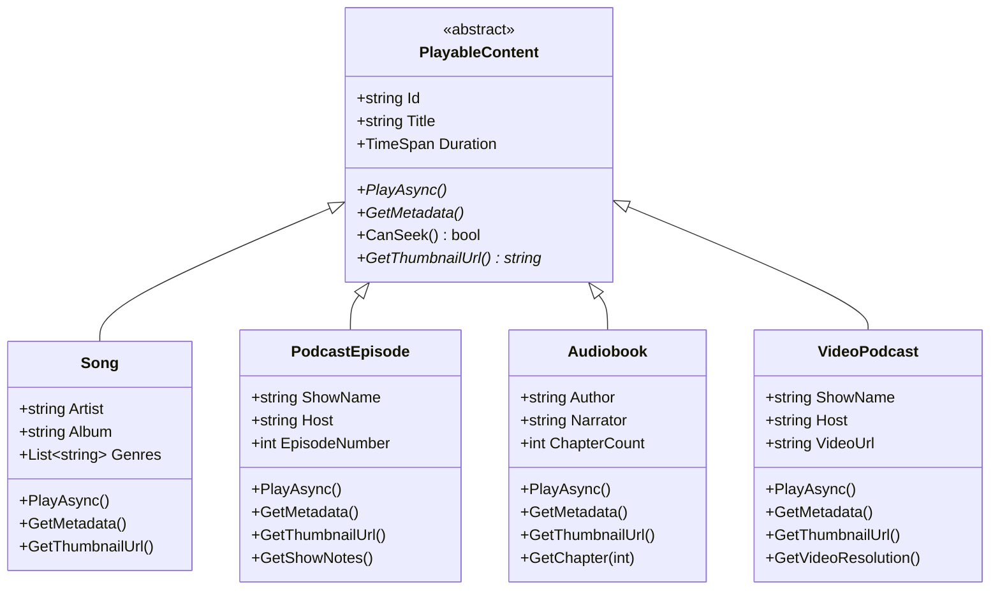
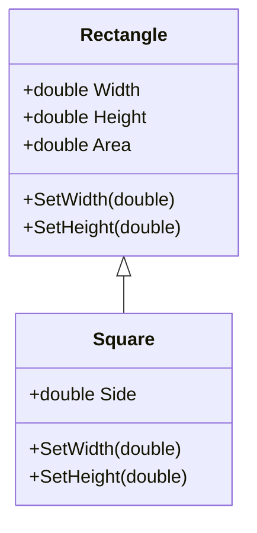
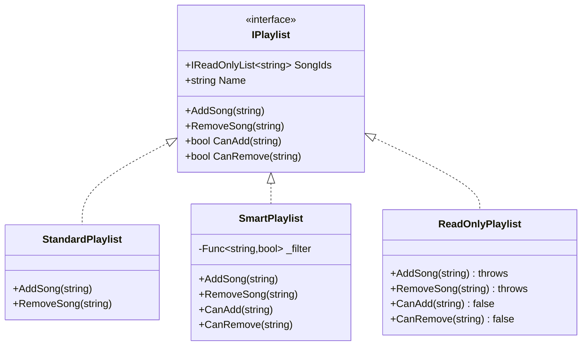
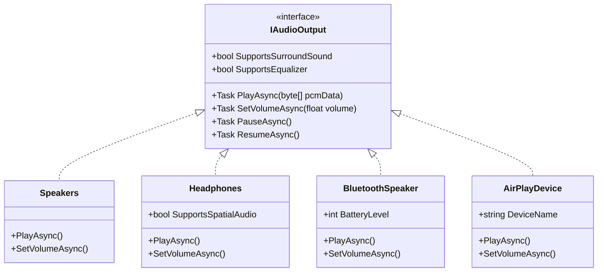
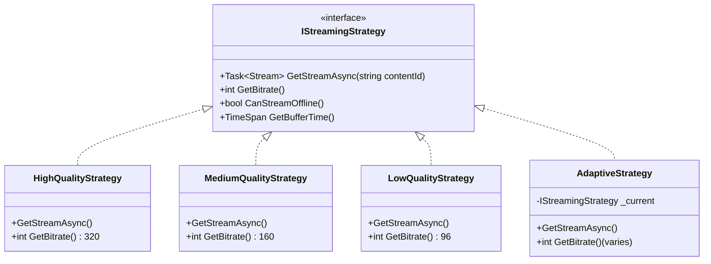

# Part 4: Liskov Substitution Principle
## Subtypes Must Be Substitutable - The .NET 10 Way

---

**Subtitle:**
How Spotify ensures that Songs, Podcasts, and Audioboks can be used interchangeably—without type checks, conditionals, or runtime surprises—using .NET 10, polymorphism, and contract-based design.

**Keywords:**
Liskov Substitution Principle, LSP, .NET 10, C# 13, Polymorphism, Inheritance, Contract Design, Covariance, Contravariance, Spotify system design

---

## Introduction: The Inheritance Trap

**The Legacy Violation:**
```csharp
public class Bird
{
    public virtual void Fly() { Console.WriteLine("Flying"); }
}

public class Penguin : Bird
{
    public override void Fly() 
    { 
        throw new InvalidOperationException("Penguins can't fly!"); 
    }
}

// Client code
public void MakeBirdFly(Bird bird)
{
    bird.Fly(); // Oops - crashes with Penguin
}
```

This is the classic Liskov violation. The client expects all birds to fly, but penguins don't. The only solution is type checking:

```csharp
public void MakeBirdFly(Bird bird)
{
    if (bird is Penguin)
    {
        Console.WriteLine("Penguin can't fly");
    }
    else
    {
        bird.Fly();
    }
}
```

Now every method that uses Bird needs to know about all its subtypes. The code becomes littered with type checks. Adding a new bird type (Ostrich) requires finding and updating every type check.

**The Redefined View:**
The Liskov Substitution Principle states that if `S` is a subtype of `T`, then objects of type `T` may be replaced with objects of type `S` without altering any of the desirable properties of the program.

In plain English: **Subclasses should behave like their base classes**. If a method works with the base class, it should work with any derived class without knowing about it.

**Why This Matters for Spotify:**

| Scenario | Without LSP | With LSP |
|----------|-------------|----------|
| Playing different content types | `if (content is Song) ... else if (content is Podcast) ...` | `content.Play()` works for all |
| Adding new content type | Find all type checks and update them | Add new class, everything works |
| Testing | Need tests for each type check combination | Test base contract once |
| Runtime errors | Unexpected exceptions from subtypes | Predictable behavior |

---

## The .NET 10 LSP Toolkit

### 1. Interface Segregation with LSP

```csharp
// WHY .NET 10: Well-designed interfaces support substitution
public interface IPlayable
{
    Task PlayAsync(CancellationToken ct = default);
    TimeSpan Duration { get; }
    string Title { get; }
}

// All playable types implement this
public class Song : IPlayable { }
public class PodcastEpisode : IPlayable { }
public class Audiobook : IPlayable { }
```

### 2. Abstract Base Classes

```csharp
// WHY .NET 10: Abstract classes define contracts with some implementation
public abstract class PlayableContent
{
    public abstract Task PlayAsync(CancellationToken ct = default);
    public abstract TimeSpan Duration { get; }
    public abstract string Title { get; }
    
    // Common behavior that all subtypes share
    public virtual string GetDisplayName() => Title;
}
```

### 3. Records with Inheritance

```csharp
// WHY .NET 10: Records provide value-based equality and immutability
public abstract record PlayableContent
{
    public required string Id { get; init; }
    public required string Title { get; init; }
    public required TimeSpan Duration { get; init; }
}

public record Song : PlayableContent
{
    public required string Artist { get; init; }
    public required string Album { get; init; }
}

public record PodcastEpisode : PlayableContent
{
    public required string ShowName { get; init; }
    public required int EpisodeNumber { get; init; }
}
```

### 4. Covariance and Contravariance

```csharp
// WHY .NET 10: Covariance allows more specific return types
public interface IProducer<out T>
{
    T Produce(); // Can return T or any subtype
}

// Contravariance allows more general parameters
public interface IConsumer<in T>
{
    void Consume(T item); // Can accept T or any base type
}
```

---

## Real Spotify Example 1: Playable Content Hierarchy

Spotify has multiple types of playable content: Songs, Podcast Episodes, Audiobooks, and soon Video Podcasts. The player should handle them all identically.



### The LSP-Compliant Implementation

```csharp
// ========== Base Abstract Class ==========

/// <summary>
/// RESPONSIBILITY: Define the contract for all playable content
/// All subtypes must honor this contract (LSP)
/// </summary>
public abstract class PlayableContent
{
    public required string Id { get; init; }
    public required string Title { get; init; }
    public abstract TimeSpan Duration { get; }
    
    /// <summary>
    /// Play the content - core behavior all subtypes must implement
    /// </summary>
    public abstract Task PlayAsync(CancellationToken cancellationToken = default);
    
    /// <summary>
    /// Get content metadata - all subtypes provide metadata
    /// </summary>
    public abstract Task<ContentMetadata> GetMetadataAsync(CancellationToken cancellationToken = default);
    
    /// <summary>
    /// Get thumbnail URL - all content has some visual representation
    /// </summary>
    public abstract string GetThumbnailUrl();
    
    /// <summary>
    /// Whether seeking is supported - default true, subtypes can override
    /// </summary>
    public virtual bool CanSeek => true;
    
    /// <summary>
    /// Get display title - common behavior all subtypes share
    /// </summary>
    public virtual string GetDisplayTitle() => Title;
}

public record ContentMetadata
{
    public required TimeSpan Duration { get; init; }
    public required string ContentType { get; init; }
    public DateTime? ReleaseDate { get; init; }
    public Dictionary<string, object> AdditionalMetadata { get; init; } = new();
}

// ========== Song Implementation ==========

/// <summary>
/// Song - fully substitutable for PlayableContent
/// </summary>
public class Song : PlayableContent
{
    public required string Artist { get; init; }
    public required string Album { get; init; }
    public int TrackNumber { get; init; }
    public List<string> Genres { get; init; } = new();
    private readonly TimeSpan _duration;
    
    public override TimeSpan Duration => _duration;
    
    public Song(TimeSpan duration)
    {
        _duration = duration;
    }
    
    public override async Task PlayAsync(CancellationToken cancellationToken = default)
    {
        // Song-specific playback logic
        Console.WriteLine($"🎵 Playing song: {Title} by {Artist}");
        await Task.Delay(100, cancellationToken); // Simulate playback start
    }
    
    public override async Task<ContentMetadata> GetMetadataAsync(CancellationToken cancellationToken = default)
    {
        await Task.Delay(10, cancellationToken);
        
        return new ContentMetadata
        {
            Duration = Duration,
            ContentType = "Song",
            ReleaseDate = DateTime.UtcNow.AddYears(-1),
            AdditionalMetadata = new Dictionary<string, object>
            {
                ["artist"] = Artist,
                ["album"] = Album,
                ["trackNumber"] = TrackNumber,
                ["genres"] = Genres
            }
        };
    }
    
    public override string GetThumbnailUrl()
    {
        return $"https://api.spotify.com/images/album/{Album}/thumbnail.jpg";
    }
    
    public override string GetDisplayTitle()
    {
        return $"{Title} - {Artist}";
    }
}

// ========== Podcast Episode Implementation ==========

/// <summary>
/// Podcast Episode - fully substitutable for PlayableContent
/// </summary>
public class PodcastEpisode : PlayableContent
{
    public required string ShowName { get; init; }
    public required string Host { get; init; }
    public int EpisodeNumber { get; init; }
    public string? ShowNotes { get; init; }
    private readonly TimeSpan _duration;
    
    public override TimeSpan Duration => _duration;
    
    public PodcastEpisode(TimeSpan duration)
    {
        _duration = duration;
    }
    
    public override async Task PlayAsync(CancellationToken cancellationToken = default)
    {
        // Podcast-specific playback logic
        Console.WriteLine($"🎙️ Playing podcast: {Title} from {ShowName}");
        await Task.Delay(100, cancellationToken);
    }
    
    public override async Task<ContentMetadata> GetMetadataAsync(CancellationToken cancellationToken = default)
    {
        await Task.Delay(10, cancellationToken);
        
        return new ContentMetadata
        {
            Duration = Duration,
            ContentType = "Podcast",
            ReleaseDate = DateTime.UtcNow.AddDays(-7),
            AdditionalMetadata = new Dictionary<string, object>
            {
                ["showName"] = ShowName,
                ["host"] = Host,
                ["episodeNumber"] = EpisodeNumber,
                ["showNotes"] = ShowNotes ?? ""
            }
        };
    }
    
    public override string GetThumbnailUrl()
    {
        return $"https://api.spotify.com/images/podcast/{ShowName}/thumbnail.jpg";
    }
    
    // Podcasts might have different seeking behavior
    public override bool CanSeek => true; // Still can seek
}

// ========== Audiobook Implementation ==========

/// <summary>
/// Audiobook - fully substitutable for PlayableContent
/// </summary>
public class Audiobook : PlayableContent
{
    public required string Author { get; init; }
    public required string Narrator { get; init; }
    public int ChapterCount { get; init; }
    private readonly TimeSpan _duration;
    
    public override TimeSpan Duration => _duration;
    
    public Audiobook(TimeSpan duration)
    {
        _duration = duration;
    }
    
    public override async Task PlayAsync(CancellationToken cancellationToken = default)
    {
        Console.WriteLine($"📚 Playing audiobook: {Title} by {Author}");
        await Task.Delay(100, cancellationToken);
    }
    
    public override async Task<ContentMetadata> GetMetadataAsync(CancellationToken cancellationToken = default)
    {
        await Task.Delay(10, cancellationToken);
        
        return new ContentMetadata
        {
            Duration = Duration,
            ContentType = "Audiobook",
            ReleaseDate = DateTime.UtcNow.AddMonths(-3),
            AdditionalMetadata = new Dictionary<string, object>
            {
                ["author"] = Author,
                ["narrator"] = Narrator,
                ["chapterCount"] = ChapterCount
            }
        };
    }
    
    public override string GetThumbnailUrl()
    {
        return $"https://api.spotify.com/images/audiobook/{Id}/thumbnail.jpg";
    }
    
    // Audiobooks support chapter navigation
    public async Task<Chapter> GetChapterAsync(int chapterNumber)
    {
        return new Chapter(chapterNumber, $"Chapter {chapterNumber}", TimeSpan.FromMinutes(chapterNumber * 15));
    }
}

public record Chapter(int Number, string Title, TimeSpan StartPosition);

// ========== Player That Uses Substitutability ==========

/// <summary>
/// RESPONSIBILITY: Play any content without knowing its concrete type
/// This class works with ANY PlayableContent (LSP in action)
/// </summary>
public class UniversalPlayer
{
    private readonly ILogger<UniversalPlayer> _logger;
    
    public UniversalPlayer(ILogger<UniversalPlayer> logger)
    {
        _logger = logger;
    }
    
    /// <summary>
    /// Play any playable content - no type checking required!
    /// </summary>
    public async Task PlayAsync(PlayableContent content, CancellationToken cancellationToken = default)
    {
        _logger.LogInformation("Playing content: {Title} (Type: {ContentType})", 
            content.GetDisplayTitle(), content.GetType().Name);
        
        // Display thumbnail - works for all types
        var thumbnailUrl = content.GetThumbnailUrl();
        _logger.LogDebug("Loading thumbnail from {ThumbnailUrl}", thumbnailUrl);
        
        // Get metadata - works for all types
        var metadata = await content.GetMetadataAsync(cancellationToken);
        _logger.LogInformation("Metadata: {@Metadata}", metadata);
        
        // Check if seeking is supported - virtual method with default
        if (content.CanSeek)
        {
            _logger.LogDebug("Seeking is supported for this content");
        }
        
        // Play the content - polymorphic call works for all types
        await content.PlayAsync(cancellationToken);
        
        _logger.LogInformation("Playback completed for {Title}", content.Title);
    }
    
    /// <summary>
    /// Play a playlist of mixed content types - all work together!
    /// </summary>
    public async Task PlayPlaylistAsync(IEnumerable<PlayableContent> playlist, CancellationToken cancellationToken = default)
    {
        var totalDuration = TimeSpan.Zero;
        var itemCount = 0;
        
        foreach (var content in playlist)
        {
            totalDuration += content.Duration;
            itemCount++;
        }
        
        _logger.LogInformation("Playing playlist with {Count} items, total duration {TotalDuration}", 
            itemCount, totalDuration);
        
        foreach (var content in playlist)
        {
            await PlayAsync(content, cancellationToken);
            
            if (cancellationToken.IsCancellationRequested)
                break;
        }
    }
}

// ========== Playlist Service ==========

/// <summary>
/// RESPONSIBILITY: Manage playlists with mixed content types
/// </summary>
public class PlaylistService
{
    private readonly IPlaylistRepository _repository;
    private readonly ILogger<PlaylistService> _logger;
    
    public PlaylistService(IPlaylistRepository repository, ILogger<PlaylistService> logger)
    {
        _repository = repository;
        _logger = logger;
    }
    
    public async Task<Playlist> CreatePlaylistAsync(string name, string userId)
    {
        var playlist = new Playlist
        {
            Id = Guid.NewGuid().ToString(),
            Name = name,
            OwnerId = userId,
            CreatedAt = DateTime.UtcNow
        };
        
        await _repository.SaveAsync(playlist);
        return playlist;
    }
    
    /// <summary>
    /// Add ANY playable content to playlist - no type restrictions
    /// </summary>
    public async Task AddToPlaylistAsync(string playlistId, PlayableContent content)
    {
        _logger.LogInformation("Adding {ContentType} '{Title}' to playlist {PlaylistId}", 
            content.GetType().Name, content.Title, playlistId);
        
        await _repository.AddContentAsync(playlistId, content.Id);
    }
}

// ========== Client Code - No Type Checks Needed ==========

public class LSPDemo
{
    public static async Task Main(string[] args)
    {
        // Create different types of content
        var song = new Song(TimeSpan.FromMinutes(3.5))
        {
            Id = "song-1",
            Title = "Bohemian Rhapsody",
            Artist = "Queen",
            Album = "A Night at the Opera",
            TrackNumber = 1,
            Genres = new List<string> { "Rock", "Progressive Rock" }
        };
        
        var podcast = new PodcastEpisode(TimeSpan.FromMinutes(45))
        {
            Id = "podcast-1",
            Title = "The Future of AI",
            ShowName = "Tech Today",
            Host = "John Smith",
            EpisodeNumber = 123,
            ShowNotes = "Discussion about AI advancements"
        };
        
        var audiobook = new Audiobook(TimeSpan.FromHours(8))
        {
            Id = "audiobook-1",
            Title = "Clean Code",
            Author = "Robert C. Martin",
            Narrator = "John Doe",
            ChapterCount = 17
        };
        
        // Setup logger
        using var loggerFactory = LoggerFactory.Create(b => b.AddConsole());
        var player = new UniversalPlayer(loggerFactory.CreateLogger<UniversalPlayer>());
        
        // Play each content type - same method works for all!
        Console.WriteLine("\n=== Playing individual content ===");
        await player.PlayAsync(song);
        Console.WriteLine();
        await player.PlayAsync(podcast);
        Console.WriteLine();
        await player.PlayAsync(audiobook);
        
        // Play a mixed playlist - all types together!
        Console.WriteLine("\n=== Playing mixed playlist ===");
        var playlist = new List<PlayableContent> { song, podcast, audiobook };
        await player.PlayPlaylistAsync(playlist);
        
        // Create a playlist service
        var repo = new MockPlaylistRepository();
        var playlistService = new PlaylistService(repo, loggerFactory.CreateLogger<PlaylistService>());
        
        var userPlaylist = await playlistService.CreatePlaylistAsync("My Favorites", "user-123");
        await playlistService.AddToPlaylistAsync(userPlaylist.Id, song);
        await playlistService.AddToPlaylistAsync(userPlaylist.Id, podcast);
        await playlistService.AddToPlaylistAsync(userPlaylist.Id, audiobook);
        
        Console.WriteLine("\n✅ LSP demonstrated: All content types used interchangeably");
        Console.WriteLine("  • UniversalPlayer works with any PlayableContent");
        Console.WriteLine("  • PlaylistService accepts any PlayableContent");
        Console.WriteLine("  • No type checking or conditionals anywhere");
        Console.WriteLine("  • Adding a new content type requires zero changes");
    }
}

public class MockPlaylistRepository : IPlaylistRepository
{
    private readonly Dictionary<string, Playlist> _playlists = new();
    private readonly Dictionary<string, List<string>> _playlistContents = new();
    
    public Task SaveAsync(Playlist playlist)
    {
        _playlists[playlist.Id] = playlist;
        _playlistContents[playlist.Id] = new List<string>();
        return Task.CompletedTask;
    }
    
    public Task AddContentAsync(string playlistId, string contentId)
    {
        if (_playlistContents.TryGetValue(playlistId, out var contents))
        {
            contents.Add(contentId);
        }
        return Task.CompletedTask;
    }
}

public interface IPlaylistRepository
{
    Task SaveAsync(Playlist playlist);
    Task AddContentAsync(string playlistId, string contentId);
}

public class Playlist
{
    public required string Id { get; set; }
    public required string Name { get; set; }
    public required string OwnerId { get; set; }
    public DateTime CreatedAt { get; set; }
}
```

**LSP Benefits Achieved:**
- **UniversalPlayer** works with any `PlayableContent` without type checks
- **PlaylistService** accepts any content type
- **Adding VideoPodcast** requires zero changes to existing code
- **Testing** one contract covers all subtypes
- **Runtime safety** - no unexpected exceptions from subtype behavior

---

## Real Spotify Example 2: The Rectangle-Square Problem

This classic LSP violation appears in many forms. Let's see how it might manifest in Spotify and how to fix it.



### The Violation

```csharp
// BAD - Square inherits from Rectangle
public class Rectangle
{
    public virtual double Width { get; set; }
    public virtual double Height { get; set; }
    
    public double Area => Width * Height;
    
    public virtual void SetWidth(double width)
    {
        Width = width;
    }
    
    public virtual void SetHeight(double height)
    {
        Height = height;
    }
}

public class Square : Rectangle
{
    public override double Width
    {
        get => base.Width;
        set
        {
            base.Width = value;
            base.Height = value; // Maintain square invariant
        }
    }
    
    public override double Height
    {
        get => base.Height;
        set
        {
            base.Width = value;
            base.Height = value; // Maintain square invariant
        }
    }
    
    public override void SetWidth(double width)
    {
        base.SetWidth(width);
        base.SetHeight(width);
    }
    
    public override void SetHeight(double height)
    {
        base.SetWidth(height);
        base.SetHeight(height);
    }
}

// Client code that expects Rectangle behavior
public class GeometryService
{
    public void ResizeRectangle(Rectangle rect)
    {
        rect.SetWidth(5);
        rect.SetHeight(10);
        
        Console.WriteLine($"Area: {rect.Area}"); // Expects 50
        
        // With Square, this prints 100 - violates expectations!
    }
}
```

### The Spotify Analogy

Imagine this with playlists:

```csharp
// BAD - SmartPlaylist inherits from Playlist but behaves differently
public class Playlist
{
    public virtual List<string> SongIds { get; set; } = new();
    public virtual string Name { get; set; }
    
    public virtual void AddSong(string songId)
    {
        SongIds.Add(songId);
    }
    
    public virtual void RemoveSong(string songId)
    {
        SongIds.Remove(songId);
    }
    
    public int Count => SongIds.Count;
}

public class SmartPlaylist : Playlist
{
    private readonly Func<string, bool> _filter;
    
    public SmartPlaylist(Func<string, bool> filter)
    {
        _filter = filter;
    }
    
    // Override to enforce filter
    public override void AddSong(string songId)
    {
        if (!_filter(songId))
        {
            throw new InvalidOperationException("Song doesn't match playlist filter");
        }
        base.AddSong(songId);
    }
    
    // Can't remove from smart playlist
    public override void RemoveSong(string songId)
    {
        throw new NotSupportedException("Cannot manually remove from smart playlist");
    }
}

// Client code expecting normal playlist behavior
public class PlaylistManager
{
    public void AddSongs(Playlist playlist, List<string> songIds)
    {
        foreach (var songId in songIds)
        {
            playlist.AddSong(songId); // May throw with SmartPlaylist
        }
    }
    
    public void ClearPlaylist(Playlist playlist)
    {
        playlist.SongIds.Clear(); // May not be allowed
    }
}
```

### The LSP-Compliant Solution



### The Implementation

```csharp
// ========== Better Design - Interface with Precondition Checks ==========

/// <summary>
/// RESPONSIBILITY: Define playlist contract with preconditions
/// </summary>
public interface IPlaylist
{
    string Id { get; }
    string Name { get; }
    IReadOnlyList<string> SongIds { get; }
    
    /// <summary>
    /// Add a song to the playlist
    /// Precondition: CanAdd(songId) must be true
    /// Postcondition: SongIds.Contains(songId) will be true
    /// </summary>
    Task AddSongAsync(string songId, CancellationToken ct = default);
    
    /// <summary>
    /// Remove a song from the playlist
    /// Precondition: CanRemove(songId) must be true
    /// Postcondition: SongIds.Contains(songId) will be false
    /// </summary>
    Task RemoveSongAsync(string songId, CancellationToken ct = default);
    
    /// <summary>
    /// Check if a song can be added (precondition)
    /// </summary>
    bool CanAdd(string songId);
    
    /// <summary>
    /// Check if a song can be removed (precondition)
    /// </summary>
    bool CanRemove(string songId);
    
    /// <summary>
    /// Get total duration of all songs
    /// </summary>
    Task<TimeSpan> GetTotalDurationAsync(CancellationToken ct = default);
}

// ========== Standard Playlist ==========

public class StandardPlaylist : IPlaylist
{
    private readonly List<string> _songIds = new();
    private readonly ISongRepository _songRepository;
    private readonly ILogger<StandardPlaylist> _logger;
    
    public string Id { get; }
    public string Name { get; }
    public IReadOnlyList<string> SongIds => _songIds.AsReadOnly();
    
    public StandardPlaylist(
        string id, 
        string name, 
        ISongRepository songRepository,
        ILogger<StandardPlaylist> logger)
    {
        Id = id;
        Name = name;
        _songRepository = songRepository;
        _logger = logger;
    }
    
    public bool CanAdd(string songId)
    {
        return !_songIds.Contains(songId); // No duplicates
    }
    
    public bool CanRemove(string songId)
    {
        return _songIds.Contains(songId);
    }
    
    public async Task AddSongAsync(string songId, CancellationToken ct = default)
    {
        if (!CanAdd(songId))
        {
            throw new InvalidOperationException($"Song {songId} already in playlist");
        }
        
        // Verify song exists
        var song = await _songRepository.GetByIdAsync(songId, ct);
        if (song == null)
        {
            throw new ArgumentException($"Song {songId} not found");
        }
        
        _songIds.Add(songId);
        _logger.LogDebug("Added song {SongId} to playlist {PlaylistId}", songId, Id);
    }
    
    public async Task RemoveSongAsync(string songId, CancellationToken ct = default)
    {
        if (!CanRemove(songId))
        {
            throw new InvalidOperationException($"Song {songId} not in playlist");
        }
        
        _songIds.Remove(songId);
        _logger.LogDebug("Removed song {SongId} from playlist {PlaylistId}", songId, Id);
    }
    
    public async Task<TimeSpan> GetTotalDurationAsync(CancellationToken ct = default)
    {
        if (!_songIds.Any())
            return TimeSpan.Zero;
            
        var songs = await _songRepository.GetByIdsAsync(_songIds, ct);
        return TimeSpan.FromTicks(songs.Sum(s => s.Duration.Ticks));
    }
}

// ========== Smart Playlist (Dynamic) ==========

public class SmartPlaylist : IPlaylist
{
    private readonly ISongRepository _songRepository;
    private readonly Func<Song, bool> _filter;
    private readonly ILogger<SmartPlaylist> _logger;
    private List<string>? _cachedSongIds;
    private DateTime _cacheTime;
    
    public string Id { get; }
    public string Name { get; }
    
    public IReadOnlyList<string> SongIds
    {
        get
        {
            if (_cachedSongIds == null || (DateTime.UtcNow - _cacheTime) > TimeSpan.FromMinutes(5))
            {
                RefreshCache().Wait(); // In real code, make this async
            }
            return _cachedSongIds!.AsReadOnly();
        }
    }
    
    public SmartPlaylist(
        string id,
        string name,
        Func<Song, bool> filter,
        ISongRepository songRepository,
        ILogger<SmartPlaylist> logger)
    {
        Id = id;
        Name = name;
        _filter = filter;
        _songRepository = songRepository;
        _logger = logger;
    }
    
    public bool CanAdd(string songId)
    {
        // Smart playlists don't support manual add
        return false;
    }
    
    public bool CanRemove(string songId)
    {
        // Smart playlists don't support manual remove
        return false;
    }
    
    public Task AddSongAsync(string songId, CancellationToken ct = default)
    {
        throw new NotSupportedException("Smart playlists do not support manual addition");
    }
    
    public Task RemoveSongAsync(string songId, CancellationToken ct = default)
    {
        throw new NotSupportedException("Smart playlists do not support manual removal");
    }
    
    public async Task<TimeSpan> GetTotalDurationAsync(CancellationToken ct = default)
    {
        var songs = await GetFilteredSongsAsync(ct);
        return TimeSpan.FromTicks(songs.Sum(s => s.Duration.Ticks));
    }
    
    private async Task<List<string>> GetFilteredSongIdsAsync(CancellationToken ct)
    {
        var songs = await GetFilteredSongsAsync(ct);
        return songs.Select(s => s.Id).ToList();
    }
    
    private async Task<List<Song>> GetFilteredSongsAsync(CancellationToken ct)
    {
        var allSongs = await _songRepository.GetAllAsync(ct);
        return allSongs.Where(_filter).ToList();
    }
    
    private async Task RefreshCache()
    {
        _cachedSongIds = await GetFilteredSongIdsAsync(CancellationToken.None);
        _cacheTime = DateTime.UtcNow;
    }
}

// ========== Read-Only Playlist (Shared/Collaborative) ==========

public class ReadOnlyPlaylist : IPlaylist
{
    private readonly IPlaylist _inner;
    private readonly ILogger<ReadOnlyPlaylist> _logger;
    
    public string Id => _inner.Id;
    public string Name => _inner.Name;
    public IReadOnlyList<string> SongIds => _inner.SongIds;
    
    public ReadOnlyPlaylist(IPlaylist inner, ILogger<ReadOnlyPlaylist> logger)
    {
        _inner = inner;
        _logger = logger;
    }
    
    public bool CanAdd(string songId) => false;
    public bool CanRemove(string songId) => false;
    
    public Task AddSongAsync(string songId, CancellationToken ct = default)
    {
        throw new NotSupportedException("This playlist is read-only");
    }
    
    public Task RemoveSongAsync(string songId, CancellationToken ct = default)
    {
        throw new NotSupportedException("This playlist is read-only");
    }
    
    public Task<TimeSpan> GetTotalDurationAsync(CancellationToken ct = default)
    {
        return _inner.GetTotalDurationAsync(ct);
    }
}

// ========== Client Code That Respects Preconditions ==========

public class PlaylistOperationsService
{
    private readonly ILogger<PlaylistOperationsService> _logger;
    
    public PlaylistOperationsService(ILogger<PlaylistOperationsService> logger)
    {
        _logger = logger;
    }
    
    /// <summary>
    /// Safely adds songs by checking preconditions first
    /// </summary>
    public async Task<int> AddSongsSafelyAsync(
        IPlaylist playlist, 
        List<string> songIds, 
        CancellationToken ct = default)
    {
        var added = 0;
        
        foreach (var songId in songIds)
        {
            if (playlist.CanAdd(songId))
            {
                try
                {
                    await playlist.AddSongAsync(songId, ct);
                    added++;
                }
                catch (Exception ex)
                {
                    _logger.LogError(ex, "Failed to add song {SongId}", songId);
                }
            }
            else
            {
                _logger.LogDebug("Skipping song {SongId} - cannot add to this playlist", songId);
            }
        }
        
        return added;
    }
    
    /// <summary>
    /// Gets playlist summary without assuming modification capabilities
    /// </summary>
    public async Task<PlaylistSummary> GetSummaryAsync(IPlaylist playlist, CancellationToken ct = default)
    {
        return new PlaylistSummary
        {
            Id = playlist.Id,
            Name = playlist.Name,
            SongCount = playlist.SongIds.Count,
            TotalDuration = await playlist.GetTotalDurationAsync(ct),
            IsReadOnly = !playlist.CanAdd("dummy") // Check capability
        };
    }
}

public record PlaylistSummary
{
    public required string Id { get; init; }
    public required string Name { get; init; }
    public int SongCount { get; init; }
    public TimeSpan TotalDuration { get; init; }
    public bool IsReadOnly { get; init; }
}
```

**LSP Benefits Achieved:**
- **Clear preconditions** via `CanAdd`/`CanRemove`
- **Clients can check** before attempting operations
- **All playlists implement** the same interface
- **No surprises** - behavior is predictable
- **SmartPlaylist** doesn't violate expectations

---

## Real Spotify Example 3: Audio Output Devices

Different output devices have different capabilities, but the audio player should work with all of them.



### The Implementation

```csharp
// ========== Audio Output Interface ==========

/// <summary>
/// RESPONSIBILITY: Define contract for audio output devices
/// All devices must honor this contract (LSP)
/// </summary>
public interface IAudioOutput
{
    /// <summary>
    /// Play PCM audio data
    /// </summary>
    Task PlayAsync(byte[] pcmData, CancellationToken cancellationToken = default);
    
    /// <summary>
    /// Set volume (0.0 to 1.0)
    /// </summary>
    Task SetVolumeAsync(float volume, CancellationToken cancellationToken = default);
    
    /// <summary>
    /// Pause playback
    /// </summary>
    Task PauseAsync(CancellationToken cancellationToken = default);
    
    /// <summary>
    /// Resume playback
    /// </summary>
    Task ResumeAsync(CancellationToken cancellationToken = default);
    
    /// <summary>
    /// Stop playback and release resources
    /// </summary>
    Task StopAsync(CancellationToken cancellationToken = default);
    
    /// <summary>
    /// Device name
    /// </summary>
    string DeviceName { get; }
    
    /// <summary>
    /// Whether device is connected
    /// </summary>
    bool IsConnected { get; }
    
    /// <summary>
    /// Supported features - can be empty
    /// </summary>
    IReadOnlySet<AudioFeature> SupportedFeatures { get; }
    
    /// <summary>
    /// Get current device status
    /// </summary>
    DeviceStatus GetStatus();
}

public enum AudioFeature
{
    VolumeControl,
    SurroundSound,
    Equalizer,
    SpatialAudio,
    BatteryReporting,
    MultiRoom
}

public record DeviceStatus
{
    public required bool IsPlaying { get; init; }
    public float CurrentVolume { get; init; }
    public int? BatteryLevel { get; init; }
    public string? ErrorMessage { get; init; }
}

// ========== Speakers Implementation ==========

public class Speakers : IAudioOutput
{
    private readonly IAudioHardware _hardware;
    private readonly ILogger<Speakers> _logger;
    private bool _isPlaying;
    private float _volume = 0.5f;
    
    public string DeviceName => "Built-in Speakers";
    public bool IsConnected => true; // Always connected
    public IReadOnlySet<AudioFeature> SupportedFeatures => new HashSet<AudioFeature>
    {
        AudioFeature.VolumeControl
    };
    
    public Speakers(IAudioHardware hardware, ILogger<Speakers> logger)
    {
        _hardware = hardware;
        _logger = logger;
    }
    
    public async Task PlayAsync(byte[] pcmData, CancellationToken cancellationToken = default)
    {
        _logger.LogDebug("Speakers playing {DataLength} bytes", pcmData.Length);
        await _hardware.OutputAudioAsync(pcmData, _volume, cancellationToken);
        _isPlaying = true;
    }
    
    public async Task SetVolumeAsync(float volume, CancellationToken cancellationToken = default)
    {
        _volume = Math.Clamp(volume, 0f, 1f);
        _logger.LogDebug("Speakers volume set to {Volume}", _volume);
        await _hardware.SetVolumeAsync(_volume, cancellationToken);
    }
    
    public Task PauseAsync(CancellationToken cancellationToken = default)
    {
        _logger.LogDebug("Speakers paused");
        _isPlaying = false;
        return Task.CompletedTask;
    }
    
    public Task ResumeAsync(CancellationToken cancellationToken = default)
    {
        _logger.LogDebug("Speakers resumed");
        _isPlaying = true;
        return Task.CompletedTask;
    }
    
    public async Task StopAsync(CancellationToken cancellationToken = default)
    {
        _logger.LogDebug("Speakers stopped");
        _isPlaying = false;
        await _hardware.StopAsync(cancellationToken);
    }
    
    public DeviceStatus GetStatus()
    {
        return new DeviceStatus
        {
            IsPlaying = _isPlaying,
            CurrentVolume = _volume
        };
    }
}

// ========== Bluetooth Headphones Implementation ==========

public class BluetoothHeadphones : IAudioOutput
{
    private readonly IBluetoothService _bluetooth;
    private readonly ILogger<BluetoothHeadphones> _logger;
    private bool _isPlaying;
    private float _volume = 0.5f;
    private int _batteryLevel;
    
    public string DeviceName { get; }
    public bool IsConnected { get; private set; }
    
    public IReadOnlySet<AudioFeature> SupportedFeatures => new HashSet<AudioFeature>
    {
        AudioFeature.VolumeControl,
        AudioFeature.BatteryReporting,
        AudioFeature.SpatialAudio
    };
    
    public BluetoothHeadphones(
        string deviceName,
        IBluetoothService bluetooth,
        ILogger<BluetoothHeadphones> logger)
    {
        DeviceName = deviceName;
        _bluetooth = bluetooth;
        _logger = logger;
        IsConnected = true;
        _batteryLevel = 80;
    }
    
    public async Task PlayAsync(byte[] pcmData, CancellationToken cancellationToken = default)
    {
        if (!IsConnected)
        {
            throw new InvalidOperationException("Headphones not connected");
        }
        
        _logger.LogDebug("{DeviceName} playing {DataLength} bytes", DeviceName, pcmData.Length);
        
        // Bluetooth has lower bandwidth - might need compression
        var compressedData = await CompressForBluetoothAsync(pcmData, cancellationToken);
        await _bluetooth.SendAudioAsync(compressedData, cancellationToken);
        
        _isPlaying = true;
        
        // Update battery level
        _batteryLevel = await _bluetooth.GetBatteryLevelAsync(cancellationToken);
    }
    
    public async Task SetVolumeAsync(float volume, CancellationToken cancellationToken = default)
    {
        _volume = Math.Clamp(volume, 0f, 1f);
        _logger.LogDebug("{DeviceName} volume set to {Volume}", DeviceName, _volume);
        await _bluetooth.SetVolumeAsync(_volume, cancellationToken);
    }
    
    public Task PauseAsync(CancellationToken cancellationToken = default)
    {
        _logger.LogDebug("{DeviceName} paused", DeviceName);
        _isPlaying = false;
        return _bluetooth.PauseAsync(cancellationToken);
    }
    
    public Task ResumeAsync(CancellationToken cancellationToken = default)
    {
        _logger.LogDebug("{DeviceName} resumed", DeviceName);
        _isPlaying = true;
        return _bluetooth.ResumeAsync(cancellationToken);
    }
    
    public async Task StopAsync(CancellationToken cancellationToken = default)
    {
        _logger.LogDebug("{DeviceName} stopped", DeviceName);
        _isPlaying = false;
        await _bluetooth.DisconnectAsync(cancellationToken);
        IsConnected = false;
    }
    
    public DeviceStatus GetStatus()
    {
        return new DeviceStatus
        {
            IsPlaying = _isPlaying,
            CurrentVolume = _volume,
            BatteryLevel = _batteryLevel
        };
    }
    
    private Task<byte[]> CompressForBluetoothAsync(byte[] pcmData, CancellationToken ct)
    {
        // Simulate compression
        return Task.FromResult(pcmData); // Simplified
    }
}

// ========== AirPlay Device Implementation ==========

public class AirPlayDevice : IAudioOutput
{
    private readonly IAirPlayService _airPlay;
    private readonly ILogger<AirPlayDevice> _logger;
    private bool _isPlaying;
    private float _volume = 0.5f;
    
    public string DeviceName { get; }
    public bool IsConnected { get; private set; }
    
    public IReadOnlySet<AudioFeature> SupportedFeatures => new HashSet<AudioFeature>
    {
        AudioFeature.VolumeControl,
        AudioFeature.MultiRoom
    };
    
    public AirPlayDevice(
        string deviceName,
        IAirPlayService airPlay,
        ILogger<AirPlayDevice> logger)
    {
        DeviceName = deviceName;
        _airPlay = airPlay;
        _logger = logger;
        IsConnected = true;
    }
    
    public async Task PlayAsync(byte[] pcmData, CancellationToken cancellationToken = default)
    {
        _logger.LogDebug("{DeviceName} streaming via AirPlay", DeviceName);
        
        // AirPlay uses network streaming
        await _airPlay.StreamAudioAsync(pcmData, cancellationToken);
        _isPlaying = true;
    }
    
    public async Task SetVolumeAsync(float volume, CancellationToken cancellationToken = default)
    {
        _volume = Math.Clamp(volume, 0f, 1f);
        await _airPlay.SetVolumeAsync(_volume, cancellationToken);
    }
    
    public Task PauseAsync(CancellationToken cancellationToken = default)
    {
        _isPlaying = false;
        return _airPlay.PauseAsync(cancellationToken);
    }
    
    public Task ResumeAsync(CancellationToken cancellationToken = default)
    {
        _isPlaying = true;
        return _airPlay.ResumeAsync(cancellationToken);
    }
    
    public async Task StopAsync(CancellationToken cancellationToken = default)
    {
        _isPlaying = false;
        await _airPlay.StopAsync(cancellationToken);
        IsConnected = false;
    }
    
    public DeviceStatus GetStatus()
    {
        return new DeviceStatus
        {
            IsPlaying = _isPlaying,
            CurrentVolume = _volume
        };
    }
}

// ========== Audio Router That Works With Any Output ==========

/// <summary>
/// RESPONSIBILITY: Route audio to any output device
/// Works with ANY IAudioOutput (LSP in action)
/// </summary>
public class AudioRouter
{
    private readonly ILogger<AudioRouter> _logger;
    private IAudioOutput? _currentOutput;
    
    public AudioRouter(ILogger<AudioRouter> logger)
    {
        _logger = logger;
    }
    
    public async Task PlayToDeviceAsync(IAudioOutput output, byte[] audioData, CancellationToken ct = default)
    {
        _logger.LogInformation("Routing audio to {DeviceName}", output.DeviceName);
        
        if (!output.IsConnected)
        {
            _logger.LogWarning("Device {DeviceName} is not connected", output.DeviceName);
            throw new DeviceNotConnectedException(output.DeviceName);
        }
        
        // Check supported features - but don't assume any
        if (output.SupportedFeatures.Contains(AudioFeature.VolumeControl))
        {
            _logger.LogDebug("Device supports volume control");
        }
        
        // Play audio - works for all devices
        await output.PlayAsync(audioData, ct);
        _currentOutput = output;
        
        // Get status - works for all devices
        var status = output.GetStatus();
        _logger.LogInformation("Device status: {@Status}", status);
    }
    
    public async Task SetVolumeAsync(float volume, CancellationToken ct = default)
    {
        if (_currentOutput == null)
        {
            throw new InvalidOperationException("No active output device");
        }
        
        // All devices support SetVolumeAsync per interface contract
        await _currentOutput.SetVolumeAsync(volume, ct);
    }
    
    public async Task StopAsync(CancellationToken ct = default)
    {
        if (_currentOutput != null)
        {
            await _currentOutput.StopAsync(ct);
            _currentOutput = null;
        }
    }
}

public class DeviceNotConnectedException : Exception
{
    public string DeviceName { get; }
    
    public DeviceNotConnectedException(string deviceName) 
        : base($"Device {deviceName} is not connected")
    {
        DeviceName = deviceName;
    }
}
```

**LSP Benefits Achieved:**
- **All devices** implement the same interface
- **AudioRouter** works with any device without special cases
- **Features** are reported via `SupportedFeatures`, not assumed
- **Status** provides consistent information
- **New device types** can be added without changing router

---

## Real Spotify Example 4: Streaming Quality Strategies

Different users have different quality needs based on subscription and network conditions.



### The Implementation

```csharp
// ========== Streaming Strategy Interface ==========

public interface IStreamingStrategy
{
    /// <summary>
    /// Get audio stream for content
    /// </summary>
    Task<Stream> GetStreamAsync(string contentId, CancellationToken cancellationToken = default);
    
    /// <summary>
    /// Bitrate in kbps
    /// </summary>
    int Bitrate { get; }
    
    /// <summary>
    /// Whether this strategy supports offline playback
    /// </summary>
    bool SupportsOffline { get; }
    
    /// <summary>
    /// Recommended buffer time in seconds
    /// </summary>
    TimeSpan RecommendedBufferTime { get; }
    
    /// <summary>
    /// Get strategy name
    /// </summary>
    string StrategyName { get; }
}

// ========== Concrete Strategies ==========

public class HighQualityStrategy : IStreamingStrategy
{
    private readonly IHttpClientFactory _httpClientFactory;
    private readonly ILogger<HighQualityStrategy> _logger;
    
    public int Bitrate => 320;
    public bool SupportsOffline => true;
    public TimeSpan RecommendedBufferTime => TimeSpan.FromSeconds(2);
    public string StrategyName => "High Quality (320kbps)";
    
    public HighQualityStrategy(
        IHttpClientFactory httpClientFactory,
        ILogger<HighQualityStrategy> logger)
    {
        _httpClientFactory = httpClientFactory;
        _logger = logger;
    }
    
    public async Task<Stream> GetStreamAsync(string contentId, CancellationToken cancellationToken = default)
    {
        _logger.LogInformation("Streaming {ContentId} at 320kbps", contentId);
        
        var client = _httpClientFactory.CreateClient("Streaming");
        var url = $"https://stream.spotify.com/{contentId}?quality=320";
        
        var response = await client.GetAsync(url, HttpCompletionOption.ResponseHeadersRead, cancellationToken);
        response.EnsureSuccessStatusCode();
        
        return await response.Content.ReadAsStreamAsync(cancellationToken);
    }
}

public class MediumQualityStrategy : IStreamingStrategy
{
    private readonly IHttpClientFactory _httpClientFactory;
    private readonly ILogger<MediumQualityStrategy> _logger;
    
    public int Bitrate => 160;
    public bool SupportsOffline => true;
    public TimeSpan RecommendedBufferTime => TimeSpan.FromSeconds(3);
    public string StrategyName => "Medium Quality (160kbps)";
    
    public MediumQualityStrategy(
        IHttpClientFactory httpClientFactory,
        ILogger<MediumQualityStrategy> logger)
    {
        _httpClientFactory = httpClientFactory;
        _logger = logger;
    }
    
    public async Task<Stream> GetStreamAsync(string contentId, CancellationToken cancellationToken = default)
    {
        _logger.LogInformation("Streaming {ContentId} at 160kbps", contentId);
        
        var client = _httpClientFactory.CreateClient("Streaming");
        var url = $"https://stream.spotify.com/{contentId}?quality=160";
        
        var response = await client.GetAsync(url, HttpCompletionOption.ResponseHeadersRead, cancellationToken);
        response.EnsureSuccessStatusCode();
        
        return await response.Content.ReadAsStreamAsync(cancellationToken);
    }
}

public class LowQualityStrategy : IStreamingStrategy
{
    private readonly IHttpClientFactory _httpClientFactory;
    private readonly ILogger<LowQualityStrategy> _logger;
    
    public int Bitrate => 96;
    public bool SupportsOffline => true;
    public TimeSpan RecommendedBufferTime => TimeSpan.FromSeconds(5);
    public string StrategyName => "Low Quality (96kbps)";
    
    public LowQualityStrategy(
        IHttpClientFactory httpClientFactory,
        ILogger<LowQualityStrategy> logger)
    {
        _httpClientFactory = httpClientFactory;
        _logger = logger;
    }
    
    public async Task<Stream> GetStreamAsync(string contentId, CancellationToken cancellationToken = default)
    {
        _logger.LogInformation("Streaming {ContentId} at 96kbps", contentId);
        
        var client = _httpClientFactory.CreateClient("Streaming");
        var url = $"https://stream.spotify.com/{contentId}?quality=96";
        
        var response = await client.GetAsync(url, HttpCompletionOption.ResponseHeadersRead, cancellationToken);
        response.EnsureSuccessStatusCode();
        
        return await response.Content.ReadAsStreamAsync(cancellationToken);
    }
}

public class AdaptiveStrategy : IStreamingStrategy
{
    private readonly INetworkService _networkService;
    private readonly IStreamingStrategy[] _strategies;
    private readonly ILogger<AdaptiveStrategy> _logger;
    private IStreamingStrategy _currentStrategy;
    
    public int Bitrate => _currentStrategy.Bitrate;
    public bool SupportsOffline => false; // Adaptive doesn't work offline
    public TimeSpan RecommendedBufferTime => TimeSpan.FromSeconds(10); // Larger buffer for adaptation
    public string StrategyName => $"Adaptive (current: {_currentStrategy.Bitrate}kbps)";
    
    public AdaptiveStrategy(
        INetworkService networkService,
        IEnumerable<IStreamingStrategy> strategies,
        ILogger<AdaptiveStrategy> logger)
    {
        _networkService = networkService;
        _strategies = strategies.OrderBy(s => s.Bitrate).ToArray();
        _currentStrategy = _strategies.First(); // Start with lowest
        _logger = logger;
    }
    
    public async Task<Stream> GetStreamAsync(string contentId, CancellationToken cancellationToken = default)
    {
        // Monitor network conditions
        var bandwidth = await _networkService.GetEstimatedBandwidthAsync(cancellationToken);
        
        // Select appropriate strategy based on bandwidth
        _currentStrategy = SelectStrategyForBandwidth(bandwidth);
        
        _logger.LogInformation("Adaptive streaming - bandwidth {Bandwidth}kbps, using {Strategy}", 
            bandwidth, _currentStrategy.StrategyName);
        
        // Use selected strategy
        return await _currentStrategy.GetStreamAsync(contentId, cancellationToken);
    }
    
    private IStreamingStrategy SelectStrategyForBandwidth(int bandwidthKbps)
    {
        // Need at least 2x bitrate for smooth streaming
        return _strategies.LastOrDefault(s => s.Bitrate * 2 <= bandwidthKbps) ?? _strategies.First();
    }
}

// ========== Streaming Service ==========

/// <summary>
/// RESPONSIBILITY: Stream content using any strategy
/// </summary>
public class StreamingService
{
    private readonly IStreamingStrategy _strategy;
    private readonly ILogger<StreamingService> _logger;
    
    public StreamingService(
        IStreamingStrategy strategy,
        ILogger<StreamingService> logger)
    {
        _strategy = strategy;
        _logger = logger;
    }
    
    public async Task PlayContentAsync(string contentId, CancellationToken cancellationToken = default)
    {
        _logger.LogInformation("Playing with strategy: {Strategy}", _strategy.StrategyName);
        _logger.LogInformation("Bitrate: {Bitrate}kbps", _strategy.Bitrate);
        _logger.LogInformation("Buffer time: {BufferTime}", _strategy.RecommendedBufferTime);
        
        if (_strategy.SupportsOffline)
        {
            _logger.LogInformation("Offline playback supported");
        }
        
        var stream = await _strategy.GetStreamAsync(contentId, cancellationToken);
        
        // Play the stream
        await PlayStreamAsync(stream, cancellationToken);
    }
    
    private async Task PlayStreamAsync(Stream stream, CancellationToken ct)
    {
        // Playback logic
        await Task.Delay(100, ct);
    }
}
```

**LSP Benefits Achieved:**
- **All strategies** implement the same interface
- **StreamingService** works with any strategy
- **AdaptiveStrategy** is itself a valid strategy
- **Properties** provide consistent information
- **Strategies** can be swapped at runtime

---

## LSP Anti-Patterns to Avoid

### 1. Throwing Unexpected Exceptions

```csharp
// BAD
public class ReadOnlyPlaylist : Playlist
{
    public override void AddSong(string songId)
    {
        throw new NotSupportedException("Can't add to read-only playlist");
    }
}
```

**Fix:** Design interface with capability checks

### 2. Strengthening Preconditions

```csharp
// BAD
public class PremiumOnlyPlaylist : Playlist
{
    private readonly IUserContext _userContext;
    
    public override void AddSong(string songId)
    {
        if (!_userContext.IsPremium)
        {
            throw new UnauthorizedAccessException("Premium required");
        }
        base.AddSong(songId);
    }
}
```

**Fix:** Check capabilities before calling

### 3. Weakening Postconditions

```csharp
// BAD
public class LimitedPlaylist : Playlist
{
    private const int MaxSongs = 50;
    
    public override void AddSong(string songId)
    {
        if (Count >= MaxSongs)
        {
            return; // Silently fails - violates postcondition
        }
        base.AddSong(songId);
    }
}
```

**Fix:** Return success indicator or throw consistent exception

### 4. Returning Different Types

```csharp
// BAD
public class SpecialPlaylist : Playlist
{
    public new List<SpecialSong> Songs { get; } = new();
    
    public override void AddSong(string songId)
    {
        // Doesn't maintain base class invariant
    }
}
```

**Fix:** Use generics or composition instead of inheritance

### 5. Type Checking in Client Code

```csharp
// BAD - tells you LSP is violated
public void HandlePlaylist(Playlist playlist)
{
    if (playlist is SmartPlaylist)
    {
        // Special handling
    }
    else if (playlist is ReadOnlyPlaylist)
    {
        // Different handling
    }
    // ...
}
```

**Fix:** Redesign hierarchy or use capability interfaces

---

## Testing for LSP Compliance

```csharp
public abstract class PlayableContentContractTests
{
    protected abstract PlayableContent CreateContent();
    
    [Fact]
    public async Task PlayAsync_ShouldCompleteWithoutException()
    {
        var content = CreateContent();
        var exception = await Record.ExceptionAsync(() => content.PlayAsync());
        Assert.Null(exception);
    }
    
    [Fact]
    public void GetThumbnailUrl_ShouldReturnValidUrl()
    {
        var content = CreateContent();
        var url = content.GetThumbnailUrl();
        
        Assert.NotNull(url);
        Assert.StartsWith("https://", url);
    }
    
    [Fact]
    public async Task GetMetadataAsync_ShouldReturnValidMetadata()
    {
        var content = CreateContent();
        var metadata = await content.GetMetadataAsync();
        
        Assert.NotNull(metadata);
        Assert.Equal(content.Duration, metadata.Duration);
        Assert.False(string.IsNullOrEmpty(metadata.ContentType));
    }
    
    [Fact]
    public void Duration_ShouldBePositive()
    {
        var content = CreateContent();
        Assert.True(content.Duration > TimeSpan.Zero);
    }
}

public class SongContractTests : PlayableContentContractTests
{
    protected override PlayableContent CreateContent()
    {
        return new Song(TimeSpan.FromMinutes(3))
        {
            Id = "test-song",
            Title = "Test Song",
            Artist = "Test Artist",
            Album = "Test Album"
        };
    }
    
    [Fact]
    public void Song_ShouldHaveArtistAndAlbum()
    {
        var song = (Song)CreateContent();
        Assert.NotNull(song.Artist);
        Assert.NotNull(song.Album);
    }
}

public class PodcastContractTests : PlayableContentContractTests
{
    protected override PlayableContent CreateContent()
    {
        return new PodcastEpisode(TimeSpan.FromMinutes(45))
        {
            Id = "test-podcast",
            Title = "Test Podcast",
            ShowName = "Test Show",
            Host = "Test Host",
            EpisodeNumber = 1
        };
    }
    
    [Fact]
    public void Podcast_ShouldHaveShowNameAndHost()
    {
        var podcast = (PodcastEpisode)CreateContent();
        Assert.NotNull(podcast.ShowName);
        Assert.NotNull(podcast.Host);
    }
}
```

---

## LSP Refactoring Checklist

When checking for LSP violations, ask these questions:

1. **Does the subtype maintain the base class invariants?**
2. **Does the subtype have weaker postconditions?**
3. **Does the subtype have stronger preconditions?**
4. **Does the subtype throw unexpected exceptions?**
5. **Do clients need to check the subtype type?**
6. **Can I substitute the subtype without changing client behavior?**
7. **Are there any `is` or `as` checks in client code?**

**The LSP Test:** If you have to ask "what type is this?" you've violated LSP.

---

## Conclusion: The LSP Mindset

The Liskov Substitution Principle is not about inheritance for code reuse. It's about **behavioral compatibility**—ensuring that when you use a subtype, it behaves in ways that the base type's contract promises.

**When you violate LSP:**
- Client code is littered with type checks
- Adding new subtypes requires finding all type checks
- Runtime exceptions from unexpected behavior
- Testing becomes combinatorial

**When you follow LSP:**
- Client code works with any subtype
- Adding new subtypes requires zero client changes
- Behavior is predictable and consistent
- Testing contracts once covers all subtypes

**The .NET 10 Advantage:**
- **Records with inheritance** provide value-based equality
- **Interfaces** define clear contracts
- **Default interface methods** allow evolution without breaking
- **Covariance/contravariance** enable flexible generic types
- **Required members** ensure proper initialization
- **Primary constructors** make dependencies explicit

---

## Next Up: Part 5 - Interface Segregation Principle

In Part 5, we'll explore the **Interface Segregation Principle** with:

- Fine-grained interfaces vs. fat interfaces
- Role interfaces with marker patterns
- Default interface methods for evolution
- Adapter pattern for third-party integration
- Real Spotify examples with .NET 10
- Mermaid diagrams for every concept

**Coming Up in Part 5:**
*Interface Segregation Principle: Don't Depend on What You Don't Use - The .NET 10 Way*

---